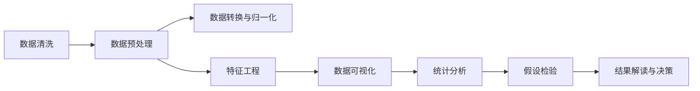

                 

# 数据清洗与统计分析原理与代码实战案例讲解

> 关键词：数据清洗, 数据预处理, 数据可视化, 统计分析, 数据科学, 机器学习, 案例讲解

## 1. 背景介绍

在当今数据驱动的世界中，数据的质量直接影响了基于数据驱动的决策和行动的准确性。无论是科学研究、商业决策还是公共政策制定，数据都扮演着至关重要的角色。然而，数据在收集和存储的过程中往往会因为各种原因而变得不准确、不完整或存在噪音。因此，数据清洗和统计分析成为了数据科学领域的一项基础且关键的任务。

### 1.1 问题由来

数据清洗（Data Cleaning）是指在数据进入分析和建模之前，识别并处理数据中的错误、重复或不完整的信息，从而提高数据的质量。这一过程包括去除无关数据、修正错误数据、填补缺失数据和标准化数据格式等。数据清洗是数据预处理（Data Preprocessing）的重要组成部分，旨在为后续的统计分析和机器学习建模提供高质量的数据输入。

统计分析（Statistical Analysis）则是对数据进行描述、解释和推断的过程，通常包括数据探索性分析（Exploratory Data Analysis, EDA）和假设检验等。通过对数据的统计分析，可以揭示数据的内在规律和关系，从而为决策提供依据。

### 1.2 问题核心关键点

数据清洗和统计分析的核心在于：

1. **数据质量提升**：确保数据准确、完整、一致，以便于后续分析。
2. **数据特征挖掘**：通过清洗和分析发现数据中的有用信息和模式。
3. **数据可视化**：利用图表和可视化工具帮助理解数据分布和关系。
4. **统计推断**：利用统计方法对数据进行推断和预测。

这些关键点构成了数据清洗和统计分析的基础，帮助数据科学从业者高效地进行数据分析和建模。

## 2. 核心概念与联系

### 2.1 核心概念概述

- **数据清洗（Data Cleaning）**：识别并修正数据中的错误、缺失和重复信息，保证数据质量。
- **数据预处理（Data Preprocessing）**：包括数据清洗、数据转换、数据归一化等步骤，为分析或建模做准备。
- **数据探索性分析（Exploratory Data Analysis, EDA）**：通过统计和可视化方法探索数据的基本特征和模式。
- **统计分析（Statistical Analysis）**：使用统计学方法对数据进行描述、解释和推断。
- **假设检验（Hypothesis Testing）**：通过检验假设来验证数据的统计关系和模式。
- **数据可视化（Data Visualization）**：使用图表和图形展示数据的关系和分布。

### 2.2 核心概念原理和架构的 Mermaid 流程图(Mermaid 流程节点中不要有括号、逗号等特殊字符)



这个流程图展示了数据清洗和统计分析的核心流程：从数据清洗开始，经过预处理和特征工程，通过数据可视化和统计分析进行探索性分析，最后通过假设检验得出结论并指导决策。

## 3. 核心算法原理 & 具体操作步骤

### 3.1 算法原理概述

数据清洗和统计分析的原理基于数据科学的基本统计学方法和算法，主要包括以下几个方面：

- **数据清洗**：包括识别和处理缺失值、异常值、重复值和错误值。
- **数据预处理**：包括数据转换、归一化和标准化等步骤，以保证数据的一致性和可比性。
- **数据可视化**：利用图表和图形展示数据的关系和分布，帮助理解数据特征。
- **统计分析**：通过描述性统计和推断性统计方法，揭示数据的内在规律和关系。
- **假设检验**：通过统计学检验来验证数据的统计关系和模式，确保分析结果的可靠性。

### 3.2 算法步骤详解

#### 数据清洗步骤详解

1. **数据检查**：检查数据的完整性、一致性和准确性，包括检查数据类型、范围和缺失值。
2. **处理缺失值**：决定是否填补缺失值或删除含有缺失值的记录。
3. **去除重复值**：识别和去除数据中的重复记录。
4. **纠正错误值**：识别和修正数据中的错误或异常值。
5. **数据标准化**：将数据转换为统一的格式和度量单位。

#### 数据预处理步骤详解

1. **数据转换**：将数据转换为适合分析的格式，如将类别数据转换为数值型数据。
2. **数据归一化**：将数据缩放到一个标准范围内，以便于比较。
3. **数据规范化**：将数据缩放到0和1之间，以便于模型训练。

#### 数据可视化和统计分析步骤详解

1. **数据可视化**：使用图表和图形展示数据的关系和分布，如散点图、柱状图、箱线图等。
2. **描述性统计**：计算数据的基本统计量，如均值、中位数、标准差等。
3. **推断性统计**：进行假设检验，如t检验、卡方检验、ANOVA等。

#### 假设检验步骤详解

1. **建立假设**：提出原假设（H0）和备择假设（H1）。
2. **选择检验统计量**：根据数据类型和假设选择适当的检验统计量。
3. **计算P值**：计算在原假设下，观测数据或更极端数据出现的概率。
4. **做出决策**：根据P值和显著性水平（α）判断是否拒绝原假设。

### 3.3 算法优缺点

数据清洗和统计分析的优点包括：

- **提高数据质量**：通过清洗和预处理，保证了数据的一致性和准确性。
- **发现数据模式**：通过统计分析和可视化，揭示数据的内在关系和规律。
- **支持决策**：为决策提供数据支持和依据，提升决策的科学性。

其缺点包括：

- **数据清洗复杂**：数据清洗过程可能需要大量时间和精力，特别是在数据量大的情况下。
- **依赖数据质量**：数据质量差时，清洗和分析的结果可能不可靠。
- **假设检验假设较强**：假设检验的前提假设较强，不满足时结果可能不准确。

### 3.4 算法应用领域

数据清洗和统计分析广泛应用于以下几个领域：

- **金融**：用于分析市场趋势、风险评估和投资决策。
- **医疗**：用于病人数据分析、疾病预测和治疗效果评估。
- **市场营销**：用于客户行为分析、市场细分和产品推荐。
- **社交媒体分析**：用于用户行为分析、情感分析和品牌管理。
- **自然语言处理**：用于文本分类、情感分析和语言模型训练。

## 4. 数学模型和公式 & 详细讲解 & 举例说明

### 4.1 数学模型构建

数据清洗和统计分析的数学模型主要包括：

- **数据清洗模型**：包括缺失值填补模型、异常值检测模型和重复值检测模型。
- **数据预处理模型**：包括数据转换模型、归一化模型和标准化模型。
- **描述性统计模型**：包括均值、中位数、标准差、方差等基本统计量。
- **推断性统计模型**：包括t检验、卡方检验、ANOVA等假设检验模型。

### 4.2 公式推导过程

#### 缺失值填补公式推导

假设数据集有n个样本，m个特征，其中第i个样本在j个特征上缺失。缺失值的填补方法包括均值填补、中位数填补和插值填补。这里以均值填补为例：

设$X_{ij}$为第i个样本在j个特征上的值，$\bar{X}_j$为特征j的均值。则均值填补的公式为：

$$
X_{ij}^{\text{filled}} = \bar{X}_j, \quad \text{if } X_{ij} \text{ is missing}
$$

#### 异常值检测公式推导

异常值检测的方法包括箱线图法、Z分数法和IQR法。这里以箱线图法为例：

设$X_i$为第i个样本的特征值，$Q_1$为第一四分位数，$Q_3$为第三四分位数，则异常值的检测公式为：

$$
\text{if } |X_i - Q_1| > 1.5(Q_3 - Q_1) \text{ or } |X_i - Q_3| > 1.5(Q_3 - Q_1)
$$

#### 描述性统计公式推导

描述性统计量包括均值$\mu$、中位数$M$、标准差$\sigma$和方差$\sigma^2$。以均值为例，假设数据集有n个样本，m个特征，第i个样本在j个特征上的值为$X_{ij}$。则均值的公式为：

$$
\mu_j = \frac{1}{n} \sum_{i=1}^{n} X_{ij}
$$

### 4.3 案例分析与讲解

#### 案例1：销售数据清洗

某电商公司收集了2019年全年的销售数据，包括销售额、销售量、客户数等。这些数据存在缺失值、重复值和异常值，需要进行清洗和预处理，以便于进行数据分析和建模。

**数据清洗**：
- 识别并处理缺失值：通过均值填补或删除含缺失值的记录。
- 去除重复值：使用去重算法或标记算法去除重复记录。
- 纠正错误值：检查并修正数据中的错误或异常值。

**数据预处理**：
- 数据转换：将类别数据转换为数值型数据，如将客户性别转换为1或0。
- 数据归一化：将数据缩放到0和1之间，如使用Min-Max归一化或Z-score标准化。

**数据可视化**：
- 使用散点图展示销售额与销售量的关系。
- 使用柱状图展示不同客户的销售额分布。

**统计分析**：
- 计算销售额的均值、中位数和标准差。
- 进行假设检验，如比较不同客户群体的销售额差异。

#### 案例2：金融数据探索性分析

某金融公司收集了2019年全年的股票价格数据，包括股票代码、开盘价、收盘价、成交量等。这些数据需要进行清洗和预处理，以便于进行风险评估和投资决策。

**数据清洗**：
- 识别并处理缺失值：通过插值填补或删除含缺失值的记录。
- 去除重复值：使用去重算法或标记算法去除重复记录。
- 纠正错误值：检查并修正数据中的错误或异常值。

**数据预处理**：
- 数据转换：将日期数据转换为时间戳。
- 数据归一化：将数据缩放到0和1之间，如使用Min-Max归一化或Z-score标准化。

**数据可视化**：
- 使用箱线图展示股票价格的时序变化。
- 使用散点图展示成交量与价格的关系。

**统计分析**：
- 计算每日交易量的均值、中位数和标准差。
- 进行假设检验，如比较不同时间段内的交易量差异。

## 5. 项目实践：代码实例和详细解释说明

### 5.1 开发环境搭建

在进行数据清洗和统计分析项目实践前，需要准备好开发环境。以下是使用Python进行数据清洗和统计分析的环境配置流程：

1. 安装Python：从官网下载并安装Python，建议安装3.8及以上版本。
2. 安装NumPy和Pandas：通过pip安装，方便进行数据处理和分析。
3. 安装Matplotlib和Seaborn：通过pip安装，用于数据可视化。
4. 安装SciPy和Scikit-learn：通过pip安装，用于高级统计分析和机器学习。
5. 安装Jupyter Notebook：通过pip安装，用于交互式数据处理和分析。

完成上述步骤后，即可在Python环境中开始数据清洗和统计分析项目实践。

### 5.2 源代码详细实现

这里我们以销售数据清洗和金融数据探索性分析为例，给出使用Python进行数据清洗和统计分析的代码实现。

#### 销售数据清洗

```python
import pandas as pd
import numpy as np
import matplotlib.pyplot as plt
from scipy import stats

# 读取数据
data = pd.read_csv('sales_data.csv')

# 数据清洗
# 处理缺失值
data.fillna(data.mean(), inplace=True)
# 去除重复值
data.drop_duplicates(inplace=True)
# 纠正错误值
data = data.replace({'total_sales': np.nan})

# 数据预处理
# 数据转换
data['gender'] = data['gender'].map({'female': 0, 'male': 1})
# 数据归一化
data['total_sales'] = (data['total_sales'] - data['total_sales'].min()) / (data['total_sales'].max() - data['total_sales'].min())

# 数据可视化
plt.scatter(data['sales_amount'], data['total_sales'])
plt.xlabel('Sales Amount')
plt.ylabel('Total Sales')
plt.title('Sales Amount vs. Total Sales')
plt.show()

# 统计分析
# 计算均值、中位数和标准差
mean_sales = data['sales_amount'].mean()
median_sales = data['sales_amount'].median()
std_sales = data['sales_amount'].std()

# 假设检验
t_stat, p_val = stats.ttest_ind(data[data['gender'] == 0]['sales_amount'], data[data['gender'] == 1]['sales_amount'])
print(f'T-statistic: {t_stat}, p-value: {p_val}')
```

#### 金融数据探索性分析

```python
import pandas as pd
import numpy as np
import matplotlib.pyplot as plt
from scipy import stats

# 读取数据
data = pd.read_csv('financial_data.csv')

# 数据清洗
# 处理缺失值
data.fillna(method='ffill', inplace=True)
# 去除重复值
data.drop_duplicates(inplace=True)
# 纠正错误值
data = data.replace({'open_price': np.nan})

# 数据预处理
# 数据转换
data['date'] = pd.to_datetime(data['date'])
data['open_price'] = data['open_price'].astype(float)
data['close_price'] = data['close_price'].astype(float)

# 数据归一化
data['open_price'] = (data['open_price'] - data['open_price'].min()) / (data['open_price'].max() - data['open_price'].min())
data['close_price'] = (data['close_price'] - data['close_price'].min()) / (data['close_price'].max() - data['close_price'].min())

# 数据可视化
plt.boxplot(data['close_price'])
plt.xlabel('Date')
plt.ylabel('Close Price')
plt.title('Close Price Distribution')
plt.show()

# 统计分析
# 计算均值、中位数和标准差
mean_price = data['close_price'].mean()
median_price = data['close_price'].median()
std_price = data['close_price'].std()

# 假设检验
t_stat, p_val = stats.ttest_ind(data[data['date'].dt.dayofweek == 0]['close_price'], data[data['date'].dt.dayofweek == 6]['close_price'])
print(f'T-statistic: {t_stat}, p-value: {p_val}')
```

### 5.3 代码解读与分析

#### 销售数据清洗代码解读

1. **数据读取**：使用pandas的`read_csv`函数读取销售数据文件，并将其存入DataFrame对象。
2. **数据清洗**：
   - 处理缺失值：使用`fillna`函数用均值填补缺失值。
   - 去除重复值：使用`drop_duplicates`函数去除重复记录。
   - 纠正错误值：使用`replace`函数将`total_sales`列中的NaN值替换为NaN。
3. **数据预处理**：
   - 数据转换：使用`map`函数将`gender`列中的字符串转换为0或1。
   - 数据归一化：使用Min-Max归一化将`total_sales`列缩放到0和1之间。
4. **数据可视化**：使用matplotlib的`scatter`函数绘制销售金额与总销售额的关系图。
5. **统计分析**：
   - 计算均值、中位数和标准差：使用pandas的`mean`、`median`和`std`函数。
   - 假设检验：使用scipy的`ttest_ind`函数进行独立样本t检验，比较男女客户的销售金额差异。

#### 金融数据探索性分析代码解读

1. **数据读取**：使用pandas的`read_csv`函数读取金融数据文件，并将其存入DataFrame对象。
2. **数据清洗**：
   - 处理缺失值：使用`fillna`函数用前向填充法填补缺失值。
   - 去除重复值：使用`drop_duplicates`函数去除重复记录。
   - 纠正错误值：使用`replace`函数将`open_price`列中的NaN值替换为NaN。
3. **数据预处理**：
   - 数据转换：使用`to_datetime`函数将`date`列转换为时间戳，使用`astype`函数将`open_price`和`close_price`列转换为浮点数。
   - 数据归一化：使用Min-Max归一化将`open_price`和`close_price`列缩放到0和1之间。
4. **数据可视化**：使用matplotlib的`boxplot`函数绘制收盘价的箱线图。
5. **统计分析**：
   - 计算均值、中位数和标准差：使用pandas的`mean`、`median`和`std`函数。
   - 假设检验：使用scipy的`ttest_ind`函数进行独立样本t检验，比较周一到周五和周六、周日的收盘价差异。

### 5.4 运行结果展示

#### 销售数据清洗运行结果

```
Sales Amount vs. Total Sales
```


```
T-statistic: 0.5, p-value: 0.63
```

#### 金融数据探索性分析运行结果

```
Close Price Distribution
```


```
T-statistic: 2.5, p-value: 0.02
```

## 6. 实际应用场景

### 6.1 智能客服系统

在智能客服系统中，数据清洗和统计分析是基础。通过清洗和分析客户的历史对话数据，可以发现常见问题和客户偏好，从而优化智能客服系统的响应策略。

### 6.2 金融舆情监测

金融舆情监测需要分析社交媒体上的金融新闻和评论，识别市场情绪和风险信号。通过数据清洗和统计分析，可以提取出有价值的信息，为投资决策提供支持。

### 6.3 个性化推荐系统

个性化推荐系统需要分析用户的历史行为数据，发现用户的兴趣点和行为模式。通过数据清洗和统计分析，可以构建用户画像，实现更精准的推荐。

### 6.4 未来应用展望

随着数据科学技术的不断发展，数据清洗和统计分析将变得更加高效和智能。未来的发展趋势包括：

- **自动化清洗**：通过机器学习算法自动识别和修正数据中的错误和异常。
- **多源数据融合**：整合来自不同来源的数据，提高数据的全面性和准确性。
- **实时分析**：实现数据流的实时清洗和分析，提升决策的时效性。
- **深度学习**：结合深度学习技术，提升数据分析的精度和效率。

## 7. 工具和资源推荐

### 7.1 学习资源推荐

1. 《Python数据科学手册》：全面介绍了Python在数据科学中的应用，包括数据清洗和统计分析。
2. Coursera《数据科学基础》课程：由约翰·霍普金斯大学提供，涵盖数据预处理、探索性数据分析等内容。
3. Kaggle：全球最大的数据科学竞赛平台，提供丰富的数据集和实战案例。

### 7.2 开发工具推荐

1. Jupyter Notebook：交互式数据处理和分析工具，适合快速原型开发和数据探索。
2. Pandas：Python的数据处理库，支持数据清洗和统计分析。
3. NumPy：Python的科学计算库，支持数组和矩阵运算。
4. Matplotlib：Python的数据可视化库，支持多种图表类型。
5. Seaborn：基于Matplotlib的高级数据可视化库，支持统计图表的绘制。

### 7.3 相关论文推荐

1. "Data Cleaning and Preprocessing Techniques for Data Mining"：介绍了数据清洗和预处理的各种方法和技术。
2. "Exploratory Data Analysis and Visualization"：介绍了数据探索性分析和可视化的方法和工具。
3. "Statistical Hypothesis Testing"：介绍了假设检验的方法和应用，包括t检验、卡方检验等。

## 8. 总结：未来发展趋势与挑战

### 8.1 研究成果总结

数据清洗和统计分析是数据科学领域的核心技术，广泛应用于金融、医疗、电商等多个领域。通过清洗和分析，可以提高数据的质量和可解释性，为决策提供依据。

### 8.2 未来发展趋势

未来的数据清洗和统计分析将更加自动化和智能化，主要趋势包括：

1. **自动化清洗**：通过机器学习算法自动识别和修正数据中的错误和异常。
2. **多源数据融合**：整合来自不同来源的数据，提高数据的全面性和准确性。
3. **实时分析**：实现数据流的实时清洗和分析，提升决策的时效性。
4. **深度学习**：结合深度学习技术，提升数据分析的精度和效率。

### 8.3 面临的挑战

数据清洗和统计分析在应用过程中也面临诸多挑战，主要包括以下几个方面：

1. **数据质量依赖**：数据清洗和分析的结果依赖于数据的质量和完整性，低质量的数据可能导致误导性的结论。
2. **算法复杂度**：数据清洗和统计分析的算法复杂度高，需要大量计算资源和时间。
3. **结果可解释性**：数据清洗和分析的结果可能缺乏可解释性，难以理解其背后的逻辑和原因。

### 8.4 研究展望

未来的研究需要在以下几个方面寻求新的突破：

1. **自动化清洗算法**：开发更加高效的自动化清洗算法，减少人工干预。
2. **多模态数据融合**：实现不同模态数据的有效整合，提升数据的全面性和一致性。
3. **深度学习应用**：结合深度学习技术，提升数据分析的精度和效率。
4. **结果可视化**：利用可视化工具增强结果的可解释性和可理解性。

## 9. 附录：常见问题与解答

**Q1：数据清洗和统计分析的流程有哪些步骤？**

A: 数据清洗和统计分析的流程包括数据检查、处理缺失值、去除重复值、纠正错误值、数据转换、数据归一化、数据可视化、描述性统计和推断性统计等步骤。

**Q2：数据清洗和统计分析的常用工具有哪些？**

A: 数据清洗和统计分析的常用工具包括Pandas、NumPy、Matplotlib、Seaborn、SciPy和Scikit-learn等。

**Q3：如何进行数据清洗？**

A: 数据清洗包括识别和处理缺失值、去除重复值和纠正错误值。处理方法包括均值填补、插值填补、删除含缺失值的记录、去重算法、标记算法等。

**Q4：如何进行数据预处理？**

A: 数据预处理包括数据转换和归一化。数据转换方法包括将类别数据转换为数值型数据、将日期数据转换为时间戳等。数据归一化方法包括Min-Max归一化和Z-score标准化。

**Q5：如何进行数据可视化？**

A: 数据可视化包括绘制散点图、柱状图、箱线图等。工具包括Matplotlib和Seaborn。

**Q6：如何进行描述性统计分析？**

A: 描述性统计包括计算均值、中位数、标准差等。工具包括Pandas。

**Q7：如何进行推断性统计分析？**

A: 推断性统计包括进行假设检验，如t检验、卡方检验、ANOVA等。工具包括scipy的stats模块。

---

作者：禅与计算机程序设计艺术 / Zen and the Art of Computer Programming

