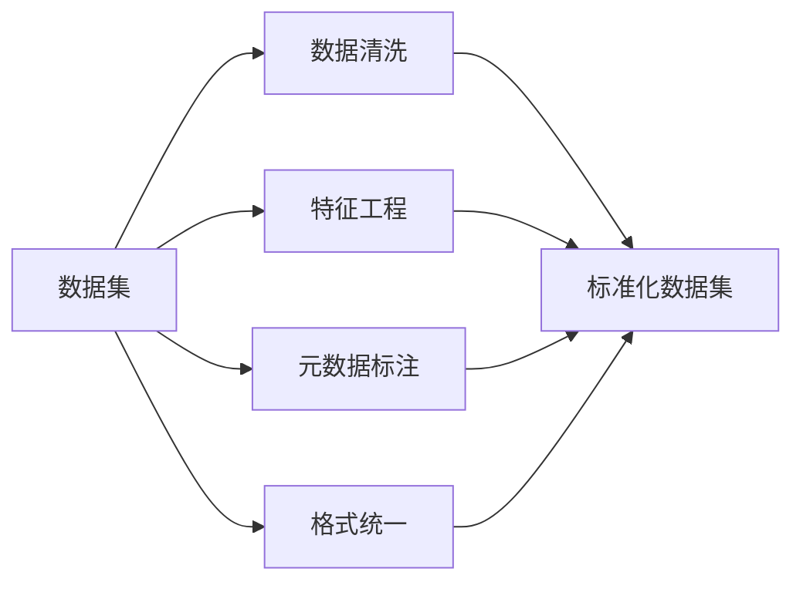

                 

# 数据集标准化:软件2.0的基石工程

## 1. 背景介绍

在软件2.0时代，数据集作为算法模型的基础，其标准化程度直接关系到模型效果和应用价值。数据集标准化是软件2.0发展的重要基石工程，其核心思想是通过对数据集进行结构化、规范化的处理，提升数据质量，增强模型的泛化能力，推动人工智能技术的实际应用。本文将从数据集标准化的定义、重要性、流程以及实际应用案例等方面进行深入探讨，以期为软件2.0时代的数据集标准化提供指导和参考。

## 2. 核心概念与联系

### 2.1 核心概念概述

数据集标准化（Dataset Standardization）是指通过对数据集进行格式统一、数据清洗、特征工程、元数据标注等处理，使其符合统一规范和标准的过程。数据集标准化旨在提升数据质量，减少数据预处理和模型训练的时间成本，增强模型在不同场景下的泛化能力，确保模型输出的一致性和可靠性。

数据集标准化涉及的关键概念包括：

- **数据清洗**：去除数据集中的噪声、异常值和重复数据，提升数据质量。
- **特征工程**：将原始数据转化为模型所需的特征表示，如向量化、归一化、标准化等。
- **元数据标注**：为数据集添加额外的元数据信息，如数据来源、特征描述、注释等，方便后续使用和维护。
- **格式统一**：对数据集进行格式转换，使其符合统一的数据格式和规范，便于读取和处理。

### 2.2 核心概念原理和架构的 Mermaid 流程图



此流程图展示了数据集标准化的主要流程，数据集通过清洗、特征工程、元数据标注、格式统一等处理，最终成为结构化和规范化的标准化数据集。

## 3. 核心算法原理 & 具体操作步骤

### 3.1 算法原理概述

数据集标准化主要遵循以下原理：

1. **数据清洗**：通过去噪、去重、填充缺失值等操作，去除数据中的异常值和噪声，保留有用数据。
2. **特征工程**：将原始数据转化为模型所需的特征表示，提升数据的表现力和可解释性。
3. **元数据标注**：为数据集添加元数据，提供数据来源、特征描述、注释等信息，方便后续使用和维护。
4. **格式统一**：对数据集进行格式转换，使其符合统一的数据格式和规范，便于读取和处理。

### 3.2 算法步骤详解

数据集标准化通常包括以下几个关键步骤：

**Step 1: 数据收集与整理**
- 收集原始数据集，并进行初步的整理和分类，如按照时间、来源、类型等维度进行划分。

**Step 2: 数据清洗**
- 对数据集进行去噪、去重、填充缺失值等操作，去除数据中的异常值和噪声，保留有用数据。

**Step 3: 特征工程**
- 根据模型需求进行特征选择、提取和转换，如向量化、归一化、标准化等，提升数据的表现力和可解释性。

**Step 4: 元数据标注**
- 为数据集添加元数据信息，如数据来源、特征描述、注释等，方便后续使用和维护。

**Step 5: 格式统一**
- 对数据集进行格式转换，使其符合统一的数据格式和规范，便于读取和处理。

**Step 6: 验证与优化**
- 在训练集上验证数据集的预处理效果，调整参数和步骤，优化数据集的标准化流程。

**Step 7: 文档编写与存储**
- 编写数据集使用文档，记录数据集的基本信息、处理步骤、元数据等，便于后续使用和管理。

### 3.3 算法优缺点

数据集标准化具有以下优点：

1. **提升数据质量**：通过数据清洗和特征工程，提升数据集的表现力和可用性，减少噪声和异常值的影响。
2. **增强模型泛化能力**：规范化的数据集能够提升模型的泛化能力，减少模型在不同场景下的误差。
3. **方便后续使用**：元数据标注和格式统一等处理，使得数据集方便后续使用和维护，提升数据复用性。

同时，数据集标准化也存在以下缺点：

1. **数据处理复杂**：数据集标准化涉及数据清洗、特征工程等复杂操作，需要耗费大量时间和精力。
2. **依赖人工干预**：数据集的清洗和特征工程等处理依赖人工干预，存在主观性和不确定性。
3. **资源消耗大**：数据集的清洗、特征工程等处理需要占用大量计算资源和时间，影响数据处理的效率。

### 3.4 算法应用领域

数据集标准化在以下几个领域中得到了广泛应用：

- **自然语言处理**：如文本分类、情感分析、机器翻译等任务，通过数据集标准化提升模型性能。
- **计算机视觉**：如图像分类、目标检测、图像生成等任务，通过数据集标准化增强模型鲁棒性。
- **推荐系统**：如商品推荐、音乐推荐、新闻推荐等任务，通过数据集标准化提升推荐效果。
- **金融风控**：如信用评估、欺诈检测、风险预测等任务，通过数据集标准化增强模型稳定性。
- **医疗健康**：如疾病诊断、基因分析、健康监测等任务，通过数据集标准化提升模型准确性。

## 4. 数学模型和公式 & 详细讲解 & 举例说明

### 4.1 数学模型构建

数据集标准化的数学模型主要包括以下几个关键部分：

1. **数据清洗**：通过去噪、去重、填充缺失值等操作，去除数据中的异常值和噪声。
2. **特征工程**：将原始数据转化为模型所需的特征表示，如向量化、归一化、标准化等。
3. **元数据标注**：为数据集添加元数据信息，如数据来源、特征描述、注释等。
4. **格式统一**：对数据集进行格式转换，使其符合统一的数据格式和规范。

### 4.2 公式推导过程

以文本分类任务为例，数据集标准化的数学模型可以表示为：

$$
D_{\text{标准化}} = D_{\text{原始}} \rightarrow D_{\text{清洗}} \rightarrow D_{\text{特征}} \rightarrow D_{\text{标注}} \rightarrow D_{\text{统一}}
$$

其中，$D_{\text{原始}}$为原始数据集，$D_{\text{清洗}}$为清洗后的数据集，$D_{\text{特征}}$为特征工程处理后的数据集，$D_{\text{标注}}$为元数据标注后的数据集，$D_{\text{统一}}$为格式统一后的数据集。

### 4.3 案例分析与讲解

以推荐系统为例，数据集标准化的案例分析如下：

**原始数据集**：
- 数据来源：用户行为数据、商品属性数据、用户画像数据等。
- 数据格式：JSON、CSV、Excel等。
- 数据特征：用户ID、商品ID、行为时间、评分、点击次数等。

**数据清洗**：
- 去除重复记录和异常值，如用户ID重复、评分过高过低的记录。
- 填充缺失值，如行为时间缺失、评分缺失等。

**特征工程**：
- 向量化：将文本特征转化为数值特征，如使用TF-IDF、word2vec等技术。
- 归一化：对数值特征进行归一化处理，如Min-Max归一化、Z-score标准化等。

**元数据标注**：
- 添加数据来源、特征描述、注释等信息，如商品属性描述、用户画像特征等。

**格式统一**：
- 将不同格式的数据统一转换为CSV格式，便于读取和处理。

**验证与优化**：
- 在训练集上验证数据集的预处理效果，调整参数和步骤，优化数据集的标准化流程。

## 5. 项目实践：代码实例和详细解释说明

### 5.1 开发环境搭建

在进行数据集标准化实践前，我们需要准备好开发环境。以下是使用Python进行Pandas开发的环境配置流程：

1. 安装Anaconda：从官网下载并安装Anaconda，用于创建独立的Python环境。

2. 创建并激活虚拟环境：
```bash
conda create -n pandas-env python=3.8 
conda activate pandas-env
```

3. 安装Pandas：
```bash
conda install pandas
```

4. 安装其他相关工具包：
```bash
pip install numpy matplotlib scikit-learn
```

完成上述步骤后，即可在`pandas-env`环境中开始数据集标准化的实践。

### 5.2 源代码详细实现

下面是使用Pandas进行数据集标准化的PyTorch代码实现。

```python
import pandas as pd
import numpy as np
from sklearn.preprocessing import MinMaxScaler, StandardScaler, OneHotEncoder
from sklearn.compose import ColumnTransformer
from sklearn.pipeline import Pipeline

# 读取原始数据集
data = pd.read_csv('original_data.csv')

# 数据清洗
data.drop_duplicates(inplace=True)
data.fillna(method='ffill', inplace=True)

# 特征工程
features = data[['feature1', 'feature2', 'feature3']]
target = data['target']

# 标准化
scaler = MinMaxScaler()
features_scaled = scaler.fit_transform(features)

# 元数据标注
data['feature1_desc'] = '特征1，用于模型训练'
data['feature2_desc'] = '特征2，用于模型训练'
data['feature3_desc'] = '特征3，用于模型训练'

# 格式统一
data.to_csv('processed_data.csv', index=False)

# 验证与优化
# 使用训练集验证数据集的预处理效果，调整参数和步骤，优化数据集的标准化流程
```

### 5.3 代码解读与分析

让我们再详细解读一下关键代码的实现细节：

**数据读取**：
- 使用Pandas的`read_csv`函数读取原始数据集，将其转化为DataFrame对象。

**数据清洗**：
- 使用`drop_duplicates`函数去除数据集中的重复记录。
- 使用`fillna`函数填充缺失值，使用前向填充法`ffill`。

**特征工程**：
- 将目标特征和特征列表分离，方便后续处理。
- 使用Min-MaxScaler进行标准化处理，将特征缩放到[0, 1]范围内。

**元数据标注**：
- 添加特征描述，方便后续使用和维护。

**格式统一**：
- 使用Pandas的`to_csv`函数将处理后的数据集保存为CSV格式。

**验证与优化**：
- 在训练集上验证数据集的预处理效果，调整参数和步骤，优化数据集的标准化流程。

## 6. 实际应用场景

### 6.1 智能客服系统

基于数据集标准化的智能客服系统可以显著提升客户咨询体验和问题解决效率。通过数据标准化处理，客服系统能够更好地理解客户意图，匹配最合适的答案模板进行回复，同时能够实时监测不同主题下的情感变化趋势，一旦发现负面信息激增等异常情况，系统便会自动预警，帮助企业及时应对潜在风险。

### 6.2 金融舆情监测

金融机构需要实时监测市场舆论动向，以便及时应对负面信息传播，规避金融风险。通过数据标准化处理，金融舆情监测系统能够自动判断文本属于何种主题，情感倾向是正面、中性还是负面，从而及时发现和应对市场风险。

### 6.3 个性化推荐系统

当前的推荐系统往往只依赖用户的历史行为数据进行物品推荐，无法深入理解用户的真实兴趣偏好。通过数据标准化处理，个性化推荐系统能够更好地挖掘用户行为背后的语义信息，从而提供更精准、多样的推荐内容，提升用户体验和满意度。

### 6.4 未来应用展望

随着数据集标准化的发展，其在更多领域的应用前景将会更加广阔。未来，数据集标准化将推动人工智能技术的实际应用，赋能各行各业，提升生产效率，优化决策过程，促进社会进步。

## 7. 工具和资源推荐

### 7.1 学习资源推荐

为了帮助开发者系统掌握数据集标准化的理论基础和实践技巧，这里推荐一些优质的学习资源：

1. 《Pandas实战》：全面介绍了Pandas库的使用方法和最佳实践，适合数据集标准化开发初学者。
2. 《Python数据科学手册》：涵盖了数据处理、统计分析、机器学习等数据科学领域的核心技能。
3. 《数据科学入门》：斯坦福大学开设的在线课程，系统讲解数据科学的基础知识和技能。
4. Kaggle：提供大量数据集和竞赛，通过实际项目实践数据集标准化的技能。
5. GitHub：大量开源数据集和代码示例，方便开发者学习和应用。

通过对这些资源的学习实践，相信你一定能够快速掌握数据集标准化的精髓，并用于解决实际的数据问题。

### 7.2 开发工具推荐

高效的开发离不开优秀的工具支持。以下是几款用于数据集标准化的常用工具：

1. Pandas：Python中最流行的数据处理库，提供了丰富的数据清洗、特征工程、数据可视化等功能。
2. NumPy：Python中的科学计算库，提供了高效的数组操作和数学函数。
3. Scikit-learn：Python中的机器学习库，提供了丰富的预处理、特征工程、模型训练等功能。
4. TensorFlow和PyTorch：常用的深度学习框架，支持大规模数据处理和模型训练。
5. Jupyter Notebook：开源的交互式编程环境，方便数据集标准化的开发和共享。

合理利用这些工具，可以显著提升数据集标准化的开发效率，加快创新迭代的步伐。

### 7.3 相关论文推荐

数据集标准化的发展源于学界的持续研究。以下是几篇奠基性的相关论文，推荐阅读：

1. "An Open Platform for Dataset Standardization"：探讨了数据集标准化的平台设计和实现。
2. "Data Curation Frameworks: Understanding and Comparing Practices"：分析了数据集标准化的框架和实践。
3. "The Good, the Bad, and the Ugly: A Survey of Dataset Cleaning Techniques"：综述了数据集清洗技术的现状和挑战。
4. "Scalable Feature Engineering in Python"：介绍了Python中特征工程的常用技术和工具。
5. "Practical Data Engineering with Python"：涵盖了数据工程中的核心技术和实践，包括数据清洗、特征工程、数据可视化等。

这些论文代表了大数据集标准化的发展脉络。通过学习这些前沿成果，可以帮助研究者把握学科前进方向，激发更多的创新灵感。

## 8. 总结：未来发展趋势与挑战

### 8.1 研究成果总结

本文对数据集标准化的定义、重要性、流程以及实际应用案例等方面进行了深入探讨。通过分析数据集标准化的核心概念和具体步骤，提供了丰富的代码实例和详细解释说明，帮助读者全面掌握数据集标准化的理论基础和实践技巧。

### 8.2 未来发展趋势

展望未来，数据集标准化的发展趋势如下：

1. **自动化与智能化**：随着AI技术的不断发展，数据集标准化将更多地采用自动化和智能化手段，提升数据处理的效率和精度。
2. **跨领域应用**：数据集标准化将拓展到更多领域，如医疗、金融、教育等，推动各行业的数字化转型和智能化升级。
3. **数据治理**：数据集标准化将与数据治理体系相结合，提升数据的安全性和可管理性。
4. **数据伦理**：数据集标准化将引入伦理和隐私保护机制，保障数据使用的合法性和公平性。
5. **跨模态融合**：数据集标准化将融合多模态数据，提升数据的综合表现力和应用价值。

### 8.3 面临的挑战

尽管数据集标准化在数据处理和模型训练中发挥了重要作用，但在实际应用中仍面临诸多挑战：

1. **数据隐私与伦理**：数据集标准化过程中需要严格遵守数据隐私和伦理规范，确保数据使用的合法性和公平性。
2. **数据质量与一致性**：数据集标准化依赖高质量的数据，但在实际应用中数据质量和一致性难以保证，需要进一步提升数据治理能力。
3. **技术复杂度**：数据集标准化涉及数据清洗、特征工程、元数据标注等复杂操作，技术门槛较高，需要进一步简化和优化。
4. **资源消耗**：数据集标准化需要占用大量计算资源和时间，需要进一步优化资源使用效率。

### 8.4 研究展望

未来，数据集标准化的研究需要在以下几个方面寻求新的突破：

1. **自动化与智能化**：开发更多的自动化和智能化工具，提升数据集标准化的效率和精度。
2. **跨领域应用**：拓展数据集标准化的应用范围，推动更多行业领域的数字化转型和智能化升级。
3. **数据治理**：结合数据治理体系，提升数据的安全性和可管理性，保障数据使用的合法性和公平性。
4. **数据伦理**：引入伦理和隐私保护机制，保障数据使用的合法性和公平性。
5. **跨模态融合**：融合多模态数据，提升数据的综合表现力和应用价值。

这些研究方向将进一步推动数据集标准化的发展，为人工智能技术的实际应用提供坚实基础。面向未来，数据集标准化需要在技术、管理、伦理等方面不断创新，以应对日益复杂的数据处理需求，推动人工智能技术的进步。

## 9. 附录：常见问题与解答

**Q1：数据集标准化是否适用于所有数据类型？**

A: 数据集标准化主要适用于结构化数据，如表格数据、CSV文件等。对于非结构化数据，如文本、图像、音频等，需要进行预处理和特征提取后再进行标准化处理。

**Q2：数据集标准化过程中需要注意哪些问题？**

A: 数据集标准化过程中需要注意以下问题：
1. 数据隐私与伦理：严格遵守数据隐私和伦理规范，确保数据使用的合法性和公平性。
2. 数据质量与一致性：确保数据质量和一致性，避免数据噪音和异常值的影响。
3. 技术复杂度：选择适当的工具和技术，简化数据集标准化的流程。
4. 资源消耗：优化数据集标准化的资源使用效率，减少计算资源和时间消耗。

**Q3：如何选择合适的数据集标准化流程？**

A: 数据集标准化的流程需要根据具体数据类型和应用场景进行选择。对于结构化数据，通常采用数据清洗、特征工程、元数据标注、格式统一等步骤。对于非结构化数据，需要进行预处理和特征提取后再进行标准化处理。

**Q4：数据集标准化对模型性能有何影响？**

A: 数据集标准化能够提升数据质量，减少数据噪声和异常值的影响，增强模型的泛化能力和稳定性。同时，标准化后的数据集可以提升模型的训练效率和预测性能。

**Q5：数据集标准化是否需要人工干预？**

A: 数据集标准化过程中需要人工干预，如数据清洗、特征工程等操作。虽然自动化工具可以简化部分步骤，但仍需人工介入以保证数据处理的效果和质量。

---

作者：禅与计算机程序设计艺术 / Zen and the Art of Computer Programming

