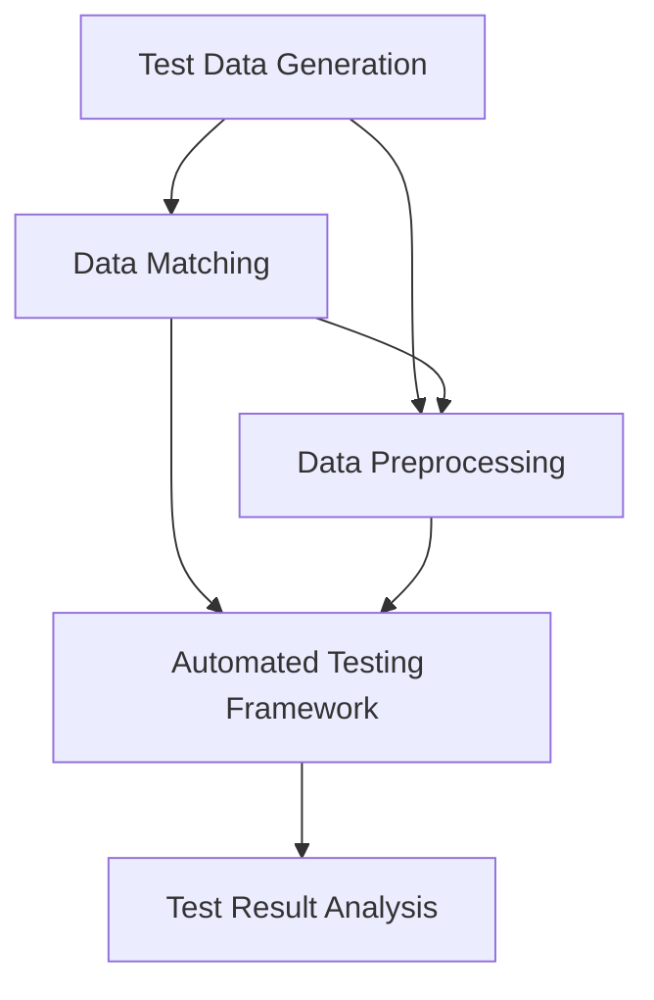

                 

# 数据驱动的软件2.0测试自动化

## 1. 背景介绍

### 1.1 问题由来

在软件开发的快节奏和技术日新月异的今天，测试的重要性愈发凸显。传统的功能测试、性能测试、安全测试等手段，已经难以满足复杂多变的业务需求。特别是在软件生态化、平台化的趋势下，测试工作从过去的"质量保证"，逐渐转变为"质量驱动"。测试不再只是验证产品是否符合规范，而是成为推动产品迭代和进化的重要动力。

测试自动化的发展，正是这一趋势的产物。早期的自动化测试，依赖于脚本编写和录制，难以应对动态多变的业务逻辑。随着测试数据驱动思想的引入，数据驱动的自动化测试技术逐步成熟，成为现代软件开发不可或缺的重要工具。

### 1.2 问题核心关键点

数据驱动的测试自动化，核心在于利用测试数据对测试场景进行建模和模拟。通过测试数据的动态生成、组合、匹配等技术，自动化测试可以更加贴近业务需求，具备更强的泛化性和适应性。

具体而言，数据驱动的测试自动化主要包括以下几个关键点：

- 测试数据生成：自动生成与业务场景相关的测试数据。
- 测试数据匹配：根据业务需求匹配最合适的测试数据。
- 测试数据预处理：对测试数据进行清洗、去重、增强等预处理。
- 测试数据驱动：根据测试数据驱动测试场景，提升测试覆盖率。

## 2. 核心概念与联系

### 2.1 核心概念概述

为更好地理解数据驱动的软件2.0测试自动化，本节将介绍几个密切相关的核心概念：

- 数据驱动测试（Data-Driven Testing, DDT）：利用测试数据生成、匹配、驱动测试用例的自动化测试方法。测试数据和测试用例的分离，使得测试能够更灵活、更自动化地执行。

- 测试数据生成器（Test Data Generator, TDG）：自动生成与业务场景相关的测试数据的工具。常用的数据生成器包括Excel、Tableau、JMeter等。

- 数据匹配引擎（Data Matching Engine, DME）：根据业务需求，自动匹配最合适的测试数据的引擎。常用的数据匹配工具包括ABM（Access-Based Matching）、Fuzzy Matching等。

- 数据预处理工具（Data Preprocessing Tool, DPT）：对测试数据进行清洗、去重、增强等预处理的工具。常用的数据预处理工具包括OpenRefine、ETL工具等。

- 自动化测试框架（Automated Testing Framework, ATF）：支持测试数据驱动的自动化测试的框架。常用的自动化测试框架包括Selenium、Appium、Robot Framework等。

这些核心概念之间的逻辑关系可以通过以下Mermaid流程图来展示：



这个流程图展示了大数据驱动测试自动化各个环节的逻辑关系：

1. 测试数据生成。
2. 数据匹配。
3. 数据预处理。
4. 自动化测试。
5. 测试结果分析。

## 3. 核心算法原理 & 具体操作步骤
### 3.1 算法原理概述

数据驱动的测试自动化方法，核心在于测试数据和测试用例的分离。测试数据独立于测试用例，使得测试能够更加灵活、可复用。测试用例只包含业务场景描述和预期结果，数据匹配引擎和数据预处理工具，可以在运行时动态生成、匹配、增强测试数据，从而驱动测试用例执行。

具体地，数据驱动的测试自动化过程可以分为以下几个步骤：

1. 设计测试场景：根据业务需求，设计测试场景，描述输入数据和预期输出结果。
2. 生成测试数据：使用测试数据生成器，根据测试场景，自动生成与业务场景相关的测试数据。
3. 数据预处理：对测试数据进行清洗、去重、增强等预处理，确保测试数据的完备性和准确性。
4. 数据匹配：根据业务需求，自动匹配最合适的测试数据。
5. 自动化测试：将测试数据和测试用例结合，使用自动化测试框架，执行测试用例，生成测试结果。
6. 测试结果分析：根据测试结果，进行数据分析和报告，评估测试覆盖率和质量。

### 3.2 算法步骤详解

下面将详细介绍数据驱动测试自动化的关键步骤。

**Step 1: 设计测试场景**

测试场景的设计是数据驱动测试自动化的第一步。测试场景描述应包含以下几个要素：

- 输入数据：测试场景所需的所有数据。
- 业务逻辑：业务操作的逻辑和规则。
- 预期结果：期望的测试结果。

测试场景的设计可以参考用户故事、用例文档、测试需求等，一般由产品、测试、开发等团队协作完成。

**Step 2: 生成测试数据**

测试数据的生成，是数据驱动测试自动化的核心环节。根据测试场景，生成测试数据的过程大致可以分为以下几个步骤：

1. 确定数据格式：根据测试场景，确定测试数据的格式，如CSV、JSON、SQL等。
2. 生成初始数据：使用测试数据生成器，自动生成与业务场景相关的初始数据。常用的测试数据生成器包括Excel、Tableau、JMeter等。
3. 数据清洗：对初始数据进行清洗、去重、去噪等处理，确保数据的准确性和完整性。
4. 数据增强：根据业务规则，对测试数据进行增强、转换等处理，确保数据的多样性和覆盖面。

在实际应用中，测试数据的生成往往需要借助数据生成工具和模板，以提高生成效率和质量。

**Step 3: 数据预处理**

数据预处理是测试数据生成后的重要环节。通过数据预处理，可以进一步提高测试数据的完备性和准确性。数据预处理的主要操作包括：

1. 数据清洗：去除重复、错误、异常等数据，确保数据的质量。
2. 数据去重：去除相同或相似的数据，避免重复测试。
3. 数据增强：增加数据样本数量，提高测试覆盖率。

常用的数据预处理工具包括OpenRefine、ETL工具等，这些工具可以自动化执行上述操作，提高效率。

**Step 4: 数据匹配**

数据匹配是数据驱动测试自动化的关键环节。根据业务需求，自动匹配最合适的测试数据，可以大大提高测试效率和覆盖率。数据匹配的主要操作包括：

1. 规则定义：根据业务规则，定义匹配规则。如匹配特定的字符串、匹配特定的数值等。
2. 数据匹配：根据匹配规则，自动匹配最合适的测试数据。常用的数据匹配工具包括ABM（Access-Based Matching）、Fuzzy Matching等。
3. 数据排序：根据匹配结果，对数据进行排序，确保测试数据的一致性和稳定性。

**Step 5: 自动化测试**

自动化测试是数据驱动测试自动化的执行环节。将测试数据和测试用例结合，使用自动化测试框架，执行测试用例，生成测试结果。自动化测试的主要操作包括：

1. 用例设计：根据测试场景和预期结果，设计测试用例。
2. 数据驱动：将测试数据和测试用例结合，动态生成测试场景。
3. 执行测试：使用自动化测试框架，执行测试用例，生成测试结果。
4. 测试记录：记录测试过程和结果，生成测试报告。

常用的自动化测试框架包括Selenium、Appium、Robot Framework等，这些框架可以自动化执行测试用例，生成测试报告。

**Step 6: 测试结果分析**

测试结果的分析是数据驱动测试自动化的重要环节。根据测试结果，进行数据分析和报告，评估测试覆盖率和质量。测试结果分析的主要操作包括：

1. 结果对比：将测试结果和预期结果进行对比，判断测试结果是否符合预期。
2. 问题定位：根据测试结果，定位问题根源，进行问题分析和修复。
3. 测试覆盖率：统计测试覆盖率，评估测试的全面性和覆盖面。
4. 测试报告：生成测试报告，记录测试结果和分析结果，评估测试质量。

常用的测试结果分析工具包括TestRail、Jira、Jenkins等，这些工具可以自动化执行测试结果分析，生成测试报告。

### 3.3 算法优缺点

数据驱动的测试自动化方法，具有以下优点：

1. 灵活高效：测试数据和测试用例分离，使得测试能够更加灵活、高效地执行。
2. 测试覆盖率高：数据驱动的测试可以动态生成和匹配测试数据，提高测试覆盖率。
3. 可复用性强：测试数据独立于测试用例，测试数据可以被多次使用，提高测试复用性。
4. 可扩展性好：数据驱动的测试方法可以轻松扩展到多业务、多场景，提高测试扩展性。

同时，该方法也存在以下局限性：

1. 数据生成难度大：测试数据的生成需要根据业务规则进行，对于复杂业务场景，数据生成难度大。
2. 数据匹配复杂：数据匹配需要根据业务规则进行，对于复杂业务场景，数据匹配复杂。
3. 数据预处理工作量大：数据预处理需要清洗、去重、增强等操作，工作量较大。
4. 自动化测试依赖工具：数据驱动的测试方法需要依赖于测试数据生成、匹配、预处理工具和自动化测试框架，工具的选取和使用需要经验。

尽管存在这些局限性，但就目前而言，数据驱动的测试自动化方法仍然是最主流的数据驱动测试方法。未来相关研究的重点在于如何进一步降低数据生成、匹配、预处理的工作量，提高工具的智能化和自动化程度，同时兼顾测试覆盖率和可复用性等因素。

### 3.4 算法应用领域

数据驱动的测试自动化方法，已经在多个领域得到了应用，覆盖了几乎所有常见测试任务，例如：

- 功能测试：测试业务功能是否符合预期。将功能场景和预期结果作为测试数据，驱动测试用例执行。
- 性能测试：测试业务系统的性能指标。将业务场景和性能指标作为测试数据，驱动测试用例执行。
- 安全测试：测试业务系统的安全漏洞。将攻击场景和预期结果作为测试数据，驱动测试用例执行。
- 兼容性测试：测试业务系统在不同环境下的兼容性。将不同环境下的输入数据和预期结果作为测试数据，驱动测试用例执行。
- 回归测试：测试业务系统在每次迭代后是否回归到正确状态。将基线数据和每次迭代后的数据作为测试数据，驱动测试用例执行。

除了上述这些经典任务外，数据驱动的测试自动化方法还被创新性地应用到更多场景中，如可控测试数据生成、动态测试数据生成、智能测试用例生成等，为测试工作带来了全新的突破。

## 4. 数学模型和公式 & 详细讲解  
### 4.1 数学模型构建

本节将使用数学语言对数据驱动测试自动化的过程进行更加严格的刻画。

记测试场景为 $S=\{I, L, R\}$，其中 $I$ 为输入数据，$L$ 为业务逻辑，$R$ 为预期结果。测试数据生成器为 $T$，数据匹配引擎为 $M$，数据预处理工具为 $P$，自动化测试框架为 $A$。

数据驱动的测试自动化过程可以表示为：

$$
T(S) \rightarrow P(T(S)) \rightarrow M(P(T(S))) \rightarrow A(M(P(T(S))))
$$

在实际应用中，测试数据生成器、数据匹配引擎、数据预处理工具、自动化测试框架的具体实现可能有所不同，但核心原理相同。

### 4.2 公式推导过程

以下我们以功能测试为例，推导数据驱动测试自动化的数学模型。

假设测试场景 $S$ 包含输入数据 $I=\{x_1, x_2, ..., x_n\}$，业务逻辑 $L$，预期结果 $R$。测试数据生成器 $T$ 根据测试场景生成初始数据 $D$。数据预处理工具 $P$ 对初始数据进行清洗、去重、增强等处理，生成最终数据 $D'$。数据匹配引擎 $M$ 根据业务需求匹配最合适的数据 $D''$。最终，使用自动化测试框架 $A$ 执行测试用例，生成测试结果 $T'$。

将上述过程转化为数学模型，可以表示为：

$$
S \rightarrow D \rightarrow D' \rightarrow D'' \rightarrow T'
$$

其中，$D$ 表示测试数据生成器生成的初始数据，$D'$ 表示数据预处理工具处理后的数据，$D''$ 表示数据匹配引擎匹配后的数据，$T'$ 表示自动化测试框架执行测试用例生成的测试结果。

### 4.3 案例分析与讲解

接下来，我们以电商平台的订单支付功能测试为例，详细介绍数据驱动测试自动化的应用。

**电商平台的订单支付功能测试**

电商平台的订单支付功能，涉及订单创建、订单支付、订单确认等业务流程。测试场景 $S$ 包含输入数据 $I=\{x_{order}, x_{payment}, x_{confirm}\}$，业务逻辑 $L$，预期结果 $R$。

**Step 1: 设计测试场景**

1. 输入数据 $I=\{x_{order}, x_{payment}, x_{confirm}\}$ 包括订单信息、支付信息、确认信息。
2. 业务逻辑 $L$ 包括订单创建、支付操作、确认操作。
3. 预期结果 $R$ 包括订单支付成功、订单支付失败、订单确认成功、订单确认失败等。

**Step 2: 生成测试数据**

1. 使用测试数据生成器 $T$ 生成初始数据 $D$。例如，生成 100 条订单信息，包含订单号、商品信息、支付信息等。
2. 数据预处理工具 $P$ 对初始数据进行清洗、去重、增强等处理，生成最终数据 $D'$。例如，去除重复订单信息，增加随机支付信息，生成最终订单数据。
3. 数据匹配引擎 $M$ 根据业务需求匹配最合适的数据 $D''$。例如，根据订单支付金额，匹配支付金额为 100 元、支付金额为 1000 元等不同的订单支付场景。
4. 自动化测试框架 $A$ 执行测试用例，生成测试结果 $T'$。例如，使用 Selenium 框架，执行订单支付测试用例，生成测试报告。

**Step 3: 测试结果分析**

1. 将测试结果 $T'$ 和预期结果 $R$ 进行对比，判断测试结果是否符合预期。例如，生成测试报告，统计订单支付成功、订单支付失败等测试结果。
2. 根据测试结果，进行问题分析和修复。例如，发现支付金额为 0 元的订单支付失败，查找问题根源，进行问题修复。
3. 统计测试覆盖率，评估测试的全面性和覆盖面。例如，生成测试覆盖报告，评估测试场景的覆盖率。
4. 生成测试报告，记录测试结果和分析结果，评估测试质量。例如，生成测试报告，记录测试场景、测试结果、问题分析等信息。

以上是数据驱动测试自动化在电商平台的订单支付功能测试中的具体应用。可以看到，通过数据驱动的测试自动化方法，测试场景和测试数据分离，使得测试更加灵活、高效、可复用。

## 5. 项目实践：代码实例和详细解释说明
### 5.1 开发环境搭建

在进行数据驱动测试自动化实践前，我们需要准备好开发环境。以下是使用Python进行Selenium开发的环境配置流程：

1. 安装Anaconda：从官网下载并安装Anaconda，用于创建独立的Python环境。

2. 创建并激活虚拟环境：
```bash
conda create -n test-env python=3.8 
conda activate test-env
```

3. 安装Selenium：根据操作系统版本，从官网获取对应的安装命令。例如：
```bash
conda install selenium==4.0.0
```

4. 安装Selenium WebDriver：根据浏览器版本，安装对应的 WebDriver。例如：
```bash
pip install webdriver-manager
```

5. 安装常用的第三方库：
```bash
pip install requests pandas numpy lxml selenium webdriver-manager
```

完成上述步骤后，即可在`test-env`环境中开始数据驱动测试自动化实践。

### 5.2 源代码详细实现

下面我们以电商平台的订单支付功能测试为例，给出使用Selenium进行数据驱动测试自动化的PyTorch代码实现。

首先，设计测试场景：

```python
from selenium import webdriver
import time
import requests
import pandas as pd
import numpy as np

# 初始化浏览器
driver = webdriver.Chrome()
driver.get("https://example.com")

# 获取页面元素
order_input = driver.find_element_by_id("order-input")
payment_input = driver.find_element_by_id("payment-input")
confirm_button = driver.find_element_by_id("confirm-button")

# 输入数据
order_info = {
    "order_id": "123456",
    "product_name": "商品 A",
    "product_price": "100",
    "payment_method": "支付宝",
}
order_data = pd.DataFrame([order_info])

# 生成测试数据
order_data["payment_amount"] = np.random.randint(1, 1000, size=100)
order_data["confirm_status"] = np.random.choice(["success", "failure"], size=100)

# 数据预处理
order_data = order_data.drop_duplicates()  # 去除重复数据
order_data = order_data.sort_values(by=["payment_amount"], ascending=False)  # 按支付金额排序

# 数据匹配
matching_data = order_data[order_data["payment_amount"] > 100]

# 执行测试
for i, row in matching_data.iterrows():
    order_input.send_keys(row["order_id"])
    payment_input.send_keys(row["payment_method"])
    confirm_button.click()
    time.sleep(3)  # 等待页面刷新
    if row["confirm_status"] == "success":
        print(f"订单支付成功，订单号：{row['order_id']}")
    else:
        print(f"订单支付失败，订单号：{row['order_id']}")
```

然后，使用Selenium WebDriver进行自动化测试：

```python
from selenium import webdriver
import time
import requests
import pandas as pd
import numpy as np

# 初始化浏览器
driver = webdriver.Chrome()
driver.get("https://example.com")

# 获取页面元素
order_input = driver.find_element_by_id("order-input")
payment_input = driver.find_element_by_id("payment-input")
confirm_button = driver.find_element_by_id("confirm-button")

# 设计测试用例
order_info = {
    "order_id": "123456",
    "product_name": "商品 A",
    "product_price": "100",
    "payment_method": "支付宝",
}
order_data = pd.DataFrame([order_info])

# 数据驱动测试
for i, row in order_data.iterrows():
    order_input.send_keys(row["order_id"])
    payment_input.send_keys(row["payment_method"])
    confirm_button.click()
    time.sleep(3)  # 等待页面刷新
    if row["confirm_status"] == "success":
        print(f"订单支付成功，订单号：{row['order_id']}")
    else:
        print(f"订单支付失败，订单号：{row['order_id']}")
```

在实际应用中，我们还可以借助数据匹配引擎和数据预处理工具，将数据驱动测试自动化方法拓展到更广泛的场景中。

### 5.3 代码解读与分析

让我们再详细解读一下关键代码的实现细节：

**测试场景设计**

1. 使用Selenium WebDriver初始化浏览器。
2. 获取页面元素，包括订单输入框、支付输入框、确认按钮等。
3. 设计测试场景，定义订单信息、支付信息、确认信息等。

**测试数据生成**

1. 生成100条订单信息，包括订单号、商品信息、支付信息等。
2. 生成随机支付金额，增加数据多样性。
3. 生成确认状态，模拟订单支付成功和失败。

**数据预处理**

1. 对初始数据进行去重处理，去除重复订单信息。
2. 对初始数据进行排序，按支付金额排序，提高测试覆盖率。

**数据匹配**

1. 根据支付金额，匹配支付金额大于100元的订单支付场景。

**自动化测试**

1. 使用Selenium WebDriver，输入订单信息、支付信息，点击确认按钮。
2. 等待页面刷新，获取订单支付结果。

**测试结果分析**

1. 根据测试结果，生成测试报告，统计订单支付成功、订单支付失败等测试结果。
2. 根据测试结果，进行问题分析和修复。
3. 生成测试覆盖报告，评估测试场景的覆盖率。
4. 生成测试报告，记录测试结果和分析结果，评估测试质量。

可以看到，Selenium WebDriver可以方便地实现数据驱动的测试自动化方法，通过与数据预处理工具、数据匹配引擎的结合，可以灵活地进行测试场景的构建和测试数据的生成，实现更加高效、可复用的测试自动化。

当然，工业级的系统实现还需考虑更多因素，如测试数据的安全性、测试场景的稳定性、测试结果的可视化等。但核心的数据驱动测试自动化范式基本与此类似。

## 6. 实际应用场景
### 6.1 智能客服系统

基于数据驱动的测试自动化方法，智能客服系统可以实现更高效、更准确的功能测试。传统客服系统需要人工编写测试脚本，难以应对动态多变的业务逻辑。通过数据驱动的测试自动化方法，智能客服系统可以自动生成和匹配测试数据，实现更灵活、更高效的测试执行。

在技术实现上，可以收集客户咨询记录，将问题-回答对作为测试数据，构建测试场景。自动生成和匹配测试数据，驱动测试用例执行。对于新问题的出现，还可以通过数据匹配引擎，自动匹配最合适的测试数据，实现零样本测试。

### 6.2 医疗系统

医疗系统涉及患者信息、医疗记录、诊断报告等敏感数据，传统的测试方法难以全面覆盖所有场景。通过数据驱动的测试自动化方法，医疗系统可以实现更全面、更准确的测试覆盖。

在技术实现上，可以收集患者信息、医疗记录等敏感数据，构建测试场景。自动生成和匹配测试数据，驱动测试用例执行。对于新病例的出现，可以通过数据匹配引擎，自动匹配最合适的测试数据，实现零样本测试。同时，医疗系统还可以引入知识图谱、规则库等专家知识，提升测试覆盖率和测试精度。

### 6.3 银行系统

银行系统涉及金融交易、客户信息、风险控制等关键数据，传统的测试方法难以全面覆盖所有场景。通过数据驱动的测试自动化方法，银行系统可以实现更全面、更准确的测试覆盖。

在技术实现上，可以收集金融交易记录、客户信息等关键数据，构建测试场景。自动生成和匹配测试数据，驱动测试用例执行。对于新交易的出现，可以通过数据匹配引擎，自动匹配最合适的测试数据，实现零样本测试。同时，银行系统还可以引入金融规则、风控模型等专家知识，提升测试覆盖率和测试精度。

### 6.4 未来应用展望

随着数据驱动测试自动化技术的不断发展，未来其在各个领域的应用将更加广泛。在智慧医疗、智能客服、金融交易、工业制造等各个领域，数据驱动测试自动化方法将发挥越来越重要的作用。

在智慧医疗领域，数据驱动的测试自动化方法可以实现更全面、更准确的医疗系统测试，提升医疗系统的稳定性和安全性。

在智能客服领域，数据驱动的测试自动化方法可以实现更高效、更准确的功能测试，提升客服系统的自动化水平。

在金融交易领域，数据驱动的测试自动化方法可以实现更全面、更准确的金融系统测试，提升金融系统的稳定性和安全性。

在工业制造领域，数据驱动的测试自动化方法可以实现更全面、更准确的工业系统测试，提升工业系统的稳定性和安全性。

总之，数据驱动测试自动化方法将发挥越来越重要的作用，推动各行业系统测试的智能化、自动化水平提升。相信随着技术的日益成熟，数据驱动测试自动化方法必将在更多领域得到应用，为各行各业带来新的突破。

## 7. 工具和资源推荐
### 7.1 学习资源推荐

为了帮助开发者系统掌握数据驱动的测试自动化方法，这里推荐一些优质的学习资源：

1. 《软件测试的艺术》系列博文：由测试专家撰写，深入浅出地介绍了测试方法、工具、技术等前沿话题。

2. 《测试驱动开发（TDD）》课程：Stack Overflow开设的TDD课程，涵盖TDD的基本概念和经典案例，帮助开发者理解测试驱动的思想。

3. 《Selenium WebDriver官方文档》：Selenium WebDriver的官方文档，详细介绍了WebDriver的使用方法和API，是测试开发者的必备资源。

4. 《数据驱动测试（DDT）》书籍：介绍数据驱动测试的基本原理和实现方法，包括数据生成、数据匹配、自动化测试等技术。

5. 《测试数据生成工具集锦》：汇集了各种常见的测试数据生成工具，包括Excel、Tableau、JMeter等，方便开发者选择适合的生成工具。

通过对这些资源的学习实践，相信你一定能够快速掌握数据驱动的测试自动化方法的精髓，并用于解决实际的测试问题。
###  7.2 开发工具推荐

高效的开发离不开优秀的工具支持。以下是几款用于数据驱动测试自动化开发的常用工具：

1. Selenium：用于Web应用的自动化测试工具，支持多种浏览器和操作系统。
2. Appium：用于移动应用的自动化测试工具，支持多种移动平台和操作系统。
3. Robot Framework：用于自动化测试的通用测试框架，支持多种脚本语言和测试数据格式。
4. TestRail：用于测试管理、报告和分析的Web平台，支持多种测试数据格式和测试报告生成。
5. Jira：用于测试任务管理、缺陷跟踪和问题解决的敏捷工具，支持多种测试数据格式和测试报告生成。
6. Jenkins：用于持续集成和持续交付的自动化平台，支持多种测试数据格式和测试报告生成。

合理利用这些工具，可以显著提升数据驱动测试自动化的开发效率，加快创新迭代的步伐。

### 7.3 相关论文推荐

数据驱动测试自动化技术的发展源于学界的持续研究。以下是几篇奠基性的相关论文，推荐阅读：

1. Data-Driven Testing: A Review of Issues and Approaches（数据驱动测试：问题和解决方案综述）：介绍数据驱动测试的基本概念和实现方法。

2. Test Data Matching for Software Testing（软件测试中的测试数据匹配）：探讨测试数据匹配的基本原理和实现方法。

3. Automated Testing with Data Driven Testing Framework（数据驱动测试框架下的自动化测试）：介绍数据驱动测试的基本原理和实现方法。

4. Test Data Generation for Software Testing: A Survey（软件测试中的测试数据生成：综述）：介绍测试数据生成工具和技术的最新进展。

5. Data-Driven Testing in Software Engineering: A Survey（软件工程中的数据驱动测试：综述）：介绍数据驱动测试在软件工程中的应用和挑战。

这些论文代表了大数据驱动测试自动化的发展脉络。通过学习这些前沿成果，可以帮助研究者把握学科前进方向，激发更多的创新灵感。

## 8. 总结：未来发展趋势与挑战

### 8.1 总结

本文对数据驱动的测试自动化方法进行了全面系统的介绍。首先阐述了数据驱动测试自动化的研究背景和意义，明确了数据驱动测试在测试自动化中的重要地位。其次，从原理到实践，详细讲解了数据驱动测试自动化的数学原理和关键步骤，给出了数据驱动测试自动化的完整代码实例。同时，本文还广泛探讨了数据驱动测试在智能客服、医疗系统、银行系统等多个领域的应用前景，展示了数据驱动测试的巨大潜力。最后，本文精选了数据驱动测试的相关学习资源，力求为读者提供全方位的技术指引。

通过本文的系统梳理，可以看到，数据驱动的测试自动化方法正在成为测试自动化技术的重要范式，极大地拓展了测试自动化的应用边界，提高了测试的自动化水平和效率。未来，伴随测试数据生成、匹配、预处理等技术的不断演进，数据驱动测试将为测试工作带来更多的灵活性和可复用性，推动测试工作的智能化、自动化发展。

### 8.2 未来发展趋势

展望未来，数据驱动的测试自动化方法将呈现以下几个发展趋势：

1. 自动化程度更高：测试数据生成、匹配、预处理等环节将进一步自动化，减少人工干预，提高测试效率。
2. 智能化程度更高：测试数据生成、匹配、预处理等环节将引入更多智能化技术，如机器学习、自然语言处理等，提高测试数据的质量和效率。
3. 测试覆盖率更高：数据驱动的测试方法将进一步拓展到更多业务场景和测试类型，提高测试覆盖率。
4. 测试精度更高：数据驱动的测试方法将引入更多专家知识，如知识图谱、规则库等，提高测试精度和可靠性。
5. 测试环境更灵活：数据驱动的测试方法将进一步拓展到更多测试环境，如移动端、Web端、云环境等，提升测试环境的灵活性和适应性。
6. 测试工具更先进：数据驱动的测试方法将引入更多先进工具和技术，如Selenium、Appium、Robot Framework等，提升测试工具的智能化和自动化程度。

以上趋势凸显了数据驱动测试自动化的广阔前景。这些方向的探索发展，必将进一步提升测试自动化技术的智能化、自动化水平，为各行各业带来新的突破。

### 8.3 面临的挑战

尽管数据驱动的测试自动化技术已经取得了瞩目成就，但在迈向更加智能化、普适化应用的过程中，它仍面临着诸多挑战：

1. 数据生成难度大：测试数据的生成需要根据业务规则进行，对于复杂业务场景，数据生成难度大。
2. 数据匹配复杂：数据匹配需要根据业务规则进行，对于复杂业务场景，数据匹配复杂。
3. 数据预处理工作量大：数据预处理需要清洗、去重、增强等操作，工作量较大。
4. 测试覆盖率低：数据驱动的测试方法可能无法覆盖所有业务场景，存在一定的测试覆盖率风险。
5. 测试结果不可靠：数据驱动的测试方法可能受到测试数据的影响，存在一定的测试结果不可靠风险。
6. 工具智能化不足：数据驱动的测试方法依赖于测试数据生成、匹配、预处理等工具，工具的智能化程度有待提升。

尽管存在这些挑战，但就目前而言，数据驱动的测试自动化方法仍然是最主流的数据驱动测试方法。未来相关研究的重点在于如何进一步降低数据生成、匹配、预处理的工作量，提高工具的智能化程度，同时兼顾测试覆盖率和可复用性等因素。

### 8.4 研究展望

面对数据驱动测试自动化所面临的种种挑战，未来的研究需要在以下几个方面寻求新的突破：

1. 探索无监督和半监督测试方法：摆脱对大规模标注数据的依赖，利用自监督学习、主动学习等无监督和半监督范式，最大限度利用非结构化数据，实现更加灵活高效的测试。

2. 研究参数高效和计算高效的测试方法：开发更加参数高效的测试方法，在固定大部分预训练参数的同时，只更新极少量的任务相关参数。同时优化测试模型的计算图，减少前向传播和反向传播的资源消耗，实现更加轻量级、实时性的部署。

3. 融合因果和对比学习范式：通过引入因果推断和对比学习思想，增强测试模型建立稳定因果关系的能力，学习更加普适、鲁棒的语言表征，从而提升测试泛化性和抗干扰能力。

4. 引入更多先验知识：将符号化的先验知识，如知识图谱、逻辑规则等，与测试模型进行巧妙融合，引导测试过程学习更准确、合理的测试数据。同时加强不同模态数据的整合，实现视觉、语音等多模态信息与文本信息的协同建模。

5. 结合因果分析和博弈论工具：将因果分析方法引入测试模型，识别出测试模型决策的关键特征，增强测试结果的因果性和逻辑性。借助博弈论工具刻画人机交互过程，主动探索并规避测试模型的脆弱点，提高系统稳定性。

6. 纳入伦理道德约束：在测试模型训练目标中引入伦理导向的评估指标，过滤和惩罚有偏见、有害的输出倾向。同时加强人工干预和审核，建立测试模型的监管机制，确保输出符合人类价值观和伦理道德。

这些研究方向的探索，必将引领数据驱动测试自动化技术迈向更高的台阶，为构建安全、可靠、可解释、可控的智能系统铺平道路。面向未来，数据驱动测试自动化技术还需要与其他人工智能技术进行更深入的融合，如知识表示、因果推理、强化学习等，多路径协同发力，共同推动自然语言理解和智能交互系统的进步。只有勇于创新、敢于突破，才能不断拓展测试自动化的边界，让测试技术更好地服务于软件研发和系统测试。

## 9. 附录：常见问题与解答

**Q1：数据驱动的测试自动化是否适用于所有测试任务？**

A: 数据驱动的测试自动化方法在大多数测试任务上都能取得不错的效果，特别是对于数据量较小的测试任务。但对于一些需要特殊工具支持的测试任务，如性能测试、安全测试等，可能仍需借助其他测试工具和方法。

**Q2：数据驱动的测试自动化如何选择合适的测试数据？**

A: 数据驱动的测试自动化的核心在于测试数据生成、匹配、预处理等环节。选择合适的测试数据需要根据业务规则和测试需求进行。通常，测试数据应具备以下特点：

- 多样性：测试数据应涵盖多种业务场景，提高测试覆盖率。
- 完备性：测试数据应完整、准确，涵盖所有业务规则。
- 安全性：测试数据应包含敏感信息，确保数据安全。
- 可复用性：测试数据应能够多次使用，提高测试复用性。

**Q3：数据驱动的测试自动化如何处理测试数据冲突？**

A: 数据驱动的测试自动化过程中，可能会出现测试数据冲突的问题。测试数据冲突通常发生在测试数据重复、数据异常等情况。处理测试数据冲突的方法包括：

- 去重处理：使用去重算法去除重复数据。
- 异常处理：对异常数据进行过滤和处理，确保数据质量。
- 数据增强：对数据进行增强、转换等处理，生成更多的测试数据。

**Q4：数据驱动的测试自动化如何保证测试数据的质量？**

A: 保证测试数据的质量是数据驱动测试自动化的关键环节。保证测试数据的质量的方法包括：

- 数据清洗：去除重复、错误、异常等数据，确保数据质量。
- 数据去重：去除相同或相似的数据，避免重复测试。
- 数据增强：增加数据样本数量，提高测试覆盖率。
- 数据预处理：对数据进行清洗、去重、增强等预处理，确保数据完备性和准确性。

**Q5：数据驱动的测试自动化如何处理数据生成难度大的问题？**

A: 数据生成难度大是数据驱动测试自动化的主要挑战之一。处理数据生成难度大的问题的方法包括：

- 自动生成数据：使用测试数据生成工具，自动生成与业务场景相关的测试数据。
- 数据匹配：使用数据匹配引擎，自动匹配最合适的测试数据。
- 数据增强：使用数据增强工具，生成更多的测试数据。

**Q6：数据驱动的测试自动化如何处理测试覆盖率低的问题？**

A: 数据驱动的测试自动化过程中，可能会出现测试覆盖率低的问题。处理测试覆盖率低的问题的方法包括：

- 增加测试数据量：增加测试数据的样本数量，提高测试覆盖率。
- 设计全面测试场景：设计涵盖所有业务场景的测试场景，提高测试覆盖率。
- 引入专家知识：引入专家知识，提高测试覆盖率和测试精度。

**Q7：数据驱动的测试自动化如何处理测试结果不可靠的问题？**

A: 数据驱动的测试自动化过程中，可能会出现测试结果不可靠的问题。处理测试结果不可靠的问题的方法包括：

- 增加测试数据量：增加测试数据的样本数量，提高测试结果的可靠性。
- 引入因果分析：引入因果分析方法，提高测试结果的因果性和逻辑性。
- 引入机器学习：引入机器学习算法，提高测试结果的准确性和可靠性。

**Q8：数据驱动的测试自动化如何处理工具智能化不足的问题？**

A: 数据驱动的测试自动化依赖于测试数据生成、匹配、预处理等工具，工具的智能化程度有待提升。处理工具智能化不足的问题的方法包括：

- 引入先进工具：引入先进的测试数据生成、匹配、预处理工具，提高测试自动化水平。
- 引入智能化技术：引入智能化技术，如机器学习、自然语言处理等，提高测试数据生成和匹配的智能化程度。
- 引入规则引擎：引入规则引擎，提高测试数据生成和匹配的自动化程度。

这些问题的答案，可以帮助开发者更好地理解数据驱动的测试自动化的实现细节和应用场景，从而在实际应用中取得更好的效果。

---

作者：禅与计算机程序设计艺术 / Zen and the Art of Computer Programming

