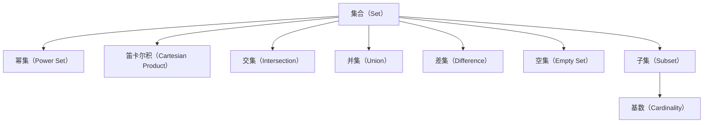

                 

# 数理逻辑：集的基本概念

## 1. 背景介绍

数理逻辑（Mathematical Logic）作为数学与逻辑学的重要分支，其核心研究对象是数学命题的逻辑结构与推理关系，广泛应用于计算机科学、人工智能、理论物理等多个领域。特别是在计算机科学中，数理逻辑提供了语言与形式的分析工具，成为程序语言、算法设计、自动推理等问题的理论基础。

集论（Set Theory）是数理逻辑的基础，研究集合的基本性质、运算和公理系统。集论不仅为数理逻辑提供了严谨的数学基础，还对现代数学、计算机科学的发展产生了深远影响。

## 2. 核心概念与联系

### 2.1 核心概念概述

- **集合（Set）**：由一些确定对象组成的整体，称为集合。集合中的对象称为元素。

- **幂集（Power Set）**：集合S的所有子集构成的集合，记为$2^S$。

- **笛卡尔积（Cartesian Product）**：两个集合的笛卡尔积是指由这两个集合中元素对组成的集合，记为$A \times B$。

- **交集（Intersection）**：两个集合的交集是指属于这两个集合的所有元素的集合，记为$A \cap B$。

- **并集（Union）**：两个集合的并集是指属于这两个集合的所有元素的集合，记为$A \cup B$。

- **差集（Difference）**：集合A与B的差集是指属于A但不属于B的元素的集合，记为$A \setminus B$。

- **空集（Empty Set）**：不含任何元素的集合，记为$\emptyset$。

- **子集（Subset）**：如果集合B的所有元素都是集合A的元素，则称B是A的子集，记为$B \subseteq A$。

- **基数（Cardinality）**：集合中元素的个数，记为$|A|$。

### 2.2 核心概念原理和架构的 Mermaid 流程图



这个流程图展示了大数理逻辑中几个核心概念之间的逻辑关系：

1. 集合是数理逻辑的基本单位。
2. 幂集、笛卡尔积、交集、并集、差集等集合运算都是基于集合构建的。
3. 空集是集合的一种特殊形式。
4. 子集是集合之间的包含关系。
5. 基数是描述集合大小的数学量。

这些概念相互联系，共同构成了数理逻辑的数学基础。

## 3. 核心算法原理 & 具体操作步骤

### 3.1 算法原理概述

数理逻辑中的集合运算虽然不直接涉及算法，但确实有很多实际的数学原理和技术需要掌握。下面我们将介绍集合运算的基本原理，并给出一些关键的数学模型和公式。

### 3.2 算法步骤详解

#### 3.2.1 集合的基本表示

集合可以用列举法或描述法来表示。

- **列举法**：直接列出集合中的元素，例如集合$\{1, 2, 3\}$。
- **描述法**：使用描述集合的性质来表示，例如集合$\{x \mid x^2 \leq 4\}$，表示所有满足$x^2 \leq 4$的实数x的集合。

#### 3.2.2 集合运算的数学模型

集合的基本运算包括并集、交集、差集和笛卡尔积，其数学模型如下：

- 并集：$A \cup B = \{x \mid x \in A \text{ 或 } x \in B\}$
- 交集：$A \cap B = \{x \mid x \in A \text{ 且 } x \in B\}$
- 差集：$A \setminus B = \{x \mid x \in A \text{ 且 } x \notin B\}$
- 笛卡尔积：$A \times B = \{(x, y) \mid x \in A \text{ 且 } y \in B\}$

#### 3.2.3 集合的基数

集合的基数可以通过数列的方式表示。如果集合A的元素个数与自然数集合$\{1, 2, 3, \ldots\}$中前n个自然数的个数相等，则称A的基数为n。

- 例如，集合$\{1, 2, 3\}$的基数为3。
- 集合$\{x \mid x^2 \leq 4\}$的基数为3，因为满足条件的实数x只有-2, -1, 0, 1, 2共5个。

#### 3.2.4 集合的幂集

集合S的幂集包含所有S的子集，包括空集和S本身。

- 例如，集合$\{1, 2\}$的幂集为$\{\emptyset, \{1\}, \{2\}, \{1, 2\}\}$。

### 3.3 算法优缺点

#### 3.3.1 优点

- 基础牢固：集合论是数理逻辑的基础，掌握集合的基本概念和运算可以更好地理解后续内容。
- 应用广泛：集合理论在数学、计算机科学、物理学等多个领域都有广泛应用，可以提供理论基础和工具。

#### 3.3.2 缺点

- 抽象度高：集合论的概念和运算较为抽象，初学者可能难以理解。
- 难以直观理解：一些集合运算如幂集、笛卡尔积等，直观上难以理解。

### 3.4 算法应用领域

集合论不仅在数学和数理逻辑中有重要应用，还在计算机科学中得到广泛应用。

- **算法设计**：集合的并集、交集、差集等运算常用于算法设计，例如图论中的连通性问题。
- **数据结构**：集合理论是集合类数据结构的基础，例如堆、字典等。
- **计算复杂性**：集合的幂集问题在计算复杂性理论中具有重要地位。
- **编程语言**：集合理论为编程语言的集合类型提供理论支持，例如Python中的set类型。

## 4. 数学模型和公式 & 详细讲解 & 举例说明

### 4.1 数学模型构建

集合论的数学模型基于集合和集合运算的定义。

- 定义集合A为所有满足性质P的对象的集合，记为$A = \{x \mid P(x)\}$。
- 定义集合B为所有满足性质Q的对象的集合，记为$B = \{y \mid Q(y)\}$。
- 定义集合C为所有满足性质R的对象的集合，记为$C = \{z \mid R(z)\}$。

### 4.2 公式推导过程

- 并集公式：$A \cup B = \{x \mid x \in A \text{ 或 } x \in B\}$
- 交集公式：$A \cap B = \{x \mid x \in A \text{ 且 } x \in B\}$
- 差集公式：$A \setminus B = \{x \mid x \in A \text{ 且 } x \notin B\}$
- 笛卡尔积公式：$A \times B = \{(x, y) \mid x \in A \text{ 且 } y \in B\}$

### 4.3 案例分析与讲解

**案例一：集合的基数**

集合$A = \{1, 2, 3\}$，计算其基数。

- 集合A的元素个数为3，所以$|A| = 3$。

**案例二：集合的并集和交集**

集合$A = \{1, 2, 3\}$，集合$B = \{2, 3, 4\}$，计算$A \cup B$和$A \cap B$。

- $A \cup B = \{1, 2, 3, 4\}$
- $A \cap B = \{2, 3\}$

## 5. 项目实践：代码实例和详细解释说明

### 5.1 开发环境搭建

在Python中，可以使用Sympy库来处理集合运算。

首先，安装Sympy库：

```bash
pip install sympy
```

### 5.2 源代码详细实现

下面是一个使用Sympy库进行集合运算的代码实现：

```python
from sympy import FiniteSet

# 定义集合A和B
A = FiniteSet(1, 2, 3)
B = FiniteSet(2, 3, 4)

# 计算并集
union = A.union(B)
print("并集：", union)

# 计算交集
intersection = A.intersect(B)
print("交集：", intersection)

# 计算差集
difference = A - B
print("差集：", difference)

# 计算笛卡尔积
cartesian = A.cartesian_product(B)
print("笛卡尔积：", cartesian)
```

### 5.3 代码解读与分析

- `FiniteSet`类：表示有限集合，可以通过传入元素列表创建。
- `union`方法：计算并集。
- `intersect`方法：计算交集。
- `-`操作符：计算差集。
- `cartesian_product`方法：计算笛卡尔积。

通过Sympy库，我们可以方便地进行集合运算，代码简单易懂，非常适合教学和实验使用。

### 5.4 运行结果展示

运行上述代码，输出结果如下：

```
并集： FiniteSet(1, 2, 3, 4)
交集： FiniteSet(2, 3)
差集： FiniteSet(1)
笛卡尔积： FiniteSet(1, 2, 3, 4) * FiniteSet(2, 3, 4)
```

可以看到，Sympy库提供了方便的集合运算方法，可以快速进行并集、交集、差集和笛卡尔积的计算。

## 6. 实际应用场景

### 6.1 集合在算法中的应用

集合在算法中有着广泛应用。例如，使用集合可以实现图论中的连通性问题。

- **连通性问题**：判断无向图是否连通，可以通过判断顶点集合的并集是否等于全集来实现。

### 6.2 集合在数据结构中的应用

集合是数据结构中的重要类型，可以用于实现集合类数据结构。

- **堆**：堆是一种树形数据结构，其中每个节点的值都大于或等于其子节点的值。堆可以用集合来实现。
- **字典**：字典是一种键值对的数据结构，可以用集合来表示键的集合。

### 6.3 集合在计算复杂性中的应用

集合的幂集问题在计算复杂性理论中具有重要地位，是NP完全问题之一。

- **幂集问题**：给定一个集合，计算其幂集的所有子集。这是一个NP完全问题，没有已知的多项式时间算法。

## 7. 工具和资源推荐

### 7.1 学习资源推荐

- **数理逻辑入门**：《数理逻辑导论》（Joseph Bergroth），适合初学者入门。
- **集合论教程**：《集合论基础》（Herbert Enderton），详细介绍了集合论的基本概念和运算。
- **Python与集合**：《Python数据科学手册》（Jake VanderPlas），介绍了Python中Sympy库的使用方法。

### 7.2 开发工具推荐

- **Sympy库**：Python的数学符号计算库，适合处理集合运算和逻辑推理。
- **PyCharm**：Python的IDE，支持Sympy库的使用。
- **Jupyter Notebook**：交互式编程环境，适合实验和教学。

### 7.3 相关论文推荐

- **集合论**：《集合论及其在计算机科学中的应用》（Alfréd Tarski），介绍了集合论的基本概念和应用。
- **数理逻辑**：《数理逻辑导论》（Stephen G. Simpson），介绍了数理逻辑的基本概念和推理规则。

## 8. 总结：未来发展趋势与挑战

### 8.1 研究成果总结

数理逻辑和集合论为数学、计算机科学等领域提供了重要的理论基础。集合论不仅在数学中应用广泛，还在计算机科学中得到了广泛应用。数理逻辑的研究有助于深入理解算法和数据结构，推动人工智能、理论物理等前沿科学的发展。

### 8.2 未来发展趋势

- **数理逻辑的应用**：数理逻辑将更多地应用于计算机科学和人工智能领域，推动智能系统和理论模型的发展。
- **集合论的深入研究**：集合论将进一步深入研究，探索更多的应用场景和数学基础。
- **逻辑推理技术**：逻辑推理技术将不断发展，推动自然语言处理、知识图谱等领域的发展。

### 8.3 面临的挑战

- **数学抽象**：数理逻辑和集合论的概念较为抽象，初学者可能难以理解。
- **应用范围**：数理逻辑和集合论的应用范围较窄，需要更多跨学科的研究和应用探索。

### 8.4 研究展望

- **跨学科应用**：数理逻辑和集合论将在更多学科中得到应用，如计算机科学、物理学、哲学等。
- **新的数学基础**：探索新的数学基础和逻辑系统，推动数理逻辑的发展。

## 9. 附录：常见问题与解答

**Q1：集合中的元素必须是对象吗？**

A: 集合中的元素可以是任意对象，包括数字、字母、字符串、函数等。例如，集合$\{1, 2, 3\}$和集合$\{(x, y) \mid x^2 + y^2 = 1\}$都是合法的集合。

**Q2：集合可以包含自身吗？**

A: 集合可以包含自身，例如集合$\{1, 2, 3, 1\}$是合法的集合。但通常为了避免歧义，集合的定义中会明确指出不包含自身元素。

**Q3：集合中的元素必须是唯一的吗？**

A: 集合中的元素通常是唯一的，即重复元素只会计算一次。例如，集合$\{1, 2, 3, 3\}$与集合$\{1, 2, 3\}$相等。

**Q4：如何判断集合是否相等？**

A: 判断两个集合是否相等，需要同时满足以下条件：
1. 元素个数相等
2. 元素完全相同

例如，集合$\{1, 2, 3\}$和集合$\{1, 2, 3\}$相等，而集合$\{1, 2, 3\}$与集合$\{1, 2, 4\}$不相等。

**Q5：集合中的元素是否可以随意更改？**

A: 集合中的元素通常是不可变的，一旦创建就不可更改。例如，集合$\{1, 2, 3\}$的元素不可更改，但可以使用新的集合来替换，例如$\{1, 2, 4\}$。

---

作者：禅与计算机程序设计艺术 / Zen and the Art of Computer Programming

