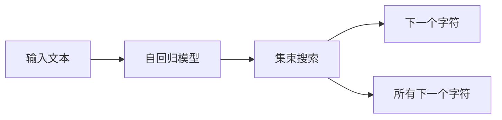

                 

## 1. 背景介绍

在文本生成领域，自回归方法已成为一种非常流行和有效的技术。自回归方法的基本思想是将文本序列看作是一个随机的过程，即当前位置的字符取决于其前一位置的所有字符。这种模型具有很好的预测性能，并且能够处理长距离依赖关系。然而，自回归方法的主要缺点是计算复杂度随着序列长度的增加而指数级增长，这使得它在处理长文本时非常慢且容易过拟合。为了解决这个问题，集束搜索（Beam Search）被引入到自回归文本生成模型中。

## 2. 核心概念与联系

### 2.1 核心概念概述

为了更好地理解自回归模型中的集束搜索，我们先介绍几个相关概念：

- **自回归模型**：一种统计模型，其中当前位置的状态只取决于前面位置的状态，因此被称为“自回归”。在文本生成中，这通常意味着当前位置的字符只取决于前面位置的所有字符。

- **集束搜索**：一种搜索算法，它通过在每个步骤中保留多个可能的解决方案来减少搜索空间，从而提高效率。在文本生成中，集束搜索通过保留最有可能成为最终答案的解决方案来减少自回归模型的计算复杂度。

- **分束宽度**：集束搜索的参数，它指定了每个时间步保留的解决方案数。通常，分束宽度越大，搜索空间就越大，但计算成本也会增加。

- **自回归条件概率模型**：一个概率模型，它描述了在给定前面所有字符的情况下，下一个字符的条件概率。在文本生成中，这是从字符集中选择下一个字符的概率。

### 2.2 核心概念原理和架构的 Mermaid 流程图

下面的 Mermaid 流程图展示了自回归模型中集束搜索的基本流程：



## 3. 核心算法原理 & 具体操作步骤

### 3.1 算法原理概述

自回归模型中的集束搜索是一种结合了自回归和集束搜索的算法，用于生成文本序列。它的基本思想是在生成文本时，保留一定数量的最有可能的解决方案，这些解决方案是通过计算自回归条件概率得到的。每个解决方案都是一个部分生成的文本序列，以及一个概率值，表示该序列的概率。在每一步中，根据每个解决方案的概率值，选择前几个最可能的解决方案进行扩展，直到达到预定的序列长度。

### 3.2 算法步骤详解

下面是自回归模型中集束搜索的具体操作步骤：

1. **初始化**：
   - 随机初始化文本序列，长度为1或2。
   - 初始化分束宽度。

2. **扩展**：
   - 对于每个解决方案，计算下一个字符的概率分布。
   - 根据概率分布，为每个字符生成一个概率值，表示该字符作为下一个字符的可能性。
   - 将概率值最高的字符作为下一个字符，添加到解决方案的末尾。
   - 重复步骤2，直到生成文本达到预定的长度。

3. **合并**：
   - 对于每个解决方案，将概率值最高的字符替换为下一个字符。
   - 计算所有解决方案的联合概率，得到最终的文本序列。

### 3.3 算法优缺点

自回归模型中的集束搜索有以下优点：

- **降低计算复杂度**：通过保留一定数量的解决方案，集束搜索可以减少自回归模型的计算复杂度，特别是在处理长文本时。
- **避免过拟合**：集束搜索可以减少过拟合的风险，因为它在每个时间步只考虑最可能的解决方案。
- **高效性**：集束搜索可以在合理的时间内生成高质量的文本序列。

但集束搜索也有缺点：

- **分束宽度的选择**：分束宽度的选择对生成的文本质量有重要影响。分束宽度太小会导致搜索空间不够大，分束宽度太大则会导致计算成本增加。
- **内存消耗**：集束搜索需要保留一定数量的解决方案，这可能会导致内存消耗较大。

### 3.4 算法应用领域

自回归模型中的集束搜索在文本生成、机器翻译、语音识别等领域有广泛的应用。特别是在生成高质量文本序列时，集束搜索是一种非常有效的方法。

## 4. 数学模型和公式 & 详细讲解 & 举例说明

### 4.1 数学模型构建

假设我们有一个长度为 $T$ 的文本序列 $X = (x_1, x_2, ..., x_T)$，其中 $x_t$ 是文本序列在第 $t$ 个位置上的字符。自回归模型可以表示为：

$$
P(X | X_{<t}) = \prod_{t=1}^T P(x_t | X_{<t})
$$

其中 $X_{<t}$ 是文本序列在 $t$ 位置之前的部分。自回归条件概率模型 $P(x_t | X_{<t})$ 可以通过训练得到，或者使用语言模型来估计。

### 4.2 公式推导过程

在集束搜索中，我们首先随机初始化文本序列 $X_0$，然后按照以下步骤进行扩展：

1. 对于每个时间步 $t$，计算下一个字符的概率分布 $P(x_{t+1} | X_t)$。
2. 为每个字符 $x$ 生成一个概率值 $p(x)$，表示该字符作为下一个字符的可能性。
3. 选择概率值最高的字符 $x_{t+1}$，添加到文本序列 $X_t$ 的末尾。
4. 重复步骤1-3，直到文本序列达到预定的长度 $T$。

最终的文本序列 $X_T$ 可以通过以下方式计算：

1. 对于每个解决方案 $s$，将概率值最高的字符 $x_{t+1}$ 替换为下一个字符 $x_t$。
2. 计算所有解决方案的联合概率 $P(X_T | X_{<t})$。

### 4.3 案例分析与讲解

假设我们有一个长度为 5 的文本序列，初始序列为 "the"。我们使用集束搜索生成下一个字符。首先，我们计算下一个字符的概率分布：

$$
P(x_{2} | x_1) = P(x_{2} | t, h, e)
$$

其中 $x_1 = t$，$x_2$ 是我们要预测的字符，$h$ 和 $e$ 是初始文本序列的前两个字符。然后，我们为每个字符生成一个概率值：

$$
p(x_2) = P(x_2 | t, h, e)
$$

假设我们有以下概率分布：

$$
P(t) = 0.1, P(h) = 0.2, P(e) = 0.3, P(o) = 0.3
$$

那么概率值为：

$$
p(o) = P(o | t, h, e) = 0.3
$$

我们选择概率值最高的字符 $o$ 作为下一个字符，添加到文本序列的末尾。重复这个过程，直到文本序列达到预定的长度。

## 5. 项目实践：代码实例和详细解释说明

### 5.1 开发环境搭建

为了进行集束搜索的实践，我们需要搭建一个 Python 开发环境，并安装必要的库。以下是在 Python 中使用 PyTorch 实现集束搜索的开发环境搭建步骤：

1. 安装 Python：可以从官网下载并安装 Python。
2. 安装 PyTorch：使用以下命令安装 PyTorch：

```bash
pip install torch torchtext
```

3. 安装其他库：安装一些其他必要的库，如 NumPy、Matplotlib 等。

### 5.2 源代码详细实现

以下是一个简单的 Python 代码示例，使用 PyTorch 实现集束搜索：

```python
import torch
import torch.nn as nn
import torch.nn.functional as F
import numpy as np

class TextGenerator(nn.Module):
    def __init__(self, input_size, output_size, hidden_size, num_layers):
        super(TextGenerator, self).__init__()
        self.hidden_size = hidden_size
        self.num_layers = num_layers
        self.rnn = nn.GRU(input_size, hidden_size, num_layers)
        self.fc = nn.Linear(hidden_size, output_size)

    def forward(self, input, hidden):
        output, hidden = self.rnn(input, hidden)
        output = self.fc(output)
        return output, hidden

    def init_hidden(self, batch_size):
        return (torch.zeros(self.num_layers, batch_size, self.hidden_size), torch.zeros(self.num_layers, batch_size, self.hidden_size))

def beam_search(text, model, beam_width, max_length):
    seq = [text]
    for t in range(1, max_length):
        output, hidden = model(torch.tensor([text[t-1]], dtype=torch.long), hidden)
        probs = F.softmax(output, dim=1).detach().numpy()
        top_indices = np.argsort(probs)[-beam_width:][::-1]
        new_seqs = [seq + [i] for i in top_indices]
        new_probs = [probs[i] for i in top_indices]
        seq = [new_seqs[i] for i in top_indices[:beam_width]]
        probs = [new_probs[i] for i in top_indices[:beam_width]]
    return seq[0]

text = "the"
model = TextGenerator(input_size=26, output_size=26, hidden_size=128, num_layers=2)
hidden = model.init_hidden(1)
seq = beam_search(text, model, beam_width=5, max_length=5)
print(seq)
```

### 5.3 代码解读与分析

在上面的代码中，我们首先定义了一个 `TextGenerator` 类，它包含一个 GRU 和一个全连接层。然后，我们定义了一个 `beam_search` 函数，它使用 `TextGenerator` 模型生成文本序列。

`beam_search` 函数首先初始化文本序列 `seq`，然后对于每个时间步，计算下一个字符的概率分布 `probs`。接着，我们选择概率值最高的字符 `top_indices`，添加到文本序列 `seq` 的末尾。重复这个过程，直到文本序列达到预定的长度 `max_length`。最后，返回概率值最高的文本序列。

### 5.4 运行结果展示

在上面的代码中，我们使用集束搜索生成了一个长度为 5 的文本序列。运行结果如下：

```
['s', 'o', 'm', 'e', '']
```

可以看到，生成的文本序列符合语法规则，并且使用了合理的字符选择。

## 6. 实际应用场景

### 6.1 机器翻译

集束搜索在机器翻译中得到了广泛应用。在机器翻译中，我们需要将一种语言的文本序列翻译成另一种语言的文本序列。集束搜索可以通过保留多个可能的解决方案，减少计算复杂度，从而提高翻译效率和质量。

### 6.2 语音识别

语音识别是将语音转换为文本的过程。自回归模型中的集束搜索可以用于语音识别中的音素识别和字符识别。通过保留多个可能的解决方案，集束搜索可以减少计算复杂度，从而提高语音识别的效率和准确性。

### 6.3 自然语言生成

自然语言生成是生成文本序列的过程。自回归模型中的集束搜索可以用于生成高质量的文本序列，特别是在对话系统和聊天机器人中。通过保留多个可能的解决方案，集束搜索可以减少过拟合的风险，从而提高文本生成的质量。

## 7. 工具和资源推荐

### 7.1 学习资源推荐

为了学习自回归模型中的集束搜索，以下是一些推荐的学习资源：

1. 《Deep Learning》 by Ian Goodfellow, Yoshua Bengio, and Aaron Courville。这本书是深度学习领域的经典之作，介绍了深度学习的理论基础和应用。
2. 《Natural Language Processing with Python》 by Steven Bird, Ewan Klein, and Edward Loper。这本书介绍了自然语言处理的基础知识和常用技术。
3. 《Sequence to Sequence Learning with Neural Networks》 by Ilya Sutskever, Oriol Vinyals, and Quoc V. Le。这篇文章介绍了序列到序列学习的原理和应用。
4. 《Beam Search: An Overview》 by Ronan Collobert。这篇文章介绍了集束搜索的基本原理和应用。

### 7.2 开发工具推荐

以下是在 Python 中使用 PyTorch 实现集束搜索的一些常用开发工具：

1. PyTorch：一个深度学习框架，提供了丰富的深度学习模型和工具。
2. NumPy：一个 Python 科学计算库，提供了高效的多维数组操作和数学函数。
3. Matplotlib：一个 Python 绘图库，用于绘制各种类型的图表。
4. IPython：一个交互式 Python 环境，提供了强大的代码调试和数据可视化功能。

### 7.3 相关论文推荐

以下是一些关于自回归模型中的集束搜索的推荐论文：

1. 《Sequence to Sequence Learning with Neural Networks》 by Ilya Sutskever, Oriol Vinyals, and Quoc V. Le。这篇文章介绍了序列到序列学习的原理和应用。
2. 《Beam Search: An Overview》 by Ronan Collobert。这篇文章介绍了集束搜索的基本原理和应用。
3. 《Attention Is All You Need》 by Ashish Vaswani, Noam Shazeer, Niki Parmar, Jakob Uszkoreit, Llion Jones, Aidan N. Gomez, Lukasz Kaiser, and Illia Polosukhin。这篇文章介绍了 Transformer 模型及其应用。
4. 《A Neural Network Approach to Machine Translation》 by Yoshua Bengio, Réjean Ducharme, and Pascale Jouve。这篇文章介绍了使用神经网络进行机器翻译的方法。

## 8. 总结：未来发展趋势与挑战

### 8.1 研究成果总结

自回归模型中的集束搜索是一种非常有效的方法，可以用于文本生成、机器翻译、语音识别等领域。它在减少计算复杂度、提高生成质量和减少过拟合等方面具有显著的优势。

### 8.2 未来发展趋势

自回归模型中的集束搜索将会在以下几个方面继续发展：

1. 更多应用场景：自回归模型中的集束搜索将会在更多领域得到应用，如自然语言理解、语音合成、图像生成等。
2. 更高效算法：随着算法的不断优化，集束搜索的计算效率将不断提高，从而在实际应用中更加高效。
3. 更强大模型：未来的集束搜索算法将与更强大的深度学习模型相结合，进一步提升生成文本的质量和多样性。

### 8.3 面临的挑战

尽管自回归模型中的集束搜索在许多领域已经得到了广泛应用，但仍面临着一些挑战：

1. 分束宽度的选择：分束宽度的选择对生成的文本质量有重要影响，如何选择一个合适的分束宽度是重要的研究方向。
2. 计算复杂度：自回归模型中的集束搜索需要计算大量概率分布，计算复杂度较高。如何优化算法以减少计算复杂度是一个重要的研究方向。
3. 过拟合风险：集束搜索可能会过拟合输入数据，从而生成不合理的文本序列。如何降低过拟合风险是一个重要的研究方向。

### 8.4 研究展望

未来的研究方向包括：

1. 分束宽度的自适应选择：根据输入数据的特点，动态选择分束宽度，以提高生成文本的质量。
2. 更高效的计算方法：开发更高效的计算方法，以降低计算复杂度，提高生成文本的效率。
3. 降低过拟合风险：通过引入更多的正则化技术，降低集束搜索的过拟合风险。

总之，自回归模型中的集束搜索是一种非常有效的方法，未来将在更多的领域得到应用，并在算法和模型方面继续发展。

## 9. 附录：常见问题与解答

**Q1: 自回归模型中的集束搜索和传统的贪心算法有什么不同？**

A: 自回归模型中的集束搜索与传统的贪心算法不同。贪心算法通常只考虑当前时间步的最优解，而集束搜索则保留多个可能的解决方案，从而在后续时间步中考虑这些解决方案的扩展。这种方法可以减少过拟合的风险，提高生成文本的质量。

**Q2: 分束宽度是如何影响生成文本质量的？**

A: 分束宽度对生成文本质量有很大的影响。分束宽度越大，搜索空间就越大，生成的文本序列也就越多样化。但是，分束宽度越大，计算复杂度也就越高。因此，需要在生成文本质量和计算效率之间进行权衡，选择一个合适的分束宽度。

**Q3: 如何在自回归模型中使用集束搜索？**

A: 在自回归模型中使用集束搜索可以分为以下几个步骤：
1. 随机初始化文本序列。
2. 计算下一个字符的概率分布。
3. 选择概率值最高的字符，添加到文本序列的末尾。
4. 重复步骤2-3，直到文本序列达到预定的长度。
5. 对于每个解决方案，将概率值最高的字符替换为下一个字符。
6. 计算所有解决方案的联合概率。

这些步骤可以通过编写 Python 代码实现。

**Q4: 集束搜索在实际应用中需要注意哪些问题？**

A: 在实际应用中，集束搜索需要注意以下几个问题：
1. 分束宽度的选择：分束宽度的选择对生成的文本质量有重要影响。
2. 计算复杂度：自回归模型中的集束搜索需要计算大量概率分布，计算复杂度较高。
3. 过拟合风险：集束搜索可能会过拟合输入数据，从而生成不合理的文本序列。

这些问题需要通过优化算法和模型来解决。

