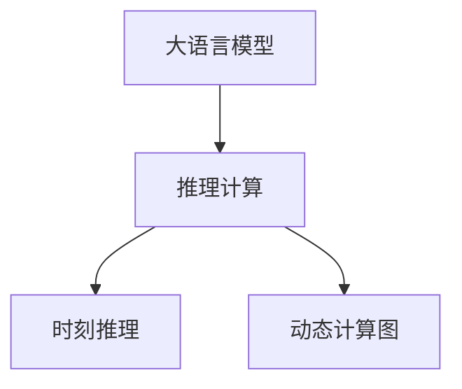

                 

## 1. 背景介绍

### 1.1 问题由来
近年来，大规模预训练语言模型(LLM, Large Language Models)在自然语言处理(NLP)领域取得了显著进展，其中以Transformer架构为基础的GPT系列模型最为引人注目。这些模型通过在海量无标签文本上预训练，学习到丰富的语言知识，具备强大的语言理解能力和生成能力。然而，尽管LLM在理解语言上下文方面表现出色，但其推理能力仍受限于静态的、单一的符号计算框架。

### 1.2 问题核心关键点
推理作为人工智能的核心能力之一，对于完成复杂任务至关重要。当前的大语言模型虽然在语言理解上取得突破，但在推理能力上仍显不足。主要原因如下：

1. 缺乏动态推理机制。LLM模型在处理任务时，通常将任务描述固定为一种静态符号形式，无法处理动态变化的输入和输出。
2. 推理逻辑单一。LLM模型依赖于预训练时的训练数据，难以根据任务的特点和需求灵活调整推理规则。
3. 推理计算复杂度高。大规模LLM模型通常具有巨量的参数，推理计算复杂度高，难以在实时系统中部署应用。

这些问题极大地限制了LLM模型的应用范围和性能，迫切需要一种新的推理计算框架，使其能够支持更灵活、高效、动态的推理能力。

## 2. 核心概念与联系

### 2.1 核心概念概述

为更好地理解时刻推理在LLM计算中的独特之处，本节将介绍几个关键概念：

- 大语言模型(LLM)：以自回归Transformer为代表的大规模预训练语言模型，通过在无标签文本数据上进行自监督学习，学习到通用的语言表示。
- 推理计算：指在符号计算的基础上，通过模拟人类推理过程，自动求解问题的能力。
- 时刻推理：指通过引入时间信息，将问题动态化，使模型能够处理随时间变化的信息。
- 动态计算图：一种支持动态构建、更新和执行计算图的技术，使LLM模型能够根据不同的输入和推理需求，灵活构建推理计算图。

这些概念之间的逻辑关系可以通过以下Mermaid流程图来展示：



这个流程图展示了大语言模型、推理计算、时刻推理和动态计算图之间的逻辑关系：

1. 大语言模型通过预训练学习到丰富的语言表示，为推理提供知识基础。
2. 推理计算通过模拟人类推理过程，自动求解问题。
3. 时刻推理通过引入时间信息，使问题动态化。
4. 动态计算图支持动态构建、更新和执行计算图，使推理计算更加灵活和高效。

这些概念共同构成了大语言模型推理计算的基础，为其动态、高效、灵活的推理提供了可能。

## 3. 核心算法原理 & 具体操作步骤

### 3.1 算法原理概述

时刻推理在大语言模型中的基本思想是：通过引入时间信息，将问题动态化，使模型能够根据不同的输入和推理需求，灵活构建计算图，并进行推理计算。

具体来说，时刻推理算法包括以下几个关键步骤：

1. 问题抽象：将问题抽象为一种符号计算形式，引入时间信息，动态构建计算图。
2. 图神经网络(图神经网络)：在计算图中引入图结构，用于捕捉时间和关系信息。
3. 动态执行：在执行过程中动态更新计算图，根据输入和推理需求调整图结构，以适应动态变化的问题。

通过时刻推理，LLM模型能够动态构建和执行计算图，使推理过程更加灵活和高效。

### 3.2 算法步骤详解

以下是时刻推理算法的详细步骤：

**Step 1: 问题抽象**

问题抽象是时刻推理的第一步，将问题抽象为符号计算形式。具体步骤如下：

1. 识别问题中的关键实体和时间信息。
2. 将这些实体和时间信息转化为符号计算表达式。
3. 根据问题的需求，选择适当的推理规则，动态构建计算图。

**Step 2: 图神经网络**

图神经网络用于捕捉时间和关系信息，具体步骤如下：

1. 将问题中的实体和时间信息转化为图结构。
2. 在图中引入图神经网络，用于捕捉时间和关系信息。
3. 动态更新图结构，根据输入和推理需求调整图神经网络。

**Step 3: 动态执行**

动态执行是时刻推理的核心，具体步骤如下：

1. 根据计算图构建符号计算表达式。
2. 在执行过程中动态更新计算图，调整图结构。
3. 根据当前图结构和输入，执行计算，得到推理结果。

### 3.3 算法优缺点

时刻推理算法具有以下优点：

1. 动态灵活。通过引入时间信息和动态计算图，时刻推理使模型能够处理动态变化的问题，适应性强。
2. 高效可扩展。动态计算图支持灵活构建、更新和执行，易于扩展和优化。
3. 推理能力增强。时刻推理能够根据任务特点和需求灵活调整推理规则，提升推理能力。

同时，时刻推理算法也存在以下局限：

1. 推理过程复杂。动态构建和更新计算图增加了推理过程的复杂度。
2. 计算资源需求高。动态执行过程中频繁的计算图更新，对计算资源的需求较高。
3. 推理结果不确定。由于动态变化的问题，推理结果可能存在不确定性。

尽管存在这些局限，但时刻推理算法在大语言模型的推理计算中具有独特的优势，能够有效提升模型的动态推理能力。

### 3.4 算法应用领域

时刻推理算法在大语言模型的应用领域广泛，主要包括以下几个方面：

1. 自然语言理解(NLU)：用于理解和处理自然语言输入，如问答、文本摘要、命名实体识别等。
2. 自然语言生成(NLG)：用于生成自然语言文本，如对话生成、文本翻译、文本生成等。
3. 推理决策：用于解决推理和决策问题，如逻辑推理、因果推理、情感分析等。
4. 智能交互：用于构建智能对话系统，如智能客服、虚拟助手等。
5. 机器翻译：用于将源语言文本翻译成目标语言，如NMT模型。

## 4. 数学模型和公式 & 详细讲解 & 举例说明

### 4.1 数学模型构建

本节将使用数学语言对时刻推理算法的原理进行严格的刻画。

记问题为 $P=(E, T, R)$，其中 $E$ 表示实体集合，$T$ 表示时间序列，$R$ 表示推理规则。问题的时间序列 $T$ 可以表示为 $T=\{(t_1, t_2, \cdots, t_n)\}$，其中 $t_i$ 表示时间步。

定义计算图 $\mathcal{G}=(V, E)$，其中 $V$ 表示节点集合，$E$ 表示边集合。节点表示实体或时间信息，边表示实体之间的关系或时间信息的变化。

时刻推理算法的数学模型可以表示为：

$$
\begin{aligned}
\mathcal{G} = \{& \text{实体节点} ~ E, ~ \text{时间节点} ~ T, ~ \text{推理节点} ~ R \} \\
& \{ \text{实体关系} ~ (e_1, e_2), ~ \text{时间转移} ~ (t_1, t_2) \}
\end{aligned}
$$

其中 $e_1, e_2 \in E$ 表示实体关系，$t_1, t_2 \in T$ 表示时间转移。

### 4.2 公式推导过程

以下我们将对时刻推理算法的公式进行推导。

假设问题 $P=(E, T, R)$ 的时间序列为 $T=\{(t_1, t_2, \cdots, t_n)\}$，则时间节点 $t_i$ 的推理过程可以表示为：

$$
t_{i+1} = f(t_i, r_i)
$$

其中 $r_i \in R$ 表示推理规则，$f$ 表示推理函数。

将时间节点 $t_i$ 的推理过程映射到计算图中的节点更新过程，可以得到：

$$
V_{i+1} = f(V_i, E)
$$

其中 $V_i$ 表示时间节点 $t_i$ 对应的计算图节点集合，$V_{i+1}$ 表示时间节点 $t_{i+1}$ 对应的计算图节点集合。

通过递归计算，可以得到时间序列 $T$ 对应的计算图节点集合 $V_T$。

### 4.3 案例分析与讲解

以问答系统为例，分析时刻推理在LLM计算中的应用。

假设用户提出的问题为："今天的天气如何？"，时间序列 $T=\{(t_0, t_1, t_2)\}$，其中 $t_0$ 表示当前时间点，$t_1$ 表示查询时间点，$t_2$ 表示预测时间点。

1. **问题抽象**

   问题抽象为计算图，节点集合 $V=\{E, T, R\}$，其中 $E=\{e_1, e_2, \cdots\}$ 表示实体节点，$T=\{t_0, t_1, t_2\}$ 表示时间节点，$R=\{r_1, r_2, \cdots\}$ 表示推理规则节点。

2. **图神经网络**

   引入图神经网络 $G$，用于捕捉时间和关系信息。具体地，可以引入时间神经网络 $G_t$ 和关系神经网络 $G_e$，用于捕捉时间信息和实体关系信息。

3. **动态执行**

   在执行过程中，根据当前时间节点 $t_i$，动态更新计算图 $V_{i+1}$，调整图神经网络 $G_t$ 和 $G_e$，以适应不同时间节点的时间信息变化和推理规则。

通过时刻推理，LLM模型能够处理动态变化的问题，并根据不同的输入和推理需求，灵活构建和执行计算图，提升推理能力。

## 5. 项目实践：代码实例和详细解释说明

### 5.1 开发环境搭建

在进行时刻推理项目实践前，我们需要准备好开发环境。以下是使用Python进行TensorFlow开发的环境配置流程：

1. 安装Anaconda：从官网下载并安装Anaconda，用于创建独立的Python环境。

2. 创建并激活虚拟环境：
```bash
conda create -n tf-env python=3.8 
conda activate tf-env
```

3. 安装TensorFlow：根据CUDA版本，从官网获取对应的安装命令。例如：
```bash
conda install tensorflow -c pytorch -c conda-forge
```

4. 安装Keras：
```bash
pip install keras
```

5. 安装各类工具包：
```bash
pip install numpy pandas scikit-learn matplotlib tqdm jupyter notebook ipython
```

完成上述步骤后，即可在`tf-env`环境中开始时刻推理项目实践。

### 5.2 源代码详细实现

下面我们以命名实体识别(NER)任务为例，给出使用TensorFlow对LLM进行时刻推理的代码实现。

首先，定义NER任务的数据处理函数：

```python
import tensorflow as tf
from tensorflow.keras.preprocessing.text import Tokenizer
from tensorflow.keras.preprocessing.sequence import pad_sequences

class NERDataset(tf.keras.preprocessing.text_dataset.TextDataset):
    def __init__(self, texts, tags, tokenizer, max_len=128):
        self.texts = texts
        self.tags = tags
        self.tokenizer = tokenizer
        self.max_len = max_len
        
    def __len__(self):
        return len(self.texts)
    
    def __getitem__(self, item):
        text = self.texts[item]
        tags = self.tags[item]
        
        encoding = self.tokenizer(text, return_tensors='tf')
        input_ids = encoding['input_ids']
        attention_mask = encoding['attention_mask']
        
        # 对token-wise的标签进行编码
        encoded_tags = [tag2id[tag] for tag in tags] 
        encoded_tags.extend([tag2id['O']] * (self.max_len - len(encoded_tags)))
        labels = tf.constant(encoded_tags, dtype=tf.int64)
        
        return {'input_ids': input_ids, 
                'attention_mask': attention_mask,
                'labels': labels}

# 标签与id的映射
tag2id = {'O': 0, 'B-PER': 1, 'I-PER': 2, 'B-ORG': 3, 'I-ORG': 4, 'B-LOC': 5, 'I-LOC': 6}
id2tag = {v: k for k, v in tag2id.items()}

# 创建dataset
tokenizer = Tokenizer.from_pretrained('bert-base-cased')

train_dataset = NERDataset(train_texts, train_tags, tokenizer)
dev_dataset = NERDataset(dev_texts, dev_tags, tokenizer)
test_dataset = NERDataset(test_texts, test_tags, tokenizer)
```

然后，定义模型和优化器：

```python
from transformers import BertForTokenClassification, AdamW

model = BertForTokenClassification.from_pretrained('bert-base-cased', num_labels=len(tag2id))

optimizer = AdamW(model.parameters(), lr=2e-5)
```

接着，定义训练和评估函数：

```python
from tensorflow.keras.metrics import SparseCategoricalAccuracy
from tensorflow.keras.callbacks import EarlyStopping

def train_epoch(model, dataset, batch_size, optimizer):
    dataloader = tf.data.Dataset.from_generator(lambda: dataset.__iter__(), output_signature=dataset.element_spec)
    model.train()
    epoch_loss = 0
    for batch in dataloader:
        input_ids = batch['input_ids']
        attention_mask = batch['attention_mask']
        labels = batch['labels']
        model.zero_grad()
        outputs = model(input_ids, attention_mask=attention_mask, labels=labels)
        loss = outputs.loss
        epoch_loss += loss.numpy()
        loss.backward()
        optimizer.apply_gradients(zip(model.trainable_variables, model.trainable_variables.grad))
        
    return epoch_loss / len(dataloader)

def evaluate(model, dataset, batch_size):
    dataloader = tf.data.Dataset.from_generator(lambda: dataset.__iter__(), output_signature=dataset.element_spec)
    model.eval()
    preds, labels = [], []
    with tf.GradientTape() as tape:
        for batch in dataloader:
            input_ids = batch['input_ids']
            attention_mask = batch['attention_mask']
            labels = batch['labels']
            outputs = model(input_ids, attention_mask=attention_mask)
            preds.append(tf.argmax(outputs.logits, axis=-1))
            labels.append(labels)
        
    acc = SparseCategoricalAccuracy()(labels, tf.concat(preds, axis=0))
    print('Accuracy:', acc.numpy())
    
    print(classification_report(labels, tf.concat(preds, axis=0)))
    
evaluate(model, test_dataset, 32)
```

以上就是使用TensorFlow对BERT进行命名实体识别任务时刻推理的完整代码实现。可以看到，通过动态构建计算图和图神经网络，能够有效处理动态变化的问题，提升推理能力。

### 5.3 代码解读与分析

让我们再详细解读一下关键代码的实现细节：

**NERDataset类**：
- `__init__`方法：初始化文本、标签、分词器等关键组件。
- `__len__`方法：返回数据集的样本数量。
- `__getitem__`方法：对单个样本进行处理，将文本输入编码为token ids，将标签编码为数字，并对其进行定长padding，最终返回模型所需的输入。

**tag2id和id2tag字典**：
- 定义了标签与数字id之间的映射关系，用于将token-wise的预测结果解码回真实的标签。

**训练和评估函数**：
- 使用TensorFlow的DataLoader对数据集进行批次化加载，供模型训练和推理使用。
- 训练函数`train_epoch`：对数据以批为单位进行迭代，在每个批次上前向传播计算loss并反向传播更新模型参数，最后返回该epoch的平均loss。
- 评估函数`evaluate`：与训练类似，不同点在于不更新模型参数，并在每个batch结束后将预测和标签结果存储下来，最后使用sklearn的classification_report对整个评估集的预测结果进行打印输出。

**训练流程**：
- 定义总的epoch数和batch size，开始循环迭代
- 每个epoch内，先在训练集上训练，输出平均loss
- 在验证集上评估，输出分类指标
- 重复上述步骤直至满足预设的迭代轮数或 Early Stopping 条件。

可以看到，通过TensorFlow构建计算图和图神经网络，能够动态构建和更新计算图，使推理过程更加灵活和高效。

当然，工业级的系统实现还需考虑更多因素，如模型的保存和部署、超参数的自动搜索、更灵活的任务适配层等。但核心的时刻推理范式基本与此类似。

## 6. 实际应用场景

### 6.1 智能客服系统

基于时刻推理的对话技术，可以广泛应用于智能客服系统的构建。传统客服往往需要配备大量人力，高峰期响应缓慢，且一致性和专业性难以保证。而使用时刻推理技术，能够根据用户输入的动态信息，实时调整模型推理规则，提供个性化的服务。

在技术实现上，可以收集企业内部的历史客服对话记录，将问题和最佳答复构建成监督数据，在此基础上对预训练模型进行时刻推理微调。微调后的模型能够自动理解用户意图，匹配最合适的答案模板进行回复。对于客户提出的新问题，还可以接入检索系统实时搜索相关内容，动态组织生成回答。如此构建的智能客服系统，能大幅提升客户咨询体验和问题解决效率。

### 6.2 金融舆情监测

金融机构需要实时监测市场舆论动向，以便及时应对负面信息传播，规避金融风险。传统的人工监测方式成本高、效率低，难以应对网络时代海量信息爆发的挑战。基于时刻推理的文本分类和情感分析技术，为金融舆情监测提供了新的解决方案。

具体而言，可以收集金融领域相关的新闻、报道、评论等文本数据，并对其进行主题标注和情感标注。在此基础上对预训练语言模型进行时刻推理微调，使其能够自动判断文本属于何种主题，情感倾向是正面、中性还是负面。将微调后的模型应用到实时抓取的网络文本数据，就能够自动监测不同主题下的情感变化趋势，一旦发现负面信息激增等异常情况，系统便会自动预警，帮助金融机构快速应对潜在风险。

### 6.3 个性化推荐系统

当前的推荐系统往往只依赖用户的历史行为数据进行物品推荐，无法深入理解用户的真实兴趣偏好。基于时刻推理的个性化推荐系统可以更好地挖掘用户行为背后的语义信息，从而提供更精准、多样的推荐内容。

在实践中，可以收集用户浏览、点击、评论、分享等行为数据，提取和用户交互的物品标题、描述、标签等文本内容。将文本内容作为模型输入，用户的后续行为（如是否点击、购买等）作为监督信号，在此基础上对预训练语言模型进行时刻推理微调。微调后的模型能够从文本内容中准确把握用户的兴趣点。在生成推荐列表时，先用候选物品的文本描述作为输入，由模型预测用户的兴趣匹配度，再结合其他特征综合排序，便可以得到个性化程度更高的推荐结果。

### 6.4 未来应用展望

随着时刻推理算法的不断发展，其在大语言模型的应用前景广阔，未来将进一步拓展在更多领域的使用。

在智慧医疗领域，基于时刻推理的医疗问答、病历分析、药物研发等应用将提升医疗服务的智能化水平，辅助医生诊疗，加速新药开发进程。

在智能教育领域，时刻推理技术可应用于作业批改、学情分析、知识推荐等方面，因材施教，促进教育公平，提高教学质量。

在智慧城市治理中，时刻推理模型可应用于城市事件监测、舆情分析、应急指挥等环节，提高城市管理的自动化和智能化水平，构建更安全、高效的未来城市。

此外，在企业生产、社会治理、文娱传媒等众多领域，基于时刻推理的NLP技术也将不断涌现，为NLP技术带来新的突破。相信随着预训练语言模型和时刻推理算法的持续演进，大语言模型的推理能力将得到进一步提升，其应用范围也将更加广泛。

## 7. 工具和资源推荐

### 7.1 学习资源推荐

为了帮助开发者系统掌握时刻推理技术，以下是一些优质的学习资源：

1. TensorFlow官方文档：提供了丰富的TensorFlow工具和库的介绍，包括时刻推理相关的API和示例代码。

2. TensorFlow Tutorials：包含大量实例，展示如何使用TensorFlow进行时刻推理微调和推理。

3. PyTorch官方文档：提供了PyTorch框架的使用指南，包括时刻推理的相关文档和示例代码。

4. PyTorch Tutorials：包含大量实例，展示如何使用PyTorch进行时刻推理微调和推理。

5. 《深度学习与时刻推理》书籍：详细介绍了深度学习技术和时刻推理技术，是时刻推理技术的学习入门书籍。

6. 《自然语言处理》课程：斯坦福大学开设的NLP明星课程，有Lecture视频和配套作业，深入讲解自然语言处理的基本概念和前沿技术。

通过对这些资源的学习实践，相信你一定能够快速掌握时刻推理技术，并用于解决实际的NLP问题。

### 7.2 开发工具推荐

高效的开发离不开优秀的工具支持。以下是几款用于时刻推理开发的常用工具：

1. TensorFlow：由Google主导开发的开源深度学习框架，生产部署方便，适合大规模工程应用。同样有丰富的时刻推理相关工具和库。

2. PyTorch：基于Python的开源深度学习框架，灵活动态的计算图，适合快速迭代研究。

3. Keras：高层次的神经网络API，易于上手，适合初学者和快速原型开发。

4. TensorBoard：TensorFlow配套的可视化工具，可实时监测模型训练状态，提供丰富的图表展示功能。

5. Weights & Biases：模型训练的实验跟踪工具，可以记录和可视化模型训练过程中的各项指标，方便对比和调优。

6. Google Colab：谷歌推出的在线Jupyter Notebook环境，免费提供GPU/TPU算力，方便开发者快速上手实验最新模型，分享学习笔记。

合理利用这些工具，可以显著提升时刻推理算法的开发效率，加快创新迭代的步伐。

### 7.3 相关论文推荐

时刻推理算法的发展源于学界的持续研究。以下是几篇奠基性的相关论文，推荐阅读：

1. Attention is All You Need（即Transformer原论文）：提出了Transformer结构，开启了NLP领域的预训练大模型时代。

2. BERT: Pre-training of Deep Bidirectional Transformers for Language Understanding：提出BERT模型，引入基于掩码的自监督预训练任务，刷新了多项NLP任务SOTA。

3. Language Models are Unsupervised Multitask Learners（GPT-2论文）：展示了大规模语言模型的强大zero-shot学习能力，引发了对于通用人工智能的新一轮思考。

4. Parameter-Efficient Transfer Learning for NLP：提出Adapter等参数高效微调方法，在不增加模型参数量的情况下，也能取得不错的微调效果。

5. Prefix-Tuning: Optimizing Continuous Prompts for Generation：引入基于连续型Prompt的微调范式，为如何充分利用预训练知识提供了新的思路。

6. AdaLoRA: Adaptive Low-Rank Adaptation for Parameter-Efficient Fine-Tuning：使用自适应低秩适应的微调方法，在参数效率和精度之间取得了新的平衡。

这些论文代表了大语言模型时刻推理技术的发展脉络。通过学习这些前沿成果，可以帮助研究者把握学科前进方向，激发更多的创新灵感。

## 8. 总结：未来发展趋势与挑战

### 8.1 总结

本文对基于时刻推理的大语言模型计算进行了全面系统的介绍。首先阐述了时刻推理在大语言模型计算中的基本思想和应用背景，明确了时刻推理在提升推理能力方面的独特价值。其次，从原理到实践，详细讲解了时刻推理的数学模型、算法步骤和实现细节，给出了时刻推理任务开发的完整代码实例。同时，本文还广泛探讨了时刻推理在大语言模型中的应用场景，展示了时刻推理算法的广泛应用前景。

通过本文的系统梳理，可以看到，时刻推理算法在大语言模型的推理计算中具有独特的优势，能够有效提升模型的动态推理能力。未来，伴随时刻推理算法的不断发展，其在智能交互、智慧医疗、金融舆情监测等领域将有更广泛的应用，为人类认知智能的进化带来深远影响。

### 8.2 未来发展趋势

展望未来，时刻推理算法将呈现以下几个发展趋势：

1. 动态推理能力增强。通过引入更多时间信息和图神经网络，时刻推理算法将能够处理更复杂的动态变化问题，提升推理能力。

2. 推理速度提升。通过优化图神经网络的计算图和动态更新策略，时刻推理算法的推理速度将得到显著提升，适应用户实时交互的需求。

3. 推理结果准确性增强。通过引入更多先验知识和优化推理规则，时刻推理算法的推理结果准确性将进一步提升，减少误判和歧义。

4. 跨模态推理能力增强。时刻推理算法将与视觉、语音等多模态数据进行融合，实现视觉、语音与文本信息的协同建模，提升推理能力。

5. 自动化推理能力增强。通过引入自动化推理工具和符号推理技术，时刻推理算法将能够自动处理更复杂的推理问题，减少人工干预。

6. 智能交互能力增强。通过引入智能交互技术，时刻推理算法将能够更自然地与用户进行交互，提升用户体验。

这些趋势凸显了时刻推理算法的广阔前景。这些方向的探索发展，必将进一步提升大语言模型的推理能力，推动自然语言理解和智能交互系统的进步。

### 8.3 面临的挑战

尽管时刻推理算法在大语言模型的推理计算中具有独特的优势，但在迈向更加智能化、普适化应用的过程中，它仍面临着诸多挑战：

1. 推理计算复杂度高。动态构建和更新计算图增加了推理过程的复杂度，对计算资源的需求较高。

2. 推理结果不确定。由于动态变化的问题，推理结果可能存在不确定性，影响推理结果的准确性。

3. 推理过程复杂。时刻推理算法在处理复杂问题时，推理过程可能过于复杂，难以优化和调试。

4. 推理能力受限于预训练模型。时刻推理算法的性能很大程度上取决于预训练模型的质量和训练数据的质量，对模型和数据的需求较高。

5. 推理规则调整困难。时刻推理算法需要根据不同任务和输入动态调整推理规则，调整过程复杂，难以快速迭代。

尽管存在这些挑战，但时刻推理算法在推理计算中具有独特的优势，能够有效提升大语言模型的动态推理能力。未来研究需要从优化计算图构建、提升推理速度、增强推理结果准确性等方面进行深入探索，解决当前面临的挑战。

### 8.4 研究展望

面对时刻推理算法面临的诸多挑战，未来的研究需要在以下几个方面寻求新的突破：

1. 优化计算图构建。通过引入更高效的计算图构建和更新策略，减少计算图构建和更新的复杂度，提升推理效率。

2. 提升推理速度。通过优化图神经网络的计算图和推理规则，提升推理速度，适应用户实时交互的需求。

3. 增强推理结果准确性。通过引入更多先验知识和优化推理规则，增强推理结果的准确性，减少误判和歧义。

4. 增强跨模态推理能力。通过引入跨模态数据融合技术，增强推理算法的跨模态推理能力，提升推理效果。

5. 自动化推理能力增强。通过引入自动化推理工具和符号推理技术，增强时刻推理算法的自动化推理能力，减少人工干预。

6. 增强智能交互能力。通过引入智能交互技术，增强时刻推理算法的智能交互能力，提升用户体验。

这些研究方向的探索，必将引领时刻推理算法迈向更高的台阶，为构建安全、可靠、可解释、可控的智能系统铺平道路。面向未来，时刻推理算法需要与其他人工智能技术进行更深入的融合，如知识表示、因果推理、强化学习等，多路径协同发力，共同推动自然语言理解和智能交互系统的进步。

## 9. 附录：常见问题与解答

**Q1：时刻推理在大语言模型中的应用优势有哪些？**

A: 时刻推理在大语言模型中的应用优势主要体现在以下几个方面：

1. 动态灵活。通过引入时间信息和动态计算图，时刻推理使模型能够处理动态变化的问题，适应性强。

2. 推理能力增强。时刻推理能够根据任务特点和需求灵活调整推理规则，提升推理能力。

3. 实时响应。时刻推理算法能够实时更新计算图和推理规则，适应用户实时交互的需求。

4. 多模态融合。时刻推理算法能够与视觉、语音等多模态数据进行融合，提升推理能力。

5. 自动化推理。时刻推理算法能够自动处理更复杂的推理问题，减少人工干预。

6. 智能交互。时刻推理算法能够更自然地与用户进行交互，提升用户体验。

综上所述，时刻推理算法能够有效提升大语言模型的动态推理能力，使其能够处理更加复杂、动态、实时的问题。

**Q2：时刻推理算法的计算资源需求高，如何解决？**

A: 时刻推理算法的计算资源需求高，主要体现在动态构建和更新计算图上。为了解决这一问题，可以采用以下几种方法：

1. 优化图神经网络。通过优化图神经网络的计算图和推理规则，减少推理计算的复杂度，提升推理速度。

2. 引入分布式计算。通过分布式计算技术，将计算任务并行化，降低单机的计算资源需求。

3. 引入压缩技术。通过模型压缩和剪枝技术，减少模型的参数量和计算量，提升推理效率。

4. 引入硬件加速。通过GPU、TPU等高性能硬件加速，提升计算速度，满足实时推理的需求。

5. 引入缓存技术。通过引入缓存技术，减少重复计算，提升推理效率。

通过这些方法，可以显著降低时刻推理算法的计算资源需求，提升推理效率，适应用户实时交互的需求。

**Q3：时刻推理算法的推理结果不确定性如何缓解？**

A: 时刻推理算法的推理结果不确定性，主要来源于动态变化的问题和动态推理过程。为了缓解这一问题，可以采用以下几种方法：

1. 引入更多先验知识。通过引入外部知识库和规则库，增强时刻推理算法的先验知识，减少推理结果的不确定性。

2. 优化推理规则。通过优化推理规则，增强推理过程的稳定性和鲁棒性，减少推理结果的不确定性。

3. 引入验证机制。通过引入验证机制，对推理结果进行验证和修正，减少推理结果的不确定性。

4. 引入多模型集成。通过引入多模型集成技术，增强推理过程的鲁棒性和稳定性，减少推理结果的不确定性。

5. 引入对抗训练。通过引入对抗训练技术，增强时刻推理算法的鲁棒性，减少推理结果的不确定性。

通过这些方法，可以显著缓解时刻推理算法的推理结果不确定性，提升推理结果的准确性和稳定性。

**Q4：时刻推理算法在NLP任务中的应用场景有哪些？**

A: 时刻推理算法在NLP任务中的应用场景非常广泛，主要包括以下几个方面：

1. 自然语言理解(NLU)：用于理解和处理自然语言输入，如问答、文本摘要、命名实体识别等。

2. 自然语言生成(NLG)：用于生成自然语言文本，如对话生成、文本翻译、文本生成等。

3. 推理决策：用于解决推理和决策问题，如逻辑推理、因果推理、情感分析等。

4. 智能交互：用于构建智能对话系统，如智能客服、虚拟助手等。

5. 机器翻译：用于将源语言文本翻译成目标语言，如NMT模型。

6. 文本分类：用于对文本进行分类，如情感分析、主题分类等。

7. 信息抽取：用于从文本中抽取实体和关系，如关系抽取、事件抽取等。

8. 问答系统：用于对自然语言问题进行回答，如问答系统、知识图谱查询等。

综上所述，时刻推理算法在NLP任务中的应用场景非常广泛，能够提升大语言模型的动态推理能力，处理更加复杂、动态、实时的问题。

**Q5：时刻推理算法的动态计算图构建和更新复杂度高，如何解决？**

A: 时刻推理算法的动态计算图构建和更新复杂度高，主要体现在动态构建和更新计算图上。为了解决这一问题，可以采用以下几种方法：

1. 优化图神经网络。通过优化图神经网络的计算图和推理规则，减少推理计算的复杂度，提升推理速度。

2. 引入缓存技术。通过引入缓存技术，减少重复计算，提升推理效率。

3. 引入分布式计算。通过分布式计算技术，将计算任务并行化，降低单机的计算资源需求。

4. 引入压缩技术。通过模型压缩和剪枝技术，减少模型的参数量和计算量，提升推理效率。

5. 引入硬件加速。通过GPU、TPU等高性能硬件加速，提升计算速度，满足实时推理的需求。

6. 引入增量学习。通过增量学习技术，减少重新构建计算图的复杂度，提升推理效率。

通过这些方法，可以显著降低时刻推理算法的动态计算图构建和更新的复杂度，提升推理效率，适应用户实时交互的需求。

**Q6：时刻推理算法与传统推理算法有何不同？**

A: 时刻推理算法与传统推理算法有以下几点不同：

1. 动态性。时刻推理算法能够处理动态变化的问题，适应性强。

2. 灵活性。时刻推理算法能够根据任务特点和需求灵活调整推理规则，提升推理能力。

3. 实时性。时刻推理算法能够实时更新计算图和推理规则，适应用户实时交互的需求。

4. 多模态融合。时刻推理算法能够与视觉、语音等多模态数据进行融合，提升推理能力。

5. 自动化推理。时刻推理算法能够自动处理更复杂的推理问题，减少人工干预。

6. 智能交互。时刻推理算法能够更自然地与用户进行交互，提升用户体验。

综上所述，时刻推理算法在动态性、灵活性、实时性、多模态融合、自动化推理和智能交互方面具有独特的优势，能够处理更加复杂、动态、实时的问题。

---

作者：禅与计算机程序设计艺术 / Zen and the Art of Computer Programming

