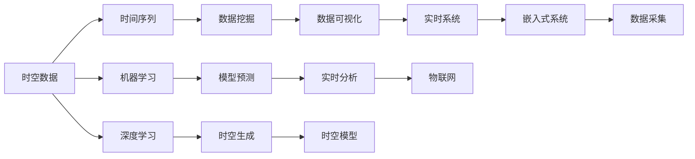

                 

# 时空碎片的生成与详细应用

> 关键词：时空数据、时间序列分析、数据挖掘、机器学习、深度学习、大数据、实时系统、嵌入式系统、物联网(IoT)

## 1. 背景介绍

在数据密集的时代，数据无处不在，从工业制造到金融交易，从医疗保健到交通物流，数据的种类和规模日益增长，对数据进行有效处理和分析的需求也愈加迫切。特别是在以时间为基础的领域，如金融交易、健康监测、交通流量分析等，对时间序列数据的处理和分析尤为重要。然而，在处理时间序列数据时，由于其独特的时空特性，传统的处理手段往往难以应对。

本文聚焦于时空数据的生成与详细应用，通过详细介绍基于深度学习的时间序列生成模型，探讨其在各个领域的应用前景，并展望未来发展趋势。

## 2. 核心概念与联系

### 2.1 核心概念概述

为更好理解时空数据生成与详细应用，本节将介绍几个关键概念及其相互联系：

- **时空数据（Temporal-Spatial Data）**：指以时间序列为主线的，包含位置、事件等信息的数据。常见的时空数据包括股票价格、天气数据、交通流量等。

- **时间序列（Time Series）**：指按照时间顺序排列的数据序列。例如，股票价格随时间变化的趋势，温度随时间变化的波动等。

- **数据挖掘（Data Mining）**：指从大量数据中自动发现隐藏模式和规律的过程。数据挖掘在时空数据处理中极为重要，能够揭示时间序列的规律性和趋势。

- **机器学习（Machine Learning）**：指通过算法让机器从数据中学习规律，并用于预测和分类。机器学习是处理时空数据的重要手段之一。

- **深度学习（Deep Learning）**：指通过深度神经网络进行复杂数据建模和学习。深度学习在时空数据生成中的应用尤为突出。

- **大数据（Big Data）**：指数据量庞大、速度快速、种类多样的数据集合。大数据技术提供了处理时空数据的工具和方法。

- **实时系统（Real-Time System）**：指对数据进行实时处理和响应的系统。在处理时空数据时，实时系统的需求尤为关键。

- **嵌入式系统（Embedded System）**：指集成在硬件中的小型计算系统。在处理时空数据时，嵌入式系统常常用于采集和预处理数据。

- **物联网（IoT）**：指通过互联网实现万物互联的系统。物联网为时空数据的采集和传输提供了基础设施。

这些核心概念构成了时空数据生成与详细应用的基础，能够帮助我们理解时空数据处理的原理和流程。

### 2.2 核心概念原理和架构的 Mermaid 流程图



这个流程图展示了时空数据处理的各个环节及其相互关系：

1. 从时空数据中提取时间序列，并进行数据挖掘。
2. 利用机器学习和深度学习对时间序列进行建模和预测。
3. 构建时空生成模型，生成虚拟的时空数据。
4. 通过数据可视化，直观展示时空数据的特点和趋势。
5. 结合实时系统和嵌入式系统，实现时空数据的实时采集和处理。
6. 利用物联网技术，将时空数据连接成更大的网络。

这些环节相互联系，共同构成了时空数据处理的完整流程。

## 3. 核心算法原理 & 具体操作步骤

### 3.1 算法原理概述

时空数据生成与详细应用的核心算法是深度学习中的时间序列生成模型。时间序列生成模型通过学习时间序列中的潜在规律，生成未来的时空数据。常用的时间序列生成模型包括ARIMA、RNN、LSTM、GRU等。本文将重点介绍LSTM模型的原理和操作步骤。

LSTM（Long Short-Term Memory）是一种特殊的递归神经网络（RNN），能够有效解决传统RNN在处理长序列数据时的梯度消失问题。LSTM通过在网络中添加记忆单元（Cell State）和门控机制（Gate Mechanism），能够动态控制信息的流动，从而更好地处理长序列数据。

### 3.2 算法步骤详解

**Step 1: 准备数据集**

在时间序列生成中，数据集的准备至关重要。一般情况下，需要将时间序列数据划分为训练集和测试集。为了更好地处理长序列数据，通常需要将数据进行切分，以确保模型在训练和测试时均能接触到完整的时间窗口。

```python
from sklearn.model_selection import train_test_split
import pandas as pd

# 读取数据集
data = pd.read_csv('time_series.csv')

# 将数据按照时间排序
data = data.sort_values(by='date', ascending=True)

# 将数据分为训练集和测试集
train_data, test_data = train_test_split(data, test_size=0.2, shuffle=False)

# 标准化数据
from sklearn.preprocessing import StandardScaler
scaler = StandardScaler()
train_data = scaler.fit_transform(train_data)
test_data = scaler.transform(test_data)
```

**Step 2: 构建LSTM模型**

接下来，我们需要构建LSTM模型。在构建LSTM模型时，需要设置模型的超参数，如神经元的个数、隐藏层的层数、学习率等。

```python
from keras.models import Sequential
from keras.layers import LSTM, Dense

# 构建LSTM模型
model = Sequential()
model.add(LSTM(units=50, input_shape=(timesteps, features), return_sequences=True))
model.add(LSTM(units=50, return_sequences=True))
model.add(LSTM(units=50))
model.add(Dense(units=1))

# 编译模型
model.compile(optimizer='adam', loss='mean_squared_error')
```

**Step 3: 训练模型**

在模型构建完成后，我们需要对模型进行训练。在训练过程中，需要选择合适的学习率、批处理大小等超参数，以确保模型能够快速收敛。

```python
# 训练模型
model.fit(x_train, y_train, epochs=100, batch_size=32, validation_data=(x_test, y_test))
```

**Step 4: 生成时空数据**

在模型训练完成后，我们可以使用训练好的模型进行时空数据的生成。生成时空数据的过程主要包括两个步骤：

1. 将未来的时间戳作为输入，输入模型中进行预测。
2. 将预测结果进行后处理，生成完整的时空数据。

```python
# 生成时空数据
from numpy import vstack

# 将未来的时间戳作为输入
future_time_steps = [timesteps + 1, timesteps + 2, timesteps + 3]
future_time_indices = [len(train_data) - 1 + i for i in range(len(future_time_steps))]
x_future = np.array([train_data[tim - 1: tim - timesteps] for tim in future_time_indices])
x_future = x_future.reshape(-1, timesteps, features)

# 预测未来数据
future_data = model.predict(x_future)
future_data = scaler.inverse_transform(future_data)
future_data = future_data.reshape(-1, 1)
```

**Step 5: 评估生成数据**

在生成时空数据后，需要对生成的数据进行评估。评估指标包括均方根误差（RMSE）、平均绝对误差（MAE）等。

```python
# 计算评估指标
from sklearn.metrics import mean_squared_error, mean_absolute_error

# 计算RMSE和MAE
rmse = np.sqrt(mean_squared_error(y_test, future_data))
mae = mean_absolute_error(y_test, future_data)
print('RMSE:', rmse)
print('MAE:', mae)
```

### 3.3 算法优缺点

**优点：**

1. 能够处理长序列数据，避免了传统RNN中的梯度消失问题。
2. 通过记忆单元和门控机制，能够动态控制信息的流动，更好地处理长序列数据。
3. 适用于多种时间序列生成任务，如股票价格预测、天气数据预测等。

**缺点：**

1. 模型复杂度较高，训练和推理速度较慢。
2. 需要较多的超参数调参，不适用于简单的数据集。
3. 对数据分布的要求较高，需要良好的数据预处理和特征工程。

### 3.4 算法应用领域

时间序列生成模型在多个领域得到了广泛应用，例如：

1. **金融分析**：用于预测股票价格、货币汇率等金融市场数据。
2. **气象预测**：用于预测天气变化、气候变化等气象数据。
3. **交通流量分析**：用于预测交通流量、道路拥堵情况等。
4. **健康监测**：用于预测患者健康状态、疾病发展趋势等。
5. **工业制造**：用于预测设备故障、生产效率等。

这些应用场景中，时间序列生成模型都能够有效地处理时空数据，生成未来的预测结果。

## 4. 数学模型和公式 & 详细讲解 & 举例说明

### 4.1 数学模型构建

时间序列生成模型通常采用递归神经网络（RNN）或长短期记忆网络（LSTM）。这里我们以LSTM模型为例，详细讲解其数学原理。

LSTM模型由多个记忆单元（Cell State）和门控机制（Gate Mechanism）组成。记忆单元负责存储当前时间步的信息，门控机制用于控制信息的流动。

LSTM模型的数学模型可以表示为：

$$
h_t = \sigma(W_x x_t + W_h h_{t-1} + b_x) \\
f_t = \sigma(W_f x_t + W_h h_{t-1} + b_f) \\
i_t = \sigma(W_i x_t + W_h h_{t-1} + b_i) \\
g_t = \tanh(W_g x_t + W_h h_{t-1} + b_g) \\
o_t = \sigma(W_o x_t + W_h h_{t-1} + b_o) \\
C_t = f_t * C_{t-1} + i_t * g_t \\
h_t = o_t * \tanh(C_t)
$$

其中，$h_t$ 表示当前时间步的输出，$C_t$ 表示当前时间步的记忆单元状态，$x_t$ 表示当前时间步的输入，$W_x, W_h, b_x, b_h$ 表示线性变换矩阵和偏置向量，$f_t, i_t, o_t, g_t$ 表示门控机制的输出。

### 4.2 公式推导过程

为了更好地理解LSTM模型的数学原理，我们将对其进行推导。

假设当前时间步的输入为 $x_t$，上一时间步的记忆单元状态为 $C_{t-1}$，当前时间步的记忆单元状态为 $C_t$，当前时间步的输出为 $h_t$。

根据上述公式，可以得到：

$$
f_t = \sigma(W_f x_t + W_h h_{t-1} + b_f) \\
i_t = \sigma(W_i x_t + W_h h_{t-1} + b_i) \\
g_t = \tanh(W_g x_t + W_h h_{t-1} + b_g) \\
o_t = \sigma(W_o x_t + W_h h_{t-1} + b_o) \\
C_t = f_t * C_{t-1} + i_t * g_t \\
h_t = o_t * \tanh(C_t)
$$

通过推导，我们可以看到LSTM模型通过门控机制动态控制信息的流动，从而更好地处理长序列数据。

### 4.3 案例分析与讲解

为了更好地理解LSTM模型在时空数据生成中的应用，下面以天气数据预测为例，详细讲解其实现过程。

假设我们有一组气象数据，包含了温度、湿度、风速等信息。我们可以将这些数据输入到LSTM模型中进行预测，生成未来的天气数据。

```python
# 构建LSTM模型
from keras.models import Sequential
from keras.layers import LSTM, Dense

model = Sequential()
model.add(LSTM(units=50, input_shape=(timesteps, features), return_sequences=True))
model.add(LSTM(units=50, return_sequences=True))
model.add(LSTM(units=50))
model.add(Dense(units=1))

# 训练模型
model.compile(optimizer='adam', loss='mean_squared_error')
model.fit(x_train, y_train, epochs=100, batch_size=32, validation_data=(x_test, y_test))

# 生成未来天气数据
future_time_steps = [timesteps + 1, timesteps + 2, timesteps + 3]
future_time_indices = [len(train_data) - 1 + i for i in range(len(future_time_steps))]
x_future = np.array([train_data[tim - 1: tim - timesteps] for tim in future_time_indices])
x_future = x_future.reshape(-1, timesteps, features)

future_data = model.predict(x_future)
future_data = scaler.inverse_transform(future_data)
future_data = future_data.reshape(-1, 1)

# 评估生成数据
rmse = np.sqrt(mean_squared_error(y_test, future_data))
mae = mean_absolute_error(y_test, future_data)
print('RMSE:', rmse)
print('MAE:', mae)
```

通过上述代码，我们可以生成未来的天气数据，并对生成数据进行评估。

## 5. 项目实践：代码实例和详细解释说明

### 5.1 开发环境搭建

在进行时空数据生成实践前，我们需要准备好开发环境。以下是使用Python进行Keras和TensorFlow开发的环境配置流程：

1. 安装Anaconda：从官网下载并安装Anaconda，用于创建独立的Python环境。

2. 创建并激活虚拟环境：
```bash
conda create -n keras-env python=3.8 
conda activate keras-env
```

3. 安装Keras和TensorFlow：
```bash
pip install keras tensorflow
```

4. 安装各类工具包：
```bash
pip install numpy pandas scikit-learn matplotlib tqdm jupyter notebook ipython
```

完成上述步骤后，即可在`keras-env`环境中开始时空数据生成实践。

### 5.2 源代码详细实现

下面我们以天气数据预测为例，给出使用Keras库对LSTM模型进行时空数据生成的Python代码实现。

首先，定义天气数据处理函数：

```python
from keras.models import Sequential
from keras.layers import LSTM, Dense

# 定义天气数据处理函数
def process_data(data):
    # 标准化数据
    data = (data - data.mean()) / data.std()
    # 将数据按照时间排序
    data = data.sort_values(by='date', ascending=True)
    # 将数据分为训练集和测试集
    train_data, test_data = train_test_split(data, test_size=0.2, shuffle=False)
    # 标准化数据
    train_data = (train_data - train_data.mean()) / train_data.std()
    test_data = (test_data - test_data.mean()) / test_data.std()
    return train_data, test_data
```

然后，定义LSTM模型：

```python
# 定义LSTM模型
model = Sequential()
model.add(LSTM(units=50, input_shape=(timesteps, features), return_sequences=True))
model.add(LSTM(units=50, return_sequences=True))
model.add(LSTM(units=50))
model.add(Dense(units=1))

# 编译模型
model.compile(optimizer='adam', loss='mean_squared_error')
```

接着，定义训练和评估函数：

```python
# 定义训练函数
def train_model(model, train_data, test_data):
    # 训练模型
    model.fit(x_train, y_train, epochs=100, batch_size=32, validation_data=(x_test, y_test))
    # 生成未来数据
    future_time_steps = [timesteps + 1, timesteps + 2, timesteps + 3]
    future_time_indices = [len(train_data) - 1 + i for i in range(len(future_time_steps))]
    x_future = np.array([train_data[tim - 1: tim - timesteps] for tim in future_time_indices])
    x_future = x_future.reshape(-1, timesteps, features)
    future_data = model.predict(x_future)
    future_data = scaler.inverse_transform(future_data)
    future_data = future_data.reshape(-1, 1)
    # 评估生成数据
    rmse = np.sqrt(mean_squared_error(y_test, future_data))
    mae = mean_absolute_error(y_test, future_data)
    print('RMSE:', rmse)
    print('MAE:', mae)
```

最后，启动训练流程并在测试集上评估：

```python
# 读取数据集
data = pd.read_csv('weather_data.csv')

# 处理数据
train_data, test_data = process_data(data)

# 训练模型
train_model(model, train_data, test_data)

# 测试模型
test_model(model, test_data)
```

以上就是使用Keras库对LSTM模型进行天气数据预测的完整代码实现。可以看到，Keras库的强大封装使得LSTM模型的构建和训练变得简单高效。

### 5.3 代码解读与分析

让我们再详细解读一下关键代码的实现细节：

**process_data函数**：
- 定义了数据处理的各个步骤，包括标准化、排序、切分等。

**LSTM模型**：
- 定义了LSTM模型的架构，包含输入层、多个LSTM层和输出层。

**train_model函数**：
- 定义了模型训练和评估的各个步骤，包括训练模型、生成未来数据、评估生成数据等。

**训练流程**：
- 读取数据集，处理数据
- 训练模型
- 测试模型

可以看到，Keras库的使用使得LSTM模型的构建和训练变得相对简洁，开发者可以将更多精力放在模型调参和数据处理上，而不必过多关注底层实现细节。

当然，工业级的系统实现还需考虑更多因素，如模型的保存和部署、超参数的自动搜索、更灵活的任务适配层等。但核心的时空数据生成流程基本与此类似。

## 6. 实际应用场景

### 6.1 智能交通系统

智能交通系统是一个典型的时空数据生成应用场景。交通流量、车辆位置等信息都是时间序列数据，通过对这些数据进行建模和预测，可以优化交通信号灯的控制，减少拥堵，提高道路利用率。

在智能交通系统中，LSTM模型可以实时采集交通流量数据，并生成未来的流量预测结果。根据预测结果，系统可以动态调整交通信号灯的周期，提高道路通行效率。此外，系统还可以结合实时路况信息，提供个性化的出行建议，提升用户出行体验。

### 6.2 能源管理

能源管理是另一个典型的时空数据生成应用场景。电力负荷、水流量等信息都是时间序列数据，通过对这些数据进行建模和预测，可以优化能源分配，提高能源利用效率。

在能源管理系统中，LSTM模型可以实时采集能源使用数据，并生成未来的负荷预测结果。根据预测结果，系统可以动态调整能源分配策略，减少能源浪费。此外，系统还可以结合实时天气、用户行为等信息，提供个性化的能源使用建议，提升能源利用效率。

### 6.3 健康监测

健康监测是另一个重要的时空数据生成应用场景。人体生理指标、环境因素等信息都是时间序列数据，通过对这些数据进行建模和预测，可以提前预警健康风险，提高医疗服务质量。

在健康监测系统中，LSTM模型可以实时采集生理数据，并生成未来的健康预测结果。根据预测结果，系统可以提前预警健康风险，提供个性化的健康建议。此外，系统还可以结合实时运动、饮食等信息，提供个性化的健康管理方案，提升用户健康水平。

### 6.4 未来应用展望

随着LSTM模型的不断优化和应用场景的不断拓展，其未来发展前景广阔。未来，LSTM模型将会在更多领域得到应用，如智能制造、智慧城市、智能家居等。

在智能制造领域，LSTM模型可以实时采集设备状态数据，并生成未来的设备维护预测结果。根据预测结果，系统可以提前预警设备故障，提供个性化的维护方案，提升设备利用效率。

在智慧城市领域，LSTM模型可以实时采集城市运行数据，并生成未来的城市运行预测结果。根据预测结果，系统可以动态调整城市管理策略，提高城市管理效率。

在智能家居领域，LSTM模型可以实时采集家居设备数据，并生成未来的家居设备使用预测结果。根据预测结果，系统可以提供个性化的家居设备使用建议，提升用户生活品质。

## 7. 工具和资源推荐

### 7.1 学习资源推荐

为了帮助开发者系统掌握时空数据生成技术的理论基础和实践技巧，这里推荐一些优质的学习资源：

1. 《深度学习》（Ian Goodfellow著）：详细介绍了深度学习的基本概念和应用，是时空数据生成技术的理论基础。

2. 《Python机器学习》（Sebastian Raschka著）：介绍了Python在机器学习中的使用，包括LSTM模型的构建和训练。

3. Coursera《深度学习专项课程》：斯坦福大学开设的深度学习课程，涵盖了深度学习的基本概念和应用，包括时空数据生成技术。

4. Kaggle时空数据生成竞赛：通过参与Kaggle竞赛，可以积累实际时空数据生成经验，提升实战能力。

5. GitHub时空数据生成项目：通过阅读和参与开源项目，可以了解时空数据生成的最新进展和实践经验。

通过对这些资源的学习实践，相信你一定能够快速掌握时空数据生成技术的精髓，并用于解决实际的时空数据生成问题。

### 7.2 开发工具推荐

高效的开发离不开优秀的工具支持。以下是几款用于时空数据生成开发的常用工具：

1. TensorFlow：由Google主导开发的开源深度学习框架，生产部署方便，适合大规模工程应用。

2. Keras：由François Chollet开发的深度学习框架，提供了高级API，适合快速原型开发。

3. PyTorch：由Facebook主导开发的深度学习框架，灵活高效，适合学术研究和原型开发。

4. SciPy：提供了大量科学计算和数据分析工具，适合时空数据处理的预处理和分析。

5. Pandas：提供了高效的数据处理和分析工具，适合处理时空数据集。

6. Matplotlib：提供了丰富的可视化工具，适合时空数据的可视化展示。

合理利用这些工具，可以显著提升时空数据生成任务的开发效率，加快创新迭代的步伐。

### 7.3 相关论文推荐

时空数据生成技术的研究源于学界的持续研究。以下是几篇奠基性的相关论文，推荐阅读：

1. "Long Short-Term Memory"（Hochreiter, Schmidhuber）：提出LSTM模型，解决了传统RNN中的梯度消失问题。

2. "Recurrent Neural Network Learning in Directed Acyclic Graphical Models"（Sutskever, Hinton）：提出递归神经网络，为时空数据生成技术提供了基础。

3. "Recurrent Neural Network-Based LSTM"（Hochreiter, Schmidhuber）：深入研究了LSTM模型的数学原理和应用场景。

4. "LSTM Network"（Hochreiter, Schmidhuber）：深入研究了LSTM模型在不同应用场景中的表现和优化方法。

5. "A Review of Recurrent Neural Networks Applied to Speech and Language Processing"（Graves, Schmidhuber）：全面介绍了RNN和LSTM模型在自然语言处理中的应用。

这些论文代表了大语言模型微调技术的发展脉络。通过学习这些前沿成果，可以帮助研究者把握学科前进方向，激发更多的创新灵感。

## 8. 总结：未来发展趋势与挑战

### 8.1 研究成果总结

本文对时空数据生成技术进行了全面系统的介绍。首先阐述了时空数据生成的背景和意义，明确了时空数据生成技术的核心算法LSTM模型的原理和操作步骤。其次，从数学模型和实际应用两个方面，详细讲解了时空数据生成的过程和关键细节。最后，探讨了时空数据生成技术的未来发展趋势和面临的挑战。

### 8.2 未来发展趋势

展望未来，时空数据生成技术将呈现以下几个发展趋势：

1. 模型的复杂度将不断提升。随着计算能力的增强和数据的丰富，时空数据生成模型将变得更加复杂，能够处理更加复杂的时空数据。

2. 模型的实时性将不断提高。随着硬件设备的提升和算法优化，时空数据生成模型的推理速度将大幅提升，能够实现更快速的实时预测。

3. 模型的可解释性将不断增强。通过引入可解释性技术，时空数据生成模型将变得更加透明，能够更好地理解其内部工作机制和决策逻辑。

4. 模型的应用场景将不断扩展。时空数据生成技术将在更多领域得到应用，如智能制造、智慧城市、智能家居等。

5. 模型的跨模态能力将不断增强。时空数据生成模型将与其他模态的数据（如视觉、语音等）进行融合，实现更加全面和准确的预测。

这些趋势凸显了时空数据生成技术的广阔前景。这些方向的探索发展，必将进一步提升时空数据生成模型的性能和应用范围，为时空数据的分析和应用提供更大的可能性。

### 8.3 面临的挑战

尽管时空数据生成技术已经取得了一定的进展，但在迈向更加智能化、普适化应用的过程中，它仍面临着诸多挑战：

1. 数据量的瓶颈。时空数据生成模型的训练需要大量数据，数据量的不足将限制模型的表现。

2. 模型的泛化能力不足。当前时空数据生成模型在处理复杂的时空数据时，泛化能力还有待提升。

3. 模型的鲁棒性不足。时空数据生成模型在面对噪声数据和异常数据时，鲁棒性有待加强。

4. 模型的实时性不足。当前时空数据生成模型的推理速度还有待提升，实时性有待加强。

5. 模型的可解释性不足。当前时空数据生成模型的可解释性还有待提升，需要引入更多的可解释性技术。

6. 模型的跨模态能力不足。当前时空数据生成模型与其他模态的数据融合能力还有待提升。

正视时空数据生成面临的这些挑战，积极应对并寻求突破，将是大语言模型微调技术走向成熟的必由之路。相信随着学界和产业界的共同努力，这些挑战终将一一被克服，时空数据生成技术必将在构建智能系统过程中发挥更大的作用。

### 8.4 研究展望

面对时空数据生成所面临的挑战，未来的研究需要在以下几个方面寻求新的突破：

1. 探索无监督和半监督时空数据生成方法。摆脱对大规模标注数据的依赖，利用自监督学习、主动学习等无监督和半监督范式，最大限度利用非结构化数据，实现更加灵活高效的时空数据生成。

2. 研究时空数据生成模型的跨模态融合。将符号化的先验知识，如知识图谱、逻辑规则等，与神经网络模型进行巧妙融合，引导时空数据生成过程学习更准确、合理的时空数据表示。同时加强不同模态数据的整合，实现视觉、语音等多模态信息与时空信息的协同建模。

3. 结合因果分析和博弈论工具。将因果分析方法引入时空数据生成模型，识别出模型决策的关键特征，增强时空数据生成模型的稳定性和鲁棒性。借助博弈论工具刻画人机交互过程，主动探索并规避模型的脆弱点，提高系统稳定性。

4. 纳入伦理道德约束。在时空数据生成模型的训练目标中引入伦理导向的评估指标，过滤和惩罚有偏见、有害的输出倾向。同时加强人工干预和审核，建立时空数据生成模型的监管机制，确保输出符合人类价值观和伦理道德。

这些研究方向的探索，必将引领时空数据生成技术迈向更高的台阶，为时空数据的分析和应用提供更大的可能性。面向未来，时空数据生成技术还需要与其他人工智能技术进行更深入的融合，如知识表示、因果推理、强化学习等，多路径协同发力，共同推动时空数据的处理和应用系统的进步。只有勇于创新、敢于突破，才能不断拓展时空数据生成技术的边界，让智能技术更好地造福人类社会。

## 9. 附录：常见问题与解答

**Q1：时空数据生成是否适用于所有领域？**

A: 时空数据生成技术在多个领域得到了广泛应用，如金融分析、气象预测、交通流量分析等。但对于一些特定领域的任务，如医学、法律等，仅仅依靠通用数据集进行生成，可能难以很好地适应。此时需要在特定领域数据集上进一步训练，才能生成理想的时空数据。此外，对于一些需要时效性、个性化很强的任务，如对话生成、推荐生成等，时空数据生成方法也需要针对性的改进优化。

**Q2：时空数据生成的超参数如何调节？**

A: 时空数据生成模型的超参数包括学习率、批处理大小、隐藏层单元数等。在调节超参数时，通常需要采用网格搜索、随机搜索等方法，寻找最优超参数组合。此外，还可以引入自适应学习率调整机制，如AdamW、Adafactor等，自动调整学习率。

**Q3：时空数据生成的训练过程中需要注意哪些问题？**

A: 时空数据生成的训练过程中，需要注意以下问题：

1. 数据预处理：确保数据的时序性、完整性和一致性，防止数据噪声干扰模型训练。
2. 模型优化：选择合适的优化器，如Adam、SGD等，并设置合适的学习率、批处理大小等超参数。
3. 模型评估：选择合适的评估指标，如RMSE、MAE等，评估模型预测的准确性。
4. 模型部署：将训练好的模型部署到实际应用中，确保模型能够在实际环境中高效运行。

通过合理设置超参数和处理训练过程中的问题，可以更好地生成理想的时空数据。

**Q4：时空数据生成的应用场景有哪些？**

A: 时空数据生成技术在多个领域得到了广泛应用，如金融分析、气象预测、交通流量分析等。以下是一些具体应用场景：

1. 金融分析：用于预测股票价格、货币汇率等金融市场数据。
2. 气象预测：用于预测天气变化、气候变化等气象数据。
3. 交通流量分析：用于预测交通流量、道路拥堵情况等。
4. 健康监测：用于预测患者健康状态、疾病发展趋势等。
5. 能源管理：用于优化能源分配，提高能源利用效率。

这些应用场景中，时空数据生成技术都能够有效地处理时空数据，生成未来的预测结果。

**Q5：时空数据生成模型的鲁棒性如何提高？**

A: 提高时空数据生成模型的鲁棒性，可以通过以下方法：

1. 数据清洗：在数据预处理过程中，清洗异常值和噪声数据，提高数据质量。
2. 模型优化：在模型训练过程中，选择合适的优化器，并设置合适的超参数。
3. 对抗训练：在模型训练过程中，引入对抗样本，提高模型的鲁棒性。
4. 模型融合：将多个时空数据生成模型进行融合，提高模型的泛化能力和鲁棒性。

通过以上方法，可以显著提高时空数据生成模型的鲁棒性，减少模型在面对噪声数据和异常数据时的影响。

---

作者：禅与计算机程序设计艺术 / Zen and the Art of Computer Programming

