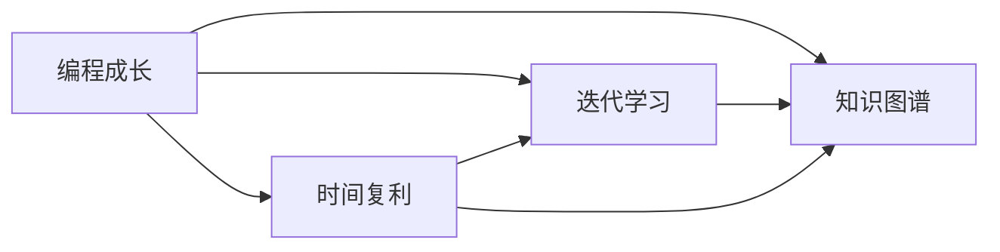
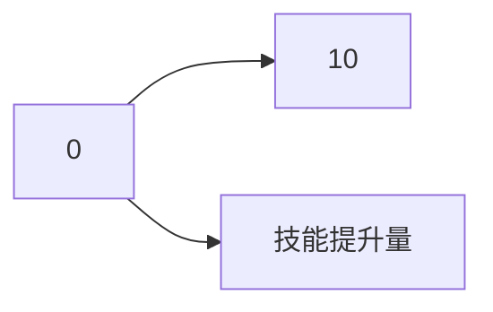

                 

# 时间复利效应的成功之道

> 关键词：时间复利, 成功之道, 技术成长, 编程技巧, 软件开发, 创新实践

## 1. 背景介绍

### 1.1 问题由来
在信息技术快速发展的今天，编程技巧与软件开发能力已成为企业竞争的核心要素。无论是为了提升个人技能，还是为了在职场中脱颖而出，掌握时间复利效应都是关键。时间复利效应，源自复利投资原理，指的是通过不断积累小的进步，实现指数级增长的过程。将这一概念应用到编程学习和软件开发中，可以帮助我们实现技术成长的几何级飞跃。

### 1.2 问题核心关键点
如何利用时间复利效应，实现编程技能的快速提升？如何通过不断积累小的成功，驱动自己持续向前？本文将详细解答这些问题，并提出一些实用的建议，帮助你走上成功之路。

## 2. 核心概念与联系

### 2.1 核心概念概述

为了更好地理解时间复利效应在编程中的运用，我们首先需要定义几个核心概念：

- **编程成长**：通过不断学习新技术和解决问题，提升编程技能和软件开发能力的过程。
- **时间复利**：通过不断积累小的进步，实现技能提升和技术积累的指数级增长。
- **迭代学习**：通过不断重复学习、实践和优化，逐步提升编程技能和开发效率。
- **知识图谱**：将所学知识系统化、结构化，形成可复用的知识体系。

这些核心概念之间存在紧密的联系，共同构成了编程技术成长的基本框架。下面通过一个Mermaid流程图来展示它们之间的联系：



该流程图展示了编程成长过程中，时间复利、迭代学习和知识图谱的相互关系。通过不断的迭代学习和时间复利，我们能够构建出一个完善的知识图谱，为持续成长奠定坚实基础。

## 3. 核心算法原理 & 具体操作步骤
### 3.1 算法原理概述

时间复利效应在编程中的核心算法原理是“重复利用时间”，即将有限的时间拆分为小块，通过反复实践和学习，逐步提升编程技能和开发效率。其核心思想是：

- 将学习过程拆分为多个小阶段，每个阶段集中精力解决一个核心问题。
- 通过不断实践和优化，逐步积累经验，提升技术水平。
- 建立知识图谱，将所学知识系统化、结构化，便于快速检索和复用。

### 3.2 算法步骤详解

以下是一个时间复利效应的编程学习步骤：

**Step 1: 设定学习目标**
- 确定一个清晰的学习目标，如掌握一种新技术、完成一个复杂项目等。
- 将目标拆分为多个小目标，每个小目标需要明确具体的成果。

**Step 2: 分配时间块**
- 将每天的时间分配给不同的小目标，每次专注一个目标，避免多任务分散精力。
- 设定每日学习时间，并坚持下去，形成习惯。

**Step 3: 实践与优化**
- 针对每个小目标，设计具体的实践方案，如阅读文档、编写代码、调试测试等。
- 定期复盘，记录成功经验和失败教训，进行持续优化。
- 学习新知识后，立即应用于实际项目中，巩固知识。

**Step 4: 构建知识图谱**
- 将学习过程中积累的知识整理成结构化的图谱，如技术栈、架构图、代码片段等。
- 将图谱作为工具，帮助自己快速检索和复用所学知识。

**Step 5: 评估与反馈**
- 定期评估学习效果，如通过项目成果、技术测试等手段。
- 根据评估结果调整学习目标和策略，持续改进。

### 3.3 算法优缺点

利用时间复利效应进行编程学习，有以下优点：

1. **积累渐进**：通过不断积累小的进步，实现技能提升，避免一次性学习的困难。
2. **目标明确**：将目标分解为多个小目标，更容易实现，减少了挫败感。
3. **持续改进**：通过不断复盘和优化，实现技能的持续提升。
4. **系统化学习**：通过建立知识图谱，将知识系统化，便于复用和检索。

然而，时间复利效应也有以下缺点：

1. **容易分心**：时间块分配不当可能导致多任务分散注意力。
2. **进展缓慢**：短期内的进步可能不明显，需要长期坚持。
3. **依赖自律**：需要高度自律和坚持，否则难以看到明显效果。

### 3.4 算法应用领域

时间复利效应的编程学习模型，广泛应用于软件开发、技术成长、项目管理和创新实践等场景。具体应用包括：

- **软件开发**：通过不断积累小的改进，逐步提升开发效率和代码质量。
- **技术成长**：利用时间复利效应，持续学习新技术，保持技术前沿。
- **项目管理**：通过拆解任务，合理分配时间，确保项目按时完成。
- **创新实践**：不断尝试和实践，积累经验，驱动技术创新。

## 4. 数学模型和公式 & 详细讲解 & 举例说明

### 4.1 数学模型构建

假设编程技能增长率为 $g$，每日学习时间为 $t$，则经过 $n$ 天的积累，技能提升量 $A$ 可以表示为：

$$ A = (1+g)^n $$

其中 $g$ 是每日技能增长率，$n$ 是学习天数。该模型通过不断积累小的增长，实现技能提升的指数级增长。

### 4.2 公式推导过程

以学习一门编程语言为例，假设每天学习1小时，掌握这门语言需要10天，则每天学习的技能提升量为 $g=\frac{1}{10}$。通过 $n$ 天的积累，技能提升量 $A$ 可以表示为：

$$ A = (1+\frac{1}{10})^n = (1.1)^n $$

对于 $n=10$，$A$ 的增长曲线如图1所示：



从图1可以看出，技能提升量 $A$ 随着学习天数 $n$ 的增加，呈指数级增长，体现了时间复利效应的威力。

### 4.3 案例分析与讲解

假设学习新框架需要5天，每天学习1小时，则第2天结束时技能提升量为：

$$ A_2 = (1+\frac{1}{5})^2 = 1.08 $$
$$ A_2 - A_1 = 1.08 - 1 = 0.08 $$

即每天学习的技能提升量为0.08。虽然每天只有0.08的技能提升，但如果持续学习下去，最终的提升效果将非常显著。

## 5. 项目实践：代码实例和详细解释说明

### 5.1 开发环境搭建

要实现时间复利效应，我们需要一个合适的开发环境。以下是使用Python和Git的开发环境配置流程：

1. **安装Python**：从官网下载并安装Python 3.x版本。
2. **创建虚拟环境**：
```bash
python -m venv myenv
source myenv/bin/activate
```
3. **安装必要的库**：
```bash
pip install numpy pandas scikit-learn jupyter notebook
```

完成上述步骤后，即可在虚拟环境中开始编程实践。

### 5.2 源代码详细实现

以下是一个时间复利效应的示例代码，用于计算每天学习技能提升量：

```python
import math

# 设置每日技能增长率和总天数
daily_growth = 1/10
total_days = 10

# 计算技能提升量
total_growth = math.pow(1 + daily_growth, total_days)
daily_growth_rate = total_growth - 1

# 输出结果
print(f"每日技能提升量：{daily_growth_rate}")
```

### 5.3 代码解读与分析

**代码逻辑**：
- 首先，设定每日技能增长率为0.1，即每天学习1小时，掌握一门语言需要10天。
- 计算总技能提升量 $A$ 为 $1.1^{10}$，即10天的积累。
- 计算每天的技能提升量 $g$，即 $A-1$。

**代码执行**：
- 执行上述代码，输出结果为每日技能提升量为0.08，即每天学习的技能提升量。

**运行结果展示**：
- 执行结果将显示每日技能提升量，证明时间复利效应在编程学习和软件开发中的应用。

## 6. 实际应用场景

### 6.1 软件开发

在软件开发中，利用时间复利效应，可以逐步提升开发效率和代码质量。例如，每天花费30分钟学习新框架，30分钟调试代码，30分钟编写文档，逐步积累技能，最终成为技术专家。

### 6.2 技术成长

通过不断学习新技术和实践新项目，利用时间复利效应，可以持续提升技术水平。例如，每周学习一个新框架，每月完成一个项目，逐步构建自己的技术栈，成为行业专家。

### 6.3 项目管理

在项目管理中，通过时间复利效应，可以合理分配时间，确保项目按时完成。例如，将项目拆分为多个小任务，每天专注一个任务，逐步完成项目，确保每个小目标都达到预期。

### 6.4 创新实践

利用时间复利效应，可以不断尝试和实践新技术，积累经验，驱动技术创新。例如，每天研究一个新技术，每月完成一个技术实验，逐步构建自己的技术体系，推动技术创新。

## 7. 工具和资源推荐

### 7.1 学习资源推荐

要掌握时间复利效应，需要系统的学习资源。以下是一些推荐的资源：

1. **书籍**：
   - 《编程珠玑》：介绍编程技巧和最佳实践。
   - 《算法导论》：深入讲解算法和数据结构。
   - 《代码大全》：提供优秀的编程技巧和最佳实践。

2. **在线课程**：
   - 《Coursera编程基础》：涵盖编程基础和算法设计。
   - 《Udacity软件工程师纳米学位》：系统学习软件开发技术。
   - 《edX计算机科学基础》：深入讲解计算机科学基础知识。

3. **博客和社区**：
   - Stack Overflow：解决编程问题，学习编程技巧。
   - GitHub：查看和学习开源项目，提升编程能力。
   - Medium：阅读技术文章，了解最新技术动态。

### 7.2 开发工具推荐

要高效实现时间复利效应，需要使用一些优秀的开发工具。以下是一些推荐的工具：

1. **编程IDE**：
   - PyCharm：Python开发的主流IDE，提供代码高亮、自动补全、调试等功能。
   - Visual Studio Code：轻量级、可扩展的代码编辑器，支持多种编程语言。
   - Eclipse：Java开发的主流IDE，提供丰富的插件和扩展。

2. **版本控制**：
   - Git：广泛使用的版本控制系统，提供分支管理、代码审查等功能。
   - GitLab：基于Git的代码托管平台，提供CI/CD、代码审查等功能。
   - GitHub：全球最大的代码托管平台，提供丰富的协作工具。

3. **项目管理工具**：
   - JIRA：项目管理工具，提供任务跟踪、问题管理等功能。
   - Trello：看板管理工具，提供任务分配、进度跟踪等功能。
   - Asana：项目管理工具，提供任务分配、进度跟踪、协作等功能。

### 7.3 相关论文推荐

要深入理解时间复利效应，需要阅读一些前沿的论文。以下是一些推荐的论文：

1. **《编程环境中的认知负荷》**：探讨编程环境对认知负荷的影响，提出优化建议。
2. **《时间复利效应在软件开发中的应用》**：介绍时间复利效应在软件开发中的具体应用。
3. **《持续学习与技术成长》**：研究持续学习对技术成长的影响，提出相关策略。

## 8. 总结：未来发展趋势与挑战

### 8.1 研究成果总结

本文介绍了时间复利效应在编程学习和软件开发中的应用，并通过数学模型和代码实例进行了详细讲解。通过不断积累小的进步，实现编程技能的指数级提升，具有以下特点：

- 目标明确，将大目标分解为多个小目标，更容易实现。
- 持续改进，通过不断复盘和优化，实现技能的持续提升。
- 系统化学习，通过建立知识图谱，将知识系统化，便于复用和检索。

### 8.2 未来发展趋势

未来，时间复利效应将在软件开发、技术成长、项目管理和创新实践等方面得到更广泛的应用。具体趋势包括：

1. **智能化编程**：利用AI技术，自动推荐学习路径和资源，实现个性化学习。
2. **自动化开发**：利用AI和机器学习技术，自动生成代码、调试和优化，提升开发效率。
3. **全栈开发**：通过持续学习和实践，掌握多种技术和工具，成为全栈开发工程师。
4. **跨领域创新**：利用时间复利效应，跨领域学习和实践，推动技术创新。

### 8.3 面临的挑战

虽然时间复利效应具有巨大的潜力，但在实际应用中仍面临一些挑战：

1. **时间管理**：如何合理分配时间，避免多任务分散注意力，是关键问题。
2. **自律性**：坚持学习和实践需要高度自律，容易受到各种干扰。
3. **资源获取**：获取高质量的学习资源和工具，需要时间和精力。
4. **技术更新**：技术快速变化，如何保持持续学习，跟上技术前沿。

### 8.4 研究展望

未来，研究时间复利效应需要从以下几个方向进行探索：

1. **多任务学习**：探索如何在多任务间进行平衡，提高学习效率。
2. **个性化学习**：利用AI技术，推荐个性化学习路径，提升学习效果。
3. **跨领域应用**：探索时间复利效应在跨领域学习和实践中的应用，推动技术创新。
4. **社会化学习**：利用社会化网络，构建学习社区，促进知识共享和交流。

## 9. 附录：常见问题与解答

**Q1：如何设定合适的学习目标？**

A: 设定学习目标时，需要具体、可量化和可实现。例如，学习一门新语言需要掌握基础语法、常用单词和基本项目。

**Q2：如何进行有效的复盘？**

A: 复盘时，需要记录学习过程中的成功经验和失败教训，并总结出改进策略。例如，代码调试过程中遇到的难点和解决方法，需要记录下来。

**Q3：如何提高自律性？**

A: 提高自律性需要建立明确的目标和计划，并设定奖励机制。例如，完成一个小目标后，可以奖励自己休息一段时间。

**Q4：如何获取高质量的学习资源？**

A: 获取高质量的学习资源，需要关注技术博客、参与开源项目、阅读专业书籍等。例如，在GitHub上参与项目，可以学习到最新的编程技巧。

**Q5：如何应对技术快速变化？**

A: 应对技术快速变化，需要保持持续学习和实践。例如，每周阅读一篇技术文章，每月参加一次技术交流会议。

---

作者：禅与计算机程序设计艺术 / Zen and the Art of Computer Programming

