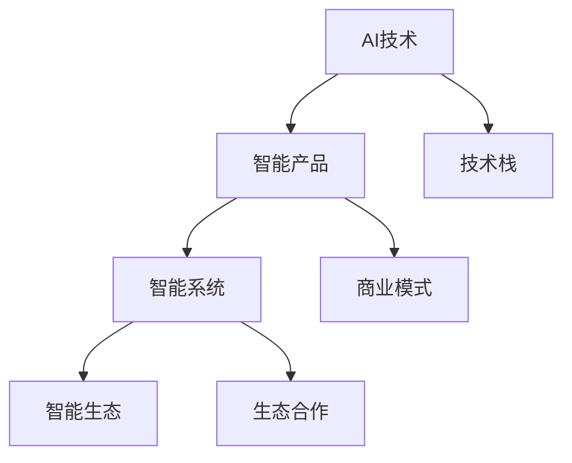

                 

# 智能产业化的未来发展方向

## 1. 背景介绍

### 1.1 问题由来

随着人工智能(AI)技术的快速发展，越来越多的企业开始探索如何将AI技术应用于实际业务中，以提升生产效率、降低成本、创造新的业务模式。然而，尽管AI技术在学术界和部分企业中取得了显著进展，但智能技术的产业化仍面临诸多挑战，包括模型性能、可解释性、数据隐私、伦理风险等。如何推动AI技术从实验室走向商业化，实现智能产业化的可持续发展，成为当下亟需解决的重要课题。

### 1.2 问题核心关键点

智能产业化的核心在于如何将AI技术在特定场景中有效落地，形成具有稳定经济回报的商业模式。核心关键点包括：

1. **模型性能**：智能产品需要具备高性能，能够稳定地处理真实业务数据，并提供可信赖的解决方案。
2. **可解释性**：AI模型的决策过程应具有可解释性，用户和客户能够理解其工作原理和输出结果。
3. **数据隐私**：智能产品需要严格遵守数据隐私保护法规，确保用户数据的安全性和隐私性。
4. **伦理风险**：AI产品设计需遵循伦理原则，避免偏见、歧视等负面影响，确保社会的公平和正义。
5. **用户体验**：智能产品的用户界面和交互设计需友好、便捷，便于用户使用。
6. **资源效率**：智能系统需要具备高效资源利用能力，能够以较低的成本实现高性能。

这些关键点相互关联，共同决定了AI技术的产业化可行性和应用效果。

## 2. 核心概念与联系

### 2.1 核心概念概述

智能产业化涉及多个核心概念，包括：

- **AI技术**：包括机器学习、深度学习、自然语言处理等，是智能化的基础。
- **智能产品**：将AI技术应用于实际业务场景中，提供自动化、智能化解决方案。
- **智能系统**：由智能产品组成，具备一定规模和功能的智能化系统。
- **智能生态**：包括技术提供商、应用场景、用户等多方参与的生态系统。

这些概念通过技术栈、商业模式、生态合作等方式相互联系，共同构建了智能产业化的整体框架。

### 2.2 核心概念原理和架构的 Mermaid 流程图(Mermaid 流程节点中不要有括号、逗号等特殊字符)



## 3. 核心算法原理 & 具体操作步骤

### 3.1 算法原理概述

智能产业化的核心在于将AI技术应用于实际场景中，形成稳定、高效的商业解决方案。这一过程通常包括以下步骤：

1. **需求分析**：理解业务需求和目标，确定智能解决方案的方向和范围。
2. **技术选型**：选择合适的AI技术和算法，设计系统架构和技术栈。
3. **数据准备**：收集、清洗和标注数据，确保数据质量和可用性。
4. **模型开发**：开发和训练AI模型，评估模型性能。
5. **系统集成**：将模型集成到实际系统中，进行系统测试和优化。
6. **产品部署**：将智能产品部署到实际环境中，进行实时监控和调整。
7. **生态合作**：与技术提供商、行业伙伴进行合作，优化产品功能和性能。

### 3.2 算法步骤详解

以下是智能产业化的具体操作步骤详解：

#### 3.2.1 需求分析

需求分析是智能产业化的第一步，需要充分理解业务需求和目标。这包括：

- **业务目标**：明确业务目标和预期结果。
- **用户需求**：了解用户需求和使用场景，确定系统功能和性能指标。
- **数据要求**：分析数据来源和数据质量，确定数据收集和处理流程。

#### 3.2.2 技术选型

技术选型应考虑以下几个方面：

- **适用性**：选择最适合业务需求的AI技术和算法。
- **成熟度**：选择技术成熟、性能稳定、易于维护的解决方案。
- **成本效益**：评估技术选型的经济成本和潜在收益，选择最优方案。

#### 3.2.3 数据准备

数据准备是模型开发的前提，需要确保数据的质量和可用性：

- **数据收集**：通过爬虫、API接口等方式收集数据。
- **数据清洗**：处理数据缺失、异常、重复等问题。
- **数据标注**：对数据进行标注，生成训练集和测试集。

#### 3.2.4 模型开发

模型开发主要包括模型选择、训练和评估：

- **模型选择**：根据需求选择合适的算法模型，如回归、分类、聚类等。
- **模型训练**：使用训练集对模型进行训练，调整超参数优化模型性能。
- **模型评估**：使用测试集对模型进行评估，确定模型性能指标。

#### 3.2.5 系统集成

系统集成是将模型部署到实际环境中的关键步骤，包括：

- **系统架构设计**：设计系统架构和技术栈，选择合适的软硬件资源。
- **API接口开发**：开发API接口，实现模型与业务系统的交互。
- **系统测试**：对系统进行全面测试，发现和修复潜在问题。

#### 3.2.6 产品部署

产品部署是将智能系统投入实际应用的关键阶段，包括：

- **环境搭建**：配置服务器和网络环境，确保系统稳定运行。
- **用户培训**：对用户进行培训，使其熟悉系统功能和使用方法。
- **运维管理**：建立运维管理体系，确保系统长期稳定运行。

#### 3.2.7 生态合作

生态合作是智能产品持续改进和优化的重要手段，包括：

- **技术合作**：与技术提供商合作，共同开发和优化产品功能。
- **行业联盟**：加入行业联盟，共享资源和知识，提升产品竞争力。
- **用户反馈**：收集用户反馈，不断改进和优化产品。

### 3.3 算法优缺点

智能产业化具有以下优点：

1. **提高效率**：通过自动化和智能化技术，显著提高生产效率和运营效率。
2. **降低成本**：通过减少人力成本和减少资源浪费，降低企业运营成本。
3. **创造新模式**：推动业务创新，创造新的商业模式和增长点。
4. **增强竞争力**：通过智能化提升企业竞争力，应对市场变化。

同时，智能产业化也面临以下挑战：

1. **技术复杂性**：AI技术复杂，开发和维护难度大。
2. **数据隐私**：数据隐私保护法规严格，需严格遵守。
3. **伦理风险**：AI模型可能存在偏见和歧视，需严格控制。
4. **用户体验**：产品设计需注重用户体验，避免用户不满。
5. **资源效率**：系统需具备高效资源利用能力，避免资源浪费。

## 4. 数学模型和公式 & 详细讲解 & 举例说明

### 4.1 数学模型构建

智能产业化的数学模型构建主要涉及以下几个方面：

- **回归模型**：用于预测连续数值型数据，如销售预测、用户行为分析等。
- **分类模型**：用于分类离散型数据，如用户分类、情感分析等。
- **聚类模型**：用于将数据分成若干组，如市场细分、用户聚类等。
- **优化模型**：用于优化目标函数，如资源分配、调度优化等。

### 4.2 公式推导过程

以回归模型为例，常见的回归模型有线性回归、多项式回归、岭回归等。这里以线性回归模型为例，推导公式：

设样本数据集为 $(x_i, y_i)$，其中 $x_i$ 为自变量，$y_i$ 为因变量，模型为 $y = \theta_0 + \theta_1 x_1 + \theta_2 x_2 + ... + \theta_n x_n$，其中 $\theta$ 为模型参数。

目标是最小化损失函数 $L(\theta) = \frac{1}{2m} \sum_{i=1}^m (y_i - \theta_0 - \theta_1 x_{1,i} - ... - \theta_n x_{n,i})^2$。

通过梯度下降算法，求导得到：

$$
\frac{\partial L(\theta)}{\partial \theta_j} = \frac{1}{m} \sum_{i=1}^m (y_i - \theta_0 - \theta_1 x_{1,i} - ... - \theta_n x_{n,i})x_{j,i}
$$

更新模型参数：

$$
\theta_j = \theta_j - \eta \frac{\partial L(\theta)}{\partial \theta_j}
$$

其中 $\eta$ 为学习率，控制参数更新的步长。

### 4.3 案例分析与讲解

以智能客户服务系统为例，通过数据分析和机器学习技术，构建客户情感分析模型：

- **需求分析**：了解客户情感变化，提升客户满意度。
- **技术选型**：选择分类模型进行情感分析，如SVM、逻辑回归等。
- **数据准备**：收集客户反馈数据，进行数据清洗和标注。
- **模型开发**：开发情感分析模型，进行模型训练和评估。
- **系统集成**：将模型集成到客户服务系统中，实现实时情感分析。
- **产品部署**：配置服务器和网络环境，部署情感分析模型。
- **生态合作**：与数据分析公司合作，共享客户数据和分析结果。

## 5. 项目实践：代码实例和详细解释说明

### 5.1 开发环境搭建

智能产业化项目开发通常涉及Python、TensorFlow、Keras等工具，需要安装并配置好开发环境。以下是在Python环境中搭建智能客户服务系统的开发环境的步骤：

1. 安装Python和相关依赖：
   ```bash
   sudo apt-get install python3-pip
   sudo pip3 install tensorflow keras sklearn
   ```

2. 安装TensorFlow和Keras：
   ```bash
   sudo pip3 install tensorflow
   ```

3. 安装scikit-learn和其他常用库：
   ```bash
   sudo pip3 install scikit-learn
   ```

4. 安装数据处理和可视化工具：
   ```bash
   sudo pip3 install pandas matplotlib seaborn
   ```

完成上述步骤后，即可在Python环境中进行智能客户服务系统的开发和测试。

### 5.2 源代码详细实现

以下是使用Python和TensorFlow进行智能客户服务系统开发的代码实现：

```python
import tensorflow as tf
from tensorflow.keras.models import Sequential
from tensorflow.keras.layers import Dense
from tensorflow.keras.optimizers import SGD
from sklearn.model_selection import train_test_split
from sklearn.preprocessing import LabelEncoder
from sklearn.metrics import accuracy_score

# 读取数据集
data = pd.read_csv('customer_feedback.csv')

# 数据预处理
features = data.drop('label', axis=1)
labels = data['label']
label_encoder = LabelEncoder()
labels = label_encoder.fit_transform(labels)

# 数据分割
train_features, test_features, train_labels, test_labels = train_test_split(features, labels, test_size=0.2)

# 定义模型
model = Sequential()
model.add(Dense(64, input_dim=features.shape[1], activation='relu'))
model.add(Dense(32, activation='relu'))
model.add(Dense(2, activation='softmax'))

# 编译模型
model.compile(loss='categorical_crossentropy', optimizer=SGD(lr=0.01), metrics=['accuracy'])

# 训练模型
model.fit(train_features, train_labels, epochs=10, batch_size=32, validation_data=(test_features, test_labels))

# 评估模型
y_pred = model.predict(test_features)
y_pred = [label_encoder.inverse_transform([l]) for l in y_pred]
accuracy = accuracy_score(test_labels, y_pred)
print('Accuracy:', accuracy)
```

### 5.3 代码解读与分析

上述代码实现了使用TensorFlow和Keras进行情感分析模型的开发。具体步骤如下：

1. **数据读取**：使用Pandas读取客户反馈数据集。
2. **数据预处理**：将数据集分成特征和标签，进行数据分割和标签编码。
3. **模型定义**：定义一个包含两个隐藏层的全连接神经网络模型。
4. **模型编译**：编译模型，定义损失函数、优化器和评价指标。
5. **模型训练**：使用训练集进行模型训练，设置训练轮数和批大小。
6. **模型评估**：使用测试集评估模型性能，计算准确率。

## 6. 实际应用场景

### 6.1 智能客服系统

智能客服系统通过分析客户反馈数据，构建情感分析模型，实现客户情感识别和响应。具体应用场景包括：

- **客户情感识别**：分析客户投诉、反馈和评论，识别情感倾向（积极、中性、消极）。
- **情感分类**：将客户反馈分类为不同类别（产品问题、服务问题、客户需求等）。
- **自动化响应**：根据情感分类结果，自动生成回复，提高响应速度和质量。
- **持续优化**：定期更新模型，提升情感分析的准确率和覆盖范围。

### 6.2 金融风险管理

金融风险管理通过分析金融数据，构建风险预测模型，实现风险预警和控制。具体应用场景包括：

- **信用风险评估**：分析借款人的历史交易记录和信用评分，预测违约风险。
- **市场风险预测**：分析市场数据和宏观经济指标，预测市场波动和风险。
- **反欺诈检测**：分析交易数据和行为模式，检测和预防欺诈行为。
- **智能投顾**：基于投资组合分析和大数据分析，提供投资建议和风险管理策略。

### 6.3 智能医疗诊断

智能医疗诊断通过分析患者数据，构建疾病预测模型，实现疾病早期诊断和个性化治疗。具体应用场景包括：

- **疾病预测**：分析患者的症状和病史数据，预测疾病发生的可能性。
- **个性化治疗**：根据疾病预测结果，推荐个性化的治疗方案。
- **医疗影像分析**：分析医疗影像数据，辅助医生进行诊断和手术。
- **药物研发**：分析化合物和基因数据，预测药物效果和副作用。

### 6.4 未来应用展望

未来，智能产业化将呈现以下几个发展趋势：

1. **智能化和自动化**：随着AI技术的发展，智能产品将具备更强大的智能化和自动化能力，提高生产效率和运营效率。
2. **数据驱动决策**：智能产品将更多地依赖数据驱动决策，提高决策的科学性和准确性。
3. **跨行业应用**：AI技术将在更多行业得到应用，推动产业升级和经济转型。
4. **普惠智能化**：AI技术将更多地服务于中小企业和普通用户，提升社会整体智能化水平。
5. **伦理和法规合规**：AI产品设计需遵循伦理原则和法规要求，确保公平和公正。

## 7. 工具和资源推荐

### 7.1 学习资源推荐

为了帮助开发者掌握智能产业化的相关知识和技能，以下是一些推荐的资源：

1. **《机器学习实战》**：这本书系统介绍了机器学习和深度学习的基本概念和算法，适合初学者入门。
2. **Coursera的机器学习课程**：斯坦福大学的机器学习课程，涵盖机器学习的基本理论和实践。
3. **Kaggle竞赛**：通过参与Kaggle竞赛，实战练习机器学习和数据科学技能。
4. **Github开源项目**：通过参与开源项目，学习和分享智能产品的开发经验。
5. **HuggingFace官方文档**：Transformers库的官方文档，提供了详细的模型和应用指南。

### 7.2 开发工具推荐

智能产业化项目开发通常涉及多种工具和框架，以下是一些推荐的开发工具：

1. **Python**：Python是AI领域的主流编程语言，具有丰富的库和框架支持。
2. **TensorFlow**：由Google主导开发的深度学习框架，支持分布式计算和模型部署。
3. **Keras**：Keras是一个高层次的深度学习框架，易于使用和上手。
4. **PyTorch**：PyTorch是Facebook开发的深度学习框架，支持动态计算图和分布式训练。
5. **Jupyter Notebook**：Jupyter Notebook是一个交互式开发环境，适合快速迭代和实验。

### 7.3 相关论文推荐

智能产业化涉及多个研究方向，以下是一些推荐的论文：

1. **《机器学习》（西瓜书）**：西瓜书是一本经典的机器学习教材，涵盖了机器学习的各个方面。
2. **《深度学习》（Ian Goodfellow）**：Ian Goodfellow的深度学习教材，系统介绍了深度学习的基本概念和算法。
3. **《人工智能：一种现代方法》**：这是人工智能领域的经典教材，涵盖AI技术的基本理论和应用。
4. **《自然语言处理综论》**：这本书介绍了自然语言处理的基本概念和算法，是NLP领域的重要参考书。

## 8. 总结：未来发展趋势与挑战

### 8.1 研究成果总结

智能产业化作为AI技术应用的重要方向，近年来取得了显著进展。通过智能产品和系统的应用，提高了生产效率和运营效率，推动了产业升级和经济转型。同时，AI技术在医疗、金融等领域的应用，也带来了诸多创新和突破。

### 8.2 未来发展趋势

未来，智能产业化将呈现以下几个发展趋势：

1. **技术创新**：随着AI技术的不断进步，智能产品将具备更强大的智能化和自动化能力，提高生产效率和运营效率。
2. **数据驱动决策**：智能产品将更多地依赖数据驱动决策，提高决策的科学性和准确性。
3. **跨行业应用**：AI技术将在更多行业得到应用，推动产业升级和经济转型。
4. **普惠智能化**：AI技术将更多地服务于中小企业和普通用户，提升社会整体智能化水平。
5. **伦理和法规合规**：AI产品设计需遵循伦理原则和法规要求，确保公平和公正。

### 8.3 面临的挑战

智能产业化仍面临诸多挑战，主要包括以下几个方面：

1. **技术复杂性**：AI技术复杂，开发和维护难度大。
2. **数据隐私**：数据隐私保护法规严格，需严格遵守。
3. **伦理风险**：AI模型可能存在偏见和歧视，需严格控制。
4. **用户体验**：产品设计需注重用户体验，避免用户不满。
5. **资源效率**：系统需具备高效资源利用能力，避免资源浪费。

### 8.4 研究展望

面对智能产业化面临的挑战，未来的研究需要在以下几个方面寻求新的突破：

1. **技术简化**：开发更加易用、易维护的AI技术和工具，降低开发和维护难度。
2. **数据保护**：加强数据隐私保护技术的研究和应用，确保数据安全和合规。
3. **伦理规范**：制定AI技术的伦理规范和标准，确保AI产品的公平和公正。
4. **用户体验**：注重用户体验设计，提升智能产品的易用性和接受度。
5. **资源优化**：优化AI系统的资源利用，提高系统效率和性能。

## 9. 附录：常见问题与解答

### 9.1 常见问题与解答

**Q1：智能产业化是否适用于所有行业？**

A: 智能产业化适用于大多数行业，特别是数据驱动型和效率提升需求高的行业。但对于一些传统行业，需要根据具体情况进行定制化设计和开发。

**Q2：智能产业化需要多少数据？**

A: 智能产业化通常需要大量高质量的数据，数据量和质量直接决定了AI模型的性能和效果。数据不足或数据质量差，会影响模型的训练和预测效果。

**Q3：智能产业化需要哪些技能？**

A: 智能产业化需要掌握机器学习、深度学习、数据处理、系统开发等多方面的技能。开发团队需要具备综合的跨学科知识。

**Q4：智能产业化是否有风险？**

A: 智能产业化面临技术、数据、伦理等多方面的风险。需要制定相应的风险管理策略，确保项目的顺利实施和稳定运行。

**Q5：智能产业化如何商业化？**

A: 智能产业化需要结合业务需求，进行商业模式的创新和设计。需要考虑产品定价、市场推广、用户体验等多方面因素，确保商业成功。

通过系统梳理和深入探讨，本文详细介绍了智能产业化的核心概念、关键步骤和未来发展方向，为智能技术的产业化应用提供了全面的指导。智能产业化不仅具有广阔的应用前景，也面临着诸多挑战，需要行业各方共同努力，推动智能技术的健康发展。

