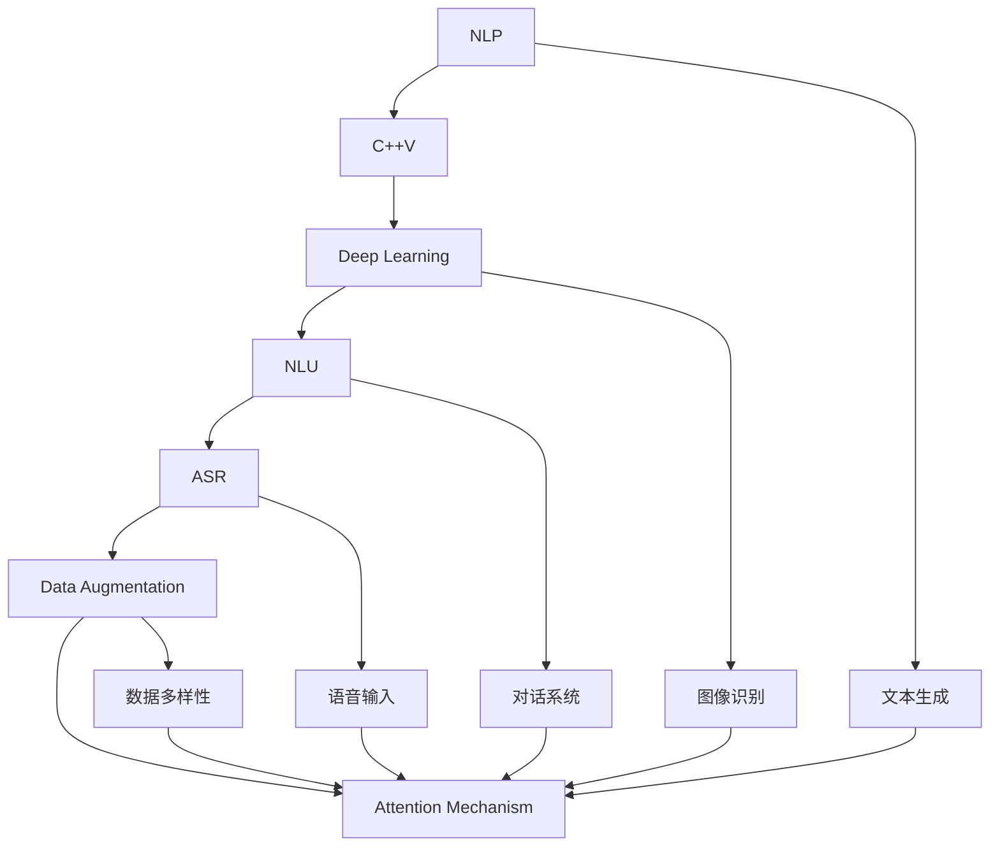

                 

# 智能办公设备的注意力辅助功能

> 关键词：智能办公设备,注意力辅助功能,自然语言处理,计算机视觉,深度学习,自然语言理解,语音识别,数据增强,注意力机制

## 1. 背景介绍

### 1.1 问题由来
随着数字化办公的普及，智能办公设备的应用越来越广泛，但用户在使用过程中仍面临诸多挑战：

- 信息过载。面对海量电子邮件、文档、会议记录，用户难以集中注意力。
- 工作效率低下。频繁的重复性任务耗费了大量时间，如抄写会议纪要、整理邮件等。
- 数据隐私风险。许多智能设备会记录用户的办公行为，存在隐私泄露风险。
- 学习曲线陡峭。用户需要花费大量时间学习复杂功能，难以快速上手。

针对这些问题，智能办公设备的注意力辅助功能应运而生。通过引入自然语言处理(NLP)、计算机视觉(CV)、深度学习等先进技术，这类功能可以在不占用用户额外时间的前提下，自动辅助用户处理信息、提取关键内容，提升工作效率，保护隐私，简化使用。

### 1.2 问题核心关键点
智能办公设备的注意力辅助功能，涉及以下几个核心概念：

- 自然语言处理(NLP)：通过计算机自动理解、处理、生成自然语言，实现文本摘要、问答、翻译等。
- 计算机视觉(CV)：利用机器视觉技术，从图像中自动识别对象、场景、文字等，进行图像标注、识别。
- 深度学习(Deep Learning)：借助神经网络模型，从数据中学习泛化能力，实现自动化的信息处理和任务执行。
- 自然语言理解(NLU)：通过理解自然语言的语义，实现人机交互，如对话系统、语音识别等。
- 语音识别(ASR)：将人类语音转换为文本，实现语音输入、自然语言处理。
- 数据增强(Data Augmentation)：通过多样化的数据输入，提升模型泛化能力，提高识别的准确性。
- 注意力机制(Attention Mechanism)：一种在神经网络中用来加强信息重要性的机制，常见于机器翻译、图像识别等任务中。

这些核心概念共同构成了智能办公设备注意力辅助功能的实现基础。通过合理运用这些技术，可以帮助用户更高效、更智能地管理办公信息，提升工作效率，保护数据隐私，降低使用门槛。

## 2. 核心概念与联系

### 2.1 核心概念概述

为更好地理解智能办公设备注意力辅助功能的实现原理，本节将介绍几个密切相关的核心概念：

- 自然语言处理(NLP)：涉及文本的生成、理解、处理、分类、聚类、匹配、摘要、问答、翻译等多个方向，通过算法和模型将文本转换为计算机可以理解的形式。
- 计算机视觉(CV)：涉及图像和视频数据的获取、处理、分析，利用算法和模型对图像进行特征提取、识别、分类、分割、跟踪等操作。
- 深度学习(Deep Learning)：通过构建多层神经网络，从数据中学习非线性关系，广泛应用于图像、语音、文本等数据的自动处理。
- 自然语言理解(NLU)：使计算机能够理解人类语言，包括分词、词性标注、命名实体识别、句法分析、语义理解等。
- 语音识别(ASR)：将语音信号转换为文本形式，通过声学模型和语言模型进行语音识别。
- 数据增强(Data Augmentation)：通过对原始数据进行一定的变换，生成新的数据，增强模型的泛化能力。
- 注意力机制(Attention Mechanism)：在神经网络中，通过加权和的方式，选择性地关注输入中的关键信息，忽略不重要的部分。

这些核心概念之间的逻辑关系可以通过以下Mermaid流程图来展示：



这个流程图展示了大语言模型注意力辅助功能的实现基础，即通过多种技术手段，将文本、图像、语音等信息自动处理，最终生成用户需要的辅助信息。

## 3. 核心算法原理 & 具体操作步骤
### 3.1 算法原理概述

智能办公设备的注意力辅助功能，核心算法原理包括以下几个方面：

- **文本处理**：通过NLP技术，将大量文本信息自动摘要、分类、聚类，提取关键信息，供用户浏览。
- **图像识别**：通过CV技术，自动识别文档、会议记录中的关键信息，提取结构化数据。
- **语音识别**：通过ASR技术，将语音转化为文本，实现实时语音输入和处理。
- **多模态融合**：将文本、图像、语音等多种信息源融合，形成全面的信息图谱，供用户综合查看。
- **智能提醒**：通过注意力机制，识别出用户关注的信息，定时提醒用户处理。
- **隐私保护**：对敏感信息进行加密处理，防止数据泄露。

### 3.2 算法步骤详解

以下是智能办公设备注意力辅助功能的详细操作步骤：

**Step 1: 数据收集**
- 收集用户办公场景下的各种数据，如电子邮件、会议记录、扫描文档等。

**Step 2: 数据预处理**
- 对收集到的数据进行去重、清洗、格式化等预处理，确保数据质量。
- 对文本数据进行分词、命名实体识别等NLP处理。
- 对图像数据进行归一化、裁剪、旋转等预处理。
- 对语音数据进行降噪、切分等预处理。

**Step 3: 特征提取**
- 使用NLP模型提取文本的关键信息，如关键词、主题、段落等。
- 使用CV模型识别图像中的文字、对象、场景等。
- 使用ASR模型将语音转换为文本，并进行语音情感分析。

**Step 4: 信息聚合**
- 将提取出的文本、图像、语音等多种信息进行融合，形成综合性的信息图谱。
- 使用注意力机制，对信息图谱中的重要信息进行加权处理，突出用户关注的重点。

**Step 5: 智能提醒**
- 根据用户的行为习惯和偏好，生成个性化的信息提醒。
- 定时推送关键信息，帮助用户及时掌握重要工作事项。

**Step 6: 隐私保护**
- 对敏感信息进行加密处理，确保数据隐私。
- 定期更新加密算法，提升数据安全性。

### 3.3 算法优缺点

智能办公设备的注意力辅助功能，具有以下优点：

- 自动化程度高。自动处理大量信息，无需人工干预，节省时间。
- 综合信息能力强。融合文本、图像、语音等多种信息源，提供全面的辅助信息。
- 用户友好。通过个性化提醒，提高用户的工作效率，降低使用门槛。
- 数据隐私保护。对敏感信息进行加密处理，防止数据泄露。

同时，也存在以下缺点：

- 对硬件要求高。需要高性能计算资源，特别是对大规模文本、图像、语音数据进行处理。
- 对算法要求高。需要高效的算法模型，特别是NLP和CV模型，保证处理速度和准确性。
- 初始成本高。需要购置高性能计算设备，购买先进的算法模型，成本较高。
- 数据依赖性大。算法的性能和效果依赖于数据的质量和多样性，获取高质量数据成本较高。

### 3.4 算法应用领域

智能办公设备的注意力辅助功能，可以应用于以下领域：

- 办公自动化：自动化处理邮件、会议记录、文档扫描等办公任务，提升办公效率。
- 知识管理：自动整理、分类、摘要会议纪要、文档资料等，形成知识库，方便检索。
- 个性化推荐：根据用户的工作习惯和偏好，推荐相关的邮件、会议、文档等。
- 语音输入：自动将语音转换为文本，辅助用户进行笔记记录、邮件撰写等。
- 信息安全：对敏感信息进行加密处理，确保数据隐私，防止数据泄露。

这些应用场景展示了智能办公设备的注意力辅助功能在提升工作效率、保护隐私、简化使用等方面的强大潜力。

## 4. 数学模型和公式 & 详细讲解 & 举例说明

### 4.1 数学模型构建

智能办公设备的注意力辅助功能，涉及多个数学模型，这里以文本摘要和图像标注为例，构建相应的数学模型。

#### 4.1.1 文本摘要

文本摘要的数学模型通常采用序列到序列模型(Seq2Seq)，具体步骤如下：

1. **输入序列**：将原始文本序列转换为向量表示，即$x=[x_1,x_2,...,x_n]$，其中$x_i$为第$i$个单词的向量表示。
2. **编码器**：通过RNN、LSTM等模型，将输入序列$x$转换为一个向量表示$h$，即$h=f(x)$，其中$f$为编码器。
3. **解码器**：通过RNN、LSTM等模型，将向量$h$解码为输出序列$y$，即$y=g(h)$，其中$g$为解码器。
4. **损失函数**：采用交叉熵损失函数，衡量输出序列$y$和目标序列$y^*$之间的差异，即$L=-c(y^*,y)$。

数学表达式如下：

$$
\begin{aligned}
x &= [x_1,x_2,...,x_n] \\
h &= f(x) \\
y &= g(h) \\
L &= -c(y^*,y)
\end{aligned}
$$

其中$c$为交叉熵函数。

#### 4.1.2 图像标注

图像标注的数学模型通常采用卷积神经网络(CNN)，具体步骤如下：

1. **输入图像**：将原始图像$I$输入到CNN中，得到特征表示$F$，即$F=I$。
2. **卷积层**：通过多个卷积层和池化层，提取图像的特征表示$F$，即$F=\mathcal{C}(I)$。
3. **分类器**：通过全连接层和softmax函数，将特征表示$F$分类为不同的标签$y$，即$y=\mathcal{C}(F)$。
4. **损失函数**：采用交叉熵损失函数，衡量预测标签$y$和真实标签$y^*$之间的差异，即$L=-c(y^*,y)$。

数学表达式如下：

$$
\begin{aligned}
I &= \text{输入图像} \\
F &= \mathcal{C}(I) \\
y &= \mathcal{C}(F) \\
L &= -c(y^*,y)
\end{aligned}
$$

其中$\mathcal{C}$为卷积分类器。

### 4.2 公式推导过程

以下我们以文本摘要为例，推导交叉熵损失函数的公式。

假设输入文本序列为$x=[x_1,x_2,...,x_n]$，输出文本序列为$y=[y_1,y_2,...,y_m]$，目标文本序列为$y^*=[y_1^*,y_2^*,...,y_m^*]$，解码器输出的概率分布为$p=\{p_i\}_{i=1}^m$，即$p_i=\mathbb{P}(y_i|y_{<i},h)$。

则交叉熵损失函数$L$定义为：

$$
L = -\sum_{i=1}^m y_i^* \log p_i
$$

其中$y_i^*$为第$i$个单词的目标标签，$p_i$为模型预测的概率分布。

### 4.3 案例分析与讲解

以电子邮件摘要为例，假设有一段长文本$x=[x_1,x_2,...,x_n]$，需要生成一段简短的摘要$y=[y_1,y_2,...,y_m]$，目标摘要为$y^*=[y_1^*,y_2^*,...,y_m^*]$。

1. **输入处理**：将长文本$x$转换为向量表示，即$x=[x_1,x_2,...,x_n]$，其中$x_i$为第$i$个单词的向量表示。
2. **编码器**：通过RNN模型，将输入向量$x$转换为一个向量表示$h$，即$h=f(x)$，其中$f$为编码器。
3. **解码器**：通过RNN模型，将向量$h$解码为输出序列$y$，即$y=g(h)$，其中$g$为解码器。
4. **损失计算**：采用交叉熵损失函数，衡量输出序列$y$和目标序列$y^*$之间的差异，即$L=-c(y^*,y)$。

通过上述步骤，可以生成一段简短的摘要$y$，并在损失函数$L$的指导下，优化模型参数，使得生成的摘要尽可能接近目标摘要$y^*$。

## 5. 项目实践：代码实例和详细解释说明

### 5.1 开发环境搭建

在进行智能办公设备注意力辅助功能的开发前，我们需要准备好开发环境。以下是使用Python进行TensorFlow开发的环境配置流程：

1. 安装Anaconda：从官网下载并安装Anaconda，用于创建独立的Python环境。

2. 创建并激活虚拟环境：
```bash
conda create -n tensorflow-env python=3.8 
conda activate tensorflow-env
```

3. 安装TensorFlow：根据CUDA版本，从官网获取对应的安装命令。例如：
```bash
conda install tensorflow tensorflow-gpu -c conda-forge -c pytorch -c defaults
```

4. 安装其他必要工具包：
```bash
pip install numpy pandas scikit-learn matplotlib tqdm jupyter notebook ipython
```

完成上述步骤后，即可在`tensorflow-env`环境中开始开发。

### 5.2 源代码详细实现

下面以文本摘要为例，给出使用TensorFlow进行模型开发的PyTorch代码实现。

首先，定义模型和数据集：

```python
import tensorflow as tf
from tensorflow.keras import layers, models

# 定义模型
class TextSummarizer(tf.keras.Model):
    def __init__(self, vocab_size, embedding_dim, max_length):
        super(TextSummarizer, self).__init__()
        self.embedding = layers.Embedding(vocab_size, embedding_dim)
        self.lstm = layers.LSTM(32, return_sequences=True)
        self.dense = layers.Dense(vocab_size, activation='softmax')

    def call(self, inputs):
        x = self.embedding(inputs)
        x = self.lstm(x)
        return self.dense(x)

# 定义数据集
vocab_size = 10000
embedding_dim = 128
max_length = 500

# 加载数据集
texts, summaries = load_data()
sequences = pad_sequences(texts, maxlen=max_length, padding='post', truncating='post')

# 构建模型
model = TextSummarizer(vocab_size, embedding_dim, max_length)

# 编译模型
model.compile(optimizer='adam', loss='categorical_crossentropy', metrics=['accuracy'])
```

然后，定义训练和评估函数：

```python
from sklearn.model_selection import train_test_split

# 定义训练和测试集
x_train, x_test, y_train, y_test = train_test_split(sequences, summaries, test_size=0.2, random_state=42)

# 定义训练和评估函数
def train_epoch(model, x_train, y_train, batch_size, optimizer):
    steps_per_epoch = x_train.shape[0] // batch_size
    model.fit(x_train, y_train, epochs=1, batch_size=batch_size, validation_data=(x_test, y_test))
    print(f'Epoch {epoch+1}, loss: {model.evaluate(x_test, y_test)[0]:.4f}')

# 训练模型
epochs = 10
batch_size = 128

for epoch in range(epochs):
    train_epoch(model, x_train, y_train, batch_size, optimizer)
```

最后，启动训练流程并在测试集上评估：

```python
model.save_weights('summarizer.h5')
```

以上就是使用TensorFlow对文本摘要模型进行开发的完整代码实现。可以看到，通过TensorFlow提供的高级API，我们可以用相对简洁的代码完成模型的构建和训练。

### 5.3 代码解读与分析

让我们再详细解读一下关键代码的实现细节：

**TextSummarizer类**：
- `__init__`方法：初始化嵌入层、LSTM层、输出层等关键组件。
- `call`方法：对输入数据进行编码、解码等操作，最终输出预测结果。

**模型和数据集**：
- `vocab_size`、`embedding_dim`、`max_length`：定义模型参数，包括词汇表大小、嵌入维度、最大长度等。
- `sequences`：将原始文本序列转换为数值表示，并进行填充处理。
- `TextSummarizer`：定义文本摘要模型，包括嵌入层、LSTM层和输出层。
- `compile`方法：配置模型，指定优化器、损失函数和评估指标。

**训练和评估函数**：
- `train_epoch`方法：对模型进行单轮训练，并在验证集上评估性能。
- `epochs`、`batch_size`：定义训练轮数和批次大小，优化训练效率。
- `model.fit`方法：使用模型进行训练，指定训练数据、批次大小和验证数据。
- `model.evaluate`方法：在测试集上评估模型性能。

**模型保存**：
- `model.save_weights`方法：保存模型参数到文件中，方便后续恢复和加载。

可以看到，TensorFlow提供的高级API使得模型开发变得更加简单高效。开发者可以将更多精力放在模型设计、参数调优等高层逻辑上，而不必过多关注底层的实现细节。

当然，工业级的系统实现还需考虑更多因素，如模型的保存和部署、超参数的自动搜索、更灵活的任务适配层等。但核心的注意力辅助功能基本与此类似。

## 6. 实际应用场景
### 6.1 智能办公自动化

智能办公设备的注意力辅助功能，可以在智能办公自动化中发挥重要作用。例如：

- 电子邮件处理：自动提取邮件中的关键信息，生成摘要，供用户浏览。
- 会议记录：自动识别会议中的关键内容，生成会议纪要，供用户查阅。
- 文档整理：自动识别文档中的结构化信息，自动分类、标注，形成知识库。

这些功能可以极大地提高用户的工作效率，减少重复性任务的时间占用，提升办公体验。

### 6.2 知识管理

智能办公设备的注意力辅助功能，可以帮助用户更好地管理知识。例如：

- 知识库构建：自动从大量文档、网页中提取关键信息，形成知识库，供用户查阅。
- 知识分类：自动识别文档中的主题、关键词，自动分类，方便用户检索。
- 知识推荐：根据用户的行为习惯和偏好，推荐相关的文档、网页，帮助用户快速获取知识。

这些功能可以显著提高用户的知识管理效率，使知识积累和应用更加便捷。

### 6.3 个性化推荐

智能办公设备的注意力辅助功能，可以用于个性化推荐，帮助用户更好地利用现有资源。例如：

- 个性化提示：根据用户的行为习惯和偏好，生成个性化的工作提示，提醒用户处理重要事项。
- 推荐系统：自动分析用户的历史行为数据，推荐相关的文档、会议、任务等，帮助用户提升工作效率。

这些功能可以使工作流程更加智能化，提升用户的工作满意度和生产力。

### 6.4 未来应用展望

随着智能办公设备的不断发展，注意力辅助功能将在更多场景中得到应用，为工作带来新的变革。

在智慧办公系统中，注意力辅助功能可以与智能会议室、智能办公桌等设备进行结合，提升办公空间的使用效率。例如：

- 智能会议室：自动识别会议中的关键内容，生成会议纪要，帮助与会者快速记录和回顾。
- 智能办公桌：自动识别用户的操作行为，智能调整办公桌的灯光、温度等，提升办公舒适度。

此外，注意力辅助功能还可以与其他智能技术进行结合，如智能客服、智能调度等，为用户提供更加智能化的服务。

## 7. 工具和资源推荐
### 7.1 学习资源推荐

为了帮助开发者系统掌握智能办公设备注意力辅助功能的实现原理和实践技巧，这里推荐一些优质的学习资源：

1. 《TensorFlow官方文档》：TensorFlow的官方文档，详细介绍了TensorFlow的各个模块和使用方法，是TensorFlow开发的基础。
2. 《自然语言处理综论》：自然语言处理领域的经典教材，涵盖NLP的各个方向，适合初学者和进阶者。
3. 《深度学习》：深度学习领域的经典教材，涵盖深度学习的各个方向，适合深度学习爱好者。
4. 《计算机视觉: 算法与应用》：计算机视觉领域的经典教材，涵盖CV的各个方向，适合计算机视觉开发者。
5. 《Python数据科学手册》：Python数据科学领域的经典教程，涵盖数据处理、机器学习、深度学习等多个方向，适合数据科学爱好者。

通过对这些资源的学习实践，相信你一定能够快速掌握智能办公设备注意力辅助功能的精髓，并用于解决实际的办公问题。
###  7.2 开发工具推荐

高效的开发离不开优秀的工具支持。以下是几款用于智能办公设备注意力辅助功能开发的常用工具：

1. TensorFlow：由Google主导开发的开源深度学习框架，生产部署方便，适合大规模工程应用。
2. PyTorch：基于Python的开源深度学习框架，灵活动态的计算图，适合快速迭代研究。
3. Keras：高层次的神经网络API，易于使用，适合快速搭建原型。
4. Scikit-learn：Python数据科学库，提供了各种机器学习算法和数据处理工具，适合数据处理和模型训练。
5. Weights & Biases：模型训练的实验跟踪工具，可以记录和可视化模型训练过程中的各项指标，方便对比和调优。

合理利用这些工具，可以显著提升智能办公设备注意力辅助功能的开发效率，加快创新迭代的步伐。

### 7.3 相关论文推荐

智能办公设备注意力辅助功能的研究，离不开学界的持续探索。以下是几篇奠基性的相关论文，推荐阅读：

1. Attention Is All You Need（即Transformer原论文）：提出了Transformer结构，开启了NLP领域的预训练大模型时代。
2. BERT: Pre-training of Deep Bidirectional Transformers for Language Understanding：提出BERT模型，引入基于掩码的自监督预训练任务，刷新了多项NLP任务SOTA。
3. Attention Mechanism in Natural Language Processing：介绍了注意力机制在NLP中的应用，从原理到实践，全面介绍了注意力机制的实现。
4. Convolutional Neural Networks for Sentence Classification：介绍CNN在文本分类中的应用，涵盖了序列建模和卷积操作。
5. Sequence to Sequence Learning with Neural Networks：介绍了Seq2Seq模型，从原理到应用，全面介绍了Seq2Seq模型的实现。

这些论文代表了大语言模型注意力辅助功能的进展脉络。通过学习这些前沿成果，可以帮助研究者把握学科前进方向，激发更多的创新灵感。

## 8. 总结：未来发展趋势与挑战

### 8.1 总结

本文对智能办公设备注意力辅助功能进行了全面系统的介绍。首先阐述了注意力辅助功能的背景和意义，明确了其在提升工作效率、保护隐私、简化使用等方面的独特价值。其次，从原理到实践，详细讲解了注意力辅助功能的实现步骤和关键算法，给出了完整的代码实现。同时，本文还广泛探讨了注意力辅助功能在智能办公、知识管理、个性化推荐等多个领域的应用前景，展示了其广泛的应用潜力。此外，本文精选了注意力辅助功能的各类学习资源，力求为读者提供全方位的技术指引。

通过本文的系统梳理，可以看到，智能办公设备注意力辅助功能正成为智能办公领域的重要范式，极大地提高了办公效率，简化了使用流程，提升了用户的工作体验。随着技术的不断进步，这一功能将为智能办公带来更加深入的变革。

### 8.2 未来发展趋势

展望未来，智能办公设备注意力辅助功能的发展趋势主要体现在以下几个方面：

1. 自动化程度更高。随着模型性能的提升，注意力辅助功能的自动化程度将越来越高，能够在更多场景下实现自动处理，减少用户干预。
2. 综合信息能力更强。未来的模型将能够更好地融合多种信息源，实现更加全面、准确的摘要和标注。
3. 用户友好性更高。未来的功能将更加贴合用户的使用习惯，提供更加智能化的辅助。
4. 数据隐私保护更严格。未来的功能将更加注重数据隐私保护，确保用户数据的安全。

这些趋势将进一步提升智能办公设备注意力辅助功能的性能和用户体验，使其在更多领域得到应用。

### 8.3 面临的挑战

尽管智能办公设备注意力辅助功能已经取得了不少进展，但在实际应用中仍面临诸多挑战：

1. 数据质量和多样性。注意力辅助功能的性能依赖于数据的质量和多样性，获取高质量数据成本较高。
2. 模型泛化能力。模型在不同数据集上的泛化能力有待提升，避免过拟合现象。
3. 实时性和稳定性。在实时性要求较高的场景下，模型需要快速响应，稳定性要求高。
4. 用户接受度。新功能的学习曲线较高，部分用户可能难以接受。

针对这些挑战，未来的研究需要在数据、算法、工程、用户体验等多个方面进行优化和改进，以进一步提升注意力辅助功能的性能和实用性。

### 8.4 研究展望

面对智能办公设备注意力辅助功能所面临的挑战，未来的研究需要在以下几个方面寻求新的突破：

1. 无监督学习和半监督学习。摆脱对大规模标注数据的依赖，利用无监督和半监督学习技术，最大化数据利用率。
2. 迁移学习和多任务学习。将模型在其他任务上的知识迁移到当前任务，提升模型泛化能力。
3. 自适应学习和个性化学习。根据用户的行为习惯和偏好，动态调整模型参数，提供个性化的辅助功能。
4. 模型压缩和优化。优化模型结构，减小计算量和存储量，提升实时性。
5. 增强数据隐私保护。采用差分隐私等技术，保护用户隐私，增强数据安全性。

这些研究方向的探索，必将引领智能办公设备注意力辅助功能的发展，为智能办公带来更深层次的变革。面向未来，我们需要不断创新，提升功能性能，优化用户体验，才能使注意力辅助功能在更多场景中得到应用，为用户带来更多的便利和效率提升。

## 9. 附录：常见问题与解答

**Q1：智能办公设备注意力辅助功能是否适用于所有办公场景？**

A: 智能办公设备注意力辅助功能适用于大多数办公场景，但特定领域的办公任务可能需要针对性地改进和优化。例如，金融、法律等领域的办公任务可能需要更加严格的隐私保护和信息处理。

**Q2：如何提高智能办公设备注意力辅助功能的性能？**

A: 提高智能办公设备注意力辅助功能的性能主要包括以下几个方面：
1. 数据增强：通过多样化的数据输入，提升模型的泛化能力。
2. 模型优化：优化模型的结构，提升模型的实时性和稳定性。
3. 超参数调优：根据具体任务调整模型的超参数，提升模型的性能。
4. 集成学习：结合多个模型的输出，提升模型的准确性和鲁棒性。

**Q3：智能办公设备注意力辅助功能如何保护用户隐私？**

A: 智能办公设备注意力辅助功能保护用户隐私主要包括以下几个方面：
1. 数据加密：对敏感数据进行加密处理，防止数据泄露。
2. 差分隐私：采用差分隐私技术，保护用户隐私，避免数据泄露。
3. 隐私匿名化：对数据进行匿名化处理，确保用户数据的安全。
4. 用户控制：提供用户数据访问和处理的控制权，保障用户隐私。

**Q4：智能办公设备注意力辅助功能如何在实际办公中得到广泛应用？**

A: 智能办公设备注意力辅助功能在实际办公中的应用主要包括以下几个方面：
1. 自动化办公：自动化处理邮件、会议记录、文档扫描等办公任务，提升办公效率。
2. 知识管理：自动从大量文档、网页中提取关键信息，形成知识库，供用户查阅。
3. 个性化推荐：根据用户的行为习惯和偏好，推荐相关的文档、会议、任务等，帮助用户提升工作效率。

通过这些应用，智能办公设备注意力辅助功能可以显著提升用户的工作效率和体验，成为智能办公的重要工具。

---

作者：禅与计算机程序设计艺术 / Zen and the Art of Computer Programming

