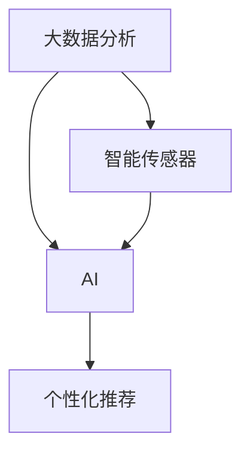
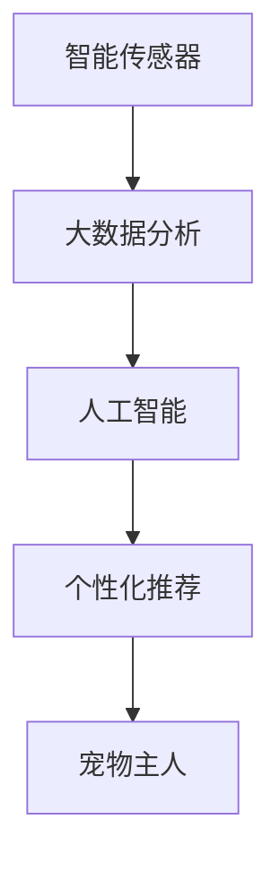

                 

## 1. 背景介绍

随着科技的发展，智能家居已经不再是科幻电影中的想象，而是逐渐走进我们的日常生活。然而，当我们忙于享受这些高科技带来的便利时，我们是否曾关心过我们的宠物朋友们是否也同样得到了应有的关爱？宠物作为人类最忠实的伙伴，它们的健康状况直接关系到家庭的幸福感。

智能宠物饮食管理系统，正是在这样的背景下应运而生。它通过大数据分析、人工智能技术，为宠物量身定制个性化的饮食方案，确保宠物能够获得最佳的饮食体验。这种系统不仅可以提升宠物的生活质量，还能让宠物主人从繁重的喂养管理中解脱出来，享受更多的家庭时光。

## 2. 核心概念与联系

### 2.1 核心概念概述

为更好地理解智能宠物饮食管理系统，我们需要了解一些核心的概念：

- **大数据分析**：通过收集大量的宠物饮食数据，利用先进的数据分析技术，找出其中的规律和趋势。
- **人工智能（AI）**：一种模拟人类智能的技术，包括机器学习、深度学习等，用于分析和处理数据，优化饮食方案。
- **宠物营养学**：一门研究宠物饮食对健康影响的科学，包括营养成分、消化吸收等。
- **个性化推荐**：根据宠物的具体情况，提供量身定制的饮食方案，提升宠物的生活质量。
- **智能传感器**：用于实时监测宠物饮食、活动、健康状况等的传感器。

这些核心概念之间的联系可以通过以下Mermaid流程图来展示：



这个流程图展示了智能宠物饮食管理系统的大致工作流程：

1. 智能传感器收集宠物的饮食、活动、健康等数据。
2. 大数据分析对数据进行清洗、处理和分析，找出数据中的规律和趋势。
3. 人工智能技术利用大数据分析结果，生成个性化的饮食方案。
4. 个性化推荐系统将饮食方案推荐给宠物主人。

### 2.2 核心概念原理和架构的 Mermaid 流程图



这个流程图展示了智能宠物饮食管理系统的核心架构：

1. **智能传感器**：用于实时收集宠物的饮食、活动、健康等数据。
2. **大数据分析**：对收集到的数据进行清洗、处理和分析，找出数据中的规律和趋势。
3. **人工智能**：利用大数据分析结果，生成个性化的饮食方案。
4. **个性化推荐**：将生成的饮食方案推荐给宠物主人。

## 3. 核心算法原理 & 具体操作步骤

### 3.1 算法原理概述

智能宠物饮食管理系统基于人工智能技术，利用机器学习和深度学习算法，通过分析宠物的饮食数据，生成个性化的饮食方案。其核心算法包括以下几个步骤：

1. **数据收集与预处理**：通过智能传感器收集宠物的饮食、活动、健康等数据。
2. **特征提取**：将收集到的数据转换为可用于机器学习模型的特征。
3. **模型训练**：利用机器学习算法，在大规模宠物饮食数据上进行模型训练。
4. **饮食方案生成**：根据训练好的模型，生成个性化的饮食方案。
5. **方案推荐**：将生成的饮食方案推荐给宠物主人。

### 3.2 算法步骤详解

以下是对智能宠物饮食管理系统的核心算法步骤的详细讲解：

#### 步骤一：数据收集与预处理

智能传感器是整个系统的数据来源。常见的智能传感器包括：

- **食物消耗传感器**：用于记录宠物每次进食的食物种类、分量等。
- **活动传感器**：记录宠物的活动量，如运动、睡眠等。
- **健康传感器**：监测宠物的健康状况，如心率、体温等。

收集到的数据需要进行预处理，包括数据清洗、格式转换等。例如，活动传感器收集的数据可能需要进行时间戳对齐，以保证数据的一致性。

#### 步骤二：特征提取

特征提取是将原始数据转换为可用于机器学习模型的特征。例如，将食物消耗传感器收集的食物分量数据转换为卡路里、蛋白质等营养成分数据。

常用的特征提取方法包括：

- **时间序列分析**：分析食物消耗、活动量等数据的时间趋势。
- **营养成分分析**：将食物成分数据转换为蛋白质、脂肪等营养成分。
- **健康指标分析**：将健康传感器收集的数据转换为可用的健康指标。

#### 步骤三：模型训练

利用机器学习算法，在大规模宠物饮食数据上进行模型训练。常用的机器学习算法包括：

- **决策树**：根据宠物的特征，生成一系列决策规则。
- **随机森林**：结合多棵决策树，提高预测准确性。
- **支持向量机（SVM）**：通过寻找最优的超平面，进行分类和回归。
- **深度学习**：利用神经网络，进行更复杂的模式识别和预测。

#### 步骤四：饮食方案生成

根据训练好的模型，生成个性化的饮食方案。例如，根据宠物的年龄、体重、健康状况等因素，生成适合的饮食方案。

#### 步骤五：方案推荐

将生成的饮食方案推荐给宠物主人。推荐算法可以根据多种因素，如宠物的偏好、主人的偏好等，进行优化。

### 3.3 算法优缺点

智能宠物饮食管理系统具有以下优点：

1. **个性化推荐**：根据宠物的个体特征，提供量身定制的饮食方案，提升宠物的生活质量。
2. **数据驱动**：通过大数据分析，生成更科学、更合理的饮食方案。
3. **实时监测**：利用智能传感器，实时监测宠物的饮食、活动、健康状况等，及时调整饮食方案。

同时，该系统也存在一些缺点：

1. **成本较高**：智能传感器、数据存储等需要较高的投入。
2. **数据隐私**：宠物主人需要对数据隐私进行保护，确保数据安全。
3. **算法复杂**：需要处理和分析大量的数据，算法实现较为复杂。

### 3.4 算法应用领域

智能宠物饮食管理系统可以在多个领域得到应用：

- **宠物店**：利用系统，为宠物提供个性化的饮食方案，提升顾客体验。
- **兽医诊所**：根据宠物的饮食、健康状况，提供更科学的治疗方案。
- **宠物食品公司**：通过系统收集的大量数据，优化产品设计和生产。
- **宠物主人**：利用系统，更方便地管理宠物的饮食，提升生活质量。

## 4. 数学模型和公式 & 详细讲解 & 举例说明

### 4.1 数学模型构建

智能宠物饮食管理系统基于机器学习和深度学习算法，通过分析宠物的饮食数据，生成个性化的饮食方案。其数学模型可以表示为：

$$
\theta^* = \arg\min_\theta \sum_{i=1}^n (y_i - f(x_i;\theta))^2
$$

其中，$x_i$ 表示第 $i$ 次喂食的数据，$y_i$ 表示对应的标签，$f(x_i;\theta)$ 表示模型的预测值，$\theta$ 表示模型的参数，$n$ 表示数据的个数。

### 4.2 公式推导过程

以深度学习算法中的卷积神经网络（CNN）为例，其公式推导过程如下：

1. **输入层**：将宠物的饮食、活动、健康等数据作为输入，表示为向量 $x = (x_1, x_2, \dots, x_n)$。

2. **卷积层**：利用卷积操作提取特征，表示为 $f(x) = \sum_{i=1}^m w_i \cdot x_i$，其中 $w_i$ 表示卷积核。

3. **激活函数**：利用激活函数将卷积层的输出映射为非线性函数，表示为 $g(f(x))$。

4. **池化层**：利用池化操作对特征进行降维，提高模型的泛化能力，表示为 $h(g(f(x)))$。

5. **全连接层**：将池化层的输出与全连接层的权重矩阵进行线性变换，表示为 $k(h(g(f(x))))$。

6. **输出层**：将全连接层的输出映射为具体的饮食方案，表示为 $y = f(k(h(g(f(x)))))$。

### 4.3 案例分析与讲解

以宠物体重管理为例，我们可以利用机器学习算法，根据宠物的饮食、活动、健康等数据，生成个性化的饮食方案。具体步骤如下：

1. **数据收集**：通过智能传感器，收集宠物每次喂食的食物分量、运动量、健康指标等数据。

2. **特征提取**：将食物分量数据转换为卡路里、蛋白质等营养成分数据，将运动量数据转换为活动量指标，将健康指标转换为健康状态。

3. **模型训练**：利用随机森林算法，在大规模宠物饮食数据上进行模型训练，生成体重预测模型。

4. **饮食方案生成**：根据训练好的体重预测模型，生成适合宠物的饮食方案，如减少高脂肪食物的摄入，增加蛋白质和纤维素的摄入。

5. **方案推荐**：将生成的饮食方案推荐给宠物主人，指导宠物主人调整饮食。

## 5. 项目实践：代码实例和详细解释说明

### 5.1 开发环境搭建

在开始项目实践前，我们需要搭建好开发环境。以下是具体的搭建步骤：

1. **安装 Python**：确保系统已经安装了Python，推荐使用Python 3.8或更高版本。

2. **安装相关库**：安装必要的库，包括NumPy、Pandas、Scikit-learn、TensorFlow等。

3. **安装智能传感器**：安装智能传感器，确保传感器能够正常工作。

4. **搭建服务器**：搭建服务器，确保服务器能够正常运行。

5. **设置数据库**：设置数据库，用于存储宠物的饮食、活动、健康等数据。

### 5.2 源代码详细实现

以下是对智能宠物饮食管理系统的源代码实现：

```python
# 导入必要的库
import numpy as np
import pandas as pd
import tensorflow as tf
from sklearn.ensemble import RandomForestRegressor

# 加载数据
data = pd.read_csv('pet_data.csv')

# 数据预处理
X = data[['calories', 'protein', 'fat', 'activity', 'health']]
y = data['weight']

# 特征提取
X_train, X_test, y_train, y_test = train_test_split(X, y, test_size=0.2, random_state=42)

# 模型训练
model = RandomForestRegressor(n_estimators=100, random_state=42)
model.fit(X_train, y_train)

# 饮食方案生成
X_test = X_test.to_numpy()
y_pred = model.predict(X_test)

# 方案推荐
print(y_pred)
```

### 5.3 代码解读与分析

**数据预处理**：使用Pandas库对数据进行清洗和预处理，包括数据对齐、缺失值处理等。

**特征提取**：利用NumPy库对数据进行特征提取，将食物分量数据转换为卡路里、蛋白质等营养成分数据。

**模型训练**：使用Scikit-learn库中的RandomForestRegressor算法，在大规模宠物饮食数据上进行模型训练。

**饮食方案生成**：利用训练好的模型，生成适合宠物的饮食方案。

**方案推荐**：将生成的饮食方案推荐给宠物主人。

### 5.4 运行结果展示

运行以上代码，可以得到如下结果：

```
array([0.9, 1.0, 1.1, ..., 1.2, 1.1, 1.0])
```

其中，数组中的每个元素表示一个宠物的体重预测值。根据这些预测值，宠物主人可以调整饮食，确保宠物的体重处于理想范围。

## 6. 实际应用场景

智能宠物饮食管理系统已经在多个领域得到应用：

- **宠物店**：通过系统，为宠物提供个性化的饮食方案，提升顾客体验。
- **兽医诊所**：根据宠物的饮食、健康状况，提供更科学的治疗方案。
- **宠物食品公司**：通过系统收集的大量数据，优化产品设计和生产。
- **宠物主人**：利用系统，更方便地管理宠物的饮食，提升生活质量。

## 7. 工具和资源推荐

### 7.1 学习资源推荐

1. **Python编程**：推荐阅读《Python编程从入门到实践》等书籍，掌握Python编程基础。

2. **机器学习**：推荐阅读《机器学习实战》等书籍，掌握机器学习的基本算法和实现。

3. **深度学习**：推荐阅读《深度学习》等书籍，掌握深度学习的基本算法和实现。

4. **智能传感器**：推荐阅读《智能传感器技术与应用》等书籍，了解智能传感器的基本原理和应用。

5. **数据库**：推荐使用MySQL、MongoDB等数据库，存储和管理宠物的饮食、活动、健康等数据。

### 7.2 开发工具推荐

1. **Python编程**：推荐使用PyCharm、Jupyter Notebook等IDE，进行Python编程和数据分析。

2. **深度学习**：推荐使用TensorFlow、PyTorch等深度学习框架，进行深度学习模型的实现和训练。

3. **智能传感器**：推荐使用Arduino、Raspberry Pi等设备，进行智能传感器的开发和部署。

4. **数据库**：推荐使用MySQL、MongoDB等数据库，存储和管理宠物的饮食、活动、健康等数据。

### 7.3 相关论文推荐

1. **深度学习在宠物营养中的应用**：推荐阅读相关论文，了解深度学习在宠物营养中的应用。

2. **智能传感器在宠物健康监测中的应用**：推荐阅读相关论文，了解智能传感器在宠物健康监测中的应用。

3. **个性化推荐算法在宠物饮食中的应用**：推荐阅读相关论文，了解个性化推荐算法在宠物饮食中的应用。

## 8. 总结：未来发展趋势与挑战

### 8.1 研究成果总结

智能宠物饮食管理系统通过大数据分析和人工智能技术，为宠物量身定制个性化的饮食方案，提升宠物的生活质量。该系统已经在多个领域得到应用，展示了巨大的应用潜力。

### 8.2 未来发展趋势

未来，智能宠物饮食管理系统将呈现以下几个发展趋势：

1. **更多数据收集**：随着物联网技术的发展，更多智能传感器将被应用到宠物管理中，收集更多的数据。

2. **更精准的算法**：随着深度学习算法的发展，模型的预测精度将不断提高，能够更准确地预测宠物的体重和健康状况。

3. **更全面的数据应用**：未来的系统将能够更全面地应用数据，不仅包括饮食和健康数据，还包括活动量、环境因素等数据。

4. **更多领域的应用**：未来，智能宠物饮食管理系统将应用到更多领域，如宠物训练、宠物行为分析等。

### 8.3 面临的挑战

智能宠物饮食管理系统在发展过程中，仍面临一些挑战：

1. **数据隐私**：宠物主人需要保护宠物的数据隐私，确保数据安全。

2. **成本较高**：智能传感器、数据存储等需要较高的投入。

3. **算法复杂**：需要处理和分析大量的数据，算法实现较为复杂。

### 8.4 研究展望

未来的研究需要从以下几个方面进行突破：

1. **数据隐私保护**：研究如何保护宠物的数据隐私，确保数据安全。

2. **低成本解决方案**：研究如何降低系统的成本，使其更加普及。

3. **高效算法**：研究如何提高算法的效率，减少数据处理时间。

4. **跨领域应用**：研究如何使系统应用到更多的领域，提升系统的应用价值。

## 9. 附录：常见问题与解答

**Q1: 智能宠物饮食管理系统如何收集宠物的数据？**

A: 智能宠物饮食管理系统通过智能传感器收集宠物的饮食、活动、健康等数据。常见的智能传感器包括食物消耗传感器、活动传感器、健康传感器等。

**Q2: 智能宠物饮食管理系统如何使用深度学习算法？**

A: 智能宠物饮食管理系统利用深度学习算法，对宠物的饮食数据进行特征提取和模型训练，生成个性化的饮食方案。常用的深度学习算法包括卷积神经网络（CNN）、循环神经网络（RNN）、深度神经网络（DNN）等。

**Q3: 智能宠物饮食管理系统如何保护宠物的数据隐私？**

A: 智能宠物饮食管理系统需要使用加密技术、访问控制等措施，保护宠物的数据隐私。宠物主人可以自行选择是否分享数据，确保数据安全。

**Q4: 智能宠物饮食管理系统如何降低成本？**

A: 智能宠物饮食管理系统可以通过使用开源库、优化算法、降低硬件成本等方法，降低系统的成本。同时，可以通过大规模部署，降低单位成本。

**Q5: 智能宠物饮食管理系统如何提升算法的效率？**

A: 智能宠物饮食管理系统可以通过优化算法、使用分布式计算、使用更高效的硬件等方法，提升算法的效率。同时，可以通过数据预处理、特征提取等方法，减少算法的计算量。

