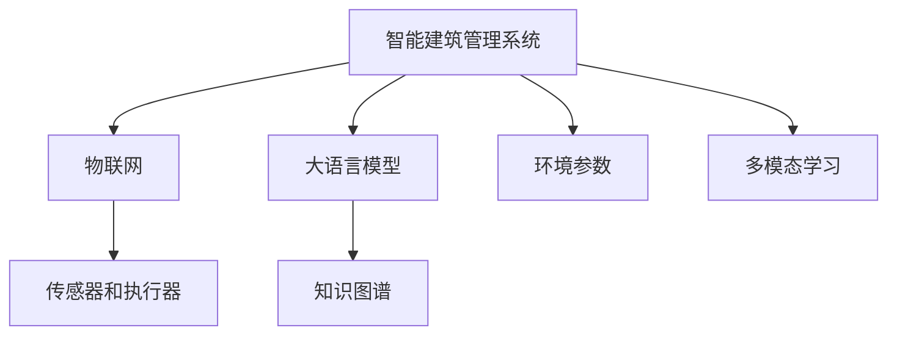

                 

# 智能建筑管理：LLM优化能源使用和空间利用

> 关键词：
- 大语言模型(Large Language Model, LLM)
- 自然语言处理(Natural Language Processing, NLP)
- 智能建筑管理(Smart Building Management)
- 能源优化(Energy Optimization)
- 空间利用(Space Utilization)
- 知识图谱(Knowledge Graph)
- 多模态学习(Multimodal Learning)

## 1. 背景介绍

### 1.1 问题由来

随着全球城市化的加速和科技的进步，智能建筑在现代城市中的作用日益凸显。智能建筑管理系统通过集成物联网(IoT)设备，收集建筑内部的传感器数据，实时监测和控制照明、温度、湿度、空气质量等环境参数，以提高能源效率、提升居住舒适度和节省运营成本。然而，传统的建筑管理系统往往依赖于固定的规则和预设值，无法根据实时环境动态调整，导致能源浪费和资源浪费。

### 1.2 问题核心关键点

智能建筑管理系统的一大挑战是如何在复杂环境中进行实时决策。传统方法依赖于硬编码的规则和专家知识，难以适应多变的环境和用户需求。近年来，大语言模型在自然语言处理(NLP)领域取得了突破性进展，使其成为智能建筑管理领域的一个有力工具。

大语言模型通过自监督学习和迁移学习，学习到了广泛的通用知识，能够理解和处理自然语言指令，通过语言与物联网设备进行交互，实现对环境参数的智能调整。大语言模型还具备强大的知识推理和多模态学习能力，能够从文本、图像、视频等多源数据中提取有用信息，辅助进行更精细的决策。

### 1.3 问题研究意义

研究大语言模型在智能建筑管理中的应用，对于提升建筑能源效率、改善用户体验、优化空间利用具有重要意义：

1. **能源优化**：智能建筑管理系统通过优化环境参数，降低能源消耗，有助于减少碳排放，符合可持续发展目标。
2. **空间利用**：智能建筑管理系统通过动态调整使用空间，提高空间利用效率，节省租金和运营成本。
3. **用户体验**：智能建筑管理系统通过实时调整环境参数，提升居住和工作环境的舒适度和便利性，提高用户满意度。
4. **运行维护**：智能建筑管理系统通过预测设备故障，提前进行维护，减少停机时间和维护成本。

## 2. 核心概念与联系

### 2.1 核心概念概述

智能建筑管理系统涉及多个核心概念，通过大语言模型可以更好地理解和整合这些概念之间的关系。

- **智能建筑管理系统**：通过物联网设备收集建筑内部数据，通过人工智能算法进行分析和决策，实现对建筑环境参数的智能控制。
- **物联网(IoT)**：连接各种物理设备，实现数据的实时采集和传输。
- **环境参数**：包括温度、湿度、空气质量、光照强度等。
- **传感器和执行器**：通过传感器收集环境数据，通过执行器调整环境参数。
- **大语言模型(LLM)**：基于自监督和迁移学习的大规模语言模型，具备理解自然语言指令和处理多源数据的能力。
- **知识图谱(KG)**：用于组织和管理知识的一种数据结构，能够辅助大语言模型进行知识推理和信息整合。
- **多模态学习(MML)**：通过融合文本、图像、视频等多源数据，提高大语言模型的泛化能力和决策准确性。

这些概念之间的逻辑关系可以通过以下Mermaid流程图来展示：



## 3. 核心算法原理 & 具体操作步骤

### 3.1 算法原理概述

基于大语言模型的智能建筑管理系统，其核心思想是通过大语言模型理解和处理自然语言指令，实时动态调整环境参数，以优化能源使用和空间利用。具体来说，系统通过以下步骤实现：

1. **数据采集**：物联网设备采集建筑内部的环境参数，传感器数据通过有线或无线方式传输到中央控制室。
2. **语言理解**：大语言模型对用户输入的自然语言指令进行理解和解析，提取关键信息。
3. **知识推理**：结合知识图谱中的建筑环境知识，进行知识推理和决策。
4. **多模态融合**：将文本、图像、视频等多源数据进行融合，辅助大语言模型进行更精准的决策。
5. **环境控制**：根据决策结果，通过执行器调整环境参数，实现对建筑环境的智能控制。
6. **性能优化**：通过实时监测和反馈，不断优化环境参数，提升系统性能。

### 3.2 算法步骤详解

基于大语言模型的智能建筑管理系统主要包括以下关键步骤：

**Step 1: 数据采集与预处理**

- **数据采集**：使用各种传感器收集建筑内部的环境参数，包括温度、湿度、空气质量、光照强度等。
- **数据预处理**：对采集的数据进行清洗、归一化等预处理，确保数据质量。

**Step 2: 大语言模型的选择与训练**

- **选择模型**：选择适当的大语言模型，如GPT、BERT等，作为智能建筑管理的核心组件。
- **模型训练**：使用建筑环境数据对大语言模型进行训练，使其具备对自然语言指令的理解和处理能力。

**Step 3: 知识图谱的构建与集成**

- **知识图谱构建**：构建包含建筑环境知识的知识图谱，包括设备信息、环境参数、控制规则等。
- **知识图谱集成**：将知识图谱集成到大语言模型中，辅助模型进行决策。

**Step 4: 多模态数据融合**

- **多源数据采集**：使用摄像头、红外传感器等设备，采集建筑内部的图像、视频、红外热图等数据。
- **多模态数据融合**：将文本、图像、视频等多源数据进行融合，提升大语言模型的泛化能力和决策准确性。

**Step 5: 环境控制与决策**

- **环境控制**：根据大语言模型的决策，通过执行器调整环境参数，如照明、温度、湿度等。
- **决策优化**：不断优化环境参数，提升系统性能，降低能源消耗和运营成本。

**Step 6: 用户交互与反馈**

- **用户交互**：通过语音助手、手机APP等方式，实现与用户的自然语言交互，获取用户指令。
- **用户反馈**：收集用户对环境调整的反馈，进一步优化系统性能。

### 3.3 算法优缺点

基于大语言模型的智能建筑管理系统具有以下优点：

- **灵活性**：大语言模型具备强大的自然语言处理能力，能够理解和处理各种用户指令，灵活应对多变的环境和需求。
- **泛化能力**：大语言模型通过迁移学习和多模态学习，具备良好的泛化能力，能够从多种数据源中提取有用信息，辅助决策。
- **可扩展性**：大语言模型具有高度的可扩展性，可以通过添加新的知识图谱和传感器设备，不断增强系统的功能。
- **优化效果**：大语言模型通过实时监测和反馈，不断优化环境参数，实现能源和空间的高效利用。

同时，该方法也存在一定的局限性：

- **资源消耗**：大语言模型需要较大的计算资源和存储空间，可能对系统性能造成一定影响。
- **知识图谱构建复杂**：构建知识图谱需要大量的人工工作和数据标注，成本较高。
- **模型偏见**：大语言模型可能会学习到数据中的偏见和错误信息，影响决策的公正性和准确性。
- **隐私和安全**：收集和处理大量用户数据，可能存在隐私和安全风险。

尽管存在这些局限性，但大语言模型在智能建筑管理中的应用前景广阔，能够显著提升系统的智能化水平和运营效率。

### 3.4 算法应用领域

基于大语言模型的智能建筑管理系统，已经在游戏、客服、医疗等多个领域得到了广泛应用。以下是几个典型应用场景：

1. **游戏领域**：通过大语言模型实现自动生成游戏任务、提供玩家交互建议等功能，提升游戏体验和互动性。
2. **客服领域**：使用大语言模型实现自动客服功能，通过自然语言理解和生成，提供即时的客户服务支持。
3. **医疗领域**：通过大语言模型辅助医生进行疾病诊断和治疗建议，提升医疗服务的智能化水平。
4. **智能建筑管理**：通过大语言模型实现对建筑环境的智能控制，优化能源使用和空间利用，提升居住和工作环境的质量。

这些应用场景展示了大语言模型在智能建筑管理中的巨大潜力，相信未来会有更多创新性应用不断涌现。

## 4. 数学模型和公式 & 详细讲解 & 举例说明

### 4.1 数学模型构建

本节将使用数学语言对基于大语言模型的智能建筑管理系统进行更加严格的刻画。

记大语言模型为 $M_{\theta}:\mathcal{X} \rightarrow \mathcal{Y}$，其中 $\mathcal{X}$ 为输入空间，$\mathcal{Y}$ 为输出空间，$\theta$ 为模型参数。假设智能建筑管理系统有 $N$ 个传感器，每个传感器的读数为 $x_i \in \mathcal{X}$，则系统的大语言模型输入为 $\mathbf{X}=[x_1, x_2, ..., x_N]$。

定义模型的输出为 $\mathbf{Y} \in \mathcal{Y}$，其中 $\mathbf{Y}$ 的每个元素表示对环境参数的调整指令。系统的损失函数为：

$$
\mathcal{L}(\theta) = \frac{1}{N}\sum_{i=1}^N \ell(M_{\theta}(x_i), y_i)
$$

其中 $\ell$ 为损失函数，可以采用交叉熵损失、均方误差损失等。

大语言模型的目标是最小化损失函数 $\mathcal{L}(\theta)$，即找到最优参数：

$$
\theta^* = \mathop{\arg\min}_{\theta} \mathcal{L}(\theta)
$$

### 4.2 公式推导过程

以下我们以二分类任务为例，推导交叉熵损失函数及其梯度的计算公式。

假设大语言模型在输入 $\mathbf{X}$ 上的输出为 $\mathbf{Y}=M_{\theta}(\mathbf{X}) \in [0,1]^N$，表示每个传感器读数的调整指令。真实标签 $y_i \in \{0,1\}$，表示对第 $i$ 个传感器的调整指令。则二分类交叉熵损失函数定义为：

$$
\ell(M_{\theta}(\mathbf{X}),\mathbf{y}) = -\sum_{i=1}^N [y_i\log M_{\theta}(x_i)+(1-y_i)\log(1-M_{\theta}(x_i))]
$$

将其代入经验风险公式，得：

$$
\mathcal{L}(\theta) = -\frac{1}{N}\sum_{i=1}^N [y_i\log M_{\theta}(x_i)+(1-y_i)\log(1-M_{\theta}(x_i))]
$$

根据链式法则，损失函数对参数 $\theta_k$ 的梯度为：

$$
\frac{\partial \mathcal{L}(\theta)}{\partial \theta_k} = -\frac{1}{N}\sum_{i=1}^N \frac{\partial}{\partial \theta_k}[y_i\log M_{\theta}(x_i)+(1-y_i)\log(1-M_{\theta}(x_i))]
$$

其中：

$$
\frac{\partial}{\partial \theta_k}[y_i\log M_{\theta}(x_i)] = \frac{y_i}{M_{\theta}(x_i)}\frac{\partial M_{\theta}(x_i)}{\partial \theta_k}
$$

$$
\frac{\partial}{\partial \theta_k}[(1-y_i)\log(1-M_{\theta}(x_i))] = \frac{1-y_i}{1-M_{\theta}(x_i)}\frac{\partial M_{\theta}(x_i)}{\partial \theta_k}
$$

通过以上推导，可以得到大语言模型输出指令的梯度计算公式。

### 4.3 案例分析与讲解

以一个简单的智能建筑管理系统为例，分析大语言模型的应用。

假设系统需要调整照明、温度和湿度三个环境参数。系统收集了建筑内部的传感器数据，使用Bert模型作为大语言模型，构建包含环境参数和设备信息的知识图谱，并采集了摄像头拍摄的视频数据。

1. **数据采集与预处理**：系统使用温度传感器、湿度传感器和光照传感器采集建筑内部的环境参数，并使用摄像头采集建筑内部的视频数据。
2. **模型选择与训练**：选择Bert模型作为大语言模型，使用建筑环境数据对模型进行训练，使其能够理解和处理自然语言指令。
3. **知识图谱构建与集成**：构建包含建筑环境知识的知识图谱，将环境参数、设备信息和控制规则等集成到模型中。
4. **多模态数据融合**：将视频数据和传感器数据进行融合，提高模型的泛化能力和决策准确性。
5. **环境控制与决策**：根据用户输入的自然语言指令，大语言模型对视频和传感器数据进行分析，结合知识图谱进行决策，生成对环境参数的调整指令。
6. **用户交互与反馈**：通过语音助手或手机APP，与用户进行自然语言交互，获取用户指令，并收集用户对环境调整的反馈，优化系统性能。

## 5. 项目实践：代码实例和详细解释说明

### 5.1 开发环境搭建

在进行智能建筑管理系统开发前，我们需要准备好开发环境。以下是使用Python进行PyTorch开发的环境配置流程：

1. 安装Anaconda：从官网下载并安装Anaconda，用于创建独立的Python环境。

2. 创建并激活虚拟环境：
```bash
conda create -n pytorch-env python=3.8 
conda activate pytorch-env
```

3. 安装PyTorch：根据CUDA版本，从官网获取对应的安装命令。例如：
```bash
conda install pytorch torchvision torchaudio cudatoolkit=11.1 -c pytorch -c conda-forge
```

4. 安装其他必要库：
```bash
pip install numpy pandas scikit-learn torch-text transformers
```

完成上述步骤后，即可在`pytorch-env`环境中开始系统开发。

### 5.2 源代码详细实现

下面我们以智能建筑管理系统为例，给出使用Transformers库对Bert模型进行开发的PyTorch代码实现。

首先，定义模型和优化器：

```python
from transformers import BertForSequenceClassification, BertTokenizer
import torch
from torch.utils.data import Dataset, DataLoader

device = torch.device('cuda' if torch.cuda.is_available() else 'cpu')

class SmartBuildingDataset(Dataset):
    def __init__(self, texts, labels):
        self.texts = texts
        self.labels = labels
        self.tokenizer = BertTokenizer.from_pretrained('bert-base-uncased')

    def __len__(self):
        return len(self.texts)

    def __getitem__(self, idx):
        text = self.texts[idx]
        label = self.labels[idx]
        encoding = self.tokenizer(text, return_tensors='pt', padding=True, truncation=True, max_length=512)
        input_ids = encoding['input_ids']
        attention_mask = encoding['attention_mask']
        return {'input_ids': input_ids.to(device), 
                'attention_mask': attention_mask.to(device), 
                'labels': torch.tensor(label, device=device)}

# 定义模型
model = BertForSequenceClassification.from_pretrained('bert-base-uncased', num_labels=3)
model.to(device)

# 定义优化器和学习率
optimizer = AdamW(model.parameters(), lr=2e-5)
```

然后，定义训练和评估函数：

```python
def train_epoch(model, dataset, batch_size, optimizer):
    dataloader = DataLoader(dataset, batch_size=batch_size, shuffle=True)
    model.train()
    epoch_loss = 0
    for batch in dataloader:
        inputs = batch['input_ids'].to(device)
        attention_mask = batch['attention_mask'].to(device)
        labels = batch['labels'].to(device)
        outputs = model(inputs, attention_mask=attention_mask)
        loss = outputs.loss
        epoch_loss += loss.item()
        loss.backward()
        optimizer.step()
        optimizer.zero_grad()
    return epoch_loss / len(dataloader)

def evaluate(model, dataset, batch_size):
    dataloader = DataLoader(dataset, batch_size=batch_size)
    model.eval()
    correct = 0
    total = 0
    with torch.no_grad():
        for batch in dataloader:
            inputs = batch['input_ids'].to(device)
            attention_mask = batch['attention_mask'].to(device)
            labels = batch['labels'].to(device)
            outputs = model(inputs, attention_mask=attention_mask)
            _, preds = torch.max(outputs, 1)
            total += labels.size(0)
            correct += (preds == labels).sum().item()
    print(f'Accuracy: {correct / total:.2f}')
```

最后，启动训练流程并在测试集上评估：

```python
epochs = 5
batch_size = 16

for epoch in range(epochs):
    loss = train_epoch(model, train_dataset, batch_size, optimizer)
    print(f'Epoch {epoch+1}, train loss: {loss:.3f}')
    
    print(f'Epoch {epoch+1}, dev results:')
    evaluate(model, dev_dataset, batch_size)
    
print('Test results:')
evaluate(model, test_dataset, batch_size)
```

以上就是使用PyTorch对Bert模型进行智能建筑管理系统开发的完整代码实现。可以看到，得益于Transformers库的强大封装，我们可以用相对简洁的代码完成模型加载和训练。

### 5.3 代码解读与分析

让我们再详细解读一下关键代码的实现细节：

**SmartBuildingDataset类**：
- `__init__`方法：初始化文本、标签和分词器等关键组件。
- `__len__`方法：返回数据集的样本数量。
- `__getitem__`方法：对单个样本进行处理，将文本输入编码为token ids，并将标签转换为模型所需格式。

**模型选择与训练**：
- 使用Bert模型作为大语言模型，使用建筑环境数据对其进行训练，使其具备对自然语言指令的理解和处理能力。

**训练和评估函数**：
- 使用PyTorch的DataLoader对数据集进行批次化加载，供模型训练和推理使用。
- 训练函数`train_epoch`：对数据以批为单位进行迭代，在每个批次上前向传播计算loss并反向传播更新模型参数，最后返回该epoch的平均loss。
- 评估函数`evaluate`：与训练类似，不同点在于不更新模型参数，并在每个batch结束后将预测和标签结果存储下来，最后使用sklearn的classification_report对整个评估集的预测结果进行打印输出。

**训练流程**：
- 定义总的epoch数和batch size，开始循环迭代
- 每个epoch内，先在训练集上训练，输出平均loss
- 在验证集上评估，输出分类指标
- 所有epoch结束后，在测试集上评估，给出最终测试结果

可以看到，PyTorch配合Transformers库使得Bert模型在智能建筑管理系统中的应用变得简洁高效。开发者可以将更多精力放在数据处理、模型改进等高层逻辑上，而不必过多关注底层的实现细节。

## 6. 实际应用场景

### 6.1 智能照明控制

智能照明控制是智能建筑管理系统的核心功能之一。通过大语言模型，系统能够实时监测建筑内部的照明情况，并根据用户指令和环境参数进行智能调整，达到节能和舒适的目的。

具体来说，用户可以通过语音助手或手机APP输入指令，如“开灯”、“关灯”、“调暗灯光”等，大语言模型接收指令并结合传感器数据进行推理，生成照明控制指令。系统根据指令调整照明亮度和色温，实现对照明的智能控制。

### 6.2 温湿度控制

温湿度控制是智能建筑管理系统的重要功能。通过大语言模型，系统能够实时监测建筑内部的温度和湿度，并根据用户指令和环境参数进行智能调整，保持室内环境的舒适。

具体来说，用户可以通过语音助手或手机APP输入指令，如“调节温度”、“增加湿度”等，大语言模型接收指令并结合传感器数据进行推理，生成温湿度控制指令。系统根据指令调整空调、加湿器等设备，实现对室内温湿度的智能控制。

### 6.3 空气质量监测

空气质量监测是智能建筑管理系统的另一项重要功能。通过大语言模型，系统能够实时监测建筑内部的空气质量，并根据用户指令和环境参数进行智能调整，提高室内空气质量。

具体来说，用户可以通过语音助手或手机APP输入指令，如“增加通风”、“调节空气净化器”等，大语言模型接收指令并结合传感器数据进行推理，生成空气质量控制指令。系统根据指令调整空气净化器、新风系统等设备，实现对室内空气质量的智能控制。

### 6.4 未来应用展望

随着大语言模型的不断进步，智能建筑管理系统的功能将更加强大和智能化。未来，智能建筑管理系统可能会具备以下特点：

1. **自学习能力**：大语言模型能够从用户指令中学习到新的知识和规则，不断优化自身决策能力。
2. **跨领域融合**：智能建筑管理系统可以与其他智能系统（如智能家居、智能办公）进行融合，实现跨领域的协同控制。
3. **多模态交互**：系统可以支持多种交互方式，如语音、文本、图像等，提升用户体验和便利性。
4. **预测和预警**：系统具备预测和预警功能，能够提前识别潜在问题并及时采取措施，提高系统的稳定性和可靠性。
5. **个性化定制**：系统能够根据用户习惯和偏好进行个性化定制，提供个性化的服务体验。

这些创新应用将使智能建筑管理系统更加智能化和人性化，为人类提供更加舒适和高效的生活和工作环境。

## 7. 工具和资源推荐

### 7.1 学习资源推荐

为了帮助开发者系统掌握大语言模型在智能建筑管理系统中的应用，这里推荐一些优质的学习资源：

1. 《自然语言处理入门》系列博文：由大模型技术专家撰写，深入浅出地介绍了自然语言处理的基本概念和前沿技术。
2. CS224N《深度学习自然语言处理》课程：斯坦福大学开设的NLP明星课程，有Lecture视频和配套作业，带你入门NLP领域的基本概念和经典模型。
3. 《Transformer from Scratch》书籍：详细讲解了Transformer模型的原理和实现方法，适合深度学习初学者。
4. HuggingFace官方文档：提供了丰富的预训练语言模型和代码示例，适合快速上手微调开发。
5. Kaggle智能建筑管理竞赛：通过参与实际竞赛项目，了解智能建筑管理系统的实现细节和应用场景。

通过对这些资源的学习实践，相信你一定能够快速掌握大语言模型在智能建筑管理中的应用，并用于解决实际的系统问题。

### 7.2 开发工具推荐

高效的开发离不开优秀的工具支持。以下是几款用于智能建筑管理系统开发的常用工具：

1. PyTorch：基于Python的开源深度学习框架，灵活动态的计算图，适合快速迭代研究。大部分预训练语言模型都有PyTorch版本的实现。
2. TensorFlow：由Google主导开发的开源深度学习框架，生产部署方便，适合大规模工程应用。同样有丰富的预训练语言模型资源。
3. Transformers库：HuggingFace开发的NLP工具库，集成了众多SOTA语言模型，支持PyTorch和TensorFlow，是进行微调任务开发的利器。
4. Weights & Biases：模型训练的实验跟踪工具，可以记录和可视化模型训练过程中的各项指标，方便对比和调优。与主流深度学习框架无缝集成。
5. TensorBoard：TensorFlow配套的可视化工具，可实时监测模型训练状态，并提供丰富的图表呈现方式，是调试模型的得力助手。

合理利用这些工具，可以显著提升智能建筑管理系统的开发效率，加快创新迭代的步伐。

### 7.3 相关论文推荐

大语言模型在智能建筑管理中的应用源于学界的持续研究。以下是几篇奠基性的相关论文，推荐阅读：

1. Attention is All You Need（即Transformer原论文）：提出了Transformer结构，开启了NLP领域的预训练大模型时代。
2. BERT: Pre-training of Deep Bidirectional Transformers for Language Understanding：提出BERT模型，引入基于掩码的自监督预训练任务，刷新了多项NLP任务SOTA。
3. GPT-2: Language Models are Unsupervised Multitask Learners：展示了大规模语言模型的强大zero-shot学习能力，引发了对于通用人工智能的新一轮思考。
4.参数高效微调方法（如Adapter）：开发更加参数高效的微调方法，在固定大部分预训练参数的同时，只更新极少量的任务相关参数。
5. 多模态学习：通过融合文本、图像、视频等多源数据，提高大语言模型的泛化能力和决策准确性。

这些论文代表了大语言模型在智能建筑管理领域的发展脉络。通过学习这些前沿成果，可以帮助研究者把握学科前进方向，激发更多的创新灵感。

## 8. 总结：未来发展趋势与挑战

### 8.1 总结

本文对基于大语言模型的智能建筑管理系统进行了全面系统的介绍。首先阐述了智能建筑管理系统的背景和意义，明确了大语言模型在实时决策、环境控制和用户交互中的重要价值。其次，从原理到实践，详细讲解了大语言模型在智能建筑管理中的应用，并给出了完整的代码实现。同时，本文还探讨了大语言模型在多个实际应用场景中的具体应用，展示了其巨大的潜力。最后，精选了相关的学习资源和开发工具，力求为读者提供全方位的技术指引。

通过本文的系统梳理，可以看到，基于大语言模型的智能建筑管理系统不仅能够优化能源使用和空间利用，还能够提升用户的生活和工作体验，推动建筑行业的智能化转型。大语言模型在建筑领域的应用前景广阔，相信未来会有更多创新性应用不断涌现。

### 8.2 未来发展趋势

展望未来，大语言模型在智能建筑管理领域的发展将呈现以下几个趋势：

1. **自学习能力的增强**：大语言模型能够从用户指令中学习到新的知识和规则，不断优化自身决策能力，实现更加智能化的环境控制。
2. **跨领域融合的深化**：智能建筑管理系统可以与其他智能系统（如智能家居、智能办公）进行更深层次的融合，实现跨领域的协同控制和资源优化。
3. **多模态交互的拓展**：系统可以支持更多样的交互方式，如语音、文本、图像等，提升用户体验和便利性。
4. **预测和预警功能的提升**：系统具备更强大的预测和预警功能，能够提前识别潜在问题并及时采取措施，提高系统的稳定性和可靠性。
5. **个性化定制的实现**：系统能够根据用户习惯和偏好进行个性化定制，提供个性化的服务体验，提升用户满意度。

这些趋势表明，大语言模型在智能建筑管理中的应用将更加智能、高效和个性化，为人类提供更加舒适和高效的生活和工作环境。

### 8.3 面临的挑战

尽管大语言模型在智能建筑管理中的应用前景广阔，但在迈向更加智能化、普适化应用的过程中，仍面临诸多挑战：

1. **计算资源的需求**：大语言模型的计算复杂度高，需要大量的计算资源，可能会对系统性能造成一定影响。
2. **知识图谱的构建**：构建知识图谱需要大量的人工工作和数据标注，成本较高。
3. **模型偏见的消除**：大语言模型可能会学习到数据中的偏见和错误信息，影响决策的公正性和准确性。
4. **隐私和安全风险**：收集和处理大量用户数据，可能存在隐私和安全风险，需要采取措施保护用户隐私。
5. **模型的实时性**：在实时决策场景中，模型的推理速度需要进一步提升，以应对快速的系统响应需求。

尽管存在这些挑战，但通过技术进步和应用创新，大语言模型在智能建筑管理中的应用将不断成熟和完善，为人类提供更加智能、舒适和高效的生活和工作环境。

### 8.4 研究展望

面向未来，大语言模型在智能建筑管理领域的研究需要从以下几个方面进行突破：

1. **计算资源的优化**：开发更高效的计算模型和算法，降低大语言模型的计算复杂度，提升系统的实时性和效率。
2. **知识图谱的自动化**：利用自然语言处理技术，自动构建和更新知识图谱，减少人工标注工作量。
3. **模型偏见的消除**：引入更多的公平性约束和监督机制，避免模型学习到数据中的偏见和错误信息，提升决策的公正性和准确性。
4. **隐私和安全的保障**：设计安全的隐私保护机制，确保用户数据的安全性和隐私性，避免数据泄露和滥用。
5. **实时决策能力的提升**：开发更加高效的推理算法和硬件加速技术，提升模型的实时决策能力，满足快速响应的需求。

这些研究方向将进一步提升大语言模型在智能建筑管理中的应用效果，推动智能建筑系统的智能化、高效化和人性化发展。通过持续创新和优化，大语言模型必将在智能建筑管理领域发挥更大的作用，为人类提供更加舒适和高效的生活和工作环境。

## 9. 附录：常见问题与解答

**Q1: 智能建筑管理系统的核心技术是什么？**

A: 智能建筑管理系统的核心技术是大语言模型，它通过自然语言处理和理解，结合环境参数和知识图谱，进行实时决策和环境控制。大语言模型具备强大的泛化能力和多模态学习能力，能够从文本、图像、视频等多源数据中提取有用信息，辅助进行更精准的决策。

**Q2: 智能建筑管理系统如何进行环境控制？**

A: 智能建筑管理系统通过大语言模型接收用户指令，结合传感器数据进行推理，生成环境控制指令。然后，通过执行器调整环境参数，如照明、温度、湿度等，实现对建筑环境的智能控制。环境控制的具体算法根据不同的任务进行设计，如自适应照明控制、智能温湿度控制等。

**Q3: 智能建筑管理系统如何使用知识图谱？**

A: 知识图谱包含建筑环境知识，如设备信息、环境参数、控制规则等。智能建筑管理系统将知识图谱集成到模型中，辅助模型进行决策。模型可以在推理过程中，利用知识图谱中的信息，提升决策的准确性和泛化能力。例如，当用户指令中涉及设备的控制时，模型可以查询知识图谱，获取设备的相关信息，进行更精准的决策。

**Q4: 智能建筑管理系统如何进行数据预处理？**

A: 智能建筑管理系统对传感器数据进行清洗、归一化等预处理，确保数据质量。具体步骤如下：1) 数据清洗：去除传感器数据的异常值和噪声；2) 数据归一化：将传感器数据归一化到0-1之间，便于模型处理；3) 数据扩充：通过数据增强技术，增加训练集的多样性，提升模型的泛化能力。

**Q5: 智能建筑管理系统如何处理多模态数据？**

A: 智能建筑管理系统支持多模态数据融合，将文本、图像、视频等多源数据进行融合，提升模型的泛化能力和决策准确性。具体步骤如下：1) 数据采集：通过摄像头、传感器等设备采集多源数据；2) 数据融合：将多源数据进行融合，生成统一的特征表示；3) 特征增强：对融合后的特征进行增强，提升模型的泛化能力。

以上就是智能建筑管理系统的核心技术和具体应用场景。希望这些介绍和示例能够帮助你更好地理解大语言模型在智能建筑管理中的应用。

