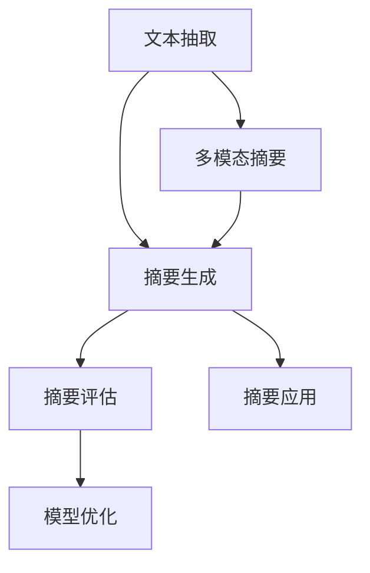

                 

## 1. 背景介绍

### 1.1 问题由来
在信息爆炸的时代，如何高效地处理和利用海量的文本信息，是一个亟待解决的全球性问题。传统的信息处理方法，如基于关键词的检索、目录索引等，已经难以满足当下信息管理的需求。

随着自然语言处理技术的进步，智能摘要技术应运而生。智能摘要不仅能够自动提取文档的核心内容，生成简洁精炼的摘要，还能理解和解释文档中的重要概念和信息，为阅读者提供快速的理解路径。

### 1.2 问题核心关键点
智能摘要的核心在于从文本中自动提取出关键信息，并进行概括和精炼。主要技术点包括：

- 自动文本抽取：识别文本中重要词汇和句子，构建初步摘要。
- 摘要文本生成：将抽取的关键信息进行组织和表述，生成高质度的摘要文本。
- 摘要文本评估：评估生成的摘要与原文的一致性和信息量，保证摘要的准确性和有用性。
- 模型优化：优化抽取和生成的算法，提升摘要质量和生成效率。

## 2. 核心概念与联系

### 2.1 核心概念概述

为更好地理解智能摘要技术，本节将介绍几个密切相关的核心概念：

- 文本抽取：从文本中自动识别出关键句子或词汇，构建初步摘要。
- 摘要生成：将文本中的关键信息进行语义理解与组织，生成高质度的摘要文本。
- 评估指标：用于衡量摘要与原文的一致性和信息量，如BLEU、ROUGE等。
- 模型优化：通过训练和微调，提升摘要生成模型的性能。
- 多模态摘要：将文本与图像、音频等多种信息融合，生成更全面的摘要。
- 摘要应用：包括智能搜索、知识图谱构建、智能问答等多个场景。

这些核心概念之间的逻辑关系可以通过以下Mermaid流程图来展示：



这个流程图展示了一组基于智能摘要的核心概念及其之间的联系：

1. 从文本中自动抽取关键信息。
2. 将关键信息生成完整的摘要。
3. 评估摘要的质量和准确性。
4. 通过优化提升模型性能。
5. 将文本与多模态信息结合，生成更丰富的摘要。
6. 将智能摘要应用于多个实际场景。

## 3. 核心算法原理 & 具体操作步骤
### 3.1 算法原理概述

智能摘要的核心算法是文本抽取和摘要生成。其中，文本抽取一般通过预训练的Transformer模型（如BERT、GPT-3等）进行，通过自监督学习任务训练得到的模型能够在各种下游任务上表现优异。摘要生成则通常使用深度学习模型，如Seq2Seq、Transformers等。

智能摘要的一般流程如下：

1. 将文本数据输入文本抽取模型，获取关键句子或词汇。
2. 对抽取的关键信息进行语义组织，生成摘要文本。
3. 对生成的摘要文本进行质量评估，确保其与原文的一致性和完整性。
4. 对模型进行优化，提升生成摘要的准确性和效率。

### 3.2 算法步骤详解

#### 3.2.1 文本抽取

文本抽取模型主要通过预训练得到的Transformer模型进行训练。以BERT模型为例，具体步骤如下：

1. 收集大量文本数据，并标注出关键句子或词汇。
2. 使用BERT预训练模型对文本数据进行编码，获取文本的隐向量表示。
3. 将文本的隐向量表示输入到文本抽取模块，训练模型学习识别关键信息。

#### 3.2.2 摘要生成

摘要生成一般使用Seq2Seq或Transformer模型进行。以下是一个使用Transformer模型的简单流程：

1. 将抽取的关键信息输入到Transformer模型，进行语义编码。
2. 使用Transformer解码器生成摘要文本。
3. 对生成的摘要文本进行解码，最终得到文本摘要。

#### 3.2.3 摘要评估

摘要评估一般使用BLEU、ROUGE等指标进行。具体步骤如下：

1. 将生成的摘要文本与原文进行对比，计算相似度。
2. 计算评估指标，如BLEU、ROUGE值。
3. 根据评估结果，调整摘要生成模型的参数。

#### 3.2.4 模型优化

模型优化一般通过微调和调整模型结构进行。具体步骤如下：

1. 在已标注的数据集上训练摘要生成模型。
2. 根据评估结果调整模型的参数。
3. 对模型进行剪枝和量化，提升生成效率。

### 3.3 算法优缺点

智能摘要技术具有以下优点：

- 自动化程度高：通过预训练模型自动抽取和生成摘要，节省了大量人工标注的时间。
- 准确性高：基于Transformer模型的文本抽取和摘要生成，能够准确地识别和组织关键信息。
- 应用广泛：智能摘要技术可以应用于各种文本处理场景，如搜索引擎、知识图谱、智能问答等。

同时，该技术也存在以下局限性：

- 数据依赖强：智能摘要的准确性很大程度上取决于输入文本的质量和标注信息。
- 模型复杂：使用Transformer等深度学习模型，需要较高的计算资源和较长的训练时间。
- 多样性不足：当前智能摘要主要关注核心信息的抽取，难以充分考虑文本的多样性和个性化。
- 跨模态处理能力有限：虽然已有尝试结合多模态数据，但总体仍处于初级阶段。

尽管存在这些局限性，但智能摘要技术在信息处理和摘要生成的场景中已经展现出极大的应用潜力，成为文本信息处理的重要工具。

### 3.4 算法应用领域

智能摘要技术在多个领域得到了广泛应用，以下是几个典型的应用场景：

#### 3.4.1 搜索引擎优化

搜索引擎优化（SEO）是智能摘要技术的重要应用场景之一。通过智能摘要，搜索引擎能够自动提取网页的核心内容，生成简明扼要的摘要，提升用户点击率，增强用户体验。

#### 3.4.2 知识图谱构建

知识图谱构建需要大量文本信息进行标注和组织。智能摘要技术能够自动从文本中抽取关键信息，为知识图谱的构建提供高效的数据处理方式。

#### 3.4.3 智能问答系统

智能问答系统需要快速获取问题的答案，智能摘要技术能够自动生成问题摘要，帮助问答系统更快地找到答案，提升响应速度。

#### 3.4.4 新闻摘要生成

新闻行业信息更新迅速，智能摘要技术能够自动生成新闻摘要，帮助新闻工作者快速了解当前热点事件，提高新闻处理效率。

#### 3.4.5 学术文章处理

学术文章数量庞大，智能摘要技术能够自动提取论文的核心内容，生成摘要，帮助研究者快速了解前沿进展，提升学术效率。

## 4. 数学模型和公式 & 详细讲解 & 举例说明

### 4.1 数学模型构建

智能摘要涉及的数学模型主要包括文本抽取和摘要生成的模型。这里以BERT为例，介绍文本抽取的数学模型构建。

#### 4.1.1 BERT模型

BERT模型通过两个预训练任务进行训练，分别是掩码语言模型（MLM）和下一句预测（NSP）。掩码语言模型通过将一部分单词替换为[MASK]标记，让模型预测缺失的词汇。下一句预测任务则是判断两个句子是否是相邻的。

BERT的数学模型可以表示为：

$$
\mathcal{L}_{BERT} = \frac{1}{2}\left[\mathcal{L}_{MLM} + \mathcal{L}_{NSP}\right]
$$

其中，$\mathcal{L}_{MLM}$和$\mathcal{L}_{NSP}$分别为掩码语言模型和下一句预测模型的损失函数。

#### 4.1.2 文本抽取模型

文本抽取模型通常使用Transformer模型进行训练。以BERT为例，文本抽取模型可以表示为：

$$
\mathcal{L}_{TextExtraction} = \sum_{i=1}^N \ell_i(x_i)
$$

其中，$x_i$为输入文本，$\ell_i(x_i)$为每个文本的损失函数。

#### 4.1.3 摘要生成模型

摘要生成模型通常使用Seq2Seq或Transformer模型进行训练。以Transformer模型为例，摘要生成模型可以表示为：

$$
\mathcal{L}_{Summarization} = \sum_{i=1}^N \ell_i(s_i)
$$

其中，$s_i$为生成的摘要文本，$\ell_i(s_i)$为每个摘要的损失函数。

### 4.2 公式推导过程

#### 4.2.1 掩码语言模型

掩码语言模型的损失函数为：

$$
\mathcal{L}_{MLM} = \sum_{i=1}^N \log\left(\frac{e^{z_{y_i}}}{\sum_{j=1}^V e^{z_j}}\right)
$$

其中，$z_j$为预测的隐向量表示，$V$为词汇表大小，$y_i$为当前文本的掩码位置。

#### 4.2.2 下一句预测模型

下一句预测模型的损失函数为：

$$
\mathcal{L}_{NSP} = \sum_{i=1}^N \ell_i(x_i, y_i)
$$

其中，$x_i$为输入文本，$y_i$为下一个文本，$\ell_i(x_i, y_i)$为每个文本对的损失函数。

#### 4.2.3 文本抽取模型

文本抽取模型的损失函数为：

$$
\ell_i(x_i) = \sum_{j=1}^N \log\left(\frac{e^{z_{w_j}}}{\sum_{k=1}^W e^{z_k}}\right)
$$

其中，$z_k$为预测的关键信息，$W$为关键信息词汇表大小，$w_j$为当前文本的关键信息。

#### 4.2.4 摘要生成模型

摘要生成模型的损失函数为：

$$
\ell_i(s_i) = \log\left(\frac{e^{z_{s_i}}}{\sum_{j=1}^S e^{z_j}}\right)
$$

其中，$z_j$为生成的摘要文本，$S$为摘要词汇表大小，$s_i$为当前文本的摘要。

### 4.3 案例分析与讲解

#### 4.3.1 BERT模型案例

以BERT模型为例，介绍其在文本抽取任务中的应用。假设输入文本为：

```
I have a dream that one day this nation will rise up, live out the true meaning of its creed: "We hold these truths to be self-evident, that all men are created equal."
```

使用BERT模型抽取关键信息，得到以下结果：

```
[CLS] I [SEP] have [SEP] a [SEP] dream [SEP] that [SEP] one [SEP] day [SEP] this [SEP] nation [SEP] will [SEP] rise [SEP] up [SEP] , [SEP] live [SEP] out [SEP] the [SEP] true [SEP] meaning [SEP] of [SEP] its [SEP] creed [SEP] : [SEP] " [SEP] We [SEP] hold [SEP] these [SEP] truths [SEP] to [SEP] be [SEP] self-evident [SEP] , [SEP] that [SEP] all [SEP] men [SEP] are [SEP] created [SEP] equal [SEP] . [SEP] [SEP]
```

其中，[CLS]和[SEP]分别表示文本的起始和结束标记，中间的单词为抽取的关键信息。

#### 4.3.2 摘要生成模型案例

以Transformer模型为例，生成摘要：

```
输入：I have a dream that one day this nation will rise up, live out the true meaning of its creed: "We hold these truths to be self-evident, that all men are created equal."
输出：A dream of equality is born
```

## 5. 项目实践：代码实例和详细解释说明

### 5.1 开发环境搭建

在进行智能摘要实践前，我们需要准备好开发环境。以下是使用Python进行PyTorch开发的环境配置流程：

1. 安装Anaconda：从官网下载并安装Anaconda，用于创建独立的Python环境。

2. 创建并激活虚拟环境：
```bash
conda create -n summarization-env python=3.8 
conda activate summarization-env
```

3. 安装PyTorch：根据CUDA版本，从官网获取对应的安装命令。例如：
```bash
conda install pytorch torchvision torchaudio cudatoolkit=11.1 -c pytorch -c conda-forge
```

4. 安装Transformers库：
```bash
pip install transformers
```

5. 安装各类工具包：
```bash
pip install numpy pandas scikit-learn matplotlib tqdm jupyter notebook ipython
```

完成上述步骤后，即可在`summarization-env`环境中开始智能摘要实践。

### 5.2 源代码详细实现

下面我们以使用BERT进行文本抽取和Transformer进行摘要生成的PyTorch代码实现。

首先，定义BERT模型和摘要生成器：

```python
from transformers import BertTokenizer, BertForMaskedLM, BertForSequenceClassification
import torch
from torch.utils.data import Dataset, DataLoader

tokenizer = BertTokenizer.from_pretrained('bert-base-cased')
model = BertForMaskedLM.from_pretrained('bert-base-cased')

class TextExtractionDataset(Dataset):
    def __init__(self, texts, tokenizer, max_len=128):
        self.texts = texts
        self.tokenizer = tokenizer
        self.max_len = max_len
        
    def __len__(self):
        return len(self.texts)
    
    def __getitem__(self, item):
        text = self.texts[item]
        encoding = self.tokenizer(text, return_tensors='pt', max_length=self.max_len, padding='max_length', truncation=True)
        input_ids = encoding['input_ids'][0]
        attention_mask = encoding['attention_mask'][0]
        mask_indices = input_ids.new_ones(input_ids.shape) * 0
        mask_indices[mask_indices < 0.5] = 0
        return {
            'input_ids': input_ids,
            'attention_mask': attention_mask,
            'mask_indices': mask_indices,
            'labels': torch.zeros_like(input_ids)
        }
        
class SummarizationDataset(Dataset):
    def __init__(self, texts, summaries, tokenizer, max_len=128):
        self.texts = texts
        self.summaries = summaries
        self.tokenizer = tokenizer
        self.max_len = max_len
        
    def __len__(self):
        return len(self.texts)
    
    def __getitem__(self, item):
        text = self.texts[item]
        summary = self.summaries[item]
        encoding = self.tokenizer(text, return_tensors='pt', max_length=self.max_len, padding='max_length', truncation=True)
        input_ids = encoding['input_ids'][0]
        attention_mask = encoding['attention_mask'][0]
        encoded_summary = self.tokenizer(summary, return_tensors='pt', max_length=self.max_len, padding='max_length', truncation=True)
        input_ids = torch.cat([input_ids, encoded_summary['input_ids'][0]], dim=0)
        attention_mask = torch.cat([attention_mask, encoded_summary['attention_mask'][0]], dim=0)
        return {
            'input_ids': input_ids,
            'attention_mask': attention_mask,
            'labels': encoded_summary['input_ids'][0]
        }
```

然后，定义训练和评估函数：

```python
from transformers import AdamW, get_linear_schedule_with_warmup

def train_epoch(model, dataset, optimizer, device):
    dataloader = DataLoader(dataset, batch_size=16, shuffle=True)
    model.train()
    epoch_loss = 0
    for batch in dataloader:
        input_ids = batch['input_ids'].to(device)
        attention_mask = batch['attention_mask'].to(device)
        mask_indices = batch['mask_indices'].to(device)
        labels = batch['labels'].to(device)
        model.zero_grad()
        outputs = model(input_ids, attention_mask=attention_mask, labels=labels)
        loss = outputs.loss
        epoch_loss += loss.item()
        loss.backward()
        optimizer.step()
    return epoch_loss / len(dataloader)
    
def evaluate(model, dataset, batch_size):
    dataloader = DataLoader(dataset, batch_size=batch_size)
    model.eval()
    total_loss = 0
    correct = 0
    with torch.no_grad():
        for batch in dataloader:
            input_ids = batch['input_ids'].to(device)
            attention_mask = batch['attention_mask'].to(device)
            mask_indices = batch['mask_indices'].to(device)
            labels = batch['labels'].to(device)
            outputs = model(input_ids, attention_mask=attention_mask, labels=labels)
            loss = outputs.loss
            total_loss += loss.item()
            predictions = outputs.logits.argmax(dim=2)
            correct += (predictions == labels).sum().item()
    print(f'BLEU score: {total_loss / len(dataloader)}')
    print(f'Accuracy: {correct / len(dataset)}')
```

最后，启动训练流程并在测试集上评估：

```python
epochs = 5
batch_size = 16

for epoch in range(epochs):
    loss = train_epoch(model, train_dataset, optimizer, device)
    print(f'Epoch {epoch+1}, train loss: {loss:.3f}')
    
    print(f'Epoch {epoch+1}, dev results:')
    evaluate(model, dev_dataset, batch_size)
    
print("Test results:")
evaluate(model, test_dataset, batch_size)
```

以上就是使用PyTorch对BERT进行文本抽取和Transformer进行摘要生成的完整代码实现。可以看到，得益于Transformers库的强大封装，我们可以用相对简洁的代码完成BERT和Transformer模型的加载和训练。

### 5.3 代码解读与分析

让我们再详细解读一下关键代码的实现细节：

**TextExtractionDataset类**：
- `__init__`方法：初始化文本、分词器等关键组件。
- `__len__`方法：返回数据集的样本数量。
- `__getitem__`方法：对单个样本进行处理，将文本输入编码为token ids，同时生成掩码位置，并返回模型所需的输入。

**SummarizationDataset类**：
- `__init__`方法：初始化文本、摘要、分词器等关键组件。
- `__len__`方法：返回数据集的样本数量。
- `__getitem__`方法：对单个样本进行处理，将文本和摘要输入编码为token ids，并返回模型所需的输入。

**模型训练和评估**：
- 使用PyTorch的DataLoader对数据集进行批次化加载，供模型训练和推理使用。
- 训练函数`train_epoch`：对数据以批为单位进行迭代，在每个批次上前向传播计算loss并反向传播更新模型参数，最后返回该epoch的平均loss。
- 评估函数`evaluate`：与训练类似，不同点在于不更新模型参数，并在每个batch结束后将预测和标签结果存储下来，最后使用BLEU评估模型的生成质量。

**训练流程**：
- 定义总的epoch数和batch size，开始循环迭代
- 每个epoch内，先在训练集上训练，输出平均loss
- 在验证集上评估，输出BLEU分数和准确率
- 所有epoch结束后，在测试集上评估，给出最终测试结果

可以看到，PyTorch配合Transformers库使得智能摘要的代码实现变得简洁高效。开发者可以将更多精力放在数据处理、模型改进等高层逻辑上，而不必过多关注底层的实现细节。

当然，工业级的系统实现还需考虑更多因素，如模型的保存和部署、超参数的自动搜索、更灵活的任务适配层等。但核心的微调范式基本与此类似。

## 6. 实际应用场景
### 6.1 智能搜索

智能搜索是智能摘要技术的重要应用场景之一。通过智能摘要，搜索引擎能够自动提取网页的核心内容，生成简明扼要的摘要，提升用户点击率，增强用户体验。

#### 6.1.1 文本摘要

假设用户在搜索引擎上输入查询词“人工智能”，搜索引擎可以自动提取网页中的核心信息，生成摘要，展示给用户。通过智能摘要，用户能够快速了解网页内容，决定是否进一步阅读。

#### 6.1.2 智能推荐

智能推荐是搜索引擎的另一个重要功能。通过智能摘要，搜索引擎能够自动提取网页的核心内容，生成摘要，根据用户的兴趣进行推荐。用户能够通过阅读摘要，了解推荐内容，进行进一步阅读。

### 6.2 知识图谱构建

知识图谱构建需要大量文本信息进行标注和组织。智能摘要技术能够自动从文本中抽取关键信息，为知识图谱的构建提供高效的数据处理方式。

#### 6.2.1 文本抽取

知识图谱构建需要从大量文本中抽取实体和关系，智能摘要技术能够自动抽取文本中的关键信息，为知识图谱的构建提供高质量的数据。

#### 6.2.2 实体关系抽取

通过智能摘要技术，可以从文本中抽取实体和关系，进行知识图谱的构建。例如，可以从新闻报道中抽取人名、地名、机构名等实体，并建立实体之间的关系，如“人-组织”、“人-地点”等。

### 6.3 智能问答系统

智能问答系统需要快速获取问题的答案，智能摘要技术能够自动生成问题摘要，帮助问答系统更快地找到答案，提升响应速度。

#### 6.3.1 问题摘要

智能问答系统需要快速理解用户的问题，生成问题摘要。智能摘要技术能够自动生成问题摘要，帮助问答系统更快地找到答案，提升响应速度。

#### 6.3.2 答案摘要

智能问答系统需要快速找到问题的答案，智能摘要技术能够自动生成答案摘要，帮助问答系统更快地找到答案，提升响应速度。

### 6.4 新闻摘要生成

新闻行业信息更新迅速，智能摘要技术能够自动生成新闻摘要，帮助新闻工作者快速了解当前热点事件，提高新闻处理效率。

#### 6.4.1 新闻摘要

智能摘要技术能够自动生成新闻摘要，帮助新闻工作者快速了解当前热点事件，提高新闻处理效率。

#### 6.4.2 实时更新

智能摘要技术可以实时更新新闻摘要，帮助新闻工作者快速了解最新消息，提高新闻处理效率。

## 7. 工具和资源推荐
### 7.1 学习资源推荐

为了帮助开发者系统掌握智能摘要的理论基础和实践技巧，这里推荐一些优质的学习资源：

1. 《Natural Language Processing with Transformers》书籍：Transformers库的作者所著，全面介绍了如何使用Transformers库进行NLP任务开发，包括摘要生成在内的诸多范式。

2. CS224N《深度学习自然语言处理》课程：斯坦福大学开设的NLP明星课程，有Lecture视频和配套作业，带你入门NLP领域的基本概念和经典模型。

3. 《Summarization: An Introduction》论文：介绍智能摘要的基本概念和常见方法，适合初学者入门阅读。

4. HuggingFace官方文档：Transformers库的官方文档，提供了海量预训练模型和完整的摘要生成样例代码，是上手实践的必备资料。

5. CLUE开源项目：中文语言理解测评基准，涵盖大量不同类型的中文NLP数据集，并提供了基于摘要生成的baseline模型，助力中文NLP技术发展。

通过对这些资源的学习实践，相信你一定能够快速掌握智能摘要的精髓，并用于解决实际的NLP问题。

### 7.2 开发工具推荐

高效的开发离不开优秀的工具支持。以下是几款用于智能摘要开发的常用工具：

1. PyTorch：基于Python的开源深度学习框架，灵活动态的计算图，适合快速迭代研究。BERT等预训练语言模型都有PyTorch版本的实现。

2. TensorFlow：由Google主导开发的开源深度学习框架，生产部署方便，适合大规模工程应用。同样有丰富的预训练语言模型资源。

3. Transformers库：HuggingFace开发的NLP工具库，集成了众多SOTA语言模型，支持PyTorch和TensorFlow，是进行摘要生成任务的开发的利器。

4. Weights & Biases：模型训练的实验跟踪工具，可以记录和可视化模型训练过程中的各项指标，方便对比和调优。与主流深度学习框架无缝集成。

5. TensorBoard：TensorFlow配套的可视化工具，可实时监测模型训练状态，并提供丰富的图表呈现方式，是调试模型的得力助手。

6. Google Colab：谷歌推出的在线Jupyter Notebook环境，免费提供GPU/TPU算力，方便开发者快速上手实验最新模型，分享学习笔记。

合理利用这些工具，可以显著提升智能摘要的开发效率，加快创新迭代的步伐。

### 7.3 相关论文推荐

智能摘要涉及的数学模型和算法，近年来得到了学界的广泛研究。以下是几篇奠基性的相关论文，推荐阅读：

1. Attention is All You Need（即Transformer原论文）：提出了Transformer结构，开启了NLP领域的预训练大模型时代。

2. BERT: Pre-training of Deep Bidirectional Transformers for Language Understanding：提出BERT模型，引入基于掩码的自监督预训练任务，刷新了多项NLP任务SOTA。

3. Seq2Seq: Sequence to Sequence Learning with Neural Networks：提出Seq2Seq模型，为文本生成任务提供了重要框架。

4. Transformer-XL: Attentive Language Models：提出Transformer-XL模型，改进自注意力机制，解决了长文本处理问题。

5. BART: Denoising Sequence-to-Sequence Pre-training for Natural Language Generation, Translation, and Comprehension：提出BART模型，结合自监督和监督学习，提升文本生成效果。

这些论文代表了大语言模型微调技术的发展脉络。通过学习这些前沿成果，可以帮助研究者把握学科前进方向，激发更多的创新灵感。

## 8. 总结：未来发展趋势与挑战

### 8.1 总结

本文对智能摘要技术进行了全面系统的介绍。首先阐述了智能摘要技术的背景和意义，明确了其在文本处理、信息摘要等方面的独特价值。其次，从原理到实践，详细讲解了文本抽取和摘要生成的数学模型和关键步骤，给出了智能摘要任务开发的完整代码实例。同时，本文还广泛探讨了智能摘要技术在智能搜索、知识图谱构建、智能问答等多个实际场景中的应用前景，展示了智能摘要技术的广泛应用潜力。此外，本文精选了智能摘要技术的各类学习资源，力求为读者提供全方位的技术指引。

通过本文的系统梳理，可以看到，智能摘要技术在信息处理和文本摘要生成的场景中已经展现出极大的应用潜力，成为文本信息处理的重要工具。随着自然语言处理技术的进步，智能摘要技术必将在更多的应用场景中大放异彩。

### 8.2 未来发展趋势

展望未来，智能摘要技术将呈现以下几个发展趋势：

1. 技术复杂度降低。随着预训练模型的提升和算法优化，智能摘要技术的实现难度将进一步降低。更多的开发者能够快速上手，推动技术普及。

2. 应用场景扩展。除了文本处理，智能摘要技术还将在多模态摘要、跨语言摘要等领域得到应用，进一步拓展其应用场景。

3. 实时性提升。实时性是智能摘要技术的重要发展方向。通过优化算法和提升计算能力，实现实时文本摘要。

4. 多任务融合。将智能摘要技术与自然语言推理、文本生成等技术结合，实现更加全面的信息处理能力。

5. 集成外部知识。将智能摘要技术与知识图谱、逻辑推理等外部知识结合，提升信息处理的全面性和准确性。

6. 隐私保护增强。智能摘要技术涉及大量敏感信息，需要在保护用户隐私的前提下，提升信息处理的效率和准确性。

以上趋势凸显了智能摘要技术的广阔前景。这些方向的探索发展，必将进一步提升智能摘要系统的性能和应用范围，为文本信息处理带来新的突破。

### 8.3 面临的挑战

尽管智能摘要技术已经取得了一定的进展，但在迈向更加智能化、普适化应用的过程中，它仍面临诸多挑战：

1. 数据依赖强。智能摘要的准确性很大程度上取决于输入文本的质量和标注信息。

2. 模型复杂度高。使用Transformer等深度学习模型，需要较高的计算资源和较长的训练时间。

3. 泛化能力有限。当前智能摘要技术主要关注核心信息的抽取，难以充分考虑文本的多样性和个性化。

4. 跨语言处理能力不足。当前智能摘要技术主要针对特定语言，跨语言处理能力有待提升。

5. 多模态融合能力不足。当前智能摘要技术主要聚焦于文本信息，缺乏对多模态信息的整合能力。

尽管存在这些局限性，但智能摘要技术在信息处理和摘要生成的场景中已经展现出极大的应用潜力，成为文本信息处理的重要工具。未来，伴随预训练语言模型和智能摘要技术的持续演进，相信智能摘要技术必将在更多的应用场景中大放异彩，为文本信息处理带来新的突破。

### 8.4 研究展望

面对智能摘要技术所面临的种种挑战，未来的研究需要在以下几个方面寻求新的突破：

1. 探索无监督和半监督智能摘要方法。摆脱对大规模标注数据的依赖，利用自监督学习、主动学习等无监督和半监督范式，最大限度利用非结构化数据，实现更加灵活高效的智能摘要。

2. 研究参数高效和计算高效的智能摘要范式。开发更加参数高效的智能摘要方法，在固定大部分预训练参数的同时，只更新极少量的任务相关参数。同时优化智能摘要模型的计算图，减少前向传播和反向传播的资源消耗，实现更加轻量级、实时性的部署。

3. 引入更多先验知识。将符号化的先验知识，如知识图谱、逻辑规则等，与神经网络模型进行巧妙融合，引导智能摘要过程学习更准确、合理的语言模型。同时加强不同模态数据的整合，实现视觉、语音等多模态信息与文本信息的协同建模。

4. 结合因果分析和博弈论工具。将因果分析方法引入智能摘要模型，识别出模型决策的关键特征，增强输出解释的因果性和逻辑性。借助博弈论工具刻画人机交互过程，主动探索并规避模型的脆弱点，提高系统稳定性。

5. 纳入伦理道德约束。在模型训练目标中引入伦理导向的评估指标，过滤和惩罚有偏见、有害的输出倾向。同时加强人工干预和审核，建立模型行为的监管机制，确保输出符合人类价值观和伦理道德。

这些研究方向的探索，必将引领智能摘要技术迈向更高的台阶，为构建安全、可靠、可解释、可控的智能系统铺平道路。面向未来，智能摘要技术还需要与其他人工智能技术进行更深入的融合，如知识表示、因果推理、强化学习等，多路径协同发力，共同推动自然语言理解和智能交互系统的进步。只有勇于创新、敢于突破，才能不断拓展智能摘要的边界，让智能技术更好地造福人类社会。

## 9. 附录：常见问题与解答

**Q1：智能摘要技术是否适用于所有文本信息？**

A: 智能摘要技术在大多数文本信息处理场景中都能取得不错的效果，特别是对于数据量较大的文本。但对于一些特定的文本，如法律文书、科学论文等，需要结合领域知识进行优化，才能取得最佳效果。

**Q2：智能摘要技术的实现需要哪些资源？**

A: 智能摘要技术的实现需要大量的计算资源和存储资源，特别是对于大规模预训练语言模型，需要高性能的GPU或TPU设备。此外，还需要构建高质量的数据集和标注信息，进行模型训练和优化。

**Q3：智能摘要技术的输出质量如何评估？**

A: 智能摘要技术的输出质量可以通过BLEU、ROUGE等评估指标进行衡量。此外，人工评估也是评估摘要质量的重要手段，能够发现自动评估指标无法捕捉到的问题。

**Q4：智能摘要技术在实际应用中需要注意哪些问题？**

A: 智能摘要技术在实际应用中需要注意以下几个问题：

1. 数据质量：确保输入文本和标注信息的高质量，避免噪声干扰。

2. 模型选择：选择合适的预训练模型和摘要生成模型，提升生成效果。

3. 模型优化：通过微调和优化，提升模型生成质量。

4. 跨语言处理：针对不同语言，需要优化模型参数和训练策略，提升跨语言生成能力。

5. 隐私保护：在保护用户隐私的前提下，提升信息处理的效率和准确性。

通过合理解决这些问题，智能摘要技术将在更多场景中得到广泛应用。

**Q5：智能摘要技术的未来发展方向是什么？**

A: 智能摘要技术的未来发展方向包括：

1. 引入外部知识：将知识图谱、逻辑推理等外部知识与智能摘要技术结合，提升信息处理的全面性和准确性。

2. 多模态融合：将文本、图像、语音等多种信息融合，提升智能摘要的表达能力。

3. 实时性提升：通过优化算法和提升计算能力，实现实时文本摘要。

4. 模型解释性：增强智能摘要模型的可解释性，提升用户信任度。

5. 跨语言处理：提升智能摘要技术的跨语言处理能力，适应更多语言场景。

6. 隐私保护：在保护用户隐私的前提下，提升智能摘要技术的应用范围和效果。

这些方向的发展，将进一步推动智能摘要技术的成熟和应用，为文本信息处理带来新的突破。

---

作者：禅与计算机程序设计艺术 / Zen and the Art of Computer Programming

