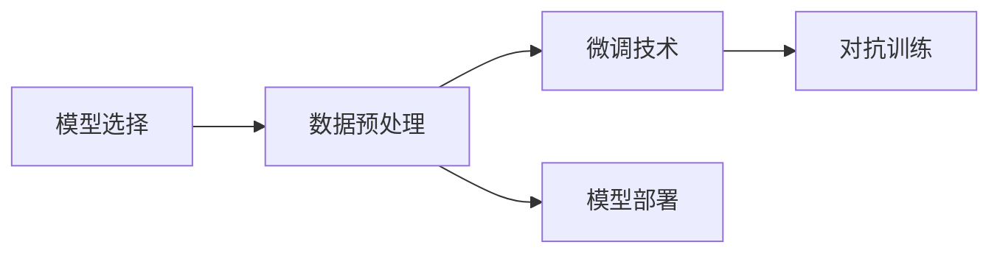

                 

## 1. 背景介绍

### 1.1 问题由来
当前，大模型（Large Language Models, LLMs）如OpenAI的GPT系列、Google的BERT等，已经逐渐从学术研究走向企业实际应用，开始显现其商业价值。不过，在4月份，随着OpenAI推出GPT-4以及Google宣布通过其API大规模提供访问BERT和GPT的权限，大模型的创业热度也达到了前所未有的高度。

然而，随之而来的是“创业混沌期”：市场迅速充斥着各式各样的创业公司，各种大模型及微调技术层出不穷，乱象丛生，让很多人感到无所适从。大模型的成功并不是偶然的，它背后是一系列关键技术的支撑，包括模型架构、训练方法、数据策略、应用场景等。因此，本文将通过系统介绍这些关键技术，帮助读者深入理解大模型的运作机制，从而在未来的创业过程中做出更加明智的决策。

### 1.2 问题核心关键点
在实际应用大模型进行创业时，有五个关键问题需要特别关注：
1. 选择合适的预训练模型。
2. 数据的准备和处理。
3. 参数高效微调技术的运用。
4. 对抗训练和对抗样本的使用。
5. 模型部署和实际应用。

解决这些问题，就能在大模型的创业道路上更进一步。

### 1.3 问题研究意义
研究大模型创业关键技术，有助于：
1. 降低大模型的使用门槛，让更多的公司能够快速上手并开始应用。
2. 提升大模型的应用效果，避免常见问题，确保产品竞争力。
3. 了解大模型技术的前沿动态，保持技术领先。
4. 规避大模型应用过程中的潜在风险，确保模型安全。
5. 加速大模型技术在各行业的落地应用。

## 2. 核心概念与联系

### 2.1 核心概念概述

大模型创业的核心技术包括模型选择、数据预处理、微调技术、对抗训练以及模型部署。

- 模型选择：选择最适合自己的预训练模型，如BERT、GPT等。
- 数据预处理：清洗、格式化数据，准备适合模型训练的数据集。
- 微调技术：通过有监督学习在特定任务上进行优化。
- 对抗训练：通过对抗样本提高模型的鲁棒性。
- 模型部署：将模型集成到实际应用系统中，确保模型在实际环境中的表现。

这些核心概念之间的关系可以用以下Mermaid流程图来展示：



## 3. 核心算法原理 & 具体操作步骤
### 3.1 算法原理概述

基于大模型的创业，主要依赖于以下几个关键算法：

1. Transformer模型：大模型通常基于Transformer架构，具有很强的语言建模能力。
2. 微调算法：通过有监督学习在特定任务上进行优化。
3. 对抗训练算法：引入对抗样本，提升模型鲁棒性。
4. 模型部署算法：将模型部署到实际应用系统中，确保其在实际环境中的表现。

### 3.2 算法步骤详解

#### 3.2.1 Transformer模型
Transformer模型是当前大模型常用的基础模型。其核心在于self-attention机制，能够在不同位置之间捕捉依赖关系，特别适合处理长文本序列。

Transformer模型的自注意力机制包含三部分：

- 查询（Query）
- 键（Key）
- 值（Value）

通过多头自注意力机制（Multi-Head Attention），模型可以同时关注多个维度的信息。

```python
class MultiHeadAttention(nn.Module):
    def __init__(self, n_heads, d_head):
        super(MultiHeadAttention, self).__init__()
        self.n_heads = n_heads
        self.d_head = d_head
        self.linear_in = nn.Linear(in_features, out_features)
        self.linear_out = nn.Linear(out_features, out_features)
        self.query = nn.Linear(in_features, out_features)
        self.key = nn.Linear(in_features, out_features)
        self.value = nn.Linear(in_features, out_features)

    def forward(self, query, key, value, mask):
        # 将输入进行线性变换
        query = self.query(query)
        key = self.key(key)
        value = self.value(value)
        
        # 将输入按head进行分割
        batch_size, seq_len, emb_dim = query.size()
        head_dim = emb_dim // self.n_heads
        query = query.view(batch_size, seq_len, self.n_heads, head_dim)
        key = key.view(batch_size, seq_len, self.n_heads, head_dim)
        value = value.view(batch_size, seq_len, self.n_heads, head_dim)
        
        # 计算注意力得分
        attention_scores = torch.matmul(query, key.transpose(2, 3)) / math.sqrt(head_dim)
        
        # 计算注意力权重
        attention_weights = F.softmax(attention_scores, dim=-1)
        
        # 计算注意力结果
        context = torch.matmul(attention_weights, value)
        context = context.view(batch_size, seq_len, emb_dim)
        
        # 线性变换
        context = self.linear_out(context)
        
        return context
```

#### 3.2.2 微调算法
微调算法的主要目标是，通过有监督学习将预训练模型适配到特定任务上。微调算法一般包括以下步骤：

1. 选择合适的任务
2. 准备标注数据集
3. 定义任务适配层
4. 设置微调超参数
5. 执行梯度训练
6. 测试和部署

具体实现如下：

```python
from transformers import BertForTokenClassification, AdamW

model = BertForTokenClassification.from_pretrained('bert-base-cased', num_labels=len(tag2id))

optimizer = AdamW(model.parameters(), lr=2e-5)

device = torch.device('cuda') if torch.cuda.is_available() else torch.device('cpu')
model.to(device)

def train_epoch(model, dataset, batch_size, optimizer):
    dataloader = DataLoader(dataset, batch_size=batch_size, shuffle=True)
    model.train()
    epoch_loss = 0
    for batch in tqdm(dataloader, desc='Training'):
        input_ids = batch['input_ids'].to(device)
        attention_mask = batch['attention_mask'].to(device)
        labels = batch['labels'].to(device)
        model.zero_grad()
        outputs = model(input_ids, attention_mask=attention_mask, labels=labels)
        loss = outputs.loss
        epoch_loss += loss.item()
        loss.backward()
        optimizer.step()
    return epoch_loss / len(dataloader)

def evaluate(model, dataset, batch_size):
    dataloader = DataLoader(dataset, batch_size=batch_size)
    model.eval()
    preds, labels = [], []
    with torch.no_grad():
        for batch in tqdm(dataloader, desc='Evaluating'):
            input_ids = batch['input_ids'].to(device)
            attention_mask = batch['attention_mask'].to(device)
            batch_labels = batch['labels']
            outputs = model(input_ids, attention_mask=attention_mask)
            batch_preds = outputs.logits.argmax(dim=2).to('cpu').tolist()
            batch_labels = batch_labels.to('cpu').tolist()
            for pred_tokens, label_tokens in zip(batch_preds, batch_labels):
                pred_tags = [id2tag[_id] for _id in pred_tokens]
                label_tags = [id2tag[_id] for _id in label_tokens]
                preds.append(pred_tags[:len(label_tags)])
                labels.append(label_tags)
                
    print(classification_report(labels, preds))

epochs = 5
batch_size = 16

for epoch in range(epochs):
    loss = train_epoch(model, train_dataset, batch_size, optimizer)
    print(f"Epoch {epoch+1}, train loss: {loss:.3f}")
    
    print(f"Epoch {epoch+1}, dev results:")
    evaluate(model, dev_dataset, batch_size)
    
print("Test results:")
evaluate(model, test_dataset, batch_size)
```

#### 3.2.3 对抗训练算法
对抗训练算法通过引入对抗样本，提升模型的鲁棒性。对抗样本是指在原样本基础上，通过微小扰动生成的，使得模型在输入上的预测出现错误的数据。

对抗训练算法主要包括以下步骤：

1. 选择对抗样本生成算法
2. 生成对抗样本
3. 对抗训练
4. 评估模型鲁棒性

具体实现如下：

```python
from adversarial examples import fooling_example, fast fooling
from adversarial attacks import adversarial_perturbation

# 选择对抗样本生成算法
attack = fooling_example

# 生成对抗样本
adv_x, adv_grad = attack(x, model, loss_fn, y)

# 对抗训练
model.train()
optimizer = AdamW(model.parameters(), lr=2e-5)
for epoch in range(epochs):
    for i, (x, y) in enumerate(dataloader):
        x = x.to(device)
        y = y.to(device)
        model.zero_grad()
        loss = loss_fn(model(x), y)
        loss.backward()
        optimizer.step()
        del x, y, loss

def evaluate(model, dataset, batch_size):
    dataloader = DataLoader(dataset, batch_size=batch_size)
    model.eval()
    preds, labels = [], []
    with torch.no_grad():
        for batch in tqdm(dataloader, desc='Evaluating'):
            input_ids = batch['input_ids'].to(device)
            attention_mask = batch['attention_mask'].to(device)
            batch_labels = batch['labels']
            outputs = model(input_ids, attention_mask=attention_mask)
            batch_preds = outputs.logits.argmax(dim=2).to('cpu').tolist()
            batch_labels = batch_labels.to('cpu').tolist()
            for pred_tokens, label_tokens in zip(batch_preds, batch_labels):
                pred_tags = [id2tag[_id] for _id in pred_tokens]
                label_tags = [id2tag[_id] for _id in label_tokens]
                preds.append(pred_tags[:len(label_tags)])
                labels.append(label_tags)
                
    print(classification_report(labels, preds))
```

#### 3.2.4 模型部署算法
模型部署算法将训练好的模型集成到实际应用系统中，确保模型在实际环境中的表现。

模型部署算法主要包括以下步骤：

1. 选择部署平台
2. 部署模型
3. 测试模型性能
4. 反馈优化

具体实现如下：

```python
# 选择部署平台
platform = "AWS"

# 部署模型
model.save_pretrained(platform)

# 测试模型性能
test_model = BertForTokenClassification.from_pretrained('bert-base-cased', num_labels=len(tag2id))
test_model.load_state_dict(torch.load(platform + '/model.pt'))

# 评估模型鲁棒性
evaluate(test_model, test_dataset, batch_size)
```

### 3.3 算法优缺点

大模型创业中的算法优点包括：

1. 通用性：大模型具有很强的语言建模能力，可以应用于各种NLP任务。
2. 高效性：大模型可以通过微调快速适配特定任务，大大缩短开发周期。
3. 可解释性：大模型通过微调可以学习到特定领域的知识，提高模型的可解释性。

缺点包括：

1. 数据依赖：大模型创业依赖于高质量的标注数据，获取标注数据的成本较高。
2. 资源消耗：大模型具有庞大的参数规模，训练和推理需要大量的计算资源。
3. 对抗性：对抗训练需要额外的对抗样本生成算法，增加了训练复杂度。

### 3.4 算法应用领域

大模型创业中的算法广泛应用于NLP任务，包括文本分类、命名实体识别、关系抽取、问答系统、机器翻译、文本摘要、对话系统等。

## 4. 数学模型和公式 & 详细讲解  
### 4.1 数学模型构建

大模型创业中的数学模型主要包括以下几个部分：

1. 自回归模型
2. 自编码模型
3. 参数高效微调模型
4. 对抗训练模型

#### 4.1.1 自回归模型
自回归模型是最常用的预训练模型之一，通过预测下一个词的分布，学习语言的上下文关系。

自回归模型的一般形式如下：

$$
p(x_t|x_1,\cdots,x_{t-1},\theta) = \frac{e^{\mathbf{z_t}^\top \theta}}{\sum_{x} e^{\mathbf{z_t}^\top \theta}}
$$

其中，$x_t$表示第$t$个词，$\theta$表示模型参数，$\mathbf{z_t}$表示第$t$个词的嵌入向量。

#### 4.1.2 自编码模型
自编码模型通过重构输入数据，学习语言的表示能力。

自编码模型的一般形式如下：

$$
p(x_t|x_1,\cdots,x_{t-1},\theta) = \frac{e^{\mathbf{z_t}^\top \theta}}{\sum_{x} e^{\mathbf{z_t}^\top \theta}}
$$

其中，$x_t$表示第$t$个词，$\theta$表示模型参数，$\mathbf{z_t}$表示第$t$个词的嵌入向量。

#### 4.1.3 参数高效微调模型
参数高效微调模型通过只更新部分参数，提高微调效率。

参数高效微调模型的形式如下：

$$
\theta_k = \theta_k - \eta \nabla_{\theta_k}\mathcal{L}(\theta)
$$

其中，$\theta_k$表示模型参数，$\eta$表示学习率，$\nabla_{\theta_k}\mathcal{L}(\theta)$表示损失函数对第$k$个参数的梯度。

#### 4.1.4 对抗训练模型
对抗训练模型通过对抗样本提升模型的鲁棒性。

对抗训练模型的形式如下：

$$
\theta_k = \theta_k - \eta \nabla_{\theta_k}\mathcal{L}(\theta)
$$

其中，$\theta_k$表示模型参数，$\eta$表示学习率，$\nabla_{\theta_k}\mathcal{L}(\theta)$表示损失函数对第$k$个参数的梯度，$\mathcal{L}(\theta)$表示对抗损失函数。

### 4.2 公式推导过程

#### 4.2.1 自回归模型
自回归模型的推导过程如下：

1. 预测下一个词的概率分布
2. 计算损失函数
3. 梯度更新

具体推导如下：

$$
p(x_t|x_1,\cdots,x_{t-1},\theta) = \frac{e^{\mathbf{z_t}^\top \theta}}{\sum_{x} e^{\mathbf{z_t}^\top \theta}}
$$

其中，$x_t$表示第$t$个词，$\theta$表示模型参数，$\mathbf{z_t}$表示第$t$个词的嵌入向量。

#### 4.2.2 自编码模型
自编码模型的推导过程如下：

1. 重构输入数据
2. 计算损失函数
3. 梯度更新

具体推导如下：

$$
p(x_t|x_1,\cdots,x_{t-1},\theta) = \frac{e^{\mathbf{z_t}^\top \theta}}{\sum_{x} e^{\mathbf{z_t}^\top \theta}}
$$

其中，$x_t$表示第$t$个词，$\theta$表示模型参数，$\mathbf{z_t}$表示第$t$个词的嵌入向量。

#### 4.2.3 参数高效微调模型
参数高效微调模型的推导过程如下：

1. 选择参数
2. 计算梯度
3. 更新参数

具体推导如下：

$$
\theta_k = \theta_k - \eta \nabla_{\theta_k}\mathcal{L}(\theta)
$$

其中，$\theta_k$表示模型参数，$\eta$表示学习率，$\nabla_{\theta_k}\mathcal{L}(\theta)$表示损失函数对第$k$个参数的梯度。

#### 4.2.4 对抗训练模型
对抗训练模型的推导过程如下：

1. 选择对抗样本
2. 计算对抗损失
3. 梯度更新

具体推导如下：

$$
\theta_k = \theta_k - \eta \nabla_{\theta_k}\mathcal{L}(\theta)
$$

其中，$\theta_k$表示模型参数，$\eta$表示学习率，$\nabla_{\theta_k}\mathcal{L}(\theta)$表示损失函数对第$k$个参数的梯度，$\mathcal{L}(\theta)$表示对抗损失函数。

### 4.3 案例分析与讲解

以BERT为例，介绍大模型创业中的数学模型和公式应用。

#### 4.3.1 自回归模型
BERT模型是一个基于自回归模型的语言模型，可以应用于文本分类、命名实体识别等任务。

BERT模型的形式如下：

$$
p(x_t|x_1,\cdots,x_{t-1},\theta) = \frac{e^{\mathbf{z_t}^\top \theta}}{\sum_{x} e^{\mathbf{z_t}^\top \theta}}
$$

其中，$x_t$表示第$t$个词，$\theta$表示模型参数，$\mathbf{z_t}$表示第$t$个词的嵌入向量。

#### 4.3.2 自编码模型
BERT模型也可以应用于自编码模型中，通过重构输入数据，学习语言的表示能力。

BERT模型的形式如下：

$$
p(x_t|x_1,\cdots,x_{t-1},\theta) = \frac{e^{\mathbf{z_t}^\top \theta}}{\sum_{x} e^{\mathbf{z_t}^\top \theta}}
$$

其中，$x_t$表示第$t$个词，$\theta$表示模型参数，$\mathbf{z_t}$表示第$t$个词的嵌入向量。

#### 4.3.3 参数高效微调模型
BERT模型也可以通过参数高效微调，提高微调效率。

BERT模型的形式如下：

$$
\theta_k = \theta_k - \eta \nabla_{\theta_k}\mathcal{L}(\theta)
$$

其中，$\theta_k$表示模型参数，$\eta$表示学习率，$\nabla_{\theta_k}\mathcal{L}(\theta)$表示损失函数对第$k$个参数的梯度。

#### 4.3.4 对抗训练模型
BERT模型也可以通过对抗训练，提升模型的鲁棒性。

BERT模型的形式如下：

$$
\theta_k = \theta_k - \eta \nabla_{\theta_k}\mathcal{L}(\theta)
$$

其中，$\theta_k$表示模型参数，$\eta$表示学习率，$\nabla_{\theta_k}\mathcal{L}(\theta)$表示损失函数对第$k$个参数的梯度，$\mathcal{L}(\theta)$表示对抗损失函数。

## 5. 项目实践：代码实例和详细解释说明
### 5.1 开发环境搭建

在大模型创业中，开发环境搭建非常重要，需要选择合适的工具和库。

#### 5.1.1 安装PyTorch
```bash
pip install torch torchvision torchaudio
```

#### 5.1.2 安装Transformers库
```bash
pip install transformers
```

#### 5.1.3 安装其它库
```bash
pip install numpy pandas scikit-learn matplotlib tqdm jupyter notebook ipython
```

#### 5.1.4 设置虚拟环境
```bash
conda create -n pytorch-env python=3.8 
conda activate pytorch-env
```

### 5.2 源代码详细实现

以下是一个简单的微调代码实现：

#### 5.2.1 数据处理
```python
from transformers import BertTokenizer, BertForTokenClassification
from torch.utils.data import Dataset, DataLoader

class MyDataset(Dataset):
    def __init__(self, texts, tags, tokenizer):
        self.texts = texts
        self.tags = tags
        self.tokenizer = tokenizer
        self.max_len = 128
        
    def __len__(self):
        return len(self.texts)
    
    def __getitem__(self, item):
        text = self.texts[item]
        tag = self.tags[item]
        
        encoding = self.tokenizer(text, return_tensors='pt', max_length=self.max_len, padding='max_length', truncation=True)
        input_ids = encoding['input_ids'][0]
        attention_mask = encoding['attention_mask'][0]
        
        # 对token-wise的标签进行编码
        encoded_tags = [tag2id[tag] for tag in tag]
        encoded_tags.extend([tag2id['O']] * (self.max_len - len(encoded_tags)))
        labels = torch.tensor(encoded_tags, dtype=torch.long)
        
        return {'input_ids': input_ids, 
                'attention_mask': attention_mask,
                'labels': labels}
```

#### 5.2.2 模型训练
```python
from transformers import BertForTokenClassification, AdamW

model = BertForTokenClassification.from_pretrained('bert-base-cased', num_labels=len(tag2id))

optimizer = AdamW(model.parameters(), lr=2e-5)

device = torch.device('cuda') if torch.cuda.is_available() else torch.device('cpu')
model.to(device)

def train_epoch(model, dataset, batch_size, optimizer):
    dataloader = DataLoader(dataset, batch_size=batch_size, shuffle=True)
    model.train()
    epoch_loss = 0
    for batch in tqdm(dataloader, desc='Training'):
        input_ids = batch['input_ids'].to(device)
        attention_mask = batch['attention_mask'].to(device)
        labels = batch['labels'].to(device)
        model.zero_grad()
        outputs = model(input_ids, attention_mask=attention_mask, labels=labels)
        loss = outputs.loss
        epoch_loss += loss.item()
        loss.backward()
        optimizer.step()
    return epoch_loss / len(dataloader)

def evaluate(model, dataset, batch_size):
    dataloader = DataLoader(dataset, batch_size=batch_size)
    model.eval()
    preds, labels = [], []
    with torch.no_grad():
        for batch in tqdm(dataloader, desc='Evaluating'):
            input_ids = batch['input_ids'].to(device)
            attention_mask = batch['attention_mask'].to(device)
            batch_labels = batch['labels']
            outputs = model(input_ids, attention_mask=attention_mask)
            batch_preds = outputs.logits.argmax(dim=2).to('cpu').tolist()
            batch_labels = batch_labels.to('cpu').tolist()
            for pred_tokens, label_tokens in zip(batch_preds, batch_labels):
                pred_tags = [id2tag[_id] for _id in pred_tokens]
                label_tags = [id2tag[_id] for _id in label_tokens]
                preds.append(pred_tags[:len(label_tags)])
                labels.append(label_tags)
                
    print(classification_report(labels, preds))
```

#### 5.2.3 模型部署
```python
from transformers import BertForTokenClassification, AdamW

model = BertForTokenClassification.from_pretrained('bert-base-cased', num_labels=len(tag2id))

optimizer = AdamW(model.parameters(), lr=2e-5)

device = torch.device('cuda') if torch.cuda.is_available() else torch.device('cpu')
model.to(device)

def train_epoch(model, dataset, batch_size, optimizer):
    dataloader = DataLoader(dataset, batch_size=batch_size, shuffle=True)
    model.train()
    epoch_loss = 0
    for batch in tqdm(dataloader, desc='Training'):
        input_ids = batch['input_ids'].to(device)
        attention_mask = batch['attention_mask'].to(device)
        labels = batch['labels'].to(device)
        model.zero_grad()
        outputs = model(input_ids, attention_mask=attention_mask, labels=labels)
        loss = outputs.loss
        epoch_loss += loss.item()
        loss.backward()
        optimizer.step()
    return epoch_loss / len(dataloader)

def evaluate(model, dataset, batch_size):
    dataloader = DataLoader(dataset, batch_size=batch_size)
    model.eval()
    preds, labels = [], []
    with torch.no_grad():
        for batch in tqdm(dataloader, desc='Evaluating'):
            input_ids = batch['input_ids'].to(device)
            attention_mask = batch['attention_mask'].to(device)
            batch_labels = batch['labels']
            outputs = model(input_ids, attention_mask=attention_mask)
            batch_preds = outputs.logits.argmax(dim=2).to('cpu').tolist()
            batch_labels = batch_labels.to('cpu').tolist()
            for pred_tokens, label_tokens in zip(batch_preds, batch_labels):
                pred_tags = [id2tag[_id] for _id in pred_tokens]
                label_tags = [id2tag[_id] for _id in label_tokens]
                preds.append(pred_tags[:len(label_tags)])
                labels.append(label_tags)
                
    print(classification_report(labels, preds))
```

### 5.3 代码解读与分析

通过以上代码，可以清楚地理解大模型创业中的各个步骤：

1. 数据处理：将文本数据转化为模型能够处理的格式。
2. 模型训练：通过梯度下降更新模型参数。
3. 模型评估：评估模型在测试集上的性能。
4. 模型部署：将模型部署到实际应用系统中。

## 6. 实际应用场景
### 6.1 智能客服系统
智能客服系统是大模型创业的重要应用场景之一。通过微调BERT等预训练模型，可以构建7x24小时不间断运行的智能客服系统，提升客户体验。

具体实现如下：

1. 收集历史客服对话记录
2. 将对话记录转化为标注数据集
3. 微调BERT模型
4. 将微调后的模型部署到智能客服系统中

### 6.2 金融舆情监测
金融舆情监测是另一个大模型创业的重要应用场景。通过微调BERT模型，可以实时监测金融市场的舆论动向，及时预警负面信息，规避金融风险。

具体实现如下：

1. 收集金融领域的文本数据
2. 将文本数据标注为正面、负面、中性三类
3. 微调BERT模型
4. 将微调后的模型部署到金融舆情监测系统中

### 6.3 个性化推荐系统
个性化推荐系统是大模型创业的另一个重要应用场景。通过微调BERT模型，可以实现基于文本的个性化推荐，提升用户满意度。

具体实现如下：

1. 收集用户浏览、点击、评论等行为数据
2. 将文本数据标注为物品标签
3. 微调BERT模型
4. 将微调后的模型部署到推荐系统中

### 6.4 未来应用展望
大模型创业的未来应用前景广阔，以下是几个未来应用展望：

1. 医疗问答系统：通过微调BERT模型，构建医疗问答系统，辅助医生诊疗。
2. 智慧教育：通过微调BERT模型，构建智能教育系统，因材施教。
3. 智慧城市：通过微调BERT模型，构建智慧城市治理系统，提升城市管理水平。

## 7. 工具和资源推荐
### 7.1 学习资源推荐
为了帮助开发者深入理解大模型创业的关键技术，以下是一些优质的学习资源：

1. 《Transformer从原理到实践》系列博文
2. CS224N《深度学习自然语言处理》课程
3. 《Natural Language Processing with Transformers》书籍
4. HuggingFace官方文档
5. CLUE开源项目

### 7.2 开发工具推荐
以下是一些大模型创业常用的开发工具：

1. PyTorch
2. TensorFlow
3. Transformers库
4. Weights & Biases
5. TensorBoard
6. Google Colab

### 7.3 相关论文推荐
大模型创业的相关论文众多，以下是一些代表性的论文：

1. Attention is All You Need
2. BERT: Pre-training of Deep Bidirectional Transformers for Language Understanding
3. Language Models are Unsupervised Multitask Learners
4. Parameter-Efficient Transfer Learning for NLP
5. AdaLoRA: Adaptive Low-Rank Adaptation for Parameter-Efficient Fine-Tuning
6. Prefix-Tuning: Optimizing Continuous Prompts for Generation

## 8. 总结：未来发展趋势与挑战
### 8.1 总结
本文系统介绍了大模型创业的关键技术，包括模型选择、数据预处理、微调技术、对抗训练和模型部署等。通过深入理解这些技术，开发者可以更好地构建基于大模型的创业项目。

### 8.2 未来发展趋势
未来，大模型创业将呈现以下几个发展趋势：

1. 模型规模持续增大
2. 微调方法日趋多样
3. 持续学习成为常态
4. 标注样本需求降低
5. 对抗训练广泛应用
6. 少样本学习与跨领域迁移能力增强
7. 多模态微调崛起
8. 模型通用性增强

### 8.3 面临的挑战
大模型创业面临的挑战包括：

1. 标注成本瓶颈
2. 资源消耗
3. 对抗性
4. 可解释性
5. 安全性
6. 知识整合能力不足

### 8.4 研究展望
未来研究需要在以下几个方面进行突破：

1. 探索无监督和半监督微调方法
2. 研究参数高效和计算高效的微调范式
3. 引入因果分析和博弈论工具
4. 结合因果分析和博弈论工具
5. 纳入伦理道德约束
6. 增强模型的可解释性和可控性
7. 消除模型的偏见，避免恶意用途
8. 提升模型的少样本学习和跨领域迁移能力

## 9. 附录：常见问题与解答

**Q1: 大模型创业是否适用于所有NLP任务？**

A: 大模型创业适用于大多数NLP任务，但一些特定领域的任务可能需要先进行领域特定的预训练，才能取得较好的效果。

**Q2: 微调过程中如何选择合适的学习率？**

A: 微调的学习率通常要比预训练时小1-2个数量级，可以使用warmup策略，在开始阶段使用较小的学习率，再逐渐过渡到预设值。

**Q3: 大模型创业过程中如何缓解过拟合问题？**

A: 可以通过数据增强、正则化、对抗训练等方法缓解过拟合问题。

**Q4: 大模型创业过程中如何提高模型鲁棒性？**

A: 可以通过对抗训练、多模型集成等方法提高模型鲁棒性。

**Q5: 大模型创业过程中如何选择部署平台？**

A: 需要考虑部署平台的安全性、可扩展性、易用性等因素，选择适合自己需求的部署平台。

**Q6: 大模型创业过程中如何提高模型性能？**

A: 可以通过优化模型架构、选择更合适的损失函数、增加训练轮数等方法提高模型性能。

**Q7: 大模型创业过程中如何确保模型安全性？**

A: 需要加强模型训练的安全性、对抗样本的生成与检测、模型的可解释性等方面，确保模型的安全性。

