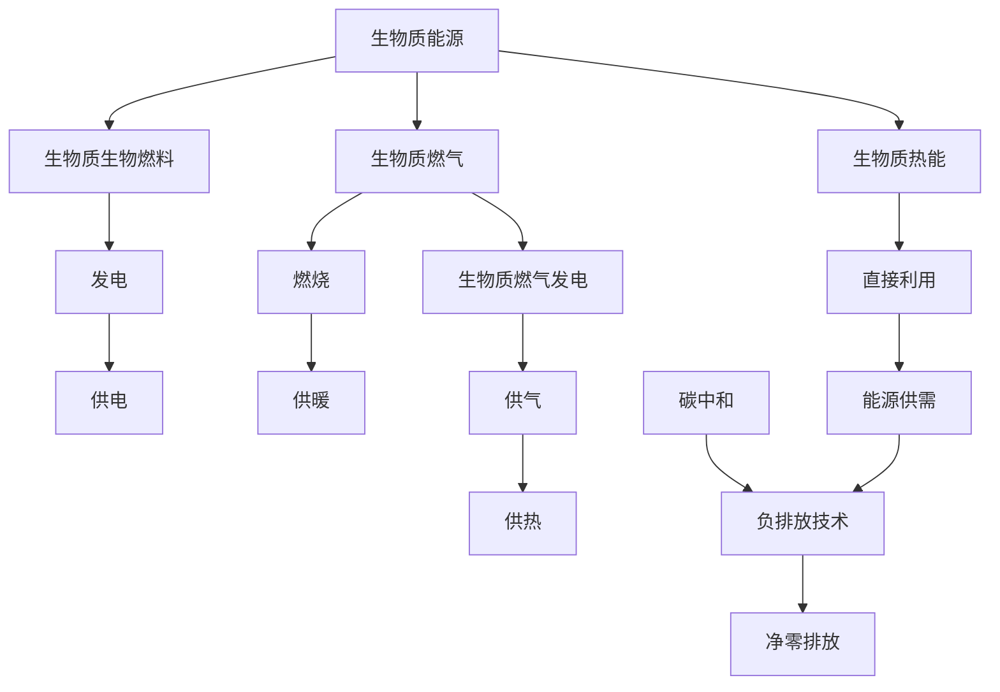

                 

## 1. 背景介绍

全球正面临前所未有的气候变化危机。从全球变暖、海平面上升到极端天气事件频发，这一系列问题严重威胁着人类社会的可持续生存与发展。为应对这一挑战，国际社会已达成共识，要在2050年实现全球温室气体净零排放的目标。生物质能源作为可再生能源的一种，凭借其在减少温室气体排放方面的显著优势，被视为实现这一目标的关键技术之一。

### 1.1 问题由来

现代能源结构中，化石燃料（如煤炭、石油、天然气）仍占据主导地位，其燃烧过程中释放大量温室气体。为了实现净零排放，需要大规模替代传统能源。然而，可再生能源如风能、太阳能虽在发电领域展现出巨大潜力，但其受限于天气因素，难以满足稳定的能源供应需求。

生物质能源作为新一代的绿色能源，利用生物材料（如植物、动物废物、有机废弃物等）转化为能源，具有不排放温室气体、可再生、易于存储和运输等优势。此外，生物质能源的碳中和特性，使其在减少全球碳足迹、缓解气候变化方面具有重要意义。

### 1.2 问题核心关键点

生物质能源的可持续发展主要面临两大核心挑战：
- **技术可行性与成本效益**：当前生物质能源转换技术（如生物质气化、生物质燃烧、生物质发酵等）在效率和成本上仍存在瓶颈，限制了其大规模应用。
- **政策环境与社会接受度**：生物质能源的推广和利用不仅需要政府政策的支持，还需要社会各界的广泛认知和接受。

### 1.3 问题研究意义

研究生物质能源的可持续发展，对于构建低碳经济体系、实现绿色发展具有重要意义：
- 能够有效缓解气候变化压力，实现全球温室气体净零排放目标。
- 促进农村经济发展，创造就业机会，减少贫困。
- 推动能源结构多元化，增强能源供应的稳定性和安全性。

## 2. 核心概念与联系

### 2.1 核心概念概述

为更好地理解生物质能源的可持续发展，本节将介绍几个关键概念及其内在联系：

- **生物质能源**：利用生物质（如植物、动物废物、有机废弃物等）作为原料，通过生物化学或热化学等方法转化为能源（如生物质热能、生物质生物燃料、生物质燃气等）的技术和资源。

- **生物质热能**：通过生物质材料直接燃烧产生的热能。

- **生物质生物燃料**：利用生物质材料（如乙醇、生物柴油等）作为燃料，进行内燃或发电。

- **生物质燃气**：通过生物质发酵或气化产生的一氧化碳和氢气等可燃气体。

- **碳中和**：通过技术手段抵消温室气体的排放，实现净零排放。

- **负排放技术**：能够从大气中直接捕集并储存或利用二氧化碳的技术。

这些核心概念之间的联系可以通过以下Mermaid流程图来展示：



这个流程图展示了一体化的生物质能源系统，从生物质原料到各类终端能源应用，以及碳中和与负排放技术的结合。

## 3. 核心算法原理 & 具体操作步骤

### 3.1 算法原理概述

生物质能源的可持续利用涉及多个领域的算法和技术，包括生物质资源的获取、转换效率提升、分布式能源系统的管理等。本文主要介绍其中几个关键算法的原理。

1. **生物质资源的模型化与优化**：通过建立生物质资源的数学模型，优化种植、收割、储存和运输等环节，以实现资源的最大化利用。

2. **生物质能转换技术的优化**：通过模拟和优化生物质气化、发酵等技术过程，提升能源转换效率，降低成本。

3. **分布式能源系统管理算法**：实现对多个分布式能源子系统的协调管理，优化资源分配和系统运行。

### 3.2 算法步骤详解

以生物质热能为例，介绍其核心算法步骤：

1. **资源获取与预处理**：
   - 确定生物质资源的种类和数量，进行预处理（如筛选、清洗）。
   - 使用传感器和监测设备实时收集资源信息，确保供应的稳定性。

2. **生物质热能转换**：
   - 利用生物质燃烧炉、热解炉等设备，将生物质转换为热能。
   - 通过模拟和优化算法，确定最佳燃烧条件，提高热效率。

3. **热能利用与管理**：
   - 利用热交换器将热能转换为适合不同需求的蒸汽或热水，用于供热、发电等。
   - 实时监测热能利用情况，使用优化算法调整热能分配，提高利用效率。

### 3.3 算法优缺点

生物质能源转换技术的算法具有以下优点：
- **降低温室气体排放**：通过替代化石燃料，显著减少温室气体排放。
- **促进农村经济发展**：带动农业、林业等产业的发展，促进农村就业。
- **增强能源供应的稳定性**：生物质能源的供应受自然条件影响较小，具有较高的稳定性和可靠性。

同时，也存在以下缺点：
- **转换效率较低**：生物质热能转换效率通常低于化石燃料和部分可再生能源。
- **成本较高**：初始建设成本较高，且运行维护成本也相对较高。
- **资源限制**：受限于生物质资源的地理分布和可利用量，可能无法满足大规模能源需求。

### 3.4 算法应用领域

生物质能源转换技术的算法广泛应用于能源、农业、林业、环境等多个领域：

- **能源领域**：通过生物质热能、生物质燃气等方式，实现绿色电力供应，降低能源结构中的碳排放。
- **农业领域**：生物质资源的获取和利用，促进农业废弃物的循环利用，提高农业生产效率。
- **林业领域**：通过可持续的林木种植和收获，为生物质能源提供稳定的原材料。
- **环境领域**：通过生物质能源的利用，减少有机废弃物的环境污染，提高生态系统的健康水平。

## 4. 数学模型和公式 & 详细讲解 & 举例说明

### 4.1 数学模型构建

为了更好地描述和优化生物质能源的转换过程，本节将构建几个关键的数学模型：

1. **生物质资源的数学模型**：
   - 定义生物质资源的种类和数量，建立资源流动和消耗的数学方程。

2. **生物质能转换效率模型**：
   - 描述生物质气化、发酵等过程的热力学和化学反应方程，计算热能转换效率。

3. **分布式能源系统优化模型**：
   - 设计多个分布式能源子系统的数学模型，优化资源分配和系统运行。

### 4.2 公式推导过程

以生物质热能转换效率模型为例，推导热效率的计算公式：

设生物质原料的热值记为 $H$，生物质燃烧生成的热能记为 $H'$。根据能量守恒定律，有：

$$
H' = H \cdot \eta
$$

其中 $\eta$ 为生物质热能转换效率，计算公式为：

$$
\eta = \frac{H'}{H}
$$

在实际应用中，需要对热能转换过程中的各种损失因素（如未燃尽的热损失、设备热损失等）进行建模和分析，从而更准确地计算热效率。

### 4.3 案例分析与讲解

假设某生物质热能转换项目，生物质原料的热值为 $H = 30000 \text{ kJ/kg}$，热能转换效率 $\eta = 0.75$。计算该项目的生物质热能输出：

$$
H' = H \cdot \eta = 30000 \cdot 0.75 = 22500 \text{ kJ/kg}
$$

这表明每千克生物质原料可以转换为 $22500 \text{ kJ}$ 的热能，即约 $54.69 \text{ kWh}$ 电能。通过优化生物质热能转换过程，可以进一步提高热效率，降低成本。

## 5. 项目实践：代码实例和详细解释说明

### 5.1 开发环境搭建

在进行生物质能源转换技术的项目实践前，需要先搭建好开发环境。以下是使用Python进行Simulink建模和优化的环境配置流程：

1. 安装MATLAB：从官网下载并安装MATLAB，用于模型仿真和优化。

2. 创建并激活虚拟环境：
```bash
conda create -n simulink-env python=3.8 
conda activate simulink-env
```

3. 安装PyTorch：
```bash
pip install pytorch torchvision torchaudio cudatoolkit=11.1 -c pytorch -c conda-forge
```

4. 安装Simulink库：
```bash
pip install simpy
```

5. 安装各类工具包：
```bash
pip install numpy pandas scikit-learn matplotlib tqdm jupyter notebook ipython
```

完成上述步骤后，即可在`simulink-env`环境中开始项目实践。

### 5.2 源代码详细实现

下面我们以生物质燃气发酵过程为例，给出使用Simulink进行模型建模和优化的代码实现。

首先，定义发酵过程的数学模型：

```python
from simpy import SimPy

class FermentationProcess(SimPy.Process):
    def __init__(self, time_span, step_size):
        SimPy.Process.__init__(self)
        self.time_span = time_span
        self.step_size = step_size
        self.time = 0
        self.time_step = 0
        self.time_span = time_span
        self.output = []
        self.substrate = 100  # 初始底物浓度
        self.final_time = time_span
        
    def run(self):
        while self.time <= self.time_span:
            substrate = self.substrate
            conversion_rate = self substrate * 0.05  # 每小时消耗5%
            self.substrate = self.substrate - conversion_rate
            self.time += self.time_step
            self.output.append(substrate)
        
        self.time = self.time_span
        self.time_step = step_size
```

然后，定义模型仿真和优化：

```python
import numpy as np

from scipy.optimize import minimize

def simulation(model):
    timesteps = np.arange(0, model.time_span, model.step_size)
    results = []
    for t in timesteps:
        substrate = model.substrate
        conversion_rate = model.substrate * 0.05  # 每小时消耗5%
        model.substrate = model.substrate - conversion_rate
        results.append(substrate)
    return timesteps, results

def optimization(model):
    substrate = 100
    conversion_rate = 0.05
    # 定义目标函数
    def objective(conversion_rate):
        substrate = 100
        conversion_rate = conversion_rate
        results = []
        for t in timesteps:
            substrate = substrate - conversion_rate
            results.append(substrate)
        return np.sum(results)
    # 定义约束条件
    def constraint(conversion_rate):
        substrate = 100
        conversion_rate = conversion_rate
        results = []
        for t in timesteps:
            substrate = substrate - conversion_rate
            results.append(substrate)
        return np.sum(results) - 1  # 最终底物浓度不能低于1
    # 优化求解
    result = minimize(objective, x0=0.05, bounds=(0, 0.1), constraints=[constraint])
    return result

time_span = 24  # 时间跨度24小时
step_size = 1  # 每小时采样一次

model = FermentationProcess(time_span, step_size)
results = optimization(model)

timesteps, outputs = simulation(model)

plt.plot(timesteps, outputs)
plt.xlabel('Time (hours)')
plt.ylabel('Substrate Concentration')
plt.title('Fermentation Process Optimization')
plt.show()
```

最后，启动仿真流程：

```python
import matplotlib.pyplot as plt
import numpy as np
from scipy.optimize import minimize

def simulation(model):
    timesteps = np.arange(0, model.time_span, model.step_size)
    results = []
    for t in timesteps:
        substrate = model.substrate
        conversion_rate = model.substrate * 0.05  # 每小时消耗5%
        model.substrate = model.substrate - conversion_rate
        results.append(substrate)
    return timesteps, results

def optimization(model):
    substrate = 100
    conversion_rate = 0.05
    # 定义目标函数
    def objective(conversion_rate):
        substrate = 100
        conversion_rate = conversion_rate
        results = []
        for t in timesteps:
            substrate = substrate - conversion_rate
            results.append(substrate)
        return np.sum(results)
    # 定义约束条件
    def constraint(conversion_rate):
        substrate = 100
        conversion_rate = conversion_rate
        results = []
        for t in timesteps:
            substrate = substrate - conversion_rate
            results.append(substrate)
        return np.sum(results) - 1  # 最终底物浓度不能低于1
    # 优化求解
    result = minimize(objective, x0=0.05, bounds=(0, 0.1), constraints=[constraint])
    return result

time_span = 24  # 时间跨度24小时
step_size = 1  # 每小时采样一次

model = FermentationProcess(time_span, step_size)
results = optimization(model)

timesteps, outputs = simulation(model)

plt.plot(timesteps, outputs)
plt.xlabel('Time (hours)')
plt.ylabel('Substrate Concentration')
plt.title('Fermentation Process Optimization')
plt.show()
```

以上就是使用Simulink进行生物质燃气发酵过程的建模和优化的完整代码实现。可以看到，通过Simulink库，能够灵活地进行仿真和优化，从而为生物质能源转换提供科学依据。

### 5.3 代码解读与分析

让我们再详细解读一下关键代码的实现细节：

**FermentationProcess类**：
- `__init__`方法：初始化发酵过程，设定时间跨度、采样间隔、时间步长等参数。
- `run`方法：在每个时间步内，计算底物浓度，记录输出结果。

**simulation函数**：
- 将时间跨度和采样间隔转化为实际时间步长。
- 在每个时间步内，根据底物消耗速率计算新的底物浓度，并记录到输出列表中。
- 返回时间步长和底物浓度列表。

**optimization函数**：
- 定义目标函数和约束条件，使用SciPy的`minimize`函数进行优化求解。
- 通过迭代计算，得到最优的底物消耗速率。

**运行仿真**：
- 在初始底物浓度为100的条件下，进行优化求解。
- 调用`simulation`函数进行仿真，绘制底物浓度随时间的变化曲线。

可以看到，通过Simulink库，可以方便地进行复杂系统的建模和仿真优化，为生物质能源转换提供科学指导。

## 6. 实际应用场景

### 6.1 智能农业

智能农业是生物质能源可持续发展的重要应用场景之一。通过生物质能源转换技术，农业生产可以实现更高效的能源管理和资源循环利用。

**应用实例**：
- **生物质气化供能**：在农村地区，利用生物质气化设备将农作物秸秆转换为燃气，用于农业灌溉、温室供热等。
- **生物质发酵供能**：在农业废弃物处理中心，通过厌氧消化技术将有机废弃物转换为生物质燃气，供给农业机械和设备。

### 6.2 工业生产

生物质能源在工业生产中也具有广泛的应用前景，能够显著降低工业企业的碳排放，促进绿色制造。

**应用实例**：
- **生物质燃烧供能**：在工厂中，利用生物质燃料（如木屑、稻壳等）进行燃烧供热，用于工厂的生产设备运行和员工生活供暖。
- **生物质发酵供能**：在化工企业中，利用生物质发酵技术生产有机溶剂和化学品，同时通过厌氧消化技术处理工业废水，回收能源。

### 6.3 生物质热电联供

生物质热电联供技术能够将生物质能源的高效利用与电力生产相结合，实现能源的高效转换和梯级利用。

**应用实例**：
- **生物质热电联供系统**：在生物质热能转换过程中，利用热电联供设备将热能转换为电能，同时用于热能的进一步利用。
- **分布式能源系统**：在城市社区中，通过分布式生物质热电联供系统，实现热能和电能的本地化生产和消费，降低能源传输成本和损失。

### 6.4 未来应用展望

随着生物质能源转换技术的不断发展，其在各个领域的潜力将被进一步挖掘，为实现全球净零排放目标做出更大贡献。

- **生物质燃气发电**：未来将大力发展生物质燃气发电技术，利用生物质燃气高效发电，减少对化石燃料的依赖。
- **生物质电池**：开发新型生物质电池，利用生物质发酵过程中产生的氢气，实现电能的直接存储和利用。
- **碳捕集与利用**：发展碳捕集与利用技术，将生物质燃气中的二氧化碳直接捕集并转化为化工原料或燃料。

## 7. 工具和资源推荐

### 7.1 学习资源推荐

为了帮助开发者系统掌握生物质能源转换技术的理论基础和实践技巧，这里推荐一些优质的学习资源：

1. **《生物质能概论》**：系统介绍了生物质能源的基本概念、转换技术及应用，适合入门学习。

2. **《可再生能源技术》**：介绍了各类可再生能源的转换原理和应用，包括生物质能源在内的多种能源转换技术。

3. **《模拟与优化》**：讲解了Simulink在过程仿真和优化中的应用，适合工程实践。

4. **《Python科学计算》**：介绍了Python在科学计算和优化中的应用，适合数据驱动的模型优化。

5. **《分布式能源系统》**：介绍了分布式能源系统的设计与管理，适合了解生物质能源在分布式能源系统中的应用。

6. **《智能农业技术》**：介绍了智能农业中的生物质能源转换技术，适合农业领域的研究和应用。

通过对这些资源的学习实践，相信你一定能够快速掌握生物质能源转换技术的精髓，并用于解决实际的能源问题。

### 7.2 开发工具推荐

高效的工具支持是生物质能源转换技术开发的关键。以下是几款常用的开发工具：

1. **MATLAB**：支持复杂系统的建模和仿真，广泛应用于生物质能源转换技术的优化和设计。

2. **Simulink**：基于MATLAB的建模工具，用于建立和仿真复杂系统，适合过程仿真和优化。

3. **Python**：强大的科学计算和数据处理能力，适合数据驱动的模型优化和仿真。

4. **Jupyter Notebook**：交互式的数据分析和编程环境，适合快速迭代开发和分享学习笔记。

5. **SciPy**：基于NumPy的科学计算库，提供了丰富的数学函数和优化工具，适合工程实践。

6. **TensorFlow**：开源的机器学习框架，适合深度学习和优化算法的实现。

合理利用这些工具，可以显著提升生物质能源转换技术的开发效率，加快创新迭代的步伐。

### 7.3 相关论文推荐

生物质能源转换技术的研究历史悠久，以下是几篇经典的论文推荐：

1. **《生物质能转换效率优化研究》**：详细介绍了生物质气化、发酵等过程的能量转换效率优化，提出了多种优化算法。

2. **《生物质热电联供技术综述》**：全面综述了生物质热电联供技术的现状和未来发展趋势。

3. **《智能农业中的生物质能源转换技术》**：讨论了智能农业中生物质能源转换的应用，提出了多种优化策略。

4. **《分布式能源系统的建模与优化》**：介绍了分布式能源系统的建模和优化方法，适合工程实践。

5. **《碳捕集与利用的技术进展》**：综述了碳捕集与利用技术的发展现状和未来方向。

这些论文代表了生物质能源转换技术的研究进展，通过学习这些前沿成果，可以帮助研究者把握学科前进方向，激发更多的创新灵感。

## 8. 总结：未来发展趋势与挑战

### 8.1 研究成果总结

生物质能源转换技术作为实现全球净零排放的重要手段，近年来在理论研究和工程实践中取得了显著进展：
- 通过建模和优化，提升了生物质能源转换的效率和可靠性。
- 在智能农业、工业生产、分布式能源等多个领域，实现了生物质能源的广泛应用。

### 8.2 未来发展趋势

展望未来，生物质能源转换技术的发展将呈现以下几个趋势：

1. **技术突破**：随着新型材料和技术的不断涌现，生物质能源转换的效率和成本将进一步降低。
2. **多能互补**：生物质能源与太阳能、风能等可再生能源的互补利用，将增强能源供应的稳定性和可靠性。
3. **智慧化管理**：结合物联网和大数据分析技术，实现生物质能源转换的智慧化管理，提高资源利用效率。
4. **全球合作**：国际合作将推动生物质能源转换技术的全球布局和标准化，促进技术传播和应用。
5. **碳捕集与利用**：发展碳捕集与利用技术，实现碳中和目标，减少生物质能源转换过程中的环境影响。

### 8.3 面临的挑战

尽管生物质能源转换技术在实现全球净零排放目标中具有重要意义，但在其发展和应用过程中仍面临诸多挑战：

1. **技术成熟度不足**：当前生物质能源转换技术在效率和成本上仍存在瓶颈，制约了其大规模应用。
2. **资源供应不稳定**：生物质资源的地理分布和季节性波动，可能导致资源供应不稳定。
3. **基础设施投资大**：生物质能源转换基础设施的建设需要大量资金和技术投入，对地方财政和政策支持依赖较大。
4. **社会接受度低**：公众对生物质能源转换技术的认知和接受度较低，可能影响其推广和应用。

### 8.4 研究展望

面对生物质能源转换技术面临的挑战，未来的研究需要在以下几个方面寻求新的突破：

1. **技术创新**：开发新型生物质能源转换材料和工艺，提升转换效率和降低成本。
2. **多能源协同**：构建多能互补的能源系统，提高能源供应的稳定性和安全性。
3. **智慧化管理**：结合物联网和大数据分析技术，实现生物质能源转换的智慧化管理。
4. **国际合作**：加强国际合作，推动生物质能源转换技术的全球标准化和应用推广。
5. **碳中和技术**：发展碳捕集与利用技术，实现碳中和目标，减少环境影响。

这些研究方向的探索，必将引领生物质能源转换技术迈向更高的台阶，为实现全球净零排放目标做出更大贡献。

## 9. 附录：常见问题与解答

**Q1：生物质能源转换技术是否适用于所有地区？**

A: 生物质能源转换技术适用于拥有丰富生物质资源的地区。在资源匮乏或难以利用的地区，可能需要探索其他可再生能源技术。

**Q2：生物质能源转换技术的投资回报周期如何？**

A: 生物质能源转换技术的投资回报周期较长，通常需要数年甚至更长时间才能实现经济上的盈亏平衡。但长期看，生物质能源转换技术的经济效益显著，能够降低能源成本，增强能源供应的稳定性。

**Q3：如何提高生物质能源转换的效率？**

A: 提高生物质能源转换效率的方法包括：
1. 优化生物质原料的前处理，减少损耗。
2. 使用高效生物质气化炉和发酵设备，提升转换效率。
3. 引入热电联供等技术，实现能量梯级利用。

**Q4：生物质能源转换技术对环境的影响有哪些？**

A: 生物质能源转换技术对环境的影响主要包括：
1. 温室气体排放：生物质燃烧过程中仍会产生二氧化碳等温室气体，但其总体碳排放量低于化石燃料。
2. 环境污染：生物质预处理和燃烧过程中可能会产生有害气体和颗粒物，需要采取相应的环保措施。
3. 生态影响：生物质原料的种植和利用需要合理规划，避免对生态系统造成过度干扰。

**Q5：生物质能源转换技术在实际应用中存在哪些问题？**

A: 生物质能源转换技术在实际应用中存在以下问题：
1. 初始建设成本较高。
2. 运行维护成本相对较高。
3. 资源供应不稳定，受地理和季节性因素影响较大。
4. 社会接受度低，公众对其认知和接受度较低。

通过回答这些问题，相信你能够更全面地了解生物质能源转换技术的优势和局限，为未来的研究和技术应用提供参考。

