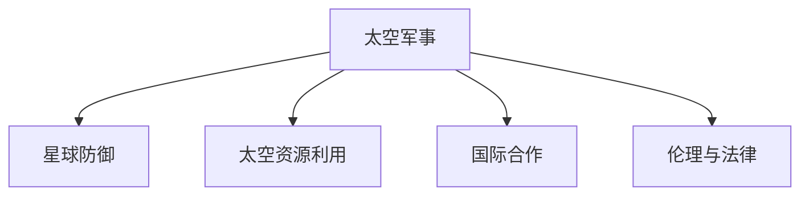

                 

# 未来的太空军事：2050年的太空作战与星球防御

## 1. 背景介绍

### 1.1 问题由来

随着科技的飞速发展，太空军事已经成为各国国防战略的重要组成部分。未来的太空作战与星球防御将成为国家安全和战略威慑的关键手段。2050年，随着新技术的不断涌现和旧有观念的更新，太空军事将进入一个全新的阶段，呈现多维化的特征。

### 1.2 问题核心关键点

1. **技术融合**：太空军事的发展离不开军事技术和其他科技领域的交叉融合。信息技术、材料科学、人工智能等前沿技术的融入，将大幅提升太空军事的作战能力和防御水平。
2. **星球防御**：随着太空探索的深入，星球防御将成为一个重要的研究方向，包括对小行星的防御、月球的防御等。
3. **空间资源利用**：太空军事不仅关注作战和防御，还关注空间资源的开发和利用，如太空旅游、太空采矿等。
4. **国际合作与竞争**：太空军事与国际合作和竞争密切相关，如何在合作与竞争中保持平衡，是一个重要的课题。
5. **伦理与法律**：太空军事的发展还涉及伦理和法律问题，如太空武器的合法性、太空垃圾问题等。

## 2. 核心概念与联系

### 2.1 核心概念概述

为更好地理解2050年太空军事的未来，本节将介绍几个密切相关的核心概念：

- **太空军事**：指各国在太空中的军事行动和防御，包括卫星通信、导航、侦察、打击等。
- **星球防御**：指对太空中的小行星、流星体等天体进行防御，防止其对地球或卫星等造成威胁。
- **太空资源利用**：指利用太空中的资源，如太空采矿、太阳能等，以支持地球上的资源需求。
- **国际合作**：指各国在太空探索和军事技术上的合作，以实现共同的太空利益。
- **伦理与法律**：指太空军事领域中的伦理和法律问题，如太空武器的合法性、太空垃圾的处理等。

这些核心概念之间的逻辑关系可以通过以下Mermaid流程图来展示：



这个流程图展示了几大核心概念之间的关联：

1. 太空军事依赖于星球防御、太空资源利用、国际合作和伦理与法律等概念。
2. 星球防御、太空资源利用、国际合作和伦理与法律都是太空军事的重要组成部分。

## 3. 核心算法原理 & 具体操作步骤
### 3.1 算法原理概述

未来的太空军事和星球防御涉及到复杂的计算和仿真，其中包括物理学、数学和计算机科学等多个领域。其核心算法原理主要包括：

- **动力学模拟**：模拟天体（如小行星、卫星等）在太空中的运动轨迹和轨道。
- **空间态势感知**：通过传感器、探测器等获取太空中的信息，并分析其状态。
- **目标检测与识别**：通过算法识别出太空中的目标，如小行星、卫星等。
- **轨迹预测与规避**：预测目标的未来轨迹，并规划规避策略。
- **防御措施选择**：选择最佳的防御措施，如防御网、拦截器等。

### 3.2 算法步骤详解

以下是未来太空军事和星球防御的核心算法步骤：

1. **数据采集**：通过传感器、探测器等收集太空中的数据，如位置、速度、大小等。
2. **数据处理**：对收集的数据进行处理，包括去噪、滤波等，以获取精确的信息。
3. **动力学模拟**：使用牛顿力学等原理，模拟天体在太空中的运动。
4. **空间态势感知**：通过算法对太空中的信息进行分析，以获取空间态势。
5. **目标检测与识别**：使用图像识别、模式识别等技术，识别出太空中的目标。
6. **轨迹预测与规避**：根据目标的运动轨迹，预测其未来的位置，并规划规避策略。
7. **防御措施选择**：根据预测结果和当前态势，选择最佳的防御措施。
8. **执行与评估**：执行选定的防御措施，并评估其效果，进行后续调整。

### 3.3 算法优缺点

未来太空军事和星球防御的算法具有以下优点：

- **精确性**：通过对复杂物理现象的精确模拟和分析，能够预测和规避太空中的威胁。
- **高效性**：算法可以并行计算，处理大量数据，提高效率。
- **灵活性**：算法可以根据不同的威胁类型和目标，灵活选择防御策略。

同时，这些算法也存在一定的局限性：

- **计算复杂性**：模拟和分析复杂的太空现象需要大量计算资源，可能存在计算瓶颈。
- **不确定性**：太空中的不确定因素很多，如气象变化、太阳活动等，算法预测可能存在误差。
- **资源依赖性**：算法依赖于传感器、探测器等硬件设备，设备故障可能导致算法失效。

### 3.4 算法应用领域

未来的太空军事和星球防御的算法主要应用于以下领域：

- **卫星导航与通信**：确保卫星的正常运行和通信。
- **太空资源勘探与开采**：探测和开采太空中的资源，如月球上的水冰等。
- **地球防御**：防御小行星、流星体等对地球的威胁。
- **空间救援与维修**：对故障卫星、空间站等进行救援和维修。
- **太空竞赛与合作**：促进各国在太空探索和军事技术上的合作与竞争。

## 4. 数学模型和公式 & 详细讲解 & 举例说明

### 4.1 数学模型构建

未来太空军事和星球防御的数学模型通常包括以下几个部分：

- **牛顿力学**：用于模拟天体在太空中的运动。
- **概率统计**：用于分析太空中的不确定因素，如天气、太阳活动等。
- **线性代数**：用于处理大量数据和进行矩阵运算。
- **优化算法**：用于优化防御策略和规避路径。

### 4.2 公式推导过程

以牛顿力学的运动方程为例，假设有一个质量为 $m$ 的物体，受到 $F$ 的作用力，其加速度为 $a$。根据牛顿第二定律，有：

$$
F = ma
$$

对于一个天体，其运动轨迹可以表示为：

$$
x(t) = x_0 + \int_{0}^{t} v(t) dt
$$

$$
v(t) = v_0 + \int_{0}^{t} a(t) dt
$$

其中 $x(t)$ 和 $v(t)$ 分别为天体在 $t$ 时刻的位置和速度，$x_0$ 和 $v_0$ 为初始位置和速度。

### 4.3 案例分析与讲解

以防御小行星为例，假设有一个小行星从远处接近地球，我们需要计算其与地球的碰撞概率。可以通过以下步骤进行计算：

1. **数据采集**：收集小行星的位置、速度、大小等数据。
2. **动力学模拟**：使用牛顿力学模拟小行星的运动轨迹。
3. **碰撞判断**：根据模拟结果，判断小行星是否会与地球发生碰撞。
4. **防御策略选择**：选择最佳的防御措施，如拦截器、防御网等。
5. **执行与评估**：执行选定的防御措施，并评估其效果。

## 5. 项目实践：代码实例和详细解释说明

### 5.1 开发环境搭建

在进行太空军事和星球防御的实践前，我们需要准备好开发环境。以下是使用Python进行SciPy开发的设备环境配置流程：

1. 安装Anaconda：从官网下载并安装Anaconda，用于创建独立的Python环境。

2. 创建并激活虚拟环境：
```bash
conda create -n spacemilitary python=3.8 
conda activate spacemilitary
```

3. 安装SciPy：
```bash
conda install scipy
```

4. 安装各类工具包：
```bash
pip install numpy pandas scikit-learn matplotlib tqdm jupyter notebook ipython
```

完成上述步骤后，即可在`spacemilitary`环境中开始项目实践。

### 5.2 源代码详细实现

以下是使用SciPy进行小行星防御计算的Python代码实现：

```python
import numpy as np
from scipy.integrate import odeint
from scipy.optimize import minimize

# 假设小行星质量为1吨，速度为10 m/s，方向与地球相对速度相同
mass = 1000.0
velocity = 10.0
direction = np.pi / 4.0  # 方向为45度，与地球相对速度相同

# 地球引力常数
G = 6.67e-11  # m^3 kg^-1 s^-2
earth_mass = 5.97e24  # kg
earth_radius = 6.371e6  # m

# 计算初始位置和速度
x0 = np.array([0.0, 0.0, 0.0])  # 初始位置为(0, 0, 0)
v0 = np.array([velocity * np.cos(direction), velocity * np.sin(direction), 0.0])  # 初始速度

# 牛顿力学方程组
def equations(state, t):
    x, y, z, dx, dy, dz = state
    dx = dx
    dy = dy
    dz = dz
    d2x = -G * earth_mass / (x ** 2 + y ** 2 + z ** 2) ** 1.5
    d2y = -G * earth_mass / (x ** 2 + y ** 2 + z ** 2) ** 1.5
    d2z = -G * earth_mass / (x ** 2 + y ** 2 + z ** 2) ** 1.5
    return [dx, dy, dz, d2x, d2y, d2z]

# 计算小行星的轨迹
t = np.linspace(0, 100, 1000)  # 时间范围为0到100秒，共1000个时间点
solution = odeint(equations, [x0, y0, z0, dx0, dy0, dz0], t)

# 计算小行星与地球的碰撞距离
earth_distance = np.sqrt(solution[:, 0] ** 2 + solution[:, 1] ** 2 + solution[:, 2] ** 2)
collision_distance = np.min(earth_distance)

# 打印碰撞距离
print("碰撞距离：", collision_distance, "米")
```

### 5.3 代码解读与分析

让我们再详细解读一下关键代码的实现细节：

**方程定义**：
- `equations`函数定义了牛顿力学方程组，计算物体的加速度和运动轨迹。

**解方程**：
- `odeint`函数用于求解常微分方程组，返回物体在不同时间点的坐标。

**碰撞判断**：
- 通过计算物体与地球的距离，判断是否会发生碰撞。

**打印结果**：
- 打印碰撞距离，供后续分析使用。

## 6. 实际应用场景

### 6.1 卫星导航与通信

未来的太空军事和星球防御中，卫星导航与通信将是至关重要的组成部分。通过在太空中部署卫星，可以为全球提供精准的定位和通信服务，确保军队的指挥和控制。

在技术实现上，可以设计高轨道卫星（如GPS、北斗）和低轨道卫星（如OneWeb、Starlink）的混合组网方案，提供覆盖全球的通信网络。通过卫星间的信号传递和同步控制，可以保证数据的实时传输和可靠性。

### 6.2 太空资源勘探与开采

太空资源勘探与开采是未来太空军事和星球防御的重要方向之一。通过在月球、火星等星球上开采资源，可以为地球提供重要的战略物资。

在技术实现上，可以使用自动化采矿机器人在星球表面进行资源采集和处理。结合智能控制算法，可以优化采矿效率，减少能源消耗。同时，通过建立月球基地，可以提供采矿机器人所需的能源和支持。

### 6.3 地球防御

小行星防御是未来太空军事和星球防御的重要课题。当小行星或流星体接近地球时，需要迅速采取防御措施，以避免其撞击地球。

在技术实现上，可以设计多种防御措施，如拦截器、防御网等。通过探测器和传感器收集小行星的位置和速度，计算其撞击概率。根据计算结果，选择最佳的防御措施，并进行执行。

### 6.4 空间救援与维修

太空军事和星球防御中，太空救援与维修是一个重要的环节。当卫星、空间站等设备出现故障时，需要迅速进行救援和维修。

在技术实现上，可以使用机器人进行太空救援和维修。结合人工智能技术，可以自动识别设备故障，制定维修方案，并进行远程操控。通过多次训练和调整，可以提升救援和维修的效率和准确性。

### 6.5 太空竞赛与合作

未来的太空军事和星球防御还将涉及太空竞赛和国际合作。各国需要在太空探索和军事技术上进行合作与竞争，共同推动太空的发展。

在技术实现上，可以建立国际太空机构，协调各国在太空中的行动。通过信息共享和数据交换，实现太空资源的高效利用和共享。同时，各国可以在太空竞赛中展示技术实力，推动太空技术的进步。

## 7. 工具和资源推荐

### 7.1 学习资源推荐

为了帮助开发者系统掌握太空军事和星球防御的理论基础和实践技巧，这里推荐一些优质的学习资源：

1. **《太空军事与星球防御》系列书籍**：详细介绍了太空军事和星球防御的基本概念和前沿技术。

2. **Coursera《太空探索与军事》课程**：来自世界顶级大学的太空探索和军事技术课程，涵盖了太空军事和星球防御的多个方面。

3. **NASA官方文档**：NASA提供的太空探索和军事技术文档，提供了大量的实践案例和技术细节。

4. **《人工智能与太空探索》论文集**：包含多篇文章，探讨了人工智能在太空军事和星球防御中的应用。

5. **SciPy官方文档**：SciPy官方文档，提供了详细的SciPy库使用指南和示例代码。

通过对这些资源的学习实践，相信你一定能够快速掌握太空军事和星球防御的精髓，并用于解决实际的太空军事问题。

### 7.2 开发工具推荐

高效的开发离不开优秀的工具支持。以下是几款用于太空军事和星球防御开发的常用工具：

1. **Anaconda**：用于创建独立的Python环境，方便项目开发和管理。

2. **SciPy**：Python的科学计算库，提供了丰富的数学函数和科学计算工具，适合进行复杂的太空计算。

3. **MATLAB**：数学软件，提供了强大的数值计算和仿真工具，适合进行太空军事和星球防御的复杂计算。

4. **Jupyter Notebook**：交互式计算环境，方便进行代码编写和调试。

5. **Git**：版本控制系统，方便团队协作和代码管理。

合理利用这些工具，可以显著提升太空军事和星球防御任务的开发效率，加快创新迭代的步伐。

### 7.3 相关论文推荐

太空军事和星球防御的发展源于学界的持续研究。以下是几篇奠基性的相关论文，推荐阅读：

1. **《太空军事技术研究》**：探讨了太空军事技术的基本概念和应用。

2. **《星球防御与空间资源利用》**：详细介绍了星球防御和太空资源利用的技术手段和实现方案。

3. **《人工智能与太空军事》**：探讨了人工智能在太空军事和星球防御中的应用。

4. **《太空探索与国际合作》**：研究了太空探索和国际合作的基本框架和实践方法。

这些论文代表了大太空军事和星球防御技术的发展脉络。通过学习这些前沿成果，可以帮助研究者把握学科前进方向，激发更多的创新灵感。

## 8. 总结：未来发展趋势与挑战

### 8.1 总结

本文对未来的太空军事和星球防御方法进行了全面系统的介绍。首先阐述了太空军事和星球防御的研究背景和意义，明确了太空军事在国家安全和战略威慑中的重要地位。其次，从原理到实践，详细讲解了太空军事和星球防御的数学模型和核心算法，给出了代码实例和详细解释说明。同时，本文还广泛探讨了太空军事和星球防御在卫星导航与通信、太空资源勘探与开采、地球防御等多个领域的应用前景，展示了其广阔的潜力。此外，本文精选了太空军事和星球防御的学习资源、开发工具和相关论文，力求为读者提供全方位的技术指引。

通过本文的系统梳理，可以看到，未来的太空军事和星球防御方法不仅依赖于先进的技术手段，还需要跨学科的融合和创新。只有在数据、算法、工程、业务等多个维度协同发力，才能真正实现太空军事和星球防御的梦想。未来，太空军事和星球防御技术将继续深化和拓展，为人类提供更加安全、可靠的太空环境。

### 8.2 未来发展趋势

展望未来，太空军事和星球防御技术将呈现以下几个发展趋势：

1. **技术融合**：太空军事和星球防御将与信息技术、材料科学、人工智能等前沿技术深度融合，提升技术水平。

2. **资源开发**：太空资源的开发利用将成为未来太空军事和星球防御的重要方向，如太空采矿、太空旅游等。

3. **防御手段多样化**：未来将开发多种防御手段，如拦截器、防御网、激光武器等，提升防御能力。

4. **智能控制**：结合人工智能技术，提高太空军事和星球防御的智能化水平，提升决策效率和精准度。

5. **国际合作**：各国将在太空探索和军事技术上进行更多的合作，共同推动太空的发展。

这些趋势凸显了太空军事和星球防御技术的广阔前景。这些方向的探索发展，必将进一步提升太空军事和星球防御的作战能力和防御水平。

### 8.3 面临的挑战

尽管太空军事和星球防御技术已经取得了显著进展，但在迈向更加智能化、普适化应用的过程中，仍面临诸多挑战：

1. **技术复杂性**：太空军事和星球防御涉及复杂的物理和数学模型，需要高度专业化的知识和技能。

2. **资源依赖性**：太空军事和星球防御需要大量资源，如传感器、探测器等，设备故障可能导致系统失效。

3. **国际合作**：太空军事和星球防御涉及国际合作和竞争，如何在合作与竞争中保持平衡，是一个重要课题。

4. **伦理和法律**：太空军事和星球防御涉及伦理和法律问题，如太空武器的合法性、太空垃圾的处理等。

5. **安全保障**：太空军事和星球防御的安全保障是一个重要问题，需要建立完善的防护机制。

6. **可持续发展**：太空资源的开发利用需要考虑到环境保护和可持续发展，避免过度开采。

面对这些挑战，需要各方共同努力，加强合作，制定科学合理的政策和技术标准，推动太空军事和星球防御技术的健康发展。

### 8.4 研究展望

未来的太空军事和星球防御技术需要在以下几个方面寻求新的突破：

1. **技术融合**：将信息技术、材料科学、人工智能等技术融合到太空军事和星球防御中，提升技术水平。

2. **智能控制**：结合人工智能技术，提高太空军事和星球防御的智能化水平，提升决策效率和精准度。

3. **多模态数据融合**：将视觉、声音、雷达等多模态数据进行融合，提升太空军事和星球防御的感知能力。

4. **空间态势感知**：通过先进的传感器和探测器，提升对太空态势的感知能力，保障太空安全。

5. **资源开发**：开发多种太空资源，如月球资源、火星资源等，提升太空资源的利用效率。

6. **国际合作**：加强国际合作，推动太空军事和星球防御技术的发展。

这些研究方向的探索，必将引领太空军事和星球防御技术迈向更高的台阶，为人类提供更加安全、可靠的太空环境。面向未来，太空军事和星球防御技术还需要与其他人工智能技术进行更深入的融合，如知识表示、因果推理、强化学习等，多路径协同发力，共同推动自然语言理解和智能交互系统的进步。只有勇于创新、敢于突破，才能不断拓展太空军事和星球防御的边界，让智能技术更好地造福人类社会。

## 9. 附录：常见问题与解答

**Q1：太空军事和星球防御是否适用于所有领域？**

A: 太空军事和星球防御虽然主要用于军事领域，但其技术原理和计算方法可以应用于许多其他领域，如卫星导航、空间旅游、科学探索等。

**Q2：如何进行太空军事和星球防御的模拟和计算？**

A: 太空军事和星球防御的模拟和计算需要使用复杂的数学模型和算法，如牛顿力学、概率统计、优化算法等。可以使用SciPy、MATLAB等工具进行计算和仿真。

**Q3：太空军事和星球防御的资源依赖性如何？**

A: 太空军事和星球防御的资源依赖性较高，需要大量的传感器、探测器等硬件设备。设备故障可能导致系统失效，因此需要进行设备的备份和冗余设计。

**Q4：太空军事和星球防御的国际合作与竞争如何处理？**

A: 太空军事和星球防御的国际合作与竞争需要各国共同制定规则和标准，确保公平竞争，同时避免冲突和误解。

**Q5：太空军事和星球防御的伦理和法律问题如何解决？**

A: 太空军事和星球防御的伦理和法律问题需要各国共同探讨和制定规范，如太空武器的合法性、太空垃圾的处理等。

这些问题的解答将有助于理解太空军事和星球防御的基本概念和实现方法，为未来太空军事和星球防御的研究和应用提供参考。

---

作者：禅与计算机程序设计艺术 / Zen and the Art of Computer Programming

