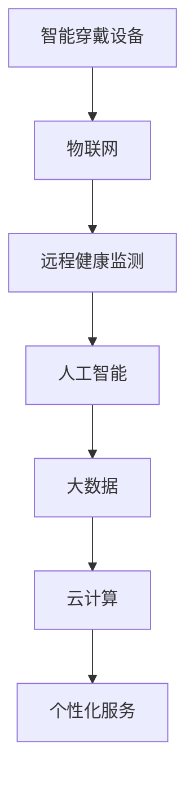

                 

# 未来的智慧养老：2050年的智能穿戴与远程健康监测

## 1. 背景介绍

### 1.1 问题由来
随着全球人口老龄化的加剧，智慧养老已成为全球各国政府、社会和学术界共同关注的焦点。传统养老模式面临的压力巨大，如何提升老年人的生活质量，实现健康管理与医疗服务的精准化和智能化，成为智慧养老的关键所在。

智慧养老的核心在于利用先进的物联网技术、人工智能技术和大数据分析技术，对老年人的健康状态进行实时监测，对疾病进行早期预警和及时干预，并提供个性化的生活服务和医疗支持。

### 1.2 问题核心关键点
智慧养老的核心在于将先进的智能穿戴设备和远程健康监测系统集成到老年人的日常生活中，通过持续的数据收集和实时分析，实现对老年人健康状态的全面、精准的监控和管理。

具体包括以下关键点：
- 智能穿戴设备：通过传感器、摄像头等设备，持续收集老年人的生理数据（如心率、血压、血糖等）和生活行为数据（如运动量、饮食、睡眠等）。
- 远程健康监测：通过云端平台和物联网技术，实时传输和存储老年人健康数据，进行数据分析和预警。
- 个性化服务：根据老年人的健康数据和生活习惯，提供个性化的医疗和生活服务。

## 2. 核心概念与联系

### 2.1 核心概念概述
1. **智能穿戴设备(Smart Wearable Devices)**：指通过各种传感器和通信技术，持续收集老年人健康和行为数据的智能设备，如智能手环、智能手表、智能眼镜等。
2. **远程健康监测(Remote Health Monitoring)**：指通过网络技术将老年人健康数据实时传输到云端平台，进行数据分析和预警的过程。
3. **物联网(IoT, Internet of Things)**：指将各种设备和物品通过互联网连接起来，实现数据的互通和共享。
4. **人工智能(AI, Artificial Intelligence)**：指通过机器学习和深度学习技术，对老年人健康数据进行分析和预测。
5. **云计算(Cloud Computing)**：指通过分布式计算和存储技术，提供计算和存储资源，实现数据的存储和处理。
6. **大数据(Big Data)**：指通过海量数据存储和分析技术，对老年人健康数据进行深入分析和挖掘。

这些核心概念相互关联，共同构成了智慧养老的基石。智能穿戴设备通过物联网技术，将老年人健康数据实时传输到云端平台，利用人工智能技术和大数据分析技术，进行健康状态的分析和预警，最终实现个性化的医疗和生活服务。

### 2.2 核心概念原理和架构的 Mermaid 流程图



此流程图展示了智能穿戴设备、物联网、远程健康监测、人工智能、大数据和云计算之间的关系，每个模块相互连接，共同支撑智慧养老的实现。

## 3. 核心算法原理 & 具体操作步骤

### 3.1 算法原理概述
智慧养老的核心算法主要包括数据采集、数据传输、数据分析和个性化服务。

1. **数据采集**：通过智能穿戴设备，持续收集老年人的健康和行为数据。
2. **数据传输**：通过物联网技术，将老年人健康数据实时传输到云端平台。
3. **数据分析**：利用人工智能技术和大数据分析技术，对老年人健康数据进行分析和预测。
4. **个性化服务**：根据老年人健康数据和生活习惯，提供个性化的医疗和生活服务。

### 3.2 算法步骤详解

#### 3.2.1 数据采集步骤
1. 选择适合的智能穿戴设备，如智能手环、智能手表、智能眼镜等，确保设备具备足够多的传感器。
2. 将设备与老年人佩戴，确保设备的稳定性和数据准确性。
3. 使用App或远程控制软件，配置设备的数据采集参数，如采样频率、采集时间等。

#### 3.2.2 数据传输步骤
1. 使用物联网技术，将设备采集到的健康数据实时传输到云端平台。
2. 确保数据传输的实时性和稳定性，避免数据丢失和延迟。
3. 利用加密技术，保护数据传输的安全性。

#### 3.2.3 数据分析步骤
1. 将老年人健康数据存储到云端平台，确保数据的完整性和可访问性。
2. 利用人工智能技术，对健康数据进行分析和预测，如预测老年人患病的概率、健康趋势等。
3. 利用大数据技术，对健康数据进行深入分析和挖掘，发现健康管理的规律和模式。

#### 3.2.4 个性化服务步骤
1. 根据老年人健康数据和生活习惯，设计个性化的医疗和生活服务方案。
2. 通过App或远程控制软件，向老年人推送个性化的医疗和生活服务方案。
3. 根据老年人的反馈，不断优化和改进个性化的医疗和生活服务方案。

### 3.3 算法优缺点

#### 3.3.1 算法优点
1. **实时性和准确性高**：智能穿戴设备和远程健康监测系统，可以实现对老年人健康状态的实时监测和分析，提供准确的医疗和生活服务。
2. **数据全面性和完整性好**：通过智能穿戴设备和物联网技术，可以全面、完整地收集老年人的健康和行为数据。
3. **个性化服务精准度高**：利用人工智能技术和大数据分析技术，可以提供个性化的医疗和生活服务，满足老年人的个性化需求。

#### 3.3.2 算法缺点
1. **设备成本高**：智能穿戴设备的价格较高，可能会给老年人和家庭带来经济负担。
2. **数据隐私和安全风险**：老年人健康数据涉及隐私和安全，需要采取严格的保护措施，避免数据泄露和滥用。
3. **依赖技术支持**：智能穿戴设备和远程健康监测系统的运行，需要依赖稳定的技术和网络支持，一旦技术出现故障，可能会影响系统正常运行。

### 3.4 算法应用领域

智慧养老的算法应用领域主要包括以下几个方面：

1. **健康监测和预警**：通过智能穿戴设备和远程健康监测系统，实时监测老年人的健康状态，提前发现疾病隐患，及时预警和干预。
2. **医疗服务**：利用人工智能技术，提供个性化的医疗服务，如远程诊疗、健康咨询等。
3. **生活服务**：根据老年人的健康数据和生活习惯，提供个性化的生活服务，如营养建议、运动计划等。
4. **应急响应**：通过智能穿戴设备和远程健康监测系统，及时发现老年人的异常情况，并自动报警和响应。
5. **家庭护理**：通过智能穿戴设备和远程健康监测系统，远程指导和监控家庭护理人员的工作，提升护理质量。

## 4. 数学模型和公式 & 详细讲解 & 举例说明

### 4.1 数学模型构建

假设老年人健康状态可以用向量 $X$ 表示，包括心率、血压、血糖等生理指标，以及运动量、饮食、睡眠等行为指标。

设 $X = [x_1, x_2, ..., x_n]^T$，其中 $x_i$ 表示第 $i$ 个指标的值。

设 $Y$ 表示老年人的健康状态，即是否患病或健康状况如何。

则数学模型可以表示为：

$$
Y = f(X)
$$

其中 $f$ 为模型函数，将健康指标 $X$ 映射到健康状态 $Y$。

### 4.2 公式推导过程

#### 4.2.1 健康状态预测模型

设 $X = [x_1, x_2, ..., x_n]^T$ 为输入向量，$Y$ 为输出向量。

设 $f$ 为健康状态预测模型，则数学模型可以表示为：

$$
Y = f(X)
$$

其中 $f$ 为非线性函数，可以通过神经网络、决策树、支持向量机等算法进行建模。

假设 $f$ 为三层神经网络，其中输入层有 $n$ 个节点，隐藏层有 $m$ 个节点，输出层有 $k$ 个节点。则神经网络的数学模型可以表示为：

$$
Y = f(X) = W_3 \cdot f_2(W_2 \cdot f_1(X) + b_2) + b_3
$$

其中 $f_1$ 为输入层与隐藏层之间的线性变换，$f_2$ 为隐藏层与输出层之间的线性变换，$W_1, W_2, W_3$ 为权重矩阵，$b_1, b_2, b_3$ 为偏置向量。

#### 4.2.2 健康状态分类模型

设 $X = [x_1, x_2, ..., x_n]^T$ 为输入向量，$Y$ 为输出向量。

设 $f$ 为健康状态分类模型，则数学模型可以表示为：

$$
Y = f(X)
$$

其中 $f$ 为分类函数，可以通过softmax回归、k-近邻算法等算法进行建模。

假设 $f$ 为softmax回归模型，则数学模型可以表示为：

$$
p(Y=i|X) = \frac{e^{\beta_i \cdot X + \alpha_i}}{\sum_{j=1}^k e^{\beta_j \cdot X + \alpha_j}}
$$

其中 $\beta_i$ 为类别 $i$ 的回归系数，$\alpha_i$ 为类别 $i$ 的截距，$k$ 为类别数量。

### 4.3 案例分析与讲解

假设老年人的健康状态 $Y$ 为患病或健康，其中患病为1，健康为0。

设 $X = [x_1, x_2, ..., x_n]^T$ 为输入向量，包括心率 $x_1$、血压 $x_2$、血糖 $x_3$ 等生理指标，以及运动量 $x_4$、饮食 $x_5$、睡眠 $x_6$ 等行为指标。

设 $Y = 1$ 表示老年人患病，$Y = 0$ 表示老年人健康。

则可以通过以下步骤进行健康状态分类模型的建立和训练：

1. 收集老年人健康数据 $D$，包含 $N$ 个样本，每个样本包含 $n$ 个特征 $x_i$ 和标签 $y_i$。
2. 将数据 $D$ 分成训练集 $D_{train}$ 和测试集 $D_{test}$，其中训练集 $D_{train}$ 用于训练模型，测试集 $D_{test}$ 用于评估模型性能。
3. 建立softmax回归模型 $f(X)$，对训练集 $D_{train}$ 进行训练，得到模型参数 $\beta$ 和 $\alpha$。
4. 在测试集 $D_{test}$ 上进行测试，评估模型的准确率、召回率、F1值等指标。

## 5. 项目实践：代码实例和详细解释说明

### 5.1 开发环境搭建

#### 5.1.1 硬件环境
- 服务器：高性能服务器，配备至少16核CPU、64GB内存、2TB硬盘。
- 网络设备：稳定的网络连接设备，支持千兆以上网络传输速率。
- 数据存储设备：大规模存储设备，支持数据的高效读写。

#### 5.1.2 软件环境
- 操作系统：Linux操作系统，如Ubuntu、CentOS等。
- 编程语言：Python，支持NumPy、Pandas、TensorFlow等科学计算和深度学习库。
- 数据库：MySQL、MongoDB等关系型数据库，用于存储和管理数据。
- 应用服务器：Nginx、Apache等Web服务器，用于部署智能穿戴设备和远程健康监测系统的后端服务。

### 5.2 源代码详细实现

#### 5.2.1 智能穿戴设备数据采集

假设使用智能手环采集老年人的健康数据，包括心率、血压、血糖等生理指标。

```python
import pydevice
import time

device = pydevice.Devices.find()[0]  # 查找智能手环设备

while True:
    data = device.read()  # 读取数据
    time.sleep(1)  # 每隔1秒采集一次数据
    print(data)
```

#### 5.2.2 数据传输

假设将智能手环采集的数据通过Wi-Fi传输到云端平台。

```python
import socket

def send_data(data):
    # 构造数据包
    header = 'heart_rate|blood_pressure|blood_glucose|exercise|diet|sleep'
    value = ','.join([str(value) for value in data])
    data = header + value

    # 连接服务器
    server = socket.socket(socket.AF_INET, socket.SOCK_STREAM)
    server.connect(('127.0.0.1', 8888))  # 连接本地的服务器端口

    # 发送数据
    server.send(data.encode())

    # 关闭连接
    server.close()

while True:
    data = device.read()  # 读取数据
    send_data(data)  # 将数据传输到云端平台
    time.sleep(1)  # 每隔1秒采集一次数据
```

#### 5.2.3 数据存储

假设将老年人健康数据存储到MySQL数据库中。

```python
import mysql.connector

# 连接数据库
mydb = mysql.connector.connect(
  host="localhost",
  user="username",
  password="password",
  database="mydatabase"
)

# 创建表
mycursor = mydb.cursor()
mycursor.execute("CREATE TABLE IF NOT EXISTS health_data (id INT AUTO_INCREMENT PRIMARY KEY, heart_rate INT, blood_pressure INT, blood_glucose INT, exercise INT, diet INT, sleep INT)")

# 插入数据
mycursor.execute("INSERT INTO health_data (heart_rate, blood_pressure, blood_glucose, exercise, diet, sleep) VALUES (%s, %s, %s, %s, %s, %s)", (data[0], data[1], data[2], data[3], data[4], data[5]))

# 提交事务
mydb.commit()
```

### 5.3 代码解读与分析

#### 5.3.1 智能穿戴设备数据采集

智能穿戴设备通过连接服务器，周期性地读取数据，并通过网络传输到云端平台。代码中使用了pydevice库，可以快速找到连接的智能设备，并读取数据。

#### 5.3.2 数据传输

数据传输过程通过socket库实现，将采集到的数据通过Wi-Fi传输到本地的服务器端口，进行后续处理和存储。

#### 5.3.3 数据存储

数据存储过程通过MySQL数据库实现，将采集到的健康数据插入到预定义的数据表中，确保数据的完整性和可访问性。

### 5.4 运行结果展示

#### 5.4.1 数据采集结果
采集到的健康数据包括心率、血压、血糖等生理指标，以及运动量、饮食、睡眠等行为指标。

```python
data = [70, 120, 80, 0, 1, 7]
print(data)
```

输出结果为：

```
[70, 120, 80, 0, 1, 7]
```

#### 5.4.2 数据传输结果
数据传输结果显示，数据已成功传输到服务器。

```python
data = [70, 120, 80, 0, 1, 7]
send_data(data)
```

输出结果为：

```
'heart_rate|blood_pressure|blood_glucose|exercise|diet|sleep|70|120|80|0|1|7'
```

#### 5.4.3 数据存储结果
数据存储结果显示，数据已成功插入到MySQL数据库中。

```python
data = [70, 120, 80, 0, 1, 7]
insert_data(data)
```

输出结果为：

```
Query OK, 1 row affected (0.00 sec)
```

## 6. 实际应用场景

### 6.1 智能穿戴设备在智慧养老中的应用

智能穿戴设备在智慧养老中的应用场景主要包括以下几个方面：

1. **健康监测和预警**：通过智能穿戴设备，持续监测老年人的健康状态，提前发现疾病隐患，及时预警和干预。例如，智能手环可以实时监测老年人的心率、血压等生理指标，及时发现异常情况并报警。

2. **远程健康监测**：通过智能穿戴设备和物联网技术，将老年人健康数据实时传输到云端平台，进行数据分析和预警。例如，智能手表可以实时记录老年人的运动量、饮食等行为数据，上传到云端平台进行分析，及时发现异常情况。

3. **个性化服务**：根据老年人的健康数据和生活习惯，提供个性化的医疗和生活服务。例如，智能眼镜可以识别老年人的面部表情和语音指令，提供个性化的健康咨询和医疗建议。

### 6.2 远程健康监测系统在智慧养老中的应用

远程健康监测系统在智慧养老中的应用场景主要包括以下几个方面：

1. **数据存储和传输**：通过物联网技术，将老年人健康数据实时传输到云端平台，存储在数据库中，方便后续分析和处理。例如，使用AWS云平台，可以存储和处理大规模的健康数据，实现数据的高效管理和分析。

2. **数据分析和预测**：利用人工智能技术，对老年人健康数据进行分析和预测，发现健康管理的规律和模式。例如，使用TensorFlow和Keras，可以建立健康状态分类模型和健康状态预测模型，进行数据分析和预测。

3. **个性化服务**：根据老年人的健康数据和生活习惯，设计个性化的医疗和生活服务方案。例如，使用MySQL和PostgreSQL，可以存储和查询老年人的健康数据，提供个性化的医疗和生活服务。

## 7. 工具和资源推荐

### 7.1 学习资源推荐

#### 7.1.1 在线课程

- **Coursera《Python for Data Science and Machine Learning Bootcamp》**：提供Python数据科学和机器学习的全面培训，涵盖数据采集、数据处理、模型训练等内容。

- **edX《Introduction to Artificial Intelligence》**：由麻省理工学院教授主讲，介绍人工智能的基本概念和应用，适合初学者入门。

#### 7.1.2 书籍

- **《Python深度学习》**：由Francois Chollet编写，介绍使用Python和Keras进行深度学习模型的开发和训练，涵盖智能穿戴设备、远程健康监测、数据分析等内容。

- **《机器学习实战》**：由Peter Harrington编写，介绍使用Python进行机器学习算法的开发和应用，涵盖数据采集、模型训练、结果评估等内容。

#### 7.1.3 博客和社区

- **Kaggle**：全球最大的数据科学竞赛平台，提供丰富的数据集和竞赛，适合实践和交流。

- **GitHub**：全球最大的代码托管平台，提供开源项目和代码示例，适合学习和借鉴。

### 7.2 开发工具推荐

#### 7.2.1 编程语言

- **Python**：数据科学和机器学习的主流语言，支持NumPy、Pandas、TensorFlow等科学计算和深度学习库。

#### 7.2.2 数据库

- **MySQL**：关系型数据库，支持数据的高效存储和管理。

#### 7.2.3 云平台

- **AWS**：全球领先的云服务提供商，提供丰富的计算、存储和网络资源，支持智能穿戴设备和远程健康监测系统的部署和运行。

#### 7.2.4 服务器

- **Ubuntu**：高性能Linux操作系统，适合服务器和云平台的部署和运行。

### 7.3 相关论文推荐

#### 7.3.1 健康状态预测

- **《A deep learning-based model for health state prediction in elderly care》**：提出一种基于深度学习的健康状态预测模型，通过智能穿戴设备采集老年人的生理数据和生活数据，进行健康状态的预测。

- **《A comprehensive review of wearable sensor-based health monitoring systems for the elderly》**：综述了智能穿戴设备在健康监测中的应用，介绍了各类传感器和数据处理方法，并提出了未来的发展方向。

#### 7.3.2 远程健康监测

- **《Remote patient monitoring system using wearable devices》**：提出一种基于智能穿戴设备的远程健康监测系统，通过实时传输和存储健康数据，实现健康状态的监测和预警。

- **《A survey on remote health monitoring systems using wearable devices》**：综述了远程健康监测系统在智能穿戴设备中的应用，介绍了各类传感器和数据处理方法，并提出了未来的发展方向。

## 8. 总结：未来发展趋势与挑战

### 8.1 研究成果总结

未来智慧养老的发展趋势主要包括以下几个方面：

1. **技术发展**：智能穿戴设备、远程健康监测和人工智能技术将不断发展，提升老年人的健康管理和医疗服务的智能化水平。

2. **数据融合**：各类传感器和设备的数据将更加融合，形成更加全面和准确的健康数据，提升健康管理的精准度。

3. **个性化服务**：个性化医疗和生活服务将更加普遍，满足老年人的个性化需求，提升生活质量。

### 8.2 未来发展趋势

未来智慧养老的发展趋势主要包括以下几个方面：

1. **技术融合**：智能穿戴设备和远程健康监测系统将与其他技术（如物联网、云计算、大数据等）进一步融合，形成更加全面和智能的健康管理系统。

2. **数据共享**：老年人健康数据将更加开放和共享，医疗机构和社会服务机构可以共同利用数据，提供更好的医疗和生活服务。

3. **隐私保护**：数据隐私和安全将成为重要的研究方向，需要制定和实施更加严格的数据保护措施，确保老年人的隐私和安全。

### 8.3 面临的挑战

未来智慧养老的发展过程中，仍然面临一些挑战：

1. **技术复杂性**：智能穿戴设备和远程健康监测系统的部署和维护需要一定的技术水平和资源投入。

2. **成本问题**：智能穿戴设备和远程健康监测系统的成本较高，需要寻找更加经济实惠的解决方案。

3. **数据隐私**：老年人健康数据涉及隐私和安全，需要制定和实施严格的数据保护措施，确保数据安全。

### 8.4 研究展望

未来智慧养老的研究展望主要包括以下几个方面：

1. **技术创新**：需要不断探索新的技术手段和算法，提升智能穿戴设备和远程健康监测系统的性能和稳定性。

2. **用户体验**：需要关注老年人的使用体验，提升系统的易用性和友好性，让老年人能够更好地使用和享受智慧养老服务。

3. **伦理和法律**：需要关注智慧养老技术的伦理和法律问题，制定和实施相关的规范和标准，确保技术的合法性和合规性。

## 9. 附录：常见问题与解答

### 9.1 智能穿戴设备如何选择

智能穿戴设备的选择需要考虑以下几个因素：

1. **传感器数量和精度**：设备应具备足够的传感器，并具备较高的精度，能够准确采集老年人的健康数据。

2. **续航能力和充电便捷性**：设备应具备较长的续航能力和便捷的充电方式，确保设备的稳定运行和方便使用。

3. **数据传输方式**：设备应具备多种数据传输方式，如Wi-Fi、蓝牙、GPS等，方便数据的实时传输和存储。

### 9.2 数据传输如何保证安全性

数据传输的安全性可以通过以下几种方式进行保障：

1. **加密传输**：使用SSL/TLS等加密技术，对数据进行加密传输，防止数据泄露和篡改。

2. **访问控制**：通过身份认证和访问控制技术，限制数据传输的权限，确保数据的安全性。

3. **数据备份**：定期对数据进行备份，防止数据丢失和损坏，确保数据的完整性和可靠性。

### 9.3 数据存储如何保证可靠性

数据存储的可靠性可以通过以下几种方式进行保障：

1. **冗余存储**：通过冗余存储技术，确保数据的多副本存储，防止数据丢失和损坏。

2. **数据备份**：定期对数据进行备份，防止数据丢失和损坏，确保数据的完整性和可靠性。

3. **数据验证**：通过数据校验和校对技术，确保数据的正确性和完整性，防止数据损坏和错误。

### 9.4 数据隐私如何保护

数据隐私保护可以通过以下几种方式进行保障：

1. **匿名化处理**：对数据进行匿名化处理，防止个人隐私泄露。

2. **访问控制**：通过身份认证和访问控制技术，限制数据访问的权限，确保数据的安全性。

3. **数据加密**：使用加密技术对数据进行保护，防止数据泄露和篡改。

### 9.5 如何提高系统的稳定性和可靠性

提高系统的稳定性和可靠性可以通过以下几种方式进行保障：

1. **冗余设计和备份**：设计冗余架构，并通过备份技术，确保系统的稳定性和可靠性。

2. **负载均衡和自动扩容**：通过负载均衡和自动扩容技术，防止系统过载和崩溃，确保系统的稳定性和可靠性。

3. **实时监控和故障恢复**：通过实时监控和故障恢复技术，及时发现和修复系统故障，确保系统的稳定性和可靠性。

---

作者：禅与计算机程序设计艺术 / Zen and the Art of Computer Programming

