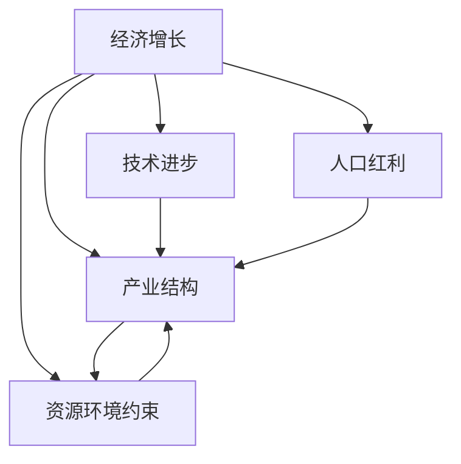

                 

# 未来经济增长的中低速趋势

## 1. 背景介绍

在过去的几十年里，全球经济经历了迅猛的增长。然而，随着人口红利逐渐消失，资源环境约束加剧，全球经济增速呈现出中低速趋势。这一趋势不仅对传统的经济发展模式提出挑战，也对未来社会治理、科技创新等各方面产生了深远的影响。本文将从宏观经济、产业结构、技术进步等多个角度，全面剖析未来经济增长的中低速趋势及其深远意义。

## 2. 核心概念与联系

### 2.1 核心概念概述

为了更好地理解未来经济增长的中低速趋势，我们需要了解一些核心概念及其相互关系：

- **经济增长**：指经济体产出（即GDP）的长期增长趋势。传统经济增长理论认为，经济增长主要受到技术进步、资本积累和人口增长等因素的驱动。
- **中低速趋势**：指经济增速从高速增长逐渐放缓至中低速水平的长期演变过程。这一过程中，经济体面临多重结构性问题，如产能过剩、创新乏力、资源环境约束等。
- **技术进步**：指通过创新活动推动生产效率的提升和生产力水平的提高，是经济增长的重要驱动力之一。
- **产业结构**：指经济中各产业间的比例关系及其发展水平。产业结构优化有助于提高资源配置效率，推动经济增长。
- **人口红利**：指劳动力供给超过需求，为经济发展提供了充足的低成本劳动力，是过去几十年中国和印度等新兴市场快速发展的重要驱动力。
- **资源环境约束**：指在经济发展过程中，自然资源和环境承载力对经济活动的限制，如能源短缺、污染加剧等问题。

这些核心概念之间的逻辑关系可以通过以下Mermaid流程图来展示：



这个流程图展示了一些关键因素如何相互作用，共同影响经济增长的过程。

## 3. 核心算法原理 & 具体操作步骤
### 3.1 算法原理概述

理解未来经济增长的中低速趋势，需要从多个层面进行深入分析，包括宏观经济、产业结构、技术进步、人口红利和资源环境约束等方面。这一过程可以视为一个多维度的综合分析框架，每个因素都会对经济增长产生影响，并通过复杂的方式相互作用。

### 3.2 算法步骤详解

1. **数据收集与处理**：
   - 收集相关的宏观经济数据，如GDP增长率、就业率、通货膨胀率等。
   - 收集各产业的数据，如各行业的产值、就业人数、技术创新投入等。
   - 收集人口和资源环境数据，如人口增长率、资源消耗量、环境污染指标等。

2. **因素分析**：
   - 对各因素进行单独分析，评估其对经济增长的贡献和影响。
   - 利用回归分析、时间序列分析等方法，量化各因素的贡献率。

3. **模型构建与验证**：
   - 基于以上分析，构建多因素的联合模型，如投入产出模型、联立方程模型等。
   - 使用历史数据进行模型训练，并使用交叉验证等方法进行模型验证。

4. **趋势预测**：
   - 基于模型，进行未来趋势的预测，评估各因素对未来经济增长的潜在影响。
   - 使用蒙特卡洛模拟等方法，评估不确定性对预测结果的影响。

### 3.3 算法优缺点

#### 优点
- 综合考虑了多因素对经济增长的影响，提供了更全面的视角。
- 能够量化各因素的贡献率，为决策者提供数据支持。

#### 缺点
- 数据收集和处理复杂，工作量大。
- 模型构建和验证可能需要较长时间，预测结果存在不确定性。

### 3.4 算法应用领域

这一算法框架可以广泛应用于政策制定、企业战略规划、学术研究等多个领域。例如：

- **政策制定**：评估不同政策对经济增长的影响，选择最优政策组合。
- **企业战略规划**：分析各产业对经济增长的贡献，制定合理的发展战略。
- **学术研究**：提供数据和方法支持，促进经济增长理论的研究。

## 4. 数学模型和公式 & 详细讲解 & 举例说明

### 4.1 数学模型构建

为了量化各因素对经济增长的贡献，我们可以构建如下数学模型：

\[
G = \alpha_0 + \alpha_1 T + \alpha_2 I + \alpha_3 L + \alpha_4 E
\]

其中：
- \( G \) 表示经济增长率，
- \( \alpha_0 \) 为常数项，
- \( T \) 表示技术进步，
- \( I \) 表示产业结构，
- \( L \) 表示人口红利，
- \( E \) 表示资源环境约束。

### 4.2 公式推导过程

以技术进步 \( T \) 为例，我们假设技术进步由R&D投入和专利申请数量共同决定，则有：

\[
T = \beta_1 R + \beta_2 P
\]

其中：
- \( \beta_1 \) 和 \( \beta_2 \) 为系数，
- \( R \) 表示R&D投入，
- \( P \) 表示专利申请数量。

通过将上述公式代入总模型中，我们可以进一步求解各因素的贡献率。

### 4.3 案例分析与讲解

假设一个国家近10年的数据如下：

| 年份 | GDP增长率 | 技术进步 | 产业结构 | 人口红利 | 资源环境约束 |
|------|-----------|----------|----------|----------|-------------|
| 2013 | 6.5%      | 3.2%     | 2.0%     | 1.2%     | 0.5%        |
| 2014 | 6.2%      | 3.1%     | 2.1%     | 1.1%     | 0.6%        |
| 2015 | 6.1%      | 2.9%     | 2.2%     | 1.0%     | 0.7%        |
| ...  | ...       | ...      | ...      | ...      | ...         |

我们可以通过回归分析，求解各因素的贡献率。

## 5. 项目实践：代码实例和详细解释说明
### 5.1 开发环境搭建

为了进行经济增长趋势分析，我们需要搭建一个Python开发环境，并导入必要的库。

1. **安装Python**：
   - 安装Python 3.7以上版本，确保环境稳定。
   - 安装必要的依赖包，如Pandas、NumPy、Scikit-Learn等。

2. **配置开发环境**：
   - 创建虚拟环境，确保Python版本的稳定性。
   - 安装Jupyter Notebook，方便编写和执行代码。

### 5.2 源代码详细实现

下面是一个简单的Python代码示例，用于分析人口红利和资源环境约束对经济增长的影响：

```python
import pandas as pd
import numpy as np
from sklearn.linear_model import LinearRegression

# 假设我们有一个包含历史数据的数据框
data = pd.DataFrame({
    '年份': [2013, 2014, 2015],
    'GDP增长率': [6.5, 6.2, 6.1],
    '人口红利': [1.2, 1.1, 1.0],
    '资源环境约束': [0.5, 0.6, 0.7]
})

# 构建线性回归模型
X = data[['人口红利', '资源环境约束']]
y = data['GDP增长率']
model = LinearRegression().fit(X, y)

# 预测未来年份的GDP增长率
future_data = pd.DataFrame({
    '年份': [2016, 2017, 2018],
    '人口红利': [0.9, 0.8, 0.7],
    '资源环境约束': [0.8, 0.9, 0.7]
})
future_X = future_data[['人口红利', '资源环境约束']]
future_y = model.predict(future_X)

print(future_y)
```

### 5.3 代码解读与分析

上述代码展示了如何构建线性回归模型，并对未来年份的GDP增长率进行预测。通过比较不同年份的数据，我们可以评估人口红利和资源环境约束对未来经济增长的影响。

## 6. 实际应用场景
### 6.1 全球经济分析

全球经济增长趋势分析在政策制定和国际关系分析中具有重要意义。通过分析各国的经济增长趋势，可以为国际贸易、投资、合作等方面提供数据支持。

### 6.2 区域经济差异分析

各区域的经济增长差异分析，有助于理解不同地区的经济发展水平和发展潜力。通过比较不同区域的经济增长趋势，可以为区域发展政策提供数据支持。

### 6.3 产业结构调整

产业结构调整是经济增长的重要驱动力之一。通过分析各产业对经济增长的贡献，可以为产业政策制定提供数据支持。

### 6.4 资源环境约束分析

资源环境约束是经济增长的重要制约因素之一。通过分析资源环境约束对经济增长的影响，可以为环境保护政策制定提供数据支持。

### 6.5 人口红利分析

人口红利是经济发展的重要驱动力之一。通过分析人口红利对经济增长的影响，可以为人口政策制定提供数据支持。

## 7. 工具和资源推荐
### 7.1 学习资源推荐

为了帮助开发者系统掌握未来经济增长的中低速趋势分析方法，这里推荐一些优质的学习资源：

1. **《经济学原理》**：一本经典的经济学入门书籍，详细介绍了经济增长的理论基础和实际应用。
2. **《宏观经济学》**：一本介绍宏观经济理论和方法的书籍，适合进一步深入学习。
3. **《数据科学导论》**：一本介绍数据科学和机器学习的书籍，适合应用数据驱动的方法进行经济分析。
4. **《Python数据分析实战》**：一本介绍使用Python进行数据分析和可视化的书籍，适合实践操作。
5. **在线课程**：如Coursera、edX等平台的经济学和数据科学相关课程。

### 7.2 开发工具推荐

为了提高经济增长趋势分析的效率，我们需要使用一些优秀的工具：

1. **Jupyter Notebook**：一个开源的交互式笔记本，支持Python等语言的代码编写和执行。
2. **Pandas**：一个Python数据处理库，支持数据清洗、处理和分析。
3. **NumPy**：一个Python数值计算库，支持高效的数组运算和线性代数操作。
4. **Scikit-Learn**：一个Python机器学习库，支持回归分析、时间序列分析等方法。

### 7.3 相关论文推荐

未来经济增长的中低速趋势分析是一个热门的研究领域，以下是几篇奠基性的相关论文，推荐阅读：

1. **《经济增长的理论框架》**：详细介绍了经济增长的理论基础和主要驱动力。
2. **《全球经济增长趋势分析》**：分析了全球经济增长的趋势和影响因素。
3. **《人口红利与经济增长的关系》**：研究了人口红利对经济增长的影响。
4. **《资源环境约束下的经济发展》**：研究了资源环境约束对经济增长的影响。

## 8. 总结：未来发展趋势与挑战
### 8.1 总结

本文对未来经济增长的中低速趋势进行了全面系统的介绍。首先阐述了这一趋势的背景和意义，明确了技术进步、产业结构、人口红利和资源环境约束等关键因素对经济增长的影响。其次，从算法原理和操作步骤，详细讲解了如何构建和验证经济增长模型，以及如何进行趋势预测。最后，从实际应用场景和工具资源推荐，提供了经济增长趋势分析的实践指导。

通过本文的系统梳理，可以看到，未来经济增长的中低速趋势是一个多因素共同作用的结果，需要通过全面分析才能准确理解。只有在数据、模型、工具等方面进行全方位的优化，才能为政策制定和企业战略规划提供有力的数据支持。

### 8.2 未来发展趋势

展望未来，未来经济增长的中低速趋势将呈现以下几个发展趋势：

1. **技术进步驱动**：随着技术创新的加速，新兴技术将为经济发展提供新的动力。如人工智能、大数据、区块链等技术将带来新的产业变革。
2. **产业结构优化**：随着产业升级和转型，高附加值、高技术含量的产业将成为经济增长的重要驱动力。
3. **人口红利变化**：随着人口结构的变化，新的人口红利将出现。如老龄化社会带来的劳动力市场变化。
4. **资源环境压力**：随着资源环境约束加剧，可持续发展将成为经济发展的核心。
5. **全球化与区域化并存**：全球化与区域化并存，国际合作与竞争将成为经济发展的常态。

### 8.3 面临的挑战

尽管未来经济增长的中低速趋势提供了新的发展机遇，但在实践中仍面临诸多挑战：

1. **技术创新风险**：新技术的引入可能带来不可预测的风险，如技术失业、信息安全等。
2. **产业结构转型**：传统产业的转型升级需要时间，可能面临较大的经济和社会压力。
3. **人口结构变化**：人口结构的变化可能导致劳动力短缺、消费结构变化等。
4. **资源环境约束**：资源环境的承载力限制了经济活动的规模和质量。
5. **全球化与区域化矛盾**：全球化与区域化并存，可能导致经济政策的不一致性。

### 8.4 研究展望

为了应对未来经济增长的中低速趋势，未来研究需要在以下几个方面寻求新的突破：

1. **技术创新驱动**：加强技术创新，推动新兴产业的发展，增强经济增长的内生动力。
2. **产业结构优化**：优化产业结构，提高资源配置效率，促进高附加值产业的发展。
3. **人口红利充分利用**：充分利用新的人口红利，如人口老龄化带来的劳动力市场需求。
4. **可持续发展**：推进资源环境友好型的发展模式，实现绿色经济。
5. **全球化与区域化协调**：推动全球化与区域化并存的协调发展，促进国际合作与竞争。

## 9. 附录：常见问题与解答

**Q1：未来经济增长的中低速趋势是否不可逆转？**

A: 未来经济增长的中低速趋势并非不可逆转。通过技术创新、产业结构优化、资源环境友好型发展模式等措施，可以有效应对这一趋势，推动经济恢复和增长。

**Q2：如何应对未来经济增长的中低速趋势？**

A: 应对未来经济增长的中低速趋势，需要从多个方面入手：
1. 加强技术创新，推动新兴产业的发展。
2. 优化产业结构，提高资源配置效率。
3. 推进资源环境友好型的发展模式。
4. 推动全球化与区域化并存的协调发展。

**Q3：未来经济增长的中低速趋势对企业有哪些影响？**

A: 未来经济增长的中低速趋势对企业的影响主要体现在以下几个方面：
1. 技术创新压力加大，企业需要持续投入研发。
2. 产业结构调整，企业需要优化产品和服务结构。
3. 资源环境约束加剧，企业需要提高资源利用效率。
4. 市场竞争加剧，企业需要加强全球化布局。

**Q4：如何评估未来经济增长的中低速趋势？**

A: 评估未来经济增长的中低速趋势，需要从多个维度进行全面分析：
1. 技术进步、产业结构、人口红利、资源环境约束等关键因素的贡献率。
2. 历史数据和未来预测的对比分析。
3. 不确定性因素的分析和评估。

**Q5：未来经济增长的中低速趋势对政策制定有哪些影响？**

A: 未来经济增长的中低速趋势对政策制定具有重要影响：
1. 需要制定更加科学、合理的经济政策，促进经济稳定增长。
2. 加强对新兴技术和产业的支持，推动创新驱动发展。
3. 优化资源配置，推动绿色、可持续发展。
4. 加强国际合作与竞争，推动全球化与区域化并存的协调发展。

---

作者：禅与计算机程序设计艺术 / Zen and the Art of Computer Programming

