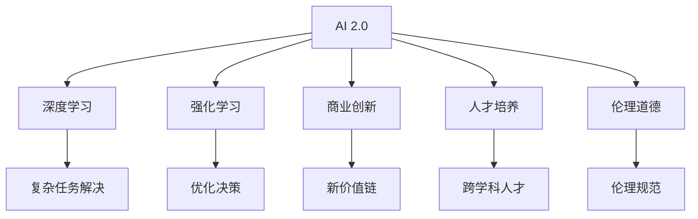

                 

# 李开复：AI 2.0 时代的价值

> 关键词：AI 2.0, 人工智能, 价值, 创新, 商业化, 人才培养, 伦理道德

## 1. 背景介绍

### 1.1 问题由来
随着技术的飞速发展，人工智能(AI)已经成为推动全球经济增长、改善社会福祉的关键力量。AI 2.0时代，以深度学习、强化学习等为代表的新一代AI技术，正在逐步打破传统产业的束缚，重塑各行业的商业模式和运营方式。然而，与此同时，AI 2.0时代的来临也带来了诸多挑战，如数据隐私、伦理道德、安全性等问题，需要社会各界共同面对。

本文旨在探讨AI 2.0时代的价值，分析其在技术进步、商业创新、人才培养以及伦理道德等方面的影响，并对未来AI的发展趋势进行展望。

### 1.2 问题核心关键点
AI 2.0时代的核心价值体现在以下几个方面：
1. **技术进步**：AI技术的不断突破，使机器能够理解和执行复杂任务，推动了科学研究的跨越式发展。
2. **商业创新**：AI在各行各业的应用，催生了新的商业模式和价值链，提升了企业的竞争力。
3. **人才培养**：AI的发展需要大量跨学科的顶尖人才，推动了教育体系和职业培训的创新。
4. **伦理道德**：AI技术的广泛应用引发了伦理道德问题，需要构建合理的规范体系，确保技术的健康发展。

这些关键点构成了AI 2.0时代的主要研究领域和实践方向，本文将深入探讨这些方面的具体内容。

## 2. 核心概念与联系

### 2.1 核心概念概述

为更好地理解AI 2.0时代的价值，本节将介绍几个关键概念：

- **AI 2.0**：新一代AI技术，以深度学习、强化学习等为代表，能够进行复杂的任务理解和执行。
- **深度学习**：一种机器学习方法，通过多层神经网络模型从数据中自动提取特征，实现端到端的任务解决。
- **强化学习**：一种通过奖励和惩罚机制，使AI系统不断优化决策的机器学习方法。
- **商业创新**：AI技术在各行各业的应用，推动了新的商业模式和价值链的形成。
- **人才培养**：AI的发展需要跨学科的顶尖人才，推动了教育体系和职业培训的创新。
- **伦理道德**：AI技术应用过程中涉及的伦理道德问题，如隐私保护、公平性、责任归属等，需要建立合理的规范体系。

这些核心概念之间的逻辑关系可以通过以下Mermaid流程图来展示：



这个流程图展示了AI 2.0时代的核心概念及其之间的关系：

1. AI 2.0通过深度学习和强化学习技术，实现复杂任务的解决和决策优化。
2. AI 2.0在商业创新方面，推动了新的商业模式和价值链的形成。
3. AI 2.0的发展需要跨学科的顶尖人才，推动了教育体系和职业培训的创新。
4. AI 2.0的应用涉及诸多伦理道德问题，需要建立合理的规范体系。

这些概念共同构成了AI 2.0时代的整体框架，使得AI技术能够更好地服务于社会和经济的发展。

## 3. 核心算法原理 & 具体操作步骤
### 3.1 算法原理概述

AI 2.0时代的技术进步主要基于深度学习和强化学习算法，其核心思想是通过大量数据训练模型，使机器能够自动提取数据中的复杂特征，实现高效的决策和任务执行。

### 3.2 算法步骤详解

AI 2.0时代的技术实现一般包括以下几个关键步骤：

**Step 1: 数据收集与预处理**
- 收集相关的数据集，并进行数据清洗、标注等预处理操作，确保数据的质量和一致性。

**Step 2: 模型训练**
- 使用深度学习或强化学习算法，训练模型在数据集上进行端到端的任务解决。
- 通过调整模型参数和优化算法，最小化损失函数，提高模型性能。

**Step 3: 模型评估与优化**
- 在验证集上评估模型的性能，使用交叉验证、混淆矩阵等指标进行模型评估。
- 根据评估结果，进行模型优化，如增加层数、调整超参数等。

**Step 4: 模型部署与应用**
- 将训练好的模型部署到生产环境，进行实时任务处理。
- 对模型进行监控和维护，确保模型性能稳定。

### 3.3 算法优缺点

AI 2.0时代的深度学习和强化学习算法具有以下优点：
1. 自动化特征提取：通过多层神经网络模型，自动提取数据的复杂特征，避免了手动特征工程的繁琐。
2. 高泛化能力：通过大量数据训练，模型能够适应不同场景和任务。
3. 端到端训练：从原始数据到最终任务的端到端训练，提升了模型的整体性能。

同时，这些算法也存在一定的局限性：
1. 数据依赖性强：深度学习和强化学习算法需要大量的标注数据和训练时间。
2. 模型复杂度高：大规模深度神经网络的训练和优化，需要高性能计算资源。
3. 可解释性不足：复杂模型的内部机制难以解释，缺乏透明性。

尽管存在这些局限性，AI 2.0时代的技术进步仍为各行业带来了巨大的变革潜力。

### 3.4 算法应用领域

AI 2.0时代的技术在多个领域得到了广泛应用，具体包括：

1. **医疗健康**：AI在医学影像诊断、个性化治疗、药物研发等领域，提升了医疗服务的效率和质量。
2. **金融科技**：AI在风险控制、投资策略、客户服务等方面，推动了金融行业的数字化转型。
3. **零售电商**：AI在推荐系统、库存管理、客户体验优化等方面，提升了零售电商的运营效率和用户体验。
4. **智能制造**：AI在质量控制、工艺优化、设备维护等方面，推动了制造业的智能化升级。
5. **自动驾驶**：AI在车辆控制、路径规划、环境感知等方面，推动了自动驾驶技术的快速发展。
6. **智慧城市**：AI在交通管理、能源管理、公共安全等方面，提升了城市的智能化水平。

AI 2.0技术在上述领域的广泛应用，展示了其巨大的应用潜力和市场前景。

## 4. 数学模型和公式 & 详细讲解 & 举例说明

### 4.1 数学模型构建

本节将使用数学语言对AI 2.0时代的深度学习模型进行更加严格的刻画。

记深度神经网络模型为 $M_{\theta}(x)$，其中 $x$ 为输入数据，$\theta$ 为模型参数。假设训练集为 $D=\{(x_i,y_i)\}_{i=1}^N$，其中 $y_i$ 为标签。

定义模型 $M_{\theta}$ 在数据样本 $(x,y)$ 上的损失函数为 $\ell(M_{\theta}(x),y)$，则在数据集 $D$ 上的经验风险为：

$$
\mathcal{L}(\theta) = \frac{1}{N}\sum_{i=1}^N \ell(M_{\theta}(x_i),y_i)
$$

通过梯度下降等优化算法，最小化损失函数 $\mathcal{L}(\theta)$，即可得到最优模型参数 $\theta^*$。

### 4.2 公式推导过程

以二分类任务为例，推导交叉熵损失函数及其梯度的计算公式。

假设模型 $M_{\theta}$ 在输入 $x$ 上的输出为 $\hat{y}=M_{\theta}(x) \in [0,1]$，表示样本属于正类的概率。真实标签 $y \in \{0,1\}$。则二分类交叉熵损失函数定义为：

$$
\ell(M_{\theta}(x),y) = -[y\log \hat{y} + (1-y)\log (1-\hat{y})]
$$

将其代入经验风险公式，得：

$$
\mathcal{L}(\theta) = -\frac{1}{N}\sum_{i=1}^N [y_i\log M_{\theta}(x_i)+(1-y_i)\log(1-M_{\theta}(x_i))]
$$

根据链式法则，损失函数对参数 $\theta_k$ 的梯度为：

$$
\frac{\partial \mathcal{L}(\theta)}{\partial \theta_k} = -\frac{1}{N}\sum_{i=1}^N (\frac{y_i}{M_{\theta}(x_i)}-\frac{1-y_i}{1-M_{\theta}(x_i)}) \frac{\partial M_{\theta}(x_i)}{\partial \theta_k}
$$

其中 $\frac{\partial M_{\theta}(x_i)}{\partial \theta_k}$ 可进一步递归展开，利用自动微分技术完成计算。

在得到损失函数的梯度后，即可带入参数更新公式，完成模型的迭代优化。重复上述过程直至收敛，最终得到适应下游任务的最优模型参数 $\theta^*$。

## 5. 项目实践：代码实例和详细解释说明
### 5.1 开发环境搭建

在进行AI 2.0时代的深度学习项目实践前，我们需要准备好开发环境。以下是使用Python进行TensorFlow开发的环境配置流程：

1. 安装Anaconda：从官网下载并安装Anaconda，用于创建独立的Python环境。

2. 创建并激活虚拟环境：
```bash
conda create -n tf-env python=3.8 
conda activate tf-env
```

3. 安装TensorFlow：根据CUDA版本，从官网获取对应的安装命令。例如：
```bash
conda install tensorflow tensorflow-gpu -c conda-forge
```

4. 安装各类工具包：
```bash
pip install numpy pandas scikit-learn matplotlib tqdm jupyter notebook ipython
```

完成上述步骤后，即可在`tf-env`环境中开始AI 2.0时代深度学习项目的开发。

### 5.2 源代码详细实现

这里我们以图像分类任务为例，给出使用TensorFlow进行卷积神经网络(CNN)训练的Python代码实现。

首先，定义图像分类任务的数据处理函数：

```python
import tensorflow as tf
import numpy as np
import matplotlib.pyplot as plt

def load_dataset(data_dir, batch_size):
    image_dir = os.path.join(data_dir, 'train')
    label_dir = os.path.join(data_dir, 'train_labels')
    images = []
    labels = []
    for img_name in os.listdir(image_dir):
        img_path = os.path.join(image_dir, img_name)
        img = plt.imread(img_path)
        img = cv2.cvtColor(img, cv2.COLOR_BGR2RGB)
        img = img / 255.0
        label = int(os.path.basename(label_dir, '/').replace('label_', ''))
        images.append(img)
        labels.append(label)
    images = np.array(images)
    labels = np.array(labels)
    return images, labels, batch_size

def shuffle_dataset(dataset, batch_size):
    np.random.shuffle(dataset)
    for i in range(0, len(dataset), batch_size):
        yield dataset[i:i+batch_size]
```

然后，定义模型和损失函数：

```python
from tensorflow.keras import layers

class CNNModel(tf.keras.Model):
    def __init__(self, num_classes):
        super(CNNModel, self).__init__()
        self.conv1 = layers.Conv2D(32, 3, activation='relu')
        self.pool1 = layers.MaxPooling2D()
        self.conv2 = layers.Conv2D(64, 3, activation='relu')
        self.pool2 = layers.MaxPooling2D()
        self.flatten = layers.Flatten()
        self.dense1 = layers.Dense(128, activation='relu')
        self.dense2 = layers.Dense(num_classes, activation='softmax')
    
    def call(self, x):
        x = self.conv1(x)
        x = self.pool1(x)
        x = self.conv2(x)
        x = self.pool2(x)
        x = self.flatten(x)
        x = self.dense1(x)
        x = self.dense2(x)
        return x

model = CNNModel(num_classes=10)

loss_fn = tf.keras.losses.SparseCategoricalCrossentropy(from_logits=True)
optimizer = tf.keras.optimizers.Adam(learning_rate=0.001)
```

接着，定义训练和评估函数：

```python
def train_step(images, labels):
    with tf.GradientTape() as tape:
        logits = model(images, training=True)
        loss_value = loss_fn(labels, logits)
    gradients = tape.gradient(loss_value, model.trainable_variables)
    optimizer.apply_gradients(zip(gradients, model.trainable_variables))
    return loss_value

def evaluate(images, labels):
    logits = model(images, training=False)
    loss_value = loss_fn(labels, logits)
    return loss_value

def train_epoch(model, dataset, batch_size):
    model.train()
    epoch_loss = 0
    for images, labels in dataset:
        loss = train_step(images, labels)
        epoch_loss += loss
    return epoch_loss / len(dataset)
    
def evaluate_epoch(model, dataset, batch_size):
    model.eval()
    epoch_loss = 0
    for images, labels in dataset:
        loss = evaluate(images, labels)
        epoch_loss += loss
    return epoch_loss / len(dataset)
```

最后，启动训练流程并在测试集上评估：

```python
data_dir = '/path/to/dataset'
batch_size = 32
num_epochs = 10

for epoch in range(num_epochs):
    train_loss = train_epoch(model, load_dataset(data_dir, batch_size), batch_size)
    test_loss = evaluate_epoch(model, load_dataset(data_dir, batch_size), batch_size)
    print(f'Epoch {epoch+1}, train loss: {train_loss:.3f}, test loss: {test_loss:.3f}')
```

以上就是使用TensorFlow进行CNN图像分类任务训练的完整代码实现。可以看到，TensorFlow的高级API使得深度学习模型的构建和训练变得简洁高效。

### 5.3 代码解读与分析

让我们再详细解读一下关键代码的实现细节：

**CNNModel类**：
- `__init__`方法：初始化卷积层、池化层、全连接层等组件。
- `call`方法：定义模型的前向传播过程。

**loss_fn和optimizer**：
- `loss_fn`：定义交叉熵损失函数，用于计算模型预测输出与真实标签之间的差异。
- `optimizer`：定义Adam优化器，用于最小化损失函数。

**train_step和evaluate方法**：
- `train_step`方法：在训练集上进行前向传播和反向传播，计算损失并更新模型参数。
- `evaluate`方法：在测试集上进行前向传播，计算损失并输出结果。

**train_epoch和evaluate_epoch方法**：
- `train_epoch`方法：在训练集上循环迭代，计算每个batch的损失并累加。
- `evaluate_epoch`方法：在测试集上循环迭代，计算每个batch的损失并累加。

可以看到，TensorFlow的高级API和Keras框架使得深度学习模型的实现变得简单易懂。开发者可以将更多精力放在数据处理、模型设计等高层逻辑上，而不必过多关注底层的实现细节。

当然，工业级的系统实现还需考虑更多因素，如模型的保存和部署、超参数的自动搜索、更灵活的任务适配层等。但核心的训练过程基本与此类似。

## 6. 实际应用场景
### 6.1 智能制造

AI 2.0时代的技术在智能制造领域得到了广泛应用，推动了制造业的智能化升级。AI技术在质量控制、工艺优化、设备维护等方面，提升了制造业的效率和质量。

在质量控制方面，AI可以通过视觉识别技术，自动检测产品表面缺陷、尺寸误差等。例如，使用深度学习模型对图像进行分类和分割，实现自动检测和分类，提升质量控制效率和准确性。

在工艺优化方面，AI可以通过数据分析和机器学习，优化生产流程和资源配置。例如，使用强化学习模型，实时调整生产线的速度和负载，实现动态优化。

在设备维护方面，AI可以通过故障预测和预测性维护，减少设备停机时间。例如，使用深度学习模型对设备运行数据进行分析，预测设备故障，提前进行维护。

### 6.2 智慧医疗

AI 2.0时代的技术在医疗领域的应用，提升了医疗服务的效率和质量，推动了医疗行业的数字化转型。AI在医学影像诊断、个性化治疗、药物研发等方面，提升了医疗服务的效率和质量。

在医学影像诊断方面，AI可以通过图像处理和深度学习模型，自动识别和诊断肿瘤、病变等医学影像。例如，使用卷积神经网络模型对医学影像进行分类和分割，实现自动诊断。

在个性化治疗方面，AI可以通过数据分析和机器学习，制定个性化的治疗方案。例如，使用深度学习模型对患者的基因信息、病历数据进行分析，制定个性化的治疗方案。

在药物研发方面，AI可以通过数据分析和机器学习，加速新药的发现和研发。例如，使用强化学习模型，优化药物分子的合成路径，加速新药的研发。

### 6.3 智能交通

AI 2.0时代的技术在智能交通领域的应用，提升了交通管理的效率和安全性，推动了智能交通的发展。AI在交通流量预测、车辆控制、路径规划等方面，提升了交通管理的效率和安全性。

在交通流量预测方面，AI可以通过数据分析和机器学习，预测交通流量和交通拥堵情况。例如，使用深度学习模型对历史交通数据进行分析，预测未来的交通流量和拥堵情况。

在车辆控制方面，AI可以通过自动驾驶和智能导航，提升车辆的控制精度和安全性。例如，使用强化学习模型，控制自动驾驶车辆在复杂交通环境中的行为，实现安全行驶。

在路径规划方面，AI可以通过数据分析和机器学习，优化路径规划算法。例如，使用深度学习模型对交通数据进行分析，优化路径规划算法，减少交通拥堵。

## 7. 工具和资源推荐
### 7.1 学习资源推荐

为了帮助开发者系统掌握AI 2.0时代的深度学习理论基础和实践技巧，这里推荐一些优质的学习资源：

1. **Deep Learning Specialization by Andrew Ng**：由Coursera推出的深度学习课程，涵盖深度学习的基本概念和核心算法，适合初学者入门。

2. **Reinforcement Learning: An Introduction by Sutton and Barto**：介绍了强化学习的理论基础和实践技巧，是学习强化学习的重要参考资料。

3. **TensorFlow官方文档**：TensorFlow的官方文档，提供了丰富的教程和样例代码，是学习TensorFlow的必备资源。

4. **PyTorch官方文档**：PyTorch的官方文档，提供了丰富的教程和样例代码，是学习PyTorch的必备资源。

5. **Keras官方文档**：Keras的官方文档，提供了丰富的教程和样例代码，是学习Keras的必备资源。

通过对这些资源的学习实践，相信你一定能够快速掌握AI 2.0时代的深度学习理论和实践技能，并用于解决实际的AI问题。

### 7.2 开发工具推荐

高效的开发离不开优秀的工具支持。以下是几款用于AI 2.0时代深度学习开发的常用工具：

1. **TensorFlow**：由Google主导开发的深度学习框架，灵活的计算图设计，适合大规模工程应用。

2. **PyTorch**：由Facebook主导开发的深度学习框架，灵活的动态计算图设计，适合快速迭代研究。

3. **Keras**：由Google主导开发的高级神经网络API，简单易用，适合初学者和快速原型开发。

4. **Jupyter Notebook**：交互式的开发环境，支持Python、R等多种编程语言，适合数据探索和模型验证。

5. **Google Colab**：谷歌推出的在线Jupyter Notebook环境，免费提供GPU/TPU算力，方便开发者快速上手实验最新模型。

合理利用这些工具，可以显著提升AI 2.0时代深度学习项目的开发效率，加快创新迭代的步伐。

### 7.3 相关论文推荐

AI 2.0时代的技术发展得益于学界的持续研究。以下是几篇奠基性的相关论文，推荐阅读：

1. **ImageNet Classification with Deep Convolutional Neural Networks**：AlexNet论文，提出深度卷积神经网络模型，开启了深度学习时代。

2. **Deep Residual Learning for Image Recognition**：ResNet论文，提出残差连接结构，解决了深度神经网络中的梯度消失问题。

3. **Attention is All You Need**：Transformer论文，提出Transformer模型，开启了大规模预训练语言模型的时代。

4. **Playing Atari with Deep Reinforcement Learning**：AlphaGo论文，提出深度强化学习模型，实现了在复杂游戏中的自我对弈。

5. **AlphaGo Zero**：AlphaGo Zero论文，提出自我对弈技术，实现了在没有人类专家指导的情况下，从零开始学习和超越人类水平。

这些论文代表了大规模预训练语言模型和深度强化学习技术的发展脉络。通过学习这些前沿成果，可以帮助研究者把握学科前进方向，激发更多的创新灵感。

## 8. 总结：未来发展趋势与挑战

### 8.1 总结

本文对AI 2.0时代的深度学习技术进行了全面系统的介绍。首先探讨了AI 2.0时代的价值，明确了深度学习在技术进步、商业创新、人才培养以及伦理道德等方面的影响。其次，从原理到实践，详细讲解了深度学习模型的数学原理和关键步骤，给出了深度学习任务开发的完整代码实例。同时，本文还广泛探讨了深度学习技术在智能制造、智慧医疗、智能交通等多个领域的应用前景，展示了深度学习技术的巨大应用潜力和市场前景。此外，本文精选了深度学习技术的各类学习资源，力求为读者提供全方位的技术指引。

通过本文的系统梳理，可以看到，AI 2.0时代的深度学习技术正在成为推动各行业发展的关键力量，极大地拓展了深度学习应用的范围和深度。未来，伴随深度学习技术的不断演进，深度学习技术必将在更多领域得到应用，为人类社会的进步带来新的动力。

### 8.2 未来发展趋势

展望未来，深度学习技术的进步将呈现以下几个发展趋势：

1. **更高效的模型结构**：未来的深度学习模型将朝着更加高效的方向发展，通过结构优化和参数压缩，提高模型推理速度和计算效率。

2. **更强大的泛化能力**：未来的深度学习模型将具备更强的泛化能力，能够处理更多样化、更复杂的数据和任务。

3. **更广泛的适用场景**：未来的深度学习技术将适用于更多行业和领域，推动各行各业的智能化转型。

4. **更灵活的迁移学习**：未来的深度学习技术将更加灵活，能够实现跨领域、跨任务的迁移学习，提升模型的适应性和可迁移性。

5. **更深入的理论研究**：未来的深度学习研究将更加深入，涵盖更广泛的理论和方法，推动深度学习技术的进一步突破。

这些趋势凸显了深度学习技术的广阔前景，AI 2.0时代将为各行业带来更加强大的智能化支持。

### 8.3 面临的挑战

尽管深度学习技术已经取得了瞩目成就，但在迈向更加智能化、普适化应用的过程中，它仍面临着诸多挑战：

1. **数据依赖性强**：深度学习算法需要大量的标注数据和训练时间，对数据获取和处理提出了更高的要求。

2. **模型复杂度高**：大规模深度神经网络的训练和优化，需要高性能计算资源，增加了应用成本。

3. **可解释性不足**：深度学习模型的内部机制难以解释，缺乏透明性，增加了应用的复杂性和风险。

4. **伦理道德问题**：深度学习技术的广泛应用引发了诸多伦理道德问题，如隐私保护、公平性、责任归属等，需要建立合理的规范体系。

5. **安全性问题**：深度学习模型的脆弱性可能导致安全漏洞，增加了系统的风险。

6. **资源消耗大**：深度学习模型的训练和推理需要大量的计算资源和存储空间，增加了系统的成本。

这些挑战需要在未来进一步解决，以确保深度学习技术的健康发展。

### 8.4 研究展望

面对深度学习面临的挑战，未来的研究需要在以下几个方面寻求新的突破：

1. **更高效的数据获取和处理**：探索更高效的数据采集和预处理技术，减少对标注数据的依赖，降低应用成本。

2. **更灵活的迁移学习**：开发更灵活的迁移学习算法，实现跨领域、跨任务的迁移学习，提升模型的适应性和可迁移性。

3. **更强大的泛化能力**：开发更强大的泛化能力，使得深度学习模型能够处理更多样化、更复杂的数据和任务。

4. **更高效的模型结构**：开发更高效的模型结构，通过结构优化和参数压缩，提高模型推理速度和计算效率。

5. **更深入的理论研究**：深入研究深度学习模型的内部机制，提高模型的透明性和可解释性，增强系统的可信度和安全性。

6. **更全面的伦理道德规范**：构建更全面的伦理道德规范，确保深度学习技术的应用符合人类价值观和伦理道德。

这些研究方向将引领深度学习技术的进一步发展，推动深度学习技术在更多领域的落地应用。

## 9. 附录：常见问题与解答

**Q1：深度学习技术是否适用于所有NLP任务？**

A: 深度学习技术在大多数NLP任务上都能取得不错的效果，特别是对于数据量较大的任务。但对于一些特定领域的任务，如医学、法律等，仅仅依靠通用语料预训练的模型可能难以很好地适应。此时需要在特定领域语料上进一步预训练，再进行微调，才能获得理想效果。此外，对于一些需要时效性、个性化很强的任务，如对话、推荐等，深度学习技术也需要针对性的改进优化。

**Q2：深度学习模型是否需要进行超参数调优？**

A: 是的，深度学习模型通常需要超参数调优，以获得最佳的性能。常用的超参数包括学习率、批大小、优化器等。通过调整超参数，可以避免过拟合、提高模型泛化能力。常用的超参数调优方法包括网格搜索、随机搜索、贝叶斯优化等。

**Q3：深度学习模型如何避免过拟合？**

A: 深度学习模型容易发生过拟合，特别是在训练数据较少的情况下。常用的避免过拟合的方法包括：

1. 数据增强：通过对训练数据进行扩充，增加数据多样性，避免模型对特定样本的过拟合。
2. 正则化：通过L2正则、Dropout等技术，限制模型的复杂度，避免过拟合。
3. 早停法：在验证集上监控模型性能，当模型性能不再提升时，停止训练，避免过拟合。
4. 模型压缩：通过模型剪枝、参数共享等技术，减少模型复杂度，避免过拟合。

这些方法可以有效避免深度学习模型的过拟合问题。

**Q4：深度学习模型在落地部署时需要注意哪些问题？**

A: 将深度学习模型转化为实际应用，还需要考虑以下因素：

1. 模型裁剪：去除不必要的层和参数，减小模型尺寸，加快推理速度。
2. 量化加速：将浮点模型转为定点模型，压缩存储空间，提高计算效率。
3. 服务化封装：将模型封装为标准化服务接口，便于集成调用。
4. 弹性伸缩：根据请求流量动态调整资源配置，平衡服务质量和成本。
5. 监控告警：实时采集系统指标，设置异常告警阈值，确保服务稳定性。
6. 安全防护：采用访问鉴权、数据脱敏等措施，保障数据和模型安全。

深度学习模型在实际部署时，需要考虑多方面的因素，确保系统的稳定性和安全性。

---

作者：禅与计算机程序设计艺术 / Zen and the Art of Computer Programming

