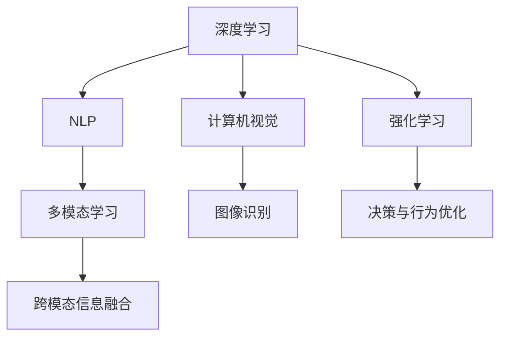

                 

# 李开复：AI 2.0 时代的价值

## 1. 背景介绍

### 1.1 问题由来
AI 2.0时代，人工智能技术已经从实验室走入各行各业，成为驱动创新和变革的关键力量。随着深度学习、自然语言处理、计算机视觉等技术的飞速发展，AI在医疗、教育、金融、制造等多个领域展现出巨大的潜力，颠覆了传统业务模式，带来了前所未有的商业机会。

AI 2.0时代的到来，不仅仅是技术的进步，更是社会和经济发展的必然趋势。本文将深入探讨AI 2.0时代的价值，并分析其在未来发展中面临的挑战和机遇。

## 2. 核心概念与联系

### 2.1 核心概念概述

AI 2.0，通常被定义为第二代人工智能，相比于第一代基于规则的AI，AI 2.0更注重数据驱动、自我学习和大规模的深度神经网络。其核心概念包括：

- 深度学习：一种基于神经网络的机器学习技术，通过多层次的特征提取和表示学习，实现复杂模式的识别和预测。
- 自然语言处理（NLP）：使计算机能够理解和处理人类语言的技术，包括文本分类、情感分析、机器翻译、对话系统等。
- 计算机视觉（CV）：让计算机“看”的能力，通过图像识别、目标检测、图像生成等技术，实现视觉数据的分析和应用。
- 强化学习：通过与环境的交互，让机器学习最优策略，实现自主决策和行为优化。
- 多模态学习：整合视觉、文本、音频等多源信息，提升模型的综合理解和处理能力。

这些核心概念构成了AI 2.0技术的基石，并在实际应用中相互交织，形成了复杂的知识网络。

### 2.2 核心概念原理和架构的 Mermaid 流程图(Mermaid 流程节点中不要有括号、逗号等特殊字符)



## 3. 核心算法原理 & 具体操作步骤

### 3.1 算法原理概述

AI 2.0时代的核心算法包括深度学习、卷积神经网络（CNN）、递归神经网络（RNN）、长短期记忆网络（LSTM）、Transformer等。这些算法通过复杂的神经网络结构，对大量数据进行特征提取和表示学习，构建出能够处理复杂任务的高效模型。

AI 2.0的计算框架包括TensorFlow、PyTorch、Keras等，这些框架提供了强大的工具，帮助开发者高效构建、训练和部署深度学习模型。

### 3.2 算法步骤详解

AI 2.0的典型开发流程包括以下几个步骤：

1. **数据准备**：收集、清洗和标注数据集，确保数据的质量和多样性。数据集的质量直接决定了模型的性能。
2. **模型选择与搭建**：选择合适的深度学习框架和模型结构，如卷积神经网络（CNN）、循环神经网络（RNN）、长短期记忆网络（LSTM）或Transformer等，根据任务特点进行模型搭建。
3. **模型训练与优化**：使用梯度下降等优化算法，对模型进行训练和参数优化，提高模型准确率。
4. **模型评估与调优**：在验证集上评估模型性能，根据评估结果调整模型结构、超参数等，进一步提升模型性能。
5. **模型部署与监控**：将训练好的模型部署到生产环境，并持续监控模型性能和数据质量，确保模型在实际应用中稳定运行。

### 3.3 算法优缺点

AI 2.0技术的优点在于：

- 强大的学习能力：深度神经网络能够从大量数据中学习复杂的模式和规律，实现高效的特征提取和表示学习。
- 广泛的适用性：AI 2.0技术可以应用于多个领域，如医疗、教育、金融、制造等，为各行各业带来创新和变革。
- 自我适应：通过不断地训练和优化，AI 2.0模型能够自我适应新数据和新任务，提升性能。

然而，AI 2.0技术也存在一些缺点：

- 数据依赖性强：深度学习模型需要大量的标注数据，数据的质量和多样性直接影响模型的性能。
- 计算资源需求高：深度学习模型的训练和推理需要大量的计算资源，成本较高。
- 模型解释性不足：深度学习模型通常是"黑盒"模型，难以解释其内部工作机制，模型的可解释性亟待提升。

### 3.4 算法应用领域

AI 2.0技术在医疗、教育、金融、制造等多个领域展现出巨大的潜力，以下是一些典型的应用场景：

1. **医疗领域**：通过深度学习和计算机视觉技术，AI 2.0可以辅助医生进行疾病诊断、医学影像分析、基因测序等，提高诊断准确率和治疗效果。
2. **教育领域**：利用NLP和自然语言处理技术，AI 2.0可以为学生提供个性化学习建议、智能答疑、作业批改等，提升教育质量和效率。
3. **金融领域**：通过数据分析和机器学习技术，AI 2.0可以预测市场趋势、识别欺诈行为、优化投资策略，提升金融服务的精准度和效率。
4. **制造领域**：通过计算机视觉和机器学习技术，AI 2.0可以实现质量检测、设备维护、生产调度等，提升制造业的生产效率和自动化水平。

## 4. 数学模型和公式 & 详细讲解 & 举例说明

### 4.1 数学模型构建

AI 2.0的核心数学模型包括神经网络、卷积神经网络（CNN）、循环神经网络（RNN）、长短期记忆网络（LSTM）等。以卷积神经网络为例，其核心模型如下：

$$
f(x;W,b) = \max_{k \in C} \left[ \sum_{i,j} x_{ij}W^i_k b_j + b_k \right]
$$

其中，$x$为输入数据，$W$为卷积核权重，$b$为偏置项，$C$为卷积核通道数，$W^i_k$为第$i$层的第$k$个卷积核的权重，$b_j$为第$i$层第$j$个神经元的偏置项。

### 4.2 公式推导过程

卷积神经网络的核心推导过程如下：

1. 卷积运算：将输入数据$x$与卷积核$W$进行卷积运算，得到卷积结果。
2. 激活函数：对卷积结果进行激活函数操作，引入非线性特性。
3. 池化操作：对激活结果进行池化操作，降低数据维度，提升模型的泛化能力。
4. 全连接层：将池化结果输入全连接层，进行特征分类和输出。

### 4.3 案例分析与讲解

以医疗领域的疾病诊断为例，AI 2.0技术可以通过深度学习和计算机视觉技术，对医学影像进行自动分析和诊断。具体步骤包括：

1. 收集和标注医学影像数据集，确保数据的多样性和代表性。
2. 使用卷积神经网络（CNN）模型，对医学影像进行特征提取和分类。
3. 在标注数据上进行模型训练和优化，提高模型准确率。
4. 在测试集上评估模型性能，并根据结果调整模型参数。
5. 将训练好的模型部署到医疗系统中，辅助医生进行疾病诊断和治疗。

## 5. 项目实践：代码实例和详细解释说明

### 5.1 开发环境搭建

在开发AI 2.0项目时，需要配置好开发环境。以下是一个简单的Python环境搭建步骤：

1. 安装Anaconda：
```bash
conda install anaconda
```

2. 创建虚拟环境：
```bash
conda create -n ai2_env python=3.8
conda activate ai2_env
```

3. 安装相关库：
```bash
pip install numpy pandas scikit-learn matplotlib pytorch torchvision torchtext transformers
```

### 5.2 源代码详细实现

以下是一个简单的代码示例，用于训练一个基于卷积神经网络（CNN）的图像分类模型：

```python
import torch
import torch.nn as nn
import torch.optim as optim
from torchvision import datasets, transforms

class CNNModel(nn.Module):
    def __init__(self):
        super(CNNModel, self).__init__()
        self.conv1 = nn.Conv2d(3, 32, kernel_size=3, stride=1, padding=1)
        self.conv2 = nn.Conv2d(32, 64, kernel_size=3, stride=1, padding=1)
        self.pool = nn.MaxPool2d(kernel_size=2, stride=2)
        self.fc1 = nn.Linear(64 * 8 * 8, 128)
        self.fc2 = nn.Linear(128, 10)

    def forward(self, x):
        x = self.pool(torch.relu(self.conv1(x)))
        x = self.pool(torch.relu(self.conv2(x)))
        x = x.view(-1, 64 * 8 * 8)
        x = torch.relu(self.fc1(x))
        x = self.fc2(x)
        return x

# 数据准备
train_data = datasets.CIFAR10(root='./data', train=True, download=True, transform=transforms.ToTensor())
test_data = datasets.CIFAR10(root='./data', train=False, download=True, transform=transforms.ToTensor())

# 模型搭建
model = CNNModel()

# 模型训练
criterion = nn.CrossEntropyLoss()
optimizer = optim.SGD(model.parameters(), lr=0.001, momentum=0.9)
for epoch in range(10):
    for i, (images, labels) in enumerate(train_loader):
        optimizer.zero_grad()
        outputs = model(images)
        loss = criterion(outputs, labels)
        loss.backward()
        optimizer.step()

# 模型评估
correct = 0
total = 0
with torch.no_grad():
    for images, labels in test_loader:
        outputs = model(images)
        _, predicted = torch.max(outputs.data, 1)
        total += labels.size(0)
        correct += (predicted == labels).sum().item()

print('Accuracy: {:.2f}%'.format(100 * correct / total))
```

### 5.3 代码解读与分析

上述代码实现了卷积神经网络（CNN）模型的训练和评估。具体分析如下：

- 首先定义了一个简单的CNN模型，包括两个卷积层、一个池化层和两个全连接层。
- 使用CIFAR-10数据集进行训练和测试，将数据标准化为0到1之间的张量。
- 定义了交叉熵损失函数和随机梯度下降（SGD）优化器。
- 在训练过程中，通过前向传播和反向传播更新模型参数，并在每个epoch结束时计算损失函数和准确率。
- 在测试过程中，使用模型对测试集进行预测，并计算准确率。

## 6. 实际应用场景

### 6.4 未来应用展望

AI 2.0技术的未来应用前景广阔，将不断渗透到更多行业和领域，带来深远的影响。

1. **医疗领域**：AI 2.0将帮助医生提高诊断和治疗效果，减少误诊和漏诊，提升患者满意度。同时，AI 2.0可以辅助医院进行病历管理和医疗资源分配，提升医院运营效率。
2. **教育领域**：AI 2.0可以为学生提供个性化学习方案，提高学习效率和效果。同时，AI 2.0可以辅助教师进行教学评估和备课，提升教学质量。
3. **金融领域**：AI 2.0可以优化投资策略、预测市场趋势、识别欺诈行为，提升金融服务的准确性和效率。同时，AI 2.0可以辅助银行进行客户关系管理和风险控制，提升客户体验和金融安全。
4. **制造领域**：AI 2.0可以实现质量检测、设备维护、生产调度等，提升制造业的生产效率和自动化水平。同时，AI 2.0可以辅助企业进行市场分析和决策支持，提升企业竞争力。

## 7. 工具和资源推荐

### 7.1 学习资源推荐

以下是一些推荐的学习资源：

1. Coursera的《深度学习专项课程》：由吴恩达教授主讲，涵盖深度学习的基本概念和实践技巧。
2. 斯坦福大学CS231n《卷积神经网络》课程：涵盖卷积神经网络的基本原理和实践方法，是计算机视觉领域的经典课程。
3. 《Python深度学习》书籍：由Francois Chollet撰写，深入浅出地介绍了深度学习的原理和实践方法，适合初学者和进阶学习者。
4. PyTorch官方文档：提供了丰富的API和教程，帮助开发者高效构建和训练深度学习模型。
5. Kaggle竞赛平台：提供了大量公开数据集和竞赛任务，帮助开发者实践和提升AI技术。

### 7.2 开发工具推荐

以下是一些推荐的开发工具：

1. PyTorch：由Facebook开源的深度学习框架，提供了丰富的API和工具，适合快速迭代和实验研究。
2. TensorFlow：由Google开源的深度学习框架，提供了端到端的数据流图，适合大规模工程应用。
3. Keras：由Francois Chollet开源的深度学习框架，提供了简单易用的API，适合初学者和快速实验。
4. Jupyter Notebook：提供了交互式的代码编写和执行环境，适合数据分析和机器学习实验。
5. Google Colab：由Google提供的在线Jupyter Notebook环境，免费提供GPU/TPU算力，方便开发者快速实验。

### 7.3 相关论文推荐

以下是一些推荐的相关论文：

1. "ImageNet Classification with Deep Convolutional Neural Networks"：Alex Krizhevsky等人的经典论文，展示了深度卷积神经网络在图像分类任务上的突破性性能。
2. "Attention is All You Need"：Ashish Vaswani等人的论文，介绍了Transformer模型，展示了其在自然语言处理任务上的强大能力。
3. "Object Detection with a Single Accurate Bounding Box Prediction"：Yu Cao等人的论文，展示了基于单点预测的目标检测模型，提升了检测准确率和速度。
4. "Deep Reinforcement Learning for Autonomous Vehicles"：John Z. Li等人的论文，展示了强化学习在自动驾驶中的应用，提升了驾驶安全和效率。
5. "Generating Natural Language with Transformers"：Ilya Sutskever等人的论文，展示了基于Transformer的文本生成模型，提升了自然语言处理的生成能力。

## 8. 总结：未来发展趋势与挑战

### 8.1 研究成果总结

AI 2.0技术的迅速发展，带来了诸多突破性成果，推动了各个行业的发展和变革。深度学习、自然语言处理、计算机视觉等技术在多个领域展现出了强大的应用潜力，提升了数据处理和分析的效率，带来了巨大的商业价值。

### 8.2 未来发展趋势

AI 2.0技术的未来发展趋势如下：

1. **自动化和智能化**：随着深度学习算法的不断优化，AI 2.0模型将具备更强的自动化和智能化能力，能够自主学习和决策，提升应用场景的灵活性和可扩展性。
2. **多模态学习**：未来的AI 2.0模型将能够整合视觉、文本、音频等多模态信息，提升模型的综合理解和处理能力，为更多应用场景带来创新和突破。
3. **跨领域应用**：AI 2.0技术将不断渗透到更多领域，推动各行各业的数字化和智能化转型，提升生产效率和竞争力。
4. **数据驱动**：未来的AI 2.0模型将更加依赖于大规模数据，通过不断地训练和优化，提升模型的泛化能力和应用效果。
5. **安全与隐私**：随着AI 2.0技术的广泛应用，数据安全和隐私保护将成为重要的研究方向，确保数据和模型的安全性和可靠性。

### 8.3 面临的挑战

AI 2.0技术在发展过程中也面临诸多挑战：

1. **数据依赖**：深度学习模型需要大量的标注数据，数据的质量和多样性直接影响模型的性能，数据获取和标注成本较高。
2. **计算资源**：AI 2.0模型需要大量的计算资源，硬件成本较高，如何提升模型的计算效率和资源利用率是重要研究方向。
3. **模型解释性**：深度学习模型通常是"黑盒"模型，难以解释其内部工作机制，模型的可解释性亟待提升。
4. **伦理与法律**：AI 2.0技术在应用过程中可能面临伦理和法律问题，如隐私保护、算法偏见等，需要建立相关规范和标准。
5. **安全性**：AI 2.0模型可能被恶意攻击和利用，如何保障模型的安全性是重要研究方向。

### 8.4 研究展望

未来的AI 2.0研究需要重点关注以下几个方向：

1. **模型自动化与智能化**：提升模型的自主学习和决策能力，增强其在复杂环境下的适应性和灵活性。
2. **多模态数据融合**：整合视觉、文本、音频等多模态信息，提升模型的综合理解和处理能力，为更多应用场景带来创新和突破。
3. **跨领域知识迁移**：将知识图谱、逻辑规则等专家知识与神经网络模型进行巧妙融合，提升模型的泛化能力和应用效果。
4. **数据驱动与自我学习**：利用大规模数据进行模型训练和优化，提升模型的泛化能力和应用效果。
5. **伦理与法律规范**：建立AI 2.0技术的伦理和法律规范，确保数据和模型的安全性和可靠性，保障公众利益。

## 9. 附录：常见问题与解答

**Q1：深度学习模型的训练需要哪些资源？**

A: 深度学习模型的训练需要大量的计算资源，包括GPU/TPU等高性能设备。同时，需要足够的数据进行训练，确保模型的泛化能力和准确性。

**Q2：如何提高深度学习模型的泛化能力？**

A: 提高深度学习模型的泛化能力，可以从以下几个方面进行优化：
1. 数据增强：通过数据增强技术，扩充训练集的多样性，提升模型的泛化能力。
2. 正则化：使用L2正则、Dropout等正则化技术，防止模型过拟合。
3. 模型简化：通过模型简化和剪枝技术，减少模型的复杂度，提升模型的泛化能力。
4. 迁移学习：利用预训练模型的知识进行迁移学习，提升模型在新任务上的泛化能力。

**Q3：深度学习模型在生产环境中如何部署？**

A: 深度学习模型在生产环境中的部署通常需要以下步骤：
1. 模型优化：通过剪枝、量化等技术，优化模型结构和计算效率。
2. 模型封装：将模型封装为标准化的服务接口，方便集成调用。
3. 模型部署：将模型部署到生产环境中，如服务器、云端等。
4. 模型监控：实时采集模型性能和数据质量，确保模型在生产环境中的稳定性和可靠性。

**Q4：如何提高深度学习模型的解释性？**

A: 提高深度学习模型的解释性，可以从以下几个方面进行优化：
1. 可视化技术：通过可视化技术，展示模型内部结构和特征表示，帮助理解模型决策过程。
2. 可解释性模型：使用可解释性模型，如LIME、SHAP等，生成模型的解释性结果，帮助理解模型决策。
3. 模型分析：通过模型分析和对比，理解模型在不同数据集和场景下的表现和性能。

**Q5：如何保护深度学习模型的安全性？**

A: 保护深度学习模型的安全性，可以从以下几个方面进行优化：
1. 数据脱敏：对敏感数据进行脱敏处理，防止数据泄露和滥用。
2. 访问控制：通过访问控制机制，限制模型的使用范围和权限。
3. 异常检测：实时监控模型的运行状态，检测异常行为和攻击，及时应对安全威胁。
4. 模型审计：定期对模型进行审计，发现和修复潜在的安全漏洞。

---

作者：禅与计算机程序设计艺术 / Zen and the Art of Computer Programming

