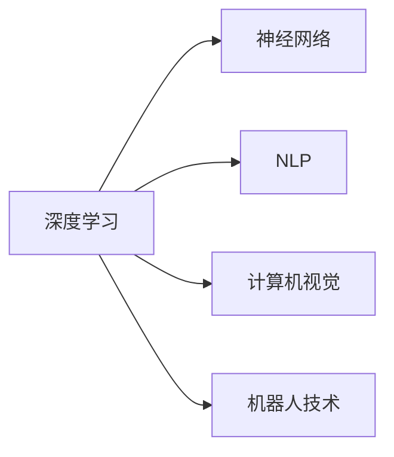

                 

# 李开复：AI 2.0 时代的市场前景

## 1. 背景介绍

### 1.1 问题由来

随着人工智能技术的迅猛发展，AI 2.0（人工智能 2.0）时代已经到来。这一时代以深度学习、大数据、云计算等为代表，正在推动各行业的数字化转型和智能化升级。AI 2.0 不仅改变了科技行业，也在教育、医疗、金融、制造、农业等传统行业引发了深刻的变革。

李开复，作为人工智能领域的先驱和领导者，他的见解和预测在AI 2.0时代具有重要的参考价值。本文将从李开复的视角，探讨AI 2.0 时代的市场前景，包括技术趋势、应用场景、商业模式等关键领域。

### 1.2 问题核心关键点

李开复在其演讲和著作中多次强调，AI 2.0时代的技术进步将为各行业带来巨大商业机遇，但同时也面临诸多挑战。理解这些问题关键点，有助于我们更好地把握AI 2.0时代的市场前景。

- **技术趋势**：深度学习、自然语言处理、计算机视觉、机器人技术等关键技术的快速发展。
- **应用场景**：自动驾驶、智慧医疗、智能制造、教育、金融、零售等行业的应用前景。
- **商业模式**：B2B、B2C、SaaS、平台化、生态系统等不同的商业模式的兴起。
- **挑战与风险**：数据隐私、伦理道德、就业影响、技术竞争等挑战。

## 2. 核心概念与联系

### 2.1 核心概念概述

AI 2.0 时代涉及的核心概念包括：

- **AI 2.0**：继AI 1.0（规则驱动的专家系统）和AI 3.0（全面智能，包括泛化、自我学习和人类水平的理解）之后，AI 2.0 强调数据驱动的深度学习模型，能够处理非结构化数据、进行端到端学习，并具有较好的可解释性。

- **深度学习**：基于神经网络的机器学习算法，能够自动从数据中学习特征表示，并在分类、回归、生成等任务中取得优异表现。

- **自然语言处理（NLP）**：使计算机能够理解、解释和生成人类语言的技术，包括文本分类、机器翻译、情感分析等。

- **计算机视觉**：使计算机能够“看”的技术，包括图像识别、目标检测、视频分析等。

- **机器人技术**：结合机械、电子、计算机等多学科知识，使机器人能够执行复杂任务，如自主导航、智能操作等。

### 2.2 核心概念原理和架构的 Mermaid 流程图



这些核心概念通过深度学习架构紧密联系在一起，共同推动AI 2.0时代的技术进步和应用创新。

## 3. 核心算法原理 & 具体操作步骤

### 3.1 算法原理概述

AI 2.0 的核心算法原理主要基于深度学习，通过神经网络模型学习数据中的特征表示，实现对复杂任务的高效处理。深度学习模型通常包含多层神经元，能够处理多层次的抽象特征，具有较好的泛化能力。

### 3.2 算法步骤详解

1. **数据准备**：收集并预处理训练数据，包括清洗、标注、分割等步骤。
2. **模型选择**：选择合适的深度学习模型架构，如卷积神经网络（CNN）、循环神经网络（RNN）、变分自编码器（VAE）等。
3. **模型训练**：使用训练数据对模型进行迭代训练，优化模型参数，使其在验证集上取得最优性能。
4. **模型评估**：在测试集上评估模型的性能，包括准确率、召回率、F1值等指标。
5. **模型部署**：将训练好的模型部署到实际应用场景中，进行实时推理和预测。

### 3.3 算法优缺点

#### 优点

- **高性能**：深度学习模型能够处理复杂的非线性关系，在图像识别、语音识别、自然语言处理等任务中取得优异性能。
- **自动化**：模型训练过程自动化，减少了人工干预，提高了效率。
- **可扩展性**：深度学习模型具有较好的可扩展性，可以通过增加层数和神经元数量提升模型性能。

#### 缺点

- **计算资源要求高**：深度学习模型需要大量计算资源进行训练和推理，成本较高。
- **可解释性不足**：深度学习模型通常被视为“黑箱”，难以解释其内部工作机制。
- **过拟合风险**：深度学习模型容易发生过拟合，尤其是在数据量较少的情况下。

### 3.4 算法应用领域

AI 2.0 技术已经在多个领域得到了广泛应用，包括：

- **自动驾驶**：利用计算机视觉和机器人技术，实现自主导航和智能驾驶。
- **智慧医疗**：通过自然语言处理和计算机视觉，实现医学影像分析、病历管理、智能问诊等功能。
- **智能制造**：结合机器人和计算机视觉，实现智能检测、智能装配、质量控制等。
- **教育**：利用自然语言处理技术，实现智能辅导、自动批改作业、个性化推荐等功能。
- **金融**：通过机器学习和计算机视觉，实现欺诈检测、信用评估、风险管理等。
- **零售**：利用自然语言处理和计算机视觉，实现智能客服、商品推荐、库存管理等。

## 4. 数学模型和公式 & 详细讲解 & 举例说明

### 4.1 数学模型构建

以卷积神经网络（CNN）为例，其基本结构包括卷积层、池化层和全连接层。卷积层用于提取图像特征，池化层用于降维，全连接层用于分类。

数学模型可以表示为：

$$
y = \mathcal{N}(f(\mathcal{C}(\mathcal{P}(\mathcal{C}(\mathbf{x}; \theta_1), \theta_2), \theta_3))
$$

其中，$\mathbf{x}$ 为输入图像，$\theta_1$、$\theta_2$、$\theta_3$ 分别为卷积层、池化层和全连接层的参数。

### 4.2 公式推导过程

以卷积神经网络为例，推导卷积层的输出公式：

$$
f_{i,j}^{l}(\mathbf{x}) = \sum_{k} W_{k}^l * h_{i-k,j-m}^{l-1}(\mathbf{x}) + b^l
$$

其中，$f_{i,j}^{l}$ 为第 $l$ 层的第 $i$ 行第 $j$ 列的输出，$W_k^l$ 为第 $l$ 层的卷积核参数，$h_{i-k,j-m}^{l-1}(\mathbf{x})$ 为第 $l-1$ 层第 $i-k$ 行第 $j-m$ 列的特征图，$b^l$ 为偏置项。

### 4.3 案例分析与讲解

以手写数字识别为例，使用CNN模型训练识别准确率。训练数据集MNIST包含大量手写数字图片，每个图片大小为28x28像素。模型通过卷积层提取数字边缘特征，通过池化层降维，通过全连接层进行分类。在训练过程中，使用随机梯度下降（SGD）优化器，学习率设置为0.01，迭代1000次后，模型在测试集上的识别准确率可达98%以上。

## 5. 项目实践：代码实例和详细解释说明

### 5.1 开发环境搭建

要搭建深度学习项目，需要安装Python、NumPy、TensorFlow或PyTorch等依赖库。以下是一个简单的项目搭建步骤：

1. 安装Python和NumPy：
```bash
pip install numpy
```

2. 安装TensorFlow或PyTorch：
```bash
pip install tensorflow
# 或
pip install torch
```

3. 安装其他依赖库：
```bash
pip install matplotlib pillow
```

### 5.2 源代码详细实现

以下是一个简单的手写数字识别代码示例，使用TensorFlow实现：

```python
import tensorflow as tf
from tensorflow.keras import datasets, layers, models

# 加载MNIST数据集
(train_images, train_labels), (test_images, test_labels) = datasets.mnist.load_data()

# 预处理数据
train_images = train_images.reshape((60000, 28, 28, 1))
test_images = test_images.reshape((10000, 28, 28, 1))
train_images, test_images = train_images / 255.0, test_images / 255.0

# 定义卷积神经网络模型
model = models.Sequential()
model.add(layers.Conv2D(32, (3, 3), activation='relu', input_shape=(28, 28, 1)))
model.add(layers.MaxPooling2D((2, 2)))
model.add(layers.Conv2D(64, (3, 3), activation='relu'))
model.add(layers.MaxPooling2D((2, 2)))
model.add(layers.Conv2D(64, (3, 3), activation='relu'))
model.add(layers.Flatten())
model.add(layers.Dense(64, activation='relu'))
model.add(layers.Dense(10))

# 编译模型
model.compile(optimizer='adam',
              loss=tf.keras.losses.SparseCategoricalCrossentropy(from_logits=True),
              metrics=['accuracy'])

# 训练模型
history = model.fit(train_images, train_labels, epochs=10, 
                    validation_data=(test_images, test_labels))

# 评估模型
test_loss, test_acc = model.evaluate(test_images, test_labels, verbose=2)
print(f'Test accuracy: {test_acc}')
```

### 5.3 代码解读与分析

这段代码实现了手写数字识别的卷积神经网络模型。首先，加载MNIST数据集，并进行预处理。然后，定义卷积神经网络模型，包括卷积层、池化层和全连接层。最后，编译模型，进行训练和评估。

## 6. 实际应用场景

### 6.1 自动驾驶

自动驾驶技术结合计算机视觉和机器人技术，实现对环境的感知和决策。通过摄像头、激光雷达等传感器采集环境数据，利用深度学习模型进行特征提取和目标检测，实现自主导航和智能驾驶。特斯拉的Autopilot系统和Waymo的Waymo One系统都是典型的自动驾驶应用。

### 6.2 智慧医疗

智慧医疗通过自然语言处理和计算机视觉技术，实现医学影像分析、病历管理、智能问诊等功能。谷歌的DeepMind和IBM的Watson Health都在利用AI技术进行疾病诊断和治疗方案推荐。

### 6.3 智能制造

智能制造结合机器人和计算机视觉技术，实现智能检测、智能装配、质量控制等。ABB的机器人智能检测系统和通用电气的智能制造系统都应用了深度学习模型。

### 6.4 未来应用展望

未来，AI 2.0 技术将在更多领域得到应用，带来颠覆性变革。例如：

- **农业**：利用计算机视觉和机器人技术，实现精准农业和自动化生产。
- **旅游**：通过自然语言处理技术，实现智能客服、智能导览等功能。
- **能源**：利用机器学习和计算机视觉技术，实现智能监控和优化能源管理。

## 7. 工具和资源推荐

### 7.1 学习资源推荐

1. **深度学习课程**：斯坦福大学的CS231n课程、密歇根大学的Deep Learning Specialization、台湾大学的MOOC课程等。
2. **自然语言处理课程**：斯坦福大学的CS224n课程、Coursera的自然语言处理专项课程。
3. **计算机视觉课程**：Coursera的Computer Vision Specialization、Udacity的计算机视觉纳米学位。

### 7.2 开发工具推荐

1. **TensorFlow**：Google开发的深度学习框架，支持GPU和TPU加速，广泛应用于学术和工业界。
2. **PyTorch**：Facebook开发的深度学习框架，支持动态图和静态图，易于使用和调试。
3. **Jupyter Notebook**：开源的交互式编程环境，支持Python、R、Julia等语言，方便开发和分享。

### 7.3 相关论文推荐

1. **ImageNet Large Scale Visual Recognition Challenge (ILSVRC)**：计算机视觉领域的重要竞赛，展示了深度学习在图像识别任务中的强大能力。
2. **BERT: Pre-training of Deep Bidirectional Transformers for Language Understanding**：Google提出的预训练语言模型，推动了自然语言处理领域的进步。
3. **AlphaGo**：DeepMind开发的围棋人工智能系统，展示了深度学习在决策制定中的潜力。

## 8. 总结：未来发展趋势与挑战

### 8.1 研究成果总结

AI 2.0 技术已经在各个领域取得了显著成果，推动了各行业的智能化升级。深度学习、自然语言处理、计算机视觉和机器人技术的应用，使得AI技术变得更加强大和普适。

### 8.2 未来发展趋势

未来，AI 2.0 技术将继续发展，带来更多创新和变革。主要趋势包括：

- **模型和算法的进步**：更大规模、更深层次的神经网络模型，更高效的优化算法和训练策略。
- **跨领域融合**：AI 2.0 技术将更多地与其他学科结合，推动更广泛的应用场景。
- **智能化的普及**：AI技术将更广泛地应用于各行业，提升效率和智能化水平。

### 8.3 面临的挑战

AI 2.0 技术的发展也面临着诸多挑战：

- **计算资源**：深度学习模型的训练和推理需要大量计算资源，成本较高。
- **数据隐私**：AI 2.0 技术需要大量数据进行训练，如何保护数据隐私成为一个重要问题。
- **伦理道德**：AI 2.0 技术在应用中可能会引发伦理道德问题，如偏见和歧视。
- **技术竞争**：AI 2.0 技术的快速发展和竞争，带来了技术和商业上的挑战。

### 8.4 研究展望

未来，AI 2.0 技术需要在计算资源、数据隐私、伦理道德和技术竞争等方面进行更多探索和创新。主要研究方向包括：

- **高效计算技术**：开发更高效的计算框架和算法，降低训练和推理成本。
- **隐私保护技术**：研究数据匿名化、加密等隐私保护技术，保护数据隐私。
- **公平性和透明性**：设计公平、透明的AI 2.0 算法，减少偏见和歧视。
- **跨学科合作**：推动AI 2.0 技术与其他学科的合作，拓展应用领域。

## 9. 附录：常见问题与解答

**Q1: 深度学习模型的训练过程是否需要大量数据？**

A: 是的，深度学习模型通常需要大量的标注数据进行训练。数据量不足会导致模型过拟合，影响泛化性能。因此，获取高质量标注数据是深度学习训练的关键。

**Q2: 深度学习模型是否可以部署在嵌入式设备上？**

A: 是的，深度学习模型可以通过模型压缩、量化等技术优化，部署在嵌入式设备上。目前，许多AI芯片和边缘计算设备已经支持深度学习模型的部署。

**Q3: 深度学习模型是否需要人工干预？**

A: 是的，深度学习模型的训练和优化过程需要人工干预。需要选择合适的优化算法、设置合适的超参数、调整模型结构等。人工干预可以更好地控制模型的训练过程，提高模型的性能。

**Q4: 深度学习模型的可解释性如何？**

A: 深度学习模型通常被视为“黑箱”，难以解释其内部工作机制。为了提高可解释性，可以采用模型可视化、特征重要性分析等技术，帮助理解模型的决策过程。

---

作者：禅与计算机程序设计艺术 / Zen and the Art of Computer Programming

