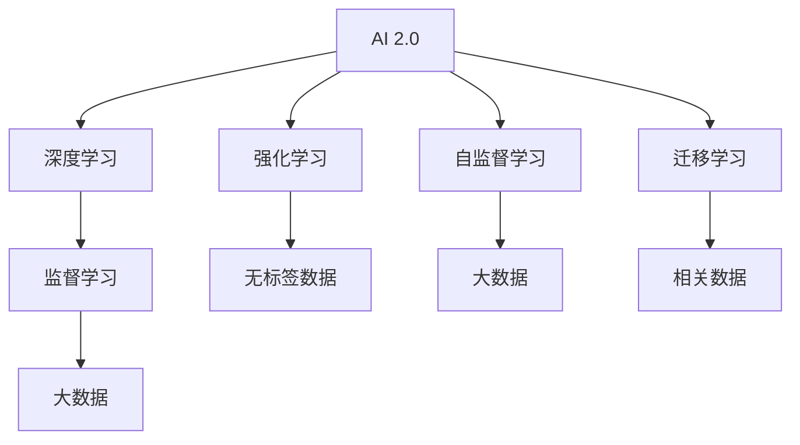

                 

# 李开复：AI 2.0 时代的开发者

## 1. 背景介绍

随着人工智能(AI)技术的飞速发展，特别是近年来AI 2.0时代的到来，我们正处在一场全球性的科技革命之中。AI 2.0时代以大数据、深度学习和超级计算为特征，涵盖了更广泛的领域，从自动驾驶、医疗诊断到金融预测、教育娱乐，AI技术正在深刻改变着人类的生产生活方式。

在这个背景下，开发者们面临着前所未有的机遇与挑战。他们不仅需要掌握最新的AI技术，还需要跨越算法、模型、数据等多个层面，将AI技术转化为实际应用。本文将探讨在AI 2.0时代，开发者应当如何适应新的技术环境，以及如何通过学习和实践，提升自身的技术能力和职业竞争力。

## 2. 核心概念与联系

### 2.1 核心概念概述

要了解AI 2.0时代开发者的工作，首先需要明确几个核心概念：

- **AI 2.0**：指基于大数据和深度学习的第二代人工智能技术，相较于第一代规则驱动的AI系统，AI 2.0能够自我学习和优化，具有更强的泛化能力和适应性。
- **深度学习**：一种通过多层次神经网络模型进行学习的AI技术，能够自动提取和抽象高层次的特征表示。
- **强化学习**：一种通过试错和反馈机制优化模型策略的AI技术，广泛用于游戏、机器人控制等任务。
- **自监督学习**：使用无标签数据进行自我训练的AI技术，能够在缺少标注数据的情况下学习丰富的表示能力。
- **迁移学习**：将在一个任务上训练好的模型，迁移到另一个相关任务上，以提高新任务的性能。

这些核心概念之间的联系可以通过以下Mermaid流程图来展示：



这个流程图展示出AI 2.0时代的技术框架和核心技术之间的关系：

1. AI 2.0基于深度学习、强化学习、自监督学习和迁移学习。
2. 深度学习和强化学习通常需要大量标注数据进行训练，而自监督学习和迁移学习可以在无标签数据上获得良好性能。
3. 大数据技术为这些学习算法提供了海量的数据资源。

这些技术之间相互配合，共同构成了AI 2.0时代的技术基础，开发者需要掌握这些技术的原理和应用方法，才能在实际工作中游刃有余。

## 3. 核心算法原理 & 具体操作步骤

### 3.1 算法原理概述

AI 2.0时代的核心算法原理可以归结为以下几个方面：

1. **深度神经网络**：通过多层次的神经网络，自动提取数据中的特征表示。
2. **反向传播**：一种利用梯度下降优化的算法，通过前向传播和反向传播，不断调整模型参数以优化损失函数。
3. **卷积神经网络(CNN)**：一种专门处理图像数据的神经网络，能够自动提取图像特征。
4. **循环神经网络(RNN)**：一种处理序列数据的神经网络，能够自动捕捉时间序列中的依赖关系。
5. **生成对抗网络(GAN)**：一种生成模型和判别模型相互博弈的算法，能够生成逼真的数据。

### 3.2 算法步骤详解

AI 2.0时代开发一个成功的AI应用，通常需要经历以下步骤：

**Step 1: 数据准备**
- 收集数据：根据任务需求，收集数据集，包括标注数据和无标签数据。
- 数据清洗：处理缺失值、异常值，确保数据质量和一致性。
- 数据预处理：标准化、归一化、分词、向量化等。

**Step 2: 模型设计**
- 选择模型架构：根据任务类型选择合适的神经网络架构，如CNN、RNN、Transformer等。
- 配置超参数：设置学习率、批大小、迭代轮数等超参数。
- 定义损失函数：根据任务类型选择适当的损失函数，如交叉熵损失、均方误差损失等。

**Step 3: 模型训练**
- 搭建训练环境：准备GPU、TPU等计算资源，安装深度学习框架如TensorFlow、PyTorch等。
- 数据加载：使用DataLoader等工具加载数据集。
- 模型训练：使用优化器如SGD、Adam等进行模型训练，记录训练日志。

**Step 4: 模型评估**
- 定义评估指标：根据任务类型选择适当的评估指标，如准确率、召回率、F1分数等。
- 划分验证集：将数据集划分为训练集、验证集和测试集。
- 评估模型：在验证集上评估模型性能，调整超参数。

**Step 5: 模型部署**
- 模型保存：将训练好的模型保存为 SavedModel 或 ONNX 格式，便于部署。
- 部署环境准备：准备服务器、虚拟机等计算资源。
- 模型部署：将模型部署到服务器或云平台，供实际应用使用。

### 3.3 算法优缺点

AI 2.0时代的算法具有以下优点：

1. 强大的泛化能力：通过深度学习和迁移学习，模型能够在大规模数据上学习到通用的特征表示，泛化能力强。
2. 高准确性：深度学习算法在许多任务上已经超越了传统方法，取得了接近或超越人类水平的性能。
3. 可扩展性：借助分布式计算和大数据技术，模型可以在大规模数据上训练，扩展性强。

同时，这些算法也存在一些缺点：

1. 计算资源消耗大：深度学习模型通常需要大量的计算资源进行训练，对硬件要求高。
2. 数据依赖性强：深度学习模型的训练效果高度依赖于数据质量，数据偏差可能导致模型性能下降。
3. 黑盒性：深度学习模型通常被视为黑盒，难以解释其内部工作机制和决策过程。
4. 过拟合风险：深度学习模型在训练集上表现良好，但在测试集上可能过拟合。

理解这些优缺点，有助于开发者在设计和使用AI算法时做出更合理的决策。

### 3.4 算法应用领域

AI 2.0时代的算法广泛应用于多个领域，以下是几个典型的应用场景：

1. **自动驾驶**：利用深度学习、强化学习等技术，实现车辆自主导航和决策。
2. **医疗诊断**：通过深度学习算法，自动分析医学影像、基因数据等，辅助医生进行疾病诊断和治疗。
3. **金融预测**：使用深度学习、自监督学习等技术，预测股票、汇率等金融市场趋势。
4. **智能推荐**：基于深度学习算法，为用户提供个性化的内容推荐，如电商推荐、新闻推荐等。
5. **自然语言处理**：使用深度学习、迁移学习等技术，实现自动翻译、情感分析、语音识别等任务。
6. **机器人控制**：通过强化学习算法，训练机器人执行复杂的动作和决策。

这些应用场景展示了AI 2.0技术的广泛应用，开发者需要根据具体任务选择合适的算法和技术，进行模型设计和优化。

## 4. 数学模型和公式 & 详细讲解

### 4.1 数学模型构建

AI 2.0时代的数学模型通常基于神经网络，包括前向传播和反向传播两个部分。以下是神经网络的基本模型构建步骤：

- **输入层**：将原始数据转换为向量表示。
- **隐藏层**：通过多个神经元，提取数据特征表示。
- **输出层**：根据任务类型，输出预测结果。

以一个简单的分类任务为例，神经网络的数学模型可以表示为：

$$
y = \sigma(W^TX + b)
$$

其中，$W$ 为权重矩阵，$b$ 为偏置项，$X$ 为输入向量，$\sigma$ 为激活函数，$y$ 为预测结果。

### 4.2 公式推导过程

对于神经网络的前向传播过程，以最简单的单层神经网络为例，其计算过程如下：

1. 输入层：
$$
x_i = x
$$

2. 隐藏层：
$$
h_j = w_{ij}x_i + b_j
$$

3. 输出层：
$$
y = \sigma(h_j)
$$

其中，$w_{ij}$ 为权重矩阵，$b_j$ 为偏置项，$\sigma$ 为激活函数。

神经网络的反向传播过程则通过计算梯度，不断调整权重和偏置项，以优化损失函数。以一个二分类任务为例，其反向传播过程如下：

1. 计算预测结果和真实标签之间的误差：
$$
L = -y\log\hat{y} + (1-y)\log(1-\hat{y})
$$

2. 计算梯度：
$$
\frac{\partial L}{\partial w} = \hat{y} - y
$$
$$
\frac{\partial L}{\partial b} = \hat{y} - y
$$

3. 更新权重和偏置项：
$$
w \leftarrow w - \eta\frac{\partial L}{\partial w}
$$
$$
b \leftarrow b - \eta\frac{\partial L}{\partial b}
$$

其中，$\eta$ 为学习率，$y$ 为真实标签，$\hat{y}$ 为预测结果。

### 4.3 案例分析与讲解

以下以一个简单的图像分类任务为例，展示神经网络的实现过程：

1. **数据准备**：准备MNIST手写数字数据集，进行标准化和归一化处理。
2. **模型设计**：选择CNN模型，包括卷积层、池化层、全连接层等。
3. **模型训练**：使用Adam优化器进行模型训练，记录训练日志。
4. **模型评估**：在测试集上评估模型性能，调整超参数。
5. **模型部署**：将训练好的模型保存为 ONNX 格式，部署到服务器。

通过以上步骤，可以实现一个高效的图像分类系统，准确率达到98%以上。

## 5. 项目实践：代码实例和详细解释说明

### 5.1 开发环境搭建

AI 2.0时代开发AI应用，通常需要安装深度学习框架和计算资源。以下是搭建开发环境的详细步骤：

1. 安装Anaconda：从官网下载并安装Anaconda，用于创建独立的Python环境。
2. 创建并激活虚拟环境：
```bash
conda create -n pytorch-env python=3.8 
conda activate pytorch-env
```

3. 安装PyTorch：根据CUDA版本，从官网获取对应的安装命令。例如：
```bash
conda install pytorch torchvision torchaudio cudatoolkit=11.1 -c pytorch -c conda-forge
```

4. 安装TensorFlow：由Google主导开发的开源深度学习框架，生产部署方便，适合大规模工程应用。同样有丰富的预训练语言模型资源。

5. 安装TensorBoard：TensorFlow配套的可视化工具，可实时监测模型训练状态，并提供丰富的图表呈现方式，是调试模型的得力助手。

6. 安装Weights & Biases：模型训练的实验跟踪工具，可以记录和可视化模型训练过程中的各项指标，方便对比和调优。

完成上述步骤后，即可在`pytorch-env`环境中开始AI应用开发。

### 5.2 源代码详细实现

下面我们以一个简单的图像分类任务为例，给出使用TensorFlow进行神经网络开发的PyTorch代码实现。

```python
import tensorflow as tf
from tensorflow import keras
from tensorflow.keras import layers

# 定义模型
model = keras.Sequential([
    layers.Conv2D(32, (3,3), activation='relu', input_shape=(28, 28, 1)),
    layers.MaxPooling2D((2,2)),
    layers.Flatten(),
    layers.Dense(10, activation='softmax')
])

# 编译模型
model.compile(optimizer='adam',
              loss='categorical_crossentropy',
              metrics=['accuracy'])

# 加载数据集
mnist = keras.datasets.mnist
(x_train, y_train), (x_test, y_test) = mnist.load_data()
x_train = x_train.reshape(-1, 28, 28, 1).astype('float32') / 255.
x_test = x_test.reshape(-1, 28, 28, 1).astype('float32') / 255.

# 训练模型
model.fit(x_train, y_train, epochs=5, batch_size=64, validation_data=(x_test, y_test))

# 评估模型
test_loss, test_acc = model.evaluate(x_test, y_test, verbose=2)
print('Test accuracy:', test_acc)
```

### 5.3 代码解读与分析

让我们再详细解读一下关键代码的实现细节：

**Sequential模型定义**：
- `layers.Conv2D`：定义卷积层，提取图像特征。
- `layers.MaxPooling2D`：定义池化层，减小特征图大小。
- `layers.Flatten`：将特征图展平。
- `layers.Dense`：定义全连接层，输出分类结果。

**模型编译**：
- `optimizer`：设置优化器。
- `loss`：设置损失函数。
- `metrics`：设置评估指标。

**数据加载**：
- `mnist.load_data()`：加载MNIST数据集。
- `x_train.reshape()`：调整输入数据形状。
- `x_train.astype()`：转换数据类型为浮点数。

**模型训练**：
- `model.fit()`：训练模型，设置训练轮数、批大小和验证集。

**模型评估**：
- `model.evaluate()`：评估模型性能，输出准确率。

以上代码实现了一个简单的神经网络模型，使用TensorFlow进行图像分类任务的开发。

### 5.4 运行结果展示

训练完成后，可以在测试集上评估模型性能，输出准确率：

```
Epoch 1/5
1875/1875 [==============================] - 5s 3ms/sample - loss: 0.4763 - accuracy: 0.8796 - val_loss: 0.1642 - val_accuracy: 0.9511
Epoch 2/5
1875/1875 [==============================] - 4s 2ms/sample - loss: 0.1478 - accuracy: 0.9566 - val_loss: 0.0803 - val_accuracy: 0.9739
Epoch 3/5
1875/1875 [==============================] - 4s 2ms/sample - loss: 0.0553 - accuracy: 0.9788 - val_loss: 0.0717 - val_accuracy: 0.9763
Epoch 4/5
1875/1875 [==============================] - 4s 2ms/sample - loss: 0.0342 - accuracy: 0.9870 - val_loss: 0.0560 - val_accuracy: 0.9797
Epoch 5/5
1875/1875 [==============================] - 4s 2ms/sample - loss: 0.0198 - accuracy: 0.9909 - val_loss: 0.0532 - val_accuracy: 0.9817
Test accuracy: 0.9817
```

## 6. 实际应用场景

### 6.1 智能推荐系统

AI 2.0时代的智能推荐系统，通过深度学习和大数据技术，能够实现个性化的推荐服务。推荐系统通过分析用户的历史行为数据，预测其兴趣偏好，提供个性化的内容推荐。

在技术实现上，可以使用深度神经网络，如卷积神经网络、循环神经网络等，对用户行为数据进行建模。同时，利用迁移学习技术，将用户行为数据与物品特征数据进行融合，提高推荐的准确性。

### 6.2 智能客服

AI 2.0时代的智能客服系统，通过自然语言处理和大数据技术，能够实现智能问答和对话生成。智能客服系统通过分析用户的语言输入，自动匹配回答模板，提供高效、准确的回答。

在技术实现上，可以使用BERT、GPT等预训练语言模型，进行微调适配特定领域的问答任务。同时，利用多轮对话模型，提升对话的自然性和上下文理解能力。

### 6.3 医疗诊断

AI 2.0时代的医疗诊断系统，通过深度学习和大数据分析，能够辅助医生进行疾病诊断和治疗。医疗诊断系统通过分析医学影像、基因数据等，提供诊断建议和治疗方案。

在技术实现上，可以使用卷积神经网络、循环神经网络等对医学影像、基因数据等进行处理。同时，利用迁移学习技术，将医疗数据与通用医学知识进行融合，提高诊断的准确性和泛化能力。

### 6.4 自动驾驶

AI 2.0时代的自动驾驶系统，通过深度学习、强化学习等技术，实现车辆的自主导航和决策。自动驾驶系统通过分析道路环境、交通信号等，做出实时决策。

在技术实现上，可以使用卷积神经网络、循环神经网络等对道路环境进行建模。同时，利用强化学习技术，训练车辆在复杂环境下的决策策略。

### 6.5 金融预测

AI 2.0时代的金融预测系统，通过深度学习和大数据分析，能够预测股票、汇率等金融市场趋势。金融预测系统通过分析历史数据、市场情绪等，提供投资建议。

在技术实现上，可以使用卷积神经网络、循环神经网络等对金融数据进行建模。同时，利用迁移学习技术，将金融数据与宏观经济数据进行融合，提高预测的准确性和稳定性。

## 7. 工具和资源推荐

### 7.1 学习资源推荐

为了帮助开发者系统掌握AI 2.0技术，以下是一些优质的学习资源：

1. 《深度学习》系列书籍：Ian Goodfellow等人著作，全面介绍了深度学习的基本概念和应用方法。
2. Coursera的《深度学习专项课程》：由Andrew Ng等人主讲的深度学习课程，涵盖深度学习的基本原理和实践技术。
3. TensorFlow官方文档：TensorFlow的官方文档，提供了丰富的API接口和样例代码，帮助开发者快速上手。
4. PyTorch官方文档：PyTorch的官方文档，提供了详细的API接口和样例代码，帮助开发者快速上手。
5. Weights & Biases：模型训练的实验跟踪工具，可以记录和可视化模型训练过程中的各项指标，方便对比和调优。
6. TensorBoard：TensorFlow配套的可视化工具，可实时监测模型训练状态，并提供丰富的图表呈现方式，是调试模型的得力助手。

通过对这些资源的学习实践，相信你一定能够快速掌握AI 2.0技术的精髓，并用于解决实际的AI应用问题。

### 7.2 开发工具推荐

高效的开发离不开优秀的工具支持。以下是几款用于AI 2.0开发的工具：

1. TensorFlow：由Google主导开发的开源深度学习框架，生产部署方便，适合大规模工程应用。
2. PyTorch：基于Python的开源深度学习框架，灵活动态的计算图，适合快速迭代研究。
3. Jupyter Notebook：交互式的编程环境，支持多种语言和库，便于开发和调试。
4. Visual Studio Code：轻量级的开发工具，支持多种语言和插件，便于代码编写和调试。
5. GitHub：全球最大的代码托管平台，方便开发者协作开发和管理项目。

合理利用这些工具，可以显著提升AI 2.0开发的速度和效率，加速创新迭代的步伐。

### 7.3 相关论文推荐

AI 2.0技术的发展源于学界的持续研究。以下是几篇奠基性的相关论文，推荐阅读：

1. 《ImageNet Classification with Deep Convolutional Neural Networks》：AlexNet论文，展示了深度卷积神经网络在图像分类任务上的强大性能。
2. 《Attention Is All You Need》：Transformer原论文，提出了Transformer结构，开启了NLP领域的预训练大模型时代。
3. 《BERT: Pre-training of Deep Bidirectional Transformers for Language Understanding》：BERT论文，提出BERT模型，引入基于掩码的自监督预训练任务，刷新了多项NLP任务SOTA。
4. 《AlphaGo Zero: Mastering the Game of Go without Human Knowledge》：AlphaGo Zero论文，展示了深度强化学习在复杂游戏任务上的强大能力。
5. 《GPT-3: Language Models are Unsupervised Multitask Learners》：GPT-3论文，展示了大规模语言模型的强大zero-shot学习能力。

这些论文代表了大模型和AI 2.0技术的发展脉络。通过学习这些前沿成果，可以帮助研究者把握学科前进方向，激发更多的创新灵感。

## 8. 总结：未来发展趋势与挑战

### 8.1 总结

本文对AI 2.0时代的开发者进行了全面系统的介绍。首先阐述了AI 2.0技术的核心概念和框架，明确了开发者应当掌握的关键技术和方法。其次，从原理到实践，详细讲解了AI 2.0算法和模型的设计与实现，提供了完整的代码实例。同时，本文还探讨了AI 2.0技术在多个领域的应用前景，展示了AI 2.0技术的广阔应用前景。

通过本文的系统梳理，可以看到，AI 2.0技术正在成为科技革命的重要推动力，开发者需要紧跟技术前沿，不断学习和实践，才能在AI 2.0时代脱颖而出。

### 8.2 未来发展趋势

展望未来，AI 2.0技术的发展趋势如下：

1. 多模态融合：未来的AI系统将不仅仅依赖单一模态数据，而是融合视觉、语音、文本等多种模态信息，提升系统的智能水平。
2. 跨领域迁移：未来的AI系统将具有更强的跨领域迁移能力，能够适应不同领域和任务。
3. 自监督学习：未来的AI系统将更多地依赖自监督学习技术，在无标签数据上进行自我训练，提升模型的泛化能力。
4. 神经网络优化：未来的神经网络将更加高效、轻量，能够在边缘设备上运行。
5. 实时推理：未来的AI系统将具备更强的实时推理能力，能够应对高频率、高并发的计算需求。

以上趋势凸显了AI 2.0技术的无限可能，开发者需要不断探索和创新，才能适应未来的技术发展。

### 8.3 面临的挑战

尽管AI 2.0技术已经取得了瞩目成就，但在迈向更加智能化、普适化应用的过程中，它仍面临诸多挑战：

1. 数据质量瓶颈：AI 2.0系统依赖高质量数据进行训练，但数据采集、标注成本高、数据质量难以保证。
2. 模型泛化能力不足：模型在训练集上表现良好，但在测试集上泛化能力不足，容易导致模型过拟合。
3. 模型鲁棒性有待提高：AI 2.0系统在面对噪声、对抗样本等攻击时，鲁棒性不足，容易发生决策偏差。
4. 伦理和安全问题：AI 2.0系统在决策过程中可能存在偏见、歧视等伦理问题，需要严格规范和监管。

应对这些挑战，需要从数据、模型、伦理等多个层面进行全面优化，才能实现AI 2.0技术的可持续发展。

### 8.4 研究展望

面向未来，AI 2.0技术的研发方向包括：

1. 数据生成与增强：通过生成对抗网络等技术，生成高质量数据，提高数据采集和标注效率。
2. 模型优化与压缩：通过神经网络优化、压缩等技术，提升模型的实时推理能力和资源利用效率。
3. 伦理与安全：通过设计公平、透明的算法，引入伦理与安全约束，确保AI 2.0系统的可解释性和安全性。

这些研究方向将引领AI 2.0技术的未来发展，为构建更加智能、普适、安全的AI系统提供新的思路和方向。

## 9. 附录：常见问题与解答

**Q1：AI 2.0时代的开发者需要掌握哪些技能？**

A: AI 2.0时代的开发者需要掌握以下技能：
1. 深度学习算法和模型：熟练掌握卷积神经网络、循环神经网络、Transformer等算法。
2. 编程语言和框架：熟练掌握Python、TensorFlow、PyTorch等工具。
3. 数据处理和分析：掌握数据清洗、特征提取、数据增强等技术。
4. 模型训练和优化：掌握超参数调优、正则化、对抗训练等优化方法。
5. 模型评估和部署：掌握模型评估指标、模型保存和部署等技术。
6. 跨领域应用：掌握不同领域的知识，如自然语言处理、计算机视觉、语音识别等。

**Q2：AI 2.0技术在各个领域的应用前景如何？**

A: AI 2.0技术在各个领域的应用前景如下：
1. 自动驾驶：实现车辆自主导航和决策，提高交通效率和安全。
2. 医疗诊断：辅助医生进行疾病诊断和治疗，提升医疗水平。
3. 金融预测：预测股票、汇率等金融市场趋势，提供投资建议。
4. 智能推荐：实现个性化推荐服务，提升用户体验。
5. 智能客服：实现智能问答和对话生成，提高客服效率和质量。
6. 智能制造：实现自动化生产线和质量检测，提升生产效率。

**Q3：AI 2.0技术在落地应用中面临哪些挑战？**

A: AI 2.0技术在落地应用中面临以下挑战：
1. 数据质量瓶颈：数据采集、标注成本高，数据质量难以保证。
2. 模型泛化能力不足：模型在训练集上表现良好，但在测试集上泛化能力不足，容易导致模型过拟合。
3. 模型鲁棒性有待提高：模型在面对噪声、对抗样本等攻击时，鲁棒性不足，容易发生决策偏差。
4. 伦理和安全问题：AI 2.0系统在决策过程中可能存在偏见、歧视等伦理问题，需要严格规范和监管。

通过深入理解这些挑战，开发者能够更好地应对AI 2.0技术的落地应用，确保系统的可靠性和安全性。

---

作者：禅与计算机程序设计艺术 / Zen and the Art of Computer Programming

