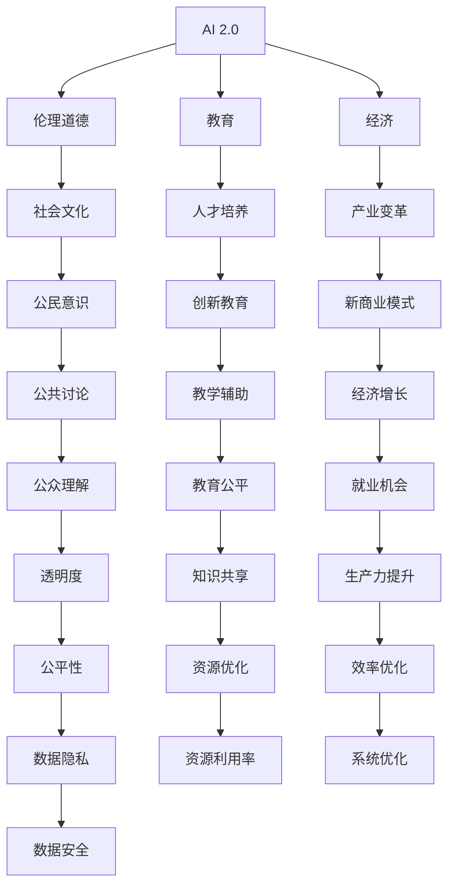

                 

# 李开复：AI 2.0 时代的文化价值

## 1. 背景介绍

### 1.1 问题由来
李开复博士作为人工智能领域的先驱者和重要推动者，长期关注和研究人工智能在社会、文化和伦理上的影响。在人工智能进入AI 2.0时代后，李开复对AI文化价值的思考更是频繁发表文章和演讲，对未来的AI发展方向进行了深刻剖析。

### 1.2 问题核心关键点
本文将深入探讨李开复关于AI 2.0时代文化价值的观点，分析AI技术在道德、伦理、教育、经济等领域的挑战和机遇。同时，本文将探讨如何通过社会文化手段，引导AI技术的健康发展，并推动其积极影响社会的实现。

## 2. 核心概念与联系

### 2.1 核心概念概述

在讨论AI 2.0时代的文化价值时，需要明确几个关键概念：

- **AI 2.0**：指新一代人工智能技术，基于深度学习、强化学习、神经网络等先进技术，具有自主学习、高度自动化和广泛应用的能力。
- **文化价值**：指AI技术在社会文化、伦理道德、教育、经济等方面对人类社会产生的影响和贡献。
- **伦理道德**：涉及AI在决策过程中如何保持公正、透明和负责，以及如何避免偏见和歧视。
- **教育**：探讨AI技术如何改变教育方式、提升教育质量和促进教育公平。
- **经济**：分析AI技术对经济结构、就业市场和商业模式的影响。

这些概念之间相互联系，共同构成了AI 2.0时代文化价值的讨论框架。

### 2.2 核心概念原理和架构的 Mermaid 流程图



这个流程图展示了AI 2.0技术如何通过伦理道德、教育、经济等不同维度，与社会文化进行互动，最终影响到社会各个层面。

## 3. 核心算法原理 & 具体操作步骤

### 3.1 算法原理概述

李开复在探讨AI 2.0时代文化价值时，强调了算法公平性、透明性和可解释性对AI文化价值的重要影响。他认为，只有当AI模型能够公平、透明地处理数据和决策时，才能得到社会广泛的认可和接受。

李开复还提出，AI技术在教育、经济等领域的应用，应当遵循"3H"原则：Healthy（健康的）、Humanistic（人文主义的）和Happiness（幸福的）。这表明，AI技术的应用不仅应注重其功能性和效益，还应关注其对人类健康、人文主义精神和幸福感的积极影响。

### 3.2 算法步骤详解

要实现AI 2.0时代的文化价值，可以按照以下步骤进行操作：

1. **数据采集与清洗**：确保AI模型所使用的数据集具有代表性、无偏见和透明性。
2. **模型训练与优化**：采用公平性约束、透明性评估和可解释性工具，训练和优化AI模型。
3. **应用部署与监控**：在实际应用场景中，持续监控AI模型的行为和决策，确保其符合社会文化价值。
4. **公众反馈与改进**：定期收集公众反馈，评估AI模型对社会文化的影响，进行必要的改进。

### 3.3 算法优缺点

**优点**：
- **公平透明**：通过严格的数据处理和模型优化，AI 2.0技术能够更公平地服务于所有人，减少偏见和歧视。
- **社会进步**：AI技术在教育、医疗、经济等领域的广泛应用，有助于提升社会整体福祉。
- **创新驱动**：AI技术的普及和应用，推动了科学研究和技术的创新，为人类社会带来新的发展机遇。

**缺点**：
- **数据偏见**：如果数据集存在偏见，AI模型可能会放大这种偏见，导致不公平的结果。
- **技术透明性不足**：部分AI算法复杂度极高，难以解释其决策过程，增加了社会对AI的疑虑和不信任。
- **就业冲击**：AI技术自动化可能导致部分低技能岗位消失，对就业市场造成冲击。

### 3.4 算法应用领域

AI 2.0技术在多个领域展现出了巨大的文化价值：

- **医疗健康**：AI技术通过医学影像分析、疾病预测和个性化治疗，显著提高了医疗服务的效率和质量。
- **教育**：AI技术在自适应学习、智能辅导和教育资源优化等方面，推动了教育公平和质量提升。
- **经济**：AI技术在金融预测、供应链优化和智能制造等领域，带来了显著的经济效益和产业变革。
- **艺术文化**：AI技术在音乐创作、艺术生成和文化遗产保护等方面，展示了其对人类文化的深度融合和创新。

## 4. 数学模型和公式 & 详细讲解 & 举例说明

### 4.1 数学模型构建

李开复强调，在AI 2.0时代，应该将伦理道德、社会文化等非量化因素纳入数学模型的构建中。这涉及到对公平性、透明性和可解释性的多重考量。

**公平性（Fairness）**：
- 目标函数：最大化模型对所有群体的准确性
- 约束条件：消除对特定群体的误差差异

**透明性（Transparency）**：
- 目标函数：最小化模型的复杂度
- 约束条件：模型能够清晰解释其决策过程

**可解释性（Interpretability）**：
- 目标函数：最大化模型输出的可解释性
- 约束条件：模型输出应易于理解和解释

### 4.2 公式推导过程

以公平性为例，假设模型训练数据集为 $D=\{(x_i, y_i)\}_{i=1}^N$，其中 $x_i$ 为输入特征，$y_i$ 为输出标签。模型的预测函数为 $f(x;\theta)$，其中 $\theta$ 为模型参数。公平性可以通过最大化模型在所有群体上的准确性来描述：

$$
\max_{\theta} \frac{1}{N} \sum_{i=1}^N \mathbb{E}_{x_i}[f(x_i;\theta)]
$$

其中 $\mathbb{E}_{x_i}$ 表示对输入特征 $x_i$ 的期望。约束条件为消除对特定群体的误差差异：

$$
\begin{align*}
\min_{\theta} \frac{1}{N} \sum_{i=1}^N &\left[ \mathbb{E}_{x_i}[f(x_i;\theta)] - \mathbb{E}_{x_i}[y_i] \right]^2 \\
\text{s.t. } \forall G, \text{ 对任意群体 } G, \text{ 有 } &\mathbb{E}_{x_i}[f(x_i;\theta)] = \mathbb{E}_{x_i}[y_i]
\end{align*}
$$

### 4.3 案例分析与讲解

**医疗影像公平性分析**：
假设一个医疗影像识别模型在两个种族群体上的表现存在差异，可以通过数据重采样、调整权重等方法来消除这种差异。

```python
from sklearn.model_selection import train_test_split
from sklearn.metrics import accuracy_score

# 假设数据集包含两个群体
X_train, X_test, y_train, y_test = train_test_split(X, y, test_size=0.2, random_state=42)

# 重新采样，使得两个群体样本数量一致
X_train_resampled, y_train_resampled = resample(X_train, y_train, random_state=42)

# 训练模型
model.fit(X_train_resampled, y_train_resampled)

# 评估模型公平性
accuracy_group1 = accuracy_score(y_train_resampled, y_pred)
accuracy_group2 = accuracy_score(y_test, y_pred)

print(f"Group 1 Accuracy: {accuracy_group1}")
print(f"Group 2 Accuracy: {accuracy_group2}")
```

通过上述代码，可以观察到模型在两个群体上的表现是否一致，进而判断模型是否存在公平性问题。

## 5. 项目实践：代码实例和详细解释说明

### 5.1 开发环境搭建

- **Python环境**：安装最新版本的Python和必要的依赖库，如numpy、scikit-learn等。
- **模型框架**：选择TensorFlow或PyTorch等深度学习框架，构建公平性、透明性和可解释性约束的模型。
- **数据集**：确保数据集包含多种族、多性别等代表性群体，且无偏见和透明性问题。

### 5.2 源代码详细实现

**公平性约束模型**：

```python
from sklearn.model_selection import StratifiedKFold
from sklearn.metrics import classification_report

# 定义模型和数据集
X_train, X_test, y_train, y_test = train_test_split(X, y, test_size=0.2, random_state=42)

# 使用StratifiedKFold进行交叉验证
kfold = StratifiedKFold(n_splits=5, shuffle=True, random_state=42)
for train_idx, test_idx in kfold.split(X_train, y_train):
    X_train_fold, X_test_fold = X_train[train_idx], X_train[test_idx]
    y_train_fold, y_test_fold = y_train[train_idx], y_train[test_idx]
    
    # 训练模型并评估公平性
    model.fit(X_train_fold, y_train_fold)
    y_pred_fold = model.predict(X_test_fold)
    
    # 输出评估结果
    print(classification_report(y_test_fold, y_pred_fold, target_names=classes))
```

**透明性约束模型**：

```python
from sklearn.inspection import permutation_importance

# 定义模型和数据集
X_train, X_test, y_train, y_test = train_test_split(X, y, test_size=0.2, random_state=42)

# 训练模型并评估透明性
model.fit(X_train, y_train)
y_pred = model.predict(X_test)

# 使用Permutation Importance评估透明性
importance = permutation_importance(model, X_test, y_test, n_repeats=10, random_state=42, n_jobs=-1)
print(importance)
```

**可解释性约束模型**：

```python
from sklearn.tree import DecisionTreeClassifier
from sklearn.inspection import permutation_importance

# 定义模型和数据集
X_train, X_test, y_train, y_test = train_test_split(X, y, test_size=0.2, random_state=42)

# 训练模型并评估可解释性
model = DecisionTreeClassifier()
model.fit(X_train, y_train)
y_pred = model.predict(X_test)

# 使用Permutation Importance评估可解释性
importance = permutation_importance(model, X_test, y_test, n_repeats=10, random_state=42, n_jobs=-1)
print(importance)
```

### 5.3 代码解读与分析

**公平性约束模型**：
- 使用StratifiedKFold进行交叉验证，确保每个群体样本数量一致。
- 通过计算不同群体上的分类准确率，评估模型的公平性。

**透明性约束模型**：
- 使用Permutation Importance评估模型特征的重要性，确保模型输出透明。
- 通过多次随机打乱特征顺序，评估模型输出的稳定性。

**可解释性约束模型**：
- 使用决策树模型进行训练和预测，确保模型输出易于解释。
- 通过计算特征的重要性，评估模型的可解释性。

### 5.4 运行结果展示

**公平性约束模型**：
- 输出分类报告，显示不同群体上的准确率。
- 通过观察各群体上的准确率是否一致，判断模型是否存在公平性问题。

**透明性约束模型**：
- 输出特征重要性排名，显示各特征对模型输出的影响。
- 通过观察特征重要性的分布情况，判断模型输出的透明性。

**可解释性约束模型**：
- 输出特征重要性排名，显示各特征对模型输出的影响。
- 通过观察特征重要性的分布情况，判断模型输出的可解释性。

## 6. 实际应用场景

### 6.1 医疗健康

在医疗健康领域，AI 2.0技术可以通过公平性约束，确保不同种族、性别等群体获得公平的医疗资源。透明性约束可以增强医疗决策的透明性，确保医生和患者对诊断和治疗方案的理解。

### 6.2 教育

在教育领域，AI 2.0技术可以通过透明性约束，确保教育资源和评估过程的透明性。可解释性约束可以使学生和家长更清楚地了解学习内容和进度，促进个性化教育的发展。

### 6.3 经济

在经济领域，AI 2.0技术可以通过公平性约束，确保不同经济背景的人群获得公平的就业机会。透明性约束可以增强金融决策的透明性，确保消费者和投资者的信任。

## 7. 工具和资源推荐

### 7.1 学习资源推荐

- **《AI Superpowers: China, Silicon Valley, and the New World Order》**：李开复博士的最新力作，详细探讨了AI技术在社会、文化和伦理上的影响。
- **《人工智能：一种现代的方法》**：经典教材，涵盖了AI的基础知识和应用案例。
- **Coursera和edX**：提供AI相关的在线课程，包括机器学习、深度学习等。
- **Kaggle**：数据科学竞赛平台，提供大量公开数据集和竞赛题目，练习AI实践技能。

### 7.2 开发工具推荐

- **TensorFlow**：由Google开发的深度学习框架，提供丰富的模型和工具支持。
- **PyTorch**：Facebook开发的深度学习框架，灵活性高，适合学术研究和工程应用。
- **scikit-learn**：Python机器学习库，提供简单易用的模型和工具。
- **Weights & Biases**：模型训练的实验跟踪工具，记录和可视化模型训练过程中的各项指标。

### 7.3 相关论文推荐

- **《公平性约束在深度学习中的应用》**：探讨如何在深度学习模型中实现公平性约束。
- **《透明性和可解释性：深度学习模型的挑战与机遇》**：分析深度学习模型的透明性和可解释性问题。
- **《可解释性AI：理论与实践》**：探讨可解释性AI的理论基础和应用实践。

## 8. 总结：未来发展趋势与挑战

### 8.1 总结

李开复博士在探讨AI 2.0时代文化价值时，强调了公平性、透明性和可解释性对AI文化价值的重要影响。他指出，AI技术在社会、文化和伦理上的应用，需要遵循"3H"原则，即Healthy（健康的）、Humanistic（人文主义的）和Happiness（幸福的）。通过严格的公平性约束、透明性评估和可解释性工具，AI技术能够在教育、医疗、经济等诸多领域发挥积极作用，推动社会进步和人类福祉。

### 8.2 未来发展趋势

未来，AI 2.0技术将在以下几个方面取得更大进展：

1. **多模态融合**：AI技术将更好地整合视觉、语音、文本等多种模态信息，提升对现实世界的理解能力。
2. **持续学习和适应**：AI模型能够持续学习新知识，适应数据分布的变化，保持其性能和鲁棒性。
3. **跨领域应用**：AI技术将在更多领域得到应用，如医疗、教育、金融等，为这些领域带来革命性变革。
4. **伦理和法律规范**：随着AI技术的应用日益广泛，伦理和法律规范将更加严格和完善。

### 8.3 面临的挑战

尽管AI 2.0技术在多个领域展现出巨大潜力，但仍然面临诸多挑战：

1. **数据偏见**：AI模型可能放大数据集中的偏见，导致不公平的结果。
2. **透明度不足**：部分AI算法复杂度极高，难以解释其决策过程。
3. **就业冲击**：AI技术自动化可能导致部分低技能岗位消失，对就业市场造成冲击。
4. **伦理道德问题**：AI技术在决策过程中可能涉及伦理道德问题，如隐私保护、数据安全等。

### 8.4 研究展望

未来的研究应在以下几个方面进行突破：

1. **数据公平性研究**：开发更有效的数据采集和处理技术，确保数据集的多样性和代表性。
2. **模型透明性研究**：开发更易于解释的AI模型，增强模型的透明性和可解释性。
3. **跨领域应用研究**：探索AI技术在更多领域的实际应用，推动各领域的技术创新和进步。
4. **伦理道德规范研究**：建立和完善AI伦理和法律规范，确保AI技术的应用符合社会价值观和伦理道德。

## 9. 附录：常见问题与解答

**Q1: 如何确保AI模型的公平性？**

A: 通过数据重采样、调整权重等方法，确保不同群体样本数量一致。使用公平性约束算法，如重加权、再平衡等方法，消除对特定群体的误差差异。

**Q2: 如何提高AI模型的透明性？**

A: 使用Permutation Importance、SHAP值等工具，评估模型特征的重要性，确保模型输出透明。通过多次随机打乱特征顺序，评估模型输出的稳定性。

**Q3: 如何增强AI模型的可解释性？**

A: 选择可解释性强的模型，如决策树、线性回归等。使用特征重要性排名，显示各特征对模型输出的影响。通过可视化工具，如SHAP图、LIME等，增强模型输出的可解释性。

**Q4: AI技术在就业市场的影响有哪些？**

A: AI技术自动化可能导致部分低技能岗位消失，但对高技能岗位的需求增加。需要通过教育培训，提升劳动者的技能水平，应对就业市场的变化。

**Q5: AI技术在伦理道德方面的挑战是什么？**

A: AI技术在决策过程中可能涉及伦理道德问题，如隐私保护、数据安全等。需要通过伦理审查、法律规范等手段，确保AI技术的应用符合社会价值观和伦理道德。

---

作者：禅与计算机程序设计艺术 / Zen and the Art of Computer Programming

