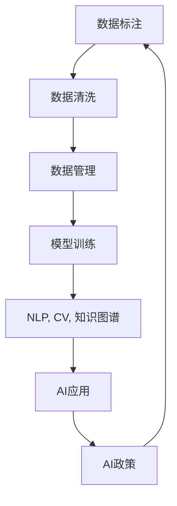

                 

# 李开复：AI 2.0 时代的生态

## 1. 背景介绍

### 1.1 问题由来

随着人工智能(AI)技术的快速发展和应用深入，AI 2.0时代已逐渐来临。相比于AI 1.0以专家系统、统计学、机器学习为代表的符号主义和连接主义两大方向，AI 2.0更加注重深度学习、自然语言处理、计算机视觉等技术在实际应用中的效果。AI 2.0时代不仅限于算法和模型的优化，更是强调数据、算力、模型的生态系统建设，推动了AI技术的规模化落地。

AI 2.0时代，各类行业智能化需求日益增多，如金融、医疗、教育、制造业等领域均在积极探索AI技术的应用，以实现业务转型和创新。同时，AI 2.0时代的到来，也引发了对于技术伦理、数据隐私、算法透明度等社会议题的讨论。构建一个健康、可持续的AI生态系统，成为了技术应用和政策监管的双重需求。

### 1.2 问题核心关键点

AI 2.0时代的生态系统构建涉及诸多方面：

1. **技术生态**：涵盖各类AI技术，如深度学习、自然语言处理、计算机视觉、知识图谱等。这些技术相互配合，构成AI的底层架构。
2. **数据生态**：包括数据收集、数据标注、数据管理等环节，数据质量直接影响到AI模型训练的效果。
3. **人才生态**：从数据科学家、算法工程师到产品经理，各类AI人才的培养与合作，对于技术实现和应用落地至关重要。
4. **应用生态**：AI技术在各行各业的实际应用，如智能客服、智能推荐、智能诊断等，涉及多个环节和场景。
5. **政策生态**：政府和企业对于AI技术的监管、法律、伦理框架，确保AI技术应用的合规性和安全性。

构建AI 2.0时代生态系统的关键在于各环节之间的紧密配合与协同创新，推动AI技术向纵深发展，推动AI技术为各行各业创造更大价值。

## 2. 核心概念与联系

### 2.1 核心概念概述

AI 2.0时代的生态系统是由技术、数据、人才、应用、政策等多个方面构成的复杂系统。以下是该系统的主要核心概念：

- **AI 2.0**：指以深度学习、自然语言处理、计算机视觉等技术为核心的新一代AI技术。相比于AI 1.0，AI 2.0更注重应用场景和技术生态的建设。
- **深度学习**：基于神经网络的机器学习算法，通过多层次的非线性映射，实现对复杂模式的学习。
- **自然语言处理(NLP)**：使计算机能够理解、生成自然语言，涵盖语言模型、机器翻译、文本分类、情感分析等多个领域。
- **计算机视觉(CV)**：使计算机能够识别、理解图像和视频内容，涵盖图像分类、目标检测、图像生成等多个方向。
- **知识图谱**：一种以实体为节点，以关系为边构成的语义网络，用于表示知识之间的结构化关系。
- **数据标注**：从原始数据中提取、标注各类信息，为机器学习提供有标注的训练样本。
- **数据清洗**：从噪声数据中提取有用信息，提高数据质量。
- **数据管理**：包括数据存储、数据安全、数据合规等环节，确保数据的高效使用和合规存储。
- **AI人才**：从数据科学家、算法工程师到产品经理，各类AI人才的培养与合作。
- **AI应用**：AI技术在各行各业的实际应用，涵盖智能客服、智能推荐、智能诊断等多个领域。
- **AI政策**：政府和企业对于AI技术的监管、法律、伦理框架，确保AI技术应用的合规性和安全性。

这些核心概念之间通过数据流、模型训练、应用场景等环节紧密联系，共同构成AI 2.0时代生态系统的完整框架。

### 2.2 核心概念原理和架构的 Mermaid 流程图



这个流程图展示了AI 2.0时代生态系统的核心环节。首先，从数据标注开始，经过数据清洗和数据管理，进入模型训练环节。训练得到的模型可以用于自然语言处理、计算机视觉、知识图谱等多个领域。应用过程中生成的数据又回到数据标注环节，进入下一轮循环。同时，AI政策对整个生态系统进行指导和监管，确保各环节的合规性和安全性。

## 3. 核心算法原理 & 具体操作步骤

### 3.1 算法原理概述

AI 2.0时代的生态系统建设，其核心在于如何构建一个高效、安全、可持续的技术架构。构建该架构的过程涉及到多个环节，包括数据获取、数据标注、模型训练、模型应用等。

以自然语言处理(NLP)为例，AI 2.0时代生态系统的构建可以包括以下步骤：

1. **数据获取**：从各类文本数据中收集数据，如新闻、社交媒体、书籍等。
2. **数据标注**：对数据进行人工标注，如命名实体识别、情感分析、意图分类等。
3. **数据清洗**：去除噪声数据，提取有用信息。
4. **模型训练**：使用深度学习模型，如Transformer、BERT等，进行预训练和微调。
5. **模型应用**：将训练好的模型应用到各类NLP任务中，如智能客服、智能推荐、智能翻译等。
6. **效果评估**：对模型效果进行评估，不断优化模型性能。
7. **持续迭代**：根据实际应用效果，持续迭代优化数据和模型，提高技术效果和应用效果。

### 3.2 算法步骤详解

以下以NLP任务为例，详细讲解AI 2.0时代生态系统的构建步骤：

**步骤1：数据获取**
- 从各类文本数据中收集数据，如新闻、社交媒体、书籍等。

**步骤2：数据标注**
- 对数据进行人工标注，如命名实体识别、情感分析、意图分类等。

**步骤3：数据清洗**
- 去除噪声数据，提取有用信息。

**步骤4：模型训练**
- 使用深度学习模型，如Transformer、BERT等，进行预训练和微调。

**步骤5：模型应用**
- 将训练好的模型应用到各类NLP任务中，如智能客服、智能推荐、智能翻译等。

**步骤6：效果评估**
- 对模型效果进行评估，如准确率、召回率、F1值等指标。

**步骤7：持续迭代**
- 根据实际应用效果，持续迭代优化数据和模型，提高技术效果和应用效果。

### 3.3 算法优缺点

AI 2.0时代生态系统构建的优点包括：

- **高效性**：通过数据标注、模型训练、模型应用等多个环节的自动化和流水线化，提高了技术效率和应用效率。
- **灵活性**：数据标注、模型训练、模型应用等环节可以根据具体应用场景进行灵活调整。
- **可扩展性**：数据获取、数据标注、模型训练等环节可以逐步扩展，支持更多样化的应用需求。
- **可复用性**：已训练好的模型可以在不同应用场景中复用，减少重复劳动，降低开发成本。

缺点主要在于：

- **资源消耗高**：数据标注和模型训练需要大量计算资源和时间。
- **数据依赖性强**：数据质量和数量直接影响模型效果，数据获取和标注环节较为复杂。
- **模型复杂度高**：深度学习模型参数量大，训练和推理过程较为复杂。
- **应用场景多变**：不同应用场景下的模型训练和应用需要针对性地优化。

### 3.4 算法应用领域

AI 2.0时代生态系统构建的应用领域十分广泛，涉及金融、医疗、教育、制造业等多个行业，具体应用包括：

- **金融行业**：智能投顾、智能风险评估、智能合规审核等。
- **医疗行业**：智能诊断、智能治疗、智能药物研发等。
- **教育行业**：智能辅导、智能推荐、智能评估等。
- **制造业**：智能质检、智能生产调度、智能供应链管理等。

## 4. 数学模型和公式 & 详细讲解 & 举例说明

### 4.1 数学模型构建

在AI 2.0时代，各领域的应用模型可以基于相同的数学模型进行构建。以自然语言处理(NLP)中的文本分类为例，数学模型可以表示为：

$$
y = \sigma(\mathbf{W}x + \mathbf{b})
$$

其中，$\sigma$ 为激活函数，$\mathbf{W}$ 为权重矩阵，$\mathbf{b}$ 为偏置向量，$x$ 为输入向量，$y$ 为输出向量。

### 4.2 公式推导过程

以线性回归为例，模型训练过程的推导如下：

设训练集为 $D = \{(x_i, y_i)\}_{i=1}^N$，其中 $x_i \in \mathbb{R}^d$，$y_i \in \mathbb{R}$。目标是最小化均方误差损失函数：

$$
L = \frac{1}{2N} \sum_{i=1}^N (y_i - \hat{y}_i)^2
$$

其中 $\hat{y}_i = \mathbf{W}x_i + \mathbf{b}$。

根据梯度下降法，模型参数 $\mathbf{W}$ 和 $\mathbf{b}$ 的更新公式为：

$$
\mathbf{W} \leftarrow \mathbf{W} - \eta \frac{1}{N} \sum_{i=1}^N (y_i - \hat{y}_i)x_i
$$

$$
\mathbf{b} \leftarrow \mathbf{b} - \eta \frac{1}{N} \sum_{i=1}^N (y_i - \hat{y}_i)
$$

其中 $\eta$ 为学习率。

### 4.3 案例分析与讲解

以情感分析任务为例，分析其数据标注和模型训练过程：

**数据标注**：
- 从社交媒体中收集文本数据，并人工标注每个文本的情感极性（正面、负面、中性）。
- 使用随机抽样技术，从标注数据中划分训练集和测试集。

**模型训练**：
- 使用Transformer模型，在训练集上进行预训练，学习文本嵌入。
- 在微调阶段，使用跨熵损失函数，对模型进行训练，优化输出层权重。
- 在测试集上进行评估，输出模型效果。

## 5. 项目实践：代码实例和详细解释说明

### 5.1 开发环境搭建

在进行项目实践前，需要准备好开发环境。以下是使用Python进行TensorFlow开发的环境配置流程：

1. 安装Anaconda：从官网下载并安装Anaconda，用于创建独立的Python环境。

2. 创建并激活虚拟环境：
```bash
conda create -n tf-env python=3.8 
conda activate tf-env
```

3. 安装TensorFlow：根据CUDA版本，从官网获取对应的安装命令。例如：
```bash
conda install tensorflow -c conda-forge -c pytorch
```

4. 安装各类工具包：
```bash
pip install numpy pandas scikit-learn matplotlib tqdm jupyter notebook ipython
```

完成上述步骤后，即可在`tf-env`环境中开始项目实践。

### 5.2 源代码详细实现

下面我们以情感分析任务为例，给出使用TensorFlow进行模型构建和训练的Python代码实现。

首先，定义模型架构：

```python
import tensorflow as tf
from tensorflow.keras import layers

model = tf.keras.Sequential([
    layers.Embedding(input_dim=1000, output_dim=128),
    layers.Bidirectional(layers.LSTM(64)),
    layers.Dense(64, activation='relu'),
    layers.Dense(3, activation='softmax')
])
```

接着，编译模型并开始训练：

```python
model.compile(loss=tf.keras.losses.CategoricalCrossentropy(),
              optimizer=tf.keras.optimizers.Adam(1e-4),
              metrics=['accuracy'])

model.fit(train_dataset, epochs=10, batch_size=32)
```

最后，对测试集进行评估：

```python
test_loss, test_acc = model.evaluate(test_dataset)
print('Test accuracy:', test_acc)
```

### 5.3 代码解读与分析

让我们再详细解读一下关键代码的实现细节：

**模型架构**：
- 使用Embedding层将输入的文本转化为向量表示。
- 使用双向LSTM层对向量序列进行处理，提取文本的语义信息。
- 使用全连接层和softmax层输出情感分类结果。

**训练过程**：
- 编译模型时，使用交叉熵损失函数和Adam优化器。
- 训练模型时，使用交叉熵损失函数和准确率作为评估指标。

**评估过程**：
- 在测试集上评估模型效果，输出准确率。

可以看到，TensorFlow提供了高效、灵活的深度学习框架，使得模型构建和训练过程变得简单高效。开发者可以将更多精力放在模型优化和应用场景的探索上，而不必过多关注底层的实现细节。

当然，工业级的系统实现还需考虑更多因素，如模型的保存和部署、超参数的自动搜索、更灵活的任务适配层等。但核心的模型构建和训练过程基本与此类似。

## 6. 实际应用场景

### 6.1 智能客服系统

基于AI 2.0时代的生态系统构建的智能客服系统，可以大幅提升客户服务体验和效率。智能客服系统通过收集用户历史互动数据，训练AI模型，实现智能问答和问题解决。

具体而言，可以采用命名实体识别(NER)和意图识别任务，对用户输入进行理解，匹配相应的回答模板。对于客户提出的新问题，还可以通过检索系统实时搜索相关内容，动态组织生成回答。如此构建的智能客服系统，能够7x24小时不间断服务，快速响应客户咨询，用自然流畅的语言解答各类常见问题，提升客户咨询体验和问题解决效率。

### 6.2 金融舆情监测

金融机构需要实时监测市场舆论动向，以便及时应对负面信息传播，规避金融风险。基于AI 2.0时代的生态系统构建的金融舆情监测系统，可以自动监测各类金融市场动态，分析舆情趋势。

具体而言，可以采用情感分析任务，对金融新闻、社交媒体等数据进行情感极性标注。将标注好的数据作为训练集，训练情感分析模型。实时监测新数据，根据情感极性判断市场趋势，一旦发现负面信息激增等异常情况，系统便会自动预警，帮助金融机构快速应对潜在风险。

### 6.3 个性化推荐系统

当前的推荐系统往往只依赖用户的历史行为数据进行物品推荐，难以深入理解用户的真实兴趣偏好。基于AI 2.0时代的生态系统构建的个性化推荐系统，可以更好地挖掘用户行为背后的语义信息，从而提供更精准、多样的推荐内容。

具体而言，可以采用用户行为序列分析和情感分析任务，提取用户行为数据和情感信息，训练推荐模型。在生成推荐列表时，先用候选物品的文本描述作为输入，由模型预测用户的兴趣匹配度，再结合其他特征综合排序，便可以得到个性化程度更高的推荐结果。

### 6.4 未来应用展望

随着AI 2.0时代的生态系统不断成熟，基于该生态系统的应用将更加广泛和深入。未来AI 2.0时代的生态系统将在以下领域发挥更大作用：

- **智慧医疗**：基于AI 2.0时代的生态系统构建的智慧医疗系统，可以实现智能诊断、智能治疗、智能药物研发等，提升医疗服务质量和效率。
- **智慧教育**：基于AI 2.0时代的生态系统构建的智慧教育系统，可以实现智能辅导、智能推荐、智能评估等，提升教育公平性和教学质量。
- **智慧城市**：基于AI 2.0时代的生态系统构建的智慧城市系统，可以实现智能交通、智能安防、智能能源管理等，提升城市治理效率和居民生活质量。
- **智能制造**：基于AI 2.0时代的生态系统构建的智能制造系统，可以实现智能质检、智能生产调度、智能供应链管理等，提升制造业的自动化和智能化水平。

## 7. 工具和资源推荐

### 7.1 学习资源推荐

为了帮助开发者系统掌握AI 2.0时代的生态系统构建，这里推荐一些优质的学习资源：

1. **《深度学习》(Deep Learning)书籍**：由Goodfellow、Bengio、Courville等专家合著，全面介绍了深度学习的基本概念、算法和应用。
2. **CS224N《深度学习自然语言处理》课程**：斯坦福大学开设的NLP明星课程，涵盖自然语言处理的基本概念、算法和应用。
3. **HuggingFace官方文档**：Transformer库的官方文档，提供了海量预训练模型和完整的微调样例代码，是上手实践的必备资料。
4. **《TensorFlow实战》(TensorFlow in Practice)书籍**：由Google TensorFlow团队编写，介绍了TensorFlow的基本用法和实战经验。
5. **Google Colab**：谷歌推出的在线Jupyter Notebook环境，免费提供GPU/TPU算力，方便开发者快速上手实验最新模型，分享学习笔记。

通过对这些资源的学习实践，相信你一定能够快速掌握AI 2.0时代的生态系统构建的精髓，并用于解决实际的AI问题。

### 7.2 开发工具推荐

高效的开发离不开优秀的工具支持。以下是几款用于AI 2.0时代生态系统构建的常用工具：

1. **TensorFlow**：由Google主导开发的开源深度学习框架，生产部署方便，适合大规模工程应用。
2. **PyTorch**：基于Python的开源深度学习框架，灵活动态的计算图，适合快速迭代研究。
3. **Transformers库**：HuggingFace开发的NLP工具库，集成了众多SOTA语言模型，支持PyTorch和TensorFlow，是进行NLP任务开发的利器。
4. **Weights & Biases**：模型训练的实验跟踪工具，可以记录和可视化模型训练过程中的各项指标，方便对比和调优。
5. **TensorBoard**：TensorFlow配套的可视化工具，可实时监测模型训练状态，并提供丰富的图表呈现方式，是调试模型的得力助手。
6. **Jupyter Notebook**：Python开发环境，支持多平台使用，方便代码调试和分享。

合理利用这些工具，可以显著提升AI 2.0时代生态系统构建的开发效率，加快创新迭代的步伐。

### 7.3 相关论文推荐

AI 2.0时代的生态系统建设涉及众多前沿研究，以下是几篇奠基性的相关论文，推荐阅读：

1. **Attention is All You Need**：提出了Transformer结构，开启了NLP领域的预训练大模型时代。
2. **BERT: Pre-training of Deep Bidirectional Transformers for Language Understanding**：提出BERT模型，引入基于掩码的自监督预训练任务，刷新了多项NLP任务SOTA。
3. **Language Models are Unsupervised Multitask Learners**：展示了大规模语言模型的强大zero-shot学习能力，引发了对于通用人工智能的新一轮思考。
4. **Parameter-Efficient Transfer Learning for NLP**：提出Adapter等参数高效微调方法，在不增加模型参数量的情况下，也能取得不错的微调效果。
5. **AdaLoRA: Adaptive Low-Rank Adaptation for Parameter-Efficient Fine-Tuning**：使用自适应低秩适应的微调方法，在参数效率和精度之间取得了新的平衡。

这些论文代表了大规模语言模型微调技术的发展脉络。通过学习这些前沿成果，可以帮助研究者把握学科前进方向，激发更多的创新灵感。

## 8. 总结：未来发展趋势与挑战

### 8.1 研究成果总结

AI 2.0时代的生态系统构建，已成为推动AI技术落地应用的重要方向。基于深度学习、自然语言处理、计算机视觉等技术，AI 2.0时代为各行各业提供了更多智能解决方案。当前，AI 2.0时代的生态系统建设已初步形成，但仍然存在诸多挑战。

### 8.2 未来发展趋势

AI 2.0时代的生态系统将继续演进，呈现以下几个发展趋势：

1. **模型规模增大**：预训练语言模型的参数量将进一步增长，超大规模模型蕴含的丰富语言知识，将支撑更加复杂多变的下游任务。
2. **技术融合深入**：AI 2.0时代的生态系统将更加注重跨领域、跨模态的融合，提升系统的综合能力。
3. **应用场景扩展**：AI 2.0时代的生态系统将进一步扩展到更多行业，实现更多智能应用。
4. **伦理和隐私保护**：随着AI技术应用的普及，伦理和隐私保护将成为越来越重要的议题。
5. **人机协同增强**：未来AI 2.0时代的生态系统将更加注重人机协同，提升系统的可解释性和可控性。

### 8.3 面临的挑战

尽管AI 2.0时代的生态系统建设取得了显著进展，但仍然面临诸多挑战：

1. **数据质量和获取**：数据标注和数据清洗环节较为复杂，数据质量和数量直接影响模型效果。
2. **计算资源消耗高**：深度学习模型参数量大，训练和推理过程较为复杂，需要大量计算资源。
3. **模型可解释性不足**：AI模型缺乏可解释性，难以理解其内部工作机制和决策逻辑。
4. **技术安全性和合规性**：AI技术的安全性和合规性问题仍需进一步研究，确保技术应用的合法性和安全性。

### 8.4 研究展望

未来AI 2.0时代的生态系统建设需要在以下几个方面进行深入研究：

1. **无监督和半监督学习**：探索无监督和半监督学习范式，降低对标注数据的依赖，提高模型泛化能力。
2. **参数高效和计算高效**：开发更加参数高效和计算高效的微调方法，提升模型训练和推理效率。
3. **跨领域和跨模态融合**：实现跨领域和跨模态的融合，提升系统的综合能力。
4. **伦理和隐私保护**：加强对AI技术伦理和隐私保护的探讨，确保技术应用的合法性和安全性。

## 9. 附录：常见问题与解答

**Q1：AI 2.0时代的技术生态主要包含哪些技术？**

A: AI 2.0时代的技术生态主要包含深度学习、自然语言处理、计算机视觉、知识图谱等技术。这些技术相互配合，构成AI的底层架构。

**Q2：AI 2.0时代的生态系统构建需要注意哪些关键点？**

A: AI 2.0时代的生态系统构建需要注意以下几个关键点：

1. **数据获取和标注**：高质量的数据是模型训练的基础，需要注重数据标注和数据清洗环节。
2. **模型训练和优化**：选择合适的模型架构和训练算法，进行模型优化和参数调优。
3. **应用场景和评估**：将训练好的模型应用到实际场景中，进行效果评估和持续迭代优化。
4. **伦理和隐私保护**：确保技术应用的合法性和安全性，加强对AI技术的伦理和隐私保护研究。

**Q3：AI 2.0时代的生态系统构建面临哪些挑战？**

A: AI 2.0时代的生态系统构建面临以下几个挑战：

1. **数据质量和获取**：数据标注和数据清洗环节较为复杂，数据质量和数量直接影响模型效果。
2. **计算资源消耗高**：深度学习模型参数量大，训练和推理过程较为复杂，需要大量计算资源。
3. **模型可解释性不足**：AI模型缺乏可解释性，难以理解其内部工作机制和决策逻辑。
4. **技术安全性和合规性**：AI技术的安全性和合规性问题仍需进一步研究，确保技术应用的合法性和安全性。

**Q4：未来AI 2.0时代的生态系统有哪些发展趋势？**

A: 未来AI 2.0时代的生态系统有以下发展趋势：

1. **模型规模增大**：预训练语言模型的参数量将进一步增长，超大规模模型蕴含的丰富语言知识，将支撑更加复杂多变的下游任务。
2. **技术融合深入**：AI 2.0时代的生态系统将更加注重跨领域、跨模态的融合，提升系统的综合能力。
3. **应用场景扩展**：AI 2.0时代的生态系统将进一步扩展到更多行业，实现更多智能应用。
4. **伦理和隐私保护**：随着AI技术应用的普及，伦理和隐私保护将成为越来越重要的议题。
5. **人机协同增强**：未来AI 2.0时代的生态系统将更加注重人机协同，提升系统的可解释性和可控性。

**Q5：AI 2.0时代的生态系统构建需要哪些关键资源？**

A: AI 2.0时代的生态系统构建需要以下关键资源：

1. **高质量的数据**：数据标注和数据清洗环节较为复杂，高质量的数据是模型训练的基础。
2. **高性能的计算资源**：深度学习模型参数量大，训练和推理过程较为复杂，需要大量计算资源。
3. **多领域的技术人才**：AI 2.0时代的生态系统建设需要多领域的技术人才，包括数据科学家、算法工程师、产品经理等。
4. **完善的法规和标准**：AI 2.0时代的生态系统建设需要完善的法规和标准，确保技术应用的合法性和安全性。

综上所述，AI 2.0时代的生态系统构建需要从技术、数据、人才、应用、政策等多个方面进行全面建设，才能实现AI技术在各行各业的规模化落地和深入应用。

---

作者：禅与计算机程序设计艺术 / Zen and the Art of Computer Programming

