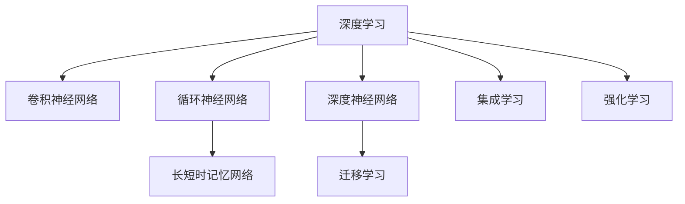

                 

# 李开复：AI 2.0 时代的科技价值

> 关键词：人工智能,深度学习,深度神经网络,机器学习,自然语言处理,NLP,计算机视觉,机器学习,深度学习,自然语言处理,机器学习

## 1. 背景介绍

### 1.1 问题由来
在人工智能(AI)的历程中，AI 2.0时代代表着一次重大飞跃，其核心是深度学习（Deep Learning）的爆发式发展。深度学习利用多层次的非线性神经网络结构，极大提升了在视觉、语音、自然语言处理（Natural Language Processing, NLP）等领域的认知能力。这一时期，AI的突破不仅仅体现在计算速度和存储能力上，更在于对复杂任务处理能力的飞跃，以及其对各行各业的广泛渗透和影响。

### 1.2 问题核心关键点
AI 2.0时代的核心突破在于：
1. 深度神经网络（Deep Neural Network, DNN）：通过多层非线性映射，实现了从原始数据到复杂模式的高效学习。
2. 大数据：海量标注和非标注数据为深度学习模型提供了丰富的训练素材，提升了模型泛化能力。
3. 计算能力：GPU、TPU等高性能计算设备，使得深度学习模型能够大规模并行训练，极大提升了训练效率。
4. 集成学习（Ensemble Learning）：通过多个模型或不同架构的组合，进一步提升了模型的泛化能力和预测精度。
5. 强化学习（Reinforcement Learning）：通过与环境的交互，实现策略优化和复杂决策任务的自动化。

这些技术进步和突破，使得AI 2.0时代的AI应用得以从实验室走向实用，从专有领域走向通用，从技术研究走向产业化应用。

### 1.3 问题研究意义
AI 2.0时代的科技价值在于其广泛的应用和深远的影响：
1. 社会生产力的提升：AI 2.0技术在制造、医疗、金融、教育等领域的应用，显著提升了生产效率和社会效益。
2. 信息获取和处理能力的飞跃：通过深度学习技术，人类获取和处理信息的能力大大增强，知识的传播和利用效率显著提升。
3. 智慧城市建设：AI 2.0技术为智慧城市建设提供了技术支撑，智能交通、智能安防、智能医疗等应用成为可能。
4. 个性化服务的普及：AI 2.0技术使得个性化服务成为现实，通过深度学习模型，可以实现精准营销、个性化推荐、智能客服等服务。
5. 创新驱动发展：AI 2.0技术催生了大量的创新型企业，推动了产业升级和经济发展。

本文将系统梳理AI 2.0时代的核心技术、应用场景及其前景，并探讨未来发展趋势和面临的挑战，以期为行业和学界提供全面、深入的视角和思考。

## 2. 核心概念与联系

### 2.1 核心概念概述

为了更好地理解AI 2.0时代的科技价值，本节将介绍几个密切相关的核心概念：

- **深度学习（Deep Learning）**：一种基于多层神经网络的机器学习技术，通过反向传播算法训练神经网络，实现对复杂模式的识别和预测。
- **卷积神经网络（Convolutional Neural Network, CNN）**：用于图像处理的深度学习架构，通过卷积和池化操作，有效提取图像特征。
- **循环神经网络（Recurrent Neural Network, RNN）**：用于序列数据处理的深度学习架构，通过时间步的长短时记忆单元，捕捉序列数据的时序依赖关系。
- **长短时记忆网络（Long Short-Term Memory, LSTM）**：一种特殊的RNN，能够有效处理长期依赖关系，在语音识别、自然语言处理等领域广泛应用。
- **深度神经网络（DNN）**：多层次的非线性神经网络，包括卷积神经网络、循环神经网络和长短时记忆网络等，是AI 2.0时代的主流架构。
- **迁移学习（Transfer Learning）**：通过预训练模型迁移学习新任务，提升模型在新任务上的泛化能力。
- **集成学习（Ensemble Learning）**：通过结合多个模型的预测结果，提升模型的鲁棒性和泛化能力。
- **强化学习（Reinforcement Learning, RL）**：通过与环境的交互，优化决策策略，实现复杂的自动化任务。

这些核心概念之间存在着紧密的联系和相互影响，共同构成了AI 2.0时代的核心技术框架。

### 2.2 核心概念原理和架构的 Mermaid 流程图



这个流程图展示了深度学习与其他核心概念之间的联系和应用场景。通过卷积神经网络处理图像，通过循环神经网络和长短时记忆网络处理序列数据，通过深度神经网络实现多层映射，通过迁移学习提升模型在新任务上的泛化能力，通过集成学习提升模型的鲁棒性和泛化能力，并通过强化学习实现自动化决策。

## 3. 核心算法原理 & 具体操作步骤

### 3.1 算法原理概述

AI 2.0时代的核心算法原理主要集中在深度学习和深度神经网络技术上。其基本思路是通过多层非线性映射，从原始数据中提取高层次的特征，实现对复杂模式的识别和预测。

以图像识别为例，深度学习算法通常使用卷积神经网络（CNN）作为基础架构。CNN通过卷积层、池化层和全连接层等模块，对图像进行特征提取和分类。训练过程中，通过反向传播算法更新网络参数，使得模型能够更好地适应输入数据。

对于自然语言处理任务，深度学习技术常使用循环神经网络（RNN）和长短时记忆网络（LSTM）等序列模型。这些模型能够处理输入序列中的时序依赖关系，通过时间步的序列建模，实现对自然语言的理解与生成。

在强化学习中，模型通过与环境的交互，根据当前状态和行动的奖惩机制，不断优化策略。通过Q学习、策略梯度等方法，模型能够在复杂的决策环境中实现高效的自动化决策。

### 3.2 算法步骤详解

以下是深度学习算法的一般步骤：

1. **数据预处理**：将原始数据转换为模型能够处理的格式，如图像的归一化、文本的标记化等。
2. **模型选择**：根据任务特点选择合适的深度学习模型，如CNN、RNN、LSTM等。
3. **参数初始化**：对模型的权重和偏置进行初始化，通常使用随机初始化或预训练模型。
4. **模型训练**：通过反向传播算法，利用标注数据训练模型，不断更新参数，优化模型性能。
5. **模型评估**：在验证集或测试集上评估模型性能，选择最优模型。
6. **模型部署**：将训练好的模型部署到实际应用中，实现预测或自动化决策。

### 3.3 算法优缺点

深度学习算法的优点包括：
- 强大的泛化能力：能够处理复杂数据和复杂模式，具有较高的泛化能力。
- 高效的特征提取：通过多层非线性映射，自动提取高层次的特征，减少了特征工程的工作量。
- 广泛的应用场景：在图像、语音、自然语言处理等领域广泛应用，推动了技术进步和产业升级。

深度学习算法也存在一些局限性：
- 高计算需求：需要大量的计算资源和存储空间，对硬件要求较高。
- 对标注数据依赖：需要大量的标注数据进行训练，标注成本较高。
- 模型可解释性不足：深度学习模型通常被视为"黑盒"，难以解释其内部工作机制和决策过程。
- 对抗样本脆弱：对抗样本攻击容易使模型产生误判，需要额外的安全措施。

### 3.4 算法应用领域

AI 2.0时代的深度学习算法在多个领域得到了广泛应用，以下是几个典型应用场景：

- **计算机视觉**：深度学习在图像分类、物体检测、人脸识别等领域取得了突破性进展。
- **自然语言处理**：深度学习在机器翻译、情感分析、文本生成、问答系统等领域广泛应用。
- **语音识别**：深度学习在语音识别、语音合成、说话人识别等领域取得了显著成效。
- **医疗健康**：深度学习在医疗影像分析、疾病诊断、药物研发等领域的应用，显著提升了医疗服务效率和质量。
- **自动驾驶**：深度学习在自动驾驶、智能交通等领域，推动了汽车智能化和交通管理智能化。
- **金融科技**：深度学习在风险管理、客户服务、欺诈检测等领域，提升了金融服务的智能化水平。
- **智能制造**：深度学习在工业自动化、质量检测、设备维护等领域，推动了制造业的智能化转型。

这些应用场景展示了深度学习技术的广泛应用，并在多个领域推动了产业升级和经济发展。

## 4. 数学模型和公式 & 详细讲解 & 举例说明

### 4.1 数学模型构建

以图像分类为例，深度学习模型通常使用卷积神经网络（CNN）架构。模型输入为图像像素值，输出为类别概率。数学模型可以表示为：

$$
P(y|x;\theta) = \frac{e^{\sum_{i=1}^{N}(\theta_i \cdot x_i)}}{\sum_{j=1}^{K}e^{\sum_{i=1}^{N}(\theta_j \cdot x_i)}}
$$

其中 $x$ 表示输入的图像像素向量，$y$ 表示类别标签，$N$ 表示输入层神经元个数，$K$ 表示类别数目，$\theta$ 表示模型参数。模型通过优化参数 $\theta$，使得模型输出的概率分布尽可能接近真实标签的分布。

### 4.2 公式推导过程

以反向传播算法为例，以下是卷积神经网络中的反向传播公式推导：

设输入图像 $x$，模型输出的特征图 $A$ 和卷积核 $w$，则卷积操作可以表示为：

$$
A = f((x * w) + b)
$$

其中 $f$ 为激活函数，$*$ 表示卷积操作，$b$ 为偏置项。对上述公式进行反向传播，得到输出 $\hat{y}$ 对模型参数 $\theta$ 的梯度：

$$
\frac{\partial L}{\partial \theta} = \frac{\partial L}{\partial \hat{y}}\frac{\partial \hat{y}}{\partial A}\frac{\partial A}{\partial x}\frac{\partial x}{\partial \theta}
$$

其中 $L$ 为损失函数，$\hat{y}$ 为模型输出的预测值。通过链式法则和梯度求导，可以求出模型参数的更新规则，实现深度学习的训练过程。

### 4.3 案例分析与讲解

以图像分类任务为例，以下是深度学习模型的案例分析：

1. **数据集准备**：使用MNIST手写数字数据集，将其划分为训练集和测试集。
2. **模型构建**：使用Keras框架搭建卷积神经网络模型，包含卷积层、池化层和全连接层。
3. **模型训练**：使用反向传播算法，在训练集上对模型进行训练，每轮迭代更新参数。
4. **模型评估**：在测试集上评估模型性能，使用准确率、精确率、召回率等指标衡量模型效果。
5. **模型改进**：通过数据增强、模型优化等手段，进一步提升模型性能。

## 5. 项目实践：代码实例和详细解释说明

### 5.1 开发环境搭建

在进行深度学习项目实践前，需要准备好开发环境。以下是使用Python进行TensorFlow开发的环境配置流程：

1. 安装Anaconda：从官网下载并安装Anaconda，用于创建独立的Python环境。
2. 创建并激活虚拟环境：
```bash
conda create -n tf-env python=3.8 
conda activate tf-env
```

3. 安装TensorFlow：根据CUDA版本，从官网获取对应的安装命令。例如：
```bash
pip install tensorflow==2.4
```

4. 安装各类工具包：
```bash
pip install numpy pandas scikit-learn matplotlib tqdm jupyter notebook ipython
```

完成上述步骤后，即可在`tf-env`环境中开始深度学习实践。

### 5.2 源代码详细实现

以下是使用TensorFlow搭建卷积神经网络模型并进行图像分类的代码实现：

```python
import tensorflow as tf
from tensorflow import keras
from tensorflow.keras import layers

# 数据准备
(x_train, y_train), (x_test, y_test) = keras.datasets.mnist.load_data()
x_train = x_train.reshape(-1, 28, 28, 1).astype('float32') / 255.0
x_test = x_test.reshape(-1, 28, 28, 1).astype('float32') / 255.0
y_train = keras.utils.to_categorical(y_train, 10)
y_test = keras.utils.to_categorical(y_test, 10)

# 模型构建
model = keras.Sequential([
    keras.layers.Conv2D(32, (3, 3), activation='relu', input_shape=(28, 28, 1)),
    keras.layers.MaxPooling2D((2, 2)),
    keras.layers.Flatten(),
    keras.layers.Dense(128, activation='relu'),
    keras.layers.Dense(10, activation='softmax')
])

# 模型编译
model.compile(optimizer='adam', loss='categorical_crossentropy', metrics=['accuracy'])

# 模型训练
model.fit(x_train, y_train, batch_size=64, epochs=10, validation_data=(x_test, y_test))

# 模型评估
model.evaluate(x_test, y_test, verbose=2)
```

以上是使用TensorFlow搭建卷积神经网络模型并进行图像分类的完整代码实现。可以看到，使用TensorFlow框架搭建深度学习模型非常简单，可以快速迭代研究。

### 5.3 代码解读与分析

让我们再详细解读一下关键代码的实现细节：

**数据准备**：
- 使用Keras内置的MNIST数据集，将数据分为训练集和测试集。
- 对图像进行归一化，使像素值在0到1之间。
- 对标签进行独热编码，以便于模型训练。

**模型构建**：
- 使用Sequential模型，堆叠多个层构成网络。
- 第一层使用卷积层和ReLU激活函数，提取图像特征。
- 第二层使用池化层，降低特征维度。
- 第三层和第四层使用全连接层，进行特征映射和分类。

**模型编译**：
- 使用Adam优化器和交叉熵损失函数，同时监测模型准确率。

**模型训练和评估**：
- 在训练集上使用随机梯度下降算法，每轮迭代更新模型参数。
- 在验证集上评估模型性能，防止过拟合。

**代码优化**：
- 使用TensorFlow提供的优化器、损失函数、激活函数等，减少了代码量。
- 使用Keras的高级API，使得模型构建和训练过程更加简洁。

## 6. 实际应用场景

### 6.1 智能客服系统

深度学习技术在智能客服系统中的应用，使得客服效率和质量显著提升。智能客服系统通过深度学习模型，能够理解客户意图，自动匹配最佳答复，实现24小时不间断服务。

具体实现方式如下：
1. 收集历史客服对话记录，将问题和最佳答复构建成监督数据。
2. 使用深度学习模型对客服数据进行标注和训练。
3. 在新的客户咨询中，模型自动理解客户意图，匹配最佳答复进行回复。
4. 实时收集客户反馈，进一步优化模型性能。

### 6.2 金融舆情监测

深度学习在金融舆情监测中的应用，通过自然语言处理技术，实时监测金融市场舆情，预测市场趋势，辅助金融机构决策。

具体实现方式如下：
1. 收集金融领域的新闻、报道、评论等文本数据，并对其进行情感标注和主题标注。
2. 使用深度学习模型对金融舆情进行分析和预测。
3. 实时监测金融市场舆情，预测市场趋势，辅助金融机构决策。

### 6.3 个性化推荐系统

深度学习在个性化推荐系统中的应用，通过用户行为数据和文本内容，为用户提供个性化的推荐服务。

具体实现方式如下：
1. 收集用户浏览、点击、评论、分享等行为数据，提取和用户交互的物品标题、描述、标签等文本内容。
2. 使用深度学习模型对用户行为和文本内容进行建模。
3. 在生成推荐列表时，先用候选物品的文本描述作为输入，由模型预测用户的兴趣匹配度。
4. 结合其他特征综合排序，得到个性化推荐结果。

### 6.4 未来应用展望

随着深度学习技术的发展，未来深度学习将在更多领域得到应用，带来更广阔的应用前景：

- **智慧医疗**：深度学习在医疗影像分析、疾病诊断、药物研发等领域的应用，将显著提升医疗服务效率和质量。
- **智能教育**：深度学习在作业批改、学情分析、知识推荐等领域的应用，将促进教育公平，提高教学质量。
- **智慧城市**：深度学习在城市事件监测、舆情分析、应急指挥等领域的应用，将提高城市管理的智能化水平。
- **智能制造**：深度学习在工业自动化、质量检测、设备维护等领域的应用，将推动制造业的智能化转型。
- **自动驾驶**：深度学习在自动驾驶、智能交通等领域的应用，将推动汽车智能化和交通管理智能化。
- **金融科技**：深度学习在风险管理、客户服务、欺诈检测等领域的应用，将提升金融服务的智能化水平。

## 7. 工具和资源推荐

### 7.1 学习资源推荐

为了帮助开发者系统掌握深度学习技术，这里推荐一些优质的学习资源：

1. **Deep Learning Specialization（深度学习专项课程）**：由Andrew Ng教授主讲的Coursera课程，全面介绍深度学习的基本概念和经典模型。
2. **Deep Learning with Python**：Ian Goodfellow、Yoshua Bengio、Aaron Courville三位深度学习专家合著的书籍，详细讲解深度学习的基础知识和实现细节。
3. **TensorFlow官方文档**：TensorFlow的官方文档，提供了丰富的教程和样例代码，适合快速上手实验。
4. **Keras官方文档**：Keras的官方文档，提供了丰富的API文档和样例代码，适合快速搭建深度学习模型。
5. **PyTorch官方文档**：PyTorch的官方文档，提供了丰富的API文档和样例代码，适合快速搭建深度学习模型。
6. **CS231n：卷积神经网络课程**：斯坦福大学开设的计算机视觉课程，讲解CNN的基本原理和实现细节。

### 7.2 开发工具推荐

高效的软件开发离不开优秀的工具支持。以下是几款用于深度学习开发的常用工具：

1. **TensorFlow**：Google主导的深度学习框架，提供了丰富的API和工具支持，适合大规模工程应用。
2. **PyTorch**：Facebook主导的深度学习框架，灵活性强，易于迭代研究。
3. **Keras**：Keras API提供简单易用的深度学习模型搭建工具，适合快速原型开发和研究。
4. **Anaconda**：Python环境管理工具，提供虚拟环境和包管理功能，方便开发者快速搭建和维护环境。
5. **Jupyter Notebook**：开源的交互式开发工具，支持代码执行、图形展示和数据可视化，适合研究和交流。
6. **Google Colab**：谷歌提供的云端Jupyter Notebook环境，免费提供GPU/TPU算力，适合快速实验和迭代。

### 7.3 相关论文推荐

深度学习技术的发展源于学界的持续研究。以下是几篇奠基性的相关论文，推荐阅读：

1. **ImageNet Classification with Deep Convolutional Neural Networks**：Alex Krizhevsky等人在2012年提出的深度卷积神经网络模型，推动了计算机视觉领域的突破性进展。
2. **Long Short-Term Memory**：Sepp Hochreiter、Jürgen Schmidhuber在1997年提出的LSTM模型，解决了RNN在长序列上的学习难题。
3. **Recurrent Neural Network Language Model**：Ian Goodfellow、Yoshua Bengio、Aaron Courville在2013年提出的递归神经网络语言模型，推动了自然语言处理领域的突破性进展。
4. **Vision and Language**：Andrej Karpathy等人在2017年提出的视觉语言模型，展示了深度学习在多模态学习上的潜力。
5. **Deep Reinforcement Learning for Agents that Plan Long-Horizon Goals**：John Schulman等人在2017年提出的深度强化学习模型，展示了深度学习在自动化决策上的潜力。

这些论文代表了大深度学习技术的发展脉络，通过学习这些前沿成果，可以帮助研究者把握学科前进方向，激发更多的创新灵感。

## 8. 总结：未来发展趋势与挑战

### 8.1 研究成果总结

AI 2.0时代的深度学习技术，通过多层非线性映射，从原始数据中提取高层次的特征，实现了对复杂模式的识别和预测。深度学习在图像、语音、自然语言处理等领域取得了突破性进展，推动了技术进步和产业升级。

### 8.2 未来发展趋势

未来深度学习技术将继续在以下几个方面取得进展：

1. **超大规模模型**：预训练大模型的参数量将进一步增大，通过更多数据和更强的计算能力，提升模型的泛化能力和性能。
2. **自监督学习**：自监督学习技术，通过未标注数据进行预训练，降低深度学习对标注数据的依赖。
3. **多模态学习**：多模态学习技术，通过结合视觉、语音、文本等不同模态的信息，提升深度学习的泛化能力。
4. **联邦学习**：联邦学习技术，通过分布式计算，保护数据隐私的同时提升模型性能。
5. **边缘计算**：边缘计算技术，通过在设备端进行模型推理，提升深度学习的实时性和效率。

### 8.3 面临的挑战

尽管深度学习技术取得了显著进步，但在应用和发展过程中，仍面临诸多挑战：

1. **数据标注成本**：深度学习模型的训练需要大量标注数据，标注成本较高。如何降低标注成本，提升数据效率，成为重要研究方向。
2. **模型可解释性**：深度学习模型通常被视为"黑盒"，难以解释其内部工作机制和决策过程。如何提升模型的可解释性，增强可信度，是未来研究方向。
3. **对抗样本攻击**：深度学习模型容易受到对抗样本的攻击，导致误判。如何增强模型的鲁棒性，保障模型安全性，是未来研究方向。
4. **计算资源需求**：深度学习模型需要大量的计算资源和存储空间，对硬件要求较高。如何优化模型结构和训练过程，降低计算资源需求，是未来研究方向。
5. **伦理和社会影响**：深度学习技术的发展，带来了伦理和社会方面的挑战，如隐私保护、公平性、责任归属等。如何构建公平、透明、安全的深度学习系统，是未来研究方向。

### 8.4 研究展望

未来深度学习技术将在以下几个方面进行深入研究：

1. **自监督学习和半监督学习**：通过未标注数据进行预训练，降低深度学习对标注数据的依赖。
2. **多模态学习和跨领域迁移**：结合视觉、语音、文本等不同模态的信息，提升深度学习的泛化能力。
3. **联邦学习和分布式计算**：通过分布式计算，保护数据隐私的同时提升模型性能。
4. **模型压缩和优化**：通过模型压缩、量化等技术，降低深度学习模型的计算资源需求。
5. **可解释性和鲁棒性**：提升深度学习模型的可解释性和鲁棒性，增强模型可信度和安全性。
6. **伦理和社会影响**：构建公平、透明、安全的深度学习系统，保障数据隐私和伦理道德。

## 9. 附录：常见问题与解答

**Q1：深度学习模型如何实现迁移学习？**

A: 深度学习模型通过预训练模型迁移学习新任务，提升模型在新任务上的泛化能力。具体实现方式包括：
1. 使用预训练模型作为初始化权重，在新任务上微调。
2. 使用微调后的模型作为初始化权重，在新任务上从头训练。
3. 使用迁移学习的目标函数，将预训练模型的损失函数与新任务的损失函数进行组合，提升模型的泛化能力。

**Q2：深度学习模型如何防止过拟合？**

A: 深度学习模型防止过拟合的方法包括：
1. 数据增强：通过数据增强技术，扩充训练数据，提高模型的泛化能力。
2. 正则化：使用L2正则、Dropout等正则化技术，防止模型过拟合。
3. 早停法（Early Stopping）：在验证集上监测模型性能，防止过拟合。
4. 批归一化（Batch Normalization）：通过批归一化技术，加速模型收敛，防止过拟合。
5. 参数共享：通过参数共享技术，减少模型参数量，防止过拟合。

**Q3：深度学习模型如何进行超参数调优？**

A: 深度学习模型的超参数调优通常包括：
1. 网格搜索（Grid Search）：在预定的超参数组合中进行搜索，找到最优的超参数组合。
2. 随机搜索（Random Search）：在预定的超参数空间中进行随机搜索，找到最优的超参数组合。
3. 贝叶斯优化（Bayesian Optimization）：通过贝叶斯优化算法，高效地搜索超参数空间，找到最优的超参数组合。
4. 学习率调度：使用学习率调度策略，动态调整学习率，优化模型性能。

**Q4：深度学习模型如何进行模型压缩？**

A: 深度学习模型的模型压缩通常包括：
1. 参数剪枝（Pruning）：通过剪枝技术，去除冗余的参数，减少模型大小。
2. 量化（Quantization）：通过量化技术，将浮点数模型转化为定点模型，减少模型大小和计算资源需求。
3. 低秩逼近（Low-Rank Approximation）：通过低秩逼近技术，将高维矩阵转化为低维矩阵，减少模型大小。
4. 知识蒸馏（Knowledge Distillation）：通过知识蒸馏技术，将大型模型的知识迁移到小型模型，提升模型性能。

---

作者：禅与计算机程序设计艺术 / Zen and the Art of Computer Programming

