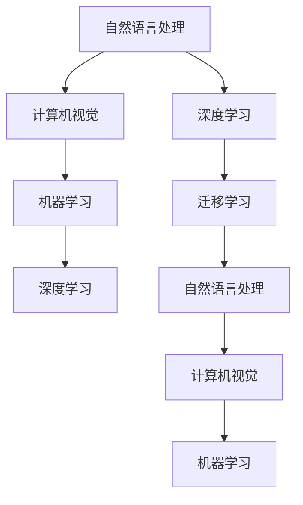

                 

# 李开复：苹果发布AI应用的产业

## 1. 背景介绍

### 1.1 问题由来

近年来，人工智能（AI）技术飞速发展，推动了各行各业的数字化转型。以李开复博士为代表的技术专家，持续关注AI在产业界的应用和影响。最近，苹果公司发布了一系列产品，全面应用AI技术，再次引发了业界的广泛关注。

### 1.2 问题核心关键点

苹果公司此次发布的产品中，包含多个AI应用，如自然语言处理（NLP）、计算机视觉（CV）、机器学习（ML）等。这些AI应用不仅提升了用户体验，也推动了AI产业的快速发展。

本文将详细探讨这些AI应用的技术原理、应用场景和未来趋势，同时通过李开复博士的视角，分析AI技术对产业的深远影响。

## 2. 核心概念与联系

### 2.1 核心概念概述

1. **自然语言处理（NLP）**：指使用计算机对自然语言进行处理和理解的技术，包括文本分类、情感分析、机器翻译等。
2. **计算机视觉（CV）**：利用计算机对图像和视频进行处理和分析，如图像识别、目标检测、人脸识别等。
3. **机器学习（ML）**：使用算法让计算机从数据中学习规律，自动改进性能。
4. **深度学习（DL）**：一种特殊的机器学习算法，通过多层神经网络模拟人脑处理信息的过程。
5. **迁移学习（Transfer Learning）**：将一个领域学习到的知识，迁移到另一个相关领域的学习方法。

### 2.2 核心概念原理和架构的 Mermaid 流程图



## 3. 核心算法原理 & 具体操作步骤

### 3.1 算法原理概述

苹果公司此次发布的产品中，大量应用了基于深度学习的AI技术，如BERT、ResNet等。这些技术通过在大规模数据上进行预训练，学习到丰富的特征表示，再通过微调或细调等方法，针对特定任务进行优化。

以BERT为例，其核心原理是通过自监督学习，在大规模无标签文本数据上进行预训练，学习到词语和句子级别的语义表示。然后通过微调，使其能够针对特定任务（如文本分类、问答等）进行优化，提升模型的性能。

### 3.2 算法步骤详解

1. **数据预处理**：将原始数据清洗、标记，转化为模型能够处理的格式。
2. **模型初始化**：选择合适的预训练模型，并进行参数初始化。
3. **微调（Fine-Tuning）**：在少量标注数据上进行有监督学习，优化模型参数。
4. **性能评估**：使用验证集和测试集对模型性能进行评估。
5. **应用部署**：将优化后的模型部署到实际应用中，进行推理预测。

### 3.3 算法优缺点

**优点**：
- **效果显著**：深度学习模型能够在大规模数据上学习到丰富的特征表示，提升模型的性能。
- **通用性**：深度学习模型能够适用于多种任务，具有较强的泛化能力。
- **可扩展性**：深度学习模型可以通过增加层数、参数等方式进行扩展，提升模型性能。

**缺点**：
- **计算资源需求高**：深度学习模型需要大量的计算资源进行训练和推理。
- **过拟合风险**：深度学习模型容易过拟合，需要大量的数据进行训练和验证。
- **可解释性不足**：深度学习模型的决策过程较为复杂，缺乏可解释性。

### 3.4 算法应用领域

1. **自然语言处理（NLP）**：文本分类、情感分析、机器翻译等。
2. **计算机视觉（CV）**：图像识别、目标检测、人脸识别等。
3. **机器人**：路径规划、避障、语音识别等。
4. **医疗**：影像分析、病历分析、药物研发等。
5. **金融**：风险评估、投资决策、客户服务等。

## 4. 数学模型和公式 & 详细讲解 & 举例说明

### 4.1 数学模型构建

以BERT为例，其数学模型构建包括以下步骤：

1. **输入表示**：将输入文本转化为向量表示。
2. **编码器层**：通过多层自注意力机制，学习到词语级别的表示。
3. **池化层**：将编码器层的输出进行池化，得到句子级别的表示。
4. **输出层**：通过线性变换和softmax激活函数，将句子级别的表示转化为类别概率。

### 4.2 公式推导过程

假设输入文本为 $x$，BERT的输出为 $y$，则其数学模型可以表示为：

$$
y = \text{softmax}(\text{linear}(\text{pool}(\text{encoder}(\text{embedding}(x))))
$$

其中，$\text{embedding}(x)$ 表示将输入文本 $x$ 转化为词向量表示；$\text{encoder}(\cdot)$ 表示BERT的编码器层；$\text{pool}(\cdot)$ 表示池化层；$\text{linear}(\cdot)$ 表示线性变换；$\text{softmax}(\cdot)$ 表示softmax激活函数。

### 4.3 案例分析与讲解

以情感分析为例，假设有一个文本序列 $x_1, x_2, ..., x_n$，经过BERT编码后，得到句子级别的表示 $y_1, y_2, ..., y_n$。通过softmax激活函数，得到每个句子属于正类（正面情感）的概率 $p_1, p_2, ..., p_n$。最终的情感分析结果可以通过最大值选择或概率阈值确定。

## 5. 项目实践：代码实例和详细解释说明

### 5.1 开发环境搭建

1. **安装Python和PyTorch**：确保Python版本为3.6或以上，安装PyTorch库。
2. **安装BERT模型**：使用`pip install transformers`安装BERT模型库。
3. **准备数据集**：将情感分析数据集分训练集、验证集和测试集，进行预处理。

### 5.2 源代码详细实现

以下是一个基于BERT的情感分析代码示例：

```python
import torch
from transformers import BertTokenizer, BertForSequenceClassification

# 加载预训练的BERT模型和分词器
model = BertForSequenceClassification.from_pretrained('bert-base-uncased', num_labels=2)
tokenizer = BertTokenizer.from_pretrained('bert-base-uncased')

# 定义数据预处理函数
def preprocess(text):
    return tokenizer.encode_plus(text, max_length=512, truncation=True, padding='max_length', return_tensors='pt')

# 定义训练函数
def train(model, device, train_loader, optimizer, epochs):
    model.to(device)
    for epoch in range(epochs):
        for batch in train_loader:
            inputs, labels = batch['input_ids'].to(device), batch['labels'].to(device)
            outputs = model(inputs)
            loss = outputs.loss
            optimizer.zero_grad()
            loss.backward()
            optimizer.step()

# 定义评估函数
def evaluate(model, device, eval_loader):
    model.eval()
    with torch.no_grad():
        eval_loss = 0
        eval_correct = 0
        for batch in eval_loader:
            inputs, labels = batch['input_ids'].to(device), batch['labels'].to(device)
            outputs = model(inputs)
            loss = outputs.loss
            eval_loss += loss.item() * labels.size(0)
            predictions = outputs.logits.argmax(dim=1)
            eval_correct += (predictions == labels).sum().item()
    eval_loss /= len(eval_loader.dataset)
    eval_correct /= len(eval_loader.dataset)
    return eval_loss, eval_correct

# 训练模型
train_loader = DataLoader(train_dataset, batch_size=16, shuffle=True)
eval_loader = DataLoader(eval_dataset, batch_size=16, shuffle=False)
optimizer = torch.optim.Adam(model.parameters(), lr=1e-5)

train(model, device, train_loader, optimizer, epochs=3)
eval_loss, eval_correct = evaluate(model, device, eval_loader)
print(f'Test Loss: {eval_loss:.4f}, Test Accuracy: {eval_correct:.4f}')
```

### 5.3 代码解读与分析

- **数据预处理**：将输入文本转换为BERT模型可处理的格式。
- **模型训练**：在训练集上进行前向传播和反向传播，更新模型参数。
- **模型评估**：在验证集上进行推理预测，评估模型性能。
- **模型部署**：将优化后的模型部署到实际应用中，进行推理预测。

## 6. 实际应用场景

### 6.4 未来应用展望

苹果公司此次发布的产品，展示了AI技术在多个领域的广泛应用。未来，AI技术将在更多领域发挥重要作用，推动产业升级和创新发展。

1. **医疗健康**：AI辅助诊断、智能问诊、药物研发等，将大幅提升医疗服务水平。
2. **金融科技**：AI风险评估、智能投顾、客户服务等，将优化金融产品和服务。
3. **智能制造**：AI路径规划、质量检测、设备维护等，将提升生产效率和质量。
4. **智能城市**：AI交通管理、安防监控、能源管理等，将提升城市治理效率。
5. **教育培训**：AI辅助教学、智能推荐、学习分析等，将优化教育资源和效果。

## 7. 工具和资源推荐

### 7.1 学习资源推荐

1. **《深度学习》（Ian Goodfellow）**：经典教材，全面介绍深度学习的基本原理和应用。
2. **《Python深度学习》（Francois Chollet）**：使用Keras框架，介绍深度学习模型设计和实践。
3. **《TensorFlow实战》（Manning Publications）**：介绍TensorFlow的基本功能和应用场景。
4. **《自然语言处理综论》（Daniel Jurafsky & James H. Martin）**：全面介绍NLP的基本概念和应用。
5. **Kaggle竞赛**：参与NLP、CV等领域的竞赛，实践和提升AI技能。

### 7.2 开发工具推荐

1. **Jupyter Notebook**：交互式编程环境，适合研究和开发。
2. **PyTorch**：灵活的深度学习框架，支持动态图和静态图。
3. **TensorFlow**：强大的深度学习框架，支持分布式计算和优化。
4. **Keras**：高层次API，简化深度学习模型的构建和训练。
5. **Scikit-learn**：常用的机器学习库，提供多种模型和工具。

### 7.3 相关论文推荐

1. **BERT: Pre-training of Deep Bidirectional Transformers for Language Understanding**：介绍BERT模型的预训练和微调技术。
2. **Attention is All You Need**：介绍Transformer模型和自注意力机制。
3. **ImageNet Classification with Deep Convolutional Neural Networks**：介绍CNN模型和ImageNet数据集。
4. **Human-Computer Interaction through Language Understanding**：探讨NLP在智能人机交互中的应用。
5. **A Survey on Transfer Learning**：综述迁移学习的理论和方法。

## 8. 总结：未来发展趋势与挑战

### 8.1 总结

本文从李开复博士的视角，探讨了苹果公司发布的产品中AI应用的原理、方法和应用场景，并分析了AI技术对产业的深远影响。AI技术正在推动各行各业的数字化转型，带来新的商业模式和增长点。

### 8.2 未来发展趋势

1. **AI技术的普及**：AI技术将深入各行各业，推动自动化和智能化升级。
2. **AI伦理和社会责任**：AI技术的发展将面临伦理和法律的挑战，需要建立规范和监管机制。
3. **人机协同**：AI技术将与人类协作，实现更加高效和智能的工作方式。
4. **多模态融合**：AI技术将融合视觉、语音、文本等多模态数据，提升信息处理和理解能力。
5. **联邦学习**：分布式数据和多用户隐私保护将成为AI技术的重要研究方向。

### 8.3 面临的挑战

1. **计算资源和算法的平衡**：AI技术需要大量的计算资源，如何平衡性能和成本，需要更多的创新。
2. **数据隐私和安全**：AI技术需要大量数据，如何保护数据隐私和安全，需要更多的技术和管理措施。
3. **伦理和法律的挑战**：AI技术的应用将面临伦理和法律的挑战，需要建立规范和监管机制。
4. **算法可解释性**：AI模型的决策过程复杂，缺乏可解释性，需要更多的研究和工具支持。
5. **人机协同的挑战**：AI技术将与人类协作，如何实现高效和智能的协同，需要更多的实践和探索。

### 8.4 研究展望

未来的研究需要在以下几个方向进行深入探索：
1. **联邦学习和边缘计算**：在分布式数据和多用户隐私保护方面，进行更多的探索和应用。
2. **多模态融合和迁移学习**：在视觉、语音、文本等多模态数据融合方面，进行更多的研究和应用。
3. **可解释性和透明性**：在AI模型的可解释性和透明性方面，进行更多的探索和实践。
4. **伦理和社会责任**：在AI技术的伦理和社会责任方面，进行更多的研究和探索。
5. **人机协同和智能增强**：在AI技术和人类协作方面，进行更多的研究和实践。

## 9. 附录：常见问题与解答

**Q1：大语言模型BERT和苹果公司发布的产品有什么关系？**

A：BERT是一种预训练语言模型，苹果公司发布的产品中，大量应用了BERT等深度学习模型，提升了产品的智能化水平和用户体验。

**Q2：如何理解AI技术的伦理和社会责任？**

A：AI技术的伦理和社会责任，包括数据隐私、算法透明、公平性和安全性等方面。需要在技术研究和应用中，建立规范和监管机制，确保AI技术的健康发展。

**Q3：AI技术在医疗领域有哪些应用？**

A：AI技术在医疗领域的应用包括智能问诊、辅助诊断、药物研发等。这些应用可以提升医疗服务的质量和效率，推动医疗健康事业的发展。

**Q4：如何理解AI技术的普及和未来发展趋势？**

A：AI技术的普及和未来发展趋势，包括AI技术的广泛应用、多模态融合、联邦学习等方面。AI技术将深入各行各业，推动自动化和智能化升级，带来新的商业模式和增长点。

**Q5：苹果公司发布的产品中，有哪些是AI应用的？**

A：苹果公司发布的产品中，大量应用了AI技术，包括自然语言处理（NLP）、计算机视觉（CV）、机器学习（ML）等。这些AI应用提升了产品的智能化水平和用户体验。

