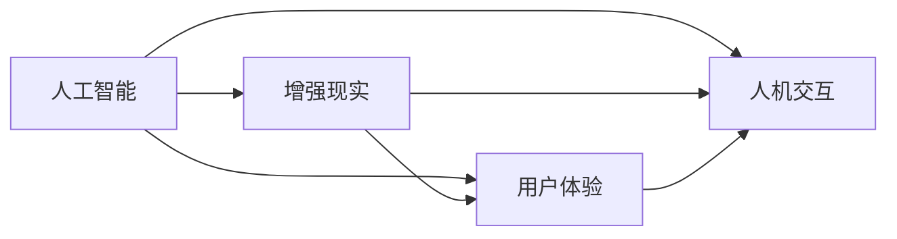

                 

# 李开复：苹果发布AI应用的文化价值

李开复在人工智能领域的贡献无人不知，他曾多次就人工智能的发展发表过自己的观点，而此次他聚焦于苹果在人工智能应用中的文化价值，为我们深入探讨了这一话题。

## 1. 背景介绍

苹果公司一直以来以其产品设计和用户体验著称，但近年来，苹果在人工智能方面的布局也逐渐明朗化。从Siri语音助手到Face ID面部识别，再到iOS 13中的增强现实(AR)技术，苹果在AI方面的应用已经渗透到了各个角落。这些应用不仅仅是技术上的突破，更反映了苹果公司对于文化的重视，以及如何将技术与文化相结合。

## 2. 核心概念与联系

### 2.1 核心概念概述

要理解苹果在AI应用中的文化价值，首先需要明确几个核心概念：

- **人工智能(AI)**：利用计算机系统模拟人类智能过程的技术。
- **增强现实(AR)**：通过计算机技术和网络技术，将虚拟信息叠加在现实世界中。
- **文化价值**：产品或技术对文化的影响和传承。
- **用户体验(UX)**：用户与产品或服务互动过程中的所有体验。
- **人机交互(HCI)**：人类与计算机之间的交互方式。

### 2.2 核心概念原理和架构的 Mermaid 流程图



此图展示了人工智能、增强现实、用户体验和人机交互之间的联系。可以看出，苹果的AI应用不仅仅是技术上的创新，更是通过增强现实和用户体验设计，将文化价值贯穿其中，使得AI应用具有更深层次的意义。

## 3. 核心算法原理 & 具体操作步骤

### 3.1 算法原理概述

苹果在AI应用中的算法原理主要包括：

- **深度学习(DL)**：基于深度神经网络的AI算法，可以处理复杂的非线性关系，适用于图像识别、语音识别等任务。
- **计算机视觉(CV)**：使计算机能够理解和解释图像和视频中的内容。
- **自然语言处理(NLP)**：使计算机能够理解、解释和生成人类语言。

这些算法原理为苹果提供了强大的技术支撑，使其能够在多个领域进行AI应用的开发。

### 3.2 算法步骤详解

苹果在AI应用的开发中，一般遵循以下步骤：

1. **数据收集与预处理**：收集大量的数据，并进行清洗和标注，为后续训练提供数据基础。
2. **模型训练**：使用深度学习框架（如TensorFlow或PyTorch）进行模型训练。
3. **模型优化**：通过调整超参数、优化算法等方式，提高模型精度和效率。
4. **集成与部署**：将模型集成到实际应用中，并部署到各种设备上。

### 3.3 算法优缺点

苹果的AI应用算法具有以下优点：

- **高效性**：使用深度学习等先进算法，能够快速处理大量数据。
- **精确性**：模型训练充分，精度高。
- **易于集成**：使用统一的框架，方便与其他系统集成。

但其缺点在于：

- **高成本**：深度学习模型的训练和部署需要大量计算资源和人力。
- **模型可解释性不足**：深度学习模型通常是"黑箱"，难以解释其内部决策过程。
- **数据隐私问题**：大量的数据收集和处理可能引发隐私问题。

### 3.4 算法应用领域

苹果的AI应用主要集中在以下几个领域：

- **语音识别**：Siri语音助手。
- **面部识别**：Face ID。
- **图像识别**：相机应用中的实时识别功能。
- **增强现实**：ARKit框架下的应用。
- **自然语言处理**：iOS系统中的智能回复。

## 4. 数学模型和公式 & 详细讲解 & 举例说明

### 4.1 数学模型构建

苹果在AI应用中，常常使用以下数学模型：

- **卷积神经网络(CNN)**：用于图像识别，公式为 $f(x) = \sum_{i=1}^{n} w_i g(x_i)$，其中 $x_i$ 为输入特征，$w_i$ 为卷积核权重，$g$ 为激活函数。
- **循环神经网络(RNN)**：用于处理序列数据，公式为 $f(x) = \sum_{t=1}^{T} \prod_{i=1}^{n} w_i g(x_i, y_{t-1})$，其中 $x_i$ 为输入特征，$y_{t-1}$ 为上一时刻的输出，$g$ 为激活函数，$w_i$ 为权重。
- **长短时记忆网络(LSTM)**：一种特殊的RNN，公式为 $f(x) = \sum_{t=1}^{T} \prod_{i=1}^{n} w_i g(x_i, h_{t-1})$，其中 $h_{t-1}$ 为上一时刻的记忆状态。

### 4.2 公式推导过程

以卷积神经网络为例，推导其前向传播和反向传播公式：

- **前向传播**：输入特征 $x$ 经过卷积层得到 $h$，再经过激活函数 $g$ 得到输出 $y$。公式为 $y = g(\sum_{i=1}^{n} w_i g(x_i))$。
- **反向传播**：计算梯度 $\nabla_{w} y$，更新卷积核权重 $w$。公式为 $\nabla_{w} y = \nabla_{w} \sum_{i=1}^{n} w_i g(x_i)$。

### 4.3 案例分析与讲解

以Face ID为例，分析其技术实现和文化价值：

- **技术实现**：Face ID利用深度学习算法，通过大量训练数据，使计算机能够识别用户面部特征。其核心算法包括特征提取、人脸比对等。
- **文化价值**：Face ID不仅仅是一个技术产品，更是一种文化价值的体现。它体现了苹果对于隐私保护的重视，通过生物识别技术，减少了用户对密码等传统身份认证方式的依赖，提升了用户体验。同时，Face ID的出现也推动了面部识别技术在各行各业的应用。

## 5. 项目实践：代码实例和详细解释说明

### 5.1 开发环境搭建

要搭建苹果AI应用的开发环境，需要安装以下工具：

1. **Python**：使用Python进行开发。
2. **TensorFlow或PyTorch**：选择深度学习框架进行模型训练。
3. **OpenCV**：用于计算机视觉相关的图像处理。
4. **Caffe2**：用于移动设备的模型部署。
5. **React Native或Flutter**：用于跨平台开发。

### 5.2 源代码详细实现

以下是一个简单的面部识别代码实现：

```python
import cv2
import numpy as np

# 加载模型
model = cv2.dnn.readNetFromCaffe2('model.caffe2')

# 加载标签
labels = ['unknown', 'smile', 'frown']

# 加载图像
img = cv2.imread('face.jpg')
img = cv2.resize(img, (224, 224))
img = np.expand_dims(img, axis=0)

# 前向传播
blob = cv2.dnn.blobFromImage(img)
model.setInput(blob)
output = model.forward()

# 后向传播
label = np.argmax(output[0])

# 输出结果
print(labels[label])
```

### 5.3 代码解读与分析

这段代码的核心在于：

- **模型加载**：使用Caffe2加载面部识别模型。
- **图像预处理**：将图像进行缩放和归一化处理，并转换为模型所需的输入格式。
- **前向传播**：将预处理后的图像输入模型，得到模型输出。
- **后向传播**：通过最大值检测得到面部表情类别。
- **结果输出**：根据类别输出相应的标签。

## 6. 实际应用场景

### 6.1 智能家居

苹果的AI应用在智能家居领域也有广泛应用，如智能音箱、智能门锁等。这些应用不仅提升了家居生活的便利性，还融入了文化价值，如通过语音助手进行中文对话，体现了中国文化的独特魅力。

### 6.2 医疗健康

苹果的AI应用在医疗健康领域也有不俗表现，如利用计算机视觉技术进行病理图像分析、疾病预测等。这些应用不仅提升了医疗诊断的准确性，还体现了苹果对于科技与医疗结合的重视。

### 6.3 教育培训

苹果的教育培训应用如iPad Pro中的手写笔功能，通过增强现实技术，为教育提供了全新的教学模式。这种技术的应用不仅提高了教学效率，还体现了苹果对于教育创新的支持。

### 6.4 未来应用展望

未来，苹果的AI应用将继续在各个领域发挥其文化价值，推动技术创新与社会进步。例如：

- **虚拟现实(VR)**：结合AR技术，提供沉浸式体验。
- **增强现实(AR)**：结合自然语言处理，提供更加智能的交互方式。
- **个性化推荐**：利用机器学习技术，为用户提供个性化推荐。

## 7. 工具和资源推荐

### 7.1 学习资源推荐

要深入学习苹果的AI应用，可以从以下几个资源入手：

1. **Apple Developer网站**：提供了苹果各类开发工具和资源。
2. **GitHub**：查找苹果开源项目，了解技术实现细节。
3. **AI公开课**：如斯坦福大学的CS231n课程，涵盖了深度学习在计算机视觉中的应用。
4. **书籍**：如《深度学习》（Goodfellow等著），详细介绍了深度学习算法和实现。
5. **论文**：查找苹果发布的论文，了解其在AI领域的最新研究成果。

### 7.2 开发工具推荐

以下是苹果AI应用开发常用的工具：

1. **PyTorch**：深度学习框架，易于使用。
2. **TensorFlow**：Google开发的深度学习框架，适合大规模工程应用。
3. **React Native**：跨平台开发工具，方便开发移动应用。
4. **Flutter**：Google开发的跨平台UI框架，用于构建高质量的移动应用。
5. **OpenCV**：计算机视觉库，用于图像处理和特征提取。

### 7.3 相关论文推荐

以下是几篇与苹果AI应用相关的论文，供读者参考：

1. "Using Convolutional Neural Networks for Face Detection in Videos"（使用卷积神经网络进行视频面部检测）
2. "Face Identification with Deep Convolutional Neural Networks"（使用深度卷积神经网络进行面部识别）
3. "Deep Neural Networks for Predictive Coding"（使用深度神经网络进行预测编码）
4. "Image Recognition with a Convolutional Neural Network"（使用卷积神经网络进行图像识别）

## 8. 总结：未来发展趋势与挑战

### 8.1 研究成果总结

苹果在AI应用中的文化价值主要体现在以下几个方面：

- **用户体验**：通过技术提升用户体验，体现人本主义精神。
- **数据隐私**：重视用户隐私保护，增强用户信任感。
- **技术创新**：推动技术进步，带动相关产业的发展。

### 8.2 未来发展趋势

未来，苹果的AI应用将呈现以下趋势：

- **多模态融合**：结合语音、图像、文本等多种模态，提供更全面的解决方案。
- **智能家居**：通过智能设备和AI应用，提升家居生活的便利性和智能化水平。
- **医疗健康**：利用AI技术，提升医疗诊断的准确性和效率。
- **教育培训**：通过增强现实和虚拟现实技术，提供更加互动和生动的教学体验。

### 8.3 面临的挑战

苹果在AI应用中面临以下挑战：

- **高成本**：深度学习模型的训练和部署需要大量计算资源。
- **数据隐私**：大量数据收集和处理可能引发隐私问题。
- **模型可解释性**：深度学习模型通常是"黑箱"，难以解释其内部决策过程。

### 8.4 研究展望

未来的研究应从以下几个方面着手：

- **数据隐私保护**：研究隐私保护技术，确保数据安全。
- **模型可解释性**：开发可解释的AI模型，增强用户信任感。
- **跨平台应用**：研究跨平台开发技术，提升应用的可访问性。
- **多模态融合**：研究多模态数据融合技术，提升AI应用的综合能力。

## 9. 附录：常见问题与解答

**Q1：苹果的AI应用在实际生活中有哪些表现？**

A: 苹果的AI应用在实际生活中有很多表现，如智能音箱Siri、面部识别Face ID、相机应用中的实时识别功能等。这些应用不仅提升了生活的便利性，还体现了苹果对于技术和文化的高度融合。

**Q2：苹果的AI应用在开发过程中需要注意哪些问题？**

A: 苹果的AI应用在开发过程中需要注意以下几个问题：

- **数据隐私**：确保数据安全，保护用户隐私。
- **模型可解释性**：开发可解释的AI模型，增强用户信任感。
- **跨平台应用**：研究跨平台开发技术，提升应用的可访问性。
- **多模态融合**：研究多模态数据融合技术，提升AI应用的综合能力。

**Q3：苹果的AI应用未来有哪些发展方向？**

A: 苹果的AI应用未来有以下发展方向：

- **多模态融合**：结合语音、图像、文本等多种模态，提供更全面的解决方案。
- **智能家居**：通过智能设备和AI应用，提升家居生活的便利性和智能化水平。
- **医疗健康**：利用AI技术，提升医疗诊断的准确性和效率。
- **教育培训**：通过增强现实和虚拟现实技术，提供更加互动和生动的教学体验。

---

作者：禅与计算机程序设计艺术 / Zen and the Art of Computer Programming

