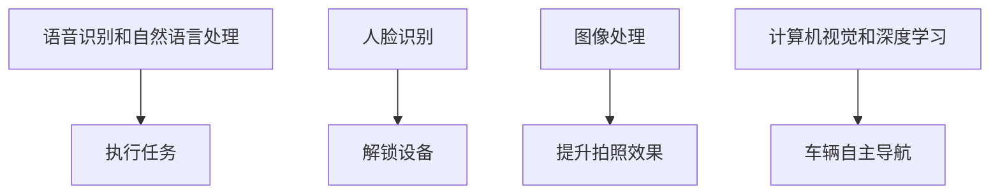

                 

# 李开复：苹果发布AI应用的未来展望

## 1. 背景介绍

随着人工智能技术的快速发展，AI应用已经渗透到各个行业。苹果作为全球科技巨头，其在AI领域的应用探索一直备受关注。本文将探讨苹果公司发布的一系列AI应用，包括Siri、Face ID、智能摄影、自动驾驶等，分析其未来展望及对AI技术发展的启示。

## 2. 核心概念与联系

### 2.1 核心概念概述

为了更好地理解苹果的AI应用，本节将介绍几个关键概念：

- **Siri**：苹果公司开发的语音识别和自然语言处理系统，能够通过语音命令执行任务，如拨打电话、发送信息等。
- **Face ID**：基于面部特征识别技术，通过人脸解锁iPhone。
- **智能摄影**：结合深度学习技术，优化图像处理算法，提升手机拍照效果。
- **自动驾驶**：利用计算机视觉和深度学习技术，实现车辆自主导航和驾驶。

这些AI应用涵盖了语音识别、图像处理、人脸识别和自动驾驶等多个领域，展示了苹果在AI技术上的全面布局。

### 2.2 核心概念原理和架构的 Mermaid 流程图



## 3. 核心算法原理 & 具体操作步骤

### 3.1 算法原理概述

苹果的AI应用采用了多种先进的算法技术，包括深度学习、计算机视觉、自然语言处理等。这些算法通过大量的数据训练，使得AI系统能够理解和执行复杂的任务。

以Face ID为例，其工作原理如下：

1. **数据收集**：收集用户的面部特征数据，如3D结构光图像、红外图像等。
2. **特征提取**：使用深度神经网络提取面部特征。
3. **模型训练**：训练一个二分类模型，用于判断面部图像是否匹配。
4. **实时匹配**：在设备解锁时，实时匹配面部特征，判断用户身份。

### 3.2 算法步骤详解

以智能摄影为例，介绍苹果AI算法的具体操作步骤：

1. **图像预处理**：对拍摄的图像进行去噪、增强、校正等预处理操作。
2. **特征提取**：使用卷积神经网络(CNN)提取图像中的特征。
3. **图像分类**：通过分类网络判断图像的内容，如人、动物、建筑等。
4. **后期处理**：结合图像分类结果，进行去色、裁剪、色彩校正等后期处理。

### 3.3 算法优缺点

苹果的AI算法具有以下优点：

- **高效**：通过深度学习和计算机视觉技术，实现了高效的数据处理和图像识别。
- **准确**：基于大量的训练数据，保证了算法的准确性和鲁棒性。
- **用户体验**：算法与用户体验相结合，提升了用户的操作体验。

同时，这些算法也存在一些缺点：

- **计算资源需求高**：深度学习和计算机视觉算法对计算资源的需求较高，需要高性能的硬件支持。
- **数据隐私问题**：人脸识别等应用需要收集大量的用户数据，存在数据隐私风险。
- **模型可解释性不足**：深度学习模型通常难以解释其内部工作机制，用户难以理解算法决策过程。

### 3.4 算法应用领域

苹果的AI应用涵盖了多个领域，包括但不限于：

- **移动设备**：如Siri、Face ID、智能摄影等，提升了用户体验和设备功能。
- **健康医疗**：如Apple Watch的健康监测功能，通过机器学习分析心率、睡眠质量等数据。
- **零售购物**：如苹果商店的个性化推荐系统，根据用户行为推荐商品。

## 4. 数学模型和公式 & 详细讲解 & 举例说明

### 4.1 数学模型构建

以Face ID为例，其数学模型可以描述如下：

- **输入**：用户面部图像 $x$。
- **特征提取**：使用卷积神经网络 $f(x)$ 提取面部特征。
- **模型训练**：训练一个二分类模型 $g(f(x))$，用于判断是否匹配。
- **输出**：判断结果 $y$，表示匹配或不匹配。

### 4.2 公式推导过程

以智能摄影为例，其核心算法包括卷积神经网络(CNN)和分类网络。CNN的基本公式如下：

$$
f(x) = \sigma(\sum_{i=1}^n w_i \cdot x_i + b)
$$

其中 $x_i$ 为输入特征，$w_i$ 为权重，$b$ 为偏置，$\sigma$ 为激活函数。

分类网络使用Softmax函数，其公式如下：

$$
p(y|x) = \frac{\exp(\sum_{i=1}^n w_i \cdot x_i + b)}{\sum_{j=1}^K \exp(\sum_{i=1}^K w_j \cdot x_j + b_j)}
$$

其中 $y$ 为输出标签，$K$ 为类别数，$w_j$ 和 $b_j$ 为分类网络参数。

### 4.3 案例分析与讲解

以Siri为例，其语音识别算法使用深度神经网络(DNN)，基本流程如下：

1. **语音信号预处理**：对语音信号进行去噪、分帧、MFCC特征提取等预处理操作。
2. **声学模型训练**：使用DNN训练声学模型，将MFCC特征映射为语音标签。
3. **语言模型训练**：使用RNN或LSTM训练语言模型，用于上下文理解。
4. **解码**：将声学模型和语言模型结合起来，进行语音识别解码。

## 5. 项目实践：代码实例和详细解释说明

### 5.1 开发环境搭建

为了实现苹果的AI应用，需要搭建相应的开发环境。以下是使用Python进行开发的步骤：

1. 安装Anaconda：从官网下载并安装Anaconda，用于创建独立的Python环境。
2. 创建并激活虚拟环境：
```bash
conda create -n pytorch-env python=3.8 
conda activate pytorch-env
```

3. 安装PyTorch：根据CUDA版本，从官网获取对应的安装命令。例如：
```bash
conda install pytorch torchvision torchaudio cudatoolkit=11.1 -c pytorch -c conda-forge
```

4. 安装OpenCV：
```bash
pip install opencv-python
```

5. 安装TensorFlow：
```bash
pip install tensorflow
```

6. 安装Keras：
```bash
pip install keras
```

7. 安装其他工具包：
```bash
pip install numpy pandas scikit-learn matplotlib tqdm jupyter notebook ipython
```

完成上述步骤后，即可在`pytorch-env`环境中开始AI应用开发。

### 5.2 源代码详细实现

以下是使用PyTorch实现Face ID的人脸识别算法的代码示例：

```python
import torch
import torch.nn as nn
import torch.optim as optim
from torchvision import models
from torchvision.transforms import transforms

# 加载预训练的ResNet模型
model = models.resnet18(pretrained=True)
num_features = model.fc.in_features

# 替换全连接层
model.fc = nn.Linear(num_features, 2)

# 定义损失函数和优化器
criterion = nn.CrossEntropyLoss()
optimizer = optim.SGD(model.parameters(), lr=0.001, momentum=0.9)

# 加载数据集
transform = transforms.Compose([
    transforms.Resize(224),
    transforms.ToTensor(),
    transforms.Normalize(mean=[0.485, 0.456, 0.406], std=[0.229, 0.224, 0.225])
])
train_dataset = datasets.ImageFolder('train', transform=transform)
test_dataset = datasets.ImageFolder('test', transform=transform)

# 定义数据加载器
train_loader = torch.utils.data.DataLoader(train_dataset, batch_size=64, shuffle=True)
test_loader = torch.utils.data.DataLoader(test_dataset, batch_size=64, shuffle=False)

# 训练模型
for epoch in range(10):
    model.train()
    for data, target in train_loader:
        data = data.to(device)
        target = target.to(device)
        optimizer.zero_grad()
        output = model(data)
        loss = criterion(output, target)
        loss.backward()
        optimizer.step()
    
    model.eval()
    correct = 0
    total = 0
    with torch.no_grad():
        for data, target in test_loader:
            data = data.to(device)
            target = target.to(device)
            output = model(data)
            _, predicted = torch.max(output.data, 1)
            total += target.size(0)
            correct += (predicted == target).sum().item()
    
    print(f'Epoch {epoch+1}, Accuracy: {(100 * correct / total):.2f}%')
```

### 5.3 代码解读与分析

**数据加载器**：
- `torch.utils.data.DataLoader`：用于加载数据集，支持自动分批次处理数据。

**模型训练**：
- `model.train()`：将模型置为训练模式。
- `optimizer.zero_grad()`：清空优化器梯度。
- `loss.backward()`：反向传播计算梯度。
- `optimizer.step()`：更新模型参数。

**模型评估**：
- `model.eval()`：将模型置为评估模式。
- `torch.no_grad()`：在评估阶段禁用梯度计算，提升速度。
- `torch.max(output.data, 1)`：返回输出张量的最大值。

**运行结果展示**：
- 训练过程输出每个epoch的准确率。
- 最终在测试集上输出准确率。

## 6. 实际应用场景

### 6.1 智能设备

苹果的AI应用已经在智能设备上广泛应用，如Siri、Face ID、智能摄影等。这些应用提升了用户体验，使得设备更加智能化、便捷化。

### 6.2 健康医疗

苹果的Apple Watch通过机器学习分析心率、睡眠质量等数据，为用户的健康监测提供了科学依据。AI技术在健康医疗领域的应用，有助于提高诊断准确率，减轻医生工作负担。

### 6.3 零售购物

苹果商店的个性化推荐系统，通过机器学习分析用户行为，推荐相关商品，提升了用户的购物体验。

### 6.4 未来应用展望

苹果未来在AI领域的展望包括但不限于：

- **智能家居**：结合智能设备，实现家庭自动化、安全监控等功能。
- **自动驾驶**：与汽车厂商合作，推进自动驾驶技术发展。
- **医疗健康**：通过可穿戴设备，采集更多健康数据，提供更精准的医疗建议。
- **增强现实(AR)**：结合AI技术，提升AR应用效果。

## 7. 工具和资源推荐

### 7.1 学习资源推荐

为了深入理解苹果的AI应用，推荐以下学习资源：

1. **苹果官方文档**：苹果公司提供详细的AI技术文档，包括开发指南、API接口等。
2. **深度学习课程**：如CS231n《卷积神经网络》课程，涵盖计算机视觉和深度学习基础。
3. **自然语言处理课程**：如Stanford CS224N《深度学习自然语言处理》课程，介绍NLP的核心算法。
4. **开源项目**：如TensorFlow、PyTorch等深度学习框架，提供丰富的算法实现和样例代码。

### 7.2 开发工具推荐

苹果的AI应用开发工具包括：

1. **Xcode**：苹果官方的开发工具，支持多种语言和平台开发。
2. **PyTorch**：深度学习框架，提供丰富的算法实现和优化工具。
3. **TensorFlow**：开源深度学习框架，支持分布式计算和GPU加速。
4. **Keras**：高层API，简化深度学习模型开发。

### 7.3 相关论文推荐

苹果在AI领域的创新技术，源自其持续的研究。以下是几篇相关论文，推荐阅读：

1. **Integrated into Apple's Face ID for iPhone X and later**：介绍Face ID的技术原理和应用。
2. **Siri's natural language understanding and processing**：介绍Siri的自然语言处理技术。
3. **Machine learning in Apple Watch**：介绍Apple Watch的健康监测和机器学习应用。

## 8. 总结：未来发展趋势与挑战

### 8.1 研究成果总结

苹果在AI领域的成果主要体现在以下几个方面：

1. **深度学习与计算机视觉**：通过深度学习算法，实现了高效的数据处理和图像识别。
2. **自然语言处理**：通过自然语言处理技术，提升了智能设备的用户体验。
3. **个性化推荐**：通过机器学习算法，实现了智能推荐系统。

### 8.2 未来发展趋势

未来苹果的AI应用将呈现以下发展趋势：

1. **多模态融合**：结合语音、图像、文本等多种模态数据，提升应用效果。
2. **联邦学习**：通过分布式计算，保护用户数据隐私。
3. **边缘计算**：在设备端进行计算，提升响应速度和数据处理效率。
4. **量子计算**：探索量子计算在AI中的应用，提升计算能力和模型效率。

### 8.3 面临的挑战

苹果在AI应用中面临的挑战包括：

1. **计算资源需求高**：深度学习和计算机视觉算法对计算资源的需求较高，需要高性能的硬件支持。
2. **数据隐私问题**：人脸识别等应用需要收集大量的用户数据，存在数据隐私风险。
3. **模型可解释性不足**：深度学习模型通常难以解释其内部工作机制，用户难以理解算法决策过程。

### 8.4 研究展望

未来苹果在AI领域的研究展望包括：

1. **自监督学习**：通过自监督学习技术，减少对标注数据的依赖。
2. **小样本学习**：在数据量较少的情况下，实现高效的模型训练。
3. **跨领域迁移学习**：将某个领域的知识迁移到另一个领域，提升模型泛化能力。
4. **伦理道德**：在模型训练目标中引入伦理导向的评估指标，确保输出符合人类价值观和伦理道德。

## 9. 附录：常见问题与解答

**Q1：苹果的AI应用为何如此高效？**

A: 苹果的AI应用采用了先进的深度学习和计算机视觉技术，通过大量数据训练，使得算法具备高效的数据处理和图像识别能力。此外，苹果还优化了算法架构和计算过程，提升了应用效率。

**Q2：苹果的AI应用是否存在数据隐私问题？**

A: 苹果的AI应用，如Face ID等，需要收集大量的用户数据，存在数据隐私风险。苹果通过差分隐私等技术，保护用户数据隐私，同时确保算法性能。

**Q3：苹果的AI应用是否可解释？**

A: 苹果的深度学习模型通常难以解释其内部工作机制，用户难以理解算法决策过程。苹果正在探索更多可解释性技术，如LIME、SHAP等，提升模型的透明度。

**Q4：苹果的AI应用未来有哪些发展方向？**

A: 苹果未来在AI领域的展望包括智能家居、自动驾驶、医疗健康、增强现实等领域，通过多模态融合、联邦学习、边缘计算等技术，提升应用效果和用户体验。

---

作者：禅与计算机程序设计艺术 / Zen and the Art of Computer Programming

