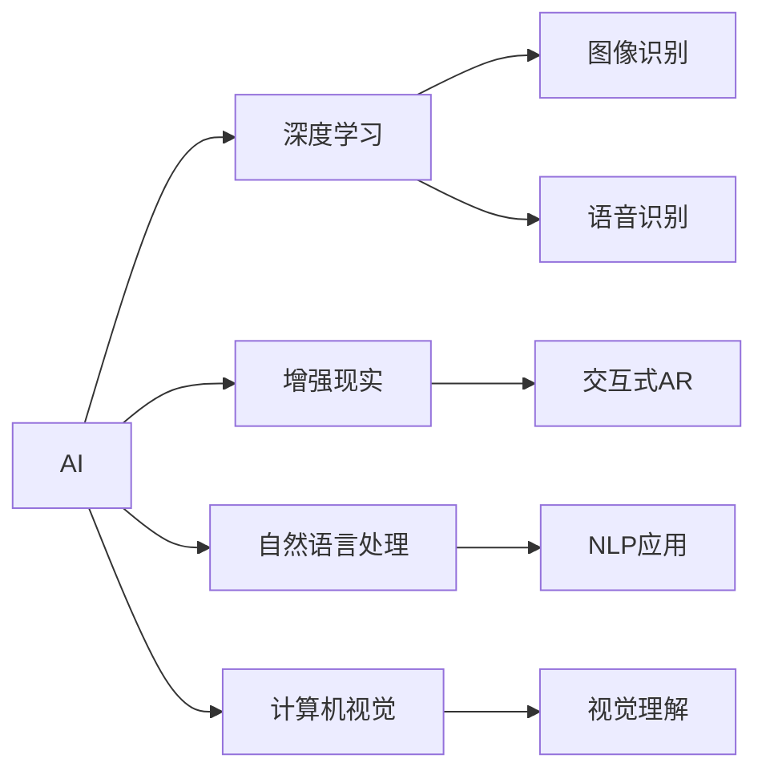

                 

# 李开复：苹果发布AI应用的机会

李开复博士是全球知名的AI专家、创新者，以及科技行业的前瞻者。本文将探讨李开复对于苹果如何在人工智能(AI)领域创造独特应用机会的见解。

## 1. 背景介绍

### 1.1 人工智能与苹果

近年来，人工智能技术在各个行业中的应用不断增加，尤其在消费电子领域，AI正在推动着技术创新和用户体验的提升。苹果公司（Apple Inc.）作为全球知名的科技公司，其对AI技术的集成和应用具有举足轻重的作用。

苹果已在其产品中广泛应用了AI技术，例如人脸识别、语音助手Siri、智能图像识别和增强现实（AR）体验等。然而，尽管苹果在AI技术方面取得了显著进展，但与其竞争对手如谷歌和亚马逊相比，苹果在AI应用中的创新和扩展仍有一定的差距。

### 1.2 当前AI应用现状

目前，苹果在AI应用方面主要依赖于现有的平台和框架，如Core ML和机器学习框架Core ML。这些工具使得开发者可以轻松地在其产品中集成AI功能。尽管如此，苹果仍需在AI技术的深度和广度上进一步探索，以保持市场竞争力。

## 2. 核心概念与联系

### 2.1 核心概念

- **人工智能（AI）**：指使计算机系统能够模拟人类智能行为的技术，包括学习、推理、感知、自然语言处理等。

- **深度学习（DL）**：一种基于神经网络的机器学习技术，通过多层非线性变换学习复杂的数据表示。

- **增强现实（AR）**：在现实世界的图像上叠加数字信息，以增强用户对周围环境的理解和互动。

- **自然语言处理（NLP）**：使计算机能够理解、解释和生成人类语言的技术。

- **计算机视觉（CV）**：使计算机能够从图像和视频中识别和理解视觉内容的学科。

### 2.2 Mermaid流程图



这个流程图展示了AI技术的不同分支如何相互影响和整合，为苹果提供了丰富的应用机会。

## 3. 核心算法原理 & 具体操作步骤

### 3.1 算法原理概述

苹果在AI应用中的创新应基于以下几个关键原理：

- **深度学习模型**：利用深度神经网络进行复杂模式的识别和预测。

- **自监督学习**：通过未标注的数据训练模型，提升模型泛化能力。

- **迁移学习**：利用预训练模型解决新的任务，减少对新数据的依赖。

- **强化学习**：通过与环境交互，优化智能系统的决策过程。

### 3.2 算法步骤详解

苹果的AI应用开发通常遵循以下步骤：

1. **数据收集与预处理**：收集大量数据，并进行清洗、归一化和标注。

2. **模型选择与训练**：选择适合的深度学习模型，使用标注数据训练模型。

3. **模型评估与调优**：通过验证集评估模型性能，调整模型参数。

4. **模型集成与部署**：将训练好的模型集成到产品中，并进行优化以适应不同的设备和平台。

5. **用户反馈与迭代**：收集用户反馈，不断优化模型，提升用户体验。

### 3.3 算法优缺点

**优点**：

- **提升用户体验**：AI技术可以显著提升产品智能化水平，提高用户满意度。

- **降低开发成本**：AI工具使得开发者能够快速构建复杂功能，减少开发时间。

- **保持竞争优势**：通过不断创新AI应用，苹果可以保持市场领先地位。

**缺点**：

- **数据隐私问题**：AI模型需要大量数据进行训练，涉及用户隐私保护。

- **计算资源消耗大**：深度学习模型通常需要大量计算资源，对硬件要求较高。

- **模型复杂性**：AI模型的训练和部署过程复杂，需要专业知识和工具。

### 3.4 算法应用领域

苹果的AI应用涵盖了以下多个领域：

- **产品个性化**：通过AI分析用户行为，提供个性化推荐和定制化体验。

- **增强现实**：利用AR技术，提升产品交互性和沉浸感。

- **健康与健身**：使用计算机视觉和深度学习进行健康监测和数据分析。

- **语音助手**：通过NLP技术，提供智能语音交互体验。

- **自动驾驶**：开发先进的计算机视觉和传感器技术，用于无人驾驶汽车。

## 4. 数学模型和公式 & 详细讲解 & 举例说明

### 4.1 数学模型构建

苹果的AI应用通常基于以下数学模型构建：

- **深度神经网络（DNN）**：包括卷积神经网络（CNN）和循环神经网络（RNN）等。

- **自编码器（Autoencoder）**：用于数据降维和特征提取。

- **生成对抗网络（GAN）**：用于生成逼真的图像和视频内容。

### 4.2 公式推导过程

以卷积神经网络（CNN）为例，其结构可以表示为：

$$
\text{CNN} = \left\{ f^{l}(x) \right\}_{l=1}^L = f^L \circ f^{L-1} \circ \cdots \circ f^1
$$

其中，$f^l$表示第$l$层的非线性变换函数，$x$为输入数据。

### 4.3 案例分析与讲解

苹果在iPhone X中使用的Face ID功能就是一个成功的AI应用案例。其核心技术包括：

- **人脸检测**：通过计算机视觉技术，实时检测人脸位置。

- **人脸对齐**：使用图像处理技术，对齐人脸图像，减少误差。

- **人脸识别**：使用深度学习模型，识别用户的面部特征，实现安全解锁。

## 5. 项目实践：代码实例和详细解释说明

### 5.1 开发环境搭建

苹果的AI应用开发环境通常包括以下工具和框架：

- **Xcode**：苹果的集成开发环境，支持C++、Swift等多种编程语言。

- **Core ML**：苹果提供的机器学习框架，支持多种深度学习模型。

- **Python**：用于数据处理和模型训练。

- **TensorFlow和PyTorch**：开源的深度学习框架，支持神经网络模型开发。

### 5.2 源代码详细实现

以下是一个简单的AI应用开发示例，使用Core ML框架实现图像分类：

```python
import coremltools as ct

# 加载模型
model = ct.models.load('model.mlmodel')

# 加载输入图像
input_data = ct.open_image('input.jpg')

# 进行推理
result = model.predict(input_data)

# 输出结果
print(result)
```

### 5.3 代码解读与分析

这段代码展示了如何使用Core ML进行图像分类任务。模型加载、输入数据准备、模型推理和结果输出是AI应用开发的关键步骤。通过这些步骤，苹果可以轻松地在产品中集成AI功能，提升用户体验。

### 5.4 运行结果展示

运行上述代码，输出结果将是一个分类结果，表示输入图像属于哪个类别。这个结果可以用于指导后续的产品设计和优化。

## 6. 实际应用场景

### 6.1 产品个性化

苹果的AI技术可以用于产品个性化，通过分析用户行为和偏好，提供定制化的内容和推荐。例如，iOS App Store中的推荐应用功能就是基于AI技术实现的。

### 6.2 增强现实

苹果的ARKit框架使得开发者可以轻松地在其产品中集成AR功能，如Safari AR、测量尺度和3D导航等。

### 6.3 健康与健身

苹果的Watch应用使用了AI技术进行健康监测和数据分析，如心率检测和睡眠分析等。

### 6.4 未来应用展望

未来的AI应用将更加注重用户隐私保护和计算效率。苹果需要在这些方面进行深入研究，以确保其产品在AI应用中的竞争力和用户信任。

## 7. 工具和资源推荐

### 7.1 学习资源推荐

- **Coursera**：提供大量AI和机器学习课程，涵盖从基础到高级的内容。

- **Udacity**：提供深度学习专业课程，包含实战项目。

- **Apple Developer**：提供苹果开发环境的教程和文档。

### 7.2 开发工具推荐

- **Xcode**：苹果官方的集成开发环境。

- **Core ML**：苹果提供的机器学习框架。

- **TensorFlow**：开源深度学习框架，支持多种平台。

- **PyTorch**：另一个流行的深度学习框架。

### 7.3 相关论文推荐

- **《深度学习》（Deep Learning）**：由Ian Goodfellow等人编写，是深度学习领域的经典教材。

- **《TensorFlow实战》（TensorFlow in Action）**：由Charlie Brenecki等人编写，介绍了TensorFlow的实战应用。

## 8. 总结：未来发展趋势与挑战

### 8.1 研究成果总结

苹果在AI应用方面的研究成果显著，涵盖产品个性化、增强现实、健康与健身等多个领域。其产品如Face ID、Siri和ARKit等已经取得了广泛的应用和用户认可。

### 8.2 未来发展趋势

- **AI技术的深度整合**：未来苹果将在更多的产品和服务中深度整合AI技术，提升用户体验。

- **边缘计算**：通过在设备端进行AI计算，减少对云端的依赖，提升响应速度和隐私保护。

- **多模态交互**：将AI技术与语音、手势等多元交互方式结合，提升人机交互的智能化水平。

### 8.3 面临的挑战

- **计算资源消耗**：大规模深度学习模型的计算需求高，对硬件提出了更高的要求。

- **用户隐私保护**：AI技术需要大量数据进行训练和推理，如何保护用户隐私是关键问题。

- **模型可解释性**：AI模型的复杂性使得其决策过程难以解释，用户对其信任度受限。

### 8.4 研究展望

苹果需要在AI技术的应用、计算效率、隐私保护和模型可解释性等方面进行深入研究，推动AI技术在更多产品中的落地应用，实现人机协同的未来。

## 9. 附录：常见问题与解答

**Q1：苹果的AI应用是否能够完全替代传统方法？**

A: 虽然AI技术在很多领域取得了显著进展，但完全替代传统方法仍需时日。AI技术应在保留传统优势的基础上，与传统方法互补，提升整体系统的性能。

**Q2：苹果的AI应用在用户隐私方面是否足够安全？**

A: 苹果在AI应用中采取了多项隐私保护措施，如数据加密、本地存储和匿名化处理等。然而，如何进一步提升隐私保护水平，仍需持续努力。

**Q3：苹果如何在AI应用中提高计算效率？**

A: 苹果可以通过优化算法、使用更高效的计算架构（如GPU、TPU）、实施模型压缩等技术来提升计算效率。

**Q4：苹果如何在AI应用中增强模型可解释性？**

A: 苹果可以通过模型可视化、可解释性技术（如LIME、SHAP）等手段，增强AI模型的可解释性，提升用户对模型的理解和信任。

**Q5：苹果如何在AI应用中优化用户体验？**

A: 苹果可以通过用户行为分析、个性化推荐和智能交互等方式，优化用户体验，提升产品的智能化水平。

---

作者：禅与计算机程序设计艺术 / Zen and the Art of Computer Programming

