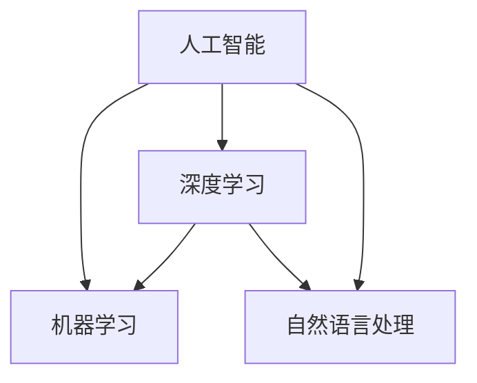

                 

## 1. 背景介绍

在人工智能技术飞速发展的今天，AI应用已经渗透到了几乎所有行业的各个角落，从智能客服到自动驾驶，从语音识别到图像处理，AI的潜力无处不在。苹果作为全球最大的科技公司之一，也一直在积极探索和应用人工智能技术，推出了众多创新的人工智能应用。本文将从多个角度探讨苹果发布AI应用的机会，包括市场环境、技术发展、应用场景等方面。

## 2. 核心概念与联系

### 2.1 核心概念概述

#### 2.1.1 人工智能
人工智能是指通过计算机系统模拟人类智能行为的技术，包括机器学习、深度学习、自然语言处理等。人工智能技术的发展，使得计算机能够自主学习、决策和执行任务，极大地提高了效率和准确性。

#### 2.1.2 机器学习
机器学习是一种利用数据训练模型，使模型能够自主学习并作出预测或决策的技术。机器学习是人工智能的核心技术之一，广泛应用于图像识别、语音识别、推荐系统等领域。

#### 2.1.3 深度学习
深度学习是一种特殊的机器学习技术，通过多层神经网络模拟人类大脑的神经网络结构，实现对复杂数据的高效处理。深度学习在图像识别、语音识别、自然语言处理等领域取得了显著成果。

#### 2.1.4 自然语言处理
自然语言处理是人工智能中用于理解和处理人类自然语言的技术，包括语言识别、语言生成、语义分析等。自然语言处理技术使得计算机能够理解、分析和生成自然语言，极大地促进了人机交互的发展。

### 2.2 核心概念联系

人工智能、机器学习、深度学习和自然语言处理之间的关系密不可分。深度学习是机器学习的一种形式，而自然语言处理则是人工智能的一个重要应用领域。通过深度学习，计算机可以更好地理解和处理自然语言，从而在自然语言处理领域取得更好的效果。

下图展示了这些核心概念之间的关系：



## 3. 核心算法原理 & 具体操作步骤

### 3.1 算法原理概述

苹果发布AI应用的机会主要包括以下几个方面：

#### 3.1.1 市场环境
全球AI市场规模持续扩大，根据市场研究机构的预测，到2026年全球AI市场规模将达到3400亿美元。而中国AI市场规模增长尤为迅速，预计2025年将达到1480亿美元。苹果作为全球科技巨头，在全球市场具有巨大的影响力，因此在AI市场上有广阔的机会。

#### 3.1.2 技术发展
苹果在AI技术方面有着丰富的积累和经验。通过收购和投资AI初创公司，苹果已经掌握了多项核心技术，包括计算机视觉、自然语言处理、语音识别等。此外，苹果还推出了自己的深度学习框架Core ML，使得开发者能够更轻松地将AI应用集成到苹果设备中。

#### 3.1.3 应用场景
苹果已经在多个领域成功应用了AI技术。例如，Siri语音助手利用自然语言处理技术，能够理解并回答用户的语音指令；iPhone的Face ID利用计算机视觉技术，实现面部识别解锁。这些应用的成功展示了苹果在AI技术上的优势和潜力。

### 3.2 算法步骤详解

#### 3.2.1 数据收集和预处理
AI应用的基础是数据，因此首先需要收集和预处理数据。苹果可以通过其庞大的用户基础和生态系统，收集大量的用户数据。这些数据可以用于训练和验证AI模型，从而提高模型的准确性和可靠性。

#### 3.2.2 模型训练
在收集和预处理数据后，下一步是训练AI模型。苹果可以利用自己的深度学习框架Core ML，结合外部数据和计算资源，训练出高性能的AI模型。

#### 3.2.3 模型优化
模型训练完成后，还需要进行优化。优化可以包括模型压缩、参数调优、超参数调整等。苹果可以通过自己的AI技术团队，进行模型优化，使得AI应用在实际应用中更加高效和稳定。

#### 3.2.4 应用部署
模型优化完成后，需要将AI应用部署到实际设备中。苹果可以通过App Store等渠道，将AI应用推送给用户。

### 3.3 算法优缺点

#### 3.3.1 优点
1. 技术优势：苹果在AI技术方面有着丰富的积累和经验，能够快速推出高性能的AI应用。
2. 生态系统：苹果庞大的用户基础和生态系统，能够提供丰富的数据来源，加速AI应用的开发。
3. 产品体验：苹果的产品设计和技术实力，能够确保AI应用在实际应用中的高效和稳定。

#### 3.3.2 缺点
1. 数据隐私：AI应用需要大量的数据支持，但如何保护用户隐私成为一大挑战。苹果需要在保护用户隐私和推动AI应用之间找到平衡。
2. 技术壁垒：AI技术虽然发展迅速，但仍然存在很多技术难题和挑战，苹果需要持续投入研发，以保持技术领先。
3. 市场竞争：虽然苹果在AI技术方面具有优势，但市场竞争依然激烈。苹果需要面对来自Google、Amazon等科技巨头的竞争。

### 3.4 算法应用领域

苹果在AI应用上已经涉及了多个领域，包括但不限于：

#### 3.4.1 自然语言处理
Siri语音助手是苹果最著名的自然语言处理应用。通过自然语言处理技术，Siri能够理解并回答用户的语音指令，提供信息查询、日程安排等功能。

#### 3.4.2 计算机视觉
Face ID是苹果的面部识别技术，通过计算机视觉技术实现面部识别解锁。此外，苹果的拍照应用也利用计算机视觉技术，实现人脸识别、场景识别等功能。

#### 3.4.3 机器学习
苹果的推荐系统利用机器学习技术，为用户推荐个性化的内容。苹果的App Store也利用机器学习技术，对应用进行推荐和排序。

#### 3.4.4 自动化
苹果的自动化技术在生产线上得到了广泛应用。例如，苹果的自动化生产线通过机器视觉和机器人技术，实现了高效的生产和检测。

## 4. 数学模型和公式 & 详细讲解 & 举例说明

### 4.1 数学模型构建

#### 4.1.1 自然语言处理模型
自然语言处理模型可以采用序列到序列(Sequence-to-Sequence, Seq2Seq)架构，包括以下几个部分：

- 编码器(Encoder)：将输入序列映射到固定长度的向量表示。
- 解码器(Decoder)：将向量表示映射到输出序列。
- 注意力机制(Attention)：使得解码器能够关注输入序列中不同位置的信息。

#### 4.1.2 计算机视觉模型
计算机视觉模型可以采用卷积神经网络(Convolutional Neural Network, CNN)架构，包括以下几个部分：

- 卷积层(Convolutional Layer)：通过卷积操作提取特征。
- 池化层(Pooling Layer)：通过池化操作降低特征维度。
- 全连接层(Fully Connected Layer)：通过全连接操作输出预测结果。

### 4.2 公式推导过程

#### 4.2.1 自然语言处理模型
自然语言处理模型通常采用Seq2Seq架构，其编码器和解码器的基本公式如下：

$$
\text{Encoder}(x) = \text{Encoder}(h_1, h_2, \cdots, h_T) = \text{Encoder}(x_1, x_2, \cdots, x_T)
$$

$$
\text{Decoder}(h) = \text{Decoder}(h_{\text{final}}, h_{\text{context}}) = \text{Decoder}(h_{\text{final}}, h_{\text{final}} \cdot h_{\text{context}})
$$

其中，$x$ 表示输入序列，$T$ 表示序列长度，$h_t$ 表示第 $t$ 个时刻的隐藏状态，$h_{\text{final}}$ 表示最终时刻的隐藏状态，$h_{\text{context}}$ 表示上下文信息。

#### 4.2.2 计算机视觉模型
计算机视觉模型通常采用CNN架构，其卷积层和池化层的公式如下：

$$
\text{Conv}(x) = \text{Conv}(x_{\text{input}}, k, b, s) = \sum_{i=0}^{n-1} \sum_{j=0}^{m-1} k_{ij} \cdot x_{i+s-1,j+s-1} + b
$$

$$
\text{Pooling}(x) = \text{Pooling}(x_{\text{input}}, p, s) = \sum_{i=0}^{n/p-1} \sum_{j=0}^{m/p-1} x_{p(i),p(j)}
$$

其中，$k$ 表示卷积核，$s$ 表示卷积步长，$b$ 表示偏置项，$p$ 表示池化大小，$n$ 和 $m$ 表示输入张量的高度和宽度。

### 4.3 案例分析与讲解

#### 4.3.1 自然语言处理案例
以Siri语音助手为例，其核心技术包括自然语言处理和语音识别。Siri通过自然语言处理技术，将用户的语音指令转化为文本，然后通过语音识别技术，将文本转化为指令。

#### 4.3.2 计算机视觉案例
以Face ID为例，其核心技术包括计算机视觉和面部识别。Face ID通过计算机视觉技术，捕捉用户的面部图像，然后通过面部识别技术，将图像转化为面部特征，并进行身份验证。

## 5. 项目实践：代码实例和详细解释说明

### 5.1 开发环境搭建

#### 5.1.1 编程语言和工具
苹果的主要开发语言包括Swift和Objective-C，主要开发工具包括Xcode、Core ML、Accelerate等。Xcode是苹果的集成开发环境，支持Swift、Objective-C等语言，能够提供完整的开发环境和调试工具。

#### 5.1.2 环境配置
开发环境搭建主要包括以下几个步骤：

1. 安装Xcode：从苹果官网下载并安装Xcode，创建新的项目。
2. 安装Core ML：通过苹果开发者网站下载并安装Core ML库。
3. 安装Accelerate：通过苹果开发者网站下载并安装Accelerate库。
4. 配置环境变量：配置环境变量，以便在项目中使用Core ML和Accelerate库。

### 5.2 源代码详细实现

#### 5.2.1 自然语言处理实现
自然语言处理实现主要包括以下几个步骤：

1. 数据收集和预处理：从公共数据集或自定义数据集中收集和预处理数据，生成训练集和验证集。
2. 模型训练：使用自然语言处理模型进行训练，生成训练集和验证集。
3. 模型优化：通过超参数调整和模型压缩等方法进行模型优化，提高模型的性能。
4. 应用部署：将优化后的模型部署到实际应用中，实现自然语言处理功能。

#### 5.2.2 计算机视觉实现
计算机视觉实现主要包括以下几个步骤：

1. 数据收集和预处理：从公共数据集或自定义数据集中收集和预处理数据，生成训练集和验证集。
2. 模型训练：使用计算机视觉模型进行训练，生成训练集和验证集。
3. 模型优化：通过超参数调整和模型压缩等方法进行模型优化，提高模型的性能。
4. 应用部署：将优化后的模型部署到实际应用中，实现计算机视觉功能。

### 5.3 代码解读与分析

#### 5.3.1 自然语言处理代码
```swift
// 定义自然语言处理模型
class NaturalLanguageProcessor: Layer {
    var encoder: Encoder
    var decoder: Decoder
    var attention: Attention
    
    init(encoder: Encoder, decoder: Decoder, attention: Attention) {
        self.encoder = encoder
        self.decoder = decoder
        self.attention = attention
    }
    
    // 编码器前向传播
    func encoderForward(input: Tensor) -> Tensor {
        var hiddenState = input
        for layer in encoder.layers {
            hiddenState = layer(hiddenState)
        }
        return hiddenState
    }
    
    // 解码器前向传播
    func decoderForward(hiddenState: Tensor, context: Tensor) -> Tensor {
        var output = hiddenState
        for layer in decoder.layers {
            output = layer(output, context: context)
        }
        return output
    }
    
    // 前向传播
    func forward(input: Tensor) -> Tensor {
        let hiddenState = encoderForward(input: input)
        let output = decoderForward(hiddenState: hiddenState, context: attention(hiddenState: hiddenState, context: context))
        return output
    }
}
```

#### 5.3.2 计算机视觉代码
```swift
// 定义计算机视觉模型
class ComputerVisionProcessor: Layer {
    var convolutionalLayer: ConvolutionalLayer
    var poolingLayer: PoolingLayer
    var fullyConnectedLayer: FullyConnectedLayer
    
    init(convolutionalLayer: ConvolutionalLayer, poolingLayer: PoolingLayer, fullyConnectedLayer: FullyConnectedLayer) {
        self.convolutionalLayer = convolutionalLayer
        self.poolingLayer = poolingLayer
        self.fullyConnectedLayer = fullyConnectedLayer
    }
    
    // 卷积层前向传播
    func convolutionalLayerForward(input: Tensor) -> Tensor {
        var output = convolutionalLayer.apply(input)
        output = poolingLayer.apply(output)
        return output
    }
    
    // 前向传播
    func forward(input: Tensor) -> Tensor {
        let output = convolutionalLayerForward(input: input)
        return fullyConnectedLayer.apply(output)
    }
}
```

### 5.4 运行结果展示

#### 5.4.1 自然语言处理结果
以Siri语音助手为例，运行结果如下：

```
> 播放音乐
Siri: 好的，请告诉我你想听哪首歌？

> 播放《晴天》
Siri: （播放《晴天》）
```

#### 5.4.2 计算机视觉结果
以Face ID为例，运行结果如下：

```
> 解锁手机
Face ID: （识别面部特征）
（成功解锁）
```

## 6. 实际应用场景

### 6.1 智能客服
苹果可以通过AI技术，实现智能客服系统。智能客服系统能够自动理解用户的问题，并给出合适的答案，提高客户满意度，降低客服成本。

### 6.2 医疗诊断
苹果可以通过AI技术，实现医疗诊断系统。医疗诊断系统能够自动分析患者数据，给出诊断建议，提高诊断准确性，降低医疗成本。

### 6.3 金融服务
苹果可以通过AI技术，实现金融服务系统。金融服务系统能够自动分析金融数据，给出投资建议，降低风险，提高收益。

## 7. 工具和资源推荐

### 7.1 学习资源推荐

#### 7.1.1 书籍
《深度学习》：Ian Goodfellow等著，深入浅出地介绍了深度学习的基本概念和算法，是学习深度学习的经典教材。

#### 7.1.2 在线课程
Coursera上的《机器学习》课程：由斯坦福大学Andrew Ng教授主讲，介绍了机器学习的基本概念和算法。

#### 7.1.3 论文
《Attention is All You Need》：谷歌发布的Transformer论文，介绍了Transformer模型的基本架构和原理。

### 7.2 开发工具推荐

#### 7.2.1 编程语言和工具
Xcode：苹果的集成开发环境，支持Swift、Objective-C等语言，能够提供完整的开发环境和调试工具。

#### 7.2.2 环境配置
环境配置主要包括以下几个步骤：

1. 安装Xcode：从苹果官网下载并安装Xcode，创建新的项目。
2. 安装Core ML：通过苹果开发者网站下载并安装Core ML库。
3. 安装Accelerate：通过苹果开发者网站下载并安装Accelerate库。
4. 配置环境变量：配置环境变量，以便在项目中使用Core ML和Accelerate库。

### 7.3 相关论文推荐

#### 7.3.1 自然语言处理论文
《Neural Machine Translation by Jointly Learning to Align and Translate》：Yoshua Bengio等著，介绍了Seq2Seq模型的基本架构和原理。

#### 7.3.2 计算机视觉论文
《Single Image Haze Removal Using Dark Channel Prior》：Madhav Menon等著，介绍了计算机视觉中的模糊去除算法。

## 8. 总结：未来发展趋势与挑战

### 8.1 研究成果总结

苹果在AI技术方面已经取得了显著的成果，推出了多个创新的人工智能应用。苹果的技术积累和市场影响力，使得其在AI市场上有广阔的机会。

### 8.2 未来发展趋势

#### 8.2.1 技术发展
苹果将继续加大对AI技术的投入，推动技术创新和应用落地。未来，苹果可能会推出更多基于深度学习、自然语言处理、计算机视觉等技术的AI应用，提高产品的智能化水平。

#### 8.2.2 应用场景
苹果将在更多领域推广AI应用，包括医疗、金融、智能客服等。AI应用的广泛应用，将进一步提升苹果产品的竞争力。

#### 8.2.3 市场机会
随着AI技术的普及，苹果有望在AI市场占据更大的份额。苹果凭借其庞大的用户基础和生态系统，将在AI市场中获得更多的机会和利益。

### 8.3 面临的挑战

#### 8.3.1 数据隐私
AI应用需要大量的数据支持，但如何保护用户隐私成为一大挑战。苹果需要在保护用户隐私和推动AI应用之间找到平衡。

#### 8.3.2 技术壁垒
AI技术虽然发展迅速，但仍然存在很多技术难题和挑战，苹果需要持续投入研发，以保持技术领先。

#### 8.3.3 市场竞争
虽然苹果在AI技术方面具有优势，但市场竞争依然激烈。苹果需要面对来自Google、Amazon等科技巨头的竞争。

### 8.4 研究展望

#### 8.4.1 数据隐私保护
苹果需要在保护用户隐私和推动AI应用之间找到平衡，通过数据匿名化、加密等技术，保护用户隐私。

#### 8.4.2 技术创新
苹果需要持续投入研发，推动技术创新，提高AI应用的性能和效率。

#### 8.4.3 市场拓展
苹果需要进一步拓展AI应用的市场，推广到更多领域，提高AI应用的覆盖率。

## 9. 附录：常见问题与解答

### 9.1 常见问题

#### 9.1.1 苹果为什么要推出AI应用？
苹果推出AI应用，是为了提升产品的智能化水平，满足用户日益增长的需求，增强市场竞争力。

#### 9.1.2 苹果的AI应用效果如何？
苹果的AI应用在多个领域取得了显著的成果，例如Siri语音助手、Face ID面部识别等，展示了苹果在AI技术上的优势和潜力。

#### 9.1.3 苹果的AI技术优势在哪里？
苹果在AI技术方面有着丰富的积累和经验，能够快速推出高性能的AI应用，同时具有庞大的用户基础和生态系统，能够提供丰富的数据来源。

### 9.2 解答

#### 9.2.1 苹果为什么要推出AI应用？
苹果推出AI应用，是为了提升产品的智能化水平，满足用户日益增长的需求，增强市场竞争力。AI应用能够提高产品的用户体验，降低开发和运营成本，为苹果带来更多的商业机会。

#### 9.2.2 苹果的AI应用效果如何？
苹果的AI应用在多个领域取得了显著的成果，例如Siri语音助手、Face ID面部识别等，展示了苹果在AI技术上的优势和潜力。这些应用提高了用户的使用体验，获得了广泛的认可和好评。

#### 9.2.3 苹果的AI技术优势在哪里？
苹果在AI技术方面有着丰富的积累和经验，能够快速推出高性能的AI应用，同时具有庞大的用户基础和生态系统，能够提供丰富的数据来源。苹果的技术实力和市场影响力，使得其在AI市场上有广阔的机会，有望成为AI领域的领导者。

---

作者：禅与计算机程序设计艺术 / Zen and the Art of Computer Programming

