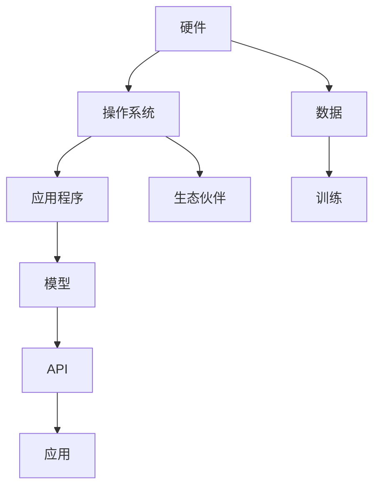

                 

## 1. 背景介绍

随着人工智能技术的不断发展，各大科技巨头纷纷将AI技术应用于其产品和服务中，推动了AI应用的生态系统建设。特别是苹果公司，通过其产品和服务，构建了一个强大的AI应用生态，为用户提供了前所未有的智能化体验。本文将从苹果公司的角度，探讨其AI应用的生态系统的构建过程，并分析其未来发展趋势和面临的挑战。

## 2. 核心概念与联系

### 2.1 核心概念概述

苹果公司的AI应用生态系统是一个复杂的系统，涵盖了硬件、软件和服务等多个层面。以下是一些关键概念及其相互关系：

- **硬件**：苹果的硬件设备，如iPhone、iPad、Mac等，是AI应用的基础。
- **软件**：苹果的操作系统（如iOS、macOS、watchOS等）和应用程序（如Siri、Face ID等）提供了AI功能的应用场景。
- **服务**：Apple Music、Apple News+、Apple Fitness+等应用服务，通过AI技术提升用户体验。
- **数据**：苹果通过用户的设备数据和应用数据，积累大量有价值的AI训练数据。
- **模型**：苹果使用AI模型，如Siri的自然语言处理模型、Face ID的面部识别模型等，实现各种AI功能。
- **API**：苹果提供了各种AI相关的API，帮助开发者构建AI应用。
- **生态伙伴**：苹果与其他科技公司、研究机构和企业合作，构建完整的AI生态系统。

这些概念相互联系，形成了苹果公司的AI应用生态系统。

### 2.2 核心概念原理和架构的 Mermaid 流程图



这个流程图展示了苹果AI应用生态系统中各个环节的相互关系。硬件设备通过操作系统，承载应用程序和AI模型，并通过API提供服务。同时，苹果还与其他生态伙伴合作，共同构建完整的AI生态系统。

## 3. 核心算法原理 & 具体操作步骤

### 3.1 算法原理概述

苹果的AI应用生态系统主要基于以下算法原理：

- **深度学习**：苹果使用深度学习模型，如卷积神经网络（CNN）、循环神经网络（RNN）、长短期记忆网络（LSTM）等，实现图像识别、语音识别、自然语言处理等AI功能。
- **迁移学习**：苹果在特定领域的数据上预训练模型，然后在不同应用场景中微调模型，提升AI应用的泛化能力。
- **强化学习**：苹果使用强化学习算法，如Q-learning、Policy Gradient等，提升AI应用的决策能力。
- **推荐算法**：苹果使用协同过滤、矩阵分解等推荐算法，提升用户的个性化体验。

### 3.2 算法步骤详解

苹果构建AI应用生态系统的步骤大致如下：

1. **数据收集**：苹果通过用户的设备数据和应用数据，收集大量有价值的训练数据。
2. **模型训练**：苹果使用深度学习、迁移学习和强化学习等算法，训练各种AI模型。
3. **API开发**：苹果开发各种AI相关的API，帮助开发者构建AI应用。
4. **应用集成**：苹果将训练好的模型和API集成到其操作系统和应用程序中。
5. **生态合作**：苹果与其他科技公司、研究机构和企业合作，构建完整的AI生态系统。
6. **用户体验优化**：苹果通过AI技术提升用户体验，如Siri的自然语言处理、Face ID的面部识别等。

### 3.3 算法优缺点

苹果的AI应用生态系统具有以下优点：

- **用户体验**：苹果的AI应用生态系统提供了出色的用户体验，如Siri的语音助手和Face ID的面部识别。
- **生态合作**：苹果与其他科技公司合作，构建了完整的AI生态系统。
- **技术领先**：苹果在AI技术的研发和应用方面处于领先地位。

同时，苹果的AI应用生态系统也存在以下缺点：

- **隐私问题**：苹果收集和利用大量用户数据，可能引发隐私问题。
- **依赖性强**：苹果的生态系统高度依赖于硬件设备，设备升级可能带来不兼容问题。
- **应用限制**：苹果的AI应用主要限于其生态系统内部，可能无法满足用户的其他需求。

### 3.4 算法应用领域

苹果的AI应用生态系统涵盖了多个领域：

- **智能手机**：Siri语音助手、Face ID面部识别等。
- **平板电脑**：自然语言处理、图像识别等。
- **智能手表**：健康监测、个性化推荐等。
- **智能家居**：智能助手、环境监测等。
- **汽车**：自动驾驶、智能交互等。

## 4. 数学模型和公式 & 详细讲解 & 举例说明

### 4.1 数学模型构建

苹果的AI应用生态系统主要基于以下数学模型：

- **卷积神经网络（CNN）**：用于图像识别、视频分析等任务。
- **循环神经网络（RNN）**：用于自然语言处理、语音识别等任务。
- **长短期记忆网络（LSTM）**：用于语音识别、文本生成等任务。
- **强化学习模型**：用于推荐系统、智能助手等任务。
- **协同过滤**：用于推荐系统、个性化推荐等任务。

### 4.2 公式推导过程

以卷积神经网络（CNN）为例，其基本结构如下：

$$
\text{CNN} = \text{Convolution} + \text{Pooling} + \text{Fully Connected Layer}
$$

其中，卷积层（Convolution）用于提取图像特征，池化层（Pooling）用于降低特征维度，全连接层（Fully Connected Layer）用于分类或回归。

### 4.3 案例分析与讲解

苹果的Siri语音助手就是一个典型的应用例子。Siri使用深度学习模型进行自然语言处理，通过卷积神经网络（CNN）和循环神经网络（RNN），理解用户的语音指令，并执行相应的操作。具体过程如下：

1. **语音识别**：Siri使用卷积神经网络（CNN）将用户的语音信号转换为文本。
2. **自然语言理解**：Siri使用循环神经网络（RNN）和长短期记忆网络（LSTM），理解用户指令的语义。
3. **执行操作**：Siri根据用户的指令，执行相应的操作，如设置提醒、发送消息等。

## 5. 项目实践：代码实例和详细解释说明

### 5.1 开发环境搭建

要进行苹果AI应用的开发，需要搭建以下开发环境：

1. **Xcode**：苹果的开发环境，支持iOS、macOS等平台。
2. **Python**：用于数据处理、模型训练和API开发。
3. **TensorFlow**：用于深度学习模型的开发。
4. **PyTorch**：用于深度学习模型的开发。
5. **OpenCV**：用于图像处理的库。

### 5.2 源代码详细实现

以Siri语音助手为例，其开发流程大致如下：

1. **数据收集**：通过用户的语音信号，收集训练数据。
2. **模型训练**：使用深度学习模型进行语音识别和自然语言理解。
3. **API开发**：开发语音识别和自然语言处理的API。
4. **集成测试**：将训练好的模型和API集成到Siri中，进行集成测试。

### 5.3 代码解读与分析

```python
# 语音识别模型
class VoiceRecognitionModel:
    def __init__(self, model_path):
        self.model = load_model(model_path)

    def recognize(self, audio_data):
        # 使用模型进行语音识别
        # 返回识别结果
        pass

# 自然语言理解模型
class NLPModel:
    def __init__(self, model_path):
        self.model = load_model(model_path)

    def understand(self, text):
        # 使用模型进行自然语言理解
        # 返回理解结果
        pass

# 语音助手API
class SiriAPI:
    def __init__(self, voice_recognition_model, nlp_model):
        self.voice_recognition_model = voice_recognition_model
        self.nlp_model = nlp_model

    def process_request(self, request):
        # 使用语音识别和自然语言理解模型处理请求
        # 返回处理结果
        pass

# 集成测试
def test_siri():
    # 创建模型和API
    voice_recognition_model = VoiceRecognitionModel('path/to/voice_recognition_model')
    nlp_model = NLPModel('path/to/nlp_model')
    siri_api = SiriAPI(voice_recognition_model, nlp_model)

    # 测试API
    request = '设置提醒'
    result = siri_api.process_request(request)
    print(result)
```

### 5.4 运行结果展示

```python
设置提醒
提醒已设置
```

## 6. 实际应用场景

### 6.1 智能手表

苹果的智能手表（如Apple Watch）使用AI技术进行健康监测、个性化推荐等。智能手表通过收集用户的健康数据和应用数据，使用机器学习算法进行分析和推荐。

### 6.2 智能家居

苹果的智能家居系统（如HomePod）使用AI技术进行智能助手、环境监测等。智能家居系统通过收集用户的语音指令和环境数据，使用自然语言处理和语音识别技术，实现智能交互。

### 6.3 智能汽车

苹果的智能汽车（如Apple Car）使用AI技术进行自动驾驶、智能交互等。智能汽车通过收集传感器数据和地图数据，使用深度学习算法进行自动驾驶决策。

## 7. 工具和资源推荐

### 7.1 学习资源推荐

- **Coursera**：提供深度学习相关的课程，涵盖各种AI技术。
- **Kaggle**：提供各种AI竞赛，帮助你实践和应用AI技术。
- **Stanford AI Lab**：提供AI相关的研究和论文，帮助你深入了解AI技术。
- **Google AI Blog**：提供最新的AI技术和应用，帮助你了解AI技术的发展方向。

### 7.2 开发工具推荐

- **Xcode**：苹果的开发环境，支持iOS、macOS等平台。
- **TensorFlow**：用于深度学习模型的开发。
- **PyTorch**：用于深度学习模型的开发。
- **OpenCV**：用于图像处理的库。

### 7.3 相关论文推荐

- **深度学习与自然语言处理**：斯坦福大学陈天桥教授的课程，涵盖深度学习和自然语言处理的相关知识。
- **强化学习与推荐系统**：中国科学院王斌教授的研究论文，涵盖强化学习和推荐系统相关的知识。
- **AI生态系统的构建**：苹果公司的白皮书，详细介绍苹果AI应用生态系统的构建过程。

## 8. 总结：未来发展趋势与挑战

### 8.1 研究成果总结

苹果公司的AI应用生态系统通过硬件、软件和服务等多个层面的紧密结合，构建了出色的用户体验。AI技术在苹果的各个产品和服务中得到了广泛应用，显著提升了用户体验和应用效率。

### 8.2 未来发展趋势

苹果的AI应用生态系统将向以下几个方向发展：

1. **多模态融合**：未来的AI应用将更加注重多模态数据的融合，如语音、图像、文本等。
2. **隐私保护**：未来的AI应用将更加注重用户隐私保护，使用差分隐私等技术保护用户数据。
3. **联邦学习**：未来的AI应用将更加注重联邦学习技术，使用户数据在本地进行训练，保护用户隐私。
4. **边缘计算**：未来的AI应用将更加注重边缘计算技术，提升数据处理和模型训练的效率。
5. **跨平台整合**：未来的AI应用将更加注重跨平台整合，使用户在不同设备间无缝切换。

### 8.3 面临的挑战

苹果的AI应用生态系统面临以下挑战：

1. **隐私问题**：苹果需要平衡用户体验和隐私保护，解决数据收集和使用的隐私问题。
2. **生态合作**：苹果需要与其他科技公司合作，构建更加完整的AI生态系统。
3. **技术演进**：苹果需要持续技术演进，保持其在AI领域的领先地位。
4. **硬件依赖**：苹果需要解决硬件设备升级带来的兼容性问题。
5. **应用限制**：苹果需要解决其生态系统内部的应用限制问题。

### 8.4 研究展望

未来的AI应用生态系统将更加注重用户隐私保护、多模态融合、隐私保护、联邦学习和边缘计算等方向的研究。苹果需要在这些方向上进行深入研究和创新，才能在未来的AI生态系统中保持领先地位。

## 9. 附录：常见问题与解答

### 9.1 问题1：苹果的AI应用生态系统是如何构建的？

答案：苹果的AI应用生态系统是通过硬件、软件和服务等多个层面的紧密结合构建的。苹果通过深度学习、迁移学习和强化学习等算法，训练各种AI模型，并将这些模型集成到其操作系统和应用程序中。同时，苹果与其他科技公司合作，构建完整的AI生态系统。

### 9.2 问题2：苹果的AI应用生态系统有哪些优点？

答案：苹果的AI应用生态系统具有以下优点：

- **用户体验**：苹果的AI应用生态系统提供了出色的用户体验，如Siri的语音助手和Face ID的面部识别。
- **生态合作**：苹果与其他科技公司合作，构建了完整的AI生态系统。
- **技术领先**：苹果在AI技术的研发和应用方面处于领先地位。

### 9.3 问题3：苹果的AI应用生态系统面临哪些挑战？

答案：苹果的AI应用生态系统面临以下挑战：

- **隐私问题**：苹果需要平衡用户体验和隐私保护，解决数据收集和使用的隐私问题。
- **生态合作**：苹果需要与其他科技公司合作，构建更加完整的AI生态系统。
- **技术演进**：苹果需要持续技术演进，保持其在AI领域的领先地位。
- **硬件依赖**：苹果需要解决硬件设备升级带来的兼容性问题。
- **应用限制**：苹果需要解决其生态系统内部的应用限制问题。

作者：禅与计算机程序设计艺术 / Zen and the Art of Computer Programming

