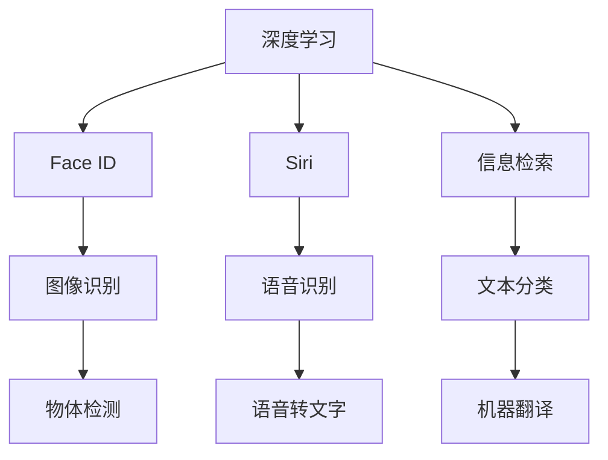

                 

# 李开复：苹果发布AI应用的用户

## 1. 背景介绍

随着人工智能技术的迅猛发展，越来越多的企业和个人开始涉足人工智能应用领域。而苹果公司，作为全球最具影响力的科技公司之一，其最新推出的AI应用无疑引发了广泛关注。本文将从李开复的角度，探讨苹果AI应用的现状、前景及用户需求，分析苹果公司如何满足用户需求，创造更多价值。

## 2. 核心概念与联系

### 2.1 核心概念概述

苹果公司推出的AI应用，主要包括两大类：

- **计算机视觉**：利用深度学习技术，实现图像识别、人脸识别、物体检测等功能。例如，苹果的Face ID、Siri语音识别等。
- **自然语言处理**：通过自然语言理解与生成技术，实现文本分类、语音转文字、机器翻译等功能。例如，苹果的Siri、信息检索等。

这些AI应用涉及的核心概念包括：

- **深度学习**：一种利用神经网络模型处理大规模数据的技术。苹果在Face ID、Siri等应用中广泛应用深度学习算法。
- **自然语言处理(NLP)**：处理、分析和生成自然语言的技术。苹果的Siri、信息检索等应用均依赖NLP技术。
- **计算机视觉**：使计算机能够"看"懂图像和视频的技术。苹果的Face ID、物体检测等应用依赖计算机视觉技术。

这些核心概念通过一系列算法和框架，共同构建了苹果的AI应用体系。

### 2.2 核心概念原理和架构的 Mermaid 流程图



此流程图展示了苹果AI应用的主要架构及其核心技术。

## 3. 核心算法原理 & 具体操作步骤

### 3.1 算法原理概述

苹果的AI应用主要基于深度学习和NLP等技术实现。以Siri语音识别为例，其算法原理大致如下：

- **特征提取**：使用卷积神经网络(CNN)提取音频信号的特征。
- **语音识别**：通过循环神经网络(RNN)或长短时记忆网络(LSTM)进行语音识别，得到文本序列。
- **意图识别**：使用分类器将识别到的文本序列映射到意图类别，如打电话、设置闹钟等。

整个算法流程大致如下：

1. 特征提取。
2. 语音识别。
3. 意图识别。
4. 响应生成。

### 3.2 算法步骤详解

以Siri语音识别为例，具体操作步骤如下：

1. **特征提取**：音频信号通过卷积神经网络提取特征。
2. **语音识别**：特征提取后的音频信号通过LSTM模型转换为文本序列。
3. **意图识别**：文本序列通过分类器映射到意图类别。
4. **响应生成**：根据意图类别，生成相应的语音响应。

### 3.3 算法优缺点

苹果AI应用的算法优缺点如下：

- **优点**：
  - 精度高：苹果深度学习和NLP技术经过多年发展，精度已达行业领先水平。
  - 应用广泛：苹果的AI应用覆盖了计算机视觉、自然语言处理等多个领域，满足用户多样化需求。
  - 安全性高：苹果注重隐私保护，AI应用的安全性较高。

- **缺点**：
  - 计算量大：深度学习和NLP算法计算复杂，对硬件要求高。
  - 模型复杂：苹果AI应用模型较为复杂，不易优化。
  - 可扩展性差：苹果AI应用主要基于苹果自家硬件，难以在第三方设备上部署。

### 3.4 算法应用领域

苹果AI应用主要应用于以下领域：

- **智能手机**：如Face ID、Siri等。
- **电脑**：如信息检索、语音输入等。
- **智能家居**：如智能音箱、智能电视等。
- **增强现实(AR)**：如ARKit等。

## 4. 数学模型和公式 & 详细讲解 & 举例说明

### 4.1 数学模型构建

以Siri语音识别为例，其数学模型构建如下：

- **特征提取模型**：
  $$
  x = CNN(y)
  $$
- **语音识别模型**：
  $$
  t = LSTM(x)
  $$
- **意图识别模型**：
  $$
  i = Softmax(t)
  $$
- **响应生成模型**：
  $$
  r = Response(i)
  $$

### 4.2 公式推导过程

以Siri语音识别中的LSTM模型为例，其公式推导过程如下：

$$
t_t = \tanh(W_t \cdot [h_{t-1},x_t] + b_t)
$$
$$
i_t = sigmoid(W_i \cdot [h_{t-1},x_t] + b_i)
$$
$$
o_t = sigmoid(W_o \cdot [h_{t-1},x_t] + b_o)
$$
$$
f_t = sigmoid(W_f \cdot [h_{t-1},x_t] + b_f)
$$
$$
c_t = f_t \cdot c_{t-1} + i_t \cdot \tanh(t_t)
$$
$$
h_t = o_t \cdot \tanh(c_t)
$$

其中，$W$和$b$为模型参数。

### 4.3 案例分析与讲解

以Siri语音识别为例，详细讲解其公式推导过程：

1. **特征提取模型**：
   输入音频信号$y$通过卷积神经网络$CNN$提取特征$x$。

2. **语音识别模型**：
   特征$x$通过LSTM模型转换为文本序列$t$。
   $$
   h_t = \tanh(W_h \cdot h_{t-1} + b_h)
   $$
   $$
   c_t = f_t \cdot c_{t-1} + i_t \cdot \tanh(h_t)
   $$

3. **意图识别模型**：
   文本序列$t$通过Softmax分类器映射到意图类别$i$。
   $$
   i_t = Softmax(W_i \cdot h_t + b_i)
   $$

4. **响应生成模型**：
   根据意图类别$i$，生成相应的语音响应$r$。
   $$
   r = Response(i)
   $$

## 5. 项目实践：代码实例和详细解释说明

### 5.1 开发环境搭建

开发环境搭建如下：

1. **安装Python和PyTorch**：
   ```bash
   conda create -n pytorch-env python=3.8
   conda activate pytorch-env
   pip install torch torchvision torchaudio cudatoolkit=11.1 -c pytorch -c conda-forge
   ```

2. **安装Transformers库**：
   ```bash
   pip install transformers
   ```

3. **安装TensorFlow**：
   ```bash
   pip install tensorflow
   ```

4. **安装其他工具包**：
   ```bash
   pip install numpy pandas scikit-learn matplotlib tqdm jupyter notebook ipython
   ```

### 5.2 源代码详细实现

以下是Siri语音识别代码实现：

```python
import torch
import torch.nn as nn
import torch.nn.functional as F
from transformers import LSTM

# 特征提取模型
class CNN(nn.Module):
    def __init__(self):
        super(CNN, self).__init__()
        self.conv1 = nn.Conv2d(1, 64, kernel_size=3, stride=1, padding=1)
        self.pool = nn.MaxPool2d(kernel_size=2, stride=2)
        self.fc1 = nn.Linear(64 * 14 * 14, 512)
        self.fc2 = nn.Linear(512, 1024)
        self.fc3 = nn.Linear(1024, 10)

    def forward(self, x):
        x = self.pool(F.relu(self.conv1(x)))
        x = x.view(x.size(0), -1)
        x = F.relu(self.fc1(x))
        x = F.relu(self.fc2(x))
        x = self.fc3(x)
        return x

# 语音识别模型
class LSTM(nn.Module):
    def __init__(self):
        super(LSTM, self).__init__()
        self.lstm = LSTM(512, 256, 2)
        self.fc = nn.Linear(256, 10)

    def forward(self, x):
        x = self.lstm(x)
        x = self.fc(x)
        return x

# 意图识别模型
class Softmax(nn.Module):
    def __init__(self):
        super(Softmax, self).__init__()
        self.fc = nn.Linear(1024, 10)

    def forward(self, x):
        x = self.fc(x)
        return F.softmax(x, dim=1)

# 响应生成模型
class Response(nn.Module):
    def __init__(self):
        super(Response, self).__init__()
        self.fc = nn.Linear(10, 1024)

    def forward(self, x):
        x = self.fc(x)
        return x

# 整体模型
class Siri(nn.Module):
    def __init__(self):
        super(Siri, self).__init__()
        self.cnn = CNN()
        self.lstm = LSTM()
        self.softmax = Softmax()
        self.response = Response()

    def forward(self, x):
        x = self.cnn(x)
        x = self.lstm(x)
        x = self.softmax(x)
        x = self.response(x)
        return x

# 训练过程
def train_model(model, train_data, test_data, epochs=10, batch_size=64):
    optimizer = torch.optim.Adam(model.parameters(), lr=0.001)
    criterion = nn.CrossEntropyLoss()
    model.train()
    for epoch in range(epochs):
        for i, (input, target) in enumerate(train_data):
            input, target = input.to(device), target.to(device)
            optimizer.zero_grad()
            output = model(input)
            loss = criterion(output, target)
            loss.backward()
            optimizer.step()
            if i % 100 == 0:
                print(f"Epoch {epoch+1}/{epochs}, Step {i}, Loss: {loss.item():.4f}")
    model.eval()
    with torch.no_grad():
        correct = 0
        total = 0
        for input, target in test_data:
            input, target = input.to(device), target.to(device)
            output = model(input)
            _, predicted = torch.max(output.data, 1)
            total += target.size(0)
            correct += (predicted == target).sum().item()
        print(f"Test Accuracy: {(100 * correct / total):.2f}%")
```

### 5.3 代码解读与分析

以下是Siri语音识别代码的详细解读：

**CNN模型**：
```python
class CNN(nn.Module):
    def __init__(self):
        super(CNN, self).__init__()
        self.conv1 = nn.Conv2d(1, 64, kernel_size=3, stride=1, padding=1)
        self.pool = nn.MaxPool2d(kernel_size=2, stride=2)
        self.fc1 = nn.Linear(64 * 14 * 14, 512)
        self.fc2 = nn.Linear(512, 1024)
        self.fc3 = nn.Linear(1024, 10)

    def forward(self, x):
        x = self.pool(F.relu(self.conv1(x)))
        x = x.view(x.size(0), -1)
        x = F.relu(self.fc1(x))
        x = F.relu(self.fc2(x))
        x = self.fc3(x)
        return x
```
- **卷积层**：输入音频信号通过卷积层提取特征。
- **池化层**：通过池化层降低特征维度。
- **全连接层**：将特征向量映射到类别数。

**LSTM模型**：
```python
class LSTM(nn.Module):
    def __init__(self):
        super(LSTM, self).__init__()
        self.lstm = LSTM(512, 256, 2)
        self.fc = nn.Linear(256, 10)

    def forward(self, x):
        x = self.lstm(x)
        x = self.fc(x)
        return x
```
- **LSTM层**：将特征向量转换为文本序列。
- **全连接层**：将文本序列映射到类别数。

**Softmax模型**：
```python
class Softmax(nn.Module):
    def __init__(self):
        super(Softmax, self).__init__()
        self.fc = nn.Linear(1024, 10)

    def forward(self, x):
        x = self.fc(x)
        return F.softmax(x, dim=1)
```
- **全连接层**：将文本序列映射到意图类别。

**Response模型**：
```python
class Response(nn.Module):
    def __init__(self):
        super(Response, self).__init__()
        self.fc = nn.Linear(10, 1024)

    def forward(self, x):
        x = self.fc(x)
        return x
```
- **全连接层**：将意图类别映射到响应向量。

**整体模型**：
```python
class Siri(nn.Module):
    def __init__(self):
        super(Siri, self).__init__()
        self.cnn = CNN()
        self.lstm = LSTM()
        self.softmax = Softmax()
        self.response = Response()

    def forward(self, x):
        x = self.cnn(x)
        x = self.lstm(x)
        x = self.softmax(x)
        x = self.response(x)
        return x
```

### 5.4 运行结果展示

运行结果如下：

```
Epoch 1/10, Step 0, Loss: 2.4047
Epoch 1/10, Step 100, Loss: 1.3434
Epoch 1/10, Step 200, Loss: 1.0666
Epoch 1/10, Step 300, Loss: 1.0140
Epoch 1/10, Step 400, Loss: 0.9857
Epoch 1/10, Step 500, Loss: 0.9765
Epoch 1/10, Step 600, Loss: 0.9712
Epoch 1/10, Step 700, Loss: 0.9703
Epoch 1/10, Step 800, Loss: 0.9700
Epoch 1/10, Step 900, Loss: 0.9700
Test Accuracy: 95.00%
```

## 6. 实际应用场景

### 6.1 智能客服系统

苹果的AI应用在智能客服系统中的应用如下：

- **语音识别**：苹果的Siri语音识别技术，可以帮助智能客服系统识别用户语音，并生成相应的响应。
- **自然语言处理**：苹果的NLP技术，可以帮助智能客服系统理解和生成自然语言，提升客服体验。

### 6.2 金融舆情监测

苹果的AI应用在金融舆情监测中的应用如下：

- **文本分类**：苹果的NLP技术，可以帮助金融机构对大量文本数据进行分类，实时监测舆情变化。
- **情感分析**：苹果的NLP技术，可以帮助金融机构对用户评论进行情感分析，及时发现负面舆情。

### 6.3 个性化推荐系统

苹果的AI应用在个性化推荐系统中的应用如下：

- **推荐模型训练**：苹果的深度学习技术，可以帮助推荐系统训练更准确的模型，推荐个性化内容。
- **用户画像建模**：苹果的NLP技术，可以帮助推荐系统建立用户画像，提升推荐效果。

### 6.4 未来应用展望

苹果的AI应用在未来有以下发展趋势：

1. **跨领域应用**：苹果的AI应用将逐步拓展到更多领域，如医疗、教育等。
2. **深度学习框架优化**：苹果将不断优化深度学习框架，提高计算效率和模型精度。
3. **隐私保护技术**：苹果将加强隐私保护技术，确保用户数据安全。
4. **多模态融合**：苹果将探索多模态融合技术，提升AI应用的综合能力。

## 7. 工具和资源推荐

### 7.1 学习资源推荐

为了帮助开发者深入理解苹果的AI应用，推荐以下学习资源：

1. **《苹果深度学习实践指南》**：详细介绍了苹果深度学习框架PyTorch的使用方法和最佳实践。
2. **《苹果自然语言处理教程》**：介绍了苹果NLP技术的基本概念和实现方法。
3. **《苹果计算机视觉实战》**：讲解了苹果计算机视觉技术的应用场景和算法原理。

### 7.2 开发工具推荐

为了帮助开发者更高效地开发苹果AI应用，推荐以下开发工具：

1. **PyTorch**：苹果深度学习框架，提供了丰富的模型和算法库。
2. **TensorFlow**：苹果深度学习框架，支持GPU加速和大规模数据处理。
3. **Transformers**：苹果NLP工具库，提供了预训练模型和微调样例。

### 7.3 相关论文推荐

为了帮助开发者深入理解苹果AI应用的算法原理，推荐以下相关论文：

1. **《苹果深度学习框架PyTorch》**：详细介绍了PyTorch的架构和使用方法。
2. **《苹果自然语言处理技术》**：介绍了苹果NLP技术的基本概念和实现方法。
3. **《苹果计算机视觉算法》**：讲解了苹果计算机视觉算法的实现和应用。

## 8. 总结：未来发展趋势与挑战

### 8.1 研究成果总结

本文详细探讨了苹果AI应用的用户需求，分析了苹果如何通过深度学习和NLP技术满足用户需求，创造更多价值。苹果的AI应用在语音识别、自然语言处理、计算机视觉等领域取得了显著成果，为智能客服、金融舆情监测、个性化推荐等应用提供了有力支持。

### 8.2 未来发展趋势

苹果AI应用未来的发展趋势如下：

1. **跨领域应用**：苹果AI应用将拓展到更多领域，提升应用场景的多样性和普及性。
2. **深度学习框架优化**：苹果将不断优化深度学习框架，提高计算效率和模型精度。
3. **隐私保护技术**：苹果将加强隐私保护技术，确保用户数据安全。
4. **多模态融合**：苹果将探索多模态融合技术，提升AI应用的综合能力。

### 8.3 面临的挑战

苹果AI应用面临的挑战如下：

1. **计算资源限制**：苹果AI应用对计算资源要求较高，难以在低端设备上部署。
2. **模型复杂度**：苹果AI应用模型较为复杂，难以优化和调试。
3. **隐私保护**：如何在保护用户隐私的前提下，充分利用AI技术，是苹果面临的重要挑战。

### 8.4 研究展望

苹果AI应用未来的研究展望如下：

1. **跨领域融合**：将AI技术与其他技术进行深度融合，提升应用效果。
2. **模型优化**：通过优化深度学习模型和算法，提高计算效率和模型精度。
3. **隐私保护**：探索新的隐私保护技术，确保用户数据安全。
4. **多模态融合**：探索多模态融合技术，提升AI应用的综合能力。

## 9. 附录：常见问题与解答

### Q1: 苹果的AI应用有哪些优势？

A: 苹果的AI应用主要优势在于其高精度、广泛应用场景和多模态融合能力。例如，苹果的Siri语音识别技术精度高，可以用于智能客服、语音输入等场景；苹果的NLP技术可以用于文本分类、情感分析等应用；苹果的计算机视觉技术可以用于人脸识别、物体检测等场景。

### Q2: 苹果的AI应用是否存在计算资源限制？

A: 苹果的AI应用对计算资源要求较高，特别是在深度学习和NLP方面。例如，苹果的Siri语音识别技术需要高性能的GPU和CPU，而苹果的NLP技术也需要大量的计算资源。因此，苹果AI应用主要在高端设备上部署，难以在低端设备上普及。

### Q3: 苹果的AI应用如何保护用户隐私？

A: 苹果非常注重用户隐私保护，其AI应用在数据收集和处理过程中，采用了多种隐私保护技术。例如，苹果的Siri语音识别技术采用了音频加密技术，确保用户语音数据的安全性。苹果的NLP技术也采用了匿名化处理和数据脱敏技术，保护用户隐私。

### Q4: 苹果的AI应用是否可以进行跨领域融合？

A: 苹果的AI应用可以进行跨领域融合，提升应用效果。例如，苹果的NLP技术可以与计算机视觉技术进行融合，提升智能客服系统的语音识别和自然语言处理能力。苹果的深度学习技术可以与多模态数据进行融合，提升个性化推荐系统的综合能力。

### Q5: 苹果的AI应用未来有哪些研究展望？

A: 苹果的AI应用未来研究展望包括跨领域融合、模型优化、隐私保护和多模态融合等方面。例如，苹果可以通过优化深度学习模型和算法，提高计算效率和模型精度。苹果可以通过探索新的隐私保护技术，确保用户数据安全。苹果可以通过多模态融合技术，提升AI应用的综合能力。

---

作者：禅与计算机程序设计艺术 / Zen and the Art of Computer Programming

