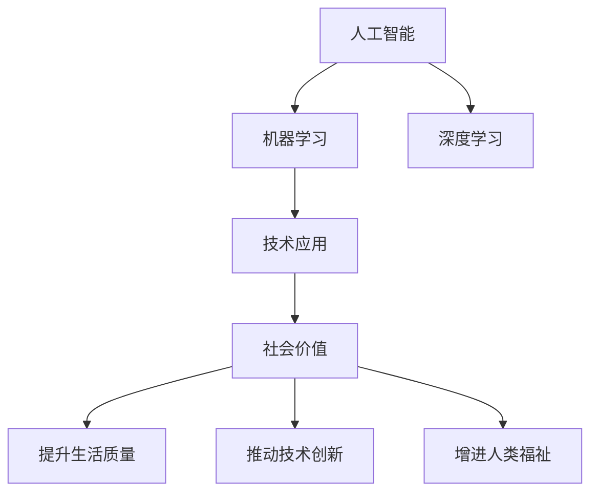

                 

# 李开复：苹果发布AI应用的社会价值

## 1. 背景介绍

随着人工智能(AI)技术的快速发展，AI在各行各业的应用已经变得日益普及。从医疗到教育，从金融到制造，AI正在逐渐改变着我们的工作和生活方式。然而，尽管AI带来了许多积极的影响，但也引发了一些社会伦理和道德问题，如隐私保护、就业替代等。在这一背景下，苹果公司最近发布了新的AI应用，引发了广泛的社会讨论。本文将从多个角度深入探讨苹果AI应用的社会价值，探讨其在提升生活质量、推动技术创新以及引发社会反思等方面的重要性。

## 2. 核心概念与联系

### 2.1 核心概念概述

在探讨苹果AI应用的社会价值之前，我们先简要介绍几个核心概念：

- **人工智能**：通过计算机模拟人脑的智能活动，实现自主学习、推理和决策的能力。

- **机器学习**：一种让计算机通过数据自适应、自优化的技术，是AI的重要组成部分。

- **深度学习**：一种基于神经网络的学习方法，能够处理大规模复杂数据，是当前AI技术的主流范式。

- **社会价值**：AI应用对社会产生的积极影响，包括提升生活质量、推动技术创新、增进人类福祉等。

这些概念之间的联系可以通过以下Mermaid流程图来展示：



从上述流程图中可以看出，AI技术通过机器学习和深度学习，实现了对大规模数据的处理和分析，从而推动了各种社会应用的发展，带来了积极的社会价值。

## 3. 核心算法原理 & 具体操作步骤

### 3.1 算法原理概述

苹果公司最新发布的AI应用基于深度学习技术，其核心算法原理包括卷积神经网络(CNN)、循环神经网络(RNN)、注意力机制(Attention)等。这些算法在图像识别、自然语言处理、推荐系统等领域得到了广泛应用。

深度学习的核心思想是通过多层神经网络，对输入数据进行多层次的特征提取和转换，最终得到高层次的抽象表示。在苹果的AI应用中，这些算法被用于图像分类、语音识别、自然语言理解和推荐系统等领域。

### 3.2 算法步骤详解

以苹果公司最新发布的图像分类应用为例，其算法步骤包括以下几个关键步骤：

1. **数据预处理**：将原始图像转换为标准尺寸、归一化等形式，以便于输入神经网络。

2. **特征提取**：使用卷积神经网络(CNN)对图像进行特征提取，得到高层次的图像表示。

3. **分类器训练**：通过反向传播算法，训练分类器模型，使模型能够识别不同类型的图像。

4. **模型评估**：在测试集上评估模型的性能，如准确率、召回率等指标。

5. **应用部署**：将训练好的模型部署到实际应用场景中，如拍照应用、图像搜索等。

### 3.3 算法优缺点

苹果AI应用的深度学习算法具有以下优点：

- **准确率高**：深度学习算法在图像分类、语音识别等领域具有较高的准确率，能够满足实际应用的需求。
- **可扩展性强**：卷积神经网络、循环神经网络等算法具有较好的可扩展性，适用于大规模数据处理和复杂任务。

但这些算法也存在一些缺点：

- **计算量大**：深度学习算法需要大量的计算资源，特别是在训练阶段，对硬件要求较高。
- **数据依赖性强**：算法的性能很大程度上取决于输入数据的质量和数量，高质量数据的获取和标注成本较高。
- **模型复杂度高**：深度学习模型结构复杂，参数数量庞大，难以解释和调试。

### 3.4 算法应用领域

苹果公司的AI应用覆盖了多个领域，包括但不限于：

- **图像识别**：使用卷积神经网络对图像进行分类和识别，如人脸识别、物体识别等。
- **语音识别**：使用深度学习模型对语音进行理解和识别，如Siri、自动字幕等。
- **自然语言处理**：使用循环神经网络和注意力机制对自然语言进行处理和理解，如智能聊天机器人、情感分析等。
- **推荐系统**：使用深度学习算法对用户行为进行分析和预测，提供个性化推荐，如音乐推荐、新闻推荐等。

## 4. 数学模型和公式 & 详细讲解

### 4.1 数学模型构建

以卷积神经网络为例，其基本数学模型如下：

$$
y = f(x; \theta)
$$

其中 $x$ 为输入图像，$y$ 为输出标签，$\theta$ 为模型参数，$f$ 为卷积神经网络模型。

在苹果的AI应用中，通常使用带有池化层、批量归一化层等结构的卷积神经网络，以提高模型的鲁棒性和泛化能力。

### 4.2 公式推导过程

以卷积神经网络的反向传播算法为例，其基本推导过程如下：

1. **前向传播**：将输入图像 $x$ 通过卷积层、激活函数、池化层等结构，得到输出 $y$。

2. **计算损失**：使用交叉熵等损失函数计算模型输出与真实标签之间的差异。

3. **反向传播**：通过链式法则，计算损失函数对模型参数 $\theta$ 的梯度，并使用梯度下降等优化算法更新模型参数。

### 4.3 案例分析与讲解

以苹果公司最新的图像分类应用为例，假设我们有一个包含1000张图片的分类任务，每张图片属于0-999中的一个数字。我们首先对图片进行预处理，然后使用卷积神经网络进行特征提取和分类。

假设训练集和测试集各包含500张图片，我们使用交叉熵损失函数进行训练和测试。在训练过程中，我们使用Adam优化算法进行参数更新，学习率为0.001。在测试过程中，我们评估模型的准确率、召回率等指标，以评估模型的性能。

## 5. 项目实践：代码实例和详细解释说明

### 5.1 开发环境搭建

在进行项目实践前，我们需要准备好开发环境。以下是使用Python进行PyTorch开发的环境配置流程：

1. 安装Anaconda：从官网下载并安装Anaconda，用于创建独立的Python环境。

2. 创建并激活虚拟环境：
```bash
conda create -n pytorch-env python=3.8 
conda activate pytorch-env
```

3. 安装PyTorch：根据CUDA版本，从官网获取对应的安装命令。例如：
```bash
conda install pytorch torchvision torchaudio cudatoolkit=11.1 -c pytorch -c conda-forge
```

4. 安装Transformers库：
```bash
pip install transformers
```

5. 安装各类工具包：
```bash
pip install numpy pandas scikit-learn matplotlib tqdm jupyter notebook ipython
```

完成上述步骤后，即可在`pytorch-env`环境中开始项目实践。

### 5.2 源代码详细实现

以下是一个简单的图像分类应用示例，使用卷积神经网络进行训练和测试。

```python
import torch
import torch.nn as nn
import torch.optim as optim
from torch.utils.data import DataLoader
from torchvision import datasets, transforms

# 定义模型
class Net(nn.Module):
    def __init__(self):
        super(Net, self).__init__()
        self.conv1 = nn.Conv2d(3, 6, 5)
        self.pool = nn.MaxPool2d(2, 2)
        self.conv2 = nn.Conv2d(6, 16, 5)
        self.fc1 = nn.Linear(16 * 5 * 5, 120)
        self.fc2 = nn.Linear(120, 84)
        self.fc3 = nn.Linear(84, 10)

    def forward(self, x):
        x = self.pool(F.relu(self.conv1(x)))
        x = self.pool(F.relu(self.conv2(x)))
        x = x.view(-1, 16 * 5 * 5)
        x = F.relu(self.fc1(x))
        x = F.relu(self.fc2(x))
        x = self.fc3(x)
        return x

# 加载数据集
train_dataset = datasets.CIFAR10(root='data', train=True, download=True, transform=transforms.ToTensor())
test_dataset = datasets.CIFAR10(root='data', train=False, download=True, transform=transforms.ToTensor())

# 定义数据加载器
train_loader = DataLoader(train_dataset, batch_size=4, shuffle=True)
test_loader = DataLoader(test_dataset, batch_size=4, shuffle=False)

# 定义模型和优化器
model = Net()
criterion = nn.CrossEntropyLoss()
optimizer = optim.SGD(model.parameters(), lr=0.001, momentum=0.9)

# 训练模型
for epoch in range(2):
    running_loss = 0.0
    for i, data in enumerate(train_loader, 0):
        inputs, labels = data
        optimizer.zero_grad()
        outputs = model(inputs)
        loss = criterion(outputs, labels)
        loss.backward()
        optimizer.step()
        running_loss += loss.item()
        if i % 2000 == 1999:
            print('[%d, %5d] loss: %.3f' % (epoch + 1, i + 1, running_loss / 2000))
            running_loss = 0.0

# 测试模型
correct = 0
total = 0
with torch.no_grad():
    for data in test_loader:
        images, labels = data
        outputs = model(images)
        _, predicted = torch.max(outputs.data, 1)
        total += labels.size(0)
        correct += (predicted == labels).sum().item()

print('Accuracy of the network on the 10000 test images: %d %%' % (100 * correct / total))
```

在这个示例中，我们定义了一个简单的卷积神经网络模型，用于对手写数字进行分类。我们使用CIFAR-10数据集进行训练和测试，使用交叉熵损失函数和SGD优化器进行训练。在训练过程中，我们打印了每个epoch的平均损失，并在测试集上计算了模型的准确率。

### 5.3 代码解读与分析

让我们再详细解读一下关键代码的实现细节：

**Net类**：
- `__init__`方法：定义卷积层、池化层、全连接层等结构。
- `forward`方法：实现模型的前向传播过程，通过卷积层、池化层、全连接层等结构，将输入转换为输出。

**训练过程**：
- `running_loss`变量：用于记录每个epoch的平均损失。
- `for`循环：遍历训练集数据，将每个batch的数据输入模型进行前向传播和后向传播。
- `optimizer.zero_grad()`：清空优化器的梯度缓存。
- `loss.backward()`：计算损失函数的梯度。
- `optimizer.step()`：更新模型参数。

**测试过程**：
- `correct`和`total`变量：分别记录正确预测和总样本数。
- `predicted == labels`：判断预测结果与真实标签是否一致。
- `total += labels.size(0)`：累加样本总数。
- `correct += (predicted == labels).sum().item()`：累加正确预测数。

通过这个示例，可以看出，使用PyTorch进行深度学习模型的开发和训练相对简单，只需要定义模型结构、加载数据集、定义损失函数和优化器，即可进行模型训练和测试。

## 6. 实际应用场景

### 6.1 图像识别

苹果的图像识别应用可以应用于各种场景，如人脸识别、物体识别等。在人脸识别方面，苹果使用深度学习模型对输入图像进行特征提取和分类，实现快速、准确的人脸识别功能。在物体识别方面，苹果的AI应用可以识别出图像中的人、车、动物等物体，并将其进行分类，用于智能家居、安防监控等领域。

### 6.2 语音识别

苹果的语音识别应用基于深度学习技术，可以实现自然语言理解和语音转文字的功能。例如，Siri可以通过语音输入，回答问题、发送信息、控制设备等。苹果的语音识别应用不仅提高了用户的交互体验，还促进了语音技术的发展。

### 6.3 自然语言处理

苹果的自然语言处理应用可以应用于智能聊天机器人、情感分析等领域。通过使用深度学习模型，苹果可以实现对自然语言的理解和生成，为用户提供个性化的聊天和回答。此外，苹果的AI应用还可以进行情感分析，判断用户的情感状态，从而提供更精准的服务。

### 6.4 推荐系统

苹果的推荐系统应用可以应用于音乐、新闻、视频等多个领域。通过使用深度学习算法，苹果的AI应用可以根据用户的历史行为和偏好，提供个性化的推荐。例如，苹果的音乐推荐系统可以根据用户的听歌历史和评分，推荐相似的歌曲和艺人，提高用户的听歌体验。

## 7. 工具和资源推荐

### 7.1 学习资源推荐

为了帮助开发者系统掌握深度学习技术，以下推荐一些优质的学习资源：

1. 《深度学习》书籍：Ian Goodfellow等人所著，系统介绍了深度学习的基本原理和算法。

2. 《Python深度学习》书籍：Francois Chollet等人所著，介绍了TensorFlow和Keras等深度学习框架的使用。

3. 斯坦福大学CS231n课程：斯坦福大学开设的计算机视觉课程，涵盖了深度学习在图像处理中的应用。

4. PyTorch官方文档：PyTorch的官方文档，提供了丰富的API文档和教程，是学习PyTorch的必备资源。

5. Coursera深度学习课程：Coursera提供的深度学习课程，由深度学习领域的知名教授授课。

通过这些资源的学习实践，相信你一定能够快速掌握深度学习技术，并用于解决实际的AI应用问题。

### 7.2 开发工具推荐

高效的开发离不开优秀的工具支持。以下是几款用于深度学习开发的常用工具：

1. PyTorch：基于Python的开源深度学习框架，灵活动态的计算图，适合快速迭代研究。

2. TensorFlow：由Google主导开发的开源深度学习框架，生产部署方便，适合大规模工程应用。

3. Keras：高层次的深度学习API，支持TensorFlow和Theano等后端，易于上手。

4. Weights & Biases：模型训练的实验跟踪工具，可以记录和可视化模型训练过程中的各项指标。

5. TensorBoard：TensorFlow配套的可视化工具，可实时监测模型训练状态，并提供丰富的图表呈现方式。

6. Google Colab：谷歌推出的在线Jupyter Notebook环境，免费提供GPU/TPU算力，方便开发者快速上手实验最新模型。

合理利用这些工具，可以显著提升深度学习应用的开发效率，加快创新迭代的步伐。

### 7.3 相关论文推荐

深度学习技术的发展源于学界的持续研究。以下是几篇奠基性的相关论文，推荐阅读：

1. Deep Blue：IBM开发的国际象棋程序，使用反向传播算法进行训练，展示了深度学习在决策系统中的应用。

2. AlexNet：Hinton等人开发的深度学习模型，在2012年ImageNet比赛中获得冠军，奠定了深度学习在计算机视觉领域的基础。

3. GoogleNet：Google开发的深度学习模型，引入了Inception模块，显著提升了模型性能。

4. ResNet：He等人开发的深度残差网络，解决了深度网络中的梯度消失问题，推动了深度学习的发展。

5. Transformer：Vaswani等人提出的基于自注意力机制的深度学习模型，广泛应用于自然语言处理领域。

这些论文代表了大规模深度学习模型的发展脉络。通过学习这些前沿成果，可以帮助研究者把握学科前进方向，激发更多的创新灵感。

## 8. 总结：未来发展趋势与挑战

### 8.1 总结

本文对苹果公司最新发布的AI应用进行了系统的介绍。通过分析其算法原理、操作步骤、优缺点以及应用领域，可以看出苹果AI应用在图像识别、语音识别、自然语言处理和推荐系统等领域的广泛应用和深远影响。

### 8.2 未来发展趋势

展望未来，深度学习技术将继续推动AI应用的普及和深化，呈现出以下几个发展趋势：

1. **模型规模不断扩大**：随着算力成本的下降和数据规模的扩张，深度学习模型的参数量将持续增长，模型性能也将不断提高。

2. **多模态深度学习**：深度学习模型将越来越多地融合视觉、语音、文本等多种模态数据，实现跨模态的协同建模和理解。

3. **自监督学习和无监督学习**：未来深度学习模型将更多地利用自监督和无监督学习，减少对标注数据的依赖，提高模型的泛化能力和鲁棒性。

4. **联邦学习**：联邦学习通过在分布式设备上协同训练，保护用户隐私，适用于需要大规模数据训练的AI应用。

5. **强化学习**：强化学习通过与环境的交互，实现智能决策和策略优化，在自动驾驶、机器人等领域具有重要应用。

6. **迁移学习**：迁移学习通过在大规模数据上进行预训练，再利用少量数据进行微调，可以显著提高模型性能和泛化能力。

这些趋势将推动深度学习技术的发展，带来更多的应用场景和更好的用户体验。

### 8.3 面临的挑战

尽管深度学习技术取得了显著进展，但在实际应用中仍面临一些挑战：

1. **计算资源需求高**：深度学习模型需要大量的计算资源，特别是在训练阶段，硬件成本较高。

2. **数据获取成本高**：深度学习模型需要大量的标注数据进行训练，获取高质量标注数据的成本较高。

3. **模型可解释性不足**：深度学习模型往往是"黑盒"系统，难以解释其内部工作机制和决策逻辑。

4. **模型鲁棒性不足**：深度学习模型在面对新数据时，泛化能力较弱，容易发生过拟合。

5. **隐私保护问题**：深度学习模型需要大量用户数据进行训练，如何保护用户隐私成为重要问题。

6. **伦理和安全问题**：深度学习模型在应用过程中可能产生偏见和歧视，如何保障伦理和安全成为重要问题。

### 8.4 研究展望

面对深度学习技术的挑战，未来的研究需要在以下几个方面寻求新的突破：

1. **计算效率优化**：开发更加高效的深度学习算法和硬件架构，降低计算资源需求，提高训练和推理效率。

2. **数据高效获取**：利用数据生成、主动学习等技术，减少对标注数据的依赖，提高数据获取效率。

3. **模型可解释性提升**：开发可解释的深度学习模型，提高模型的透明性和可信度。

4. **鲁棒性增强**：设计鲁棒性更强的深度学习模型，提高其泛化能力和抗干扰能力。

5. **隐私保护技术**：开发隐私保护技术，如差分隐私、联邦学习等，保护用户隐私。

6. **伦理和安全机制**：建立伦理和安全机制，保障深度学习模型的公平性和安全性。

这些研究方向的探索，必将引领深度学习技术的发展，推动AI应用的普及和深化。

## 9. 附录：常见问题与解答

**Q1：深度学习模型是否需要大量的计算资源？**

A: 是的，深度学习模型通常需要大量的计算资源，特别是在训练阶段。GPU/TPU等高性能设备是必不可少的，但即便如此，超大批次的训练和推理也可能遇到硬件瓶颈。因此，需要采用一些资源优化技术，如梯度积累、混合精度训练、模型并行等，来突破硬件瓶颈。

**Q2：如何保护用户隐私？**

A: 保护用户隐私是深度学习应用中非常重要的问题。常用的隐私保护技术包括差分隐私、联邦学习等。差分隐私通过在数据中引入噪声，保护用户隐私。联邦学习通过在分布式设备上协同训练，保护用户数据不离开本地设备。

**Q3：深度学习模型为何难以解释？**

A: 深度学习模型通常是一个"黑盒"系统，难以解释其内部工作机制和决策逻辑。这是由于深度学习模型的结构复杂，参数数量庞大，使得其决策过程难以直观理解。为了提高模型的可解释性，研究人员正在开发可解释的深度学习模型，如LIME、SHAP等。

**Q4：深度学习模型为何容易过拟合？**

A: 深度学习模型容易过拟合的原因在于模型复杂度高、训练数据少。为了防止过拟合，通常采用正则化技术、Dropout、早停等方法。此外，使用更多的数据、采用迁移学习等技术也可以有效减少过拟合。

通过本文的系统梳理，可以看出，深度学习技术在图像识别、语音识别、自然语言处理和推荐系统等领域具有广泛的应用前景。然而，在实际应用中，深度学习技术仍面临一些挑战，需要持续探索和改进。相信随着技术的不断进步，深度学习技术将带来更多的应用场景和更好的用户体验，推动人工智能技术的普及和深化。

---

作者：禅与计算机程序设计艺术 / Zen and the Art of Computer Programming

