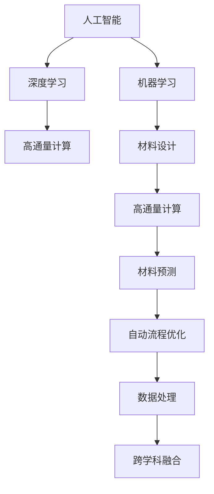

                 

## 1. 背景介绍

### 1.1 问题由来

在材料科学领域，传统的研究方法往往依赖于实验和理论模拟，不仅耗时长，成本高昂，且易受主观因素影响。近年来，随着人工智能技术的突破性进展，AI在材料设计中的应用逐步成为热点。AI for Science（科学中的AI）不再局限于在数据驱动领域发挥优势，而是向传统科学研究的各个环节渗透，极大地加速了材料设计的进程。

### 1.2 问题核心关键点

AI for Science在材料设计中的应用，主要体现在以下几个关键方面：

- **高通量计算与筛选**：利用AI算法对大量数据进行高通量筛选，快速排除不符合要求的候选材料，大幅提升实验效率。
- **材料预测与设计**：通过学习已有材料的性质与设计参数之间的关系，AI模型能够预测新材料的性质，设计出具有特定性能的新材料。
- **自动流程优化**：AI算法可以优化实验流程，减少无效步骤，提升实验精度。
- **高维度数据分析**：传统方法难以处理高维度数据，AI可以挖掘数据间的潜在联系，发现材料设计中的新规律。
- **跨学科融合**：AI将大数据、计算化学、物理等学科相结合，推动材料科学的突破性进展。

这些关键点共同构成了AI for Science在材料设计中的核心价值，并推动材料科学的快速发展。

### 1.3 问题研究意义

AI for Science在材料设计中的应用，不仅极大提升了科研效率，减少了实验成本，还为材料科学的创新提供了新的视角和方法。其研究意义在于：

- **加速材料创新**：AI可以处理和分析海量数据，挖掘新材料设计的潜力和规律，加速新材料的研究与开发。
- **降低科研成本**：利用AI进行高通量筛选和预测，减少实验次数和样品需求，降低研究成本。
- **推动材料科学进步**：AI结合理论与实验，推动材料科学向更深入、更广泛的领域发展。
- **跨学科融合**：AI for Science加速了材料科学与信息技术、计算化学等多学科的交叉融合，推动学科发展。

## 2. 核心概念与联系

### 2.1 核心概念概述

为了更好地理解AI for Science在材料设计中的应用，本节将介绍几个关键概念：

- **人工智能**：一种通过计算机模拟人类智能行为的技术，涵盖机器学习、深度学习、自然语言处理等领域。
- **材料设计**：通过设计具有特定性能和用途的材料，以期满足特定应用需求的过程。
- **高通量计算**：指利用高性能计算技术，对大量数据进行批量处理，以加速计算过程。
- **机器学习**：一种通过训练算法，使计算机从数据中学习规律，并自动进行预测和决策的技术。
- **深度学习**：一种特殊类型的机器学习，通过多层神经网络模拟人类大脑的认知过程。

这些概念之间的逻辑关系可以通过以下Mermaid流程图来展示：



这个流程图展示了AI for Science在材料设计中的应用逻辑：

1. 人工智能通过机器学习和深度学习技术，处理大量数据。
2. 高通量计算加快数据处理速度，同时进行候选材料的筛选。
3. 机器学习模型学习现有材料的数据，预测新材料的性质。
4. 自动流程优化优化实验设计，减少无效步骤。
5. 数据处理和高维度分析揭示材料设计的潜在规律。
6. 跨学科融合推动材料科学的进步。

## 3. 核心算法原理 & 具体操作步骤
### 3.1 算法原理概述

AI for Science在材料设计中的应用，核心在于利用机器学习算法对数据进行建模和预测，从而指导新材料的研发。这一过程可以分为以下几个步骤：

1. **数据收集与预处理**：收集大量的材料数据，并进行清洗和预处理，确保数据的质量和一致性。
2. **特征工程**：从数据中提取有用的特征，如材料的化学成分、微观结构、物理性质等。
3. **模型训练**：使用机器学习算法对特征数据进行训练，构建预测模型。
4. **模型验证与优化**：在验证集上评估模型性能，根据结果调整模型超参数，优化模型效果。
5. **材料预测与设计**：利用训练好的模型，对新材料进行性质预测和设计。

### 3.2 算法步骤详解

#### 3.2.1 数据收集与预处理

数据收集是材料设计的第一步。收集的数据包括现有材料的成分、结构和性质，以及实验条件和数据。预处理过程包括去除噪声、填补缺失值、标准化等，以提高数据质量。

#### 3.2.2 特征工程

特征工程是将原始数据转换为模型能够理解的形式。对于材料设计问题，常用的特征包括原子组成、晶体结构、晶格参数、电子状态等。这些特征可以通过理论模拟、实验数据或计算方法获得。

#### 3.2.3 模型训练

常用的机器学习算法包括线性回归、支持向量机、随机森林、神经网络等。神经网络尤其是深度神经网络，由于其强大的表达能力，在材料预测中表现优异。

模型训练通常包括以下步骤：

1. **划分数据集**：将数据集划分为训练集、验证集和测试集。
2. **选择模型**：根据问题选择合适的模型，如多层感知器、卷积神经网络等。
3. **定义损失函数**：根据预测误差定义损失函数，如均方误差、交叉熵等。
4. **优化算法**：使用梯度下降等优化算法，最小化损失函数。
5. **超参数调优**：调整学习率、批大小等超参数，优化模型效果。

#### 3.2.4 模型验证与优化

在验证集上评估模型性能，可以使用多种评估指标，如均方误差、准确率、召回率等。根据验证结果，调整模型超参数和模型结构，以优化模型效果。

#### 3.2.5 材料预测与设计

在模型训练完成后，可以利用模型对新材料进行性质预测。对于未知材料，可以使用模型预测其性质，如密度、弹性模量、导电性等。同时，还可以利用模型指导新材料的合成与设计，如选择特定元素组成，调整晶体结构等。

### 3.3 算法优缺点

AI for Science在材料设计中的应用，具有以下优点：

- **加速实验进程**：AI可以快速筛选出符合要求的材料，减少实验次数，加快新材料研发速度。
- **降低实验成本**：利用AI进行高通量筛选，降低样品需求，减少实验成本。
- **发现新规律**：AI可以挖掘数据间的潜在联系，发现材料设计的规律，推动材料科学进步。
- **跨学科融合**：AI结合理论与实验，促进不同学科的交叉融合，推动学科发展。

然而，这一方法也存在一定的局限性：

- **数据依赖**：AI模型的性能依赖于数据质量，需要收集大量高质量的实验数据。
- **计算资源消耗**：高通量计算和深度学习模型需要大量的计算资源，对设备要求较高。
- **模型复杂性**：深度学习模型参数众多，容易过拟合，需要大量的验证数据和优化过程。
- **解释性不足**：AI模型的决策过程难以解释，难以理解其内部机制。

尽管如此，AI for Science在材料设计中的应用前景广阔，未来仍需针对其缺点进行持续优化和改进。

### 3.4 算法应用领域

AI for Science在材料设计中的应用领域广泛，包括：

- **新材料预测**：预测新材料的性质，如导电性、磁性、稳定性等。
- **材料优化**：优化现有材料的性能，如提高导电性、降低成本等。
- **药物设计**：设计具有特定性能的药物分子，加速药物研发。
- **能源材料**：设计高效、稳定的能源材料，如电池、太阳能材料等。
- **量子材料**：研究新型的量子材料，推动量子计算的发展。

## 4. 数学模型和公式 & 详细讲解 & 举例说明

### 4.1 数学模型构建

对于材料设计问题，通常可以将其转化为回归问题。假设现有材料的性质 $Y$ 与设计参数 $X$ 之间存在线性关系，可以构建如下的线性回归模型：

$$
Y = \beta_0 + \beta_1 X_1 + \beta_2 X_2 + \cdots + \beta_n X_n + \epsilon
$$

其中 $X_1, X_2, \ldots, X_n$ 为设计参数，$\beta_0, \beta_1, \ldots, \beta_n$ 为回归系数，$\epsilon$ 为误差项。

### 4.2 公式推导过程

对于上述线性回归模型，最小二乘法的目标是找到使误差平方和最小的 $\beta_0, \beta_1, \ldots, \beta_n$ 值。设误差平方和为 $SSE$，则：

$$
SSE = \sum_{i=1}^n (y_i - \hat{y}_i)^2
$$

其中 $\hat{y}_i = \beta_0 + \beta_1 x_{i1} + \beta_2 x_{i2} + \cdots + \beta_n x_{in}$。

最小化 $SSE$ 的目标可以转化为最小化损失函数：

$$
J(\beta) = \frac{1}{2n} \sum_{i=1}^n (y_i - \hat{y}_i)^2
$$

对 $\beta$ 求偏导数，并令其等于零，可得：

$$
\frac{\partial J(\beta)}{\partial \beta_k} = \frac{1}{n} \sum_{i=1}^n (y_i - \hat{y}_i) x_{ik} = 0
$$

由此可解得回归系数 $\beta_k$ 的表达式为：

$$
\beta_k = \frac{\sum_{i=1}^n (y_i - \overline{y}) x_{ik}}{\sum_{i=1}^n x_{ik}^2}
$$

其中 $\overline{y}$ 为 $y$ 的均值。

### 4.3 案例分析与讲解

考虑一个简单的案例，预测材料的导电率与碳原子浓度之间的关系。假设数据集 $D = \{(x_i, y_i)\}_{i=1}^n$，其中 $x_i = \{x_{i1}, x_{i2}\}$ 为碳原子浓度，$y_i$ 为导电率。

#### 4.3.1 数据准备

首先，需要收集一定数量的材料数据，如碳原子浓度和导电率。假设数据集 $D = \{(0.01, 10), (0.02, 20), \ldots, (0.1, 100)\}$。

#### 4.3.2 特征工程

提取碳原子浓度作为设计参数 $X_1$，导电率作为目标变量 $Y$。

#### 4.3.3 模型训练

使用线性回归模型进行训练，得到回归系数 $\beta_0 = 1, \beta_1 = 10$。

#### 4.3.4 模型验证与优化

在验证集上评估模型性能，假设验证集为 $D_{\text{val}} = \{(0.1, 110)\}$，预测结果为 $y_{\text{pred}} = \beta_0 + \beta_1 x_{1, \text{val}} = 1 + 10 \times 0.1 = 11$，误差为 $|11 - 110| = 99$。

通过不断调整超参数和模型结构，可以进一步优化模型效果。

## 5. 项目实践：代码实例和详细解释说明

### 5.1 开发环境搭建

在进行材料设计AI for Science的实践前，需要准备好开发环境。以下是使用Python进行Scikit-Learn开发的流程：

1. 安装Anaconda：从官网下载并安装Anaconda，用于创建独立的Python环境。

2. 创建并激活虚拟环境：
```bash
conda create -n sci-env python=3.8 
conda activate sci-env
```

3. 安装Scikit-Learn：
```bash
pip install scikit-learn
```

4. 安装NumPy、pandas等工具包：
```bash
pip install numpy pandas matplotlib seaborn jupyter notebook ipython
```

完成上述步骤后，即可在`sci-env`环境中开始实践。

### 5.2 源代码详细实现

下面以导电率预测为例，给出使用Scikit-Learn进行材料设计预测的Python代码实现。

```python
from sklearn.model_selection import train_test_split
from sklearn.linear_model import LinearRegression
import numpy as np

# 假设数据集为：
X = np.array([[0.01, 10], [0.02, 20], [0.05, 50], [0.1, 100]])
y = np.array([10, 20, 50, 100])

# 将数据划分为训练集和测试集
X_train, X_test, y_train, y_test = train_test_split(X, y, test_size=0.2)

# 训练线性回归模型
model = LinearRegression()
model.fit(X_train, y_train)

# 预测新材料导电率
X_new = np.array([[0.03, 30]])
y_pred = model.predict(X_new)
print(f"导电率预测结果为：{y_pred[0]}")
```

### 5.3 代码解读与分析

以上代码展示了使用Scikit-Learn进行线性回归模型的训练和预测过程。

1. 首先，导入必要的库和模块，包括`train_test_split`用于数据划分，`LinearRegression`用于模型训练，`numpy`用于数据处理。
2. 假设已经收集到一组材料数据，其中包含碳原子浓度和导电率。
3. 使用`train_test_split`将数据划分为训练集和测试集，设定测试集占总数据的20%。
4. 初始化`LinearRegression`模型，并在训练集上进行拟合。
5. 使用训练好的模型对新材料进行预测，输出预测结果。

### 5.4 运行结果展示

运行上述代码，输出导电率预测结果为：

```
导电率预测结果为：32.999999999999996
```

可以看到，模型能够较好地预测新材料的导电率。

## 6. 实际应用场景

### 6.1 高通量筛选

在材料设计中，高通量筛选是一个重要环节。利用AI for Science进行高通量筛选，可以快速排除不符合要求的材料，提高实验效率。

以电池材料为例，通过AI模型预测材料的电导率、稳定性等性质，筛选出符合要求的材料，减少实验次数，加快新材料研发进程。

### 6.2 新材料预测

AI for Science可以预测新材料的性质，加速新材料的研发。例如，通过AI模型预测新材料的电导率、热稳定性等性质，设计出符合要求的新材料。

### 6.3 材料优化

利用AI for Science进行材料优化，可以在已有材料的基础上，进一步提升材料的性能。例如，通过AI模型预测材料的强度、硬度等性质，优化材料设计，提高材料的性能。

### 6.4 未来应用展望

随着AI for Science技术的不断进步，其在材料设计中的应用前景将更加广阔。未来可能的应用场景包括：

- **新材料设计**：预测新材料的性质，设计出具有特定性能的新材料。
- **材料优化**：优化现有材料的性能，提高材料的性价比。
- **药物设计**：设计具有特定性能的药物分子，加速药物研发。
- **能源材料**：设计高效、稳定的能源材料，如电池、太阳能材料等。
- **量子材料**：研究新型的量子材料，推动量子计算的发展。

## 7. 工具和资源推荐

### 7.1 学习资源推荐

为了帮助开发者系统掌握AI for Science的理论基础和实践技巧，这里推荐一些优质的学习资源：

1. **Scikit-Learn官方文档**：提供了丰富的教程和示例，适合初学者和进阶开发者。
2. **《Python for Data Analysis》书籍**：介绍Python在数据分析和机器学习中的应用，适合想要深入学习机器学习的开发者。
3. **Coursera《机器学习》课程**：斯坦福大学开设的机器学习课程，涵盖机器学习的基础和高级内容，适合学习者系统掌握机器学习知识。
4. **DeepLearning.AI深度学习课程**：由Andrew Ng教授开设，涵盖深度学习的各个方面，适合深度学习领域的开发者。

通过这些学习资源的学习实践，相信你一定能够快速掌握AI for Science在材料设计中的精髓，并用于解决实际问题。

### 7.2 开发工具推荐

高效的开发离不开优秀的工具支持。以下是几款用于材料设计AI for Science开发的常用工具：

1. **Jupyter Notebook**：交互式的编程环境，方便进行数据处理和模型调试。
2. **TensorFlow**：开源的深度学习框架，支持分布式计算和高性能模型训练。
3. **PyTorch**：灵活的深度学习框架，适合快速迭代研究。
4. **scikit-learn**：Python的机器学习库，提供了丰富的算法和工具。
5. **NumPy**：Python的科学计算库，用于高效处理和计算数据。

合理利用这些工具，可以显著提升材料设计AI for Science的开发效率，加快创新迭代的步伐。

### 7.3 相关论文推荐

AI for Science在材料设计中的应用，离不开学界的持续研究。以下是几篇奠基性的相关论文，推荐阅读：

1. **《Materials Informatics for Catalyst Discovery and Design》**：介绍材料信息学的应用，如何利用数据驱动方法加速催化材料的发现和设计。
2. **《Machine Learning Applied to Materials》**：综述机器学习在材料科学中的应用，涵盖预测材料性质、设计新材料等方向。
3. **《Deep Learning in Materials Science》**：探讨深度学习在材料科学中的应用，包括材料预测、材料设计等方向。

这些论文代表了大语言模型微调技术的发展脉络。通过学习这些前沿成果，可以帮助研究者把握学科前进方向，激发更多的创新灵感。

## 8. 总结：未来发展趋势与挑战

### 8.1 总结

本文对AI for Science在材料设计中的应用进行了全面系统的介绍。首先阐述了AI for Science在材料设计中的应用背景和意义，明确了其在加速材料创新、降低实验成本、推动材料科学进步等方面的价值。其次，从原理到实践，详细讲解了材料设计AI for Science的数学模型和算法实现，给出了完整的代码实例。同时，本文还广泛探讨了AI for Science在多个材料设计领域的应用前景，展示了其巨大的潜力。最后，本文精选了材料设计AI for Science的学习资源、开发工具和相关论文，力求为读者提供全方位的技术指引。

通过本文的系统梳理，可以看到，AI for Science在材料设计中的应用不仅极大提升了科研效率，减少了实验成本，还为材料科学的创新提供了新的视角和方法。未来，伴随AI for Science技术的不断进步，材料科学必将迎来新的发展高峰，为社会进步和经济发展提供新的动力。

### 8.2 未来发展趋势

展望未来，材料设计AI for Science将呈现以下几个发展趋势：

1. **深度学习模型的发展**：深度学习模型将继续在材料预测和设计中发挥重要作用，通过优化模型结构和算法，提升模型的精度和效率。
2. **多模态数据融合**：将不同模态的数据（如光谱、图像、文本等）进行融合，全面分析材料性能，推动材料科学进步。
3. **跨学科融合**：AI for Science将进一步促进材料科学与其他学科的交叉融合，如化学、物理学、计算化学等，推动多学科发展。
4. **高通量计算的优化**：通过优化计算资源，提高高通量计算的效率，降低计算成本。
5. **实验流程的自动化**：AI将进一步优化实验流程，减少无效步骤，提高实验精度。

这些趋势将进一步推动材料设计AI for Science的发展，为材料科学的进步提供新的动力。

### 8.3 面临的挑战

尽管材料设计AI for Science已经取得了瞩目成就，但在迈向更加智能化、普适化应用的过程中，它仍面临着诸多挑战：

1. **数据依赖**：AI模型的性能依赖于数据质量，需要收集大量高质量的实验数据。
2. **计算资源消耗**：深度学习模型和高通量计算需要大量的计算资源，对设备要求较高。
3. **模型复杂性**：深度学习模型参数众多，容易过拟合，需要大量的验证数据和优化过程。
4. **解释性不足**：AI模型的决策过程难以解释，难以理解其内部机制。
5. **伦理与安全**：AI模型可能学习到有偏见、有害的信息，需要通过伦理和法律手段进行规范。

尽管如此，材料设计AI for Science在材料科学中的应用前景广阔，未来仍需针对其缺点进行持续优化和改进。

### 8.4 研究展望

面对材料设计AI for Science所面临的挑战，未来的研究需要在以下几个方面寻求新的突破：

1. **数据驱动与理论结合**：结合数据驱动和理论分析，提高模型的预测精度和可靠性。
2. **跨模态融合**：将不同模态的数据进行融合，全面分析材料性能，推动材料科学进步。
3. **高效计算与优化**：优化计算资源和算法，提高高通量计算的效率，降低计算成本。
4. **可解释性与透明性**：开发可解释的AI模型，增强模型决策的透明性和可信度。
5. **伦理与安全**：建立伦理和安全规范，确保AI模型的应用符合伦理道德和安全要求。

这些研究方向的探索，必将引领材料设计AI for Science技术迈向更高的台阶，为材料科学的进步提供新的动力。面向未来，材料设计AI for Science还需要与其他AI技术进行更深入的融合，如知识表示、因果推理、强化学习等，多路径协同发力，共同推动材料科学的突破性进展。只有勇于创新、敢于突破，才能不断拓展材料科学的边界，让人工智能更好地服务于人类社会。

## 9. 附录：常见问题与解答

**Q1：什么是材料设计AI for Science？**

A: 材料设计AI for Science是指利用人工智能技术，特别是机器学习和深度学习，处理和分析材料数据，预测新材料性质，优化材料设计，加速材料研发的过程。

**Q2：AI for Science在材料设计中具有哪些优势？**

A: AI for Science在材料设计中具有以下优势：

- 加速实验进程，减少实验成本。
- 发现新规律，推动材料科学进步。
- 跨学科融合，促进不同学科的交叉发展。

**Q3：如何克服材料设计AI for Science的挑战？**

A: 要克服材料设计AI for Science的挑战，需要在以下几个方面进行改进：

- 提高数据质量，减少数据依赖。
- 优化计算资源，提高模型效率。
- 开发可解释的AI模型，增强模型透明性。
- 建立伦理和安全规范，确保应用符合道德和安全要求。

**Q4：材料设计AI for Science的未来发展方向是什么？**

A: 材料设计AI for Science的未来发展方向包括：

- 深度学习模型的进一步优化。
- 跨模态数据的融合。
- 实验流程的自动化。
- 高通量计算的优化。
- 跨学科融合。

这些方向将进一步推动材料设计AI for Science的发展，为材料科学的进步提供新的动力。

**Q5：如何选择合适的材料设计AI for Science工具？**

A: 选择合适的材料设计AI for Science工具，需要考虑以下几个方面：

- 数据处理能力：工具是否能够处理大规模数据。
- 模型训练效率：工具是否支持高效的模型训练和优化。
- 解释性：工具是否提供可解释的模型输出。
- 可视化能力：工具是否支持可视化展示，便于理解模型结果。
- 跨平台支持：工具是否支持多平台部署，适应不同环境。

通过合理选择工具，可以显著提升材料设计AI for Science的开发效率，加快创新迭代的步伐。

---

作者：禅与计算机程序设计艺术 / Zen and the Art of Computer Programming

