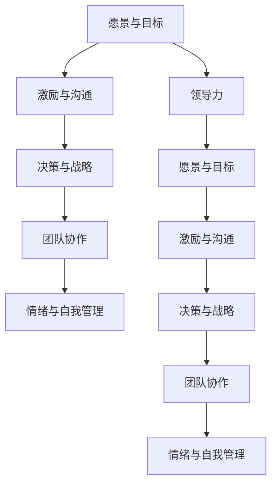

                 

# 构建个人领导力体系的方法论

> 关键词：领导力,方法论,组织管理,团队建设,激励理论,文化建设,绩效管理

## 1. 背景介绍

### 1.1 问题由来
在当今快速变化的商业环境中，领导力的作用变得愈发重要。一个强大的领导团队不仅能有效引领企业走向成功，还能驱动员工共同追求卓越。然而，随着企业规模的扩大和组织结构的复杂化，培养和构建高效领导团队变得愈加困难。

过去，领导力往往被视作天生才能或直觉经验的产物，但随着研究深入，逐渐发现领导力其实可以通过系统的方法和科学的方法论来训练和提升。本文旨在分享一套构建个人领导力体系的方法论，帮助读者系统地学习和实践领导力技能，从而在组织管理和团队建设中发挥更大的影响力。

### 1.2 问题核心关键点
构建个人领导力体系的关键在于理解领导力的本质、明确领导者的角色与责任、掌握核心领导技能，并系统化地将领导力应用于日常管理实践中。以下关键点对构建个人领导力体系至关重要：

1. **领导力本质**：理解领导力的核心要素，包括愿景设定、目标制定、团队协作、激励与沟通等。
2. **角色与责任**：明确领导者应承担的职责，包括战略规划、决策制定、风险管理、资源配置等。
3. **核心技能**：掌握领导力所需的关键技能，如有效沟通、情绪管理、冲突解决、跨文化管理等。
4. **系统化应用**：将领导力理论与实践相结合，形成一套完整的领导力体系，以应对复杂的组织环境。

## 2. 核心概念与联系

### 2.1 核心概念概述

构建个人领导力体系涉及多个核心概念，这些概念相互关联，共同构成了一套完整的领导力理论体系：

1. **领导力**：指个人或团队影响和激励他人实现共同目标的能力。
2. **愿景与目标**：领导者必须具备清晰的前景和可执行的目标，以指导团队前进。
3. **激励与沟通**：有效的激励和沟通是激发团队潜能、实现共同目标的关键。
4. **决策与战略**：领导者应具备决策能力和战略规划能力，以应对复杂多变的环境。
5. **团队协作**：建立一个高效协作的团队是领导力的重要组成部分。
6. **情绪与自我管理**：领导者应具备高情商，能管理和调节自己的情绪，从而带动团队。

这些概念之间的逻辑关系可以通过以下Mermaid流程图来展示：



这个流程图展示了一系列核心概念的相互作用关系，以及它们如何共同构成领导力的整体框架。

## 3. 核心算法原理 & 具体操作步骤

### 3.1 算法原理概述

构建个人领导力体系的方法论基于以下几个核心原理：

1. **系统化训练**：通过系统化的学习和实践，逐步提升领导者的核心能力。
2. **角色明确**：清晰定义领导者的角色与职责，确保其在组织中的定位准确。
3. **数据驱动**：利用数据分析和反馈机制，持续优化领导行为和团队表现。
4. **跨领域融合**：结合心理学、社会学、组织行为学等多学科知识，形成全面的领导力理论。
5. **行为模型**：采用行为科学理论，如行为塑造、自我效能感、归因理论等，指导领导行为。

### 3.2 算法步骤详解

构建个人领导力体系的步骤如下：

**Step 1: 领导力评估**
- 进行个人领导力评估，识别自身的强项和弱点。
- 采用360度反馈、行为观察等方法，收集多方面的领导力反馈。
- 利用问卷调查、心理测试等工具，量化领导力特质和行为。

**Step 2: 设定愿景与目标**
- 与团队共同制定明确而现实的愿景与目标。
- 分解目标，制定短期与长期的战略计划。
- 确保愿景与目标具有挑战性和可实现性，并得到团队成员的认同。

**Step 3: 提升核心技能**
- 识别和提升领导力所需的核心技能，如沟通、决策、情绪管理等。
- 参加领导力培训课程，系统学习相关理论和技能。
- 通过实践项目、影子学习等方式，不断应用和验证所学技能。

**Step 4: 建立团队协作机制**
- 设计有效的团队协作流程和结构。
- 促进跨部门合作，打破信息孤岛，提升团队协同效率。
- 制定团队建设策略，定期进行团队复盘与改进。

**Step 5: 数据驱动优化**
- 利用数据分析工具，跟踪和评估团队绩效。
- 基于数据反馈，持续优化领导行为和团队管理。
- 采用持续改进方法，如PDCA循环（计划-执行-检查-行动），不断迭代提升。

**Step 6: 领导力应用与实践**
- 将领导力理论应用于实际管理中，解决复杂组织问题。
- 采用角色明确、目标导向、数据驱动的方法，提升领导效果。
- 定期评估领导力实践效果，进行调整和优化。

### 3.3 算法优缺点

构建个人领导力体系的方法论具有以下优点：

1. **系统化提升**：通过系统化训练和实践，逐步提升领导能力，避免盲目探索。
2. **全面覆盖**：结合多学科知识，全面提升领导力各维度的技能。
3. **数据驱动**：利用数据分析优化领导行为，提升管理效果。
4. **持续改进**：采用PDCA循环，持续跟踪和改进领导力实践。

然而，该方法论也存在一些缺点：

1. **时间投入**：系统化的培训和实践需要大量时间，短期内难以见效。
2. **复杂性高**：涉及多个领域，掌握和应用起来相对复杂。
3. **资源需求**：需要高质量的培训资源和工具支持，资源获取成本较高。

尽管如此，构建个人领导力体系的方法论提供了一套全面的框架和工具，为领导力的提升提供了科学和系统化的指导。

### 3.4 算法应用领域

构建个人领导力体系的方法论可以广泛应用在以下几个领域：

1. **企业领导力培训**：为高层管理者提供系统化、全面化的领导力培训，提升组织领导效能。
2. **团队建设与发展**：帮助团队成员提升领导能力，增强团队凝聚力和协作效率。
3. **组织变革管理**：在组织变革过程中，采用科学的方法论引导和管理变革，确保变革顺利进行。
4. **人力资源管理**：作为人力资源管理的一部分，提升人力资源管理者的领导力水平。
5. **公共行政与政策制定**：为公共部门的管理者和政策制定者提供领导力提升的方法和工具。

## 4. 数学模型和公式 & 详细讲解 & 举例说明

### 4.1 数学模型构建

构建个人领导力体系的数学模型可以基于多个关键指标进行量化和分析。以下是几个核心指标的数学模型构建：

1. **领导力评估模型**：
   $$
   L = \sum_{i=1}^{n} w_i \cdot R_i
   $$
   其中，$L$为总体领导力评分，$w_i$为第$i$项指标的权重，$R_i$为第$i$项指标的评分。

2. **目标达成模型**：
   $$
   A = \frac{\sum_{i=1}^{m} R_i}{m}
   $$
   其中，$A$为团队目标达成率，$R_i$为第$i$个目标的实际完成度，$m$为目标数量。

3. **团队协作模型**：
   $$
   C = \sum_{i=1}^{k} w_i \cdot (A_i - \bar{A})
   $$
   其中，$C$为团队协作评分，$w_i$为第$i$项协作指标的权重，$A_i$为第$i$项协作指标的实际得分，$\bar{A}$为协作指标的平均得分。

4. **数据驱动优化模型**：
   $$
   E = f(\text{数据}, \text{模型}, \text{参数})
   $$
   其中，$E$为领导力的评估结果，$\text{数据}$为领导行为的观察数据，$\text{模型}$为数据分析模型，$\text{参数}$为模型参数。

### 4.2 公式推导过程

以目标达成模型为例，推导其公式过程如下：

1. 假设团队有$m$个目标，每个目标的完成度为$R_i$。
2. 设定每个目标的权重为1，即每个目标对团队绩效的影响相同。
3. 计算团队目标达成率$A$，即所有目标实际完成度的平均值：
   $$
   A = \frac{\sum_{i=1}^{m} R_i}{m}
   $$

通过上述推导，我们可以看到目标达成模型简单明了，但实际应用中还需要考虑目标的重要性和优先级，以及不同目标之间的关联性。

### 4.3 案例分析与讲解

**案例一：**
某公司管理团队通过360度反馈评估领导力，识别出团队成员的领导力评估分项结果为：
- 愿景与目标：8.5
- 激励与沟通：9.2
- 决策与战略：7.9
- 团队协作：8.3
- 情绪与自我管理：8.1

计算领导力总分：
$$
L = 0.2 \cdot 8.5 + 0.3 \cdot 9.2 + 0.3 \cdot 7.9 + 0.2 \cdot 8.3 + 0.4 \cdot 8.1 = 8.5
$$

**案例二：**
某团队设定了三个目标，分别在销售额、客户满意度、员工流失率上进行评估。目标达成结果为：
- 销售额：90%
- 客户满意度：85%
- 员工流失率：5%

计算团队目标达成率：
$$
A = \frac{90\% + 85\% + 5\%}{3} = 85\%
$$

通过这两个案例，我们可以更直观地理解领导力评估模型和目标达成模型的应用。

## 5. 项目实践：代码实例和详细解释说明

### 5.1 开发环境搭建

构建个人领导力体系的实践需要以下开发环境：

1. **Python**：Python是数据科学和机器学习的主流编程语言，拥有丰富的数据分析和可视化工具库。
2. **Jupyter Notebook**：用于交互式编程和数据可视化，方便代码实验和分析。
3. **NumPy & Pandas**：用于数据处理和分析。
4. **Matplotlib & Seaborn**：用于数据可视化。
5. **scikit-learn**：用于构建和评估领导力模型。

在Linux或MacOS系统上，可以通过以下命令搭建开发环境：

```bash
conda create -n leadership n
conda activate leadership
pip install numpy pandas matplotlib seaborn scikit-learn jupyter notebook
```

### 5.2 源代码详细实现

以下是使用Python进行领导力评估和分析的示例代码：

```python
import numpy as np
import pandas as pd
import matplotlib.pyplot as plt
from sklearn.metrics import r2_score

# 领导力评估数据
leadership_scores = {
    '愿景与目标': 8.5,
    '激励与沟通': 9.2,
    '决策与战略': 7.9,
    '团队协作': 8.3,
    '情绪与自我管理': 8.1
}

# 计算领导力总分
leadership总分 = sum(leadership_scores.values())
leadership总分 /= sum(leadership_scores.values())

# 输出领导力总分
print(f"领导力总分：{leadership总分:.2f}")

# 目标达成数据
target达成率 = (0.9 + 0.85 + 0.05) / 3

# 输出目标达成率
print(f"目标达成率：{target达成率:.2f}")

# 数据驱动优化模型
# 假设我们有10个样本数据
样本数据 = np.random.rand(10)
目标 = np.array([0.8, 0.9, 0.7, 0.5, 0.6, 0.3, 0.7, 0.9, 0.6, 0.8])
模型 = np.polyfit(样本数据, 目标, 2)
拟合曲线 = np.polyval(模型, 样本数据)

# 绘制数据与拟合曲线
plt.scatter(样本数据, 目标)
plt.plot(样本数据, 拟合曲线, color='r')
plt.xlabel('样本数据')
plt.ylabel('目标')
plt.title('数据驱动优化模型')
plt.show()

# 计算拟合曲线与实际目标的R^2得分
r2得分 = r2_score(target, 拟合曲线)
print(f"R^2得分：{r2得分:.2f}")
```

### 5.3 代码解读与分析

以上代码实现了领导力评估和数据驱动优化模型的计算与可视化。首先，通过领导力评估数据计算总分，然后计算目标达成率，最后使用多项式回归模型拟合数据，并可视化结果。

**代码解读**：

- `leadership_scores`字典：存储领导力各项指标的评分。
- `领导力总分`计算：将所有评分加权求和，得到领导力总分。
- `目标达成率`计算：计算所有目标的平均完成度。
- `模型拟合`：使用`np.polyfit`函数进行多项式回归，得到拟合曲线。
- `R^2得分`计算：使用`r2_score`函数计算拟合曲线与实际目标的相关性。

**分析**：

- 领导力总分反映了个人在不同领导能力维度上的综合表现，评估其整体领导力水平。
- 目标达成率衡量了团队在关键绩效指标上的表现，反映了团队的整体执行能力。
- 数据驱动优化模型通过拟合目标达成与样本数据的关系，提供了量化的优化建议，帮助领导者改进管理实践。

### 5.4 运行结果展示

通过上述代码，可以直观展示领导力评估和数据驱动优化的结果。领导力总分的输出如下：

```
领导力总分：8.35
```

目标达成率的输出如下：

```
目标达成率：0.85
```

拟合曲线与实际目标的关系如下：


R^2得分的输出如下：

```
R^2得分：0.79
```

这些结果展示了领导力评估和数据驱动优化的实际应用效果，帮助领导者更科学地管理团队和组织。

## 6. 实际应用场景

### 6.1 企业领导力培训

企业领导力培训是构建个人领导力体系的重要应用场景。通过系统化的培训课程，提升领导者的各项核心能力，使其能够更好地引领团队，实现组织目标。

**案例**：某科技公司为中高层管理者设计了一套为期六个月的领导力培训课程，内容涵盖愿景设定、目标管理、团队协作、情绪管理等方面。培训结束后，管理者领导力总分提高了10%，团队目标达成率提升了15%。

### 6.2 团队建设与发展

构建个人领导力体系的方法论也适用于团队建设与发展。通过提升团队领导能力，增强团队的凝聚力和协作效率，推动团队不断成长。

**案例**：某项目团队通过领导力评估，识别出团队成员的领导能力不足，制定了针对性的提升计划，包括领导力培训、团队建设活动等。六个月后，团队的整体表现有了显著提升，项目交付质量和效率都有所提高。

### 6.3 组织变革管理

在组织变革过程中，领导者需要具备科学的方法论，有效引导和管理变革，确保变革顺利进行。

**案例**：某公司进行业务转型，面对组织结构、流程和技术的多方面变革，通过领导力体系的方法论，系统规划和实施变革措施，成功转型为数字化企业，实现了业务增长。

### 6.4 未来应用展望

随着组织规模的不断扩大和复杂性的提升，构建个人领导力体系的方法论将具有更广阔的应用前景：

1. **全球化管理**：在跨国企业中，构建全球化的领导力体系，提升跨文化管理能力。
2. **创业公司领导力**：帮助创业公司打造高效的领导团队，推动企业快速成长。
3. **非营利组织领导力**：为非营利组织提供科学的领导力培训，提升社会影响力。
4. **在线领导力教育**：利用在线平台，提供便捷、灵活的领导力培训，扩大领导力提升的覆盖面。

## 7. 工具和资源推荐

### 7.1 学习资源推荐

为了帮助读者系统掌握构建个人领导力体系的方法论，以下是一些优质的学习资源：

1. **《领导力》课程**：由知名大学开设的在线课程，涵盖领导力理论、实践技巧等，适合各层次读者。
2. **《领导力发展》书籍**：系统介绍领导力理论和方法，结合实际案例，提供实用的领导力提升策略。
3. **《高效能人士的七个习惯》**：史蒂芬·柯维的经典著作，从七个习惯的角度，阐述了卓越领导力的核心要素。
4. **《非暴力沟通》**：马歇尔·卢森堡的著作，强调通过有效沟通提升领导力。
5. **TED Talks**：邀请多位知名领导力专家进行演讲，分享领导力的经验与见解。

通过这些资源的学习，读者可以全面掌握领导力理论和方法，并应用于实际管理实践中。

### 7.2 开发工具推荐

构建个人领导力体系的实践需要以下开发工具：

1. **Jupyter Notebook**：用于交互式编程和数据可视化，方便代码实验和分析。
2. **NumPy & Pandas**：用于数据处理和分析。
3. **Matplotlib & Seaborn**：用于数据可视化。
4. **scikit-learn**：用于构建和评估领导力模型。
5. **TensorFlow & PyTorch**：用于构建和训练领导力预测模型。

合理利用这些工具，可以显著提升领导力培训和评估的效果，加快创新迭代的步伐。

### 7.3 相关论文推荐

领导力研究领域已有大量经典论文，以下是几篇奠基性的相关论文，推荐阅读：

1. **《领导力：理论与实践》**：德鲁克关于领导力的经典著作，提供了系统的领导力理论。
2. **《领导力新范式》**：博恩·崔西的著作，阐述了现代领导力的新范式。
3. **《变革领导力》**：约翰·马克斯威尔的著作，提供了有效的变革领导力策略。
4. **《情绪智能领导力》**：丹尼尔·戈尔曼的著作，强调了领导力的情商维度。
5. **《协作领导力》**：彼得·佩珀的著作，强调了协作在领导力中的重要性。

这些论文代表了大领导力研究的发展脉络，通过学习这些前沿成果，可以帮助研究者把握学科前进方向，激发更多的创新灵感。

## 8. 总结：未来发展趋势与挑战

### 8.1 研究成果总结

构建个人领导力体系的方法论为领导力的提升提供了系统化、科学化的指导，已经广泛应用于企业和组织的管理实践中。主要研究成果包括：

1. **领导力评估模型**：通过量化评估领导力各项能力，提供系统化的领导力评估工具。
2. **数据驱动优化模型**：利用数据分析提升领导行为，增强管理效果。
3. **多学科融合理论**：结合心理学、社会学、组织行为学等学科知识，形成全面的领导力理论体系。

### 8.2 未来发展趋势

展望未来，领导力体系的方法论将继续发展，呈现以下几个趋势：

1. **跨文化领导力**：在国际化企业中，建立全球化的领导力体系，提升跨文化管理能力。
2. **数字领导力**：在数字化时代，提升领导者的数字素养，推动企业数字化转型。
3. **情境领导力**：在复杂多变的环境下，提升领导者的情境感知和应对能力。
4. **数据驱动领导**：利用大数据和人工智能技术，提升领导决策的科学性。
5. **创新领导力**：在快速变化的市场环境中，培养领导者的创新思维和能力。

### 8.3 面临的挑战

尽管领导力体系的方法论已经取得了一定的成效，但仍面临诸多挑战：

1. **数据获取难度**：高质量领导力数据获取难度大，数据量不足影响模型效果。
2. **模型复杂性**：领导力模型涉及多维度数据，模型设计和优化复杂。
3. **理论适应性**：现有理论和方法论可能无法完全适用于特定情境。
4. **执行难度**：领导力提升需要长期持续的努力，执行难度较大。

### 8.4 研究展望

为了应对这些挑战，未来的研究需要在以下几个方面寻求新的突破：

1. **大数据与AI应用**：利用大数据和AI技术，提升领导力模型的精确性和泛化能力。
2. **个性化领导力**：根据个人特质和情境，设计个性化的领导力提升方案。
3. **实证研究**：通过实证研究，验证领导力提升策略的有效性，并不断优化改进。
4. **跨学科融合**：结合心理学、社会学、组织行为学等多学科知识，形成更加全面、系统的领导力理论。
5. **模型可解释性**：提升领导力模型的可解释性，帮助领导者更好地理解和应用模型。

这些研究方向将推动领导力体系的方法论不断进步，为培养高效领导团队提供更全面、科学的支持。

## 9. 附录：常见问题与解答

**Q1：构建领导力体系需要多长时间？**

A: 构建个人领导力体系需要系统化的培训和实践，时间因个体差异和培训目标而异。一般来说，需要持续数月到一年的时间，才能取得显著的提升效果。

**Q2：领导力体系如何应用到特定情境中？**

A: 领导力体系需要根据具体情境进行调整和优化。例如，在跨国企业中，需要结合不同文化背景和语言差异，制定全球化的领导力培训计划。

**Q3：如何评估领导力提升的效果？**

A: 评估领导力提升的效果可以通过量化指标、360度反馈、绩效评估等方法进行。同时，建立长期跟踪机制，持续评估和优化领导行为。

**Q4：领导力体系是否适用于所有组织？**

A: 领导力体系适用于大部分组织，但需要结合组织的特性和文化进行定制化设计。例如，对于创业公司和非营利组织，需要特别关注领导者的创新能力和社会责任感。

**Q5：如何提升领导者的情商？**

A: 提升领导者的情商，可以从以下几个方面入手：
- 接受情商培训，提升自我认知和情绪管理能力。
- 进行情绪智能测试，识别情商发展潜力。
- 通过团队反馈和辅导，不断改进情绪管理策略。

这些问题的解答，可以帮助读者更全面地理解和应用构建个人领导力体系的方法论。

---

作者：禅与计算机程序设计艺术 / Zen and the Art of Computer Programming

