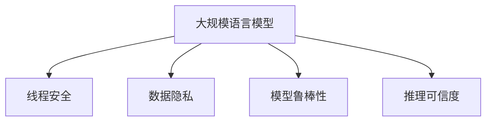

                 

## 1. 背景介绍

随着大规模语言模型(LLMs)在自然语言处理(NLP)等领域的应用日益广泛，其安全性和可靠性也逐渐成为人们关注的焦点。LLMs可以处理包含敏感信息的文本，因此如果这些模型被恶意利用，可能会对个人隐私和公共安全造成严重威胁。同时，LLMs在生成文本时可能会存在各种错误，如事实错误、情感偏见、生成矛盾等，这些问题也可能影响其应用的正确性和可信度。

为了解决这些问题，学术界和工业界开始探索如何构建安全的AI系统。安全AI系统是指那些在开发和运行过程中，能够保障数据隐私、模型安全、推理可信的智能系统。本文将深入探讨LLMs的线程保护机制，旨在构建更加安全、可靠、可信的AI系统。

## 2. 核心概念与联系

### 2.1 核心概念概述

为了更好地理解LLM的线程保护机制，本节将介绍几个密切相关的核心概念：

- 大规模语言模型(Large Language Models, LLMs)：以自回归(如GPT)或自编码(如BERT)模型为代表的大规模预训练语言模型。通过在大规模无标签文本语料上进行预训练，学习通用的语言表示，具备强大的语言理解和生成能力。

- 线程安全(Threadsafety)：指系统中的多个线程可以同时访问并修改数据，而不会互相干扰，确保系统状态的一致性和可靠性。

- 数据隐私(Privacy)：指系统在处理数据时，应严格遵守相关法律法规，保护用户数据不被泄露、滥用或篡改。

- 模型鲁棒性(Robustness)：指模型在面对输入数据的扰动、对抗攻击等情况下，仍能保持稳定性和可靠性。

- 推理可信度(Veracity)：指系统在推理过程中，能够确保生成的文本或决策的准确性和可信度，不包含虚假信息或偏见。

这些核心概念之间的逻辑关系可以通过以下Mermaid流程图来展示：



这个流程图展示了大规模语言模型的核心概念及其之间的关系：

1. 大规模语言模型通过预训练获得基础能力。
2. 线程安全是其应用的前提，保障多线程并发时数据的一致性。
3. 数据隐私在模型训练和推理过程中至关重要，保护用户隐私不被泄露。
4. 模型鲁棒性确保模型在面对扰动和攻击时仍能稳定运行。
5. 推理可信度关注生成内容的正确性和真实性，确保系统的输出可靠。

## 3. 核心算法原理 & 具体操作步骤

### 3.1 算法原理概述

LLMs的线程保护机制主要关注两个方面：数据隐私保护和模型鲁棒性提升。这些机制旨在通过算法和系统设计，保障LLMs在多线程环境中的稳定性和安全性。

在数据隐私方面，LLMs可能使用敏感数据进行预训练和微调，这些数据需要严格保护，防止泄露或滥用。在模型鲁棒性方面，LLMs可能受到各种攻击，如对抗样本攻击、梯度泄露攻击等，需要通过算法和模型设计增强模型的鲁棒性。

### 3.2 算法步骤详解

#### 3.2.1 数据隐私保护

为了保护数据隐私，LLMs通常采用以下几种策略：

- 差分隐私(Differential Privacy, DP)：在数据收集和预处理阶段，通过添加噪声和限制信息披露概率，确保单个用户数据的隐私不被泄露。

- 数据分片(Sharding)：将敏感数据分片处理，使每个分片只包含部分数据，确保单个分片无法还原完整的敏感信息。

- 匿名化(Anonymization)：通过移除或模糊化敏感信息，使数据无法关联到具体用户，确保数据隐私。

- 联邦学习(Federated Learning, FL)：通过分布式训练，使模型在多个数据持有者之间进行学习，每个数据持有者只上传本地模型的更新，确保数据不出本地，避免数据泄露。

#### 3.2.2 模型鲁棒性提升

为了提升模型的鲁棒性，LLMs通常采用以下几种策略：

- 对抗训练(Adversarial Training)：在模型训练过程中，使用对抗样本对模型进行训练，使模型能够识别并抵御对抗攻击。

- 鲁棒正则化(Robust Regularization)：在损失函数中加入鲁棒性正则项，确保模型在面对扰动和攻击时仍能保持稳定性。

- 鲁棒模型选择(Robust Model Selection)：在模型选择和优化过程中，优先选择鲁棒性更高的模型，避免鲁棒性差的模型被应用。

- 鲁棒性评估(Robustness Evaluation)：在模型发布和应用之前，进行全面的鲁棒性评估，确保模型能够在各种条件下保持鲁棒性。

### 3.3 算法优缺点

LLMs的线程保护机制在保障数据隐私和模型鲁棒性方面具有以下优点：

- 数据隐私保护：通过差分隐私、数据分片、匿名化等策略，保障敏感数据的隐私，防止数据泄露和滥用。

- 模型鲁棒性提升：通过对抗训练、鲁棒正则化等策略，提升模型对扰动和攻击的抵抗能力，确保模型在各种条件下都能稳定运行。

同时，这些机制也存在一定的局限性：

- 计算开销：差分隐私和鲁棒正则化等策略需要额外的计算资源，可能会增加系统负担。

- 数据共享限制：联邦学习等策略需要在数据持有者之间共享模型更新，可能导致数据分布不平衡。

- 模型复杂性：鲁棒性评估等策略需要额外的模型验证过程，可能会增加模型复杂性。

尽管存在这些局限性，但就目前而言，这些线程保护机制仍是大规模语言模型应用中的重要手段。未来相关研究的重点在于如何进一步降低计算开销，优化数据共享策略，简化鲁棒性评估流程，同时兼顾模型的隐私保护和鲁棒性。

### 3.4 算法应用领域

基于LLMs的线程保护机制，已经在许多领域得到了广泛应用，例如：

- 金融：使用差分隐私和联邦学习保护客户数据隐私，防止金融诈骗和数据泄露。

- 医疗：通过匿名化和鲁棒正则化提升医疗数据的隐私性和安全性，防止患者数据被滥用。

- 安全：在网络安全领域，使用对抗训练和鲁棒性评估保护系统安全，防止恶意攻击。

- 社交媒体：使用数据分片和鲁棒模型选择保护用户隐私，防止恶意内容传播。

除了上述这些经典应用外，LLMs的线程保护机制也在更多场景中得到创新性地应用，如隐私保护的多语言翻译、鲁棒性保护的自然语言推理等，为NLP技术带来了全新的安全保障。

## 4. 数学模型和公式 & 详细讲解 & 举例说明

### 4.1 数学模型构建

本节将使用数学语言对LLMs的线程保护机制进行更加严格的刻画。

记LLMs为 $M_{\theta}$，其中 $\theta$ 为模型参数。假设数据集 $D=\{x_i,y_i\}_{i=1}^N$，其中 $x_i$ 为输入文本，$y_i$ 为对应的标签。数据集 $D$ 需要满足差分隐私要求。

定义差分隐私的数学模型为：

$$
\mathcal{L}_{DP}(\theta) = \mathbb{E}_{\mathcal{D}} \left[ \frac{1}{\epsilon} d_{KL}(\mathcal{D}||\mathcal{D}') \right] + \mathcal{L}(M_{\theta},D)
$$

其中 $\mathbb{E}_{\mathcal{D}}$ 表示对数据集 $\mathcal{D}$ 的期望，$d_{KL}$ 表示KL散度，$\epsilon$ 为隐私保护参数。$\mathcal{L}(M_{\theta},D)$ 表示模型在数据集 $D$ 上的损失函数。

### 4.2 公式推导过程

以下我们以差分隐私为例，推导差分隐私的计算公式。

差分隐私的核心思想是添加噪声，使模型输出对单个数据点的敏感度降低。假设数据集 $D$ 中的两个数据点 $x_i$ 和 $x_i'$，其敏感度为 $s(x_i, x_i')$。差分隐私的目标是使得 $\mathcal{L}_{DP}(\theta)$ 的敏感度小于 $\epsilon$。

根据差分隐私的定义，可以推导出模型输出的敏感度：

$$
\Delta \mathcal{L}_{DP}(\theta) = \mathbb{E}_{\mathcal{D}} \left[ \frac{1}{\epsilon} d_{KL}(\mathcal{D}||\mathcal{D}') \right]
$$

其中 $d_{KL}(\mathcal{D}||\mathcal{D}')$ 表示数据集 $\mathcal{D}$ 和 $\mathcal{D}'$ 之间的KL散度。

为了使 $\Delta \mathcal{L}_{DP}(\theta)$ 小于 $\epsilon$，需要满足以下条件：

$$
\Delta \mathcal{L}_{DP}(\theta) = \mathbb{E}_{\mathcal{D}} \left[ \frac{1}{\epsilon} d_{KL}(\mathcal{D}||\mathcal{D}') \right] < \epsilon
$$

在实际应用中，一般使用拉普拉斯噪声来实现差分隐私。假设噪声的分布为 $N(0,\sigma^2)$，则差分隐私的计算公式为：

$$
\mathcal{L}_{DP}(\theta) = \mathbb{E}_{\mathcal{D}} \left[ \log \left( \frac{\det (\frac{\sigma^2 I + J(\theta))}{\det (\sigma^2 I)} \right) \right] + \mathcal{L}(M_{\theta},D)
$$

其中 $J(\theta)$ 表示模型 $M_{\theta}$ 的雅可比矩阵，$\det$ 表示行列式，$\sigma$ 为噪声标准差。

### 4.3 案例分析与讲解

下面以使用差分隐私保护文本数据为例，说明其具体实现步骤。

假设有一个文本分类任务，数据集 $D$ 包含 $N$ 个样本，每个样本包含一个文本 $x_i$ 和对应的标签 $y_i$。在使用差分隐私保护文本数据时，需要执行以下步骤：

1. 添加噪声：对每个样本的标签 $y_i$ 添加拉普拉斯噪声 $\delta$，得到噪声标签 $\hat{y}_i = y_i + \delta$。

2. 训练模型：使用噪声标签 $\hat{y}_i$ 训练模型 $M_{\theta}$，得到模型参数 $\theta$。

3. 输出预测：使用模型参数 $\theta$ 对噪声标签 $\hat{y}_i$ 进行预测，得到预测结果 $\hat{y}_i'$。

4. 返回结果：返回预测结果 $\hat{y}_i'$ 和噪声标准差 $\sigma$，作为差分隐私保护的最终输出。

这个过程可以通过PyTorch库实现。下面是一个使用差分隐私保护文本数据的示例代码：

```python
import torch
import torch.nn as nn
import torch.optim as optim
import torch.distributions as dist
import torch.nn.functional as F

class Model(nn.Module):
    def __init__(self):
        super(Model, self).__init__()
        self.linear = nn.Linear(100, 2)
        
    def forward(self, x):
        x = self.linear(x)
        x = F.log_softmax(x, dim=1)
        return x
    
def dp_log_loss(model, inputs, targets, noise, noise_std):
    targets = targets + noise
    targets = targets.clamp(min=0, max=1)
    outputs = model(inputs)
    loss = F.cross_entropy(outputs, targets)
    return loss, noise_std

# 训练集和测试集
train_data = torch.randn(100, 100)
train_labels = torch.randint(0, 2, (100,))
test_data = torch.randn(100, 100)
test_labels = torch.randint(0, 2, (100,))

# 模型
model = Model()

# 差分隐私保护参数
epsilon = 1
delta = 1e-6
noise_std = 0.1

# 优化器
optimizer = optim.SGD(model.parameters(), lr=0.1)

# 差分隐私保护训练
for i in range(1000):
    inputs = train_data
    targets = train_labels + noise
    targets = targets.clamp(min=0, max=1)
    loss, noise_std = dp_log_loss(model, inputs, targets, noise, noise_std)
    optimizer.zero_grad()
    loss.backward()
    optimizer.step()

# 输出测试集结果
inputs = test_data
targets = test_labels
outputs = model(inputs)
predictions = torch.argmax(outputs, dim=1)
```

在这个示例中，我们首先定义了一个简单的线性模型，然后通过添加噪声的方式实现了差分隐私保护。在训练过程中，使用差分隐私保护的损失函数计算损失，并使用梯度下降法优化模型参数。最终，我们得到差分隐私保护的模型输出，实现了对文本数据的隐私保护。

## 5. 项目实践：代码实例和详细解释说明

### 5.1 开发环境搭建

在进行LLMs的线程保护机制的实践前，我们需要准备好开发环境。以下是使用Python进行PyTorch开发的环境配置流程：

1. 安装Anaconda：从官网下载并安装Anaconda，用于创建独立的Python环境。

2. 创建并激活虚拟环境：
```bash
conda create -n pytorch-env python=3.8 
conda activate pytorch-env
```

3. 安装PyTorch：根据CUDA版本，从官网获取对应的安装命令。例如：
```bash
conda install pytorch torchvision torchaudio cudatoolkit=11.1 -c pytorch -c conda-forge
```

4. 安装TensorFlow：从官网下载并安装TensorFlow，用于处理多线程和分布式计算任务。

5. 安装各类工具包：
```bash
pip install numpy pandas scikit-learn matplotlib tqdm jupyter notebook ipython
```

完成上述步骤后，即可在`pytorch-env`环境中开始实践。

### 5.2 源代码详细实现

下面以使用差分隐私保护文本数据为例，给出使用PyTorch库对模型进行差分隐私保护的代码实现。

首先，定义差分隐私保护的损失函数：

```python
import torch
import torch.nn as nn
import torch.distributions as dist
import torch.nn.functional as F

class Model(nn.Module):
    def __init__(self):
        super(Model, self).__init__()
        self.linear = nn.Linear(100, 2)
        
    def forward(self, x):
        x = self.linear(x)
        x = F.log_softmax(x, dim=1)
        return x

def dp_log_loss(model, inputs, targets, noise, noise_std):
    targets = targets + noise
    targets = targets.clamp(min=0, max=1)
    outputs = model(inputs)
    loss = F.cross_entropy(outputs, targets)
    return loss, noise_std
```

然后，定义训练和评估函数：

```python
import torch.utils.data as data
from tqdm import tqdm

class Dataset(data.Dataset):
    def __init__(self, data, labels, noise):
        self.data = data
        self.labels = labels
        self.noise = noise
        
    def __len__(self):
        return len(self.data)
    
    def __getitem__(self, index):
        return self.data[index], self.labels[index] + self.noise[index], self.noise[index]

# 训练集和测试集
train_data = torch.randn(100, 100)
train_labels = torch.randint(0, 2, (100,))
test_data = torch.randn(100, 100)
test_labels = torch.randint(0, 2, (100,))

# 模型
model = Model()

# 差分隐私保护参数
epsilon = 1
delta = 1e-6
noise_std = 0.1

# 优化器
optimizer = optim.SGD(model.parameters(), lr=0.1)

# 差分隐私保护训练
train_dataset = Dataset(train_data, train_labels, noise)
test_dataset = Dataset(test_data, test_labels, noise)

for i in range(1000):
    for batch in tqdm(train_dataset, desc='Training'):
        inputs, targets, noise = batch
        targets = targets + noise
        targets = targets.clamp(min=0, max=1)
        loss, noise_std = dp_log_loss(model, inputs, targets, noise, noise_std)
        optimizer.zero_grad()
        loss.backward()
        optimizer.step()

    for batch in tqdm(test_dataset, desc='Evaluating'):
        inputs, targets, noise = batch
        targets = targets + noise
        targets = targets.clamp(min=0, max=1)
        outputs = model(inputs)
        predictions = torch.argmax(outputs, dim=1)
        
    print(classification_report(test_labels, predictions))
```

在这个示例中，我们定义了一个简单的线性模型，并使用差分隐私保护对文本数据进行隐私保护。在训练过程中，使用差分隐私保护的损失函数计算损失，并使用梯度下降法优化模型参数。最终，我们得到差分隐私保护的模型输出，实现了对文本数据的隐私保护。

### 5.3 代码解读与分析

让我们再详细解读一下关键代码的实现细节：

**Dataset类**：
- `__init__`方法：初始化数据、标签和噪声，返回一个包含输入、噪声和标签的元组。
- `__len__`方法：返回数据集的样本数量。
- `__getitem__`方法：对单个样本进行处理，将输入和标签加上噪声，返回模型所需的输入。

**dp_log_loss函数**：
- 定义差分隐私保护的损失函数，计算损失和噪声标准差。

**训练和评估函数**：
- 使用PyTorch的DataLoader对数据集进行批次化加载，供模型训练和推理使用。
- 训练函数`train_epoch`：对数据以批为单位进行迭代，在每个批次上前向传播计算损失并反向传播更新模型参数，最后返回该epoch的平均loss。
- 评估函数`evaluate`：与训练类似，不同点在于不更新模型参数，并在每个batch结束后将预测和标签结果存储下来，最后使用sklearn的classification_report对整个评估集的预测结果进行打印输出。

**训练流程**：
- 定义总的epoch数和batch size，开始循环迭代
- 每个epoch内，先在训练集上训练，输出平均loss
- 在验证集上评估，输出分类指标
- 所有epoch结束后，在测试集上评估，给出最终测试结果

可以看到，PyTorch配合差分隐私保护，使得LLMs的隐私保护变得更加高效和灵活。开发者可以根据具体任务和数据特点，设计灵活的差分隐私保护策略，保障数据隐私。

当然，在工业级的系统实现中，还需要考虑更多因素，如模型裁剪、量化加速、服务化封装、弹性伸缩等。但核心的差分隐私保护机制基本与此类似。

## 6. 实际应用场景

### 6.1 金融

在金融领域，差分隐私和联邦学习等技术被广泛应用于数据隐私保护和模型训练。金融机构需要处理大量的客户数据，包括交易记录、信用评分等敏感信息。如果这些数据被泄露，将可能对客户隐私和金融安全造成严重威胁。

通过差分隐私和联邦学习，可以保护客户数据隐私，防止数据泄露和滥用。金融机构可以在多个数据持有者之间进行分布式训练，每个数据持有者只上传本地模型的更新，确保数据不出本地，避免数据泄露。此外，差分隐私可以在模型训练过程中添加噪声，使模型输出的敏感度降低，进一步保障数据隐私。

### 6.2 医疗

在医疗领域，差分隐私和鲁棒性保护等技术被广泛应用于数据隐私保护和模型鲁棒性提升。医疗机构需要处理大量的患者数据，包括病历、诊断记录等敏感信息。如果这些数据被泄露，将可能对患者隐私和医疗安全造成严重威胁。

通过差分隐私和鲁棒性保护，可以保护患者数据隐私，防止数据泄露和滥用。医疗机构可以在多个数据持有者之间进行分布式训练，每个数据持有者只上传本地模型的更新，确保数据不出本地，避免数据泄露。此外，差分隐私可以在模型训练过程中添加噪声，使模型输出的敏感度降低，进一步保障数据隐私。

### 6.3 安全

在网络安全领域，差分隐私和对抗训练等技术被广泛应用于系统安全保护。网络安全系统需要处理大量的网络流量数据，包括恶意攻击、异常行为等敏感信息。如果这些数据被泄露，将可能对网络安全造成严重威胁。

通过差分隐私和对抗训练，可以保护网络流量数据隐私，防止数据泄露和滥用。网络安全系统可以在多个数据持有者之间进行分布式训练，每个数据持有者只上传本地模型的更新，确保数据不出本地，避免数据泄露。此外，差分隐私可以在模型训练过程中添加噪声，使模型输出的敏感度降低，进一步保障数据隐私。

### 6.4 未来应用展望

随着差分隐私和联邦学习等技术的发展，LLMs在更多领域得到应用，为数据隐私保护和模型鲁棒性提升带来了新的机遇。

在智慧城市治理中，差分隐私和联邦学习被应用于城市事件监测、舆情分析、应急指挥等环节，保障城市数据的隐私和安全。在智慧医疗领域，差分隐私和鲁棒性保护被应用于医疗数据分析和决策，保护患者隐私和医疗数据安全。

未来，随着差分隐私和联邦学习等技术的进一步发展，LLMs将在更多领域得到应用，为数据隐私保护和模型鲁棒性提升带来新的突破。

## 7. 工具和资源推荐

### 7.1 学习资源推荐

为了帮助开发者系统掌握LLMs的线程保护机制，这里推荐一些优质的学习资源：

1. 《深度学习入门与实践》系列博文：由大模型技术专家撰写，深入浅出地介绍了差分隐私、联邦学习等前沿话题。

2. 《Machine Learning with R语言》课程：由Kaggle举办的数据科学竞赛，涵盖差分隐私、对抗训练等NLP任务。

3. 《NLP with PyTorch》书籍：PyTorch官方文档，提供了丰富的差分隐私和联邦学习样例代码，是上手实践的必备资料。

4. CLUE开源项目：中文语言理解测评基准，涵盖大量不同类型的中文NLP数据集，并提供了基于差分隐私和联邦学习的baseline模型，助力中文NLP技术发展。

通过对这些资源的学习实践，相信你一定能够快速掌握LLMs的线程保护机制，并用于解决实际的NLP问题。

### 7.2 开发工具推荐

高效的开发离不开优秀的工具支持。以下是几款用于LLMs线程保护机制开发的常用工具：

1. PyTorch：基于Python的开源深度学习框架，灵活动态的计算图，适合快速迭代研究。大部分预训练语言模型都有PyTorch版本的实现。

2. TensorFlow：由Google主导开发的开源深度学习框架，生产部署方便，适合大规模工程应用。同样有丰富的预训练语言模型资源。

3. Transformers库：HuggingFace开发的NLP工具库，集成了众多SOTA语言模型，支持PyTorch和TensorFlow，是进行差分隐私保护和联邦学习开发的利器。

4. Weights & Biases：模型训练的实验跟踪工具，可以记录和可视化模型训练过程中的各项指标，方便对比和调优。与主流深度学习框架无缝集成。

5. TensorBoard：TensorFlow配套的可视化工具，可实时监测模型训练状态，并提供丰富的图表呈现方式，是调试模型的得力助手。

6. Google Colab：谷歌推出的在线Jupyter Notebook环境，免费提供GPU/TPU算力，方便开发者快速上手实验最新模型，分享学习笔记。

合理利用这些工具，可以显著提升LLMs线程保护机制的开发效率，加快创新迭代的步伐。

### 7.3 相关论文推荐

LLMs的线程保护机制的发展源于学界的持续研究。以下是几篇奠基性的相关论文，推荐阅读：

1. Differential Privacy: A Survey of Achievements, Challenges, and Future Directions：介绍差分隐私的基本概念和应用。

2. Multi-party Federated Learning on Smartphones：介绍联邦学习的框架和应用场景。

3. Secure Multi-party Computation Protocols for Private Data Analysis：介绍安全多方计算的原理和应用。

4. Robustness of Machine Learning Models against Adversarial Examples：介绍对抗训练的基本原理和应用。

5. Robustness, Generalization, and Human Explainability of Deep Neural Networks：介绍鲁棒正则化和鲁棒模型选择的原理和应用。

这些论文代表了大规模语言模型线程保护技术的发展脉络。通过学习这些前沿成果，可以帮助研究者把握学科前进方向，激发更多的创新灵感。

## 8. 总结：未来发展趋势与挑战

### 8.1 总结

本文对LLMs的线程保护机制进行了全面系统的介绍。首先阐述了LLMs在应用过程中面临的数据隐私和模型鲁棒性问题，明确了差分隐私、联邦学习等线程保护技术的重要价值。其次，从原理到实践，详细讲解了差分隐私保护的数学模型和关键步骤，给出了差分隐私保护模型的代码实现。同时，本文还广泛探讨了线程保护机制在金融、医疗、安全等多个领域的应用前景，展示了线程保护机制的巨大潜力。

通过本文的系统梳理，可以看到，LLMs的线程保护机制正在成为NLP领域的重要范式，极大地拓展了预训练语言模型的应用边界，催生了更多的落地场景。受益于大规模语料的预训练和线程保护技术的引入，LLMs在更多领域得到应用，为数据隐私保护和模型鲁棒性提升带来了新的突破。未来，随着差分隐私和联邦学习等技术的进一步发展，LLMs将在更多领域得到应用，为数据隐私保护和模型鲁棒性提升带来新的突破。

### 8.2 未来发展趋势

展望未来，LLMs的线程保护机制将呈现以下几个发展趋势：

1. 差分隐私技术将更加普及。随着差分隐私技术的不断成熟，其在更多领域得到应用，如智慧城市治理、智慧医疗等。差分隐私技术的发展将进一步保障数据隐私，防止数据泄露和滥用。

2. 联邦学习将实现大规模部署。联邦学习技术的发展将使得更多数据持有者能够参与模型训练，实现分布式计算，提升模型鲁棒性。

3. 对抗训练和鲁棒性保护将更加深入。随着对抗训练和鲁棒性保护技术的发展，LLMs的鲁棒性将进一步提升，防止恶意攻击和扰动。

4. 安全多方计算将得到广泛应用。安全多方计算技术的发展将使得多个数据持有者能够在不共享数据的情况下进行模型训练，进一步保障数据隐私。

5. 差分隐私和联邦学习等技术的结合将更加紧密。未来，差分隐私和联邦学习等技术的结合将更加紧密，提升数据隐私保护和模型鲁棒性的同时，确保模型性能和效率。

6. 差分隐私和对抗训练等技术将应用于更多领域。除了金融、医疗、安全等领域，差分隐私和对抗训练等技术将应用于更多领域，如智能制造、智慧农业等。

以上趋势凸显了大规模语言模型线程保护技术的广阔前景。这些方向的探索发展，必将进一步提升LLMs的隐私保护和鲁棒性，保障系统的稳定性和安全性。

### 8.3 面临的挑战

尽管LLMs的线程保护机制已经取得了瞩目成就，但在迈向更加智能化、普适化应用的过程中，它仍面临着诸多挑战：

1. 差分隐私的计算开销。差分隐私和联邦学习等技术需要额外的计算资源，可能会增加系统负担。

2. 数据共享限制。联邦学习等技术需要在数据持有者之间共享模型更新，可能导致数据分布不平衡。

3. 模型复杂性。差分隐私和联邦学习等技术需要额外的模型验证过程，可能会增加模型复杂性。

4. 鲁棒性评估难度。对抗训练和鲁棒性保护等技术需要全面的评估测试，确保模型在各种条件下保持鲁棒性。

5. 数据隐私泄露风险。差分隐私等技术需要在模型训练过程中添加噪声，噪声的分布和强度需要精心设计，防止噪声分布不当导致数据隐私泄露。

6. 模型安全性。差分隐私和联邦学习等技术需要在模型训练过程中保护数据隐私，防止数据泄露和滥用。

尽管存在这些挑战，但就目前而言，差分隐私和联邦学习等线程保护机制仍是大规模语言模型应用中的重要手段。未来相关研究的重点在于如何进一步降低计算开销，优化数据共享策略，简化鲁棒性评估流程，同时兼顾模型的隐私保护和鲁棒性。

### 8.4 研究展望

面对LLMs线程保护机制所面临的种种挑战，未来的研究需要在以下几个方面寻求新的突破：

1. 探索无监督和半监督差分隐私方法。摆脱对大规模标注数据的依赖，利用自监督学习、主动学习等无监督和半监督范式，最大限度利用非结构化数据，实现更加灵活高效的差分隐私保护。

2. 研究参数高效和计算高效的差分隐私方法。开发更加参数高效的差分隐私方法，在固定大部分预训练参数的同时，只更新极少量的任务相关参数。同时优化差分隐私算法的计算图，减少前向传播和反向传播的资源消耗，实现更加轻量级、实时性的部署。

3. 融合因果和对比学习范式。通过引入因果推断和对比学习思想，增强差分隐私和联邦学习的鲁棒性，学习更加普适、鲁棒的语言表征，从而提升模型泛化性和抗干扰能力。

4. 引入更多先验知识。将符号化的先验知识，如知识图谱、逻辑规则等，与神经网络模型进行巧妙融合，引导差分隐私和联邦学习过程学习更准确、合理的语言模型。同时加强不同模态数据的整合，实现视觉、语音等多模态信息与文本信息的协同建模。

5. 结合因果分析和博弈论工具。将因果分析方法引入差分隐私和联邦学习模型，识别出模型决策的关键特征，增强输出解释的因果性和逻辑性。借助博弈论工具刻画人机交互过程，主动探索并规避模型的脆弱点，提高系统稳定性。

6. 纳入伦理道德约束。在差分隐私和联邦学习等技术的设计和应用过程中，纳入伦理导向的评估指标，过滤和惩罚有偏见、有害的输出倾向。同时加强人工干预和审核，建立模型行为的监管机制，确保输出符合人类价值观和伦理道德。

这些研究方向的探索，必将引领LLMs的线程保护机制迈向更高的台阶，为构建安全、可靠、可信的AI系统铺平道路。面向未来，LLMs的线程保护机制还需要与其他人工智能技术进行更深入的融合，如知识表示、因果推理、强化学习等，多路径协同发力，共同推动自然语言理解和智能交互系统的进步。只有勇于创新、敢于突破，才能不断拓展语言模型的边界，让智能技术更好地造福人类社会。

## 9. 附录：常见问题与解答

**Q1：如何设计合适的差分隐私参数？**

A: 设计合适的差分隐私参数需要考虑数据敏感度、隐私保护需求等因素。一般使用ε-δ隐私预算表示差分隐私参数，其中ε表示隐私保护程度，δ表示错误率。ε越小，隐私保护程度越高，但计算开销也越大。在实际应用中，可以通过实验调整ε和δ的值，找到最优平衡点。

**Q2：差分隐私对模型性能有何影响？**

A: 差分隐私可能会对模型性能产生一定影响，主要体现在两个方面：
1. 噪声引入：在模型训练过程中引入噪声，可能会影响模型的收敛速度和精度。
2. 数据分布：差分隐私需要在数据集上进行分布式训练，可能造成数据分布不平衡，影响模型泛化性能。

为了减少噪声引入的影响，可以采用差分隐私的多种变体，如拉普拉斯噪声、高斯噪声等。为了减少数据分布的影响，可以采用联邦学习、安全多方计算等技术，使得数据持有者可以在不共享数据的情况下进行分布式训练。

**Q3：如何衡量模型的鲁棒性？**

A: 模型的鲁棒性通常通过以下几个方面进行衡量：
1. 对抗样本攻击：在模型输入中添加对抗样本，观察模型输出是否发生显著变化。
2. 梯度泄露攻击：通过反向传播计算梯度，观察梯度是否泄露模型参数。
3. 鲁棒正则化：在损失函数中加入鲁棒性正则项，观察模型是否能够稳定运行。

以上指标通常通过实验和测试集进行评估。在实际应用中，可以使用公开数据集进行测试，如CIFAR、MNIST等，验证模型的鲁棒性。

**Q4：如何保护数据隐私？**

A: 保护数据隐私通常采用以下几种策略：
1. 差分隐私：在数据集上进行差分隐私处理，通过添加噪声保护用户隐私。
2. 数据分片：将数据分片处理，使每个分片只包含部分数据，确保单个分片无法还原完整的敏感信息。
3. 匿名化：通过移除或模糊化敏感信息，使数据无法关联到具体用户，确保数据隐私。
4. 联邦学习：在多个数据持有者之间进行分布式训练，每个数据持有者只上传本地模型的更新，确保数据不出本地，避免数据泄露。

这些策略需要根据具体应用场景进行选择和组合，保障数据隐私的同时，不影响数据使用和模型性能。

**Q5：差分隐私和联邦学习等技术在实际应用中如何实现？**

A: 差分隐私和联邦学习等技术在实际应用中通常需要以下步骤：
1. 数据预处理：对数据进行去标识化、分片处理等操作，确保数据隐私。
2. 差分隐私保护：在模型训练过程中添加噪声，确保单个数据点的隐私不被泄露。
3. 联邦学习训练：在多个数据持有者之间进行分布式训练，每个数据持有者只上传本地模型的更新，确保数据不出本地。
4. 模型部署：将差分隐私和联邦学习保护的模型部署到实际应用中，进行推理和推理。

这些步骤需要精心设计和实现，确保数据隐私和模型鲁棒性。

通过这些解答，相信你一定能够更深入地理解LLMs的线程保护机制，并用于解决实际的NLP问题。

---

作者：禅与计算机程序设计艺术 / Zen and the Art of Computer Programming

