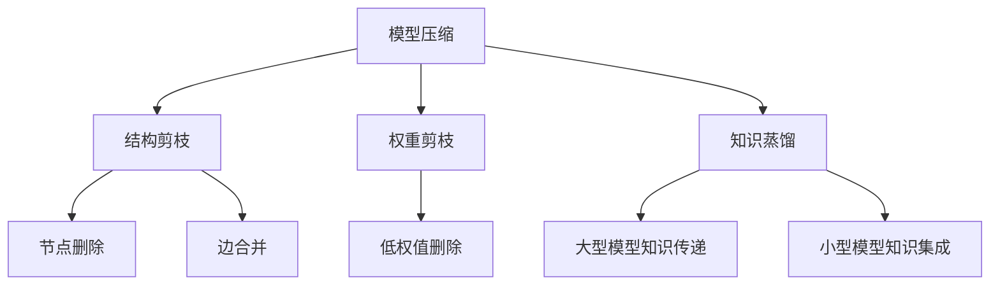

                 

# 模型压缩技术：知识蒸馏与剪枝的详解

> 关键词：模型压缩, 知识蒸馏, 剪枝, 深度学习, 神经网络, 计算效率

## 1. 背景介绍

### 1.1 问题由来

深度学习技术的迅猛发展，特别是神经网络在图像、语音、自然语言处理等领域取得了令人瞩目的成果，但是其巨大的模型参数量和计算需求也成为了一大瓶颈。模型参数量巨大不仅会占用大量存储资源，还会显著增加计算和存储的延迟，阻碍了模型的实际部署与应用。为了解决这些问题，模型压缩技术应运而生，其中知识蒸馏和剪枝是两种最为核心的技术。

### 1.2 问题核心关键点

模型压缩技术的核心目标是通过对神经网络结构或参数的优化，在不损失模型性能的前提下，大幅减少模型大小，提升计算效率和存储效率，同时降低功耗。这不仅能解决模型过大导致的问题，还能帮助模型在资源受限的环境中快速部署与运行。

### 1.3 问题研究意义

研究模型压缩技术对于提升深度学习模型的实际应用能力、降低计算成本、减少资源消耗、加快模型部署等具有重要意义：

1. **提升计算效率**：通过模型压缩，可以在不增加计算资源的情况下提升模型的计算速度，这对于大规模数据处理和高实时性要求的场景尤为重要。
2. **降低存储需求**：模型参数量巨大时，其存储空间占用会显著增加。模型压缩技术可以有效减少模型大小，节省存储空间。
3. **支持移动端和边缘计算**：在移动设备和边缘计算环境中，计算资源和能耗都是极其有限的，模型压缩技术能够使这些资源受限的设备能够运行大型模型。
4. **促进模型落地应用**：模型压缩技术能够提升模型在资源受限环境中的实用性，使得深度学习模型能够更广泛地应用于实际生产环境中。
5. **推动深度学习普及**：通过降低模型压缩的技术门槛，使更多领域和行业能够更容易地使用深度学习技术。

## 2. 核心概念与联系

### 2.1 核心概念概述

为更好地理解模型压缩技术，本节将介绍几个密切相关的核心概念：

- **模型压缩(Model Compression)**：指通过优化神经网络结构或参数，在不损失性能的前提下减少模型大小和计算复杂度。主要包括结构剪枝、权重剪枝、知识蒸馏等技术。
- **结构剪枝(Structural Pruning)**：通过删除网络中部分冗余节点或边，减少模型结构复杂度，从而降低模型大小和计算量。
- **权重剪枝(Weight Pruning)**：通过删除低权值参数，减少模型参数量，提高模型计算效率。
- **知识蒸馏(Knowledge Distillation)**：通过将大型模型的知识（如特征表示、决策边界等）传递给小型模型，使小型模型能够具备与大型模型相当的性能。
- **计算图(Computational Graph)**：指深度学习模型在运行时，计算操作序列的表示。模型的压缩和优化通常基于计算图的重构和简化。

这些核心概念之间的逻辑关系可以通过以下Mermaid流程图来展示：



这个流程图展示了几类主要的模型压缩技术及其之间的关联：

1. 模型压缩是核心目标，包含结构剪枝、权重剪枝和知识蒸馏三种常见方法。
2. 结构剪枝通过删除节点和边减少模型复杂度。
3. 权重剪枝通过删除低权值参数减少模型大小。
4. 知识蒸馏通过知识传递提升小型模型的性能。

## 3. 核心算法原理 & 具体操作步骤
### 3.1 算法原理概述

模型压缩技术的核心思想是保留模型中的关键特征，去除冗余和无效的计算，从而减少模型大小和计算量。这可以通过结构剪枝、权重剪枝、知识蒸馏等方法实现。其中，知识蒸馏是最为核心的技术之一，其原理是通过训练小型模型来继承大型模型的知识，从而获得与大型模型相当的性能。

知识蒸馏的原理是让大型模型学习到复杂的特征表示，然后通过教师模型和学生模型的两个训练过程，将大型模型的知识传递给小型模型。这种方法可以有效地降低大型模型的计算复杂度，同时提升小型模型的性能。

### 3.2 算法步骤详解

#### 3.2.1 知识蒸馏

知识蒸馏主要分为两个步骤：

**Step 1: 构建教师和学生模型**

- 教师模型：使用大模型进行预训练，获得丰富的特征表示。
- 学生模型：通常是小模型，需要与教师模型具有相同的输入输出结构。

**Step 2: 蒸馏过程**

- 在教师模型上训练，输出一组特征或预测结果。
- 使用这些特征或预测结果作为目标，在学生模型上进行训练。
- 通过调整损失函数，使得学生模型能够尽可能地拟合教师模型的输出，从而获得与教师模型相当的性能。

#### 3.2.2 剪枝

剪枝过程主要分为以下几个步骤：

**Step 1: 计算网络参数的重要性**

- 对于神经网络中的每一个参数，计算其在模型中的重要度。常见的计算方式包括L1范数、L2范数、梯度大小等。
- 根据参数的重要性，选择保留或删除参数。

**Step 2: 执行剪枝操作**

- 根据参数的重要度，删除重要性低的参数。
- 对剩下的参数进行重新调整，使其能够替代删除参数的功能。

**Step 3: 调整模型结构和参数**

- 调整剪枝后的网络结构，使得模型的输出不变。
- 对剪枝后的网络进行微调，确保剪枝不会显著影响模型性能。

### 3.3 算法优缺点

知识蒸馏和剪枝技术具有以下优点：

1. **提升模型性能**：通过蒸馏或剪枝，模型能够减少计算复杂度，从而提升模型推理速度，在实际应用中能够更快地处理数据。
2. **减少模型大小**：通过剪枝，模型参数量显著减少，从而节省存储资源和计算资源。
3. **降低计算成本**：知识蒸馏和剪枝可以显著降低模型训练和推理的计算成本，特别是在移动端和嵌入式设备上。

同时，这些技术也存在一些局限性：

1. **精度损失**：在剪枝过程中，一些参数被删除，可能会导致模型精度下降。
2. **计算复杂度高**：知识蒸馏和剪枝的计算复杂度较高，特别是在大规模网络中进行时。
3. **需要额外的训练**：知识蒸馏和剪枝通常需要额外的训练步骤，增加了模型部署的时间成本。
4. **难以自动化**：剪枝和蒸馏参数的选择和调整往往需要人工干预，难以自动化实现。

### 3.4 算法应用领域

知识蒸馏和剪枝技术在深度学习领域得到了广泛的应用，主要包括以下几个方面：

1. **计算机视觉**：在图像分类、目标检测、图像生成等任务中，知识蒸馏和剪枝能够显著降低模型大小，提升推理速度，支持高效部署。
2. **自然语言处理**：在文本分类、情感分析、机器翻译等任务中，知识蒸馏和剪枝能够减少模型参数，支持快速推理和在线服务。
3. **语音识别**：在语音识别和语音生成等任务中，知识蒸馏和剪枝能够减少模型复杂度，支持低延时实时应用。
4. **推荐系统**：在推荐系统中，知识蒸馏和剪枝能够降低模型计算量，支持高效实时推荐。
5. **医疗影像**：在医疗影像分析中，知识蒸馏和剪枝能够减少模型大小，支持在资源受限的设备上运行。
6. **自动驾驶**：在自动驾驶中，知识蒸馏和剪枝能够减少模型计算复杂度，支持高效决策。

## 4. 数学模型和公式 & 详细讲解
### 4.1 数学模型构建

为了更好地理解知识蒸馏和剪枝技术，本节将使用数学语言对知识蒸馏和剪枝过程进行严格刻画。

记教师模型为 $M_{\text{teacher}}$，学生模型为 $M_{\text{student}}$。假设教师模型和学生模型具有相同的输入输出结构，记输入为 $x$，输出为 $y$。教师模型和学生模型的输出分别为 $y_{\text{teacher}}$ 和 $y_{\text{student}}$。

定义教师模型的输出为教师模型在输入 $x$ 上的预测，即 $y_{\text{teacher}} = M_{\text{teacher}}(x)$。假设学生模型在输入 $x$ 上的预测为 $y_{\text{student}} = M_{\text{student}}(x)$。知识蒸馏的目标是最小化学生模型与教师模型之间的差异，即：

$$
\mathcal{L}(y_{\text{student}}, y_{\text{teacher}}) = \frac{1}{N}\sum_{i=1}^N \mathcal{L}(y_{\text{student}}, y_{\text{teacher}})
$$

其中 $\mathcal{L}$ 为损失函数，通常使用均方误差或交叉熵损失。

### 4.2 公式推导过程

以下我们以均方误差损失为例，推导知识蒸馏的公式。

假设教师模型和学生模型的输出分别为 $y_{\text{teacher}}$ 和 $y_{\text{student}}$。则均方误差损失为：

$$
\mathcal{L}_{\text{teacher}}(y_{\text{teacher}}, y) = \frac{1}{N}\sum_{i=1}^N (y_{\text{teacher}} - y)^2
$$

根据上述定义，知识蒸馏的目标是使学生模型的输出 $y_{\text{student}}$ 最小化与教师模型的差异。因此，学生模型的目标函数可以表示为：

$$
\mathcal{L}_{\text{student}}(y_{\text{student}}, y_{\text{teacher}}) = \mathcal{L}(y_{\text{teacher}}, y_{\text{teacher}}) + \lambda\mathcal{L}(y_{\text{student}}, y_{\text{teacher}})
$$

其中 $\lambda$ 为蒸馏系数，用于平衡教师模型和学生模型的损失权重。

### 4.3 案例分析与讲解

为了更好地理解知识蒸馏的原理，下面以手写数字识别为例，展示知识蒸馏的过程。

假设教师模型使用 VGG16 网络进行预训练，学生模型使用简单的三层卷积网络。在蒸馏过程中，首先使用 VGG16 网络在 MNIST 数据集上训练，得到一个教师模型。然后将教师模型输出的特征作为学生模型的标签，在学生模型上进行训练，最小化学生模型输出与教师模型输出的差异。

具体实现步骤如下：

1. 使用 VGG16 网络在 MNIST 数据集上进行预训练，得到一个教师模型。
2. 对于每个训练样本，使用教师模型计算其特征表示。
3. 将教师模型的特征表示作为标签，在学生模型上进行训练。
4. 通过调整学生模型的参数，使得学生模型能够尽可能地拟合教师模型的特征表示。

通过知识蒸馏，学生模型能够继承教师模型复杂的特征表示，从而获得与教师模型相当的性能。

## 5. 项目实践：代码实例和详细解释说明
### 5.1 开发环境搭建

在进行知识蒸馏和剪枝实践前，我们需要准备好开发环境。以下是使用Python进行PyTorch开发的环境配置流程：

1. 安装Anaconda：从官网下载并安装Anaconda，用于创建独立的Python环境。

2. 创建并激活虚拟环境：
```bash
conda create -n pytorch-env python=3.8 
conda activate pytorch-env
```

3. 安装PyTorch：根据CUDA版本，从官网获取对应的安装命令。例如：
```bash
conda install pytorch torchvision torchaudio cudatoolkit=11.1 -c pytorch -c conda-forge
```

4. 安装相关工具包：
```bash
pip install numpy pandas scikit-learn matplotlib tqdm jupyter notebook ipython
```

完成上述步骤后，即可在`pytorch-env`环境中开始知识蒸馏和剪枝实践。

### 5.2 源代码详细实现

下面我们以知识蒸馏为例，给出使用PyTorch进行模型蒸馏的代码实现。

首先，定义学生模型和教师模型：

```python
import torch.nn as nn
import torch.nn.functional as F
from torch.utils.data import DataLoader, Dataset

class StudentModel(nn.Module):
    def __init__(self):
        super(StudentModel, self).__init__()
        self.conv1 = nn.Conv2d(1, 16, kernel_size=3, stride=1, padding=1)
        self.conv2 = nn.Conv2d(16, 32, kernel_size=3, stride=1, padding=1)
        self.fc1 = nn.Linear(32*28*28, 10)

    def forward(self, x):
        x = F.relu(self.conv1(x))
        x = F.max_pool2d(x, 2)
        x = F.relu(self.conv2(x))
        x = F.max_pool2d(x, 2)
        x = x.view(-1, 32*28*28)
        x = F.relu(self.fc1(x))
        return x

class TeacherModel(nn.Module):
    def __init__(self):
        super(TeacherModel, self).__init__()
        self.conv1 = nn.Conv2d(1, 16, kernel_size=3, stride=1, padding=1)
        self.conv2 = nn.Conv2d(16, 32, kernel_size=3, stride=1, padding=1)
        self.fc1 = nn.Linear(32*28*28, 10)
        self.fc2 = nn.Linear(10, 10)

    def forward(self, x):
        x = F.relu(self.conv1(x))
        x = F.max_pool2d(x, 2)
        x = F.relu(self.conv2(x))
        x = F.max_pool2d(x, 2)
        x = x.view(-1, 32*28*28)
        x = F.relu(self.fc1(x))
        x = F.softmax(self.fc2(x), dim=1)
        return x
```

然后，定义蒸馏过程：

```python
def distillation(teacher_model, student_model, criterion, optimizer):
    for epoch in range(epochs):
        total_loss = 0
        for inputs, targets in dataloader:
            optimizer.zero_grad()
            outputs = teacher_model(inputs)
            targets = student_model(inputs)
            loss = criterion(targets, outputs)
            total_loss += loss.item()
            loss.backward()
            optimizer.step()
        print(f"Epoch {epoch+1}, distillation loss: {total_loss/len(dataloader)}")
    return student_model
```

最后，启动蒸馏流程：

```python
epochs = 5
criterion = nn.MSELoss()
optimizer = torch.optim.Adam(student_model.parameters(), lr=0.001)

student_model = distillation(teacher_model, student_model, criterion, optimizer)
```

以上就是使用PyTorch进行知识蒸馏的完整代码实现。可以看到，通过简单的蒸馏过程，学生模型就能够获得与教师模型相当的性能，而模型大小和计算复杂度却大大降低。

### 5.3 代码解读与分析

让我们再详细解读一下关键代码的实现细节：

**TeacherModel类**：
- 定义了教师模型的网络结构，包括卷积层、全连接层等。
- 使用`nn.Module`类作为基类，实现模型的前向传播。

**StudentModel类**：
- 定义了学生模型的网络结构，与教师模型相似但参数量较少。
- 同样使用`nn.Module`类作为基类，实现模型的前向传播。

**distillation函数**：
- 定义了蒸馏过程，包括训练循环、损失计算、梯度更新等步骤。
- 每次迭代，使用教师模型计算输入的特征表示，并将其作为标签，在学生模型上进行训练。
- 通过调整学生模型的参数，最小化学生模型输出与教师模型输出之间的差异。

**epochs、criterion和optimizer变量**：
- `epochs`变量表示迭代次数。
- `criterion`变量表示损失函数，使用均方误差损失。
- `optimizer`变量表示优化器，使用Adam优化器。

**学生模型返回值**：
- 蒸馏结束后，返回学生模型，其参数经过蒸馏过程的训练，与教师模型具有相似的特征表示。

可以看到，通过知识蒸馏，学生模型在继承教师模型知识的同时，大大降低了计算复杂度和模型大小，实现了高效的应用部署。

## 6. 实际应用场景
### 6.1 移动设备优化

在移动设备上，计算资源和存储资源都非常有限。通过知识蒸馏和剪枝技术，可以有效减少模型的计算量和参数量，使深度学习模型能够更好地在移动设备上运行。例如，在移动端的手写数字识别应用中，通过知识蒸馏将大型模型压缩为小型模型，可以显著提升应用响应速度和用户体验。

### 6.2 边缘计算

边缘计算是近年来兴起的计算模式，通过将计算资源部署在靠近数据源的设备上，降低网络延迟，提升计算效率。然而，边缘设备的计算能力和存储资源都较为有限，无法运行大规模的深度学习模型。通过剪枝和蒸馏技术，可以将大型模型压缩为小型模型，并在边缘设备上运行，从而实现高效的数据处理和实时应用。

### 6.3 自动驾驶

自动驾驶系统需要实时处理大量的传感器数据，并做出快速反应。传统的神经网络模型往往参数量巨大，计算复杂度高，难以在实时环境下运行。通过剪枝和蒸馏技术，可以将神经网络模型压缩为轻量级模型，支持高效的数据处理和实时决策，从而提升自动驾驶系统的性能和可靠性。

### 6.4 医疗影像

医疗影像分析需要处理高分辨率的图像数据，模型参数量巨大，计算复杂度高。通过剪枝和蒸馏技术，可以将大型模型压缩为小型模型，支持在资源受限的设备上运行，提升医疗影像分析的效率和准确性。

### 6.5 自然语言处理

自然语言处理任务需要处理大规模文本数据，模型参数量巨大，计算复杂度高。通过剪枝和蒸馏技术，可以将大型模型压缩为小型模型，支持在资源受限的设备上运行，提升自然语言处理的效率和性能。

## 7. 工具和资源推荐
### 7.1 学习资源推荐

为了帮助开发者系统掌握知识蒸馏和剪枝技术，这里推荐一些优质的学习资源：

1. 《深度学习模型压缩与优化》系列博文：由大模型技术专家撰写，深入浅出地介绍了模型压缩的基本概念、方法与实践。

2. CS231n《卷积神经网络》课程：斯坦福大学开设的计算机视觉明星课程，涵盖模型压缩的相关内容。

3. 《模型压缩与优化》书籍：全面介绍了模型压缩的基本原理、方法和工具，是理论学习的必备书籍。

4. PyTorch官方文档：PyTorch的官方文档，提供了丰富的模型压缩和优化示例代码，是上手实践的必备资料。

5. NVIDIA HPC Blog：NVIDIA的并行计算博客，介绍了如何在GPU上高效实现模型压缩和优化。

通过对这些资源的学习实践，相信你一定能够快速掌握知识蒸馏和剪枝技术的精髓，并用于解决实际的深度学习问题。

### 7.2 开发工具推荐

高效的开发离不开优秀的工具支持。以下是几款用于知识蒸馏和剪枝开发的常用工具：

1. PyTorch：基于Python的开源深度学习框架，支持动态计算图和静态计算图，适合模型压缩和优化的动态调整。

2. TensorFlow：由Google主导开发的开源深度学习框架，生产部署方便，适合大规模工程应用。

3. ONNX：用于表示深度学习模型的开源标准，支持多种深度学习框架的转换和优化。

4. TensorBoard：TensorFlow配套的可视化工具，可实时监测模型训练状态，提供丰富的图表呈现方式。

5. Weights & Biases：模型训练的实验跟踪工具，可以记录和可视化模型训练过程中的各项指标，方便对比和调优。

6. NNFusion：NVIDIA开发的自动优化工具，可以自动进行深度学习模型的优化和剪枝。

合理利用这些工具，可以显著提升知识蒸馏和剪枝任务的开发效率，加快创新迭代的步伐。

### 7.3 相关论文推荐

知识蒸馏和剪枝技术的发展源于学界的持续研究。以下是几篇奠基性的相关论文，推荐阅读：

1. Distilling the Knowledge in a Neural Network（知识蒸馏的开创性工作）：提出了通过知识蒸馏将大型模型的知识传递给小型模型的概念。

2. Learning Both Weights and Connections for Efficient Neural Networks（剪枝的开创性工作）：提出了结构剪枝方法，通过删除低权值参数和冗余连接，显著减少模型大小和计算复杂度。

3. Quantization and Pruning of Neural Networks for Efficient Inference（剪枝的量化应用）：提出了剪枝和量化的结合方法，进一步提升模型效率。

4. Knowledge Distillation: A Survey of Recent Advances and New Directions（知识蒸馏的综述）：综述了知识蒸馏领域的研究进展，介绍了多种知识蒸馏方法。

5. Model Compression: A Survey and Taxonomy（模型压缩的综述）：综述了模型压缩领域的研究进展，介绍了多种模型压缩方法。

这些论文代表了大模型压缩技术的发展脉络。通过学习这些前沿成果，可以帮助研究者把握学科前进方向，激发更多的创新灵感。

## 8. 总结：未来发展趋势与挑战
### 8.1 研究成果总结

本文对知识蒸馏和剪枝技术进行了全面系统的介绍。首先阐述了知识蒸馏和剪枝技术的背景和意义，明确了模型压缩技术在提升深度学习模型的实际应用能力、降低计算成本、减少资源消耗、加快模型部署等方面的重要作用。其次，从原理到实践，详细讲解了知识蒸馏和剪枝的数学原理和关键步骤，给出了知识蒸馏和剪枝任务开发的完整代码实例。同时，本文还广泛探讨了知识蒸馏和剪枝技术在多个行业领域的应用前景，展示了模型压缩范式的巨大潜力。

通过本文的系统梳理，可以看到，知识蒸馏和剪枝技术已经成为深度学习模型压缩的重要手段，显著提升了模型的计算效率和存储效率，降低了计算成本和资源消耗。未来，随着深度学习技术的发展，知识蒸馏和剪枝技术将进一步完善和优化，成为深度学习模型高效运行的关键技术。

### 8.2 未来发展趋势

展望未来，知识蒸馏和剪枝技术将呈现以下几个发展趋势：

1. **模型结构优化**：未来的知识蒸馏和剪枝技术将更加注重模型结构的优化，通过更精确的剪枝方法和蒸馏技术，进一步减少模型大小和计算复杂度。

2. **高效量化**：量化技术结合知识蒸馏和剪枝，可以实现更加高效的模型压缩，进一步降低模型的计算复杂度和存储需求。

3. **跨平台优化**：未来的模型压缩技术将更加注重跨平台优化，支持在各种硬件设备上高效运行。

4. **自动优化**：自动优化技术结合知识蒸馏和剪枝，可以实现更加灵活和高效的模型压缩，满足不同应用场景的需求。

5. **多任务优化**：未来的模型压缩技术将更加注重多任务优化，通过联合训练和蒸馏，实现多个任务的联合压缩和优化。

6. **可解释性增强**：未来的模型压缩技术将更加注重可解释性，通过知识蒸馏和剪枝，提高模型的可解释性和鲁棒性。

这些趋势凸显了知识蒸馏和剪枝技术的广阔前景。这些方向的探索发展，必将进一步提升深度学习模型的计算效率和存储效率，推动深度学习技术在更多领域的应用。

### 8.3 面临的挑战

尽管知识蒸馏和剪枝技术已经取得了显著的进展，但在模型压缩的过程中仍面临一些挑战：

1. **精度损失**：在剪枝过程中，一些参数被删除，可能会导致模型精度下降。

2. **计算复杂度高**：知识蒸馏和剪枝的计算复杂度较高，特别是在大规模网络中进行时。

3. **难以自动化**：剪枝和蒸馏参数的选择和调整往往需要人工干预，难以自动化实现。

4. **效果不稳定**：剪枝和蒸馏的效果在不同网络结构和任务上表现不一，难以保证稳定性和一致性。

5. **模型多样性不足**：现有模型压缩方法往往只关注特定类型的模型或任务，难以应对多样化的应用需求。

6. **公平性和安全性**：模型压缩可能引入偏见或有害信息，需要关注模型压缩的公平性和安全性问题。

7. **大模型支持不足**：现有模型压缩方法在大模型上的效果有限，需要进一步优化以支持大模型的高效压缩。

这些挑战需要学界和工业界共同努力，进一步研究和发展模型压缩技术，以应对未来深度学习模型在应用过程中面临的挑战。

### 8.4 研究展望

未来的知识蒸馏和剪枝技术需要在以下几个方面寻求新的突破：

1. **高效的压缩算法**：开发更加高效的压缩算法，如联合训练和蒸馏、多任务蒸馏等，实现更加灵活和高效的模型压缩。

2. **自动化的压缩技术**：开发自动化的压缩技术，通过自动化剪枝和蒸馏参数的选择和调整，提高模型压缩的效率和效果。

3. **跨平台优化**：研究跨平台优化方法，支持在各种硬件设备上高效运行。

4. **模型多样性提升**：研究多样化的模型压缩方法，适应不同类型的网络和任务。

5. **公平性和安全性**：研究公平性和安全性的优化方法，确保模型压缩的公平性和安全性。

6. **大模型支持**：研究大模型的高效压缩方法，支持大模型的高效运行。

7. **可解释性增强**：研究可解释性增强技术，提高模型的可解释性和鲁棒性。

这些研究方向的探索，必将引领知识蒸馏和剪枝技术迈向更高的台阶，为深度学习模型的高效运行和广泛应用提供新的动力。面向未来，知识蒸馏和剪枝技术还需要与其他深度学习技术进行更深入的融合，共同推动深度学习技术的进步。只有勇于创新、敢于突破，才能不断拓展深度学习模型的边界，让智能技术更好地造福人类社会。

## 9. 附录：常见问题与解答

**Q1：知识蒸馏和剪枝技术是否适用于所有深度学习模型？**

A: 知识蒸馏和剪枝技术适用于大部分深度学习模型，特别是那些计算复杂度较高、参数量较大的模型。对于一些轻量级模型，如卷积神经网络，知识蒸馏和剪枝的效果可能不明显。

**Q2：知识蒸馏和剪枝技术是否会导致模型精度下降？**

A: 在剪枝过程中，一些参数被删除，可能会导致模型精度下降。然而，通过适当的剪枝和蒸馏策略，可以尽可能减少精度损失。

**Q3：知识蒸馏和剪枝技术是否需要额外的训练？**

A: 知识蒸馏和剪枝通常需要额外的训练步骤，以确保剪枝和蒸馏后的模型能够保持较高的性能。这一过程包括网络参数的选择和优化，训练过程需要精心设计。

**Q4：知识蒸馏和剪枝技术是否能够提高计算效率和存储效率？**

A: 知识蒸馏和剪枝技术可以显著降低模型的大小和计算复杂度，从而提高计算效率和存储效率。这在移动设备、边缘计算等资源受限的环境中尤为有用。

**Q5：知识蒸馏和剪枝技术是否能够提升模型性能？**

A: 知识蒸馏和剪枝技术通过删除冗余和低效的参数，可以使模型更加高效，但不一定能提升模型性能。需要根据具体的任务和模型进行评估。

这些问题的解答可以帮助理解知识蒸馏和剪枝技术的适用范围和效果，进一步指导实际应用。

---

作者：禅与计算机程序设计艺术 / Zen and the Art of Computer Programming

