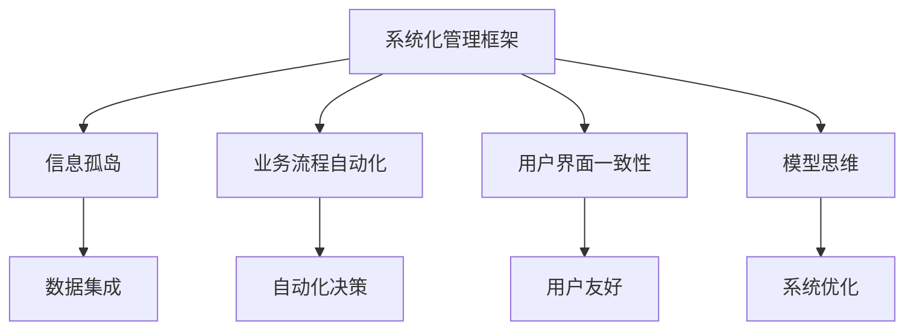

                 

## 1. 背景介绍

在现代企业中，信息技术的应用已经成为提升管理效率和业务能力的重要手段。然而，传统的技术实施往往聚焦于功能开发和系统部署，忽视了管理思维层面的深度整合。这种做法不仅增加了技术复杂性，还降低了系统的实际效用。本文将从模型思维的角度，探讨如何通过优化模型构建和管理方法，有效提升企业信息系统的管理效率。

### 1.1 问题由来
在过去十年中，企业信息系统（Enterprise Information System, EIS）的建设取得了显著进展，形成了从数据采集、处理、存储、分析到应用的完整闭环。然而，许多企业在应用这些系统时，面临以下问题：

- **数据孤岛现象**：由于各个信息系统之间缺乏数据共享和协同，导致数据重复存储、冗余管理，增加了维护和运营成本。
- **流程断裂**：企业业务流程在信息系统中断点较多，降低了流程的自动化程度和效率。
- **用户孤立**：不同信息系统之间的用户界面和操作方式不同，用户需要学习和适应，降低了系统的易用性。
- **管理瓶颈**：信息技术实施过程中，缺乏统一的管理和规划，导致系统实施周期长、成本高，未能达到预期效果。

### 1.2 问题核心关键点
这些问题归根结底是由于企业信息技术实施和管理过程中缺乏系统性和模型化思维导致的。为了从根本上解决这些问题，需要在系统设计和管理过程中引入模型思维，通过建模方法和工具，构建系统化的管理框架，提高系统集成度和运营效率。

## 2. 核心概念与联系

### 2.1 核心概念概述

为更好地理解模型思维在企业管理中的应用，本节将介绍几个密切相关的核心概念：

- **系统化管理框架**：通过系统化的建模和管理方法，构建企业信息系统的完整闭环，提升系统集成度和运营效率。
- **信息孤岛**：企业信息系统中数据、流程、用户界面等相互孤立的现象，导致系统效率低下。
- **业务流程自动化**：通过模型化方法，将企业业务流程自动化，减少人工干预，提升流程执行速度和准确性。
- **用户界面一致性**：通过统一的设计规范和标准，提高企业信息系统各模块的用户界面一致性，提升用户体验。
- **模型思维**：通过建模思维，从整体视角分析企业信息系统，识别核心问题，设计解决方案，实现系统高效管理。

这些核心概念之间的逻辑关系可以通过以下Mermaid流程图来展示：



这个流程图展示了大模型思维在企业管理中的应用框架：

1. 系统化管理框架通过建模方法，整合企业信息系统，打破信息孤岛。
2. 业务流程自动化和用户界面一致性提升系统集成度，提高用户体验。
3. 模型思维从整体视角分析问题，设计解决方案，提升系统管理效率。

## 3. 核心算法原理 & 具体操作步骤
### 3.1 算法原理概述

模型思维在企业管理中的应用，本质上是通过建模方法，将企业的业务流程、数据管理、用户界面等要素进行系统化集成，实现管理和运营的高效化。其核心思想是：通过构建系统化的管理模型，识别系统中的关键流程和数据点，设计自动化流程，提升系统集成度和运营效率。

### 3.2 算法步骤详解

模型思维在企业管理中的应用，通常包括以下几个关键步骤：

**Step 1: 系统现状调研**
- 对企业的信息系统进行现状调研，识别存在的各种问题，如数据孤岛、流程断裂、用户孤立等。
- 使用问卷、访谈等方式，收集员工和管理层对系统使用的反馈和建议。

**Step 2: 系统模型设计**
- 根据现状调研结果，设计企业信息系统的系统化管理模型，明确系统架构、数据流、业务流程等关键要素。
- 使用UML（统一建模语言）等建模工具，构建系统的UML图和数据模型。
- 确定数据存储和管理规范，设计数据集成方案。

**Step 3: 模型实现与优化**
- 根据系统模型设计，选择合适的技术和工具，实现系统集成和自动化流程。
- 使用大数据、人工智能等技术，对系统进行性能优化，提升数据处理和分析速度。
- 引入模型评估方法，定期对系统进行评估和优化。

**Step 4: 系统实施与培训**
- 制定系统实施计划，逐步推进系统的构建和部署。
- 对员工和管理层进行系统使用培训，确保其掌握新系统的操作和使用规范。
- 收集用户反馈，对系统进行迭代优化，直至满足业务需求。

### 3.3 算法优缺点

模型思维在企业管理中的应用，具有以下优点：

1. **系统集成度高**：通过系统化建模和管理，打破信息孤岛，提升系统集成度，减少冗余数据和重复管理。
2. **流程自动化**：通过模型化方法，将业务流程自动化，减少人工干预，提升流程执行速度和准确性。
3. **用户体验提升**：通过统一的设计规范和标准，提高用户界面一致性，提升用户体验。
4. **管理效率提升**：通过模型思维，从整体视角分析问题，设计解决方案，提升系统管理效率。

同时，该方法也存在一定的局限性：

1. **建模成本高**：系统化建模和管理需要耗费大量时间和资源，特别是在复杂的业务环境中。
2. **技术复杂度高**：建模过程中涉及大数据、人工智能等先进技术，对技术团队的要求较高。
3. **灵活性不足**：模型一旦设计完成，难以快速调整和优化，难以适应快速变化的市场需求。
4. **实施难度大**：系统实施涉及多部门、多层次的协同合作，协调难度大，实施周期长。

尽管存在这些局限性，但就目前而言，模型思维在企业管理中的应用已经成为一种趋势。未来相关研究的重点在于如何进一步降低建模成本，提高模型的灵活性，同时兼顾技术复杂性和实施难度。

### 3.4 算法应用领域

模型思维在企业管理中的应用，已经在多个领域取得了显著成效，例如：

- **供应链管理**：通过系统化建模和管理，优化供应链流程，提高供应链的协同效率。
- **客户关系管理（CRM）**：通过模型化方法，整合客户数据，提升客户服务质量和客户满意度。
- **人力资源管理**：通过模型思维，优化人力资源流程，提升招聘、培训、绩效管理等环节的效率。
- **财务管理系统**：通过系统化建模，整合财务数据，提高财务报告和分析的准确性和效率。
- **市场营销系统**：通过模型化方法，优化市场数据管理和分析流程，提升市场洞察力和营销效果。

除了上述这些经典应用外，模型思维还被创新性地应用到更多场景中，如项目管理、知识管理、资产管理等，为企业管理提供全新的解决方案。

## 4. 数学模型和公式 & 详细讲解 & 举例说明
### 4.1 数学模型构建

模型思维在企业管理中的应用，通常涉及以下几个关键数学模型：

- **流程建模**：通过Petri网、事件驱动过程图（EDP）等模型，描述企业业务流程，识别流程中的关键节点和数据流。
- **数据建模**：通过实体关系图（ER图）、关系型数据库等模型，描述企业数据结构，识别关键数据点和管理规则。
- **用户界面建模**：通过交互设计图、用户界面原型等模型，描述用户界面设计，确保各模块用户界面的一致性和易用性。

### 4.2 公式推导过程

以流程建模为例，介绍如何构建企业业务流程的数学模型。

设企业业务流程为 $P=(N,A,IN,OUT)$，其中：
- $N$ 为流程中的活动节点集合，$n_i$ 表示第 $i$ 个活动节点。
- $A$ 为流程中的连接弧集合，$a_{ij}$ 表示从节点 $n_i$ 到节点 $n_j$ 的连接弧。
- $IN$ 为流程的输入数据集合，$in_i$ 表示节点 $n_i$ 的输入数据。
- $OUT$ 为流程的输出数据集合，$out_i$ 表示节点 $n_i$ 的输出数据。

定义节点 $n_i$ 的运行状态为 $s_i$，则流程的运行状态可以用 $s=(N,s_0)$ 表示，其中 $s_0$ 表示流程的初始状态。

流程的运行状态转换规则可以用状态转换矩阵 $T$ 表示，$T_{ij}=\mathbf{1}$ 表示从状态 $s_i$ 到状态 $s_j$ 的转换条件满足。

通过状态转换矩阵 $T$ 和输入输出数据集合 $IN$ 和 $OUT$，可以定义流程的执行过程 $P=(N,A,IN,OUT,T)$。

### 4.3 案例分析与讲解

假设某企业的采购流程如下：

1. 需求提出 -> 需求审批 -> 采购申请 -> 供应商选择 -> 采购下单 -> 采购验收 -> 财务付款

根据上述流程，可以构建流程模型 $P=(N,A,IN,OUT,T)$：

- $N=\{需求提出,需求审批,采购申请,供应商选择,采购下单,采购验收,财务付款\}$
- $A=\{需求审批,采购申请,供应商选择,采购下单,采购验收,财务付款\}$
- $IN=\{需求提出,供应商选择,采购下单,采购验收\}$
- $OUT=\{采购申请,供应商选择,采购下单,采购验收\}$
- $T=\begin{bmatrix}0&1&0&0&0&0&0\\1&0&0&0&0&0&0\\0&0&0&1&0&0&0\\0&0&1&0&1&0&0\\0&0&0&1&0&1&0\\0&0&0&0&0&0&1\\0&0&0&0&0&1&0\end{bmatrix}$

该模型描述了采购流程的运行状态转换，每个节点表示流程中的一个活动，输入输出数据集合定义了流程的输入和输出。状态转换矩阵 $T$ 描述了流程中各节点之间的转换条件。

通过上述数学模型，可以清晰地描述企业业务流程，识别流程中的关键节点和数据流，从而优化流程设计和管理。

## 5. 项目实践：代码实例和详细解释说明
### 5.1 开发环境搭建

在进行模型思维在企业管理中的应用实践前，我们需要准备好开发环境。以下是使用Python进行模型思维开发的环境配置流程：

1. 安装Anaconda：从官网下载并安装Anaconda，用于创建独立的Python环境。

2. 创建并激活虚拟环境：
```bash
conda create -n model-env python=3.8 
conda activate model-env
```

3. 安装所需的Python库：
```bash
pip install numpy pandas pydotplus matplotlib networkx
```

4. 安装Python编程工具：
```bash
conda install anaconda-navigator
```

5. 安装网络可视化工具：
```bash
pip install pygraphviz
```

完成上述步骤后，即可在`model-env`环境中开始模型思维的实践。

### 5.2 源代码详细实现

下面我们以采购流程建模为例，给出使用Python进行模型构建的代码实现。

首先，定义流程节点和连接弧：

```python
import networkx as nx
from pydotplus import graph_from_dot_data

# 定义流程节点和连接弧
G = nx.DiGraph()
G.add_node('需求提出', color='lightblue')
G.add_node('需求审批', color='lightgreen')
G.add_node('采购申请', color='yellow')
G.add_node('供应商选择', color='lightyellow')
G.add_node('采购下单', color='orange')
G.add_node('采购验收', color='lightpink')
G.add_node('财务付款', color='green')
G.add_edge('需求提出', '需求审批')
G.add_edge('需求审批', '采购申请')
G.add_edge('采购申请', '供应商选择')
G.add_edge('供应商选择', '采购下单')
G.add_edge('采购下单', '采购验收')
G.add_edge('采购验收', '财务付款')
```

然后，构建流程模型：

```python
# 定义输入输出数据集合
IN = ['需求提出', '供应商选择', '采购下单', '采购验收']
OUT = ['采购申请', '供应商选择', '采购下单', '采购验收']

# 定义状态转换矩阵
T = nx.DiGraph()
T.add_edge('需求提出', '需求审批')
T.add_edge('需求审批', '采购申请')
T.add_edge('采购申请', '供应商选择')
T.add_edge('供应商选择', '采购下单')
T.add_edge('采购下单', '采购验收')
T.add_edge('采购验收', '财务付款')

# 绘制流程模型
dot_data = graph_from_dot_data(T)
dot_data.write_svg('流程模型.svg')
```

最后，生成流程模型图：

```python
import pygraphviz

# 读取流程模型图
graph = pygraphviz.AGraph('流程模型.dot')

# 显示流程模型图
graph.show()
```

以上代码展示了如何通过Python构建和可视化流程模型。可以看到，模型思维在企业管理中的应用，可以通过简单的代码实现，清晰地描述企业业务流程，识别关键节点和数据流。

### 5.3 代码解读与分析

让我们再详细解读一下关键代码的实现细节：

**流程模型定义**：
- `G.add_node(node, color)`：添加流程节点，并设置节点颜色。
- `G.add_edge(start_node, end_node)`：添加连接弧，表示节点之间的转换关系。

**输入输出数据集合定义**：
- `IN = ['需求提出', '供应商选择', '采购下单', '采购验收']`：定义流程的输入数据集合。
- `OUT = ['采购申请', '供应商选择', '采购下单', '采购验收']`：定义流程的输出数据集合。

**状态转换矩阵构建**：
- `T.add_edge(start_node, end_node)`：定义节点之间的转换关系，构建状态转换矩阵。

**流程模型可视化**：
- `pydotplus.graph_from_dot_data(T)`：将状态转换矩阵转换为dot文件格式。
- `dot_data.write_svg('流程模型.svg')`：将dot文件转换为svg格式，保存流程模型图。
- `pygraphviz.AGraph('流程模型.dot')`：读取流程模型图，并显示。

通过上述代码实现，可以看到，模型思维在企业管理中的应用，可以通过Python进行高效建模和可视化，实现业务流程的优化和自动化。

## 6. 实际应用场景
### 6.1 供应链管理

模型思维在供应链管理中的应用，可以显著提升供应链的协同效率和运营效率。传统供应链管理中，各个环节之间的信息传递不畅通，导致数据重复、流程断裂等问题。通过模型思维，可以将供应链流程建模，优化数据流和流程设计，实现供应链的自动化和协同化。

在实际应用中，可以收集供应链各环节的历史数据，构建供应链流程模型，识别关键节点和数据流。通过模型化方法，优化供应链流程，提高供应链的协同效率。例如，通过需求预测模型，预测未来需求趋势，指导生产计划和库存管理；通过供应商选择模型，优化供应商评估和管理，提高供应商选择效率。

### 6.2 客户关系管理（CRM）

模型思维在CRM中的应用，可以帮助企业更好地管理客户数据，提升客户服务质量和客户满意度。传统CRM系统中，客户数据分散在不同的系统中，难以实现统一管理和分析。通过模型思维，可以将客户数据整合，构建客户关系模型，识别客户行为模式，优化客户服务流程。

在实际应用中，可以收集客户的历史行为数据，构建客户关系模型，识别客户行为模式和偏好。通过模型化方法，优化客户服务流程，提升客户体验。例如，通过客户细分模型，将客户分为不同的细分群体，制定针对性的营销策略；通过客户推荐模型，基于客户历史行为和偏好，推荐相关产品或服务。

### 6.3 人力资源管理

模型思维在人力资源管理中的应用，可以优化人力资源流程，提高招聘、培训、绩效管理等环节的效率。传统人力资源管理中，各个环节之间缺乏协同，导致人力资源管理效率低下。通过模型思维，可以将人力资源流程建模，优化流程设计，实现人力资源管理的自动化和协同化。

在实际应用中，可以收集人力资源管理的历史数据，构建人力资源流程模型，识别关键节点和数据流。通过模型化方法，优化人力资源流程，提高人力资源管理效率。例如，通过人才画像模型，构建人才库，识别符合岗位需求的人才；通过绩效评估模型，优化绩效评估流程，提高评估公平性和效率。

### 6.4 财务管理系统

模型思维在财务管理系统中的应用，可以优化财务报告和分析流程，提升财务报告和分析的准确性和效率。传统财务管理系统中，数据分散在不同的系统中，难以实现统一管理和分析。通过模型思维，可以将财务数据整合，构建财务管理系统，识别关键数据点和流程，优化财务报告和分析流程。

在实际应用中，可以收集财务管理的歷史数据，构建财务管理系统，识别关键数据点和流程。通过模型化方法，优化财务报告和分析流程，提升财务报告和分析的准确性和效率。例如，通过财务预测模型，预测未来财务趋势，指导财务决策；通过财务分析模型，优化财务报告流程，提高财务报告的准确性和效率。

### 6.5 市场营销系统

模型思维在市场营销系统中的应用，可以帮助企业优化市场数据管理和分析流程，提升市场洞察力和营销效果。传统市场营销系统中，市场数据分散在不同的系统中，难以实现统一管理和分析。通过模型思维，可以将市场数据整合，构建市场营销系统，识别关键数据点和流程，优化市场数据管理和分析流程。

在实际应用中，可以收集市场数据的历史数据，构建市场营销系统，识别关键数据点和流程。通过模型化方法，优化市场数据管理和分析流程，提升市场洞察力和营销效果。例如，通过市场细分模型，将市场分为不同的细分群体，制定针对性的营销策略；通过市场预测模型，预测市场趋势，指导营销决策。

## 7. 工具和资源推荐
### 7.1 学习资源推荐

为了帮助开发者系统掌握模型思维在企业管理中的应用，这里推荐一些优质的学习资源：

1. **《企业信息化管理》系列课程**：涵盖企业信息化的各个环节，包括系统设计、数据管理、流程优化等，适合企业IT团队学习和掌握。
2. **《流程建模与优化》书籍**：介绍流程建模的基本原理和实践方法，提供大量案例分析，帮助企业进行流程建模和优化。
3. **《供应链管理》系列课程**：深入讲解供应链管理的各个环节，提供系统化的建模和优化方法。
4. **《客户关系管理》系列课程**：讲解CRM系统的构建和优化方法，提供实际应用案例。
5. **《人力资源管理》系列课程**：讲解HR系统的构建和优化方法，提供实际应用案例。
6. **《财务管理系统》系列课程**：讲解财务系统的构建和优化方法，提供实际应用案例。
7. **《市场营销系统》系列课程**：讲解市场营销系统的构建和优化方法，提供实际应用案例。

通过对这些资源的学习实践，相信你一定能够快速掌握模型思维在企业管理中的应用，并用于解决实际的业务问题。

### 7.2 开发工具推荐

高效的开发离不开优秀的工具支持。以下是几款用于模型思维开发的常用工具：

1. **UML设计工具**：如ArchiUML、BluePrint等，用于构建企业信息系统架构和流程模型。
2. **数据建模工具**：如ER/Studio、PowerDesigner等，用于构建企业数据模型。
3. **可视化工具**：如pygraphviz、D3.js等，用于可视化流程模型和数据模型。
4. **项目管理工具**：如JIRA、Trello等，用于项目管理、任务跟踪和协作。
5. **开发环境**：如IntelliJ IDEA、Visual Studio等，提供高效的软件开发环境。
6. **版本控制工具**：如Git、SVN等，用于版本控制和代码管理。

合理利用这些工具，可以显著提升模型思维在企业管理中的应用开发效率，加快创新迭代的步伐。

### 7.3 相关论文推荐

模型思维在企业管理中的应用源于学界的持续研究。以下是几篇奠基性的相关论文，推荐阅读：

1. **《企业信息化管理基础》**：探讨企业信息化的基本原理和实践方法，提供大量案例分析。
2. **《流程建模与优化方法》**：介绍流程建模的基本原理和实践方法，提供大量案例分析。
3. **《供应链管理方法与技术》**：深入讲解供应链管理的各个环节，提供系统化的建模和优化方法。
4. **《客户关系管理技术》**：讲解CRM系统的构建和优化方法，提供实际应用案例。
5. **《人力资源管理方法与技术》**：讲解HR系统的构建和优化方法，提供实际应用案例。
6. **《财务管理系统方法与技术》**：讲解财务系统的构建和优化方法，提供实际应用案例。
7. **《市场营销系统方法与技术》**：讲解市场营销系统的构建和优化方法，提供实际应用案例。

这些论文代表了大模型思维在企业管理中的应用发展脉络。通过学习这些前沿成果，可以帮助研究者把握学科前进方向，激发更多的创新灵感。

## 8. 总结：未来发展趋势与挑战
### 8.1 研究成果总结

本文对模型思维在企业管理中的应用进行了全面系统的介绍。首先阐述了模型思维在企业管理中的应用背景和意义，明确了模型思维在提升系统集成度、优化业务流程、提升用户体验等方面的独特价值。其次，从原理到实践，详细讲解了模型思维的基本方法，给出了模型构建和优化的完整代码实例。同时，本文还广泛探讨了模型思维在供应链管理、客户关系管理、人力资源管理等多个行业领域的应用前景，展示了模型思维的巨大潜力。

通过本文的系统梳理，可以看到，模型思维在企业管理中的应用已经成为一种趋势，极大地提升了企业信息系统的集成度和运营效率，为企业管理带来了革命性的变革。未来，伴随模型思维的不断发展和优化，企业信息系统的管理效率必将在各领域实现新的突破。

### 8.2 未来发展趋势

展望未来，模型思维在企业管理中的应用将呈现以下几个发展趋势：

1. **系统集成度提升**：随着模型思维的不断应用和优化，企业信息系统的集成度将进一步提升，形成更加完整的闭环系统。
2. **流程自动化优化**：通过模型化方法，将企业业务流程自动化，减少人工干预，提升流程执行速度和准确性。
3. **用户体验提升**：通过统一的设计规范和标准，提高用户界面一致性，提升用户体验。
4. **管理效率提升**：通过模型思维，从整体视角分析问题，设计解决方案，提升系统管理效率。
5. **数据治理加强**：通过系统化建模和管理，优化数据治理流程，提升数据质量和管理效率。
6. **智能化水平提升**：结合大数据、人工智能等技术，优化模型思维的应用，提升系统的智能化水平。

以上趋势凸显了模型思维在企业管理中的广阔前景。这些方向的探索发展，必将进一步提升企业信息系统的管理效率和用户体验，为企业管理带来革命性的变革。

### 8.3 面临的挑战

尽管模型思维在企业管理中的应用已经取得了显著成效，但在迈向更加智能化、普适化应用的过程中，仍面临诸多挑战：

1. **建模成本高**：系统化建模和管理需要耗费大量时间和资源，特别是在复杂的业务环境中。
2. **技术复杂度高**：建模过程中涉及大数据、人工智能等先进技术，对技术团队的要求较高。
3. **灵活性不足**：模型一旦设计完成，难以快速调整和优化，难以适应快速变化的市场需求。
4. **实施难度大**：系统实施涉及多部门、多层次的协同合作，协调难度大，实施周期长。
5. **数据质量问题**：数据治理不足、数据质量不高等问题，可能导致模型构建和优化的结果不准确。

尽管存在这些挑战，但通过不断优化模型构建和管理方法，降低建模成本，提高模型灵活性，优化数据治理流程，合理利用先进技术，相信模型思维在企业管理中的应用必将继续扩展，为企业带来更多创新和价值。

### 8.4 研究展望

面向未来，模型思维在企业管理中的应用需要在以下几个方面寻求新的突破：

1. **引入数据治理方法**：通过系统化数据治理，优化数据质量和管理效率，为模型构建和优化提供可靠的数据基础。
2. **引入先进技术**：结合大数据、人工智能等技术，优化模型构建和管理方法，提升系统的智能化水平。
3. **引入持续优化方法**：通过持续优化模型和流程，提升系统的灵活性和适应性，满足快速变化的市场需求。
4. **引入跨部门协作机制**：通过跨部门协作，优化模型构建和优化流程，提升系统的协同性和可操作性。
5. **引入智能化监控和反馈机制**：通过智能化监控和反馈机制，实时评估系统性能，优化系统运行状态，提升系统管理效率。

这些研究方向和探索，必将引领模型思维在企业管理中的应用走向新的高度，为企业管理带来更多创新和价值。面向未来，模型思维需要与人工智能、大数据、物联网等前沿技术深度融合，多路径协同发力，共同推动企业管理系统的进步。

## 9. 附录：常见问题与解答

**Q1：如何选择合适的模型思维方法？**

A: 选择模型思维方法需要根据企业的业务特点和信息化需求进行综合考虑。常见的模型思维方法包括流程建模、数据建模、用户界面建模等。具体选择方法时，需要结合业务场景和数据特点，选择合适的模型化方法，构建完整的模型框架。

**Q2：如何优化模型构建和优化过程？**

A: 模型构建和优化过程需要经过系统化的设计和管理，需要遵循以下步骤：
1. 进行现状调研，收集业务需求和数据特点。
2. 进行系统建模，设计系统的整体框架和流程。
3. 进行模型实现，选择合适的方法和技术工具，实现系统构建。
4. 进行模型优化，通过迭代优化和评估，不断改进模型性能。

**Q3：如何处理模型构建和优化中的数据治理问题？**

A: 数据治理是模型构建和优化的基础，需要通过以下方法提升数据质量和管理效率：
1. 建立数据标准和规范，确保数据的统一性和可管理性。
2. 进行数据清洗和整合，提升数据质量和完整性。
3. 进行数据监控和反馈，及时发现和解决数据问题。

**Q4：模型构建和优化过程中需要注意哪些关键点？**

A: 模型构建和优化过程中需要注意以下几个关键点：
1. 系统化思维，从整体视角分析问题，设计解决方案。
2. 数据驱动，基于数据特点和业务需求，选择合适的方法和技术。
3. 灵活性和可扩展性，确保模型和流程的灵活性和可扩展性，满足快速变化的市场需求。
4. 多部门协作，通过跨部门协作，优化模型构建和优化流程，提升系统的协同性和可操作性。

通过这些方法，可以有效提升模型构建和优化的效果，为企业带来更多的创新和价值。

**Q5：模型思维在企业管理中的应用前景如何？**

A: 模型思维在企业管理中的应用前景广阔，主要体现在以下几个方面：
1. 提升系统集成度，打破信息孤岛，形成完整的闭环系统。
2. 优化业务流程，提高流程自动化水平，提升流程执行速度和准确性。
3. 提升用户体验，通过统一的设计规范和标准，提高用户界面一致性。
4. 提升管理效率，通过模型思维，从整体视角分析问题，设计解决方案，提升系统管理效率。
5. 加强数据治理，通过系统化数据治理，优化数据质量和管理效率。
6. 提升智能化水平，结合大数据、人工智能等技术，优化模型思维的应用，提升系统的智能化水平。

通过模型思维的应用，企业管理系统将更加智能化、协同化和高效化，为企业带来更多的创新和价值。

---

作者：禅与计算机程序设计艺术 / Zen and the Art of Computer Programming

