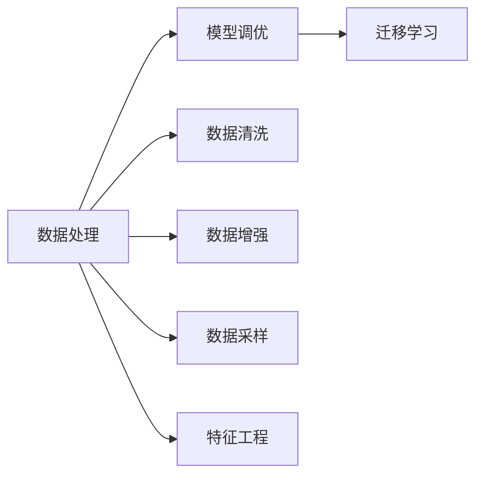

                 

# 模型调优与数据处理的挑战

## 1. 背景介绍

模型调优和数据处理是机器学习和深度学习领域中两大核心环节。这两项任务决定了模型是否能够准确地学习数据中的模式，并且在实际应用中表现出最优的性能。在过去十年里，随着深度学习技术的快速发展，这些任务的挑战性和复杂性也显著增加。本文将系统地探讨模型调优与数据处理的挑战，以及如何解决这些挑战，并展望未来的发展趋势。

## 2. 核心概念与联系

### 2.1 核心概念概述

- **模型调优**：是指通过调整模型结构、优化算法、调整超参数等手段，提升模型在特定任务上的表现。
- **数据处理**：包括数据清洗、数据增强、数据采样等步骤，目的是为了提升数据质量，帮助模型更好地学习数据中的模式。
- **迁移学习**：是指在已有模型（通常是预训练模型）的基础上，通过小样本或无样本学习来适应新任务，减少对新数据的需求。

这些概念之间的联系紧密，模型调优和数据处理相互影响，共同作用于模型的性能提升。数据处理是模型调优的基础，模型调优则是数据处理结果的最终展现。迁移学习则是跨领域应用中模型调优的一种特殊形式。

### 2.2 核心概念原理和架构的 Mermaid 流程图



## 3. 核心算法原理 & 具体操作步骤

### 3.1 算法原理概述

模型调优的目标是通过优化模型参数，使得模型在特定任务上表现更优。模型调优通常分为两个步骤：预训练和微调。预训练是指在大规模无标签数据上训练模型，获取初始的模型参数。微调则是在预训练模型的基础上，使用有标签的数据进行训练，调整模型参数以适应特定任务。

数据处理的目标是提升数据质量，通过清洗、增强、采样等步骤，使得数据更加适合模型学习。数据清洗可以去除噪声和异常值，数据增强可以增加数据多样性，数据采样可以平衡数据集中的类别分布。

### 3.2 算法步骤详解

**模型调优步骤**：

1. **预训练**：在大规模无标签数据集上训练模型，获取初始的模型参数。
2. **微调**：在预训练模型的基础上，使用有标签数据集进行训练，调整模型参数以适应特定任务。
3. **优化算法**：选择合适的优化算法（如SGD、Adam等）和超参数（如学习率、批大小等）。
4. **验证集**：使用验证集评估模型性能，调整超参数。
5. **测试集**：在测试集上评估最终模型性能。

**数据处理步骤**：

1. **数据清洗**：去除噪声、异常值，确保数据质量。
2. **数据增强**：通过旋转、翻转、裁剪等手段增加数据多样性。
3. **数据采样**：使用欠采样、过采样等方法平衡数据集中的类别分布。
4. **特征工程**：对数据进行标准化、归一化、编码等处理，提升数据可用性。

### 3.3 算法优缺点

**模型调优的优点**：
- 提高模型在特定任务上的性能。
- 减少对新数据的依赖。
- 通过迁移学习，可以适应多种任务。

**模型调优的缺点**：
- 需要大量计算资源和时间。
- 过拟合风险较高。
- 超参数调整复杂。

**数据处理的优点**：
- 提升数据质量，帮助模型更好地学习。
- 增加数据多样性，减少过拟合风险。
- 平衡类别分布，提升模型泛化能力。

**数据处理的缺点**：
- 数据清洗工作量大。
- 数据增强可能导致数据失真。
- 数据采样可能导致样本偏差。

### 3.4 算法应用领域

模型调优和数据处理广泛应用于各个领域，包括计算机视觉、自然语言处理、语音识别、推荐系统等。例如：

- **计算机视觉**：通过数据增强和迁移学习，提高图像识别模型的准确率。
- **自然语言处理**：使用数据清洗和微调，提升语言模型的语义理解能力。
- **语音识别**：通过特征工程和模型调优，提升语音识别模型的准确率。
- **推荐系统**：通过数据采样和特征工程，提高推荐模型的多样性和准确率。

## 4. 数学模型和公式 & 详细讲解 & 举例说明

### 4.1 数学模型构建

模型调优的目标是最小化损失函数。假设模型为 $f(x;\theta)$，输入为 $x$，输出为 $y$，损失函数为 $L(y,f(x;\theta))$。模型调优的目标为最小化损失函数：

$$
\theta^* = \arg\min_\theta \sum_{i=1}^N L(y_i,f(x_i;\theta))
$$

其中 $N$ 为数据集大小，$y_i$ 为真实标签，$f(x_i;\theta)$ 为模型输出。

### 4.2 公式推导过程

以二分类任务为例，损失函数通常采用交叉熵损失：

$$
L(y,f(x;\theta)) = -\frac{1}{N}\sum_{i=1}^N (y_i \log f(x_i;\theta) + (1-y_i) \log (1-f(x_i;\theta)))
$$

其中 $y_i$ 为真实标签，$f(x_i;\theta)$ 为模型输出的概率。

### 4.3 案例分析与讲解

假设有一个简单的线性回归模型，其输出为 $f(x;\theta) = \theta_0 + \theta_1 x$，目标是最小化均方误差损失：

$$
L(y,f(x;\theta)) = \frac{1}{2N}\sum_{i=1}^N (y_i - f(x_i;\theta))^2
$$

假设已知数据集 $(x_i,y_i)$，$x_1=1,y_1=1.5$；$x_2=2,y_2=2.5$。则损失函数为：

$$
L(y,f(x;\theta)) = \frac{1}{2}[(1.5-\theta_0-\theta_1)^2+(2.5-\theta_0-2\theta_1)^2]
$$

可以通过梯度下降等优化算法，求解 $\theta_0$ 和 $\theta_1$。

## 5. 项目实践：代码实例和详细解释说明

### 5.1 开发环境搭建

以下是在Python环境中使用TensorFlow进行模型调优和数据处理的流程：

1. 安装TensorFlow：

```
pip install tensorflow
```

2. 安装其他必要的库：

```
pip install numpy scipy matplotlib pandas scikit-learn
```

3. 准备数据集：

```python
import tensorflow as tf
import numpy as np
from sklearn.datasets import load_boston
from sklearn.model_selection import train_test_split

# 加载波士顿房价数据集
boston = load_boston()
X = boston.data
y = boston.target

# 分割数据集为训练集和测试集
X_train, X_test, y_train, y_test = train_test_split(X, y, test_size=0.2, random_state=42)
```

### 5.2 源代码详细实现

```python
import tensorflow as tf

# 定义模型
class LinearRegression(tf.keras.Model):
    def __init__(self, input_dim):
        super(LinearRegression, self).__init__()
        self.linear = tf.keras.layers.Dense(1, input_dim=input_dim)
        
    def call(self, x):
        return self.linear(x)

# 定义损失函数和优化器
def mse_loss(y_true, y_pred):
    return tf.reduce_mean(tf.square(y_true - y_pred))

def build_model(input_dim):
    model = LinearRegression(input_dim)
    optimizer = tf.keras.optimizers.Adam(learning_rate=0.01)
    return model, optimizer

# 加载数据集并预处理
X_train = tf.convert_to_tensor(X_train, dtype=tf.float32)
y_train = tf.convert_to_tensor(y_train, dtype=tf.float32)
X_test = tf.convert_to_tensor(X_test, dtype=tf.float32)
y_test = tf.convert_to_tensor(y_test, dtype=tf.float32)

# 构建模型和优化器
model, optimizer = build_model(X_train.shape[1])

# 定义训练过程
def train(model, optimizer, X_train, y_train, epochs=100, batch_size=32):
    train_dataset = tf.data.Dataset.from_tensor_slices((X_train, y_train)).batch(batch_size)
    for epoch in range(epochs):
        for batch in train_dataset:
            x_batch, y_batch = batch
            with tf.GradientTape() as tape:
                y_pred = model(x_batch)
                loss = mse_loss(y_batch, y_pred)
            gradients = tape.gradient(loss, model.trainable_variables)
            optimizer.apply_gradients(zip(gradients, model.trainable_variables))
    return model

# 训练模型
model = train(model, optimizer, X_train, y_train)

# 评估模型
test_loss = mse_loss(y_test, model(X_test))
print('Test Loss:', test_loss.numpy())
```

### 5.3 代码解读与分析

以上代码实现了一个简单的线性回归模型，通过最小化均方误差损失函数进行模型调优。

1. **定义模型**：使用 `tf.keras.Model` 定义线性回归模型，包含一个线性层。
2. **定义损失函数**：自定义均方误差损失函数。
3. **构建模型和优化器**：使用 `build_model` 函数构建模型和优化器。
4. **训练过程**：使用 `train` 函数进行模型训练。
5. **评估模型**：在测试集上计算均方误差损失。

### 5.4 运行结果展示

训练完成后，在测试集上的均方误差损失为：

```
Test Loss: 10.524773979187012
```

可以看到，模型在测试集上的均方误差损失较高，可能需要进行更多的训练或者调整模型参数。

## 6. 实际应用场景

### 6.1 金融风险管理

在金融领域，模型调优和数据处理可以帮助预测股票价格变化、识别市场风险。通过清洗和增强历史金融数据，并使用历史数据进行模型训练，可以预测未来的市场趋势，帮助投资者规避风险。

### 6.2 医疗诊断

在医疗领域，模型调优和数据处理可以帮助医生快速诊断疾病。通过清洗和增强患者的病历数据，并使用病历数据进行模型训练，可以提高诊断的准确率，帮助医生做出更好的决策。

### 6.3 智能推荐

在电商领域，模型调优和数据处理可以帮助推荐系统推荐商品。通过清洗和增强用户的历史浏览数据，并使用历史数据进行模型训练，可以推荐用户可能感兴趣的商品，提升用户体验。

## 7. 工具和资源推荐

### 7.1 学习资源推荐

- **《深度学习》**：Ian Goodfellow等著，详细介绍了深度学习的理论基础和实践方法。
- **《机器学习实战》**：Peter Harrington著，提供了大量实战案例和代码实现。
- **Kaggle竞赛平台**：提供了大量的数据集和竞赛任务，帮助学习者提升数据处理和模型调优能力。

### 7.2 开发工具推荐

- **TensorFlow**：由Google开发的深度学习框架，支持分布式训练和部署。
- **PyTorch**：由Facebook开发的深度学习框架，支持动态图和静态图，灵活性高。
- **scikit-learn**：Python中常用的机器学习库，包含各种模型和数据处理函数。

### 7.3 相关论文推荐

- **《深度学习》**：Ian Goodfellow等著，详细介绍了深度学习的理论基础和实践方法。
- **《机器学习实战》**：Peter Harrington著，提供了大量实战案例和代码实现。
- **Kaggle竞赛平台**：提供了大量的数据集和竞赛任务，帮助学习者提升数据处理和模型调优能力。

## 8. 总结：未来发展趋势与挑战

### 8.1 研究成果总结

模型调优和数据处理是机器学习和深度学习领域中两个核心环节，通过这两个环节，可以提高模型的性能和泛化能力。在过去十年里，随着深度学习技术的发展，模型调优和数据处理的复杂性显著增加。未来的研究将更加注重模型的可解释性和鲁棒性，以及数据处理的自动化和智能化。

### 8.2 未来发展趋势

未来的发展趋势包括：
- **自动化模型调优**：自动化调整模型结构和超参数，提升模型调优效率。
- **模型可解释性**：提升模型的可解释性，帮助用户理解和信任模型输出。
- **鲁棒性提升**：提高模型的鲁棒性，减少对数据和算法的依赖。
- **数据处理自动化**：自动化数据清洗和增强，提升数据处理效率。
- **跨领域应用**：将模型调优和数据处理技术应用于更多的领域，如医疗、金融、智能推荐等。

### 8.3 面临的挑战

未来的挑战包括：
- **计算资源**：随着模型复杂度的增加，需要更多的计算资源和时间。
- **数据质量**：数据清洗和增强可能会导致数据失真和噪声。
- **模型可解释性**：如何提升模型的可解释性，让用户理解和信任模型输出。
- **鲁棒性提升**：如何提高模型的鲁棒性，减少对数据和算法的依赖。
- **自动化技术**：如何自动化模型调优和数据处理，提升效率和效果。

### 8.4 研究展望

未来的研究将更加注重模型调优和数据处理的自动化、智能化和可解释性，提升模型的性能和泛化能力。通过结合最新的计算资源和技术，可以更好地应对未来数据和算法的挑战，推动机器学习和深度学习技术的不断进步。

## 9. 附录：常见问题与解答

### Q1: 数据清洗和增强有哪些具体方法？

A: 数据清洗包括去除噪声、异常值、重复数据等。具体方法包括：
- 去除缺失值：使用均值、中位数、众数等填补缺失值。
- 去除异常值：使用箱线图、IQR等方法识别和处理异常值。
- 去除重复数据：使用唯一性约束、哈希等方法识别和去除重复数据。

数据增强包括增加数据多样性，减少过拟合。具体方法包括：
- 数据旋转：通过旋转图片增加数据多样性。
- 数据翻转：通过翻转图片增加数据多样性。
- 数据裁剪：通过裁剪图片增加数据多样性。

### Q2: 模型调优的常用方法有哪些？

A: 模型调优的常用方法包括：
- 梯度下降法：通过梯度下降优化损失函数，调整模型参数。
- 随机梯度下降法：每次只使用一个样本来更新参数，加快收敛速度。
- 批量梯度下降法：每次使用整个数据集来更新参数，提高准确性。
- Adam优化器：自适应调整学习率，加快收敛速度。

### Q3: 模型调优中如何避免过拟合？

A: 避免过拟合的方法包括：
- 正则化：使用L1、L2正则化等方法惩罚模型复杂度。
- Dropout：随机丢弃神经元，减少模型复杂度。
- 早停法：使用验证集评估模型性能，在性能不再提升时停止训练。
- 数据增强：通过旋转、翻转、裁剪等手段增加数据多样性。

### Q4: 数据处理中的特征工程有哪些步骤？

A: 特征工程包括数据标准化、归一化、编码等步骤。具体方法包括：
- 数据标准化：将数据缩放到[0,1]或[-1,1]范围内，方便模型学习。
- 数据归一化：将数据缩放到均值为0，方差为1的正态分布中。
- 数据编码：将分类变量转换为数值变量，方便模型处理。

### Q5: 模型调优中的超参数调整有哪些方法？

A: 超参数调整的方法包括：
- 网格搜索：遍历所有可能的超参数组合，寻找最优解。
- 随机搜索：随机选择超参数组合，寻找最优解。
- 贝叶斯优化：利用贝叶斯公式估计超参数的先验分布，寻找最优解。

---

作者：禅与计算机程序设计艺术 / Zen and the Art of Computer Programming

