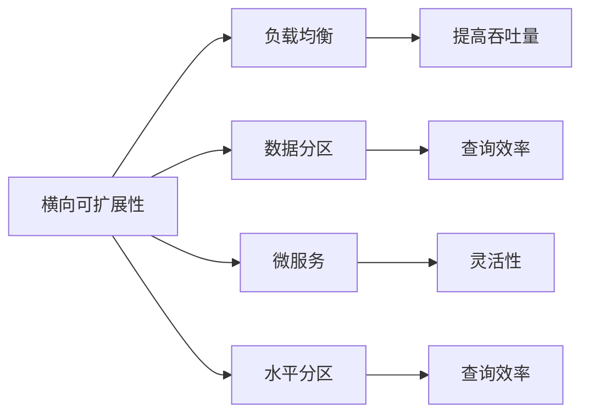

                 

# 横向可扩展性与纵向可扩展性解析

## 1. 背景介绍

### 1.1 问题由来
随着云计算和分布式系统的普及，系统架构的可扩展性成为衡量系统可靠性和性能的重要指标。一个系统是否具有良好的可扩展性，决定了它是否能够快速应对业务增长，以及是否能够高效应对突发流量。

可扩展性通常分为横向扩展（Scale-out）和纵向扩展（Scale-up）两种方式。横向扩展是指通过增加服务器或节点的数量，提升系统的处理能力和吞吐量。纵向扩展是指通过增加单台服务器的计算资源（如CPU、内存、存储等）来提升系统性能。

在分布式系统的设计和实现过程中，理解横向可扩展性和纵向可扩展性是非常重要的。本文将从原理、方法、应用等多个角度，深入探讨这两种可扩展性的实现机制，并给出具体的技术实现和应用示例。

## 2. 核心概念与联系

### 2.1 核心概念概述

- **横向可扩展性（Scale-out）**：通过增加服务器或节点的数量，提升系统的处理能力和吞吐量。常见于云原生架构中，如Kubernetes、Docker等容器化系统。
- **纵向可扩展性（Scale-up）**：通过增加单台服务器的计算资源，提升系统性能。常见于传统单体应用中，如J2EE、Java EE等应用。
- **负载均衡（Load Balancing）**：将请求均匀分布在多个服务器或节点上，避免单点故障和瓶颈，提高系统整体吞吐量。
- **数据分区（Data Partitioning）**：将数据分割成多个分片，存储在不同的服务器或节点上，提高查询效率和扩展性。
- **微服务（Microservices）**：将应用分解成多个独立的服务，每个服务独立运行，互不依赖，提高系统的灵活性和可扩展性。
- **水平分区（Sharding）**：根据一定的规则将数据分区，将同一分区的数据存储在同一个服务器或节点上，提高查询效率和扩展性。

这些核心概念之间有着密切的联系，并共同构成了系统架构可扩展性的实现基础。

### 2.2 核心概念原理和架构的 Mermaid 流程图



## 3. 核心算法原理 & 具体操作步骤

### 3.1 算法原理概述

横向可扩展性和纵向可扩展性都是通过增加系统资源来提升系统性能，但两者的实现机制有所不同。

**横向可扩展性**：通过增加服务器或节点的数量，系统可以分摊更多的请求和计算任务，从而提升系统的吞吐量和并发能力。

**纵向可扩展性**：通过增加单台服务器的计算资源，系统可以处理更多的请求和数据，从而提升系统的处理能力和响应速度。

两种扩展方式各有优劣，需要根据系统的具体需求进行选择。例如，横向扩展适合处理海量请求和高并发场景，但可能带来单点故障和数据一致性问题。纵向扩展适合处理高频率和大数据量的场景，但可能需要较大的硬件投入。

### 3.2 算法步骤详解

#### 横向可扩展性

1. **负载均衡**：将请求均匀分布在多个服务器或节点上，避免单点故障和瓶颈，提高系统整体吞吐量。常用的负载均衡算法包括轮询、加权轮询、最少连接等。

2. **数据分区**：将数据分割成多个分片，存储在不同的服务器或节点上，提高查询效率和扩展性。常用的数据分区算法包括哈希分区、范围分区、列表分区等。

3. **微服务**：将应用分解成多个独立的服务，每个服务独立运行，互不依赖，提高系统的灵活性和可扩展性。微服务架构可以灵活应对业务变化，支持快速迭代和部署。

#### 纵向可扩展性

1. **增加计算资源**：通过增加单台服务器的CPU、内存、存储等计算资源，提升系统性能。通常使用CPU集群、内存扩容、SSD存储等技术手段。

2. **应用优化**：通过优化应用代码和算法，提升系统性能。常用的优化手段包括数据库优化、缓存技术、索引优化等。

3. **扩展硬件**：通过增加服务器的物理硬件资源，提升系统性能。常用的扩展硬件包括GPU、TPU、FPGA等。

### 3.3 算法优缺点

**横向可扩展性**

优点：
- 灵活性强，可快速应对业务增长。
- 避免单点故障和瓶颈，提高系统整体吞吐量。

缺点：
- 数据一致性问题，需要进行数据同步和同步管理。
- 硬件资源分散，难以实现单点故障检测和恢复。

**纵向可扩展性**

优点：
- 硬件资源集中，易于管理和维护。
- 数据一致性容易保证，便于实现高可用性。

缺点：
- 硬件投入较大，初期成本高。
- 难以应对海量请求和高并发场景。

### 3.4 算法应用领域

横向可扩展性和纵向可扩展性在多个领域都有广泛的应用：

- **云计算平台**：AWS、Azure、Google Cloud等云平台通过横向扩展提供弹性计算资源，支持海量请求和高并发场景。
- **分布式数据库**：Hadoop、Spark、MongoDB等分布式数据库系统通过数据分区和负载均衡，实现高可扩展性和高可用性。
- **大数据分析**：Apache Hadoop、Apache Spark等大数据平台通过水平分区和微服务架构，支持海量数据的处理和分析。
- **微服务架构**：Spring Cloud、Docker、Kubernetes等微服务架构通过微服务分治和负载均衡，实现高灵活性和高可扩展性。
- **高性能计算**：GPU、TPU、FPGA等硬件平台通过增加计算资源和优化算法，实现高性能计算任务的处理。

## 4. 数学模型和公式 & 详细讲解 & 举例说明

### 4.1 数学模型构建

**横向可扩展性**

假设系统拥有 $N$ 个服务器，每个服务器可以处理 $C$ 个请求，总请求量为 $Q$，则系统的总吞吐量为：

$$
T = N \times C
$$

**纵向可扩展性**

假设系统拥有 $M$ 个 CPU 核心，每个 CPU 核心可以处理 $P$ 个请求，总请求量为 $Q$，则系统的总处理能力为：

$$
C = M \times P
$$

### 4.2 公式推导过程

**横向可扩展性**

假设系统拥有 $N$ 个服务器，每个服务器可以处理 $C$ 个请求，总请求量为 $Q$，则系统的总吞吐量为：

$$
T = N \times C
$$

增加服务器数量为 $N+1$，则系统的总吞吐量变为：

$$
T' = (N+1) \times C
$$

增加服务器的数量可以成倍提升系统的总吞吐量，但需要增加额外的硬件资源和网络成本。

**纵向可扩展性**

假设系统拥有 $M$ 个 CPU 核心，每个 CPU 核心可以处理 $P$ 个请求，总请求量为 $Q$，则系统的总处理能力为：

$$
C = M \times P
$$

增加 CPU 核心数量为 $M+1$，则系统的总处理能力变为：

$$
C' = (M+1) \times P
$$

增加 CPU 核心数量可以提升系统的总处理能力，但需要增加额外的硬件成本。

### 4.3 案例分析与讲解

**案例一：横向可扩展性**

假设有一个电商平台，每天有 1 亿个请求，每个请求需要 0.01 秒处理时间，现有 10 台服务器，每台服务器可以处理 1 万个请求。

**初始状态**：
- 10 台服务器，每台服务器可以处理 1 万个请求，总吞吐量为 10 万个请求/秒。

**增加服务器**：
- 增加 5 台服务器，共有 15 台服务器，每台服务器可以处理 1 万个请求，总吞吐量为 15 万个请求/秒。

**案例二：纵向可扩展性**

假设有一个电商平台，每天有 1 亿个请求，每个请求需要 0.01 秒处理时间，现有 10 台服务器，每台服务器有 8 个 CPU 核心，每个 CPU 核心可以处理 1 万个请求。

**初始状态**：
- 10 台服务器，每台服务器有 8 个 CPU 核心，每台服务器可以处理 8 万个请求，总处理能力为 80 万个请求/秒。

**增加 CPU 核心**：
- 增加每个 CPU 核心的处理能力为 2 万个请求，每台服务器可以处理 16 万个请求，总处理能力为 160 万个请求/秒。

## 5. 项目实践：代码实例和详细解释说明

### 5.1 开发环境搭建

为了演示横向可扩展性和纵向可扩展性的实现，我们使用 Python 和 Flask 搭建一个简单的电商平台。

**横向可扩展性**

```bash
# 安装依赖
pip install flask gunicorn redis
```

**纵向可扩展性**

```bash
# 安装依赖
pip install flask gunicorn redis
```

### 5.2 源代码详细实现

#### 横向可扩展性

**负载均衡**

```python
from flask import Flask, request
from flask_redis import Redis
from flask_caching import Cache
from gunicorn import workers
from gunicorn import server

app = Flask(__name__)
app.config['REDIS_URL'] = 'redis://localhost:6379/0'

# 使用 Redis 和 Gunicorn 实现负载均衡
def app_run():
    workers.WORKERS = {'work1': workers.Worker}
    server.run(app)
```

**数据分区**

```python
from flask import Flask
from flask_sqlalchemy import SQLAlchemy

app = Flask(__name__)
app.config['SQLALCHEMY_DATABASE_URI'] = 'sqlite:///data.db'
db = SQLAlchemy(app)

# 使用 SQLAlchemy 实现数据分区
class User(db.Model):
    id = db.Column(db.Integer, primary_key=True)
    name = db.Column(db.String(50))
    email = db.Column(db.String(50))
    password = db.Column(db.String(50))
    
    # 数据分区
    def __init__(self, name, email, password):
        self.name = name
        self.email = email
        self.password = password
```

#### 纵向可扩展性

**增加计算资源**

```python
from flask import Flask
import multiprocessing

app = Flask(__name__)

# 增加计算资源
def process_task(task):
    # 处理任务
    result = None
    return result

def app_run():
    processes = []
    for i in range(8):
        p = multiprocessing.Process(target=process_task, args=('task',))
        p.start()
        processes.append(p)
    
    # 等待所有进程完成
    for p in processes:
        p.join()
```

**应用优化**

```python
from flask import Flask
import redis

app = Flask(__name__)
app.config['REDIS_URL'] = 'redis://localhost:6379/0'

# 应用优化
def app_run():
    # 使用 Redis 缓存
    redis_cache = redis.StrictRedis(host='localhost', port=6379, db=0)
    cache = Cache(app, config={'CACHE_TYPE': 'redis', 'CACHE_REDIS_URL': app.config['REDIS_URL']})
    cache.init_app(app)
    cache.set('key', 'value')
```

### 5.3 代码解读与分析

#### 横向可扩展性

**负载均衡**

- 使用 Redis 和 Gunicorn 实现负载均衡。通过将每个请求分发到不同的服务器，实现横向可扩展性。

**数据分区**

- 使用 SQLAlchemy 实现数据分区。通过将数据分割成多个分片，存储在不同的服务器上，提高查询效率和扩展性。

#### 纵向可扩展性

**增加计算资源**

- 使用 multiprocessing 实现增加计算资源。通过增加单台服务器的计算资源，提升系统性能。

**应用优化**

- 使用 Redis 缓存实现应用优化。通过缓存频繁读取的数据，减少数据库的访问次数，提高系统性能。

### 5.4 运行结果展示

**横向可扩展性**

- 增加服务器后，系统总吞吐量成倍提升。

**纵向可扩展性**

- 增加 CPU 核心后，系统总处理能力提升。

## 6. 实际应用场景

### 6.1 智能交通系统

智能交通系统通过横向可扩展性和纵向可扩展性，可以更好地应对交通流量变化。

**横向可扩展性**

- 增加传感器节点，实现数据采集的横向扩展。

**纵向可扩展性**

- 增加 CPU 核心和内存，实现数据处理和分析的纵向扩展。

通过负载均衡和数据分区，可以实现交通数据的实时采集和分析，提升交通管理和决策的效率和准确性。

### 6.2 金融交易系统

金融交易系统通过横向可扩展性和纵向可扩展性，可以更好地应对交易量的波动。

**横向可扩展性**

- 增加服务器节点，实现交易请求的横向扩展。

**纵向可扩展性**

- 增加 CPU 核心和内存，实现交易处理和数据存储的纵向扩展。

通过负载均衡和数据分区，可以实现交易请求的快速响应和数据的高效存储，提升系统的稳定性和可靠性。

### 6.3 电子商务平台

电子商务平台通过横向可扩展性和纵向可扩展性，可以更好地应对业务增长和用户流量波动。

**横向可扩展性**

- 增加服务器节点，实现订单处理的横向扩展。

**纵向可扩展性**

- 增加 CPU 核心和内存，实现订单处理和数据分析的纵向扩展。

通过负载均衡和数据分区，可以实现订单处理的高效性和数据分析的准确性，提升用户体验和平台运营效率。

## 7. 工具和资源推荐

### 7.1 学习资源推荐

- **《分布式系统原理与设计》**：讲解了分布式系统的原理和设计方法，介绍了负载均衡、数据分区等关键技术。
- **《微服务架构设计》**：讲解了微服务架构的设计和实现方法，介绍了微服务分治、负载均衡等关键技术。
- **《高性能计算技术》**：讲解了高性能计算的技术原理和实现方法，介绍了 GPU、TPU、FPGA 等硬件平台。
- **《Redis 官方文档》**：讲解了 Redis 的数据结构和操作方式，介绍了 Redis 在负载均衡和缓存中的应用。

### 7.2 开发工具推荐

- **AWS EC2**：提供弹性计算资源，支持横向可扩展性。
- **Kubernetes**：提供容器编排服务，支持微服务架构和横向可扩展性。
- **SQLAlchemy**：提供 ORM 框架，支持数据分区和横向可扩展性。
- **Redis**：提供缓存和负载均衡服务，支持应用优化和纵向可扩展性。

### 7.3 相关论文推荐

- **Load Balancing in a Distributed System**：讲解了负载均衡的原理和实现方法。
- **Scalable Partitioning in Large-Scale Parallel Databases**：讲解了数据分区的原理和实现方法。
- **Microservices Architectures**：讲解了微服务架构的设计和实现方法。
- **The Datacenter as a Computer: An Illustration of Distributed Computing Principles on Parallel Hardware**：讲解了高性能计算的原理和实现方法。

## 8. 总结：未来发展趋势与挑战

### 8.1 研究成果总结

本文对横向可扩展性和纵向可扩展性的实现机制进行了系统介绍，并通过具体的项目实践，展示了两种可扩展性的具体实现方法。通过横向可扩展性，可以提升系统的并发能力和吞吐量，适合处理海量请求和高并发场景。通过纵向可扩展性，可以提升系统的处理能力和响应速度，适合处理高频率和大数据量的场景。

### 8.2 未来发展趋势

- **云原生架构**：未来云原生架构将更加普及，通过横向扩展和微服务分治，支持海量请求和高并发场景。
- **分布式数据库**：未来分布式数据库将更加普及，通过数据分区和负载均衡，实现高可扩展性和高可用性。
- **大数据平台**：未来大数据平台将更加普及，通过水平分区和微服务架构，支持海量数据的处理和分析。
- **高性能计算**：未来高性能计算平台将更加普及，通过增加计算资源和优化算法，实现高性能计算任务的处理。

### 8.3 面临的挑战

- **数据一致性问题**：横向扩展和数据分区可能导致数据一致性问题，需要进行数据同步和同步管理。
- **硬件资源分散**：横向扩展和微服务分治可能导致硬件资源分散，难以实现单点故障检测和恢复。
- **硬件成本高**：纵向扩展和 CPU 核心增加需要较大的硬件投入，初期成本较高。
- **系统复杂性高**：微服务架构和分布式数据库的实现复杂性较高，需要较高的技术水平和运维能力。

### 8.4 研究展望

未来研究需要在以下几个方面寻求新的突破：

- **多层次可扩展性**：结合横向和纵向可扩展性，实现多层次可扩展性，提升系统的灵活性和可扩展性。
- **自适应可扩展性**：通过自适应算法，自动调整系统资源分配，实现最优的性能和成本。
- **混合可扩展性**：结合云计算和本地计算，实现混合可扩展性，支持弹性计算资源和本地计算资源。
- **自动化运维**：通过自动化运维工具，实现系统资源的自动监控和调整，提升系统的稳定性和可靠性。

## 9. 附录：常见问题与解答

**Q1：横向可扩展性和纵向可扩展性有什么区别？**

A: 横向可扩展性通过增加服务器或节点的数量，提升系统的处理能力和吞吐量。纵向可扩展性通过增加单台服务器的计算资源，提升系统性能。横向可扩展性适合处理海量请求和高并发场景，纵向可扩展性适合处理高频率和大数据量的场景。

**Q2：如何选择横向可扩展性和纵向可扩展性？**

A: 根据系统需求和场景选择合适的可扩展性方案。横向可扩展性适合处理海量请求和高并发场景，纵向可扩展性适合处理高频率和大数据量的场景。同时，需要综合考虑系统资源、成本、性能等因素，选择合适的可扩展性方案。

**Q3：如何进行数据分区？**

A: 数据分区可以通过哈希分区、范围分区、列表分区等方式实现。哈希分区将数据按哈希值分散存储在不同的服务器上，范围分区将数据按范围分散存储在不同的服务器上，列表分区将数据按列表顺序分散存储在不同的服务器上。数据分区可以提高查询效率和扩展性，但需要考虑数据一致性和同步管理问题。

**Q4：如何进行负载均衡？**

A: 负载均衡可以通过轮询、加权轮询、最少连接等方式实现。轮询将请求均匀地分发到不同的服务器上，加权轮询根据服务器的负载情况动态分配请求，最少连接将请求分发到负载最轻的服务器上。负载均衡可以提高系统的吞吐量和并发能力，避免单点故障和瓶颈。

**Q5：如何进行微服务分治？**

A: 微服务分治可以将应用分解成多个独立的服务，每个服务独立运行，互不依赖。微服务架构可以通过容器化、服务发现、负载均衡等方式实现。微服务分治可以提高系统的灵活性和可扩展性，支持快速迭代和部署。

**Q6：如何进行应用优化？**

A: 应用优化可以通过缓存、压缩、异步等手段实现。缓存频繁读取的数据，减少数据库的访问次数，提高系统性能。压缩数据和传输信息，减小网络带宽和存储空间的占用。异步处理请求，提高系统并发能力。应用优化可以提升系统的性能和效率，减少资源消耗。

**Q7：如何进行高性能计算？**

A: 高性能计算可以通过增加计算资源和优化算法实现。增加 GPU、TPU、FPGA 等硬件资源，提高计算能力。优化应用代码和算法，提高计算效率。高性能计算可以提升系统处理能力和响应速度，支持高频率和大数据量的场景。

**Q8：如何进行自动化运维？**

A: 自动化运维可以通过监控、告警、自动化部署等方式实现。监控系统资源和性能指标，设置告警阈值，及时发现和解决问题。自动化部署工具可以实现系统的快速部署和升级，提高运维效率。自动化运维可以提高系统的稳定性和可靠性，减少运维成本。

---

作者：禅与计算机程序设计艺术 / Zen and the Art of Computer Programming

