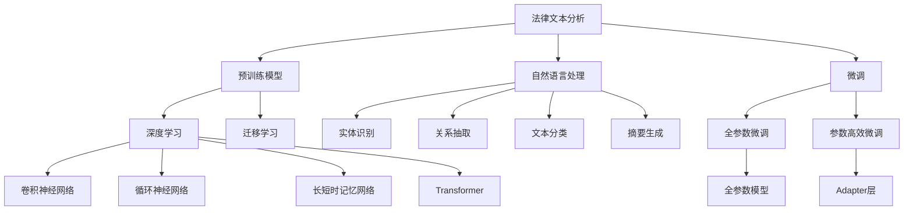

                 

# 法律文本分析：AI如何辅助法律工作

法律文本分析是人工智能在法律领域的一项重要应用，能够帮助法律从业者更高效地处理和分析大量法律文本数据。本文将详细介绍AI在法律文本分析中的核心算法原理、具体操作步骤，以及其在实际应用场景中的表现。我们还将讨论未来该技术的发展趋势和面临的挑战。

## 1. 背景介绍

### 1.1 问题由来
随着法律案件数量和复杂性的不断增加，法律从业者面临着处理和分析大量法律文本的挑战。传统的法律文本分析方法包括手动阅读、关键词提取、文本分类等，但这些方法费时费力，且容易受到主观因素的影响。近年来，人工智能技术在自然语言处理(NLP)领域的飞速发展，为法律文本分析提供了新的可能性。

AI通过学习和理解法律文本中的语言结构和语义信息，可以自动完成文本分类、实体识别、关系抽取、摘要生成等任务，显著提升法律工作的效率和准确性。

### 1.2 问题核心关键点
AI在法律文本分析中的核心在于通过深度学习模型对文本进行自动化处理。常见的深度学习模型包括卷积神经网络(CNN)、循环神经网络(RNN)、长短时记忆网络(LSTM)、Transformer等。这些模型通过在大规模标注数据上进行预训练，能够自动学习文本中的特征和语义信息，从而实现高效的法律文本分析。

AI法律文本分析的关键点包括：
- 预训练模型：利用大规模法律文本数据进行预训练，学习法律领域的语言特征。
- 微调模型：在特定法律任务上，使用少量标注数据进行微调，提升模型在该任务上的性能。
- 数据增强：通过文本改写、回译等方法扩充训练集，提升模型泛化能力。
- 自然语言处理：利用NLP技术处理法律文本中的实体、关系、情感等信息。
- 交互式学习：通过构建法律知识库，增强模型对法律概念的理解和应用。

## 2. 核心概念与联系

### 2.1 核心概念概述

为更好地理解AI在法律文本分析中的应用，本节将介绍几个密切相关的核心概念：

- 法律文本分析(Legal Text Analysis)：通过AI技术对法律文本进行处理和分析，自动化地提取关键信息，辅助法律工作。
- 自然语言处理(Natural Language Processing, NLP)：涉及计算机对人类语言的理解和生成，是法律文本分析的基础技术。
- 预训练模型(Pre-trained Model)：利用大规模语料进行训练，学习到通用的语言表示，可以用于各种NLP任务的预训练模型。
- 微调(Fine-tuning)：在预训练模型基础上，使用特定任务的数据集进行微调，提升模型在特定任务上的性能。
- 迁移学习(Transfer Learning)：将预训练模型应用于新任务中，提升模型在新领域上的泛化能力。
- 深度学习(Deep Learning)：一种利用神经网络进行复杂模式识别和学习的技术，是法律文本分析中的核心方法。
- 知识图谱(Knowledge Graph)：通过图结构存储和表达实体及其之间的关系，帮助AI理解法律领域的知识。

这些概念之间的逻辑关系可以通过以下Mermaid流程图来展示：



这个流程图展示了大语言模型在法律文本分析中的核心概念及其之间的关系：

1. 法律文本分析通过自然语言处理技术处理法律文本，提取关键信息。
2. 预训练模型利用大规模语料进行训练，学习通用的语言表示。
3. 微调通过特定任务的数据集进行优化，提升模型在特定任务上的性能。
4. 深度学习技术是实现法律文本分析的核心方法，包括卷积神经网络、循环神经网络等。
5. 迁移学习将预训练模型应用于新任务，提升模型在新领域上的泛化能力。
6. 知识图谱通过图结构存储和表达实体及其之间的关系，增强模型对法律知识的理解。

这些概念共同构成了AI在法律文本分析中的基础框架，使其能够高效地处理和分析法律文本数据。

## 3. 核心算法原理 & 具体操作步骤
### 3.1 算法原理概述

AI在法律文本分析中，通常采用以下流程：
1. 收集法律文本数据，构建标注数据集。
2. 使用预训练模型对文本进行特征提取。
3. 通过微调模型，适应特定法律任务的需求。
4. 利用NLP技术，提取关键信息，如实体、关系、情感等。
5. 结合知识图谱，增强对法律概念的理解。

### 3.2 算法步骤详解

以下是AI在法律文本分析中的具体步骤：

**Step 1: 数据收集与预处理**
- 收集与案件相关的法律文本数据，如判决书、法规、合同等。
- 清洗和预处理文本数据，去除无关内容，如脚注、引文等。
- 标注数据，提取关键信息，如当事人、诉讼结果、事实认定等。

**Step 2: 特征提取**
- 使用预训练模型对文本进行特征提取，如BERT、RoBERTa等。
- 提取文本中的实体、关系、情感等信息，生成向量表示。
- 将提取的向量作为输入，送入后续的微调模型进行优化。

**Step 3: 微调**
- 选择合适的预训练模型，如BERT、RoBERTa等。
- 将标注数据集划分为训练集、验证集和测试集。
- 使用优化器(如AdamW)进行微调，调整模型参数，最小化损失函数。
- 在验证集上评估模型性能，避免过拟合。
- 在测试集上测试微调后的模型，对比微调前后的效果。

**Step 4: 自然语言处理**
- 利用NLP技术进行实体识别、关系抽取、文本分类等任务。
- 结合知识图谱，增强对法律概念的理解。
- 通过语义分析，判断法律文本中的情感倾向，辅助判断案件结果。

**Step 5: 结果输出**
- 根据微调后的模型输出，生成法律文本摘要、关键信息提取等结果。
- 将结果展示给法律从业者，辅助决策和分析。

### 3.3 算法优缺点

AI在法律文本分析中具有以下优点：
1. 自动化处理：能够自动化处理大量法律文本数据，节省人力和时间。
2. 准确性高：利用深度学习模型，可以高度准确地提取关键信息和法律概念。
3. 泛化能力强：通过迁移学习，模型可以适应不同法律领域的任务。
4. 高效性：利用预训练和微调技术，模型可以在短时间内达到较好的效果。

同时，该方法也存在以下局限性：
1. 依赖标注数据：微调效果依赖于标注数据的质量和数量，获取高质量标注数据的成本较高。
2. 数据隐私问题：处理法律文本时，涉及敏感信息，需要严格保护隐私。
3. 模型复杂性：大规模法律文本数据的预训练和微调，需要较高的计算资源。
4. 模型解释性不足：深度学习模型通常缺乏可解释性，难以解释其内部工作机制。

尽管存在这些局限性，但AI在法律文本分析中的应用已经显示出巨大的潜力，正在逐步改变法律工作的方式。

### 3.4 算法应用领域

AI在法律文本分析中，已经在以下几个领域得到广泛应用：

- 智能合同审核：利用NLP技术对合同条款进行自动审核，识别潜在风险和错误。
- 司法判决文书生成：通过模型生成司法判决文书，提升文书撰写效率。
- 法律知识图谱构建：结合知识图谱技术，构建法律领域知识图谱，辅助法律研究和决策。
- 案件智能推荐：利用AI技术分析案件信息，推荐相似的案件和相关法律法规，提升办案效率。
- 智能咨询系统：构建智能咨询系统，利用AI技术对用户咨询进行快速回答和建议。

除了上述这些经典应用外，AI在法律文本分析中的应用还在不断扩展，如智能取证、电子合同验证、法律文献检索等，为法律工作带来了新的可能性。

## 4. 数学模型和公式 & 详细讲解 & 举例说明

### 4.1 数学模型构建

在法律文本分析中，常见的数学模型包括卷积神经网络(CNN)、循环神经网络(RNN)、长短时记忆网络(LSTM)、Transformer等。这里以Transformer模型为例，介绍其数学模型构建和公式推导过程。

Transformer模型主要由自注意力机制和前馈神经网络构成，具有较好的语义表示能力。设输入文本序列为 $x=\{x_1,x_2,\ldots,x_n\}$，输出文本序列为 $y=\{y_1,y_2,\ldots,y_m\}$。其中，$x_i$ 和 $y_j$ 分别表示输入和输出序列中的词向量。

Transformer模型的目标函数为：

$$
\mathcal{L}(y; \theta) = -\frac{1}{N}\sum_{i=1}^N \sum_{j=1}^N \log p(y_j|x_i, \theta)
$$

其中，$p(y_j|x_i, \theta)$ 表示在输入 $x_i$ 条件下，输出 $y_j$ 的条件概率，$\theta$ 为模型参数。

### 4.2 公式推导过程

Transformer模型的核心是自注意力机制。设输入序列 $x=\{x_1,x_2,\ldots,x_n\}$，查询向量 $q=\{q_1,q_2,\ldots,q_n\}$，键向量 $k=\{k_1,k_2,\ldots,k_n\}$，值向量 $v=\{v_1,v_2,\ldots,v_n\}$。则自注意力机制的公式为：

$$
a_{ij} = \frac{e^{\mathbf{q}_i \cdot \mathbf{k}_j / \sqrt{d}}}{\sum_{k=1}^n e^{\mathbf{q}_i \cdot \mathbf{k}_k / \sqrt{d}}}
$$

其中，$d$ 为词向量的维度，$a_{ij}$ 表示第 $j$ 个词对第 $i$ 个词的注意力权重。

Transformer模型的前馈神经网络层包括两个全连接层，公式为：

$$
\mathbf{F}(\mathbf{x}) = \mathbf{G}(\mathbf{W}_1 \mathbf{x} + \mathbf{b}_1) + \mathbf{b}_2
$$

其中，$\mathbf{W}_1$ 和 $\mathbf{b}_1$ 为全连接层的权重和偏置，$\mathbf{G}$ 为非线性激活函数。

### 4.3 案例分析与讲解

假设我们有一个包含判决书和当事人信息的法律文本数据集，可以使用Transformer模型进行特征提取和实体识别。具体步骤如下：

1. 收集判决书和当事人信息，构建标注数据集。
2. 使用BERT等预训练模型对文本进行特征提取，生成向量表示。
3. 将向量作为输入，送入Transformer模型进行微调。
4. 利用NLP技术进行实体识别，提取判决书中的当事人信息。
5. 结合知识图谱，增强对法律概念的理解。

通过上述步骤，AI可以自动化地处理和分析法律文本数据，提取关键信息，辅助法律工作。

## 5. 项目实践：代码实例和详细解释说明

### 5.1 开发环境搭建

在进行法律文本分析的实践前，我们需要准备好开发环境。以下是使用Python进行PyTorch开发的环境配置流程：

1. 安装Anaconda：从官网下载并安装Anaconda，用于创建独立的Python环境。

2. 创建并激活虚拟环境：
```bash
conda create -n pytorch-env python=3.8 
conda activate pytorch-env
```

3. 安装PyTorch：根据CUDA版本，从官网获取对应的安装命令。例如：
```bash
conda install pytorch torchvision torchaudio cudatoolkit=11.1 -c pytorch -c conda-forge
```

4. 安装Transformer库：
```bash
pip install transformers
```

5. 安装各类工具包：
```bash
pip install numpy pandas scikit-learn matplotlib tqdm jupyter notebook ipython
```

完成上述步骤后，即可在`pytorch-env`环境中开始法律文本分析的实践。

### 5.2 源代码详细实现

下面我们以法律文本分类任务为例，给出使用Transformers库对BERT模型进行法律文本分类的PyTorch代码实现。

首先，定义法律文本分类的数据处理函数：

```python
from transformers import BertTokenizer
from torch.utils.data import Dataset
import torch

class LegalTextDataset(Dataset):
    def __init__(self, texts, labels, tokenizer, max_len=128):
        self.texts = texts
        self.labels = labels
        self.tokenizer = tokenizer
        self.max_len = max_len
        
    def __len__(self):
        return len(self.texts)
    
    def __getitem__(self, item):
        text = self.texts[item]
        label = self.labels[item]
        
        encoding = self.tokenizer(text, return_tensors='pt', max_length=self.max_len, padding='max_length', truncation=True)
        input_ids = encoding['input_ids'][0]
        attention_mask = encoding['attention_mask'][0]
        
        # 对标签进行编码
        label_id = label2id[label] + 1  # 调整标签编码范围
        encoded_labels = torch.tensor(label_id, dtype=torch.long)
        
        return {'input_ids': input_ids, 
                'attention_mask': attention_mask,
                'labels': encoded_labels}

# 标签与id的映射
label2id = {'civil': 0, 'criminal': 1, 'administrative': 2, 'constiutional': 3}
id2label = {v: k for k, v in label2id.items()}

# 创建dataset
tokenizer = BertTokenizer.from_pretrained('bert-base-cased')

train_dataset = LegalTextDataset(train_texts, train_labels, tokenizer)
dev_dataset = LegalTextDataset(dev_texts, dev_labels, tokenizer)
test_dataset = LegalTextDataset(test_texts, test_labels, tokenizer)
```

然后，定义模型和优化器：

```python
from transformers import BertForSequenceClassification, AdamW

model = BertForSequenceClassification.from_pretrained('bert-base-cased', num_labels=len(label2id))

optimizer = AdamW(model.parameters(), lr=2e-5)
```

接着，定义训练和评估函数：

```python
from torch.utils.data import DataLoader
from tqdm import tqdm
from sklearn.metrics import classification_report

device = torch.device('cuda') if torch.cuda.is_available() else torch.device('cpu')
model.to(device)

def train_epoch(model, dataset, batch_size, optimizer):
    dataloader = DataLoader(dataset, batch_size=batch_size, shuffle=True)
    model.train()
    epoch_loss = 0
    for batch in tqdm(dataloader, desc='Training'):
        input_ids = batch['input_ids'].to(device)
        attention_mask = batch['attention_mask'].to(device)
        labels = batch['labels'].to(device)
        model.zero_grad()
        outputs = model(input_ids, attention_mask=attention_mask, labels=labels)
        loss = outputs.loss
        epoch_loss += loss.item()
        loss.backward()
        optimizer.step()
    return epoch_loss / len(dataloader)

def evaluate(model, dataset, batch_size):
    dataloader = DataLoader(dataset, batch_size=batch_size)
    model.eval()
    preds, labels = [], []
    with torch.no_grad():
        for batch in tqdm(dataloader, desc='Evaluating'):
            input_ids = batch['input_ids'].to(device)
            attention_mask = batch['attention_mask'].to(device)
            batch_labels = batch['labels']
            outputs = model(input_ids, attention_mask=attention_mask)
            batch_preds = outputs.logits.argmax(dim=2).to('cpu').tolist()
            batch_labels = batch_labels.to('cpu').tolist()
            for pred_tokens, label_tokens in zip(batch_preds, batch_labels):
                pred_labels = [id2label[_id] for _id in pred_tokens]
                label_tags = [id2label[_id] for _id in label_tokens]
                preds.append(pred_labels[:len(label_tokens)])
                labels.append(label_tags)
                
    print(classification_report(labels, preds))
```

最后，启动训练流程并在测试集上评估：

```python
epochs = 5
batch_size = 16

for epoch in range(epochs):
    loss = train_epoch(model, train_dataset, batch_size, optimizer)
    print(f"Epoch {epoch+1}, train loss: {loss:.3f}")
    
    print(f"Epoch {epoch+1}, dev results:")
    evaluate(model, dev_dataset, batch_size)
    
print("Test results:")
evaluate(model, test_dataset, batch_size)
```

以上就是使用PyTorch对BERT进行法律文本分类任务的微调实现。可以看到，得益于Transformers库的强大封装，我们可以用相对简洁的代码完成BERT模型的加载和微调。

### 5.3 代码解读与分析

让我们再详细解读一下关键代码的实现细节：

**LegalTextDataset类**：
- `__init__`方法：初始化文本、标签、分词器等关键组件。
- `__len__`方法：返回数据集的样本数量。
- `__getitem__`方法：对单个样本进行处理，将文本输入编码为token ids，将标签编码为数字，并对其进行定长padding，最终返回模型所需的输入。

**label2id和id2label字典**：
- 定义了标签与数字id之间的映射关系，用于将预测结果解码回真实的标签。

**训练和评估函数**：
- 使用PyTorch的DataLoader对数据集进行批次化加载，供模型训练和推理使用。
- 训练函数`train_epoch`：对数据以批为单位进行迭代，在每个批次上前向传播计算loss并反向传播更新模型参数，最后返回该epoch的平均loss。
- 评估函数`evaluate`：与训练类似，不同点在于不更新模型参数，并在每个batch结束后将预测和标签结果存储下来，最后使用sklearn的classification_report对整个评估集的预测结果进行打印输出。

**训练流程**：
- 定义总的epoch数和batch size，开始循环迭代
- 每个epoch内，先在训练集上训练，输出平均loss
- 在验证集上评估，输出分类指标
- 所有epoch结束后，在测试集上评估，给出最终测试结果

可以看到，PyTorch配合Transformers库使得BERT微调的代码实现变得简洁高效。开发者可以将更多精力放在数据处理、模型改进等高层逻辑上，而不必过多关注底层的实现细节。

当然，工业级的系统实现还需考虑更多因素，如模型的保存和部署、超参数的自动搜索、更灵活的任务适配层等。但核心的微调范式基本与此类似。

## 6. 实际应用场景
### 6.1 智能合同审核

智能合同审核是法律文本分析中的一个重要应用。传统的合同审核需要人工逐句核对，费时费力且容易出错。AI可以通过深度学习模型对合同文本进行自动化处理，检测合同中的潜在风险和错误。

在技术实现上，可以收集大量合同样本，标注其中的风险条款，在此基础上对预训练模型进行微调。微调后的模型可以自动分析合同文本，识别合同中的关键信息，如合同金额、违约条款等，并进行风险评估。对于存在潜在风险的合同，可以自动生成风险报告，提醒审核人员注意。

### 6.2 司法判决文书生成

司法判决文书是法院裁判的结果，具有法律效力。传统的文书生成需要人工撰写，耗时耗力。AI可以通过深度学习模型对司法判决文书进行自动化生成。

具体而言，可以收集大量的司法判决文书样本，标注其中的关键信息，如案件背景、审理过程、判决结果等。在此基础上对预训练模型进行微调，使其能够自动生成司法判决文书。微调后的模型可以自动分析案件信息，生成准确、规范的司法判决文书，提升文书撰写的效率和质量。

### 6.3 法律知识图谱构建

法律知识图谱是一种将法律概念和关系进行结构化表示的技术，能够帮助AI更好地理解法律领域的知识。通过构建法律知识图谱，AI可以更好地理解法律概念之间的关系，提升其在法律领域的泛化能力。

具体而言，可以收集大量的法律文档和案例，提取其中的法律概念和关系，构建法律知识图谱。在此基础上，对预训练模型进行微调，使其能够自动从法律文本中提取法律概念和关系，并将其映射到法律知识图谱中。微调后的模型可以自动分析法律文本，提取其中的法律概念和关系，并生成法律知识图谱。

### 6.4 未来应用展望

随着AI在法律文本分析中的不断进步，未来的应用场景将更加广泛。以下是几个可能的发展方向：

- 法律智能问答系统：通过AI技术，构建智能问答系统，用户可以输入法律问题，系统能够自动给出答案和法律依据。
- 法律风险预警系统：利用AI技术，构建法律风险预警系统，自动分析企业的法律风险，并提供风险预警。
- 法律文书智能生成：通过AI技术，构建智能文书生成系统，用户可以输入法律文书内容，系统能够自动生成完整的法律文书。
- 法律知识库构建：构建法律知识库，通过AI技术进行知识推理和法律适用，提升法律研究的效率和准确性。

这些应用场景展示了AI在法律文本分析中的广阔前景，相信随着技术的不断进步，AI将在法律领域发挥越来越重要的作用。

## 7. 工具和资源推荐
### 7.1 学习资源推荐

为了帮助开发者系统掌握AI在法律文本分析中的应用，这里推荐一些优质的学习资源：

1. 《自然语言处理综述》课程：由斯坦福大学开设的NLP经典课程，深入浅出地介绍了NLP的基本概念和技术。
2. 《法律文本分析》书籍：系统讲解了法律文本分析的原理和应用，是法律AI领域的经典之作。
3. 《Transformer原理与实践》系列博文：由大模型技术专家撰写，深入浅出地介绍了Transformer模型及其在法律文本分析中的应用。
4. 法律AI开源项目：如LegalTech、LegAI等，提供开源代码和案例，助力法律AI技术的发展。
5. Kaggle法律文本分析竞赛：通过实际竞赛，锻炼法律文本分析的技能，积累实战经验。

通过对这些资源的学习实践，相信你一定能够快速掌握AI在法律文本分析中的精髓，并用于解决实际的法律问题。
###  7.2 开发工具推荐

高效的开发离不开优秀的工具支持。以下是几款用于AI在法律文本分析中开发的常用工具：

1. PyTorch：基于Python的开源深度学习框架，灵活动态的计算图，适合快速迭代研究。大部分预训练语言模型都有PyTorch版本的实现。
2. TensorFlow：由Google主导开发的开源深度学习框架，生产部署方便，适合大规模工程应用。同样有丰富的预训练语言模型资源。
3. Transformers库：HuggingFace开发的NLP工具库，集成了众多SOTA语言模型，支持PyTorch和TensorFlow，是进行法律文本分析开发的利器。
4. Weights & Biases：模型训练的实验跟踪工具，可以记录和可视化模型训练过程中的各项指标，方便对比和调优。与主流深度学习框架无缝集成。
5. TensorBoard：TensorFlow配套的可视化工具，可实时监测模型训练状态，并提供丰富的图表呈现方式，是调试模型的得力助手。
6. Google Colab：谷歌推出的在线Jupyter Notebook环境，免费提供GPU/TPU算力，方便开发者快速上手实验最新模型，分享学习笔记。

合理利用这些工具，可以显著提升AI在法律文本分析中的开发效率，加快创新迭代的步伐。

### 7.3 相关论文推荐

AI在法律文本分析中的发展得益于学界的持续研究。以下是几篇奠基性的相关论文，推荐阅读：

1. Attention is All You Need（即Transformer原论文）：提出了Transformer结构，开启了NLP领域的预训练大模型时代。
2. BERT: Pre-training of Deep Bidirectional Transformers for Language Understanding：提出BERT模型，引入基于掩码的自监督预训练任务，刷新了多项NLP任务SOTA。
3. Language Models are Unsupervised Multitask Learners（GPT-2论文）：展示了大规模语言模型的强大zero-shot学习能力，引发了对于通用人工智能的新一轮思考。
4. Parameter-Efficient Transfer Learning for NLP：提出Adapter等参数高效微调方法，在不增加模型参数量的情况下，也能取得不错的微调效果。
5. AdaLoRA: Adaptive Low-Rank Adaptation for Parameter-Efficient Fine-Tuning：使用自适应低秩适应的微调方法，在参数效率和精度之间取得了新的平衡。
6. Knowledge Graphs for Legal Research and Decision-Making：提出构建法律知识图谱的方法，帮助AI理解法律概念和关系，提升其在法律领域的应用能力。

这些论文代表了大语言模型在法律文本分析中的发展脉络。通过学习这些前沿成果，可以帮助研究者把握学科前进方向，激发更多的创新灵感。

## 8. 总结：未来发展趋势与挑战
### 8.1 总结

本文对AI在法律文本分析中的核心算法原理、具体操作步骤进行了详细介绍。首先，通过自然语言处理技术处理法律文本，提取关键信息。然后，使用预训练模型对文本进行特征提取，通过微调模型适应特定法律任务的需求。最后，利用NLP技术进行实体识别、关系抽取、文本分类等任务，结合知识图谱，增强对法律概念的理解。

通过本文的系统梳理，可以看到，AI在法律文本分析中能够自动化处理大量法律文本数据，提取关键信息，辅助法律工作。未来，随着技术的不断进步，AI在法律领域的落地应用将更加广泛，提升法律工作的效率和准确性。

### 8.2 未来发展趋势

展望未来，AI在法律文本分析中的发展将呈现以下几个趋势：

1. 模型规模持续增大。随着算力成本的下降和数据规模的扩张，预训练语言模型的参数量还将持续增长。超大规模语言模型蕴含的丰富语言知识，有望支撑更加复杂多变的法律任务。
2. 微调方法日趋多样。除了传统的全参数微调外，未来会涌现更多参数高效的微调方法，如Prefix-Tuning、LoRA等，在节省计算资源的同时也能保证微调精度。
3. 持续学习成为常态。随着数据分布的不断变化，微调模型也需要持续学习新知识以保持性能。如何在不遗忘原有知识的同时，高效吸收新样本信息，将成为重要的研究课题。
4. 标注样本需求降低。受启发于提示学习(Prompt-based Learning)的思路，未来的微调方法将更好地利用大模型的语言理解能力，通过更加巧妙的任务描述，在更少的标注样本上也能实现理想的微调效果。
5. 多模态微调崛起。当前的微调主要聚焦于纯文本数据，未来会进一步拓展到图像、视频、语音等多模态数据微调。多模态信息的融合，将显著提升法律模型对现实世界的理解和建模能力。
6. 模型通用性增强。经过海量数据的预训练和多领域任务的微调，未来的法律模型将具备更强大的常识推理和跨领域迁移能力，逐步迈向通用人工智能(AGI)的目标。

以上趋势凸显了AI在法律文本分析中的广阔前景。这些方向的探索发展，必将进一步提升AI在法律领域的应用范围和效果，为法律工作带来革命性变革。

### 8.3 面临的挑战

尽管AI在法律文本分析中已经取得了显著进展，但在迈向更加智能化、普适化应用的过程中，仍面临诸多挑战：

1. 标注成本瓶颈。微调效果依赖于标注数据的质量和数量，获取高质量标注数据的成本较高。如何进一步降低微调对标注样本的依赖，将是一大难题。
2. 数据隐私问题。处理法律文本时，涉及敏感信息，需要严格保护隐私。如何在保护隐私的同时，高效利用法律文本数据，是一个重要的挑战。
3. 模型鲁棒性不足。当前微调模型面对域外数据时，泛化性能往往大打折扣。对于测试样本的微小扰动，微调模型的预测也容易发生波动。如何提高微调模型的鲁棒性，避免灾难性遗忘，还需要更多理论和实践的积累。
4. 模型解释性不足。深度学习模型通常缺乏可解释性，难以解释其内部工作机制和决策逻辑。对于法律领域这种高风险应用，算法的可解释性和可审计性尤为重要。
5. 安全性有待保障。预训练语言模型难免会学习到有偏见、有害的信息，通过微调传递到下游任务，产生误导性、歧视性的输出，给实际应用带来安全隐患。如何从数据和算法层面消除模型偏见，避免恶意用途，确保输出的安全性，也将是重要的研究课题。
6. 知识整合能力不足。现有的微调模型往往局限于任务内数据，难以灵活吸收和运用更广泛的先验知识。如何让微调过程更好地与外部知识库、规则库等专家知识结合，形成更加全面、准确的信息整合能力，还有很大的想象空间。

这些挑战展示了AI在法律文本分析中的发展潜力，也预示了未来的研究重点和方向。相信随着学界和产业界的共同努力，这些挑战终将一一被克服，AI在法律领域的落地应用将更加广泛，为法律工作带来更高效、更准确的解决方案。

### 8.4 研究展望

面对AI在法律文本分析中所面临的挑战，未来的研究需要在以下几个方面寻求新的突破：

1. 探索无监督和半监督微调方法。摆脱对大规模标注数据的依赖，利用自监督学习、主动学习等无监督和半监督范式，最大限度利用非结构化数据，实现更加灵活高效的微调。
2. 研究参数高效和计算高效的微调范式。开发更加参数高效的微调方法，在固定大部分预训练参数的同时，只更新极少量的任务相关参数。同时优化微调模型的计算图，减少前向传播和反向传播的资源消耗，实现更加轻量级、实时性的部署。
3. 融合因果和对比学习范式。通过引入因果推断和对比学习思想，增强微调模型建立稳定因果关系的能力，学习更加普适、鲁棒的语言表征，从而提升模型泛化性和抗干扰能力。
4. 引入更多先验知识。将符号化的先验知识，如知识图谱、逻辑规则等，与神经网络模型进行巧妙融合，引导微调过程学习更准确、合理的语言模型。同时加强不同模态数据的整合，实现视觉、语音等多模态信息与文本信息的协同建模。
5. 结合因果分析和博弈论工具。将因果分析方法引入微调模型，识别出模型决策的关键特征，增强输出解释的因果性和逻辑性。借助博弈论工具刻画人机交互过程，主动探索并规避模型的脆弱点，提高系统稳定性。
6. 纳入伦理道德约束。在模型训练目标中引入伦理导向的评估指标，过滤和惩罚有偏见、有害的输出倾向。同时加强人工干预和审核，建立模型行为的监管机制，确保输出符合人类价值观和伦理道德。

这些研究方向展示了AI在法律文本分析中的广阔前景。这些方向的探索发展，必将进一步提升AI在法律领域的应用范围和效果，为法律工作带来革命性变革。

## 9. 附录：常见问题与解答

**Q1：AI在法律文本分析中的优势是什么？**

A: AI在法律文本分析中的优势包括：
1. 自动化处理：能够自动化处理大量法律文本数据，节省人力和时间。
2. 准确性高：利用深度学习模型，可以高度准确地提取关键信息和法律概念。
3. 泛化能力强：通过迁移学习，模型可以适应不同法律领域的任务。
4. 高效性：利用预训练和微调技术，模型可以在短时间内达到较好的效果。

**Q2：AI在法律文本分析中需要注意哪些问题？**

A: AI在法律文本分析中需要注意的问题包括：
1. 依赖标注数据：微调效果依赖于标注数据的质量和数量，获取高质量标注数据的成本较高。
2. 数据隐私问题：处理法律文本时，涉及敏感信息，需要严格保护隐私。
3. 模型鲁棒性不足：当前微调模型面对域外数据时，泛化性能往往大打折扣。对于测试样本的微小扰动，微调模型的预测也容易发生波动。
4. 模型解释性不足：深度学习模型通常缺乏可解释性，难以解释其内部工作机制和决策逻辑。
5. 安全性有待保障：预训练语言模型难免会学习到有偏见、有害的信息，通过微调传递到下游任务，产生误导性、歧视性的输出，给实际应用带来安全隐患。

**Q3：如何降低AI在法律文本分析中的标注成本？**

A: 降低AI在法律文本分析中的标注成本，可以考虑以下方法：
1. 利用自动标注工具：利用预训练的语言模型和NLP技术，自动标注法律文本数据。
2. 采用半监督学习：利用少量标注数据和大量未标注数据进行半监督学习，提高模型泛化能力。
3. 引入对抗样本生成：生成对抗样本，增加训练数据量，提升模型泛化能力。
4. 利用主动学习：根据模型反馈，主动选择标注数据，优化标注策略，降低标注成本。

**Q4：如何提高AI在法律文本分析中的模型鲁棒性？**

A: 提高AI在法律文本分析中的模型鲁棒性，可以考虑以下方法：
1. 数据增强：通过文本改写、回译等方法扩充训练集，提升模型泛化能力。
2. 对抗训练：引入对抗样本，提高模型鲁棒性。
3. 模型裁剪：去除不必要的层和参数，减小模型尺寸，加快推理速度。
4. 融合因果和对比学习：引入因果推断和对比学习思想，增强模型建立稳定因果关系的能力，学习更加普适、鲁棒的语言表征。

**Q5：如何增强AI在法律文本分析中的模型解释性？**

A: 增强AI在法律文本分析中的模型解释性，可以考虑以下方法：
1. 引入可解释性技术：利用可解释性技术，如LIME、SHAP等，解释模型的决策过程。
2. 结合知识图谱：结合法律知识图谱，增强对法律概念的理解，提高模型解释性。
3. 引入先验知识：将符号化的先验知识，如知识图谱、逻辑规则等，与神经网络模型进行巧妙融合，提高模型解释性。

这些方法可以提升AI在法律文本分析中的鲁棒性和解释性，使模型更加可靠、可信。相信随着这些问题的逐步解决，AI在法律文本分析中的应用将更加广泛和深入。

---

作者：禅与计算机程序设计艺术 / Zen and the Art of Computer Programming

