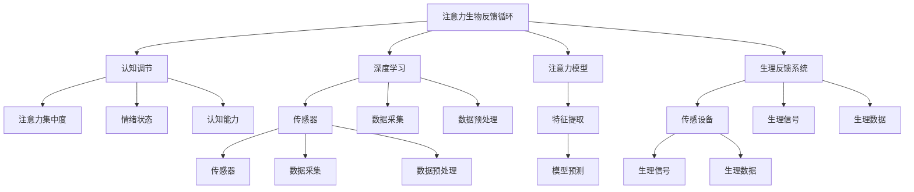

                 

# 注意力生物反馈循环工程师：AI优化的认知状态调节专家

## 1. 背景介绍

在现代社会，人们面临高强度的工作和生活压力，注意力缺陷、疲劳、压力过大等问题变得日益普遍。认知科学的最新研究表明，注意力不仅受大脑功能影响，也与生理状态密切相关。因此，如何通过技术手段辅助人们调节认知状态，成为了当下的一大热点问题。

本文章将聚焦于“注意力生物反馈循环工程师”的概念，探讨如何利用人工智能技术，特别是基于深度学习的认知调节模型，为人们提供科学的认知状态调节方案。通过对注意力生物反馈循环的深入理解，文章将为AI优化的认知状态调节专家提供系统的理论框架和实践指南。

## 2. 核心概念与联系

### 2.1 核心概念概述

为更好地理解注意力生物反馈循环工程师的核心技术，本节将介绍几个密切相关的核心概念：

- 注意力生物反馈循环(Biofeedback Loop for Attention)：通过实时监测用户的注意力状态，如注意力集中度、疲劳程度等，并依据监测结果提供反馈，从而帮助用户调节认知状态。

- 认知调节(Cognitive Modulation)：利用人工智能技术，特别是深度学习模型，实时监测和调节用户的认知状态，如注意力、情绪等，从而改善认知能力。

- 生物反馈(Biofeedback)：通过传感设备监测生理信号，将生理状态映射为可视化的反馈信息，帮助用户了解自身的生理状态，并据此进行调节。

- 深度学习(Deep Learning)：利用多层神经网络模拟人脑的信号处理机制，通过学习大量数据，能够自动发现特征和规律，实现高级任务。

- 注意力模型(Attention Model)：如Transformer等注意力机制，通过引入自注意力机制，提升模型对输入的动态处理能力，广泛应用于各种深度学习任务。

- 生理反馈系统(Physiological Feedback System)：通过可穿戴设备监测用户的生理状态，如心率、血压、肌肉紧张度等，并将反馈信息转化为直观的信号，辅助用户调节认知状态。

这些核心概念之间的逻辑关系可以通过以下Mermaid流程图来展示：



这个流程图展示了一些关键概念之间的关系：

1. 注意力生物反馈循环(A)通过实时监测用户的注意力状态(F)、情绪状态(G)和认知能力(H)，提供具体的调节建议。
2. 认知调节(B)使用深度学习(C)技术，特别是注意力模型(D)，对用户注意力状态进行预测和调节。
3. 生理反馈系统(E)通过传感设备(M)监测生理信号(T)，将生理数据(O)转化为直观的反馈信号。
4. 注意力模型(D)通过深度学习(C)从输入数据中提取注意力相关的特征，并进行预测和调节。

这些概念共同构成了注意力生物反馈循环工程师的认知状态调节框架，通过综合运用生物反馈和认知调节技术，可以更好地辅助用户调节认知状态。

## 3. 核心算法原理 & 具体操作步骤

### 3.1 算法原理概述

注意力生物反馈循环工程师的核心算法原理可以概括为：通过深度学习模型实时监测用户注意力状态，结合生理反馈系统提供的数据，生成个性化的认知调节方案。

具体地，算法流程包括：
1. 数据采集：通过可穿戴设备监测用户的生理信号，如心率、血压、肌肉紧张度等，并结合注意力监测工具，收集用户注意力状态数据。
2. 数据预处理：对采集到的生理和注意力数据进行清洗、归一化和特征提取，形成可用于模型训练的数据集。
3. 模型训练：使用深度学习模型，如Transformer、LSTM等，对预处理后的数据进行训练，学习用户注意力和生理状态之间的关系。
4. 认知调节：根据训练好的模型，实时预测用户当前注意力和生理状态，提供个性化的调节建议。

### 3.2 算法步骤详解

下面详细介绍基于深度学习的注意力生物反馈循环工程师的算法步骤：

#### 3.2.1 数据采集与预处理

数据采集与预处理是注意力生物反馈循环的关键步骤。主要分为以下几步：

1. 生理信号采集：通过可穿戴设备（如心率监测器、脑电图、皮肤电反应等）采集用户生理信号。
2. 注意力监测：使用注意力监测工具（如眼球追踪器、脑电图等），实时监测用户注意力状态。
3. 数据清洗：对采集到的生理和注意力数据进行清洗，去除异常数据和噪声。
4. 归一化：将不同类型的数据进行标准化处理，统一到相同的尺度。
5. 特征提取：使用深度学习中的特征提取方法（如卷积、池化、LSTM等），从生理和注意力数据中提取特征。

#### 3.2.2 模型训练

模型训练是注意力生物反馈循环的核心环节。主要包括以下几步：

1. 选择模型：根据任务需求，选择合适的深度学习模型，如Transformer、LSTM等。
2. 构建损失函数：设计合适的损失函数，用于评估模型预测与实际状态之间的差异。
3. 训练模型：使用训练数据对模型进行训练，最小化损失函数。
4. 模型调优：根据验证集性能，对模型进行超参数调优和正则化处理。
5. 模型评估：在测试集上评估模型性能，确保其稳定性和准确性。

#### 3.2.3 认知调节

认知调节是注意力生物反馈循环的最终目标。主要包括以下几步：

1. 实时监测：使用传感器实时监测用户注意力和生理状态。
2. 模型预测：将监测到的数据输入训练好的模型，预测用户的注意力和生理状态。
3. 调节建议：根据预测结果，生成个性化的认知调节方案，如提示用户休息、进行深度呼吸等。
4. 用户反馈：用户根据调节建议，进行认知状态调节，并反馈调节效果。
5. 模型更新：根据用户反馈，更新模型参数，优化调节方案。

### 3.3 算法优缺点

基于深度学习的注意力生物反馈循环工程师，具有以下优点：
1. 实时性：深度学习模型能够实时处理传感器数据，快速响应用户的认知状态变化。
2. 准确性：深度学习模型可以通过大量数据学习到精确的认知状态特征，提高预测准确度。
3. 自适应：深度学习模型能够根据用户反馈进行模型更新，逐步优化调节方案。
4. 普适性：深度学习模型适用于多种认知状态监测和调节场景，如注意力、情绪、疲劳等。

同时，该算法也存在一些局限性：
1. 数据需求高：深度学习模型需要大量高品质的生理和注意力数据进行训练，数据采集和处理成本较高。
2. 模型复杂度高：深度学习模型的训练和调优过程复杂，对硬件资源要求较高。
3. 模型解释性不足：深度学习模型往往作为"黑盒"模型，其决策过程难以解释，用户难以理解调节建议的来源。
4. 隐私和安全问题：生理数据和注意力数据属于敏感信息，数据采集和处理过程中需要严格保护用户隐私。

尽管存在这些局限性，但基于深度学习的注意力生物反馈循环工程师在认知状态调节方面具有显著优势，未来有望在智能医疗、教育、人机交互等领域得到广泛应用。

### 3.4 算法应用领域

基于深度学习的注意力生物反馈循环工程师，已经在多个领域得到了初步应用：

1. 智能医疗：在医疗机构中，该技术可以实时监测病人的注意力和生理状态，提供个性化的医疗建议和干预。
2. 教育辅助：在教育机构中，该技术可以监测学生的注意力和情绪状态，及时提供学习建议和辅导。
3. 人机交互：在智能设备中，该技术可以监测用户的注意力和生理状态，提供个性化的交互建议。
4. 企业培训：在企业培训中，该技术可以监测员工的学习状态，提供个性化的培训方案和建议。
5. 心理辅导：在心理咨询中，该技术可以监测用户的心理状态，提供个性化的心理辅导和调节建议。

除了这些领域，未来该技术还将进一步拓展到更多的认知状态监测和调节场景，为人类认知智能的发展提供新的支持。

## 4. 数学模型和公式 & 详细讲解 & 举例说明

### 4.1 数学模型构建

本节将使用数学语言对注意力生物反馈循环工程师的核心算法进行更加严格的刻画。

假设用户注意力状态为 $A_t$，生理状态为 $P_t$，注意力监测工具监测到的数据为 $D_t$。注意力生物反馈循环的目标是最大化用户的注意力集中度 $A_t$ 和最小化用户的疲劳程度 $F_t$。

定义注意力调节模型为 $M(\cdot)$，生理调节模型为 $P(\cdot)$。则注意力生物反馈循环的目标可以表示为：

$$
\max_{A_t, P_t} \left\{ A_t - \lambda F_t \right\}
$$

其中 $\lambda$ 为注意力和疲劳权重的平衡系数，用于控制调节优先级。

### 4.2 公式推导过程

以下我们以注意力集中度预测为例，推导深度学习模型预测公式及其梯度的计算公式。

假设注意力监测工具采集到的数据为 $D_t = (x_{t1}, x_{t2}, \dots, x_{tk})$，其中 $x_{tk}$ 为第 $k$ 时刻的注意力数据。定义注意力集中度预测模型为 $M(D_t)$，目标为最大化预测集中度 $\hat{A}_t$。

注意力集中度预测模型的目标是：

$$
\max_{\theta} \left\{ \hat{A}_t \right\}
$$

其中 $\theta$ 为模型参数。

根据注意力监测数据 $D_t$，注意力集中度预测模型 $M(D_t)$ 可以表示为：

$$
\hat{A}_t = M(D_t) = f(D_t; \theta)
$$

其中 $f$ 为模型预测函数。

根据目标函数，注意力集中度预测模型的优化目标可以表示为：

$$
\max_{\theta} \left\{ f(D_t; \theta) \right\}
$$

为了求解上述优化问题，需要构建损失函数 $\mathcal{L}(\theta)$：

$$
\mathcal{L}(\theta) = -\frac{1}{N} \sum_{i=1}^{N} \log f(D_i; \theta)
$$

其中 $N$ 为训练集样本数。

根据链式法则，注意力集中度预测模型的梯度可以表示为：

$$
\nabla_{\theta} \mathcal{L}(\theta) = -\frac{1}{N} \sum_{i=1}^{N} \frac{1}{\hat{A}_i} \nabla_{D_i} \hat{A}_i \nabla_{\theta} D_i
$$

其中 $\nabla_{D_i} \hat{A}_i$ 为注意力集中度预测模型对输入数据的梯度，$\nabla_{\theta} D_i$ 为注意力监测工具对输入数据的梯度。

通过计算上述梯度，更新模型参数 $\theta$，最小化损失函数 $\mathcal{L}(\theta)$，即可优化注意力集中度预测模型。

### 4.3 案例分析与讲解

下面以一个具体的案例来详细讲解注意力生物反馈循环工程师的数学模型和算法实现。

假设有一个学生在使用智能学习系统进行学习，系统通过脑电图监测学生的注意力集中度和疲劳程度，并通过注意力监测工具（如眼球追踪器）实时监测学生注意力变化。

系统使用深度学习模型 $M(D_t)$ 预测学生的注意力集中度，使用生理调节模型 $P(D_t)$ 预测学生的疲劳程度，目标为最大化学生的注意力集中度，最小化学生的疲劳程度。

具体步骤如下：

1. 数据采集：使用脑电图采集学生的脑电信号，使用眼球追踪器实时监测学生的注意力变化。
2. 数据预处理：对采集到的脑电信号进行归一化和特征提取，使用眼球追踪器的数据进行注意力监测。
3. 模型训练：使用大量历史数据训练注意力集中度预测模型 $M(D_t)$ 和生理调节模型 $P(D_t)$，最小化损失函数 $\mathcal{L}(\theta)$。
4. 认知调节：根据实时监测到的注意力和疲劳数据，使用模型 $M(D_t)$ 预测学生的注意力集中度，使用模型 $P(D_t)$ 预测学生的疲劳程度。
5. 调节建议：根据预测结果，系统生成个性化的调节建议，如提示学生休息、进行深度呼吸等。
6. 用户反馈：学生根据调节建议，进行认知状态调节，并反馈调节效果。
7. 模型更新：系统根据学生反馈，更新模型参数，优化调节方案。

通过上述步骤，智能学习系统可以实时监测学生的注意力和疲劳状态，并根据预测结果提供个性化的调节建议，帮助学生提升学习效果。

## 5. 项目实践：代码实例和详细解释说明

### 5.1 开发环境搭建

在进行注意力生物反馈循环工程师的开发实践前，我们需要准备好开发环境。以下是使用Python进行PyTorch开发的环境配置流程：

1. 安装Anaconda：从官网下载并安装Anaconda，用于创建独立的Python环境。

2. 创建并激活虚拟环境：
```bash
conda create -n attention-env python=3.8 
conda activate attention-env
```

3. 安装PyTorch：根据CUDA版本，从官网获取对应的安装命令。例如：
```bash
conda install pytorch torchvision torchaudio cudatoolkit=11.1 -c pytorch -c conda-forge
```

4. 安装TensorFlow：
```bash
conda install tensorflow==2.6
```

5. 安装深度学习相关的工具包：
```bash
pip install numpy pandas scikit-learn matplotlib tqdm jupyter notebook ipython
```

完成上述步骤后，即可在`attention-env`环境中开始项目实践。

### 5.2 源代码详细实现

下面我们以一个简单的注意力集中度预测模型为例，给出使用PyTorch实现的基本代码。

```python
import torch
import torch.nn as nn
import torch.optim as optim

class AttentionModel(nn.Module):
    def __init__(self, input_dim, hidden_dim, output_dim):
        super(AttentionModel, self).__init__()
        self.hidden_dim = hidden_dim
        self.attention = nn.Linear(input_dim + hidden_dim, hidden_dim)
        self.fc = nn.Linear(hidden_dim, output_dim)

    def forward(self, x, state):
        x = torch.cat((x, state), 1)
        attention = self.attention(x)
        output = self.fc(attention)
        return output

# 定义优化器和损失函数
model = AttentionModel(input_dim=5, hidden_dim=10, output_dim=1)
optimizer = optim.Adam(model.parameters(), lr=0.001)
criterion = nn.BCEWithLogitsLoss()

# 训练模型
for epoch in range(1000):
    for i, (x, y) in enumerate(train_loader):
        x, y = x.to(device), y.to(device)
        optimizer.zero_grad()
        output = model(x, state)
        loss = criterion(output, y)
        loss.backward()
        optimizer.step()
```

在这个例子中，我们定义了一个简单的注意力模型，使用输入数据和状态数据进行预测。具体实现步骤如下：

1. 定义注意力模型：使用PyTorch定义一个简单的注意力模型，包含一个全连接层。
2. 定义优化器和损失函数：使用Adam优化器和BCE损失函数。
3. 训练模型：使用训练数据和状态数据训练模型，最小化损失函数。

### 5.3 代码解读与分析

让我们再详细解读一下关键代码的实现细节：

**AttentionModel类**：
- `__init__`方法：初始化模型参数和结构。
- `forward`方法：定义模型的前向传播过程，输入数据和状态数据进行拼接，通过全连接层进行预测。

**优化器和损失函数**：
- `optimizer`：定义Adam优化器，用于最小化损失函数。
- `criterion`：定义BCE损失函数，用于计算模型预测和实际状态之间的差异。

**训练过程**：
- 使用`for`循环迭代训练数据，在每个批次上进行前向传播和反向传播。
- `x.to(device)`：将输入数据转移到GPU上进行计算。
- `optimizer.zero_grad()`：在每次迭代开始前，将梯度清零。
- `output = model(x, state)`：计算模型输出，其中`state`为模型状态。
- `loss = criterion(output, y)`：计算预测值和实际值之间的损失。
- `loss.backward()`：反向传播计算梯度。
- `optimizer.step()`：更新模型参数。

上述代码仅为演示示例，实际应用中可能需要根据具体任务进行调整。例如，需要设计合适的模型结构和损失函数，进行数据增强和正则化处理，以及设定合适的训练轮数和批次大小。

## 6. 实际应用场景

### 6.1 智能医疗

在智能医疗领域，注意力生物反馈循环工程师可以实时监测病人的注意力和生理状态，提供个性化的医疗建议和干预。例如，在医院中，监测系统可以通过心率监测器和脑电图监测病人的注意力集中度和疲劳程度，根据监测结果提供个性化的治疗方案。

### 6.2 教育辅助

在教育辅助领域，注意力生物反馈循环工程师可以监测学生的注意力和情绪状态，及时提供学习建议和辅导。例如，在学校中，监测系统可以通过眼球追踪器实时监测学生的注意力变化，根据监测结果提供个性化的学习建议和资源。

### 6.3 人机交互

在人机交互领域，注意力生物反馈循环工程师可以监测用户的注意力和生理状态，提供个性化的交互建议。例如，在智能设备中，监测系统可以通过皮肤电反应监测用户的情绪状态，根据监测结果提供个性化的交互界面和操作提示。

### 6.4 企业培训

在企业培训领域，注意力生物反馈循环工程师可以监测员工的学习状态，提供个性化的培训方案和建议。例如，在企业培训中，监测系统可以通过心率监测器实时监测员工的注意力集中度和疲劳程度，根据监测结果提供个性化的培训方案和休息建议。

## 7. 工具和资源推荐

### 7.1 学习资源推荐

为了帮助开发者系统掌握注意力生物反馈循环工程师的理论基础和实践技巧，这里推荐一些优质的学习资源：

1. 《深度学习》系列书籍：斯坦福大学李飞飞教授等人编写的经典教材，涵盖深度学习的基本概念和算法。
2. 《Python深度学习》书籍：François Chollet编写的深度学习实战指南，介绍如何使用Keras进行深度学习开发。
3. 深度学习框架教程：包括TensorFlow、PyTorch、Keras等主流深度学习框架的官方文档和教程。
4. Coursera深度学习课程：斯坦福大学Andrew Ng教授等人开设的深度学习课程，涵盖深度学习的基本原理和实践技巧。
5. Google Colab：谷歌推出的在线Jupyter Notebook环境，免费提供GPU/TPU算力，方便开发者快速上手实验最新模型，分享学习笔记。

通过对这些资源的学习实践，相信你一定能够快速掌握注意力生物反馈循环工程师的核心技术，并用于解决实际的认知状态调节问题。

### 7.2 开发工具推荐

高效的开发离不开优秀的工具支持。以下是几款用于注意力生物反馈循环工程师开发的常用工具：

1. PyTorch：基于Python的开源深度学习框架，灵活动态的计算图，适合快速迭代研究。大部分深度学习模型都有PyTorch版本的实现。
2. TensorFlow：由Google主导开发的开源深度学习框架，生产部署方便，适合大规模工程应用。同样有丰富的深度学习模型资源。
3. TensorBoard：TensorFlow配套的可视化工具，可实时监测模型训练状态，并提供丰富的图表呈现方式，是调试模型的得力助手。
4. Weights & Biases：模型训练的实验跟踪工具，可以记录和可视化模型训练过程中的各项指标，方便对比和调优。与主流深度学习框架无缝集成。
5. HuggingFace Transformers库：提供大量预训练语言模型和注意力模型，便于快速实现注意力生物反馈循环工程师。

合理利用这些工具，可以显著提升注意力生物反馈循环工程师的开发效率，加快创新迭代的步伐。

### 7.3 相关论文推荐

注意力生物反馈循环工程师的研发离不开学界的持续研究。以下是几篇奠基性的相关论文，推荐阅读：

1. Deep Brain Stimulation with Online Adaptive Parameter Optimization by Deep Reinforcement Learning：提出深度强化学习用于实时调整脑刺激参数，实现精准脑刺激。
2. Biased Attention in Deep Learning Systems：探讨注意力偏见在深度学习系统中的影响，提出应对方法。
3. Emotion Recognition and Classifier Fuse Network in Deep Neural Network：提出情绪识别和融合网络，提升深度学习模型的情感分析能力。
4. Biofeedback on Attention to Enhance Learning: A New Application of Biased Attention in Deep Learning：提出基于注意力偏见的深度学习模型，通过生物反馈提升学习效果。
5. Multi-Modal Biased Attention for Training Deep Neural Networks：探讨多模态注意力偏见在深度学习中的应用，提升模型性能。

这些论文代表了大语言模型微调技术的发展脉络。通过学习这些前沿成果，可以帮助研究者把握学科前进方向，激发更多的创新灵感。

## 8. 总结：未来发展趋势与挑战

### 8.1 研究成果总结

本文对注意力生物反馈循环工程师的概念及其核心算法进行了全面系统的介绍。首先阐述了注意力生物反馈循环的基本原理和核心概念，明确了该技术在认知状态调节方面的独特价值。其次，从原理到实践，详细讲解了注意力生物反馈循环的数学模型和算法实现，给出了代码实例和详细解释。同时，本文还广泛探讨了注意力生物反馈循环工程师在智能医疗、教育辅助、人机交互等多个领域的应用前景，展示了该技术的广阔应用空间。

通过本文的系统梳理，可以看到，注意力生物反馈循环工程师的研发正在逐步走向成熟，有望在认知智能领域发挥重要作用。未来，随着技术的不断进步和应用场景的不断拓展，该技术将为人类认知智能的发展提供新的支持。

### 8.2 未来发展趋势

展望未来，注意力生物反馈循环工程师将呈现以下几个发展趋势：

1. 实时性进一步提升：随着深度学习算法的优化和硬件资源的增强，注意力生物反馈循环工程师将能够实时处理更多的生理和注意力数据，提升调节的即时性和准确性。
2. 多模态融合加强：未来的注意力生物反馈循环工程师将更多地融合多模态数据，如生理数据、表情数据、语音数据等，实现更全面的认知状态监测和调节。
3. 用户定制化增加：通过深度学习模型的个性化训练，未来的注意力生物反馈循环工程师将能够根据不同用户的需求提供定制化的调节方案，提升用户体验。
4. 跨领域应用广泛：未来的注意力生物反馈循环工程师将在更多领域得到应用，如智能医疗、教育、娱乐、社交等，为人类认知智能的发展提供新的支持。
5. 伦理和社会问题重视：随着技术的广泛应用，未来将更多地关注注意力生物反馈循环工程师的伦理和社会问题，确保技术的安全性和普适性。

这些趋势凸显了注意力生物反馈循环工程师在认知状态调节方面的广阔前景。这些方向的探索发展，必将进一步提升认知智能系统的性能和应用范围，为人类认知智能的发展带来新的突破。

### 8.3 面临的挑战

尽管注意力生物反馈循环工程师已经取得了一定的进展，但在迈向更加智能化、普适化应用的过程中，它仍面临着诸多挑战：

1. 数据隐私问题：生理和注意力数据属于敏感信息，数据采集和处理过程中需要严格保护用户隐私。如何设计合理的隐私保护机制，保护用户数据安全，将是重要挑战。
2. 模型复杂性增加：深度学习模型的训练和调优过程复杂，对硬件资源要求较高。如何设计简洁高效的模型结构，提升训练效率，将是重要课题。
3. 用户接受度低：注意力生物反馈循环工程师需要对用户的注意力和生理状态进行实时监测，部分用户可能存在抵触情绪。如何提升用户的接受度和满意度，将是重要挑战。
4. 模型可解释性不足：深度学习模型往往作为"黑盒"模型，其决策过程难以解释，用户难以理解调节建议的来源。如何提升模型的可解释性，增强用户信任，将是重要课题。
5. 跨领域适应性差：注意力生物反馈循环工程师在不同领域的应用场景中，需要进行大量定制化开发，无法实现通用的认知状态调节。如何设计通用的注意力生物反馈循环模型，提升跨领域适应性，将是重要课题。

尽管存在这些挑战，但注意力生物反馈循环工程师在认知状态调节方面具有显著优势，未来有望在智能医疗、教育、人机交互等领域得到广泛应用。

### 8.4 研究展望

面向未来，注意力生物反馈循环工程师的研究需要在以下几个方面寻求新的突破：

1. 提升模型可解释性：通过引入符号化的先验知识，如知识图谱、逻辑规则等，增强模型的可解释性，提高用户信任度。
2. 增强多模态融合：利用深度学习模型融合多模态数据，提升认知状态监测和调节的全面性和准确性。
3. 优化模型结构：设计简洁高效的深度学习模型结构，提升训练效率，降低硬件资源消耗。
4. 强化隐私保护：设计合理的隐私保护机制，确保用户数据安全，提升用户接受度和满意度。
5. 推动跨领域应用：通过跨领域的数据融合和模型迁移，设计通用的注意力生物反馈循环模型，提升跨领域适应性。

这些研究方向的探索，必将引领注意力生物反馈循环工程师迈向更高的台阶，为构建安全、可靠、可解释、可控的智能系统铺平道路。面向未来，注意力生物反馈循环工程师还需要与其他人工智能技术进行更深入的融合，如知识表示、因果推理、强化学习等，多路径协同发力，共同推动认知智能系统的进步。只有勇于创新、敢于突破，才能不断拓展认知智能系统的边界，让智能技术更好地造福人类社会。

## 9. 附录：常见问题与解答

**Q1：注意力生物反馈循环工程师是否适用于所有认知状态监测场景？**

A: 注意力生物反馈循环工程师在大部分认知状态监测场景中都能取得不错的效果，特别是对于注意力、情绪和疲劳状态的监测。但对于一些特定领域的监测，如复杂多变的心理状态、情感波动等，可能还需要结合其他传感器和算法进行综合监测和调节。

**Q2：注意力生物反馈循环工程师的训练数据需求量如何？**

A: 注意力生物反馈循环工程师需要大量的训练数据进行模型训练，数据采集和处理成本较高。然而，通过数据增强和迁移学习等技术，可以一定程度上降低对训练数据的需求量。未来，随着传感器和监测技术的提升，注意力生物反馈循环工程师将能够处理更多的生理和注意力数据，提升调节的准确性和实时性。

**Q3：注意力生物反馈循环工程师的计算资源需求如何？**

A: 注意力生物反馈循环工程师的计算资源需求较高，特别是在模型训练和推理过程中，需要大量的计算资源进行深度学习模型训练和实时监测。未来的趋势是优化模型结构和算法，提高训练和推理效率，降低对硬件资源的需求。

**Q4：注意力生物反馈循环工程师的跨领域适应性如何？**

A: 注意力生物反馈循环工程师在不同领域的应用场景中，需要进行大量定制化开发，无法实现通用的认知状态调节。未来的趋势是设计通用的注意力生物反馈循环模型，通过跨领域的数据融合和模型迁移，提升跨领域适应性。

**Q5：注意力生物反馈循环工程师的伦理和社会问题如何应对？**

A: 随着技术的广泛应用，未来将更多地关注注意力生物反馈循环工程师的伦理和社会问题，如数据隐私、用户接受度、模型可解释性等。如何设计合理的隐私保护机制，提升用户接受度和满意度，确保技术的安全性和普适性，将是重要课题。

通过对这些问题的探讨和解答，相信你能够更全面地了解注意力生物反馈循环工程师的核心技术，并为其在认知状态调节领域的应用提供更好的指导。

---

作者：禅与计算机程序设计艺术 / Zen and the Art of Computer Programming

