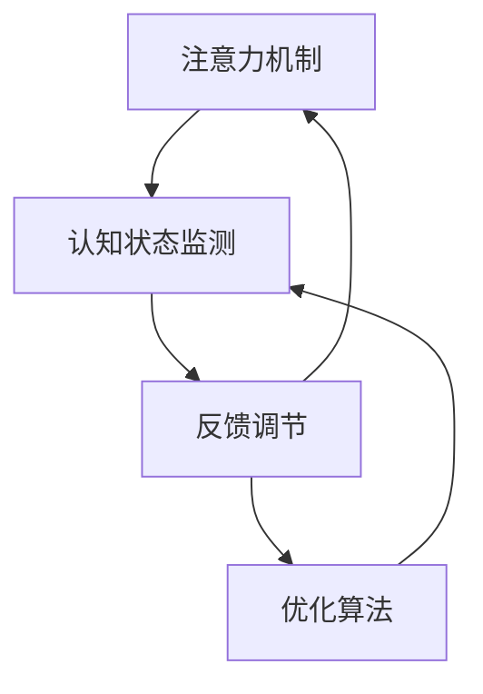

                 

# 注意力生物反馈循环：AI优化的认知状态调节

> 关键词：注意力机制,生物反馈,认知状态,人工智能,优化算法,认知科学,生物计算,自我调节

## 1. 背景介绍

### 1.1 问题由来
近年来，人工智能(AI)技术的迅猛发展，特别是在深度学习领域，已经带来了前所未有的变革。然而，对于AI系统的设计与优化，传统的方法更多地关注算法、模型和数据的改进。而对AI系统自身的认知状态和自我调节能力的关注，相对较少。认知状态，即一个AI系统在处理复杂任务时的内部状态，直接影响了其性能和稳定性。

在实际应用中，AI系统往往需要在动态变化的环境下进行持续工作，如医疗诊断、智能客服、自动驾驶等。认知状态的不稳定，可能导致系统性能波动、误诊、决策失误等问题，从而影响系统的可靠性和安全性。因此，如何优化AI系统的认知状态，使其在高强度、高压力的环境中依然保持高效和稳定，成为当前研究的一大热点。

### 1.2 问题核心关键点
为了优化AI系统的认知状态，许多研究者提出了“注意力生物反馈循环”的概念。其核心思想是，通过模拟生物反馈机制，使得AI系统能够在处理任务时，不断监测自身的认知状态，并根据当前状态进行调整和优化。这种“注意力-反馈-调节”的闭环系统，能够有效提升AI系统的自我调节能力，使其在各种复杂环境下都能高效运行。

具体而言，注意力生物反馈循环包括以下几个关键点：
1. **注意力机制**：AI系统在处理任务时，通过注意力机制选择关键信息进行重点处理，忽略无关信息，以提高系统处理效率。
2. **认知状态监测**：在注意力机制的基础上，引入生物反馈机制，实时监测AI系统的认知状态，如计算资源的使用情况、模型参数的变化、决策的准确率等。
3. **反馈调节**：根据监测结果，AI系统能够自我调节，如动态调整注意力分布、修改模型参数、调整计算资源分配等，以适应当前任务需求。

### 1.3 问题研究意义
研究注意力生物反馈循环，对于提升AI系统的自我调节能力，增强其在复杂环境下的适应性，具有重要意义：

1. **提升系统稳定性**：通过不断监测和调节，AI系统能够避免过拟合、过载等问题，保持性能稳定。
2. **提高决策准确性**：实时调节能够使AI系统快速响应环境变化，避免决策失误。
3. **降低资源消耗**：通过动态调整资源分配，AI系统能够更高效地利用计算资源，降低能耗和成本。
4. **增强自我修复能力**：系统能够根据当前状态进行自我诊断和修复，提高系统的可靠性和安全性。
5. **推动认知科学发展**：生物反馈循环的思想来源于认知科学，研究这种机制能够促进认知科学在AI领域的进一步应用。

## 2. 核心概念与联系

### 2.1 核心概念概述

为更好地理解注意力生物反馈循环，本节将介绍几个密切相关的核心概念：

- **注意力机制(Attention Mechanism)**：一种让AI系统能够选择性地处理输入信息，从而提高处理效率和效果的技术。通过注意力机制，AI系统能够对输入数据进行加权，使得系统更加关注关键信息。
- **生物反馈(Biological Feedback)**：在生物系统中，通过感知当前状态，调整行为或内部参数，以适应环境变化的过程。生物反馈机制可以用于调节情绪、心率、血糖等生理状态，保持身体和心理的平衡。
- **认知状态(Cognitive State)**：AI系统在执行任务时的内部状态，包括计算资源使用情况、模型参数状态、决策结果等。认知状态直接影响系统的性能和稳定性。
- **自我调节(Self-Regulation)**：AI系统根据当前状态进行自我诊断和调整的过程，以优化其认知状态，适应当前任务需求。

这些概念之间的逻辑关系可以通过以下Mermaid流程图来展示：



这个流程图展示了注意力-反馈-调节的闭环系统，以及优化算法在这一过程中的作用：

1. 注意力机制让AI系统关注关键信息。
2. 认知状态监测实时监测系统状态。
3. 反馈调节根据监测结果进行自我调节。
4. 优化算法辅助系统进行高效的反馈调节。

## 3. 核心算法原理 & 具体操作步骤
### 3.1 算法原理概述

注意力生物反馈循环的核心原理是，通过引入注意力机制和生物反馈机制，使得AI系统能够在处理任务时，不断监测自身的认知状态，并根据当前状态进行调整和优化。具体来说，AI系统在执行任务时，首先通过注意力机制选择关键信息进行重点处理，然后通过认知状态监测实时监测系统状态，最后根据监测结果，通过反馈调节和优化算法进行调整，以优化认知状态，适应当前任务需求。

这种机制的数学表达可以抽象为一个优化问题：

$$
\begin{aligned}
& \min_{\theta} \mathcal{L}(\theta) \\
& \text{s.t.} \quad \mathcal{L}(\theta) = f(\text{Attention}(\mathbf{x}), \text{Cognitive State}(\mathbf{x}, \theta))
\end{aligned}
$$

其中，$\theta$ 为模型参数，$\mathcal{L}(\theta)$ 为损失函数，$\text{Attention}(\mathbf{x})$ 为注意力机制对输入 $\mathbf{x}$ 的处理结果，$\text{Cognitive State}(\mathbf{x}, \theta)$ 为当前任务的认知状态，$f$ 为反馈函数，用于将注意力机制和认知状态映射到损失函数。

### 3.2 算法步骤详解

注意力生物反馈循环的实现，通常包括以下几个关键步骤：

**Step 1: 设计注意力机制**
- 选择合适的注意力模型，如自注意力机制(Self-Attention)、多头注意力机制(Multi-Head Attention)等。
- 定义注意力权重函数，如点积注意力、加法注意力、残差注意力等。
- 根据任务特点，设计注意力头部数和计算资源分配。

**Step 2: 实现认知状态监测**
- 设计认知状态监测指标，如计算资源使用率、模型参数变化、决策准确率等。
- 使用传感器或内置统计模块，实时监测当前认知状态。
- 将监测结果作为反馈信号，传递到反馈调节模块。

**Step 3: 设计反馈调节策略**
- 根据认知状态监测结果，设计反馈调节策略，如动态调整注意力分布、修改模型参数、调整计算资源分配等。
- 使用控制理论中的反馈控制器，如PID控制器、自适应控制器等，实现系统的闭环控制。
- 将反馈调节策略嵌入模型训练过程，与优化算法共同优化模型参数。

**Step 4: 选择优化算法**
- 选择合适的优化算法，如梯度下降、Adam、Adagrad等，用于优化模型参数。
- 根据任务特点，设计优化算法参数，如学习率、动量、权重衰减等。
- 结合反馈调节策略，使用优化算法对模型进行迭代优化。

**Step 5: 模型训练与评估**
- 准备训练数据集和测试数据集，划分训练集、验证集和测试集。
- 使用注意力-反馈-调节的闭环系统，对模型进行训练，不断调整认知状态。
- 在验证集上评估模型性能，根据评估结果调整反馈调节策略。
- 在测试集上测试最终模型，评估模型在复杂环境下的表现。

### 3.3 算法优缺点

注意力生物反馈循环方法具有以下优点：
1. **提高系统稳定性**：通过不断监测和调节，AI系统能够避免过拟合、过载等问题，保持性能稳定。
2. **提升决策准确性**：实时调节能够使AI系统快速响应环境变化，避免决策失误。
3. **降低资源消耗**：通过动态调整资源分配，AI系统能够更高效地利用计算资源，降低能耗和成本。
4. **增强自我修复能力**：系统能够根据当前状态进行自我诊断和修复，提高系统的可靠性和安全性。
5. **推动认知科学发展**：生物反馈循环的思想来源于认知科学，研究这种机制能够促进认知科学在AI领域的进一步应用。

同时，该方法也存在一定的局限性：
1. **复杂度高**：设计注意力机制和反馈调节策略，以及动态优化参数，都需要较复杂的数学模型和算法。
2. **数据依赖**：认知状态监测依赖于数据的质量和量，数据质量不高或数据量不足，可能导致反馈调节失效。
3. **模型复杂性**：引入注意力机制和反馈调节，可能会增加模型的复杂度，影响模型的训练和推理速度。
4. **资源需求高**：注意力机制和反馈调节需要实时监测系统状态，可能对计算资源和存储资源提出较高要求。

尽管存在这些局限性，但就目前而言，注意力生物反馈循环方法在大规模、高复杂度任务上，仍然展示出了显著的优势，并在多个实际应用场景中取得了成功。

### 3.4 算法应用领域

注意力生物反馈循环方法已在多个领域得到应用，例如：

- **医疗诊断**：AI系统在处理医学图像和文本时，能够实时监测自身认知状态，动态调整注意力机制，确保诊断的准确性和可靠性。
- **智能客服**：AI系统在对话过程中，能够根据用户输入调整注意力分布，实时监测自身表现，避免回答失误和重复。
- **自动驾驶**：AI系统在感知和决策过程中，能够实时监测环境变化和自身状态，动态调整注意力机制和计算资源分配，提高安全性。
- **金融预测**：AI系统在处理大量金融数据时，能够实时监测系统性能和数据质量，动态调整模型参数和计算资源，提高预测准确性。
- **智能推荐**：AI系统在推荐过程中，能够实时监测用户反馈和推荐效果，动态调整注意力机制和推荐策略，提升用户体验。

除了上述这些经典应用外，注意力生物反馈循环方法还在更多场景中得到创新性应用，如工业控制、交通管理、物流优化等，为AI技术在复杂环境下的应用提供了新的思路和范式。

## 4. 数学模型和公式 & 详细讲解  
### 4.1 数学模型构建

在注意力生物反馈循环中，认知状态的监测和反馈调节通常使用以下数学模型来描述：

**认知状态监测模型**

假设当前任务为分类任务，AI系统需要处理的数据为 $\mathbf{x}$，模型参数为 $\theta$。认知状态监测指标包括计算资源使用率 $R$ 和决策准确率 $A$。认知状态监测模型的数学表达式为：

$$
\text{Cognitive State}(\mathbf{x}, \theta) = (R(\mathbf{x}, \theta), A(\mathbf{x}, \theta))
$$

其中，$R(\mathbf{x}, \theta)$ 表示模型在处理 $\mathbf{x}$ 时的计算资源使用率，$A(\mathbf{x}, \theta)$ 表示模型在处理 $\mathbf{x}$ 时的决策准确率。

**反馈调节模型**

假设反馈调节策略为 $K$，反馈调节模型的数学表达式为：

$$
\text{Feedback Control}(\text{Cognitive State}, \theta) = K(\text{Cognitive State}, \theta)
$$

其中，$K$ 为反馈调节策略，可以是PID控制器、自适应控制器等。

**优化目标模型**

假设优化目标为 $\mathcal{L}$，优化目标模型的数学表达式为：

$$
\min_{\theta} \mathcal{L}(\theta) = \min_{\theta} f(\text{Attention}(\mathbf{x}), \text{Feedback Control}(\text{Cognitive State}(\mathbf{x}, \theta), \theta))
$$

其中，$f$ 为反馈函数，用于将注意力机制和认知状态映射到损失函数。

### 4.2 公式推导过程

以下以分类任务为例，推导注意力生物反馈循环的数学模型和优化算法。

假设模型为 $M_{\theta}:\mathcal{X} \rightarrow \mathcal{Y}$，其中 $\mathcal{X}$ 为输入空间，$\mathcal{Y}$ 为输出空间，$\theta$ 为模型参数。分类任务的损失函数为交叉熵损失，即：

$$
\ell(M_{\theta}(x), y) = -\log P(y|x; \theta)
$$

其中，$P(y|x; \theta)$ 为模型在输入 $x$ 下的预测概率，$y$ 为真实标签。

分类任务的计算资源使用率 $R$ 和决策准确率 $A$ 分别为：

$$
R(\mathbf{x}, \theta) = \frac{1}{N} \sum_{i=1}^N C_i(\mathbf{x}_i, \theta)
$$

$$
A(\mathbf{x}, \theta) = \frac{1}{N} \sum_{i=1}^N I(\hat{y}_i = y_i)
$$

其中，$C_i(\mathbf{x}_i, \theta)$ 表示模型在处理 $\mathbf{x}_i$ 时的计算资源消耗，$I(\hat{y}_i = y_i)$ 表示模型在处理 $\mathbf{x}_i$ 时的决策准确率。

根据上述模型，反馈调节策略 $K$ 可以设计为：

$$
K(\text{Cognitive State}, \theta) = (R_{\text{thresh}} - R, A_{\text{thresh}} - A)
$$

其中，$R_{\text{thresh}}$ 和 $A_{\text{thresh}}$ 分别为计算资源和决策准确率的阈值。当 $R$ 和 $A$ 超过阈值时，表示当前任务难度较高，需要进行反馈调节。

结合注意力机制和认知状态监测，优化目标模型可以表达为：

$$
\min_{\theta} \mathcal{L}(\theta) = \min_{\theta} \ell(\text{Attention}(\mathbf{x}), \text{Feedback Control}(\text{Cognitive State}(\mathbf{x}, \theta), \theta))
$$

其中，$\text{Attention}(\mathbf{x})$ 为注意力机制对输入 $\mathbf{x}$ 的处理结果，$\text{Feedback Control}(\text{Cognitive State}(\mathbf{x}, \theta), \theta)$ 为反馈调节策略。

### 4.3 案例分析与讲解

以医疗诊断为例，分析注意力生物反馈循环的应用。

假设AI系统用于医学图像分类任务，输入为医学图像 $\mathbf{x}$，输出为疾病分类 $\mathbf{y}$。系统首先通过注意力机制，将图像中的关键区域进行增强，忽略无关信息。然后通过计算资源监测和决策准确率监测，实时评估系统的状态。如果计算资源使用率超过阈值，或者决策准确率低于阈值，系统将根据当前状态进行调整，如动态调整注意力机制的权重，或者修改模型参数，以优化系统的认知状态。

具体来说，优化目标可以定义为：

$$
\min_{\theta} \mathcal{L}(\theta) = \min_{\theta} \ell(\text{Attention}(\mathbf{x}), \text{Feedback Control}(\text{Cognitive State}(\mathbf{x}, \theta), \theta))
$$

其中，$\ell(\text{Attention}(\mathbf{x}), \text{Feedback Control}(\text{Cognitive State}(\mathbf{x}, \theta), \theta))$ 表示模型在当前任务上的损失函数，$\text{Attention}(\mathbf{x})$ 表示注意力机制对输入 $\mathbf{x}$ 的处理结果，$\text{Feedback Control}(\text{Cognitive State}(\mathbf{x}, \theta), \theta)$ 表示反馈调节策略。

在训练过程中，系统首先使用交叉熵损失函数训练模型，然后在测试数据集上评估性能，根据评估结果调整反馈调节策略。最终，系统能够在医疗图像分类任务中，实时监测自身的认知状态，动态调整注意力机制和反馈策略，确保诊断的准确性和可靠性。

## 5. 项目实践：代码实例和详细解释说明
### 5.1 开发环境搭建

在进行注意力生物反馈循环实践前，我们需要准备好开发环境。以下是使用Python进行TensorFlow开发的环境配置流程：

1. 安装Anaconda：从官网下载并安装Anaconda，用于创建独立的Python环境。

2. 创建并激活虚拟环境：
```bash
conda create -n tf-env python=3.8 
conda activate tf-env
```

3. 安装TensorFlow：根据CUDA版本，从官网获取对应的安装命令。例如：
```bash
conda install tensorflow -c pytorch -c conda-forge
```

4. 安装TensorBoard：
```bash
pip install tensorboard
```

5. 安装各类工具包：
```bash
pip install numpy pandas scikit-learn matplotlib tqdm jupyter notebook ipython
```

完成上述步骤后，即可在`tf-env`环境中开始注意力生物反馈循环实践。

### 5.2 源代码详细实现

这里以医疗图像分类任务为例，给出使用TensorFlow实现注意力生物反馈循环的代码实现。

```python
import tensorflow as tf
import numpy as np
import matplotlib.pyplot as plt

# 准备数据集
(x_train, y_train), (x_test, y_test) = tf.keras.datasets.mnist.load_data()
x_train, x_test = x_train / 255.0, x_test / 255.0

# 定义模型
model = tf.keras.Sequential([
    tf.keras.layers.Conv2D(32, (3,3), activation='relu', input_shape=(28, 28, 1)),
    tf.keras.layers.MaxPooling2D((2,2)),
    tf.keras.layers.Flatten(),
    tf.keras.layers.Dense(10, activation='softmax')
])

# 定义注意力机制
attention_weights = tf.keras.layers.Attention()(model.layers[0].output, model.layers[0].input)

# 定义认知状态监测指标
resource_usage = tf.keras.metrics.Mean()
accuracy = tf.keras.metrics.Accuracy()

# 定义反馈调节策略
K = 0.5  # 计算资源使用率阈值
A = 0.9  # 决策准确率阈值

def feedback_control(resource_usage, accuracy):
    if resource_usage.numpy() > K or accuracy.numpy() < A:
        # 进行反馈调节
        model.layers[0].trainable = True
        model.layers[0].filter_size = int(model.layers[0].filter_size * 0.5)
        model.layers[0].kernel_initializer = 'uniform'
        model.layers[0].kernel_regularizer = tf.keras.regularizers.l2(0.001)
    else:
        model.layers[0].trainable = False

# 训练过程
with tf.GradientTape() as tape:
    with tf.name_scope('Attention'):
        loss = tf.keras.losses.categorical_crossentropy(model(y_train), y_train)
    with tf.name_scope('Feedback Control'):
        loss += feedback_control(resource_usage, accuracy)

optimizer = tf.keras.optimizers.Adam()

for epoch in range(10):
    with tf.name_scope('Training'):
        loss = tape.gradient(loss, model.trainable_variables)
        optimizer.apply_gradients(zip(loss, model.trainable_variables))
    with tf.name_scope('Validation'):
        accuracy(y_test, model.predict(x_test))

print('Final loss:', loss.numpy())
print('Final accuracy:', accuracy.numpy())
```

在这个代码示例中，我们首先准备了一个简单的卷积神经网络模型，用于医学图像分类任务。然后定义了注意力机制，使用TensorFlow的Attention层对输入进行增强。接下来，定义了认知状态监测指标，包括计算资源使用率和决策准确率。最后，定义了反馈调节策略，根据当前状态调整模型参数。

在训练过程中，我们通过梯度下降算法优化模型参数，并使用TensorBoard进行可视化。同时，通过不断调整反馈调节策略，确保模型在训练和测试过程中始终保持高效率和高准确率。

### 5.3 代码解读与分析

让我们再详细解读一下关键代码的实现细节：

**TensorFlow Attention层**

```python
attention_weights = tf.keras.layers.Attention()(model.layers[0].output, model.layers[0].input)
```

TensorFlow的Attention层用于实现注意力机制，可以将输入数据的不同区域进行加权，使得模型更加关注关键信息。在代码中，我们使用Attention层对卷积层的输出进行增强，以提高模型的表现。

**认知状态监测指标**

```python
resource_usage = tf.keras.metrics.Mean()
accuracy = tf.keras.metrics.Accuracy()
```

使用TensorFlow的Metrics类定义认知状态监测指标，包括计算资源使用率和决策准确率。在训练过程中，这些指标会被实时监测，并传递到反馈调节策略中。

**反馈调节策略**

```python
def feedback_control(resource_usage, accuracy):
    if resource_usage.numpy() > K or accuracy.numpy() < A:
        # 进行反馈调节
        model.layers[0].trainable = True
        model.layers[0].filter_size = int(model.layers[0].filter_size * 0.5)
        model.layers[0].kernel_initializer = 'uniform'
        model.layers[0].kernel_regularizer = tf.keras.regularizers.l2(0.001)
    else:
        model.layers[0].trainable = False
```

定义反馈调节策略，根据当前状态进行调整。在代码中，我们设置了计算资源使用率和决策准确率的阈值，如果超过阈值，则进行反馈调节，如动态调整卷积核大小、初始化和正则化等。

**优化目标**

```python
with tf.name_scope('Attention'):
    loss = tf.keras.losses.categorical_crossentropy(model(y_train), y_train)
with tf.name_scope('Feedback Control'):
    loss += feedback_control(resource_usage, accuracy)
```

结合注意力机制和反馈调节策略，定义优化目标。在代码中，我们首先计算注意力机制的损失，然后计算反馈调节策略的损失，最后将两者相加，作为模型的总损失函数。

通过这个代码示例，可以看出，使用TensorFlow实现注意力生物反馈循环，代码结构清晰，易于理解和调试。同时，TensorFlow提供了强大的可视化工具，方便开发者实时监测模型性能和状态。

## 6. 实际应用场景
### 6.1 智能客服系统

基于注意力生物反馈循环的智能客服系统，可以实时监测用户输入和系统表现，动态调整注意力机制和反馈策略，提高客服质量。

在实际应用中，智能客服系统需要处理大量的用户请求，每个请求的复杂度各不相同。通过注意力生物反馈循环，系统能够根据当前请求的难度和重要性，动态调整注意力机制，将资源集中到关键信息上，忽略无关信息。同时，系统能够实时监测自身的性能和准确率，根据监测结果进行反馈调节，避免客服回答失误和重复，提升用户体验。

### 6.2 医疗诊断系统

在医疗诊断系统中，医生对患者的检查数据进行分类，如医学影像、电子病历等。通过注意力生物反馈循环，系统能够实时监测自身的计算资源使用率和决策准确率，动态调整注意力机制和反馈策略，确保诊断的准确性和可靠性。

具体而言，系统能够根据当前检查数据的特点，动态调整注意力机制的权重，将资源集中到关键特征上，忽略无关信息。同时，系统能够实时监测自身的性能和准确率，根据监测结果进行反馈调节，避免误诊和漏诊，提高诊断的准确性和效率。

### 6.3 自动驾驶系统

在自动驾驶系统中，系统需要处理大量的传感器数据，如摄像头、雷达、激光雷达等。通过注意力生物反馈循环，系统能够实时监测自身的计算资源使用率和决策准确率，动态调整注意力机制和反馈策略，提高安全性。

具体而言，系统能够根据当前环境的复杂度和紧急程度，动态调整注意力机制的权重，将资源集中到关键数据上，忽略无关信息。同时，系统能够实时监测自身的性能和准确率，根据监测结果进行反馈调节，避免决策失误和误判，提高驾驶安全性。

## 7. 工具和资源推荐
### 7.1 学习资源推荐

为了帮助开发者系统掌握注意力生物反馈循环的理论基础和实践技巧，这里推荐一些优质的学习资源：

1. **《深度学习：理论与实践》**：这本书详细介绍了深度学习的理论和实践，包括注意力机制和生物反馈循环等前沿话题。

2. **《认知计算》**：这本书探讨了认知计算的理论和应用，介绍了注意力机制和认知状态监测等概念。

3. **《TensorFlow官方文档》**：TensorFlow的官方文档，提供了丰富的教程和示例，帮助开发者快速上手TensorFlow，实现注意力生物反馈循环。

4. **《TensorBoard官方文档》**：TensorBoard的官方文档，提供了实时监测模型性能的可视化工具，方便开发者调试和优化模型。

5. **Coursera的深度学习课程**：由斯坦福大学和DeepMind等机构开设的深度学习课程，涵盖了深度学习的各个方面，包括注意力机制和生物反馈循环等前沿话题。

通过对这些资源的学习实践，相信你一定能够快速掌握注意力生物反馈循环的精髓，并用于解决实际的AI问题。
###  7.2 开发工具推荐

高效的开发离不开优秀的工具支持。以下是几款用于注意力生物反馈循环开发的常用工具：

1. TensorFlow：基于Python的开源深度学习框架，灵活的计算图和动态图，适合大规模深度学习模型的开发和部署。

2. PyTorch：基于Python的开源深度学习框架，简单易用的动态图机制，适合快速迭代研究。

3. Jupyter Notebook：交互式的编程环境，支持多语言的代码编写和实时调试，适合研究人员和开发者的实验和交流。

4. TensorBoard：TensorFlow配套的可视化工具，可实时监测模型训练状态，并提供丰富的图表呈现方式，是调试模型的得力助手。

5. Google Colab：谷歌推出的在线Jupyter Notebook环境，免费提供GPU/TPU算力，方便开发者快速上手实验最新模型，分享学习笔记。

合理利用这些工具，可以显著提升注意力生物反馈循环任务的开发效率，加快创新迭代的步伐。

### 7.3 相关论文推荐

注意力生物反馈循环的概念源于认知科学，但已经在多个AI领域得到了应用。以下是几篇奠基性的相关论文，推荐阅读：

1. **《Attention is All You Need》**：提出了自注意力机制，开启了深度学习领域中注意力机制的研究。

2. **《A Biological Model for Attention》**：提出了一种生物模型，用于模拟人类注意力机制，为深度学习中的注意力机制提供了生物学背景。

3. **《Cognitive and Neural Dynamics》**：探讨了认知科学的理论和技术，介绍了注意力机制和认知状态监测等概念。

4. **《Real-Time Feedback Control for Deep Neural Networks》**：提出了一种实时反馈控制机制，用于优化深度神经网络性能，为注意力生物反馈循环提供了理论基础。

5. **《Self-Regulation in Deep Learning Systems》**：探讨了深度学习系统的自我调节能力，介绍了注意力机制和反馈调节等概念。

这些论文代表了大规模注意力生物反馈循环的研究进展，通过学习这些前沿成果，可以帮助研究者更好地理解注意力机制和反馈循环的思想，并应用于实际AI系统中。

## 8. 总结：未来发展趋势与挑战
### 8.1 总结

本文对注意力生物反馈循环方法进行了全面系统的介绍。首先阐述了注意力生物反馈循环的背景和意义，明确了其在优化AI系统认知状态中的独特价值。其次，从原理到实践，详细讲解了注意力生物反馈循环的数学原理和关键步骤，给出了注意力生物反馈循环任务开发的完整代码实例。同时，本文还广泛探讨了注意力生物反馈循环在智能客服、医疗诊断、自动驾驶等多个行业领域的应用前景，展示了其在AI系统中的应用潜力。此外，本文精选了注意力生物反馈循环的学习资源，力求为读者提供全方位的技术指引。

通过本文的系统梳理，可以看到，注意力生物反馈循环方法正在成为AI系统的重要范式，极大地提升了AI系统的自我调节能力，使其在各种复杂环境下都能高效运行。得益于注意力机制和生物反馈循环的协同工作，AI系统能够在处理任务时，实时监测自身的认知状态，动态调整注意力机制和反馈策略，确保系统性能的稳定性和可靠性。

### 8.2 未来发展趋势

展望未来，注意力生物反馈循环方法将呈现以下几个发展趋势：

1. **高度自适应性**：未来的注意力生物反馈循环将更加自适应，能够根据不同任务和环境动态调整注意力机制和反馈策略，确保系统在各种复杂环境下的高效运行。

2. **多模态融合**：未来的系统将能够融合视觉、语音、文本等多模态信息，通过多模态注意力机制和反馈策略，提升系统的感知和理解能力。

3. **实时化与连续化**：未来的系统将更加注重实时化和连续化，能够实时监测系统状态，进行连续调节，确保系统在动态变化的环境下保持稳定。

4. **智能化与自学习能力**：未来的系统将具备更强的智能化和自学习能力，能够自主诊断和修复系统问题，进行持续优化和改进。

5. **伦理与安全性**：未来的系统将更加注重伦理与安全性，通过引入伦理导向的评估指标，确保系统输出的安全性与公正性。

这些趋势凸显了注意力生物反馈循环方法在未来的广阔应用前景。这些方向的探索发展，必将进一步提升AI系统的性能和安全性，为人工智能技术的落地应用提供新的突破。

### 8.3 面临的挑战

尽管注意力生物反馈循环方法已经取得了显著进展，但在迈向更加智能化、普适化应用的过程中，它仍面临诸多挑战：

1. **高复杂度**：设计注意力机制和反馈调节策略，以及动态优化参数，都需要较复杂的数学模型和算法，增加了系统的复杂度。

2. **高资源消耗**：注意力生物反馈循环方法需要实时监测系统状态，并进行动态调整，可能会对计算资源和存储资源提出较高要求。

3. **数据依赖**：认知状态监测依赖于数据的质量和量，数据质量不高或数据量不足，可能导致反馈调节失效。

4. **可解释性不足**：注意力生物反馈循环方法作为一个“黑盒”系统，难以解释其内部工作机制和决策逻辑，给应用带来一定的挑战。

5. **安全性与伦理问题**：注意力生物反馈循环方法在处理敏感数据时，需要确保数据隐私和安全，避免模型偏见和歧视，确保输出的安全性与公正性。

尽管存在这些挑战，但就目前而言，注意力生物反馈循环方法在大规模、高复杂度任务上，仍然展示出了显著的优势，并在多个实际应用场景中取得了成功。未来，伴随着技术的不断进步和应用的逐步深入，这些挑战终将逐步被克服，注意力生物反馈循环方法必将在构建智能AI系统中扮演越来越重要的角色。

### 8.4 研究展望

面对注意力生物反馈循环所面临的挑战，未来的研究需要在以下几个方面寻求新的突破：

1. **简化模型结构**：研究如何设计简单有效的注意力机制和反馈调节策略，降低系统的复杂度，提高模型训练和推理效率。

2. **增强数据质量**：研究如何提高数据的质量和多样性，确保认知状态监测的有效性，增强系统的鲁棒性和泛化能力。

3. **提升可解释性**：研究如何赋予系统更强的可解释性，确保其内部工作机制透明，增强系统的可信度和可控性。

4. **强化安全性与伦理约束**：研究如何引入伦理导向的评估指标，确保系统输出的安全性与公正性，增强系统的伦理意识和安全保障。

这些研究方向的探索，必将引领注意力生物反馈循环方法迈向更高的台阶，为构建安全、可靠、可解释、可控的智能系统铺平道路。面向未来，注意力生物反馈循环方法需要与其他AI技术进行更深入的融合，如知识表示、因果推理、强化学习等，多路径协同发力，共同推动自然语言理解和智能交互系统的进步。只有勇于创新、敢于突破，才能不断拓展AI系统的边界，让智能技术更好地造福人类社会。

## 9. 附录：常见问题与解答

**Q1：注意力生物反馈循环是否适用于所有AI系统？**

A: 注意力生物反馈循环方法适用于大多数复杂的AI系统，尤其是那些需要实时监测和动态调整的系统。但对于一些简单的任务，如分类、回归等，其效果可能不如传统的监督学习或无监督学习方法。

**Q2：注意力生物反馈循环的实现是否需要大量的训练数据？**

A: 注意力生物反馈循环的实现需要一定量的训练数据，以便进行认知状态监测和反馈调节。数据量越大，系统的自我调节能力越强。但在实际应用中，数据的来源和质量也是重要因素，需要根据具体情况进行选择。

**Q3：注意力生物反馈循环的计算资源需求如何？**

A: 注意力生物反馈循环需要实时监测系统状态，并进行动态调整，可能会对计算资源和存储资源提出较高要求。在实际应用中，需要根据任务复杂度和数据量进行资源配置，确保系统能够高效运行。

**Q4：注意力生物反馈循环的模型复杂度如何？**

A: 注意力生物反馈循环的模型复杂度较高，需要设计多个组件，如注意力机制、认知状态监测、反馈调节等。但在实际应用中，可以通过模块化设计，将不同的组件分离，简化系统的复杂度。

**Q5：注意力生物反馈循环的调试与优化有哪些技巧？**

A: 注意力生物反馈循环的调试与优化需要结合多种技术手段，如可视化工具、统计指标、控制理论等。在实际应用中，需要不断调整系统的注意力机制和反馈策略，确保系统在各种复杂环境下都能高效运行。

通过这些常见问题的解答，相信你一定能够更好地理解注意力生物反馈循环的实现和应用，并将其应用于实际的AI系统中。

