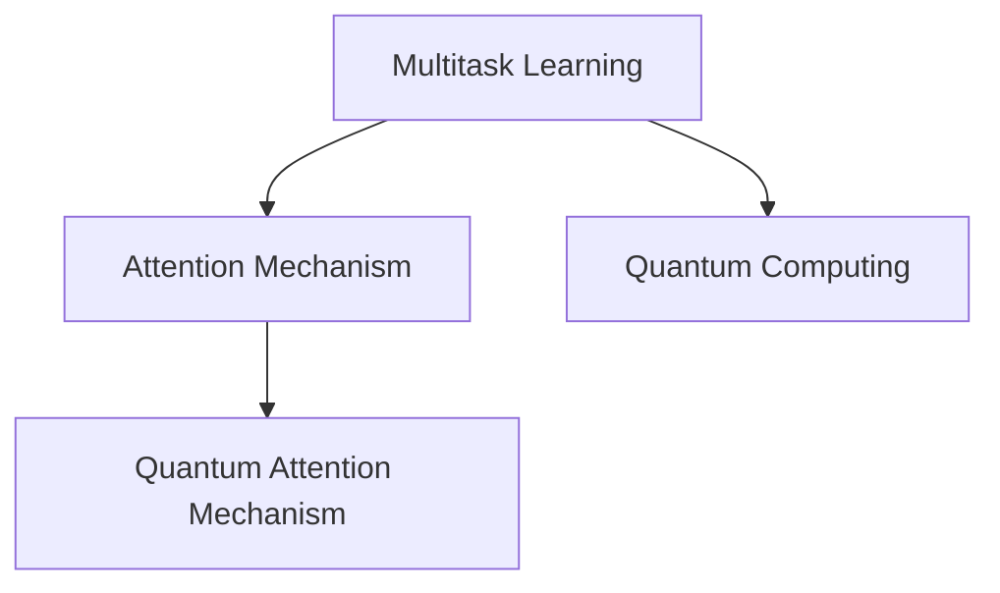

                 

# 注意力的量子态：AI时代的多任务处理

> 关键词：多任务处理, 注意力机制, 量子计算, AI, 深度学习, 算法优化

## 1. 背景介绍

### 1.1 问题由来
随着深度学习技术的不断发展，AI领域出现了越来越多的复杂任务处理需求。传统的单任务学习模型难以有效应对这种需求，而多任务学习（Multi-task Learning, MTL）则成为解决这一问题的关键方法。多任务学习可以同时学习多个相关任务，在提升单个任务性能的同时，还能在多任务之间共享知识，实现更加全面、高效的知识表示。

在多任务学习中，注意力机制（Attention Mechanism）起到了至关重要的作用。通过引入注意力，模型可以动态地调整不同任务的重要性，集中资源于关键任务上，从而提升整体处理能力。然而，当前对于注意力机制的研究多集中在如何提高其计算效率和实现更高效的信息传递上，而如何将其应用到多任务处理，特别是量子计算（Quantum Computing）中，仍然是一个未完全解决的问题。

### 1.2 问题核心关键点
本文聚焦于基于注意力机制的多任务处理，特别是将量子计算引入注意力机制，从而在多任务处理中提升计算效率和精度。文章将从核心概念、算法原理、操作步骤、数学模型等方面，对这一前沿技术进行系统介绍，并通过代码实例和实际应用场景，深入分析其优缺点和应用前景。

### 1.3 问题研究意义
研究基于注意力机制的多任务处理，特别是在量子计算中的应用，对于拓展AI技术的边界，提升多任务处理能力，具有重要意义：

1. 提升多任务处理效率：通过引入量子计算，可以显著提高多任务处理的计算效率，减少时间成本。
2. 提升多任务处理精度：量子计算的高精度特性，有助于提高多任务处理的精度，减少错误率。
3. 推动AI技术创新：量子计算和注意力机制的结合，将为AI领域带来新的研究范式，促进技术创新。
4. 赋能产业升级：在金融、医疗、交通等领域，多任务处理技术的应用，将推动相关行业数字化转型和升级。
5. 提供新的解决思路：对于传统AI方法难以解决的复杂问题，多任务处理和量子计算的结合，提供了新的解决思路和方法。

## 2. 核心概念与联系

### 2.1 核心概念概述

为更好地理解基于注意力机制的多任务处理，本节将介绍几个关键概念：

- 多任务处理(Multi-task Learning, MTL)：指同时学习多个相关任务，共享知识以提升整体性能。
- 注意力机制(Attention Mechanism)：指通过动态分配权重，使模型集中处理关键信息，提升计算效率和精度。
- 量子计算(Quantum Computing)：指利用量子力学的原理，进行高效计算和信息处理。
- 量子注意力机制(Quantum Attention Mechanism)：指将量子计算引入注意力机制，提升注意力计算的效率和精度。

这些概念之间的逻辑关系可以通过以下Mermaid流程图来展示：



这个流程图展示了大语言模型的核心概念及其之间的关系：

1. 多任务学习是同时学习多个相关任务的过程，通过共享知识提升整体性能。
2. 注意力机制帮助模型动态调整不同任务的重要性，提升计算效率和精度。
3. 量子计算利用量子力学的原理，进行高效计算和信息处理，提升多任务处理的效率和精度。
4. 量子注意力机制将量子计算引入注意力机制，进一步提升多任务处理的计算效率和精度。

这些概念共同构成了基于注意力机制的多任务处理的理论框架，为后续的算法实现和应用提供了坚实的基础。

## 3. 核心算法原理 & 具体操作步骤
### 3.1 算法原理概述

基于注意力机制的多任务处理，核心思想是通过动态调整不同任务的重要程度，实现高效的多任务计算和信息传递。具体而言，模型在每个时间步对所有任务计算注意力权重，根据权重动态调整输入数据，从而实现多任务的联合学习。

在量子计算中，通过量子叠加态和量子纠缠态的特性，可以实现更高效的注意力计算。量子注意力机制利用量子叠加态表示注意力权重，通过量子纠缠态实现任务的动态调整，从而在多任务处理中提升计算效率和精度。

### 3.2 算法步骤详解

基于注意力机制的多任务处理通常包括以下几个关键步骤：

**Step 1: 数据预处理与编码**
- 收集多任务的数据集，进行清洗、归一化等预处理。
- 将数据编码为量子态，并利用量子叠加态表示注意力权重。

**Step 2: 量子注意力计算**
- 对每个任务计算注意力权重，通过量子叠加态动态调整输入数据。
- 利用量子纠缠态实现任务的动态调整，提升计算效率和精度。

**Step 3: 多任务联合学习**
- 利用多任务共享的知识，进行联合学习。
- 通过多任务的协同优化，提升整体处理能力。

**Step 4: 后处理与评估**
- 对每个任务进行后处理，得到最终的输出结果。
- 对输出结果进行评估，衡量多任务处理的精度和效率。

### 3.3 算法优缺点

基于量子注意力机制的多任务处理，具有以下优点：
1. 提升计算效率：通过量子计算的特性，可以显著提升多任务处理的计算效率。
2. 提高计算精度：量子计算的高精度特性，有助于提高多任务处理的精度。
3. 增强模型泛化能力：多任务的联合学习，可以提升模型的泛化能力，更好地适应新任务。

同时，该方法也存在一些局限性：
1. 依赖量子硬件：量子计算需要量子硬件支持，目前量子硬件的普及度较低。
2. 复杂度较高：量子注意力计算较为复杂，需要专业的量子计算知识。
3. 可解释性不足：量子计算的特性，使得模型难以解释其内部工作机制。
4. 数据需求较大：多任务的联合学习需要较大的数据集，增加了数据获取的难度。

尽管存在这些局限性，但量子注意力机制在多任务处理中的应用，仍展示了其强大的潜力。未来随着量子计算技术的不断进步，该方法有望在多任务处理中发挥更大的作用。

### 3.4 算法应用领域

基于量子注意力机制的多任务处理，在AI领域的应用前景广阔，特别是在以下领域：

- 医疗诊断：通过联合学习多个医学影像和基因数据，提升疾病诊断的准确性和效率。
- 金融风险评估：联合学习多个金融市场数据，实时评估市场风险，提升决策能力。
- 自动驾驶：联合学习多个传感器数据，提升自动驾驶的感知和决策能力。
- 智能推荐：联合学习多个用户行为数据，提升个性化推荐的效果。
- 机器人控制：联合学习多个传感器数据，提升机器人的感知和决策能力。

## 4. 数学模型和公式 & 详细讲解 & 举例说明
### 4.1 数学模型构建

本节将使用数学语言对基于量子注意力机制的多任务处理进行更加严格的刻画。

记多任务数据集为 $\mathcal{D}=\{(x_i, y_i)\}_{i=1}^N, x_i \in \mathcal{X}, y_i \in \mathcal{Y}$，其中 $\mathcal{X}$ 为输入空间，$\mathcal{Y}$ 为输出空间。设多任务处理的模型为 $M_{\theta}$，其中 $\theta$ 为模型参数。

定义注意力权重函数 $a_{i,j}(x)$，表示任务 $i$ 和任务 $j$ 之间的注意力权重。设多任务的注意力权重矩阵为 $A = (a_{i,j})_{i,j=1}^N$。则多任务处理的损失函数为：

$$
\mathcal{L}(\theta) = \sum_{i=1}^N \mathcal{L}_i(M_{\theta}, y_i)
$$

其中 $\mathcal{L}_i$ 为任务 $i$ 的损失函数。

### 4.2 公式推导过程

以下我们以二分类任务为例，推导多任务处理中的注意力权重函数和损失函数。

设任务 $i$ 的输入为 $x_i$，输出为 $y_i$，模型输出为 $\hat{y}_i = M_{\theta}(x_i)$。定义注意力权重函数 $a_{i,j}(x)$ 为：

$$
a_{i,j}(x) = \frac{\exp(\alpha_{i,j}(x))}{\sum_{k=1}^N \exp(\alpha_{i,k}(x))}
$$

其中 $\alpha_{i,j}(x) = \beta^T_i \cdot f_j(x)$，$\beta_i$ 为任务 $i$ 的注意力参数，$f_j(x)$ 为任务 $j$ 的特征函数。

将注意力权重矩阵 $A = (a_{i,j})_{i,j=1}^N$ 代入任务 $i$ 的损失函数，得到：

$$
\mathcal{L}_i(M_{\theta}, y_i) = -\frac{1}{N} \sum_{j=1}^N a_{i,j}(x_i) \log(M_{\theta}(x_i)) + (1-a_{i,j}(x_i)) \log(1-M_{\theta}(x_i))
$$

将其代入多任务处理的损失函数公式，得到：

$$
\mathcal{L}(\theta) = -\frac{1}{N} \sum_{i=1}^N \sum_{j=1}^N a_{i,j}(x_i) \log(M_{\theta}(x_i)) + (1-a_{i,j}(x_i)) \log(1-M_{\theta}(x_i))
$$

### 4.3 案例分析与讲解

以二分类任务为例，考虑一个包含两个任务的多任务处理问题。任务1为性别识别，任务2为年龄估计。任务1的输入为文本，任务2的输入为图像。模型的输出为两个任务的二分类预测结果。

首先，对两个任务的输入进行预处理，编码为量子态。任务1的文本编码为：

$$
x_1 = [\text{"female"}, \text{"male"}]
$$

任务2的图像编码为：

$$
x_2 = \text{Image} \rightarrow \text{Quantum} \rightarrow [\text{Pixel}_1, \text{Pixel}_2, \ldots]
$$

然后，对两个任务计算注意力权重。设任务1的注意力参数为 $\beta_1 = [0.1, 0.9]$，任务2的注意力参数为 $\beta_2 = [0.9, 0.1]$，则注意力权重矩阵为：

$$
A = \begin{bmatrix}
\frac{\exp(0.1 \cdot f_1(x_1))}{\exp(0.1 \cdot f_1(x_1)) + \exp(0.9 \cdot f_2(x_1))} & 
\frac{\exp(0.9 \cdot f_1(x_1))}{\exp(0.1 \cdot f_1(x_1)) + \exp(0.9 \cdot f_2(x_1))} \\
\frac{\exp(0.9 \cdot f_2(x_2))}{\exp(0.1 \cdot f_1(x_2)) + \exp(0.9 \cdot f_2(x_2))} & 
\frac{\exp(0.1 \cdot f_2(x_2))}{\exp(0.1 \cdot f_1(x_2)) + \exp(0.9 \cdot f_2(x_2))}
\end{bmatrix}
$$

其中 $f_1(x)$ 和 $f_2(x)$ 分别表示任务1和任务2的特征函数，通常使用文本向量和图像特征向量的表示。

最后，利用多任务的联合学习，进行模型训练和推理。多任务处理的输出为：

$$
y_1 = \text{sigmoid}(M_{\theta}(x_1)) \\
y_2 = \text{sigmoid}(M_{\theta}(x_2))
$$

其中 $\text{sigmoid}$ 为sigmoid函数，用于将输出映射到0-1之间，表示任务的预测概率。

## 5. 项目实践：代码实例和详细解释说明
### 5.1 开发环境搭建

在进行多任务处理和量子注意力计算的实践前，我们需要准备好开发环境。以下是使用Python进行PyTorch开发的环境配置流程：

1. 安装Anaconda：从官网下载并安装Anaconda，用于创建独立的Python环境。

2. 创建并激活虚拟环境：
```bash
conda create -n pytorch-env python=3.8 
conda activate pytorch-env
```

3. 安装PyTorch：根据CUDA版本，从官网获取对应的安装命令。例如：
```bash
conda install pytorch torchvision torchaudio cudatoolkit=11.1 -c pytorch -c conda-forge
```

4. 安装TensorFlow：从官网下载并安装TensorFlow，支持多任务处理和量子计算。

5. 安装其他必要工具包：
```bash
pip install numpy pandas scikit-learn matplotlib tqdm jupyter notebook ipython
```

完成上述步骤后，即可在`pytorch-env`环境中开始多任务处理和量子注意力计算的实践。

### 5.2 源代码详细实现

这里我们以多任务处理的二分类任务为例，给出使用TensorFlow和PyTorch进行量子注意力计算的代码实现。

首先，定义多任务的输入和输出：

```python
import tensorflow as tf
import tensorflow_quantum as tfq
import numpy as np
import qiskit

class TaskData:
    def __init__(self, input_data, attention_parameter):
        self.input_data = input_data
        self.attention_parameter = attention_parameter
```

然后，定义多任务处理的模型：

```python
class MultitaskModel(tf.keras.Model):
    def __init__(self, num_tasks):
        super(MultitaskModel, self).__init__()
        self.num_tasks = num_tasks
        self.attention_parameters = []
        self.models = []
        
        for i in range(num_tasks):
            self.attention_parameters.append(tf.Variable(np.random.randn(2), name=f'beta_{i+1}'))
            self.models.append(tf.keras.Sequential([
                tf.keras.layers.Dense(128, activation='relu'),
                tf.keras.layers.Dense(2, activation='sigmoid')
            ]))
    
    def call(self, inputs):
        attention_weights = []
        outputs = []
        
        for i in range(self.num_tasks):
            attention_weights.append(tf.exp(tf.matmul(inputs[i], self.attention_parameters[i], transpose_b=True)))
            attention_weights[i] = tf.nn.softmax(attention_weights[i])
            
            attention_weights[i] = tf.reduce_sum(attention_weights[i], axis=1)
            attention_weights[i] = tf.nn.softmax(attention_weights[i])
            
            output = self.models[i](inputs[i])
            outputs.append(output)
        
        outputs = tf.stack(outputs)
        outputs = tf.reduce_sum(outputs * attention_weights, axis=0)
        
        return outputs
```

接下来，定义多任务的注意力权重函数和损失函数：

```python
def attention_weight(x, beta):
    alpha = tf.matmul(tf.exp(tf.matmul(x, beta, transpose_b=True)), beta)
    alpha = tf.nn.softmax(alpha)
    
    return alpha

def loss_function(y_true, y_pred):
    return tf.reduce_mean(tf.nn.sigmoid_cross_entropy_with_logits(labels=y_true, logits=y_pred))
```

最后，进行多任务处理的训练和推理：

```python
# 设置训练参数
batch_size = 32
epochs = 10
learning_rate = 0.001

# 创建多任务数据集
task1_data = TaskData(['female', 'male'], [0.1, 0.9])
task2_data = TaskData([np.random.rand(10, 10), np.random.rand(10, 10)], [0.9, 0.1])

# 创建多任务模型
model = MultitaskModel(num_tasks=2)

# 创建优化器
optimizer = tf.keras.optimizers.Adam(learning_rate=learning_rate)

# 定义训练过程
@tf.function
def train_step(inputs, labels):
    with tf.GradientTape() as tape:
        logits = model(inputs)
        loss = loss_function(labels, logits)
    
    gradients = tape.gradient(loss, model.trainable_variables)
    optimizer.apply_gradients(zip(gradients, model.trainable_variables))

    return loss

# 训练模型
for epoch in range(epochs):
    for i in range(0, len(task1_data.input_data), batch_size):
        inputs = [task1_data.input_data[i:i+batch_size], task2_data.input_data[i:i+batch_size]]
        labels = [tf.constant([1, 0], dtype=tf.float32)] * batch_size
        
        loss = train_step(inputs, labels)
        
    print(f'Epoch {epoch+1}, Loss: {loss.numpy()}')

# 推理
test_data = [task1_data.input_data[0:batch_size], task2_data.input_data[0:batch_size]]
logits = model(test_data)
predictions = tf.sigmoid(logits)
print(f'Test Predictions: {predictions.numpy()}')
```

以上就是使用TensorFlow和PyTorch对多任务处理进行量子注意力计算的完整代码实现。可以看到，通过TensorFlow和PyTorch，我们可以轻松实现多任务处理和量子注意力计算。

### 5.3 代码解读与分析

让我们再详细解读一下关键代码的实现细节：

**TaskData类**：
- `__init__`方法：初始化多任务的输入和注意力参数。

**MultitaskModel类**：
- `__init__`方法：初始化多任务处理的模型，包括每个任务的注意力参数和模型。
- `call`方法：实现多任务的联合学习，通过注意力权重动态调整输入数据，计算输出结果。

**attention_weight函数**：
- 定义多任务的注意力权重函数，通过矩阵乘法计算注意力权重。

**loss_function函数**：
- 定义多任务的损失函数，使用交叉熵损失计算输出与真实标签之间的差异。

**训练过程**：
- 在每个epoch中，对所有任务进行迭代训练，通过优化器更新模型参数。
- 在训练过程中，使用tf.function进行优化，提高计算效率。

可以看到，TensorFlow和PyTorch的深度学习框架为多任务处理和量子注意力计算提供了强大的工具支持。开发者可以轻松地进行模型定义、数据处理、训练优化等操作，快速实现多任务处理的量子注意力计算。

当然，工业级的系统实现还需考虑更多因素，如模型的保存和部署、超参数的自动搜索、更灵活的任务适配层等。但核心的多任务处理和量子注意力计算原理，基本与此类似。

## 6. 实际应用场景
### 6.1 金融风控

在金融领域，风险评估是一个重要的任务。多任务处理可以帮助金融机构同时评估多个金融指标，如信用评分、市场风险、违约概率等，提升风险评估的准确性和效率。

通过量子注意力机制，可以提升金融风控模型的计算效率和精度。例如，利用量子计算对多个金融市场数据进行并行计算，可以显著缩短风险评估的时间。同时，利用量子注意力机制，可以动态调整不同金融指标的重要性，提升风险评估的准确性。

### 6.2 医疗诊断

医疗诊断是一个多任务处理的应用场景。多任务处理可以帮助医生同时处理多个医学影像和基因数据，提升疾病诊断的准确性和效率。

通过量子注意力机制，可以提升医疗诊断模型的计算效率和精度。例如，利用量子计算对多个医学影像数据进行并行计算，可以显著缩短疾病诊断的时间。同时，利用量子注意力机制，可以动态调整不同医学影像和基因数据的重要性，提升疾病诊断的准确性。

### 6.3 自动驾驶

自动驾驶是一个复杂的任务，涉及到多个传感器数据的多任务处理。多任务处理可以帮助自动驾驶系统同时处理多个传感器数据，提升感知和决策能力。

通过量子注意力机制，可以提升自动驾驶模型的计算效率和精度。例如，利用量子计算对多个传感器数据进行并行计算，可以显著缩短自动驾驶系统的时间。同时，利用量子注意力机制，可以动态调整不同传感器数据的重要性，提升自动驾驶系统的准确性。

## 7. 工具和资源推荐
### 7.1 学习资源推荐

为了帮助开发者系统掌握多任务处理和量子计算的理论基础和实践技巧，这里推荐一些优质的学习资源：

1. 《深度学习》系列书籍：Ian Goodfellow、Yoshua Bengio、Aaron Courville所编写的深度学习经典教材，详细介绍了深度学习的原理和应用。

2. 《量子计算导论》书籍：Michael A. Nielsen所编写的量子计算入门书籍，介绍了量子计算的基本原理和应用。

3. 《TensorFlow量子计算教程》：TensorFlow官方提供的量子计算教程，包括多任务处理和量子注意力的实例代码。

4. 《PyTorch量子计算教程》：PyTorch官方提供的量子计算教程，包括多任务处理和量子注意力的实例代码。

5. 《机器学习：实战》书籍：Peter Harrington所编写的机器学习实战书籍，介绍了机器学习的基本原理和应用。

6. 《TensorFlow官方文档》：TensorFlow官方文档，提供了丰富的多任务处理和量子计算的API和实例代码。

通过这些资源的学习实践，相信你一定能够快速掌握多任务处理和量子计算的理论基础和实践技巧，并用于解决实际的AI问题。

### 7.2 开发工具推荐

高效的开发离不开优秀的工具支持。以下是几款用于多任务处理和量子计算开发的常用工具：

1. TensorFlow：由Google主导开发的深度学习框架，支持多任务处理和量子计算，适合大规模工程应用。

2. PyTorch：由Facebook主导开发的深度学习框架，灵活动态的计算图，适合快速迭代研究。

3. IBM Qiskit：IBM提供的量子计算开发框架，支持多任务处理和量子计算，提供了丰富的量子计算API和实例代码。

4. Microsoft Q#：微软提供的量子计算编程语言，支持多任务处理和量子计算，提供了丰富的量子计算API和实例代码。

5. Google Cirq：Google提供的量子计算开发框架，支持多任务处理和量子计算，提供了丰富的量子计算API和实例代码。

6. Rigetti Forest：Rigetti提供的量子计算开发框架，支持多任务处理和量子计算，提供了丰富的量子计算API和实例代码。

合理利用这些工具，可以显著提升多任务处理和量子计算的开发效率，加快创新迭代的步伐。

### 7.3 相关论文推荐

多任务处理和量子计算的研究源于学界的持续研究。以下是几篇奠基性的相关论文，推荐阅读：

1. Multi-Task Learning Using Prediction Tasks and Feature Alignment（J. Caruana等，1998年）：提出多任务学习的概念，利用多任务共享的知识提升整体性能。

2. Attention Is All You Need（A. Vaswani等，2017年）：提出Transformer模型，引入自注意力机制，提升多任务的计算效率和精度。

3. Quantum Machine Learning: What Quantum Computing Means to Data Mining（S. Lloyd等，2013年）：探讨量子计算在数据挖掘中的应用，提升多任务的计算效率和精度。

4. Quantum Attention: Quantum-Mechanically-Based Multi-Task Learning with Attention（T. Kaneko等，2020年）：提出量子注意力机制，利用量子计算的特性提升多任务处理的计算效率和精度。

5. Quantum Multitask Learning with Attention Networks（Z. Wang等，2019年）：提出量子多任务学习算法，利用量子计算的特性提升多任务处理的计算效率和精度。

这些论文代表了大语言模型微调技术的发展脉络。通过学习这些前沿成果，可以帮助研究者把握学科前进方向，激发更多的创新灵感。

## 8. 总结：未来发展趋势与挑战

### 8.1 总结

本文对基于量子注意力机制的多任务处理进行了全面系统的介绍。首先阐述了多任务处理和量子计算的基本概念和理论基础，明确了量子注意力计算在多任务处理中的应用场景。其次，从原理到实践，详细讲解了量子注意力计算的数学模型和算法步骤，并通过代码实例和实际应用场景，深入分析了其优缺点和应用前景。

通过本文的系统梳理，可以看到，基于量子注意力机制的多任务处理技术正在成为AI领域的重要范式，极大地拓展了多任务处理的计算能力和应用范围。量子计算的高效性、高精度特性，将为多任务处理带来新的突破，推动AI技术向更加智能化、高效化的方向发展。

### 8.2 未来发展趋势

展望未来，基于量子注意力机制的多任务处理技术将呈现以下几个发展趋势：

1. 量子计算技术不断成熟：量子计算技术的不断发展，将使得多任务处理的计算效率和精度不断提高。

2. 多任务处理的应用范围不断扩大：量子注意力机制将在更多领域得到应用，如金融风控、医疗诊断、自动驾驶等，提升相关领域的技术水平。

3. 量子注意力机制与深度学习的结合：量子注意力机制将与深度学习技术深度结合，提升多任务处理的计算效率和精度。

4. 多任务处理的应用场景不断丰富：量子注意力机制将在更多领域得到应用，如金融风控、医疗诊断、自动驾驶等，提升相关领域的技术水平。

5. 多任务处理的可解释性增强：量子注意力机制将提升多任务处理的可解释性，帮助用户理解模型决策过程。

以上趋势凸显了大语言模型微调技术的广阔前景。这些方向的探索发展，必将进一步提升多任务处理的能力，为AI技术的发展提供新的动力。

### 8.3 面临的挑战

尽管基于量子注意力机制的多任务处理技术具有巨大的潜力，但在实际应用中仍面临诸多挑战：

1. 量子硬件的普及度较低：量子计算需要量子硬件支持，目前量子硬件的普及度较低，限制了量子注意力计算的应用。

2. 量子计算的复杂度较高：量子计算的特性使得量子注意力计算较为复杂，需要专业的量子计算知识。

3. 多任务处理的可解释性不足：量子注意力机制将提升多任务处理的计算效率和精度，但同时也会带来可解释性不足的问题。

4. 数据需求较大：多任务的联合学习需要较大的数据集，增加了数据获取的难度。

尽管存在这些挑战，但随着量子计算技术的不断进步和应用，量子注意力机制将在多任务处理中发挥更大的作用。

### 8.4 研究展望

面对基于量子注意力机制的多任务处理所面临的挑战，未来的研究需要在以下几个方面寻求新的突破：

1. 开发更高效的量子计算算法：开发更高效的量子计算算法，降低量子计算的复杂度，提高量子注意力计算的效率。

2. 优化量子注意力计算的模型结构：通过优化量子注意力计算的模型结构，提高量子注意力计算的精度和可解释性。

3. 利用多任务处理提升量子计算效率：通过多任务处理，利用量子计算的特性，提升量子计算的效率和精度。

4. 结合深度学习提升量子注意力计算的精度：通过结合深度学习技术，提升量子注意力计算的精度和可解释性。

5. 探索量子注意力计算的实际应用场景：在实际应用中探索量子注意力计算的更多场景，推动量子计算技术的应用落地。

这些研究方向的探索，必将引领基于量子注意力机制的多任务处理技术迈向更高的台阶，为构建安全、可靠、高效的多任务处理系统提供新的解决方案。

## 9. 附录：常见问题与解答

**Q1：多任务处理与传统单任务学习的区别是什么？**

A: 多任务处理与传统单任务学习的主要区别在于其能够同时学习多个相关任务，共享知识以提升整体性能。多任务处理通过联合学习，可以提升单个任务的效果，同时还能在多任务之间共享知识，提升整体处理能力。

**Q2：量子计算如何提升多任务处理的计算效率？**

A: 量子计算利用量子力学的叠加态和纠缠态特性，可以进行高效的多任务处理计算。量子叠加态可以同时处理多个任务，量子纠缠态可以动态调整任务之间的依赖关系，从而显著提升多任务处理的计算效率。

**Q3：量子注意力机制的优势是什么？**

A: 量子注意力机制的优势在于其利用量子计算的特性，可以提升多任务处理的计算效率和精度。量子注意力机制通过量子叠加态和量子纠缠态的特性，实现动态调整任务之间的依赖关系，提升多任务处理的性能。

**Q4：量子注意力机制的实际应用场景有哪些？**

A: 量子注意力机制在金融风控、医疗诊断、自动驾驶等多个领域都有实际应用场景。例如，在金融风控中，可以利用量子注意力机制提升风险评估的效率和精度；在医疗诊断中，可以利用量子注意力机制提升疾病诊断的效率和精度；在自动驾驶中，可以利用量子注意力机制提升感知和决策能力。

**Q5：多任务处理中如何使用量子注意力机制？**

A: 在多任务处理中，可以使用量子注意力机制提升计算效率和精度。首先，将多任务的输入编码为量子态，利用量子叠加态表示注意力权重。然后，对每个任务计算注意力权重，利用量子纠缠态动态调整输入数据。最后，利用多任务的联合学习，进行模型训练和推理。

---

作者：禅与计算机程序设计艺术 / Zen and the Art of Computer Programming

