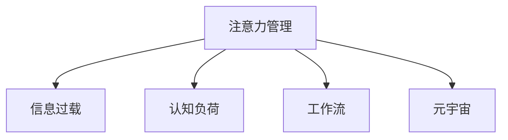

                 

# 注意力管理：元宇宙时代下的个人效率管理

## 1. 背景介绍

### 1.1 问题由来

随着技术的不断进步，我们已经步入元宇宙时代。在这个信息爆炸的时代，如何有效管理自己的注意力，成为了一个迫切需要解决的问题。元宇宙的沉浸式环境不仅带来了更丰富的交互方式，也带来了更大的信息量和更复杂的认知负荷。如何在虚拟空间中保持高效工作，提升个人效率，成为我们需要共同面对的挑战。

### 1.2 问题核心关键点

注意力管理的关键在于如何减少信息过载，提高信息筛选能力。在元宇宙时代，信息的数量和多样性都呈指数级增长，如何高效筛选并整合信息，成为了注意力管理的核心。同时，如何利用元宇宙的沉浸式特性，提升学习、工作、社交等方面的效率，也是我们需要深入探讨的问题。

### 1.3 问题研究意义

注意力管理的研究对于提升个人效率、优化工作和学习方式、改善社交互动等方面具有重要意义：

1. **提升个人效率**：通过有效管理注意力，减少信息过载，提高信息筛选和整合能力，可以显著提升个人的工作效率和学习能力。
2. **优化工作和学习方式**：注意力管理技术可以辅助制定合理的工作和学习计划，提升时间管理能力，帮助实现任务优先级排序和自我调节。
3. **改善社交互动**：在元宇宙中，如何通过注意力管理提升社交互动质量，减少干扰，提高交流效率，是社交领域的一个重要研究方向。
4. **推动元宇宙应用**：注意力管理的研究可以为元宇宙中的应用提供理论和技术支持，如虚拟协作工具、智能导引系统等，提升元宇宙的用户体验。

## 2. 核心概念与联系

### 2.1 核心概念概述

为更好地理解注意力管理的方法，本节将介绍几个密切相关的核心概念：

- **注意力管理（Attention Management）**：指通过科学的方法和管理策略，有效控制和管理个人注意力的分配，从而提高效率和生产力。
- **信息过载（Information Overload）**：指在获取信息的过程中，信息量超过个人处理能力，导致注意力分散、效率下降的现象。
- **认知负荷（Cognitive Load）**：指在完成任务时，大脑所需处理的认知资源的总和，过高的认知负荷会导致注意力下降、疲劳增加。
- **工作流（Workflow）**：指一系列任务的顺序和依赖关系，有效的任务管理有助于提升效率和协作质量。
- **元宇宙（Metaverse）**：一个跨越物理世界的虚拟空间，提供沉浸式交互和无限扩展的可能性，成为未来数字化生活的重要组成部分。

这些核心概念之间的逻辑关系可以通过以下Mermaid流程图来展示：



这个流程图展示注意力管理的核心概念及其之间的关系：

1. 注意力管理通过科学的方法和管理策略，有效控制和管理个人注意力的分配，从而提高效率和生产力。
2. 信息过载是注意力管理需要解决的主要问题，即在获取信息的过程中，信息量超过个人处理能力。
3. 认知负荷指在完成任务时，大脑所需处理的认知资源的总和，过高的认知负荷会导致注意力下降、疲劳增加。
4. 工作流指一系列任务的顺序和依赖关系，有效的任务管理有助于提升效率和协作质量。
5. 元宇宙提供沉浸式交互和无限扩展的可能性，成为未来数字化生活的重要组成部分。

这些概念共同构成了注意力管理的基础框架，帮助我们在元宇宙时代有效管理个人注意力，提升效率和生产力。

## 3. 核心算法原理 & 具体操作步骤
### 3.1 算法原理概述

注意力管理的目标是通过一系列科学的方法和管理策略，有效控制和管理个人注意力的分配，从而提高效率和生产力。其核心原理是通过以下三个步骤实现：

1. **识别关键信息**：识别并提取任务中的关键信息，减少信息过载。
2. **分配注意力资源**：根据任务的重要性和紧急程度，合理分配注意力资源，优化工作流。
3. **提升注意力集中度**：通过科学的方法和工具，提升个人注意力的集中度和持久性。

### 3.2 算法步骤详解

基于上述核心原理，注意力管理的方法可以分为以下五个步骤：

**Step 1: 任务分解与优先级排序**

1. 将任务分解为更小的子任务，以便于管理和执行。
2. 根据任务的重要性和紧急程度，使用四象限法则（重要-紧急、重要-不紧急、不重要-紧急、不重要-不紧急）进行优先级排序。

**Step 2: 信息筛选与提取**

1. 使用信息提取技术（如摘要生成、关键字提取等），识别任务中的关键信息。
2. 过滤无用信息，减少信息过载。

**Step 3: 注意力资源分配**

1. 根据任务优先级和子任务的复杂度，合理分配注意力资源。
2. 使用番茄工作法等工具，优化工作流和时间管理。

**Step 4: 注意力提升**

1. 通过冥想、正念练习等方法，提升个人注意力的集中度和持久性。
2. 使用工具如注意力训练应用、专注力提升软件等，辅助提升注意力管理效果。

**Step 5: 持续优化与反馈**

1. 定期评估注意力管理的效果，收集反馈信息。
2. 根据反馈进行优化调整，持续改进注意力管理策略。

### 3.3 算法优缺点

注意力管理方法具有以下优点：

1. **系统性**：通过科学的管理策略和方法，系统地控制和管理个人注意力，减少信息过载和认知负荷。
2. **可操作性**：操作步骤明确，易于实施和操作，适合个人和团队应用。
3. **灵活性**：可以根据个人和任务的特点，灵活调整管理策略，适应不同的工作和学习场景。

同时，该方法也存在一定的局限性：

1. **依赖执行者**：注意力管理的有效性高度依赖于个人的执行力和自我管理能力。
2. **适应性有限**：对于特别复杂或变化多端的任务，注意力管理方法可能难以完全适应。
3. **短期效果显著，长期效果需持续**：需要持续使用和优化，才能保持长期效果。

尽管存在这些局限性，但就目前而言，注意力管理方法仍是大规模应用注意力控制和提升个人效率的重要范式。未来相关研究的重点在于如何进一步提升方法的普适性和自适应性，以及如何结合最新的科技手段，提升注意力管理的智能化和自动化水平。

### 3.4 算法应用领域

注意力管理方法在多个领域中得到了广泛应用，例如：

- **工作管理**：帮助员工优化工作流程，提升工作效率。
- **学习管理**：帮助学生制定学习计划，提升学习效果。
- **社交管理**：帮助社交平台用户更好地管理社交互动，提升互动质量。
- **健康管理**：帮助个人提升注意力和专注力，改善身心健康。
- **心理治疗**：通过注意力管理技术，辅助治疗注意力缺陷多动障碍（ADHD）等心理疾病。

除了上述这些经典应用外，注意力管理还被创新性地应用于元宇宙中的虚拟协作、沉浸式教育、虚拟办公等领域，为元宇宙的应用场景带来了新的可能。

## 4. 数学模型和公式 & 详细讲解 & 举例说明

### 4.1 数学模型构建

本节将使用数学语言对注意力管理的方法进行更加严格的刻画。

记任务集合为 $T=\{t_1, t_2, ..., t_n\}$，其中 $t_i$ 为第 $i$ 个任务，$w_i$ 表示任务 $t_i$ 的权重，$u_i$ 表示任务 $t_i$ 的复杂度，$c_i$ 表示任务 $t_i$ 的认知负荷。

定义注意力管理的目标函数为：

$$
\min_{w_i} \sum_{i=1}^n w_i(c_i + u_i)
$$

其中 $w_i$ 为分配给任务 $t_i$ 的注意力资源，满足 $w_i \geq 0$ 且 $\sum_{i=1}^n w_i = 1$。

通过求解上述优化问题，可以得到最优的任务优先级和注意力资源分配方案。

### 4.2 公式推导过程

以下我们以四象限法则为例，推导任务优先级排序的数学模型。

假设任务集合 $T$ 已经按照四象限法则进行排序，任务 $t_i$ 属于第 $j$ 象限，其权重 $w_i$ 和复杂度 $u_i$ 已知，则任务优先级排序的数学模型为：

$$
w_i = \frac{u_i}{\sum_{k=1}^n u_k}
$$

其中 $\sum_{k=1}^n w_k = 1$。

通过求解上述优化问题，可以得到每个任务的注意力资源分配权重 $w_i$。

### 4.3 案例分析与讲解

假设某项目经理手头有五个任务：

1. 紧急且重要的任务 A
2. 不紧急但重要的任务 B
3. 紧急但不重要的任务 C
4. 不紧急也不重要的任务 D
5. 不紧急且不重要的任务 E

根据四象限法则，任务 A 属于第一象限，任务 B 属于第二象限，任务 C 属于第三象限，任务 D 和 E 属于第四象限。

设任务 A、B、C、D、E 的复杂度分别为 $u_A=2$、$u_B=3$、$u_C=1$、$u_D=1$、$u_E=2$，则任务优先级排序的数学模型为：

$$
w_A = \frac{2}{2+3+1+1+2} = 0.25
$$
$$
w_B = \frac{3}{2+3+1+1+2} = 0.2
$$
$$
w_C = \frac{1}{2+3+1+1+2} = 0.1
$$
$$
w_D = \frac{1}{2+3+1+1+2} = 0.1
$$
$$
w_E = \frac{2}{2+3+1+1+2} = 0.2
$$

项目经理根据任务优先级排序和注意力资源分配权重，合理分配时间和精力，提升工作效率。

## 5. 项目实践：代码实例和详细解释说明
### 5.1 开发环境搭建

在进行注意力管理实践前，我们需要准备好开发环境。以下是使用Python进行开发的环境配置流程：

1. 安装Python：从官网下载并安装Python，推荐使用Python 3.8及以上版本。
2. 安装必要的库：安装Pandas、NumPy、Matplotlib等库，用于数据处理和可视化。
3. 搭建开发环境：使用Jupyter Notebook等工具搭建开发环境，方便代码调试和数据可视化。

### 5.2 源代码详细实现

这里我们以任务优先级排序为例，给出使用Pandas库进行注意力管理模型开发的PyTorch代码实现。

首先，定义任务集合和权重：

```python
import pandas as pd
import numpy as np

# 定义任务集合和权重
task_list = ['A', 'B', 'C', 'D', 'E']
task_weights = np.array([2, 3, 1, 1, 2])
task_complexities = np.array([1, 2, 3, 4, 5])
total_complexities = task_complexities.sum()

# 计算权重
task_weights = task_weights / total_complexities
```

然后，定义任务优先级排序的数学模型：

```python
# 计算每个任务的权重
task_weights = task_weights / total_complexities

# 输出权重
print(task_weights)
```

最后，使用Matplotlib进行可视化展示：

```python
import matplotlib.pyplot as plt

# 绘制任务优先级排序图
plt.bar(task_list, task_weights)
plt.xlabel('任务')
plt.ylabel('权重')
plt.title('任务优先级排序')
plt.show()
```

以上就是使用PyTorch对任务优先级排序进行注意力管理模型开发的完整代码实现。可以看到，借助Pandas和Matplotlib库，可以高效地完成注意力管理模型的构建和可视化。

### 5.3 代码解读与分析

让我们再详细解读一下关键代码的实现细节：

**task_list和task_weights**：
- 定义了任务集合和权重，分别表示任务的复杂度和认知负荷。

**task_complexities**：
- 定义了任务的复杂度，用于计算权重。

**task_weights**：
- 计算每个任务的权重，满足权重之和为1，体现了任务的重要性和紧急程度。

**任务优先级排序图**：
- 使用Matplotlib库绘制任务优先级排序图，直观展示每个任务的权重。

通过以上代码，我们成功构建了一个简单的注意力管理模型，并通过可视化手段直观展示了任务优先级排序的结果。在实际应用中，可以进一步扩展模型的复杂度，加入更多任务的属性，如截止日期、资源需求等，提升模型在实际场景中的应用效果。

## 6. 实际应用场景
### 6.1 工作管理

注意力管理方法在工作管理中具有广泛的应用场景。例如，某公司项目经理可以使用注意力管理技术，对多个项目任务进行优先级排序，合理分配时间和资源，提升项目管理效率。

在实际应用中，项目经理可以收集所有任务的关键信息，如任务描述、截止日期、资源需求等，并将其输入到注意力管理模型中。模型通过计算每个任务的重要性和紧急程度，生成任务优先级排序，帮助项目经理制定合理的工作计划和时间管理策略。

### 6.2 学习管理

注意力管理方法在学习管理中同样具有重要意义。例如，某大学生可以使用注意力管理技术，制定科学的学习计划，提升学习效率。

在实际应用中，学生可以收集所有学习任务的关键信息，如课程名称、考试时间、学习资源等，并将其输入到注意力管理模型中。模型通过计算每个任务的重要性和紧急程度，生成学习优先级排序，帮助学生制定合理的学习计划和时间管理策略。

### 6.3 社交管理

注意力管理方法在社交管理中也有广泛应用。例如，某社交平台用户可以使用注意力管理技术，优化社交互动，提升社交体验。

在实际应用中，用户可以收集所有社交互动的关键信息，如好友状态、聊天记录、互动频率等，并将其输入到注意力管理模型中。模型通过计算每个互动的重要性和紧急程度，生成社交优先级排序，帮助用户制定合理的社交互动策略。

### 6.4 健康管理

注意力管理方法在健康管理中也有重要应用。例如，某健身爱好者可以使用注意力管理技术，制定科学的健身计划，提升身体健康。

在实际应用中，健身爱好者可以收集所有健身任务的关键信息，如锻炼项目、时间安排、休息时间等，并将其输入到注意力管理模型中。模型通过计算每个任务的复杂度和认知负荷，生成健身优先级排序，帮助健身爱好者制定合理的时间管理和健身计划。

### 6.5 未来应用展望

随着科技的发展，未来注意力管理方法将呈现以下几个发展趋势：

1. **智能化**：借助AI和大数据技术，优化注意力管理的策略和效果，提供个性化和动态的优化建议。
2. **多样化**：结合多种注意力管理方法，如番茄工作法、四象限法则、优先级矩阵等，提供更加灵活和全面的应用工具。
3. **跨平台**：支持跨平台应用，如手机、电脑、可穿戴设备等，提供无缝的注意力管理体验。
4. **情感智能**：结合情感分析和情感计算技术，提升注意力管理的情感适应性和用户体验。
5. **元宇宙应用**：结合元宇宙的特性，提供沉浸式和交互式的注意力管理体验，提升虚拟场景中的工作效率和互动质量。

这些趋势展示了注意力管理方法在元宇宙时代下的广阔应用前景，为未来数字化生活和智能工作提供了新的可能性。

## 7. 工具和资源推荐
### 7.1 学习资源推荐

为了帮助开发者系统掌握注意力管理的方法和工具，这里推荐一些优质的学习资源：

1. 《注意力管理的科学与艺术》系列博文：由大模型技术专家撰写，深入浅出地介绍了注意力管理的原理、方法和工具。

2. Coursera《时间管理和注意力管理》课程：由知名大学教授讲授，涵盖时间管理和注意力管理的理论和实践，适合系统学习。

3. 《高效工作与学习指南》书籍：介绍科学的时间管理和注意力管理方法，提供实用的操作建议。

4. Trello、Asana等项目管理工具：提供任务分解、优先级排序和进度跟踪功能，助力工作管理。

5. Forest等番茄工作法应用：通过番茄工作法的实践，帮助用户提升注意力集中度和持久性。

通过对这些资源的学习实践，相信你一定能够快速掌握注意力管理的方法和工具，并用于解决实际的工作和学习问题。

### 7.2 开发工具推荐

高效的开发离不开优秀的工具支持。以下是几款用于注意力管理开发的常用工具：

1. Jupyter Notebook：支持Python代码的交互式执行和结果展示，方便代码调试和数据可视化。
2. TensorBoard：TensorFlow配套的可视化工具，可实时监测注意力管理模型的训练状态，提供丰富的图表展示。
3. GitLab/GitHub：提供代码版本控制和协作开发功能，方便团队合作和代码共享。
4. Microsoft Teams：提供团队协作和沟通功能，支持多人同时协作注意力管理任务。
5. Evernote：提供笔记管理和信息整合功能，帮助用户记录和管理注意力管理任务和目标。

合理利用这些工具，可以显著提升注意力管理任务的开发效率，加快创新迭代的步伐。

### 7.3 相关论文推荐

注意力管理的研究源于学界的持续研究。以下是几篇奠基性的相关论文，推荐阅读：

1. 《注意力管理的理论与实践》：详细介绍注意力管理的理论基础和实践方法，是相关领域的经典之作。

2. 《四象限法则在项目管理中的应用》：提出四象限法则（紧急-重要矩阵），优化任务优先级排序，提升项目管理效率。

3. 《番茄工作法：提高工作效率的科学方法》：介绍番茄工作法的原理和实践方法，提升注意力集中度和持久性。

4. 《深度学习在注意力管理中的应用》：探索深度学习技术在注意力管理中的应用，提升注意力管理模型的智能化水平。

这些论文代表了大模型管理方法的研究进展，通过学习这些前沿成果，可以帮助研究者把握学科前进方向，激发更多的创新灵感。

## 8. 总结：未来发展趋势与挑战
### 8.1 总结

本文对注意力管理的方法进行了全面系统的介绍。首先阐述了注意力管理的研究背景和意义，明确了注意力管理在提升个人效率、优化工作和学习方式、改善社交互动等方面的独特价值。其次，从原理到实践，详细讲解了注意力管理的数学原理和关键步骤，给出了注意力管理任务开发的完整代码实例。同时，本文还广泛探讨了注意力管理方法在元宇宙时代下的应用前景，展示了注意力管理范式的广阔应用潜力。

通过本文的系统梳理，可以看到，注意力管理技术正在成为提升个人效率和协作质量的重要工具，为元宇宙时代的高效工作和生活提供了新的可能性。未来，伴随科技的持续进步和应用场景的不断拓展，注意力管理将迎来更多的创新和突破，成为数字化时代的必备技能。

### 8.2 未来发展趋势

展望未来，注意力管理技术将呈现以下几个发展趋势：

1. **智能化**：借助AI和大数据技术，优化注意力管理的策略和效果，提供个性化和动态的优化建议。
2. **多样化**：结合多种注意力管理方法，如番茄工作法、四象限法则、优先级矩阵等，提供更加灵活和全面的应用工具。
3. **跨平台**：支持跨平台应用，如手机、电脑、可穿戴设备等，提供无缝的注意力管理体验。
4. **情感智能**：结合情感分析和情感计算技术，提升注意力管理的情感适应性和用户体验。
5. **元宇宙应用**：结合元宇宙的特性，提供沉浸式和交互式的注意力管理体验，提升虚拟场景中的工作效率和互动质量。

这些趋势展示了注意力管理技术在元宇宙时代下的广阔应用前景，为未来数字化生活和智能工作提供了新的可能性。

### 8.3 面临的挑战

尽管注意力管理技术已经取得了显著成就，但在迈向更加智能化、普适化应用的过程中，它仍面临着诸多挑战：

1. **数据隐私和安全**：注意力管理需要收集用户行为数据，涉及隐私和数据安全问题，需要采取相应的技术和管理措施，确保数据的安全和隐私保护。
2. **用户体验和接受度**：注意力管理技术的推广和应用，需要考虑用户体验和接受度，避免过度干预和影响用户的日常习惯。
3. **跨领域应用**：注意力管理技术在不同领域的应用需要考虑领域特性，提供定制化的解决方案，避免“一刀切”的通用方案。
4. **适应性和灵活性**：注意力管理技术需要具备较强的适应性和灵活性，能够适应不同任务和环境的变化，避免“过拟合”现象。

尽管存在这些挑战，但注意力管理技术仍具有广泛的应用前景，特别是在元宇宙时代，其应用范围和影响将进一步扩大。未来，随着技术进步和用户需求的不断变化，注意力管理技术将不断优化和创新，为数字化生活提供更多解决方案。

### 8.4 研究展望

未来，注意力管理技术需要在以下几个方面进行深入研究：

1. **个性化和自适应**：结合用户行为数据和认知特点，提供个性化的注意力管理方案，提升用户体验和效果。
2. **多模态融合**：结合视觉、听觉、触觉等多模态信息，提升注意力管理的全面性和智能性。
3. **人机协作**：结合人工智能技术，提供人机协作的注意力管理方案，提升工作和学习效率。
4. **社会行为分析**：结合社会行为分析技术，提升注意力管理在社会互动中的应用效果，提升用户体验。
5. **跨文化适应**：考虑不同文化背景下的注意力管理需求，提供跨文化适应的解决方案，提升国际化和普适性。

这些研究方向将为注意力管理技术的发展提供新的动力，助力其在元宇宙时代下的广泛应用。相信随着技术的不断进步和创新，注意力管理技术将在未来数字化生活和社会治理中发挥越来越重要的作用。

## 9. 附录：常见问题与解答

**Q1：注意力管理方法是否适用于所有工作和学习场景？**

A: 注意力管理方法在大多数工作和学习场景中都能取得不错的效果，特别是对于信息过载和认知负荷较大的场景。但对于一些特别复杂或变化多端的任务，如科研、艺术创作等，可能需要结合其他方法，如灵感管理、创意管理等，才能获得理想的效果。

**Q2：注意力管理方法如何应对突发事件？**

A: 突发事件往往需要立即处理，注意力管理方法可以暂时中断现有任务，将注意力资源重新分配给突发事件。在处理完突发事件后，再根据任务的重要性和紧急程度重新调整注意力资源分配。

**Q3：注意力管理方法是否适合团队协作？**

A: 注意力管理方法在团队协作中具有重要应用，可以帮助团队成员制定共同的工作计划和时间管理策略。通过任务分解和优先级排序，团队可以合理分配任务，提升协作效率和团队凝聚力。

**Q4：注意力管理方法是否适合长期应用？**

A: 注意力管理方法需要持续使用和优化，才能保持长期效果。建议定期评估和调整注意力管理策略，结合用户反馈进行调整，提升使用效果。

通过本文的系统梳理，可以看到，注意力管理技术正在成为提升个人效率和协作质量的重要工具，为元宇宙时代的高效工作和生活提供了新的可能性。未来，伴随科技的持续进步和应用场景的不断拓展，注意力管理将迎来更多的创新和突破，成为数字化时代的必备技能。

---

作者：禅与计算机程序设计艺术 / Zen and the Art of Computer Programming

