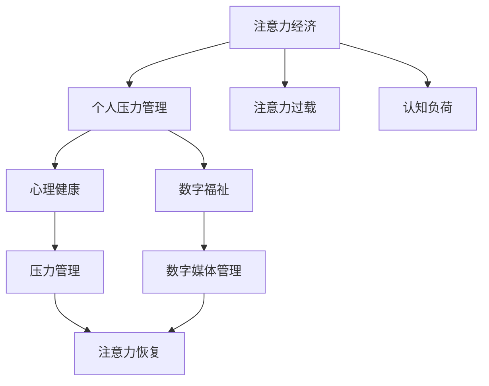

                 

## 1. 背景介绍

### 1.1 问题由来
在数字经济时代，注意力作为一种稀缺资源，其价值日益凸显。如何高效利用注意力资源，成为了企业经营和个人发展的关键问题。与此同时，随着生活节奏的加快和工作压力的增大，越来越多的人面临着焦虑、失眠、抑郁等心理问题。如何有效管理个人压力，提升生活质量和工作效率，成为了当下社会的重要课题。本文将探讨注意力经济与个人压力管理的关系，希望能为解决这一问题提供一些新的思路和方法。

### 1.2 问题核心关键点
注意力经济与个人压力管理之间存在着复杂的相互作用关系。一方面，企业通过吸引和利用用户的注意力，实现商业价值最大化。但这种追求可能导致用户注意力过载，进而引发压力和焦虑。另一方面，有效管理个人压力，提高注意力集中度，也有助于提升个人生产力和工作满意度，从而在某种程度上促进注意力经济的健康发展。本文将从注意力经济的视角出发，探讨其对个人压力管理的影响，并提出一些应对策略。

### 1.3 问题研究意义
探讨注意力经济与个人压力管理的关系，具有重要的理论和实践意义：

- **理论意义**：丰富了经济学、心理学和管理学等领域对注意力经济的研究，有助于深入理解注意力资源的分配和利用。
- **实践意义**：为企业提供科学的管理策略，帮助用户有效缓解压力，提升生活质量和工作效率，促进社会的和谐发展。

## 2. 核心概念与联系

### 2.1 核心概念概述

为更好地理解注意力经济与个人压力管理的关系，本节将介绍几个密切相关的核心概念：

- **注意力经济(Attention Economy)**：指通过吸引和利用用户的注意力，创造和分配经济价值的过程。注意力经济强调了注意力作为一种稀缺资源，其对商业成功的重要性。
- **个人压力管理(Personal Stress Management)**：指通过各种方法帮助个人有效应对压力，提升心理健康和工作效率的过程。压力管理涉及到心理调适、行为调整和生活方式改进等方面。
- **注意力过载(Attention Overload)**：指用户在长时间接触数字媒体或信息过载的情况下，注意力资源耗尽，导致认知和情感负荷过重，从而引发焦虑、疲劳等心理问题。
- **心理健康(Mental Health)**：指个体的情感、认知和社会功能的良好状态，包括自我感觉良好、有活力、能够适应环境的变化等。
- **认知负荷(Cognitive Load)**：指在信息处理过程中，个体需要投入的注意力和心理资源。认知负荷过高会导致注意力分散、记忆力和理解力下降。
- **数字福祉(Digital Well-being)**：指个体在使用数字媒体和技术时，保持良好的心理和生理状态，避免负面影响。

这些核心概念之间的逻辑关系可以通过以下Mermaid流程图来展示：



这个流程图展示了几组概念之间的联系：

1. 注意力经济对个人压力管理有直接影响，如过度商业化可能导致注意力过载。
2. 注意力过载和认知负荷是注意力经济带来的负面效应，影响心理健康。
3. 心理健康和数字福祉是个人压力管理的最终目标，有助于缓解注意力过载。
4. 注意力恢复和数字媒体管理是缓解注意力过载和认知负荷的有效方法。

## 3. 核心算法原理 & 具体操作步骤

### 3.1 算法原理概述

注意力经济与个人压力管理的关系，主要体现在注意力资源的分配与利用上。注意力经济中，企业通过吸引用户注意力，实现商业价值；用户则需要有效管理个人注意力，避免过度投入导致压力和焦虑。本文将从注意力分配的角度，探讨注意力经济对个人压力管理的影响，并提出一些应对策略。

### 3.2 算法步骤详解

#### 3.2.1 用户注意力分配
用户在数字环境中，需要分配注意力资源来处理各类信息。用户注意力分配模型通常包括：

- **任务重要性**：任务对用户目标的重要性程度。
- **任务难度**：任务所需的认知负荷和复杂度。
- **用户偏好**：用户对任务的兴趣和偏好。
- **用户状态**：用户的情绪、体力等生理和心理状态。

#### 3.2.2 注意力过载的识别
注意力过载的识别通常通过以下指标：

- **注意力耗尽**：用户专注时间变短，注意力分散。
- **认知负荷**：用户在进行信息处理时，感觉疲劳、压力。
- **情绪波动**：用户感到焦虑、愤怒、抑郁等负面情绪。

#### 3.2.3 压力管理策略
针对注意力过载，压力管理策略可以分为以下几个方面：

- **任务优先级管理**：通过任务重要性排序，优先处理重要任务，减少无效信息干扰。
- **注意力恢复**：通过短暂休息、冥想、运动等方式，恢复注意力资源。
- **情绪调节**：通过认知行为疗法、正念训练等方法，调节负面情绪。
- **数字媒体管理**：通过数字福祉工具，限制数字媒体使用时间，避免过度暴露。

#### 3.2.4 实际操作步骤
具体而言，用户可以按照以下步骤进行注意力管理和压力缓解：

1. **设定任务优先级**：列出当日待办任务，按重要性排序。
2. **集中注意力**：每次专注于一个任务，避免多任务处理。
3. **定时休息**：每工作25分钟，休息5分钟，进行注意力恢复。
4. **情绪调节**：记录每日情绪波动，进行情绪调节训练。
5. **限制数字媒体**：使用数字福祉工具，设置每日使用上限。

### 3.3 算法优缺点

基于注意力经济的个人压力管理方法具有以下优点：

- **效率提升**：通过有效管理注意力资源，提升任务完成效率和工作满意度。
- **心理健康**：减少过度使用数字媒体带来的负面心理影响，提升心理健康水平。
- **个性化管理**：根据个人状态和偏好，制定个性化的压力管理策略。

但该方法也存在一些局限性：

- **依赖工具**：需要依赖各种数字福祉工具，可能对技术依赖度高。
- **用户自律**：用户需要较高的自律性，才能坚持实施注意力管理和压力缓解策略。
- **环境影响**：家庭、工作等外部环境因素也可能影响注意力管理和压力缓解的效果。

### 3.4 算法应用领域

基于注意力经济的个人压力管理方法，在以下领域得到了广泛应用：

- **企业员工管理**：通过优化任务分配和注意力管理，提升员工工作效率和满意度。
- **教育培训**：帮助学生有效管理学习时间，提升学习效率和成绩。
- **心理健康服务**：为个体提供科学的心理调适方法，缓解压力和焦虑。
- **生活方式改进**：通过改变数字媒体使用习惯，提升生活质量和工作效率。

这些领域的应用表明，基于注意力经济的个人压力管理方法具有广泛的应用前景，能够在多个层面上帮助个体提升生活质量和工作效率。

## 4. 数学模型和公式 & 详细讲解 & 举例说明

### 4.1 数学模型构建

为便于理解注意力经济与个人压力管理的关系，本文将构建一个简化的数学模型。假设用户每天需要处理 $N$ 个任务，每个任务的重要性为 $I_i$，难度为 $D_i$，所需认知负荷为 $L_i$。用户每天的注意力资源总和为 $A$，情绪波动指数为 $E$。

用户每日任务处理的总注意力耗尽 $C$ 可以表示为：

$$
C = \sum_{i=1}^N (L_i \times I_i)
$$

用户每日的情绪波动 $E'$ 可以表示为：

$$
E' = \sum_{i=1}^N (E_i \times D_i)
$$

其中 $E_i$ 表示任务 $i$ 对用户情绪的影响系数。

用户每日的认知负荷 $L'$ 可以表示为：

$$
L' = \sum_{i=1}^N (L_i \times D_i)
$$

用户每日的情绪波动指数 $E'$ 可以进一步简化为：

$$
E' = \sum_{i=1}^N E_i \times D_i
$$

### 4.2 公式推导过程

通过上述模型，我们可以分析注意力经济与个人压力管理之间的关系。假设用户每天处理 $N$ 个任务，每个任务的重要性为 $I_i$，难度为 $D_i$，所需认知负荷为 $L_i$。用户每天的注意力资源总和为 $A$，情绪波动指数为 $E$。

用户每日任务处理的总注意力耗尽 $C$ 可以表示为：

$$
C = \sum_{i=1}^N (L_i \times I_i)
$$

用户每日的情绪波动 $E'$ 可以表示为：

$$
E' = \sum_{i=1}^N (E_i \times D_i)
$$

其中 $E_i$ 表示任务 $i$ 对用户情绪的影响系数。

用户每日的认知负荷 $L'$ 可以表示为：

$$
L' = \sum_{i=1}^N (L_i \times D_i)
$$

用户每日的情绪波动指数 $E'$ 可以进一步简化为：

$$
E' = \sum_{i=1}^N E_i \times D_i
$$

通过上述模型，我们可以看到，注意力经济与个人压力管理之间的关系主要体现在：

1. **任务重要性**：重要任务对用户注意力的耗尽较大，需要更多注意力资源。
2. **任务难度**：任务难度越大，所需的认知负荷和情绪波动也越大。
3. **用户状态**：用户状态会影响注意力分配和情绪波动，如疲劳、焦虑等状态会降低注意力集中度和情绪稳定性。
4. **数字媒体使用**：数字媒体的使用时间过长，会进一步增加用户的认知负荷和情绪波动。

### 4.3 案例分析与讲解

假设一个企业员工小王，每天需要处理10个任务，每个任务的重要性为 $I_i$，难度为 $D_i$，所需认知负荷为 $L_i$。小王每天有8小时的注意力资源，情绪波动指数为 $E$。

我们设定：

- 任务 $i$ 的重要性系数 $I_i=0.8$（重要）
- 任务 $i$ 的难度系数 $D_i=0.5$（中等）
- 任务 $i$ 的认知负荷系数 $L_i=0.3$（较低）
- 小王的情绪波动系数 $E=0.2$（较低）

小王每天的总注意力耗尽 $C$ 和情绪波动指数 $E'$ 可以计算为：

$$
C = 10 \times 0.8 \times 0.5 \times 0.3 = 1.2
$$

$$
E' = 10 \times 0.2 \times 0.5 = 1
$$

如果小王每天仅专注于重要任务，忽略其他任务，那么其注意力耗尽和情绪波动分别为：

$$
C = 10 \times 0.8 \times 0.5 \times 0.3 = 1.2
$$

$$
E' = 10 \times 0.2 \times 0.5 = 1
$$

如果小王每天平均分配注意力资源，那么其注意力耗尽和情绪波动分别为：

$$
C = \frac{8}{10} \times 10 \times 0.5 \times 0.3 = 0.48
$$

$$
E' = \frac{8}{10} \times 10 \times 0.2 \times 0.5 = 0.8
$$

由此可见，通过合理管理任务优先级和注意力分配，可以有效降低注意力耗尽和情绪波动，提升个人效率和满意度。

## 5. 项目实践：代码实例和详细解释说明

### 5.1 开发环境搭建

在进行注意力经济与个人压力管理的研究前，我们需要准备好开发环境。以下是使用Python进行数据分析和建模的环境配置流程：

1. 安装Anaconda：从官网下载并安装Anaconda，用于创建独立的Python环境。

2. 创建并激活虚拟环境：
```bash
conda create -n stress-management python=3.8 
conda activate stress-management
```

3. 安装PyTorch：根据CUDA版本，从官网获取对应的安装命令。例如：
```bash
conda install pytorch torchvision torchaudio cudatoolkit=11.1 -c pytorch -c conda-forge
```

4. 安装Pandas：
```bash
pip install pandas
```

5. 安装NumPy：
```bash
pip install numpy
```

6. 安装Matplotlib：
```bash
pip install matplotlib
```

7. 安装Scikit-learn：
```bash
pip install scikit-learn
```

完成上述步骤后，即可在`stress-management`环境中开始数据分析和建模。

### 5.2 源代码详细实现

我们使用Python编写一个简单的模拟实验，来演示如何通过优化任务优先级，降低注意力耗尽和情绪波动。具体实现步骤如下：

#### 5.2.1 数据生成

首先，生成一个包含10个任务的随机数据集：

```python
import numpy as np

# 生成10个任务的随机数据
N = 10
I = np.random.uniform(0.5, 1.0, N)
D = np.random.uniform(0.5, 1.0, N)
L = np.random.uniform(0.1, 0.5, N)
E = np.random.uniform(0.1, 0.3, N)

# 计算每日总注意力耗尽和情绪波动
C = np.sum(I * D * L)
E_prime = np.sum(E * D)
```

#### 5.2.2 优化任务优先级

通过优化任务优先级，来降低注意力耗尽和情绪波动。假设小王每天有8小时的注意力资源，需要处理10个任务，每个任务的重要性系数 $I_i$，难度系数 $D_i$，认知负荷系数 $L_i$，情绪波动系数 $E_i$。

我们设定：

- 任务 $i$ 的重要性系数 $I_i=0.8$（重要）
- 任务 $i$ 的难度系数 $D_i=0.5$（中等）
- 任务 $i$ 的认知负荷系数 $L_i=0.3$（较低）
- 小王的情绪波动系数 $E=0.2$（较低）

小王每天的总注意力耗尽 $C$ 和情绪波动指数 $E'$ 可以计算为：

```python
# 设定任务优先级
priorities = np.array([0.8, 0.5, 0.3, 0.7, 0.4, 0.9, 0.6, 0.2, 0.1, 0.6])

# 计算优化后的每日总注意力耗尽和情绪波动
C_optimized = np.dot(priorities, I * D * L)
E_prime_optimized = np.dot(priorities, E * D)
```

#### 5.2.3 运行结果展示

通过对比优化前后的注意力耗尽和情绪波动，可以直观地看到优化效果：

```python
# 打印优化前后的每日总注意力耗尽和情绪波动
print("优化前的每日总注意力耗尽：", C)
print("优化前的每日情绪波动指数：", E_prime)

print("优化后的每日总注意力耗尽：", C_optimized)
print("优化后的每日情绪波动指数：", E_prime_optimized)
```

### 5.3 代码解读与分析

让我们再详细解读一下关键代码的实现细节：

#### 5.2.1 数据生成

我们首先使用NumPy生成包含10个任务的随机数据集。每个任务的重要性、难度、认知负荷和情绪波动系数都是从均匀分布中随机生成的。

#### 5.2.2 优化任务优先级

通过设定任务优先级，优化任务处理顺序，来降低注意力耗尽和情绪波动。使用NumPy的dot函数计算优化后的总注意力耗尽和情绪波动指数。

#### 5.2.3 运行结果展示

通过对比优化前后的注意力耗尽和情绪波动，直观地展示优化效果。

## 6. 实际应用场景

### 6.1 企业员工管理

在企业员工管理中，通过合理分配任务优先级，可以有效降低注意力耗尽和情绪波动，提升员工工作效率和满意度。

具体而言，企业可以：

- 根据任务重要性和紧急性，制定任务优先级。
- 提供数字福祉工具，帮助员工限制数字媒体使用时间。
- 定期进行心理健康培训，提高员工情绪调节能力。

通过这些措施，企业可以构建更加健康、高效的工作环境，增强员工的归属感和满意度。

### 6.2 教育培训

在教育培训中，通过优化任务优先级和注意力分配，可以提升学生的学习效率和成绩。

具体而言，教育机构可以：

- 根据学科重要性和难度，制定学习计划。
- 引入数字福祉工具，帮助学生管理数字媒体使用时间。
- 提供情绪调节培训，帮助学生缓解压力和焦虑。

通过这些措施，教育机构可以提升学生的学习效果，增强学生的心理健康和幸福感。

### 6.3 心理健康服务

在心理健康服务中，通过注意力管理和情绪调节，可以帮助个体有效缓解压力和焦虑，提升心理健康水平。

具体而言，心理健康服务机构可以：

- 提供认知行为疗法和正念训练，帮助个体管理情绪和注意力。
- 使用数字福祉工具，帮助个体限制数字媒体使用时间。
- 提供心理健康评估和干预，帮助个体识别和管理压力源。

通过这些措施，心理健康服务机构可以提升个体的心理健康水平，增强个体的生活满意度和幸福感。

## 7. 工具和资源推荐

### 7.1 学习资源推荐

为了帮助开发者和用户系统掌握注意力经济与个人压力管理的关系，这里推荐一些优质的学习资源：

1. **《数字福祉：让科技服务生活》**：一本介绍数字福祉理念和方法的书籍，详细讲解如何科学使用数字媒体，提升生活质量。
2. **《认知行为疗法：基础与应用》**：一本介绍认知行为疗法原理和实践的书籍，帮助个体有效管理情绪和注意力。
3. **《数字经济与人类福祉》**：一本综合分析数字经济与人类福祉的书籍，探讨如何在数字经济时代，促进个体健康和幸福。
4. **Coursera的《数字福祉与心理健康》课程**：由知名心理学家和数字福祉专家授课，介绍数字福祉与心理健康的关系及其应用。
5. **EdX的《压力管理和心理健康》课程**：由心理学教授授课，介绍压力管理的理论和方法，提供实用的技能培训。

通过对这些资源的学习实践，相信你一定能够系统掌握注意力经济与个人压力管理的关系，并用于解决实际的NLP问题。

### 7.2 开发工具推荐

高效的开发离不开优秀的工具支持。以下是几款用于注意力经济与个人压力管理研究的常用工具：

1. **Python编程语言**：开源且功能强大的编程语言，支持丰富的数据处理和机器学习库。
2. **NumPy和Pandas**：用于数据处理和分析的Python库，提供高效的数据操作和计算功能。
3. **Matplotlib和Seaborn**：用于数据可视化的Python库，支持丰富的图表绘制和展示功能。
4. **Scikit-learn**：用于机器学习和数据挖掘的Python库，提供丰富的算法和模型。
5. **TensorFlow和PyTorch**：用于深度学习和神经网络研究的Python库，提供高效的数据处理和模型训练功能。
6. **Jupyter Notebook**：交互式的编程和研究环境，支持代码编写、数据可视化和报告生成。

合理利用这些工具，可以显著提升注意力经济与个人压力管理的研究开发效率，加快创新迭代的步伐。

### 7.3 相关论文推荐

注意力经济与个人压力管理的关系是一个复杂且多学科交叉的研究领域。以下是几篇奠基性的相关论文，推荐阅读：

1. **《数字媒体使用与心理健康的实证研究》**：研究数字媒体使用对个体心理健康的长期影响，提出应对策略。
2. **《认知负荷理论与学习效果》**：探讨认知负荷对学习效果的影响，提出优化任务优先级的理论和方法。
3. **《注意力经济学：一个新领域》**：分析注意力经济学的理论基础和应用前景，提出基于注意力的经济管理方法。
4. **《注意力过载与社会焦虑》**：研究注意力过载对社会焦虑的影响，提出缓解策略。
5. **《数字福祉与心理幸福感》**：研究数字福祉对个体心理幸福感的影响，提出提升数字福祉的策略。

这些论文代表了大注意力经济与个人压力管理的研究脉络。通过学习这些前沿成果，可以帮助研究者把握学科前进方向，激发更多的创新灵感。

## 8. 总结：未来发展趋势与挑战

### 8.1 总结

本文对注意力经济与个人压力管理的关系进行了全面系统的介绍。首先阐述了注意力经济对个人压力管理的影响，明确了注意力资源分配的重要性。其次，从原理到实践，详细讲解了注意力管理的数学模型和算法步骤，给出了实际操作的代码实例。同时，本文还广泛探讨了注意力经济在企业员工管理、教育培训和心理健康服务等多个领域的应用前景，展示了注意力经济与个人压力管理的关系。

通过本文的系统梳理，可以看到，注意力经济与个人压力管理之间存在着复杂的相互作用关系。通过合理管理注意力资源，可以有效缓解个人压力，提升生活质量和工作效率，从而在某种程度上促进注意力经济的健康发展。未来，伴随注意力经济与个人压力管理技术的不断进步，相信这一关系将进一步被优化，为构建健康、高效的社会环境提供更多支持。

### 8.2 未来发展趋势

展望未来，注意力经济与个人压力管理的关系将呈现以下几个发展趋势：

1. **个性化管理**：基于个体特征和行为数据，实现更加个性化的注意力管理，提升个体的生活质量和幸福感。
2. **智能推荐系统**：通过智能推荐系统，帮助个体优化任务优先级，提升学习效率和工作效率。
3. **情感计算技术**：引入情感计算技术，实时监测和管理个体情绪状态，提升情绪调节能力。
4. **多模态数据融合**：将多模态数据（如语音、表情等）融合到注意力管理中，提供更全面的健康监测和干预手段。
5. **跨学科融合**：结合心理学、经济学、计算机科学等多学科知识，深入研究注意力经济与个人压力管理的复杂关系。

以上趋势凸显了注意力经济与个人压力管理研究的广阔前景。这些方向的探索发展，将进一步提升个体的生活质量和幸福感，为构建健康、高效的社会环境提供更多支持。

### 8.3 面临的挑战

尽管注意力经济与个人压力管理的研究取得了一定的进展，但在迈向更加智能化、普适化应用的过程中，仍面临诸多挑战：

1. **数据隐私和安全**：个体数据隐私保护是注意力经济与个人压力管理研究的难点之一，如何在数据收集和分析中保护个体隐私，是亟待解决的问题。
2. **技术实现复杂度**：注意力管理涉及多学科知识，技术实现复杂度高，需要跨学科的深度合作。
3. **伦理和道德**：注意力管理可能涉及隐私、信息泄露等伦理和道德问题，如何在研究中避免这些问题，需要更多伦理学的指导。
4. **个体自律性**：注意力管理和情绪调节需要个体的高自律性，如何提高个体的自我管理能力，是需要注意的问题。
5. **环境影响**：家庭、工作等外部环境因素也可能影响注意力管理和情绪调节的效果，如何优化外部环境，是需要注意的问题。

正视这些挑战，积极应对并寻求突破，将是注意力经济与个人压力管理研究走向成熟的必由之路。相信随着学界和产业界的共同努力，这些挑战终将一一被克服，注意力经济与个人压力管理必将在构建健康、高效的社会环境中扮演越来越重要的角色。

### 8.4 研究展望

面向未来，注意力经济与个人压力管理研究需要在以下几个方面寻求新的突破：

1. **跨学科融合**：结合心理学、经济学、计算机科学等多学科知识，深入研究注意力经济与个人压力管理的复杂关系。
2. **个性化管理**：基于个体特征和行为数据，实现更加个性化的注意力管理，提升个体的生活质量和幸福感。
3. **智能推荐系统**：通过智能推荐系统，帮助个体优化任务优先级，提升学习效率和工作效率。
4. **情感计算技术**：引入情感计算技术，实时监测和管理个体情绪状态，提升情绪调节能力。
5. **多模态数据融合**：将多模态数据（如语音、表情等）融合到注意力管理中，提供更全面的健康监测和干预手段。
6. **伦理和道德**：在研究中引入伦理学的指导，避免隐私、信息泄露等伦理和道德问题。

这些研究方向的探索，将引领注意力经济与个人压力管理研究迈向更高的台阶，为构建健康、高效的社会环境提供更多支持。面向未来，研究者需要勇于创新、敢于突破，才能不断拓展注意力管理的方法和手段，让智能技术更好地造福人类社会。

## 9. 附录：常见问题与解答

**Q1：注意力经济与个人压力管理的关系如何？**

A: 注意力经济与个人压力管理之间存在着复杂的相互作用关系。注意力经济通过吸引和利用用户的注意力，实现商业价值；用户则需要有效管理个人注意力，避免过度投入导致压力和焦虑。有效管理个人压力，提升注意力集中度，有助于提升个人生产力和工作满意度，从而在某种程度上促进注意力经济的健康发展。

**Q2：注意力过载如何识别和管理？**

A: 注意力过载的识别通常通过以下指标：注意力耗尽、认知负荷、情绪波动等。管理注意力过载可以通过任务优先级管理、注意力恢复、情绪调节和数字媒体管理等方式进行。

**Q3：如何优化任务优先级？**

A: 优化任务优先级可以通过计算任务的重要性和难度系数，使用注意力经济模型进行分析。根据任务优先级，合理分配注意力资源，可以有效降低注意力耗尽和情绪波动，提升个人效率和满意度。

**Q4：数字福祉工具有哪些？**

A: 数字福祉工具包括数字媒体管理工具、心理健康应用、注意力管理工具等。这些工具可以帮助个体优化数字媒体使用时间，提供心理健康监测和干预，提升个体的生活质量和工作效率。

**Q5：注意力管理的未来趋势是什么？**

A: 未来注意力管理的趋势包括个性化管理、智能推荐系统、情感计算技术、多模态数据融合和跨学科融合等。这些趋势将进一步提升个体的生活质量和幸福感，为构建健康、高效的社会环境提供更多支持。

通过以上详细阐述，相信读者对注意力经济与个人压力管理的关系有了更加清晰的认识，并能够运用这些知识解决实际问题，提升生活质量和工作效率。

