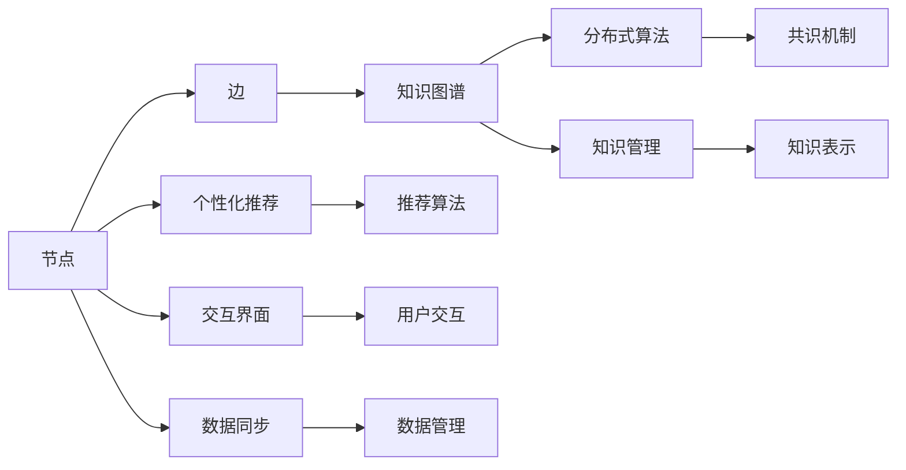

                 

# 注意力经济与个人学习方式的革新

在数字化时代，信息过载已成为常态，如何高效管理个人注意力、提升学习效果成为新的挑战。本文将从注意力经济的角度，探讨当前学习模式的不足，并提出基于分布式知识网络的新型学习方式。

## 1. 背景介绍

### 1.1 问题由来
在互联网时代，信息呈现出爆炸式增长。传统单一的学习模式已经难以适应现代知识体系的分散化和复杂化，人们需要在海量信息中寻找有效的学习内容。然而，即使拥有广泛的信息获取渠道，如何有效地筛选、吸收、应用这些信息，仍是一大难题。

### 1.2 问题核心关键点
当前学习模式存在以下问题：

- **信息过载**：互联网提供了海量的学习资源，但信息质量参差不齐，容易淹没用户注意力。
- **知识孤岛**：各个学科、领域之间缺乏有效连接，难以跨学科综合应用知识。
- **单一学习**：多数学习活动侧重于个人，难以与他人协作共享，难以充分利用集体智慧。
- **缺乏反馈**：传统学习依赖于教师或教材反馈，难以在动态环境中实时调整学习策略。

### 1.3 问题研究意义
通过引入分布式知识网络，可以整合个人注意力管理、知识共享、协同学习等多维度要素，重塑学习生态。分布式知识网络通过构建一个去中心化的知识图谱，使个体能够高效检索、整合、应用知识，提升学习效率。

## 2. 核心概念与联系

### 2.1 核心概念概述

分布式知识网络是分布式计算和知识管理的结合体，通过互联网将各个节点连接起来，形成一个自组织的知识图谱。在分布式知识网络中，每个人都可以成为知识的贡献者和受益者，通过协作、分享、互动，提升整体知识水平。

### 2.2 核心概念关系图

以下是分布式知识网络的核心概念及其相互关系图：



### 2.3 核心概念原理与架构

分布式知识网络基于以下原理和架构构建：

- **知识图谱**：使用语义网络构建知识图谱，通过节点和边描述实体之间的关系。
- **分布式算法**：在分布式网络中，使用共识机制和分布式算法保证数据一致性和算力分散。
- **个性化推荐**：结合推荐算法，根据用户行为和兴趣推荐相关知识。
- **数据同步**：通过数据同步技术，保证各节点数据的一致性和实时性。
- **知识管理**：使用知识表示技术，描述知识图谱中的节点和边，便于搜索和应用。

这些核心概念构成了分布式知识网络的技术基础，使其能够高效地组织和应用分布式知识。

## 3. 核心算法原理 & 具体操作步骤

### 3.1 算法原理概述

分布式知识网络的核心算法原理是基于图神经网络（GNN）的图嵌入算法。通过将知识图谱转换为向量表示，GNN能够学习到节点之间的隐含关系，从而提升节点推荐的准确性。

### 3.2 算法步骤详解

分布式知识网络的算法步骤如下：

1. **构建知识图谱**：使用语义网络表示各实体之间的关系，包括实体、属性、关系等节点和边。
2. **数据预处理**：对节点数据进行清洗和标准化，去除噪声和冗余信息。
3. **图嵌入学习**：使用GNN算法对知识图谱进行嵌入，将节点转换为高维向量表示。
4. **节点推荐算法**：根据用户行为和兴趣，使用推荐算法从图嵌入中选取相关节点，进行个性化推荐。
5. **数据同步与更新**：通过分布式算法保证节点数据的一致性和实时性。
6. **评估与优化**：定期评估推荐效果，优化算法参数和模型结构。

### 3.3 算法优缺点

分布式知识网络的优点：

- **分布式协作**：节点之间的协作能够提升知识水平，增强网络的抗干扰能力。
- **高效推荐**：通过图嵌入和推荐算法，能够高效地推荐相关知识，提升学习效率。
- **动态更新**：分布式网络能够动态更新知识图谱，适应变化的学习需求。

缺点：

- **复杂度高**：构建和维护分布式知识网络需要较高的技术复杂度和成本。
- **数据隐私**：网络节点需要共享部分数据，可能涉及隐私和安全问题。
- **算法局限**：推荐算法和图嵌入模型需要持续优化，避免过度拟合。

### 3.4 算法应用领域

分布式知识网络可以应用于多个领域，如：

- **教育**：构建学习社区，共享和推荐课程、论文、视频等学习资源。
- **科研**：联合研究机构，共享和应用科研成果，提升科研效率。
- **企业**：构建知识库，支持员工知识共享和应用，提升企业创新能力。
- **医疗**：共享医疗知识，提高诊断和治疗效果，加速医学研究。

## 4. 数学模型和公式 & 详细讲解

### 4.1 数学模型构建

知识图谱的数学模型可以表示为三元组$(h,r,t)$，其中$h$为头实体，$r$为关系，$t$为尾实体。知识图谱可以表示为一个邻接矩阵$\mathbf{A}$，其中每个节点$i$的邻接节点集合表示为$\mathcal{N}(i)$。

### 4.2 公式推导过程

知识图谱的图嵌入算法可以通过多层次图卷积网络（GCN）来实现。GCN的节点嵌入公式为：

$$
\mathbf{X}_{i}^{(l+1)}=\mathbf{D}^{-\frac{1}{2}} \mathbf{A} \mathbf{X}_{i}^{(l)} \mathbf{W}^{(l)}
$$

其中$\mathbf{X}_{i}^{(l)}$为第$l$层节点$i$的嵌入向量，$\mathbf{W}^{(l)}$为第$l$层的权重矩阵，$\mathbf{D}$为归一化矩阵，$D_{ii}=\sum_{j=1}^{N} A_{i j}$。

### 4.3 案例分析与讲解

以一个简单的知识图谱为例，如下图所示：

```
Person1 --(Comment)--> Paper1
Person2 --(Read)--> Paper1
```

使用GCN算法，可以得到如下嵌入：

- Person1的嵌入为$\mathbf{x}_1^{(0)}$。
- Paper1的嵌入为$\mathbf{x}_1^{(0)} \cdot \mathbf{W}^{(0)}$。
- Comment的嵌入为$\mathbf{x}_2^{(0)} \cdot \mathbf{W}^{(0)}$。
- Read的嵌入为$\mathbf{x}_3^{(0)} \cdot \mathbf{W}^{(0)}$。

通过多次迭代，可以逐渐提升嵌入质量，从而实现节点推荐。

## 5. 项目实践：代码实例和详细解释说明

### 5.1 开发环境搭建

1. 安装Python：确保Python版本为3.6或以上。
2. 安装PyTorch：使用pip安装PyTorch，并安装相关的深度学习库。
3. 搭建分布式环境：可以使用Hadoop、Spark等分布式计算框架，构建分布式知识网络。

### 5.2 源代码详细实现

以下是一个简单的知识图谱嵌入和节点推荐的代码实现：

```python
import torch
import torch.nn as nn
import torch.nn.functional as F
import networkx as nx

class GraphConvLayer(nn.Module):
    def __init__(self, in_dim, out_dim):
        super(GraphConvLayer, self).__init__()
        self.weight = nn.Parameter(torch.randn(out_dim, in_dim))
    
    def forward(self, x, adj_matrix):
        x = torch.mm(x, self.weight)
        return F.relu(torch.mm(adj_matrix, x))

class GraphSAGE(nn.Module):
    def __init__(self, in_dim, out_dim):
        super(GraphSAGE, self).__init__()
        self.gcn1 = GraphConvLayer(in_dim, out_dim)
        self.gcn2 = GraphConvLayer(out_dim, out_dim)
    
    def forward(self, x, adj_matrix):
        x = self.gcn1(x, adj_matrix)
        x = self.gcn2(x, adj_matrix)
        return x

# 构建知识图谱
G = nx.Graph()
G.add_node('Person1', attr={'name': 'Person1'})
G.add_node('Paper1', attr={'name': 'Paper1'})
G.add_edge('Person1', 'Paper1', attr={'rel': 'Comment'})
G.add_edge('Person2', 'Paper1', attr={'rel': 'Read'})

# 定义嵌入维度
dim = 10

# 定义模型
model = GraphSAGE(dim, dim)

# 训练模型
optimizer = torch.optim.Adam(model.parameters(), lr=0.01)
for epoch in range(100):
    for node in G.nodes:
        embedding = torch.tensor(G.nodes[node]['attr']['embedding'], requires_grad=True)
        embedding = model(embedding, G.adjacency_matrix)
        optimizer.zero_grad()
        loss = F.mse_loss(embedding, torch.tensor(G.nodes[node]['attr']['embedding']))
        loss.backward()
        optimizer.step()
```

### 5.3 代码解读与分析

1. **定义图卷积层**：定义图卷积层，用于计算节点嵌入。
2. **定义模型**：使用图卷积神经网络模型，构建知识图谱嵌入。
3. **训练模型**：使用Adam优化器，训练模型，逐步提升节点嵌入质量。

## 6. 实际应用场景

### 6.1 教育

在教育领域，分布式知识网络可以通过构建学习社区，实现知识的共享和推荐。例如，一个在线学习平台可以将课程、论文、视频等资源整合到知识图谱中，学生可以根据兴趣和需求，快速找到相关学习内容。

### 6.2 科研

科研领域可以利用分布式知识网络，共享和应用科研成果。例如，学术数据库可以构建知识图谱，连接各研究机构和论文，提升科研效率。

### 6.3 企业

企业可以构建内部知识库，支持员工知识共享和应用，提升创新能力。例如，知识管理系统可以将公司内部文档、专利、技术方案等整合到知识图谱中，方便员工查询和学习。

### 6.4 医疗

医疗领域可以利用分布式知识网络，共享和应用医疗知识，提高诊断和治疗效果。例如，电子病历系统可以将患者病历、医生经验、研究成果等整合到知识图谱中，提升医疗服务质量。

## 7. 工具和资源推荐

### 7.1 学习资源推荐

1. **《深度学习》**：Ian Goodfellow等人著，详细介绍了深度学习的基本原理和算法。
2. **《图神经网络：一种新兴的深度学习领域》**：这篇文章介绍了图神经网络的基本原理和应用，适合初学者入门。
3. **Kaggle**：一个数据科学竞赛平台，可以通过参与竞赛，提升数据分析和机器学习技能。
4. **Coursera**：一个在线学习平台，提供各类计算机科学课程，包括深度学习和分布式计算。
5. **ArXiv**：一个预印本服务器，发布最新的科研论文，适合了解最新的研究进展。

### 7.2 开发工具推荐

1. **PyTorch**：一个深度学习框架，支持动态图和静态图，适合分布式计算。
2. **TensorFlow**：另一个深度学习框架，支持分布式训练和推理，适合大规模工程应用。
3. **Jupyter Notebook**：一个交互式编程环境，适合进行原型开发和数据分析。
4. **Hadoop**：一个分布式计算框架，支持大规模数据处理和存储。
5. **Spark**：另一个分布式计算框架，支持实时数据处理和机器学习。

### 7.3 相关论文推荐

1. **Graph Neural Networks: A Review of Methods and Applications**：一篇综述论文，介绍了图神经网络的基本原理和应用。
2. **Knowledge Graph Embeddings: A Survey**：一篇综述论文，介绍了知识图谱嵌入的各类方法和应用。
3. **Scalable Collaborative Filtering: A Survey**：一篇综述论文，介绍了大规模协同过滤的算法和应用。
4. **Evolving Graphs: Algorithms on Dynamic Graphs**：一篇综述论文，介绍了动态图算法的基本原理和应用。

## 8. 总结：未来发展趋势与挑战

### 8.1 总结

本文对分布式知识网络进行了详细介绍，探讨了其在教育、科研、企业、医疗等多个领域的应用前景。通过分布式知识网络，个体能够高效检索、整合和应用知识，提升学习效率。分布式知识网络是未来学习方式革新的重要方向。

### 8.2 未来发展趋势

分布式知识网络的未来发展趋势包括：

1. **去中心化管理**：未来的分布式知识网络将更加去中心化，每个节点都可以自主管理和更新知识。
2. **跨领域融合**：不同领域的知识图谱将更加紧密地融合，形成更加全面和复杂的网络。
3. **实时动态更新**：分布式知识网络能够实时更新，适应动态变化的学习需求。
4. **个性化推荐**：推荐算法将更加精准，能够更好地满足用户的个性化需求。
5. **多模态融合**：未来将融合视觉、语音、文本等多种模态数据，构建更加全面的知识网络。

### 8.3 面临的挑战

分布式知识网络面临的挑战包括：

1. **数据质量**：知识图谱的数据质量直接影响到推荐的准确性。
2. **隐私和安全**：分布式网络需要共享部分数据，可能涉及隐私和安全问题。
3. **计算资源**：分布式网络需要大量计算资源，可能对硬件和网络条件有较高要求。
4. **算法复杂性**：分布式算法和图嵌入模型需要持续优化，避免过度拟合。

### 8.4 研究展望

未来的研究可以在以下几个方面寻求新的突破：

1. **分布式计算优化**：优化分布式网络的计算效率，降低资源消耗。
2. **知识图谱扩展**：构建更加全面和复杂的网络，扩展知识图谱的边界。
3. **个性化推荐**：提升推荐算法的精准度，满足用户的个性化需求。
4. **多模态融合**：将不同模态数据融合到知识网络中，提升知识整合能力。
5. **隐私保护**：开发隐私保护算法，保护节点数据的隐私安全。

这些研究方向的探索，将引领分布式知识网络走向更高的台阶，为构建安全、可靠、高效的学习生态提供新的思路。

## 9. 附录：常见问题与解答

**Q1：什么是分布式知识网络？**

A: 分布式知识网络是分布式计算和知识管理的结合体，通过互联网将各个节点连接起来，形成一个自组织的知识图谱。

**Q2：如何构建知识图谱？**

A: 构建知识图谱需要定义节点和边，使用语义网络表示实体之间的关系。可以使用Python的Graph模块和Networkx库，方便构建和操作知识图谱。

**Q3：分布式知识网络有哪些应用场景？**

A: 分布式知识网络可以应用于教育、科研、企业、医疗等多个领域，提升各领域的知识管理水平。

**Q4：分布式知识网络面临哪些挑战？**

A: 分布式知识网络面临数据质量、隐私安全、计算资源和算法复杂性等方面的挑战。

**Q5：分布式知识网络的优势是什么？**

A: 分布式知识网络具有分布式协作、高效推荐、动态更新等特点，能够提升知识管理的效率和效果。

---

作者：禅与计算机程序设计艺术 / Zen and the Art of Computer Programming

