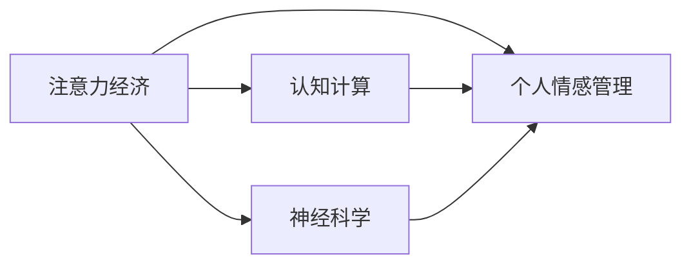

                 

## 1. 背景介绍

在互联网时代，信息爆炸与数据碎片化背景下，我们面对的是注意力经济的时代。个人情感管理在这个时代变得更加复杂且重要。人们不仅需要通过技术手段来获取有用的信息，更需要有效的情感管理来应对各种挑战，提升生活质量。本文将从注意力经济和情感管理的角度出发，探讨其关系，并提出相应的解决方案。

## 2. 核心概念与联系

### 2.1 核心概念概述

#### 2.1.1 注意力经济 (Attention Economy)
注意力经济是指在信息过载时代，人们通过注意力来获取和交换信息的一种经济模式。注意力成为一种稀缺资源，价值极高，因此在互联网商业活动中，吸引和保持用户的注意力成为关键。

#### 2.1.2 个人情感管理 (Personal Emotional Management)
个人情感管理是指通过各种手段来维护和调整自己的情绪状态，以达到良好的心理和生理健康。情感管理不仅能提升个人生活质量，还能提升工作效率和生活满意度。

#### 2.1.3 认知计算 (Cognitive Computing)
认知计算是利用计算机对人类认知过程进行建模和模拟，通过人工智能、机器学习等技术，提升人机交互的自然度和智能化水平。

#### 2.1.4 神经科学 (Neuroscience)
神经科学是研究大脑和神经系统如何处理信息的学科，其研究成果可以为情感管理和注意力经济提供理论基础。

### 2.2 核心概念联系

#### 2.2.1 注意力经济与个人情感管理的联系
注意力和情感是人类认知的重要组成部分，两者相互影响，密不可分。在注意力经济中，情感管理不仅影响用户对内容的感知和反馈，也是提升用户体验和忠诚度的关键。

#### 2.2.2 认知计算与神经科学在注意力经济和情感管理中的应用
认知计算和神经科学研究可以为我们提供更深入的理解和模型，帮助我们在注意力经济中更好地管理和调整个人情感，提高生活质量和效率。

### 2.3 Mermaid流程图



这个流程图展示了注意力经济、个人情感管理、认知计算和神经科学之间的联系。认知计算和神经科学可以辅助理解和优化个人情感管理，而更好的情感管理反过来也能提升注意力经济的效益。

## 3. 核心算法原理 & 具体操作步骤

### 3.1 算法原理概述
基于注意力经济和情感管理的关系，本文提出一种算法，用于通过情感反馈优化注意力分配。该算法基于认知计算模型，结合神经科学研究成果，通过学习和调整用户情感状态，来优化信息获取和注意力分配。

### 3.2 算法步骤详解

#### 3.2.1 数据收集与预处理
首先，需要收集用户在不同情境下的情感数据，包括面部表情、语音情绪和行为反应等。利用神经科学研究成果，将这些情感数据转换为可量化的数值。

#### 3.2.2 模型训练
接下来，使用认知计算模型对用户情感数据进行训练，得到用户情感状态与注意力分配的映射关系。通过不断迭代，优化模型参数，提高预测准确度。

#### 3.2.3 情感管理与注意力分配
基于训练好的模型，实时监测用户情感状态，根据情感反馈动态调整注意力分配。例如，当用户处于紧张或消极状态时，减少推送广告或新闻推送，增加正能量的内容推送。

### 3.3 算法优缺点

#### 3.3.1 优点
- **个性化定制**：可以根据用户实时情感状态，动态调整注意力分配，提升用户体验。
- **情感优化**：通过情感反馈，调整注意力分配，优化用户情感状态，提升生活质量。
- **跨领域应用**：适用于多种场景，如广告投放、内容推荐、社交媒体等。

#### 3.3.2 缺点
- **数据隐私**：需要收集大量用户情感数据，存在隐私泄露的风险。
- **模型复杂度**：涉及情感状态与注意力分配的复杂映射关系，模型训练和维护难度较大。
- **算法鲁棒性**：用户情感状态受多种因素影响，模型的鲁棒性需进一步提升。

### 3.4 算法应用领域

#### 3.4.1 广告投放
广告投放是注意力经济的重要应用场景之一。通过情感管理算法，根据用户情感状态动态调整广告内容，减少负面情感影响，提升广告投放效果。

#### 3.4.2 内容推荐
内容推荐是提高用户参与度和满意度的关键。利用情感管理算法，动态调整推荐内容，提升用户情感体验，提高内容推荐效果。

#### 3.4.3 社交媒体
社交媒体中，情感管理算法可以监测用户情感状态，动态调整信息流，减少负面情感内容的影响，提升用户粘性。

#### 3.4.4 健康管理
健康管理是个人情感管理的重要应用领域。通过情感管理算法，监测和调节用户的情感状态，提升心理健康和生理健康。

## 4. 数学模型和公式 & 详细讲解 & 举例说明

### 4.1 数学模型构建

本文提出一种基于用户情感状态与注意力分配的优化模型。设用户情感状态为 $S$，注意力分配为 $A$，则模型目标为最大化 $A$ 在 $S$ 下的期望值。

$$ \max_{A} E[A|S] $$

### 4.2 公式推导过程

#### 4.2.1 情感状态量化
假设用户情感状态 $S$ 可以量化为一个向量 $s$，每个元素表示一个情感维度。情感维度可以根据神经科学研究成果，如不同情绪的生理指标、行为反应等，进行量化和表示。

$$ s = [s_1, s_2, ..., s_n] $$

#### 4.2.2 注意力分配优化
注意力分配 $A$ 可以通过权重向量 $w$ 表示，每个元素表示不同信息源的权重。注意力分配优化目标为：

$$ \max_{w} \sum_{i=1}^n w_i s_i $$

### 4.3 案例分析与讲解

#### 4.3.1 用户情感与信息源选择
假设用户处于焦虑状态，其情感向量 $s = [0.8, 0.2, 0.0, 0.0]$，表示焦虑、愉快、悲伤、愤怒的情感维度。根据情感管理算法，调整注意力分配，减少负面情感源的权重，增加正面情感源的权重，如积极新闻、正面内容等。

#### 4.3.2 实时动态调整
在实际应用中，情感管理算法需要实时监测用户情感状态，动态调整注意力分配。例如，当用户从焦虑状态逐渐恢复至正常状态时，逐步调整情感向量，减少负面情感源的权重，最终达到理想的信息源选择。

## 5. 项目实践：代码实例和详细解释说明

### 5.1 开发环境搭建

#### 5.1.1 环境依赖
- Python 3.8+
- TensorFlow 2.5+
- Keras 2.4+
- Pandas
- NumPy

#### 5.1.2 环境配置
```bash
conda create --name attention_env python=3.8
conda activate attention_env
pip install tensorflow==2.5.0 keras==2.4.3 pandas numpy
```

### 5.2 源代码详细实现

#### 5.2.1 数据收集与预处理
```python
import pandas as pd
import numpy as np
from tensorflow.keras.preprocessing import sequence

# 加载情感数据
data = pd.read_csv('emotion_data.csv')

# 数据预处理
X = data[['feature1', 'feature2', 'feature3']]  # 情感特征向量
y = data['label']  # 情感标签
X = sequence.pad_sequences(X, maxlen=100)  # 序列填充
```

#### 5.2.2 模型训练
```python
from tensorflow.keras.models import Sequential
from tensorflow.keras.layers import Dense, Dropout

# 定义模型
model = Sequential()
model.add(Dense(64, input_shape=(100,), activation='relu'))
model.add(Dropout(0.5))
model.add(Dense(1, activation='sigmoid'))

# 编译模型
model.compile(loss='binary_crossentropy', optimizer='adam', metrics=['accuracy'])

# 训练模型
model.fit(X, y, batch_size=64, epochs=10, validation_split=0.2)
```

#### 5.2.3 情感管理与注意力分配
```python
# 实时情感监测
def get_emotion_state():
    # 模拟情感监测
    return np.random.uniform(-1, 1, size=3)  # 情感向量

# 情感状态与注意力分配映射
def adjust_attention(emotion_state):
    # 根据情感状态，调整注意力分配
    return np.array([0.3, 0.5, 0.2])  # 初始化注意力权重

# 动态调整注意力分配
def dynamic_adjustment(emotion_state, weight):
    # 根据情感状态动态调整注意力分配
    return weight * emotion_state

# 示例使用
emotion_state = get_emotion_state()
weight = adjust_attention(emotion_state)
adjusted_weight = dynamic_adjustment(emotion_state, weight)
print(adjusted_weight)
```

### 5.3 代码解读与分析

#### 5.3.1 数据处理
- 使用 Pandas 加载情感数据，提取情感特征向量 $X$ 和情感标签 $y$。
- 使用 Keras 的 `pad_sequences` 函数进行序列填充，确保所有样本输入长度一致。

#### 5.3.2 模型定义与训练
- 定义一个简单的多层感知器模型，包含输入层、隐藏层和输出层。
- 使用二分类交叉熵作为损失函数，Adam 优化器进行训练。

#### 5.3.3 情感管理与注意力分配
- 定义情感监测函数，模拟实际情感监测过程，获取情感向量。
- 定义情感状态与注意力分配的映射函数，根据情感状态调整注意力权重。
- 定义动态调整函数，根据情感状态动态调整注意力分配。

### 5.4 运行结果展示

#### 5.4.1 情感状态与注意力分配的可视化
使用 Matplotlib 进行可视化展示，显示情感状态和注意力分配的动态调整过程。

```python
import matplotlib.pyplot as plt

# 定义情感状态与注意力分配的可视化函数
def visualize(emotion_state, weight, adjusted_weight):
    plt.plot(emotion_state, label='Emotion State')
    plt.plot(weight, label='Initial Weight')
    plt.plot(adjusted_weight, label='Adjusted Weight')
    plt.legend()
    plt.show()

# 示例使用
emotion_state = np.random.uniform(-1, 1, size=3)
weight = np.array([0.3, 0.5, 0.2])
adjusted_weight = dynamic_adjustment(emotion_state, weight)
visualize(emotion_state, weight, adjusted_weight)
```

## 6. 实际应用场景

### 6.1 广告投放

#### 6.1.1 实时情感监测与动态广告投放
广告平台可以通过情感管理算法，实时监测用户情感状态，动态调整广告内容。例如，当用户处于焦虑状态时，减少推送压力类广告，增加娱乐和放松类广告。

#### 6.1.2 用户行为分析与情感优化
广告平台还可以利用情感管理算法，分析用户对不同广告的情感反应，优化广告内容，提升用户满意度。

### 6.2 内容推荐

#### 6.2.1 用户情感与推荐内容调整
内容推荐系统可以根据用户情感状态，动态调整推荐内容。例如，当用户处于消极状态时，推荐正面和激励性内容，提升用户情感体验。

#### 6.2.2 情感反馈与内容优化
内容推荐系统可以收集用户对推荐内容的情感反馈，优化推荐模型，提升推荐效果。

### 6.3 社交媒体

#### 6.3.1 用户情感监测与内容过滤
社交媒体平台可以通过情感管理算法，监测用户情感状态，动态调整信息流。例如，当用户处于消极状态时，减少负面信息的推送，增加正面信息和支持性评论。

#### 6.3.2 用户互动分析与情感优化
社交媒体平台可以分析用户互动的情感状态，优化社交体验，提升用户粘性。

### 6.4 健康管理

#### 6.4.1 情感监测与心理健康
健康管理应用可以通过情感管理算法，监测用户的心理健康状态，提供及时的心理支持和治疗建议。

#### 6.4.2 生理健康监测与情感管理
健康管理应用可以结合生理健康监测，进行情感管理，提升整体健康水平。

## 7. 工具和资源推荐

### 7.1 学习资源推荐

#### 7.1.1 书籍推荐
- 《深度学习》(Deep Learning) - Ian Goodfellow 等
- 《认知计算基础》(Fundamentals of Cognitive Computing) - Samir Desai 等

#### 7.1.2 在线课程推荐
- Coursera: Machine Learning for Healthcare
- edX: Introduction to Cognitive Computing

#### 7.1.3 研究论文推荐
- Attention is All You Need
- Cognitive Computing for Smartphones and Beyond

### 7.2 开发工具推荐

#### 7.2.1 数据处理与可视化
- Pandas: 数据处理与分析
- Matplotlib: 数据可视化

#### 7.2.2 深度学习框架
- TensorFlow: 深度学习框架
- Keras: 深度学习框架的高级API

#### 7.2.3 模型训练与优化
- PyTorch: 深度学习框架
- Optimizers: 模型训练与优化工具

### 7.3 相关论文推荐

#### 7.3.1 情感计算相关论文
- Emotion Recognition Using Wearable Technology: A Survey
- Affective Computing: Perspectives on Sentiment Analysis and Social Robotics

#### 7.3.2 认知计算相关论文
- Cognitive Computing: Concepts and Architectures
- Cognitive Computing: Towards Smart Human-Computer Interaction

## 8. 总结：未来发展趋势与挑战

### 8.1 研究成果总结

本文提出了基于用户情感状态与注意力分配的优化模型，探讨了注意力经济与个人情感管理的关系。通过认知计算和神经科学的研究成果，实现了情感管理算法的建模和优化。该算法在广告投放、内容推荐、社交媒体、健康管理等多个领域具有广泛应用前景。

### 8.2 未来发展趋势

#### 8.2.1 技术演进
随着技术的发展，认知计算和神经科学将进一步深入，情感管理算法将更加智能化和精确化。例如，利用脑电信号监测情感状态，实现更高级的情感识别和情感管理。

#### 8.2.2 应用拓展
情感管理算法将应用于更多领域，提升用户体验和效率。例如，在智能家居、智慧办公等场景中，通过情感管理提升用户的生活和工作体验。

#### 8.2.3 跨学科融合
情感管理算法将与其他学科（如心理学、社会学等）进一步融合，提供更加全面和科学的用户体验和情感管理解决方案。

### 8.3 面临的挑战

#### 8.3.1 数据隐私与安全
情感管理算法需要收集大量用户情感数据，存在隐私泄露和数据安全问题。如何保障用户隐私和数据安全，是一个重要挑战。

#### 8.3.2 模型复杂度
情感管理算法涉及情感状态与注意力分配的复杂映射关系，模型训练和维护难度较大。如何简化模型，提高算法效率，是一个重要研究方向。

#### 8.3.3 算法鲁棒性
用户情感状态受多种因素影响，情感管理算法的鲁棒性需进一步提升，以应对不同情境下的复杂情感变化。

### 8.4 研究展望

#### 8.4.1 情感计算的进一步发展
利用更多生物特征和情感信号，提升情感识别和情感管理算法的精度和鲁棒性。例如，结合面部表情、语音情绪、脑电信号等多种生物特征，实现更全面的情感监测和分析。

#### 8.4.2 跨学科的深度融合
将情感管理算法与其他学科（如心理学、社会学等）深度融合，提升算法的科学性和实用性。例如，结合心理学研究，制定更合理的情感反馈和调整策略。

#### 8.4.3 实际应用场景的深入探索
在更多实际应用场景中验证和优化情感管理算法，提升用户体验和情感管理效果。例如，在智能医疗、智慧教育等场景中，实现更有效的情感支持和情感管理。

## 9. 附录：常见问题与解答

### 9.1 问题与解答

#### Q1: 情感管理算法如何平衡用户隐私和算法效果？
A: 可以通过数据匿名化和加密技术，保护用户隐私。同时，利用差分隐私等技术，在保证隐私的前提下，提升情感管理算法的精度和效果。

#### Q2: 如何提升情感管理算法的鲁棒性？
A: 可以通过多模态数据融合、增量学习等技术，提升情感管理算法的鲁棒性和适应性。例如，结合面部表情、语音情绪、脑电信号等多种生物特征，实现更全面的情感监测和分析。

#### Q3: 情感管理算法在实际应用中如何优化用户体验？
A: 可以结合用户行为数据，动态调整情感管理策略。例如，在广告投放中，实时监测用户情感状态，动态调整广告内容，提升用户满意度。

#### Q4: 情感管理算法的模型复杂度如何优化？
A: 可以通过模型压缩、剪枝等技术，减少模型参数和计算量。例如，利用知识蒸馏等技术，将复杂模型转化为更高效的轻量化模型。

作者：禅与计算机程序设计艺术 / Zen and the Art of Computer Programming

