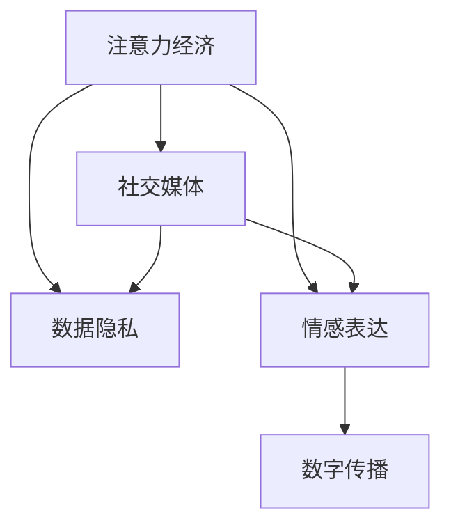

                 

# 注意力经济与个人情感表达方式的变迁

> 关键词：注意力经济, 社交媒体, 情感表达, 数字传播, 数据隐私

## 1. 背景介绍

### 1.1 问题由来
随着互联网和数字技术的飞速发展，注意力经济（Attention Economy）逐渐成为现代经济的重要组成部分。在信息爆炸的时代，注意力成为稀缺资源，谁能吸引和保持用户的注意力，就能在市场中占据优势地位。与此同时，随着社交媒体的兴起，个人情感表达方式也发生了深刻的变化，社交平台成为了个人情感表达的重要渠道。本文旨在探讨注意力经济与个人情感表达方式变迁之间的关系，分析其对数字传播和社会影响的影响。

### 1.2 问题核心关键点
注意力经济与个人情感表达方式的变迁涉及以下几个核心关键点：
1. 社交媒体平台如何利用算法和个性化推荐系统吸引用户注意力。
2. 个人如何在社交媒体上表达情感，这种表达方式如何影响公共舆论和社会关系。
3. 数据隐私问题在注意力经济和个人情感表达中的角色和影响。
4. 数字传播技术如何改变信息的获取和传播方式，进而影响个人情感表达和社会互动。

## 2. 核心概念与联系

### 2.1 核心概念概述

为更好地理解注意力经济与个人情感表达方式变迁之间的关系，本节将介绍几个密切相关的核心概念：

- 注意力经济（Attention Economy）：指在信息过载的时代，通过吸引和保持用户注意力创造经济价值的过程。注意力成为稀缺资源，谁能获取更多注意力，谁就能获得更大的市场份额和收益。
- 社交媒体（Social Media）：指通过数字平台连接用户、分享信息的社交网络，如微博、微信、Facebook等。社交媒体不仅是一个信息传播渠道，也是一个情感表达的空间。
- 情感表达（Emotional Expression）：指个人通过文字、图片、视频等形式，在社交媒体上表达自己的情感和态度。情感表达在社交媒体上扮演着重要角色，影响着公共舆论和社会关系。
- 数据隐私（Data Privacy）：指个人在数字世界中的数据收集、使用和保护问题。随着社交媒体的发展，个人数据隐私问题日益突出，如何平衡数据收集与隐私保护成为重要议题。
- 数字传播（Digital Communication）：指通过数字技术，如互联网、移动通信等，进行信息传播的过程。数字传播改变了信息的获取和传播方式，影响了个人情感表达和社会互动。

这些核心概念之间的逻辑关系可以通过以下Mermaid流程图来展示：



这个流程图展示了几大核心概念之间的联系：

1. 注意力经济通过吸引和保持用户注意力，创造经济价值。
2. 社交媒体作为信息传播渠道和情感表达空间，扮演着双重角色。
3. 数据隐私与情感表达密切相关，用户数据在社交媒体上被广泛收集和分析。
4. 数字传播技术改变了信息的获取和传播方式，影响着情感表达和社会互动。

## 3. 核心算法原理 & 具体操作步骤
### 3.1 算法原理概述

在社交媒体平台上，注意力经济与个人情感表达方式变迁主要通过以下几个算法和机制实现：

- 个性化推荐算法：通过分析用户行为数据，推荐可能吸引用户注意力的内容。
- 情感分析算法：通过自然语言处理技术，分析用户情感表达，预测公共舆论趋势。
- 用户生成内容（UGC）算法：鼓励用户生成内容，利用用户参与度吸引更多注意力。
- 隐私保护算法：通过数据匿名化、加密等技术，保护用户数据隐私。

这些算法和机制共同构成了社交媒体平台的运行基础，使得注意力经济和个人情感表达方式得以实现。

### 3.2 算法步骤详解

以下是社交媒体平台利用注意力经济吸引用户注意力、进行个性化推荐的主要步骤：

**Step 1: 用户数据收集**
- 社交媒体平台收集用户的浏览记录、点击行为、点赞评论等数据。
- 通过机器学习模型分析用户行为模式，生成用户画像。

**Step 2: 个性化推荐**
- 根据用户画像，生成个性化推荐列表。
- 利用协同过滤、内容推荐等算法，选择可能吸引用户注意力的内容。
- 实时推送个性化推荐，吸引用户停留和互动。

**Step 3: 情感分析**
- 利用自然语言处理技术，分析用户发布的文本内容。
- 通过情感分析模型，判断用户情感倾向。
- 根据情感倾向，调整推荐内容，影响公共舆论。

**Step 4: 隐私保护**
- 对用户数据进行匿名化、加密处理，防止数据泄露。
- 设置隐私控制选项，允许用户自行管理个人数据。

通过以上步骤，社交媒体平台能够有效吸引和保持用户注意力，同时分析用户情感表达，保护用户数据隐私，实现注意力经济和个人情感表达方式的变迁。

### 3.3 算法优缺点

社交媒体平台的个性化推荐和情感分析算法具有以下优点：
1. 提升用户参与度：通过个性化推荐，吸引用户停留和互动，提升用户粘性。
2. 预测公共舆论：通过情感分析，预测公共舆论趋势，帮助品牌进行舆情管理。
3. 保护用户隐私：通过隐私保护算法，确保用户数据安全，增强用户信任。

同时，这些算法也存在一些局限性：
1. 数据偏见：个性化推荐和情感分析算法可能受到数据偏见的影响，产生误导性结果。
2. 过度推荐：过度推荐可能使用户产生信息过载，降低用户体验。
3. 隐私风险：虽然隐私保护技术不断进步，但用户数据仍存在泄露风险。
4. 算法黑盒：个性化推荐和情感分析算法的复杂性使其难以解释，用户难以理解决策过程。

尽管存在这些局限性，但社交媒体平台通过不断优化算法和机制，依然能够有效地吸引用户注意力，分析用户情感表达，保护用户隐私，推动注意力经济和个人情感表达方式的变迁。

### 3.4 算法应用领域

个性化推荐和情感分析算法在社交媒体平台上的应用广泛，主要涵盖以下几个领域：

- 新闻推荐：根据用户兴趣推荐新闻，提高用户参与度。
- 广告投放：通过情感分析判断用户情感倾向，精准投放广告。
- 用户生成内容（UGC）：鼓励用户生成内容，利用UGC吸引更多用户关注。
- 舆情监测：分析用户情感表达，预测公共舆论趋势，帮助品牌管理舆情。

除了以上领域，社交媒体平台还通过不断探索新的算法和机制，推动注意力经济和个人情感表达方式的进一步变迁。

## 4. 数学模型和公式 & 详细讲解 & 举例说明

### 4.1 数学模型构建

社交媒体平台的个性化推荐和情感分析算法通常基于以下数学模型构建：

1. 个性化推荐算法：
   - 协同过滤（Collaborative Filtering）：
     \[
     P(x_i,y_j) = \frac{1}{\sum_k p_{ik}p_{kj}}\sum_k p_{ik}p_{kj}\frac{r_{ik}}{p_{ik}}
     \]
     其中，\( p_{ik} \) 为项目 \( i \) 被用户 \( k \) 的评分，\( r_{ik} \) 为预测评分。
   - 基于内容的推荐（Content-Based Recommendation）：
     \[
     P(x_i,y_j) = \prod_{k=1}^d \frac{t_{ik}t_{kj}}{\sum_l t_{il}t_{lj}}
     \]
     其中，\( t_{ik} \) 为项目 \( i \) 的特征向量，\( t_{kj} \) 为用户 \( k \) 的特征向量。

2. 情感分析算法：
   - 基于情感词典的情感分析：
     \[
     E(x) = \sum_{i=1}^n w_ix_i
     \]
     其中，\( x_i \) 为文本中第 \( i \) 个词的情感得分，\( w_i \) 为情感词权重。
   - 基于深度学习的情感分析：
     \[
     E(x) = \text{sigmoid}(Wx + b)
     \]
     其中，\( W \) 为权重矩阵，\( b \) 为偏置向量。

### 4.2 公式推导过程

**协同过滤算法推导**：
设 \( R \) 为训练集，\( U \) 为用户集合，\( I \) 为物品集合，\( P_{ui} \) 为物品 \( i \) 被用户 \( u \) 的评分。协同过滤算法通过用户-物品评分矩阵 \( M \) 进行推荐。首先，利用归一化项 \( p_{ik} \) 和 \( p_{kj} \) 计算用户 \( u \) 和物品 \( j \) 的相似度：
\[
p_{ik} = \frac{r_{ik}}{p_{ik}}, \quad p_{kj} = \frac{r_{kj}}{p_{kj}}
\]
然后，利用相似度 \( p_{ik} \) 和 \( p_{kj} \) 计算物品 \( j \) 的预测评分：
\[
P(x_i,y_j) = \frac{1}{\sum_k p_{ik}p_{kj}}\sum_k p_{ik}p_{kj}\frac{r_{ik}}{p_{ik}}
\]

**基于内容的推荐算法推导**：
设 \( T_i \) 为物品 \( i \) 的特征向量，\( T_k \) 为用户 \( k \) 的特征向量。基于内容的推荐算法通过计算物品 \( i \) 和用户 \( k \) 的相似度，从而进行推荐：
\[
P(x_i,y_j) = \prod_{k=1}^d \frac{t_{ik}t_{kj}}{\sum_l t_{il}t_{lj}}
\]

**情感分析算法推导**：
基于情感词典的情感分析通过计算文本中情感词的权重和得分，进行情感分析：
\[
E(x) = \sum_{i=1}^n w_ix_i
\]
基于深度学习的情感分析通过 sigmoid 函数计算文本的情感得分：
\[
E(x) = \text{sigmoid}(Wx + b)
\]

### 4.3 案例分析与讲解

以下以情感分析算法为例，详细讲解其在社交媒体平台上的应用：

**案例背景**：
某社交媒体平台希望通过分析用户发布的文本内容，预测公共舆论趋势，优化广告投放策略。

**算法实现**：
1. **数据预处理**：对用户发布文本进行分词、去停用词、词干化等处理，构建特征向量。
2. **情感词典构建**：使用情感词典或用户自定义情感词典，为每个词赋情感得分。
3. **情感分析模型训练**：使用基于情感词典的情感分析模型或深度学习模型，训练情感分类器。
4. **情感分析应用**：将新发布文本输入情感分类器，预测文本情感倾向，优化广告投放策略。

**案例分析**：
- **情感词典**：情感词典的使用使得情感分析算法具有较好的可解释性和可重复性。
- **深度学习模型**：深度学习模型通过学习大量文本数据，能够捕捉更加复杂的情感特征，提升情感分析的准确性。
- **广告投放**：通过情感分析，平台可以预测用户对广告的情感倾向，优化广告投放策略，提升广告效果。

## 5. 项目实践：代码实例和详细解释说明

### 5.1 开发环境搭建

在进行情感分析算法实践前，我们需要准备好开发环境。以下是使用Python进行情感分析的开发环境配置流程：

1. 安装Python：从官网下载并安装Python，选择最新版本。
2. 安装相关库：
   - `nltk`：自然语言处理库，用于文本预处理和情感分析。
   - `numpy`：数值计算库，用于矩阵运算。
   - `scikit-learn`：机器学习库，用于模型训练和评估。
3. 配置虚拟环境：
   ```bash
   python -m venv venv
   source venv/bin/activate
   ```

完成上述步骤后，即可在虚拟环境中开始情感分析算法的实践。

### 5.2 源代码详细实现

以下是一个基于情感词典的情感分析算法的Python代码实现：

```python
from nltk.corpus import stopwords
from nltk.tokenize import word_tokenize
from collections import Counter
import nltk

# 下载并载入情感词典
nltk.download('vader_lexicon')
from nltk.sentiment.vader import SentimentIntensityAnalyzer

# 定义情感词典
nltk.download('punkt')
nltk.download('stopwords')

def sentiment_analysis(text):
    # 分词、去停用词、词干化
    stop_words = set(stopwords.words('english'))
    words = word_tokenize(text)
    words = [word.lower() for word in words if word.isalpha() and word.lower() not in stop_words]
    words = nltk.stem.SnowballStemmer('english').stem(w) for w in words

    # 构建情感词典
    sia = SentimentIntensityAnalyzer()
    scores = Counter()

    for word in words:
        polarity = sia.polarity_scores(word)
        if polarity['sentiment'] >= 0.5:
            scores[word] += 1
        elif polarity['sentiment'] <= -0.5:
            scores[word] -= 1

    # 计算情感得分
    score = sum(scores.values()) / len(scores)

    return score

# 测试代码
text = "I love this product! It's amazing!"
score = sentiment_analysis(text)
print(score)
```

### 5.3 代码解读与分析

让我们再详细解读一下关键代码的实现细节：

**sentiment_analysis函数**：
- **分词和去停用词**：使用nltk库的`word_tokenize`和`stopwords`模块进行文本分词和去停用词处理。
- **词干化**：使用nltk库的`SnowballStemmer`对分词后的单词进行词干化处理。
- **情感词典构建**：使用nltk库的`SentimentIntensityAnalyzer`构建情感词典，并对每个单词进行情感得分计算。
- **情感得分计算**：对情感得分进行累加和平均计算，得到最终的情感得分。

**测试代码**：
- **文本输入**：定义测试文本，进行情感分析。
- **输出结果**：打印情感得分，情感得分为正则表示文本情感倾向为正面，得分为负则表示情感倾向为负面。

## 6. 实际应用场景

### 6.1 社交媒体情感分析

在社交媒体平台上，情感分析算法被广泛应用于用户情感表达的分析和情感倾向的预测。社交媒体平台可以通过情感分析算法，实时监测用户对某个事件的情感倾向，预测公共舆论，优化广告投放和内容推荐策略。

### 6.2 舆情监测和舆情管理

舆情监测和舆情管理是政府和企业的重要任务。通过情感分析算法，可以快速获取和分析海量文本数据，预测公共舆论趋势，帮助决策者及时应对舆情变化，优化舆情管理策略。

### 6.3 情感驱动的产品推荐

情感分析算法还可以用于个性化推荐系统，根据用户情感倾向推荐产品。例如，电商平台可以根据用户对某个产品的情感倾向，推荐类似产品或进行情感营销，提升用户满意度和购买率。

### 6.4 未来应用展望

随着情感分析技术的不断发展，其在社交媒体、舆情监测、产品推荐等领域的应用将进一步深化。未来，情感分析算法将在以下方面取得突破：

1. **深度学习模型的应用**：深度学习模型通过学习大量文本数据，能够捕捉更加复杂的情感特征，提升情感分析的准确性。
2. **多模态情感分析**：结合文本、语音、视频等多模态数据，提升情感分析的全面性和准确性。
3. **实时情感分析**：利用流式计算技术，实现实时情感分析，及时监测用户情感变化。
4. **跨文化情感分析**：研究不同文化背景下的情感表达方式，提升情感分析的跨文化适应性。

## 7. 工具和资源推荐

### 7.1 学习资源推荐

为了帮助开发者系统掌握情感分析的理论基础和实践技巧，这里推荐一些优质的学习资源：

1. 《自然语言处理综论》：由斯坦福大学李飞飞教授所著，全面介绍了自然语言处理的基本概念和前沿技术，包括情感分析在内。
2. 《情感分析：理论与应用》：详细讲解了情感分析的算法原理和应用场景，是情感分析的入门必读书籍。
3. Coursera情感分析课程：由斯坦福大学开设的在线课程，系统讲解情感分析的算法和实践，适合初学者和进阶者。
4 Kaggle情感分析竞赛：通过参加情感分析竞赛，实战练习情感分析算法，提升算法应用能力。

### 7.2 开发工具推荐

情感分析算法的开发离不开优质的工具支持。以下是几款用于情感分析开发的常用工具：

1. NLTK：自然语言处理工具包，包含情感分析、文本预处理、词性标注等功能。
2. TextBlob：基于NLTK的情感分析库，提供了简单易用的API，适合快速实现情感分析功能。
3. spaCy：自然语言处理库，支持文本分词、命名实体识别、情感分析等功能，性能优越。
4. Scikit-learn：机器学习库，支持情感分类器训练和评估。

### 7.3 相关论文推荐

情感分析技术的发展源于学界的持续研究。以下是几篇奠基性的相关论文，推荐阅读：

1. "Sentiment Analysis with Deep Learning Techniques"（情感分析深度学习技术）：提出基于深度学习模型的情感分析方法，通过多层神经网络捕捉情感特征。
2. "Bag of Words Models for Sentiment Analysis"（情感分析词袋模型）：基于词袋模型进行情感分析，适用于文本较短的情况。
3. "Opinion Mining and Sentiment Analysis"（意见挖掘和情感分析）：全面介绍了情感分析的理论基础和实践应用，适合深入学习情感分析技术。

## 8. 总结：未来发展趋势与挑战

### 8.1 总结

本文对注意力经济与个人情感表达方式的变迁进行了全面系统的介绍。首先阐述了注意力经济和个人情感表达方式在社交媒体平台上的重要性，详细讲解了个性化推荐和情感分析算法的原理和步骤，给出了情感分析算法的完整代码实例。同时，本文还探讨了情感分析在社交媒体、舆情监测、产品推荐等领域的实际应用，展示了情感分析技术的巨大潜力。

通过本文的系统梳理，可以看到，社交媒体平台通过个性化推荐和情感分析算法，吸引和保持用户注意力，分析用户情感表达，推动了注意力经济和个人情感表达方式的变迁。未来的情感分析技术将不断进步，成为社交媒体、舆情监测、产品推荐等领域的重要工具。

### 8.2 未来发展趋势

展望未来，情感分析技术将呈现以下几个发展趋势：

1. **深度学习模型的应用**：深度学习模型通过学习大量文本数据，能够捕捉更加复杂的情感特征，提升情感分析的准确性。
2. **多模态情感分析**：结合文本、语音、视频等多模态数据，提升情感分析的全面性和准确性。
3. **实时情感分析**：利用流式计算技术，实现实时情感分析，及时监测用户情感变化。
4. **跨文化情感分析**：研究不同文化背景下的情感表达方式，提升情感分析的跨文化适应性。

这些趋势凸显了情感分析技术的广阔前景。情感分析技术将在社交媒体、舆情监测、产品推荐等领域发挥越来越重要的作用，影响人类的情感表达和社会互动。

### 8.3 面临的挑战

尽管情感分析技术已经取得了显著成就，但在迈向更加智能化、普适化应用的过程中，它仍面临诸多挑战：

1. **数据偏见**：情感分析算法可能受到数据偏见的影响，产生误导性结果。如何消除数据偏见，提升算法公正性，是重要研究方向。
2. **情感表达多样性**：不同文化背景和语境下的情感表达方式各异，如何统一情感表达方式，提升算法的泛化能力，需要进一步探索。
3. **隐私保护**：情感分析算法需要收集和分析大量用户数据，如何保护用户隐私，防止数据泄露，是重要课题。
4. **情感理解的复杂性**：情感分析算法的复杂性使得其难以解释，用户难以理解算法的决策过程。如何提升情感分析的可解释性，增强用户信任，是重要研究方向。

尽管存在这些挑战，但情感分析技术的持续发展将有助于解决这些问题，推动情感分析技术在更多领域的应用。

### 8.4 研究展望

未来的情感分析研究将需要从以下几个方面寻求新的突破：

1. **深度学习模型的应用**：深度学习模型在情感分析中的应用将继续深化，提升情感分析的准确性和鲁棒性。
2. **多模态情感分析**：结合文本、语音、视频等多模态数据，提升情感分析的全面性和准确性。
3. **实时情感分析**：利用流式计算技术，实现实时情感分析，及时监测用户情感变化。
4. **跨文化情感分析**：研究不同文化背景下的情感表达方式，提升情感分析的跨文化适应性。

这些研究方向将推动情感分析技术在更多领域的应用，提升用户情感表达的深度和广度，推动人类社会的多元化发展。

## 9. 附录：常见问题与解答

**Q1：情感分析算法如何处理情感表达的多样性？**

A: 情感表达的多样性是情感分析的难点之一。情感分析算法通过以下几个方法处理情感表达的多样性：
1. **情感词典构建**：使用多种情感词典，涵盖不同文化背景和语境下的情感表达方式。
2. **多模态融合**：结合文本、语音、视频等多模态数据，提升情感分析的全面性和准确性。
3. **上下文理解**：利用上下文信息，理解情感表达的语境和背景，提升情感分析的准确性。

**Q2：情感分析算法在实际应用中需要注意哪些问题？**

A: 情感分析算法在实际应用中需要注意以下几个问题：
1. **数据偏见**：情感分析算法可能受到数据偏见的影响，产生误导性结果。需要采用去偏方法，提升算法的公正性。
2. **情感表达多样性**：不同文化背景和语境下的情感表达方式各异，需要统一情感表达方式，提升算法的泛化能力。
3. **隐私保护**：情感分析算法需要收集和分析大量用户数据，需要采取隐私保护措施，防止数据泄露。
4. **情感理解的复杂性**：情感分析算法的复杂性使得其难以解释，需要提升情感分析的可解释性，增强用户信任。

**Q3：情感分析算法在社交媒体平台上的实际应用有哪些？**

A: 情感分析算法在社交媒体平台上的实际应用包括：
1. **情感驱动的内容推荐**：根据用户情感倾向推荐内容，提升用户满意度和平台粘性。
2. **舆情监测和舆情管理**：通过情感分析，快速获取和分析海量文本数据，预测公共舆论，优化舆情管理策略。
3. **广告投放优化**：通过情感分析，预测用户对广告的情感倾向，优化广告投放策略，提升广告效果。
4. **用户生成内容（UGC）分析**：分析用户生成的内容，了解用户情感倾向和需求，优化平台功能和服务。

---

作者：禅与计算机程序设计艺术 / Zen and the Art of Computer Programming

